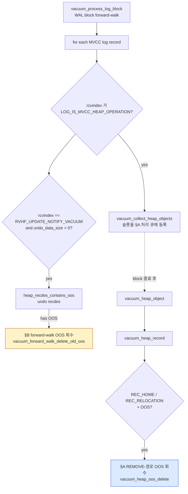
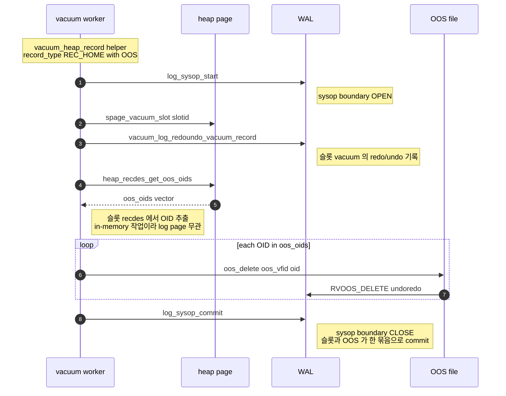
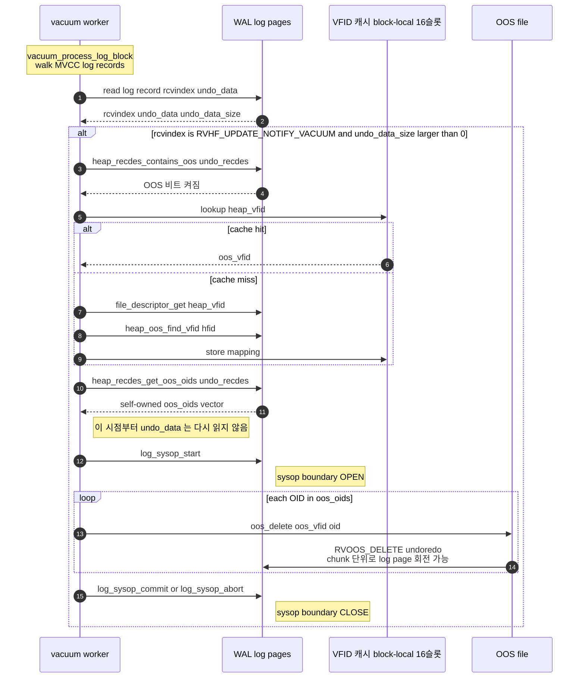
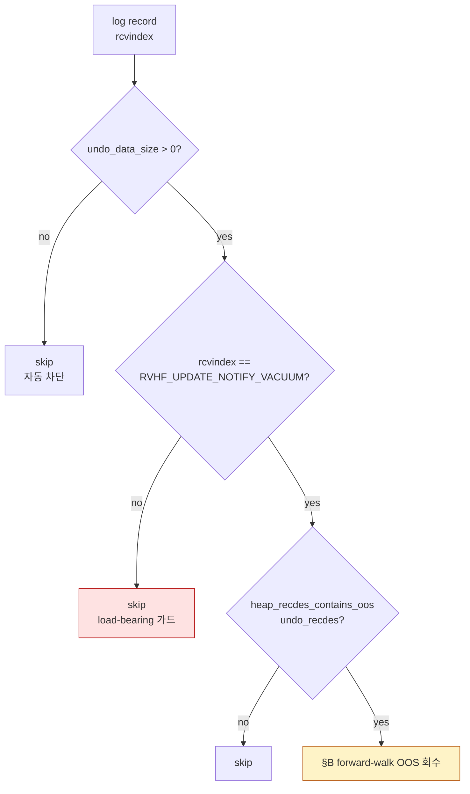
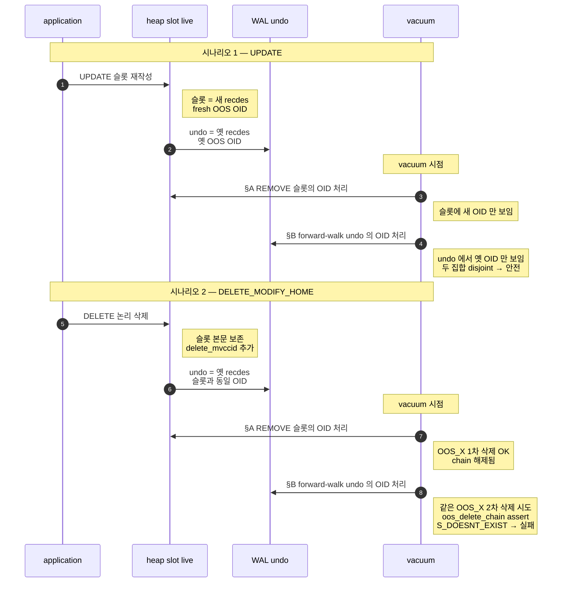

# PR #6986 — vacuum OOS 회수 두 경로 시각화

[CBRD-26668] / [CUBRID/cubrid#6986](https://github.com/CUBRID/cubrid/pull/6986)

본 문서는 vacuum 이 OOS OID 를 회수하는 **두 보완 경로**를 콜스택 + 시퀀스 다이어그램으로 정리한다.

---

## 1. 두 경로의 분담

| 경로 | 트리거 | 회수 대상 OID | 데이터 출처 |
|---|---|---|---|
| **REMOVE 경로** (§A) | `vacuum_heap_record` 가 살아 있는 heap 슬롯을 vacuum 처리 | **현재 슬롯 recdes** 가 가리키는 OOS OID | heap 페이지 슬롯 (in-memory) |
| **forward-walk 경로** (§B) | `vacuum_process_log_block` 가 WAL 의 `RVHF_UPDATE_NOTIFY_VACUUM` 로그를 만남 | UPDATE **pre-image** 가 가리키던 옛 OOS OID | log page 의 undo 페이로드 |

두 경로가 같은 OID 를 두 번 처리하지 않는 이유는 한 가지 invariant 에 있다.

> **UPDATE OID-disjointness invariant**: `heap_attrinfo_insert_to_oos` 는 매 transform 마다 새 OOS OID 를 신규 할당한다. UPDATE 직후 heap 슬롯은 **새 OID** 만 들고 있고, pre-image 의 옛 OID 는 그 어떤 살아 있는 heap 위치에서도 참조되지 않는다.

따라서:
- **REMOVE 경로**는 살아 있는 슬롯에서만 OID 를 본다. UPDATE 로 사라진 옛 OID 에는 닿지 못한다.
- **forward-walk 경로**는 undo 안의 옛 OID 만 본다 (UPDATE 한정). DELETE 처럼 슬롯에 같은 OID 가 살아 있는 케이스는 명시적으로 제외 (`vacuum.c:3690` 가드).

---

## 2. 두 경로의 큰 그림



같은 vacuum block 안에서:
- **§B (forward-walk)** 가 먼저, 로그 줄 단위로 즉시 처리.
- **§A (REMOVE)** 는 collected heap object 큐를 block 끝에 한꺼번에 처리.

---

## 3. §A — REMOVE 경로 (heap 슬롯 vacuum 시 OOS 회수)

### 3.1 트리거 조건

vacuum 이 살아 있는 heap 슬롯의 MVCC 가시성 임계값 (`global_oldest_visible`) 을 넘어선 버전을 vacuum 대상으로 판정. 그 슬롯의 recdes 에 `OR_MVCC_FLAG_HAS_OOS` 비트가 켜져 있고, REC_HOME / REC_RELOCATION 타입이면 진입.

### 3.2 콜스택

```
vacuum_master_task::execute        // 또는 SA_MODE 의 vacuum_sa_run_job
└─ vacuum_process_log_block(block)
   ├─ [forward-walk pass: §B 참조]
   └─ vacuum_heap (block 끝, collected oid 처리)
      └─ vacuum_heap_object(oid)
         └─ vacuum_heap_page(page)
            └─ vacuum_heap_record(helper)              // helper->record_type 분기
               │
               ├─ REC_HOME + OOS:
               │  └─ vacuum_heap_record_remove_oos_inline(helper)
               │     ├─ vacuum_log_redoundo_vacuum_record(...)   // 슬롯 vacuum 로그
               │     ├─ log_sysop_start                          // ── sysop boundary 시작
               │     ├─ vacuum_heap_oos_delete(helper)
               │     │  ├─ heap_recdes_get_oos_oids(record, &oids) // 슬롯 데이터에서 추출
               │     │  └─ for each OID:
               │     │     └─ oos_delete(thread_p, oos_vfid, oid)
               │     │        └─ per-chunk RVOOS_DELETE undoredo append
               │     └─ log_sysop_commit                         // ── sysop boundary 종료
               │
               └─ REC_RELOCATION + OOS:
                  // 기존 sysop 이미 열려 있음 (REC_RELOCATION 처리 일환)
                  └─ vacuum_heap_oos_delete(helper)
                     └─ ... (위와 동일)
```

> **핵심 설계 포인트**: REC_HOME 경로는 "bulk vacuum + 별도 OOS sysop" 대신 **슬롯 vacuum 로그까지 sysop 안에 끌어들이는** inline 처리. bulk 경로 시 sysop commit 후 bulk flush 전 crash → OOS 는 사라졌는데 슬롯은 여전히 같은 OOS 를 가리키는 dangling 상태가 발생할 수 있어 그것을 막기 위함.

### 3.3 시퀀스 다이어그램



---

## 4. §B — forward-walk 경로 (UPDATE 로그 walk 시 옛 pre-image OOS 회수)

### 4.1 트리거 조건

- vacuum 이 WAL block 을 정방향으로 훑으며 매 MVCC 로그 레코드를 검사.
- `rcvindex == RVHF_UPDATE_NOTIFY_VACUUM` AND `undo_data != NULL && undo_data_size > 0`.
- undo 페이로드를 RECDES 로 해석. `heap_recdes_contains_oos()` 가 true 면 진입.
- **block 단위 16-슬롯 VFID 캐시** 로 heap_vfid → oos_vfid 매핑을 amortize.

### 4.2 콜스택

```
vacuum_master_task::execute
└─ vacuum_process_log_block(block)
   └─ for each MVCC log record in block:
      └─ if (rcvindex == RVHF_UPDATE_NOTIFY_VACUUM
             && undo_data != NULL
             && undo_data_size > 0
             && heap_recdes_contains_oos(undo_recdes)):
         │
         ├─ vacuum_oos_vfid_cache_lookup(cache, heap_vfid, &oos_vfid)
         │  ├─ (cache hit) → return oos_vfid
         │  └─ (cache miss):
         │     ├─ file_descriptor_get(heap_vfid, &fd)
         │     ├─ heap_oos_find_vfid(fd.heap.hfid, &oos_vfid, false)
         │     └─ (성공 시) cache 에 저장
         │
         ├─ heap_recdes_get_oos_oids(undo_recdes, &oos_oids)   // self-owned vector 로 복사
         │
         └─ vacuum_forward_walk_delete_old_oos(oos_vfid, oos_oids)
            ├─ log_sysop_start                                  // ── sysop boundary 시작
            ├─ for each OID in oos_oids (이미 self-owned):
            │  └─ oos_delete(oos_vfid, oid)
            │     └─ per-chunk RVOOS_DELETE undoredo append; log page 회전 가능
            └─ log_sysop_commit / log_sysop_abort               // ── sysop boundary 종료
```

> **defensive copy 가 불필요한 이유**: `oos_delete` 가 chunk 마다 log page 를 회전시켜 원래 `undo_data` 포인터가 무효화될 수 있다. 하지만 `vacuum_forward_walk_delete_old_oos` **진입 전에** OID 를 self-owned `OID_VECTOR` 로 한 번 복사해두므로, 이후 루프는 그 벡터만 참조하지 `undo_data` 에 다시 접근하지 않는다.

### 4.3 시퀀스 다이어그램



---

## 5. rcvindex 결정 매트릭스 (forward-walk 진입 판정)



| rcvindex | undo 에 pre-image | 차단 메커니즘 |
|---|---|---|
| `RVHF_UPDATE_NOTIFY_VACUUM` | O | (통과) |
| `RVHF_MVCC_DELETE_MODIFY_HOME` | O | **load-bearing rcvindex 가드** (REMOVE 경로와 더블 삭제 방지) |
| `RVHF_MVCC_INSERT` | X | undo_data_size > 0 |
| `RVHF_MVCC_DELETE_REC_HOME` | X | undo_data_size > 0 |
| `RVHF_MVCC_NO_MODIFY_HOME` | X | undo_data_size > 0 |
| `RVHF_MVCC_REDISTRIBUTE` | X | undo_data_size > 0 |

---

## 6. DELETE 와 UPDATE 비교 — 왜 DELETE 는 §B 에서 차단되어야 하는가



→ DELETE 케이스에서 §B 가 동작하지 않도록 `vacuum.c:3690` 의 `rcvindex == RVHF_UPDATE_NOTIFY_VACUUM` 가드가 **반드시 필요**하다.

---

## 7. 참고

- 코드 위치 (commit `977cf18a4` 기준):
  - §A REMOVE 진입: `vacuum_heap_record_remove_oos_inline` (vacuum.c:2450)
  - §B forward-walk 진입 가드: vacuum.c:3690
  - §B 헬퍼: `vacuum_forward_walk_delete_old_oos` (vacuum.c:3455)
  - VFID 캐시: `vacuum_oos_vfid_cache_lookup` (vacuum.c:3403)
- 관련 문서: [PR-6986-explanation.md](./PR-6986-explanation.md), [PR-6986-dangling-oos-analysis.md](./PR-6986-dangling-oos-analysis.md)
