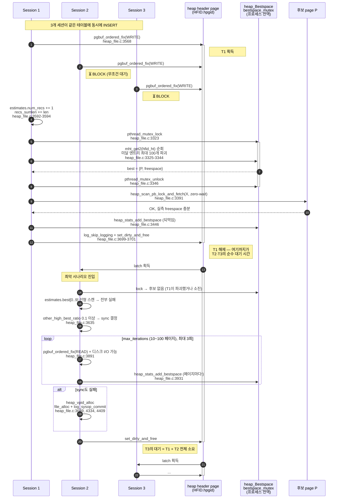
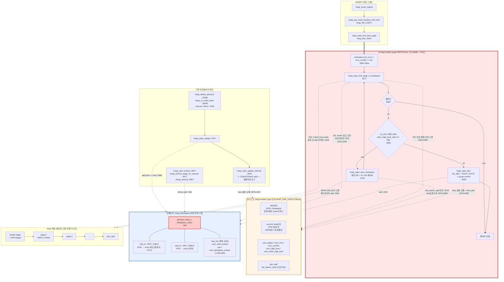

# AS-IS: Legacy bestspace 구조 분석 (CBRD-26176 이전)

| 항목 | 값 |
|------|-----|
| 분석 기준 리비전 | `e84a7f6dc^` = `b63fbc5dc` ([CBRD-27069] Gate the remote INSERT SELECT subquery semantic pass to the sink form (#7471)) |
| 대체한 PR | #7353 — `e84a7f6dcd175e6ce85ceddb9a16036170cbe405` "[CBRD-26176] Redesign bestspace" (2026-07-22 merge) |
| 작성일 | 2026-07-28 |
| 작성 주체 | claude-fable-5 |
| 주 분석 대상 | `src/storage/heap_file.c` (26,882 lines), `src/storage/heap_file.h` (726 lines) |

## 이 문서를 읽는 법

모든 코드 인용은 `heap_file.c:<line>@e84a7f6dc^` 형식이며, 라인 번호는 다음 명령의 출력 기준입니다.

```
git show 'e84a7f6dc^:src/storage/heap_file.c'
```

`heap_file.c` 이외 파일은 `<파일경로>:<line>@e84a7f6dc^`로 표기했습니다.
코드 근거 없이 저자가 추론한 부분은 모두 **[추정]** 태그를 달았습니다.

---

## 0. 30초 요약

CUBRID heap 파일에 레코드를 INSERT하려면 "이 레코드가 들어갈 여유 공간이 있는 페이지"를 먼저 찾아야 합니다.
legacy 구조는 그 후보 목록(bestspace)을 **두 계층**으로 관리했습니다.

1. **온디스크 계층** — heap 파일의 header page(HFID의 첫 페이지) 안에 있는 `HEAP_HDR_STATS.estimates` 구조.
   최대 10개(`HEAP_NUM_BEST_SPACESTATS`)짜리 원형 배열 `best[]` + 10개짜리 `second_best[]` 힌트 큐.
2. **인메모리 계층** — 서버 프로세스 전역 단 하나뿐인 `heap_Bestspace` 해시 캐시.
   HFID→entry, VPID→entry 두 개의 `MHT_TABLE`을 **단일 `pthread_mutex_t` 하나**로 보호.

병목의 본질은 두 가지가 겹친 것입니다.

- **(A) heap header page의 WRITE latch**: 모든 INSERT는 `heap_stats_find_best_page()`에서 header page를 `PGBUF_LATCH_WRITE`로 잡고
  (`heap_file.c:3568@e84a7f6dc^`), 페이지를 찾고, 필요하면 heap 전체를 스캔하고(`sync`), 필요하면 새 페이지를 할당한 뒤
  (`heap_file.c:3689@e84a7f6dc^`) 비로소 놓습니다(`heap_file.c:3701@e84a7f6dc^`).
  즉 **한 heap 파일(=한 클래스/파티션)에 대한 INSERT의 "위치 결정" 단계는 동시성이 정확히 1**입니다.
- **(B) 전역 bestspace mutex**: (A) 아래에서 다시 프로세스 전역 mutex를 잡습니다(`heap_file.c:3323@e84a7f6dc^`).
  이건 heap 파일이 서로 달라도 공유되므로, 서로 무관한 테이블끼리도 경합합니다.

---

## 1. 용어와 배경

| 용어 | 의미 |
|------|------|
| HFID | Heap File IDentifier. `{VFID vfid; INT32 hpgid;}` — `hpgid`가 heap header page의 pageid (`storage_common.h:192-197@e84a7f6dc^`) |
| VPID | `{int32_t pageid; short volid;}`, 8바이트 (`dbtype_def.h:956-961@e84a7f6dc^`) |
| heap header page | HFID가 가리키는 heap 파일의 첫 페이지. slot `HEAP_HEADER_AND_CHAIN_SLOTID`에 `HEAP_HDR_STATS` 레코드가 들어있음 |
| heap chain page | 그 외 모든 heap 페이지. 같은 slot에 `HEAP_CHAIN`(prev/next VPID 링크)이 들어있음 → heap은 **단일 연결 리스트** |
| bestspace | "지금 여유 공간이 넉넉한 페이지"에 대한 힌트. **정확할 필요가 없고 로깅되지 않음** |
| `HEAP_DROP_FREE_SPACE` | `(int)(DB_PAGESIZE * 0.3)` — 이보다 여유가 적으면 bestspace 후보에서 탈락 (`heap_file.h:103@e84a7f6dc^`) |
| unfill_space | `DB_PAGESIZE * PRM_ID_HF_UNFILL_FACTOR`. UPDATE 여유분으로 남겨두는 공간 (`heap_file.c:5345@e84a7f6dc^`) |

핵심 설계 전제는 헤더 주석에 명시돼 있습니다 — estimates 배열의 값 변경은 **로깅하지 않으며, 언제든 부정확할 수 있고,
중복된 페이지가 들어있을 수도 있다** (`heap_file.c:227-230@e84a7f6dc^`).

---

## 2. 온디스크 계층: `HEAP_HDR_STATS`

### 2.1 구조체 전문 (`heap_file.c:196-235@e84a7f6dc^`)

```c
typedef struct heap_hdr_stats HEAP_HDR_STATS;
struct heap_hdr_stats
{
  /* the first must be class_oid */
  OID class_oid;
  VFID ovf_vfid;		/* Overflow file identifier (if any) */
  VPID next_vpid;		/* Next page (i.e., the 2nd page of heap file) */
  int unfill_space;		/* Stop inserting when page has run below this. leave it for updates */
  struct
  {
    int num_pages;
    int num_recs;
    float recs_sumlen;
    int num_other_high_best;
    int num_high_best;
    int num_substitutions;
    int num_second_best;
    int head_second_best;
    int tail_second_best;
    int head;
    VPID last_vpid;		/* todo: move out of estimates */
    VPID full_search_vpid;
    VPID second_best[HEAP_NUM_BEST_SPACESTATS];
    HEAP_BESTSPACE best[HEAP_NUM_BEST_SPACESTATS];
  } estimates;
  int reserve0_for_future;
  int reserve1_for_future;
  int reserve2_for_future;
};
```

`HEAP_BESTSPACE`는 헤더에 있습니다 (`heap_file.h:119-124@e84a7f6dc^`).

```c
struct heap_bestspace
{
  VPID vpid;			/* Vpid of one of the best pages */
  int freespace;		/* Estimated free space in this page */
};
```

### 2.2 필드별 의미와 크기

`HEAP_NUM_BEST_SPACESTATS == 10` (`heap_file.c:188@e84a7f6dc^`).

| 필드 | 크기(B) | 의미 | 갱신 지점 |
|------|--------:|------|-----------|
| `class_oid` | 8 | 이 heap의 클래스 OID. **반드시 첫 필드**여야 함(주석 `heap_file.c:199@e84a7f6dc^`) — `HEAP_CHAIN`도 첫 필드가 `class_oid`라서 header/chain 구분 없이 클래스를 읽을 수 있음 | `heap_create_internal` `heap_file.c:5341`, `heap_reuse` `heap_file.c:5670` |
| `ovf_vfid` | 8 | overflow(BIGONE 레코드) 파일 VFID | `heap_file.c:5342`, `heap_file.c:5713` |
| `next_vpid` | 8 | heap 링크드 리스트의 2번째 페이지 | `heap_vpid_alloc` `heap_file.c:4346`, `heap_vpid_remove` `heap_file.c:4553` |
| `unfill_space` | 4 | 페이지당 남겨둘 여유 공간(바이트) | `heap_file.c:5345`, `heap_file.c:5714` |
| `estimates.num_pages` | 4 | heap 페이지 수 **추정치**. 정확한 값이 필요하면 file manager에 물어보라는 주석 (`heap_file.c:206-207`) | `heap_vpid_alloc` `+1` `heap_file.c:4379`, `sync` 재설정 `heap_file.c:3999` |
| `estimates.num_recs` | 4 | 레코드 수 추정치 | **모든 INSERT마다 `+1`** `heap_file.c:3592` |
| `estimates.recs_sumlen` | 4 | 레코드 총 길이 추정치(float) | **모든 INSERT마다 `+= needed_space`** `heap_file.c:3594` |
| `estimates.num_other_high_best` | 4 | `best[]`에 못 들어갔지만 `HEAP_DROP_FREE_SPACE` 이상 여유가 있을 것으로 믿는 페이지 수 | `heap_file.c:3096`, `4392`, `3998`, `4011-4016` |
| `estimates.num_high_best` | 4 | `best[]` 중 실제로 여유 있는 항목 수. 0이 되고 `num_other_high_best`가 남아 있으면 새로 찾아나섬 | `heap_file.c:3091`, `3883`, `3988`, `4385` |
| `estimates.num_substitutions` | 4 | best 항목 교체 횟수 카운터. **1000번마다 한 번만** second_best에 넣기 위한 샘플링 카운터 | `heap_file.c:3152`, `3179` |
| `estimates.num_second_best` | 4 | second_best 원형 큐의 유효 항목 수 (0~10) | `heap_file.c:3167`, `3205` |
| `estimates.head_second_best` | 4 | second_best 큐 head 인덱스 (꺼내는 쪽) | `heap_file.c:3162`, `3206` |
| `estimates.tail_second_best` | 4 | second_best 큐 tail 인덱스 (넣는 쪽) | `heap_file.c:3157` |
| `estimates.head` | 4 | `best[]` **원형 배열의 head 인덱스**. 다음 탐색/삽입 시작점 | 여러 곳. `heap_file.c:3107`, `3987`, `4382`, `4534` |
| `estimates.last_vpid` | 8 | heap 마지막 페이지 VPID. `todo: move out of estimates` 주석이 붙어 있음(estimates와 달리 이건 로깅됨) | `heap_vpid_alloc` `heap_file.c:4378`, `heap_vpid_remove` `heap_file.c:4541` |
| `estimates.full_search_vpid` | 8 | "전체 스캔"을 이어서 할 때의 재개 지점 커서 | `heap_stats_sync_bestspace` `heap_file.c:3915` |
| `estimates.second_best[10]` | 80 | 2순위 힌트 VPID 원형 큐 | `heap_stats_put_second_best` `heap_file.c:3156` |
| `estimates.best[10]` | 120 | 1순위 후보 `{VPID, freespace}` 원형 배열 | 다수 |
| `reserve0/1/2_for_future` | 12 | 미사용 예약 |

크기 검증(x86-64, 4바이트 정렬): `sizeof(HEAP_BESTSPACE) == 12`, `sizeof(estimates) == 256`,
**`sizeof(HEAP_HDR_STATS) == 296`**.
(구조체 정의를 그대로 옮겨 컴파일해 확인. `heap_vpid_alloc`이 `log_append_undoredo_data(..., sizeof(HEAP_HDR_STATS), ...)`로
전체를 undo/redo 로깅하므로 이 크기가 곧 로그 레코드 크기 — `heap_file.c:4407-4408@e84a7f6dc^`.)

### 2.3 원형 배열 인덱스 매크로 (`heap_file.c:190-194@e84a7f6dc^`)

```c
#define HEAP_STATS_NEXT_BEST_INDEX(i)   \
  (((i) + 1) % HEAP_NUM_BEST_SPACESTATS)
#define HEAP_STATS_PREV_BEST_INDEX(i)   \
  (((i) == 0) ? (HEAP_NUM_BEST_SPACESTATS - 1) : ((i) - 1));
```

`HEAP_STATS_PREV_BEST_INDEX`의 정의 끝에 **세미콜론이 포함**돼 있습니다. 매크로 정의에 `;`가 들어간 건
`x = HEAP_STATS_PREV_BEST_INDEX(y);` 형태의 호출에서 빈 문장이 하나 생긴다는 뜻이고, `if (...) x = MACRO(y); else ...`
같은 문맥에서는 컴파일 에러가 납니다. 실제 사용처는 `heap_file.c:3779`, `heap_file.c:3789` 두 곳뿐이고 둘 다 단순 대입문이라
현상은 없습니다. **재작성 시 이런 잔재를 그대로 옮기지 마세요.**

### 2.4 second_best 큐의 특이한 샘플링 규칙

`heap_stats_put_second_best()`는 호출될 때마다 넣는 게 아니라, **1000번 호출당 1번만** 넣습니다
(`heap_file.c:3152@e84a7f6dc^`).

```c
if (heap_hdr->estimates.num_substitutions++ % 1000 == 0)
```

주석의 근거는 "연속된 페이지가 비워지는 시나리오"에서 무작위성을 높이기 위함입니다 (`heap_file.c:3143-3145@e84a7f6dc^`).
그런데 넣고 난 뒤 카운터를 `heap_hdr->estimates.num_substitutions = 1;`로 **리셋**합니다 (`heap_file.c:3179@e84a7f6dc^`).
`0`이 아니라 `1`이므로, 첫 호출(0 → 조건 성립) 이후로는 정확히 1000번 간격이 아니라 999번마다 성립합니다.
동작상 차이는 무시할 수준이지만, 의도한 값인지 코드만으로는 확정 불가합니다. **[추정]** 리셋을 `1`로 한 것은
`num_substitutions++`의 후위 증가와 헷갈린 결과로 보입니다.

### 2.5 온디스크 estimates의 초기값 (`heap_create_internal`, `heap_file.c:5340-5379@e84a7f6dc^`)

```c
memset (&heap_hdr, 0, sizeof (heap_hdr));
...
heap_hdr.estimates.num_pages = 1;
heap_hdr.estimates.best[0].vpid = {hfid->vfid.volid, hfid->hpgid};   /* header page 자신 */
heap_hdr.estimates.best[0].freespace = spage_max_space_for_new_record (...);
heap_hdr.estimates.head = 1;
/* best[1..9] = NULL/0 */
heap_hdr.estimates.num_high_best = 1;
heap_hdr.estimates.last_vpid        = {volid, hpgid};
heap_hdr.estimates.full_search_vpid = {volid, hpgid};
```

즉 **heap header page 자체도 레코드를 담는 데이터 페이지**이며, 갓 만든 heap의 유일한 best 후보입니다.

---

## 3. 인메모리 계층: `heap_Bestspace`

### 3.1 구조 (`heap_file.c:474-483@e84a7f6dc^`)

```c
typedef struct heap_stats_bestspace_cache HEAP_STATS_BESTSPACE_CACHE;
struct heap_stats_bestspace_cache
{
  int num_stats_entries;	/* number of cache entries in use */
  MHT_TABLE *hfid_ht;		/* HFID Hash table for best space */
  MHT_TABLE *vpid_ht;		/* VPID Hash table for best space */
  int free_list_count;		/* number of entries in free */
  HEAP_STATS_ENTRY *free_list;
  pthread_mutex_t bestspace_mutex;
};
```

엔트리 (`heap_file.c:237-243@e84a7f6dc^`):

```c
struct heap_stats_entry
{
  HFID hfid;			/* heap file identifier */
  HEAP_BESTSPACE best;		/* best space info */
  HEAP_STATS_ENTRY *next;	/* free_list 연결용 */
};
```

전역 인스턴스는 **서버 프로세스당 정확히 하나**입니다 (`heap_file.c:503-505@e84a7f6dc^`).

```c
static HEAP_STATS_BESTSPACE_CACHE heap_Bestspace_cache_area = { 0, NULL, NULL, 0, NULL, PTHREAD_MUTEX_INITIALIZER };
static HEAP_STATS_BESTSPACE_CACHE *heap_Bestspace = NULL;
```

**하나의 엔트리가 두 해시 테이블에 동시에 등록**됩니다.

- `vpid_ht`: key = `&ent->best.vpid` → 유일성 보장 (한 페이지당 엔트리 1개). 조회용 `mht_get`.
- `hfid_ht`: key = `&ent->hfid` → **의도적으로 중복 키 허용**. 한 HFID 아래 여러 페이지 엔트리가 체인으로 매달림. 순회용 `mht_get2`.

키 포인터가 엔트리 내부를 가리키므로, 엔트리를 free하기 전에 반드시 두 테이블에서 모두 제거해야 합니다.
`assert (mht_count (vpid_ht) == mht_count (hfid_ht))`가 add/del 모든 경로 끝에 붙어 있는 이유입니다
(`heap_file.c:1112`, `1153`, `1191`, `1228`).

### 3.2 해시 함수 (`heap_file.c:942-992@e84a7f6dc^`)

```c
static unsigned int
heap_hash_vpid (const void *key_vpid, unsigned int htsize)
{
  const VPID *vpid = (VPID *) key_vpid;
  return ((vpid->pageid | ((unsigned int) vpid->volid) << 24) % htsize);
}

static unsigned int
heap_hash_hfid (const void *key_hfid, unsigned int htsize)
{
  const HFID *hfid = (HFID *) key_hfid;
  return ((hfid->hpgid | ((unsigned int) hfid->vfid.volid) << 24) % htsize);
}
```

`+`가 아니라 **비트 OR(`|`)** 입니다. `pageid`가 24비트를 넘으면 volid 비트와 겹칩니다. 또 `hfid_ht`의 키는
`hpgid`와 `volid`만 쓰고 `vfid.fileid`는 쓰지 않습니다. `heap_compare_hfid`는 `HFID_EQ`로 전체를 비교하므로
정확성 문제는 없지만, **해시 분산 품질은 낮습니다**.

초기 테이블 크기는 `HEAP_STATS_ENTRY_MHT_EST_SIZE == 1000` (`heap_file.c:103@e84a7f6dc^`)이고,
엔트리는 최대 100만 개까지 들어갈 수 있으므로(§3.4) `mht_rehash`가 **bestspace mutex를 잡은 채** 반복적으로 일어납니다
(`memory_hash.c:1775@e84a7f6dc^`: `ht->nentries > ht->rehash_at && ht->ncollisions > (ht->nentries * 0.05)` 조건).

### 3.3 진입점 함수 목록

| 함수 | 라인 | 역할 | mutex |
|------|------|------|-------|
| `heap_stats_bestspace_initialize` | `15857-15899` | 두 해시 테이블 생성, mutex init. `heap_manager_initialize`에서 호출(`5158`) | — |
| `heap_stats_bestspace_finalize` | `15907-15953` | 전체 해제. `heap_manager_finalize`에서 호출(`5192`) | — |
| `heap_stats_add_bestspace` | `1029-1119` | (HFID, VPID, freespace) 등록 또는 freespace 갱신 | 잡음 |
| `heap_stats_del_bestspace_by_vpid` | `1167-1198` | 페이지 1개 무효화 | 잡음 |
| `heap_stats_del_bestspace_by_hfid` | `1127-1159` | heap 1개 전체 무효화 (루프로 모두 제거) | 잡음 |
| `heap_stats_get_bestspace_by_vpid` | `1207-1233` | **`ENABLE_UNUSED_FUNCTION` 가드 안 — 죽은 코드** | 잡음 |
| `heap_stats_find_page_in_bestspace` | `3277-3507` | 실제 탐색. 내부에서 직접 mutex를 잡고 hfid_ht를 순회 | 잡음 |
| `heap_stats_entry_free` | `1000-1024` | 엔트리를 free_list에 반납(최대 1000개) 또는 `free_and_init` | **안 잡음** (호출자가 이미 보유) |
| `heap_get_best_space_num_stats_entries` | `26202-26205` | `num_stats_entries` 반환. perf monitor가 호출(`perf_monitor.c:4056`) | **안 잡음** — race read |

### 3.4 `heap_stats_add_bestspace` 상세 (`heap_file.c:1029-1119@e84a7f6dc^`)

```c
rc = pthread_mutex_lock (&heap_Bestspace->bestspace_mutex);

ent = (HEAP_STATS_ENTRY *) mht_get (heap_Bestspace->vpid_ht, vpid);
if (ent)
  {
    ent->best.freespace = freespace;      /* 이미 있으면 갱신만 */
    goto end;
  }

if (heap_Bestspace->num_stats_entries >= prm_get_integer_value (PRM_ID_HF_MAX_BESTSPACE_ENTRIES))
  {
    er_set (ER_NOTIFICATION_SEVERITY, ARG_FILE_LINE, ER_HF_MAX_BESTSPACE_ENTRIES, 1, ...);
    perfmon_inc_stat (thread_p, PSTAT_HF_NUM_STATS_MAXED);
    ent = NULL;
    goto end;                              /* 그냥 포기 */
  }
```

`PRM_ID_HF_MAX_BESTSPACE_ENTRIES`는 `max_bestspace_entries` 파라미터입니다
(`system_parameter.c:1198-1208@e84a7f6dc^`).

```
(PRM_FOR_SERVER | PRM_HIDDEN | PRM_USER_CHANGE), PRM_INTEGER
default = 1000000 /* 110 M */
```

숨김 파라미터이고 기본값 100만, 주석은 대략 110MB를 상정합니다.
`sizeof(HEAP_STATS_ENTRY)`는 HFID(12→패딩 후 12) + HEAP_BESTSPACE(12) + 포인터(8) ≈ **32바이트**이므로
엔트리 자체만 32MB, `MHT_TABLE`의 `HENTRY` 노드가 엔트리당 두 개씩 더 붙습니다. **[추정]** 주석의 110M은
해시 노드까지 포함한 어림치로 보입니다.

### 3.5 eviction 정책 — 사실상 "없음"

이 부분이 재작성 시 가장 오해하기 쉬운 지점입니다. **legacy 캐시에는 LRU도, clock도, age 기반 축출도 없습니다.**
엔트리가 사라지는 경로는 다음 넷뿐입니다.

| # | 경로 | 라인 | 성격 |
|---|------|------|------|
| 1 | 탐색 중 "여유 부족" 판정 | `heap_file.c:3335-3343` | **탐색 부작용에 의한 파괴** (아래 상세) |
| 2 | 페이지 fix 실패(예상 못한 에러) | `heap_file.c:3421` | 정합성 복구 |
| 3 | 페이지 deallocate | `heap_file.c:4674` (`heap_vpid_remove`), `heap_file.c:4977` (`heap_remove_page_on_vacuum`) | 필수 무효화 |
| 4 | heap 단위 폐기 | `heap_file.c:5332` (`heap_create_internal`), `5857` (`xheap_destroy`), `5901` (`xheap_destroy_newly_created`) | 필수 무효화 |

용량이 꽉 차면(§3.4) **새 항목이 그냥 버려집니다.** 오래된 항목을 밀어내지 않습니다.
따라서 한번 100만 개가 차면, 위 4가지 제거 경로가 돌기 전까지 캐시는 "굳어버린" 상태가 됩니다.
`PSTAT_HF_NUM_STATS_MAXED` (`Num_heap_stats_bestspace_maxed`, `perf_monitor.c:386@e84a7f6dc^`)가
이 상황의 관측 지표입니다.

경로 1이 특히 문제입니다 (`heap_file.c:3325-3344@e84a7f6dc^`).

```c
while (notfound_cnt < BEST_PAGE_SEARCH_MAX_COUNT
       && (ent = (HEAP_STATS_ENTRY *) mht_get2 (heap_Bestspace->hfid_ht, hfid, NULL)) != NULL)
  {
    if (ent->best.freespace >= needed_space)
      {
        best = ent->best;
        break;                      /* 찾음 — 엔트리는 남겨둠 */
      }

    /* remove in memory bestspace */
    (void) mht_rem2 (heap_Bestspace->hfid_ht, &ent->hfid, ent, NULL, NULL);
    (void) mht_rem (heap_Bestspace->vpid_ht, &ent->best.vpid, NULL, NULL);
    (void) heap_stats_entry_free (thread_p, ent, NULL);
    ent = NULL;
    heap_Bestspace->num_stats_entries--;
    notfound_cnt++;
  }
```

여기서 세 가지를 짚어야 합니다.

**(a) `mht_get2(..., NULL)`은 항상 체인의 첫 항목을 돌려줍니다.**
`last == NULL`이면 첫 매치에서 즉시 반환합니다 (`memory_hash.c:1542-1545@e84a7f6dc^`).
그리고 `mht_put_internal`은 새 엔트리를 **버킷 앞에 prepend** 합니다
(`memory_hash.c:1762@e84a7f6dc^`의 `hentry->next = ht->table[hash];` + `memory_hash.c:1768@e84a7f6dc^`의
`ht->table[hash] = hentry;`).
따라서 HFID별 후보 목록은 **LIFO 스택**처럼 동작합니다 — 가장 최근에 add된 페이지가 가장 먼저 시도됩니다.
freespace 크기로 정렬되어 있지 않습니다.

**(b) `needed_space`에 못 미치는 엔트리는 "건너뛰는" 게 아니라 "파괴"됩니다.**
큰 레코드 하나를 INSERT하는 스레드가, 작은 레코드에는 충분했을 후보들을 최대 100개
(`BEST_PAGE_SEARCH_MAX_COUNT`, `heap_file.c:3282@e84a7f6dc^`)까지 지워버립니다.
mixed-size workload에서 캐시 적중률을 무너뜨리는 구조적 원인입니다.

**(c) 찾은 엔트리를 캐시에서 빼지 않습니다.**
`break` 시점에 엔트리는 그대로 남아 있고, mutex는 곧바로 풀립니다(`heap_file.c:3346`).
동시에 진입한 N개 스레드가 **같은 VPID를 받아갑니다.** 그 뒤 각자 그 페이지에 X latch를 시도하고,
1명만 이기고 나머지는 zero-wait로 튕겨 다음 후보로 넘어갑니다(§4.3). 즉 **핫 페이지 convoy**가 설계상 내장돼 있습니다.

### 3.6 free_list (`heap_file.c:1000-1024@e84a7f6dc^`)

```c
if (heap_Bestspace->free_list_count < HEAP_STATS_ENTRY_FREELIST_SIZE)   /* 1000 */
  {
    ent->next = heap_Bestspace->free_list;
    heap_Bestspace->free_list = ent;
    heap_Bestspace->free_list_count++;
  }
else
  {
    free_and_init (ent);
  }
```

`malloc`/`free` 왕복을 줄이려는 최대 1000개짜리 단순 스택입니다. **mutex 보호를 스스로 하지 않고**
호출자가 이미 잡고 있다는 전제로 동작합니다. 유일한 예외가 `heap_stats_bestspace_finalize`의
`mht_map_no_key(NULL, vpid_ht, heap_stats_entry_free, NULL)` (`heap_file.c:15920@e84a7f6dc^`)인데,
이건 서버 종료 시점의 단일 스레드 경로입니다.

### 3.7 캐시 웜업 경로가 없다

**서버 재시작 시 `heap_Bestspace`는 빈 상태로 출발합니다.** 부팅 시 heap을 훑어 캐시를 채우는 코드는 없습니다.
채워지는 건 다음 세 계기뿐입니다.

- INSERT가 실제로 페이지를 fix하고 나서 `heap_stats_add_bestspace`로 되먹임 (`heap_file.c:3446@e84a7f6dc^`)
- `heap_stats_sync_bestspace`의 순차 스캔 도중 발견 (`heap_file.c:3931@e84a7f6dc^`)
- DELETE / vacuum이 공간을 회수하면서 (`heap_stats_update` → `heap_file.c:2986@e84a7f6dc^`)

즉 재시작 직후 첫 INSERT 물결은 전부 온디스크 `best[]` 힌트(최대 10개)에만 의존하고, 그마저 안 맞으면
`heap_stats_sync_bestspace`의 순차 스캔으로 떨어집니다 — **그것도 header page WRITE latch를 쥔 채로.**

---

## 4. INSERT 시 best page 탐색 흐름

### 4.1 호출 체인

```
heap_insert_logical
  └─ heap_get_insert_location_with_lock          heap_file.c:20971
       └─ heap_stats_find_best_page              heap_file.c:20988   ← home hint 없을 때
            ├─ pgbuf_ordered_fix (헤더, WRITE)   heap_file.c:3568    ★ latch 획득
            ├─ heap_stats_find_page_in_bestspace heap_file.c:3608
            │    ├─ pthread_mutex_lock(bestspace_mutex)  heap_file.c:3323
            │    ├─ mht_get2(hfid_ht) 순회 / 미달 항목 파괴
            │    ├─ pthread_mutex_unlock                 heap_file.c:3346
            │    ├─ (해시 미스 시) heap_hdr->estimates.best[] 선형 스캔  heap_file.c:3354-3365
            │    ├─ heap_scan_pb_lock_and_fetch (후보 페이지, X, zero-wait)  heap_file.c:3391
            │    └─ heap_stats_add_bestspace (실측 freespace 되먹임)         heap_file.c:3446
            ├─ heap_stats_sync_bestspace          heap_file.c:3665   ← 조건부, 최대 3회
            ├─ heap_vpid_alloc                    heap_file.c:3689   ← 그래도 없으면 새 페이지
            └─ pgbuf_ordered_set_dirty_and_free   heap_file.c:3701   ★ latch 해제
```

`REC_NEWHOME`(UPDATE로 커진 레코드를 다른 페이지로 재배치) 경로도 같은 함수를 씁니다 —
`heap_find_location_and_insert_rec_newhome` → `heap_file.c:21130@e84a7f6dc^`.
차이는 `isnew_rec` 인자뿐입니다(`true`면 `num_recs++`).

### 4.2 heap header page WRITE latch — 어디서 잡고 어디까지 들고 있는가

**획득** (`heap_file.c:3562-3575@e84a7f6dc^`):

```c
  vpid.volid = hfid->vfid.volid;
  vpid.pageid = hfid->hpgid;
  ...
  error_code = pgbuf_ordered_fix (thread_p, &vpid, OLD_PAGE, PGBUF_LATCH_WRITE, &hdr_page_watcher);
```

watcher는 그 직전에 `PGBUF_ORDERED_HEAP_HDR` 랭크로 초기화됩니다 (`heap_file.c:3551@e84a7f6dc^`).
이 랭크는 ordered-fix 우선순위 enum의 **0번, 즉 최상위**입니다 (`page_buffer.h:222-229@e84a7f6dc^`).
ordered fix가 데드락 회피를 위해 페이지를 풀었다 다시 잡을 때도 **헤더는 계속 붙들고 있으려 한다**는 뜻입니다.

주석은 의도를 이렇게 적어놨습니다 (`heap_file.c:3553-3560@e84a7f6dc^`):

```
   * Get the heap header in exclusive mode since it is going to be changed.
   *
   * Note: to avoid any possibilities of deadlocks, I should not have any locks
   *       on the heap at this moment.
   *       That is, we must assume that locking the header of the heap in
   *       exclusive mode, the rest of the heap is locked.
```

마지막 문장이 핵심입니다 — **"헤더를 X로 잡는다 = heap 전체를 잡는다고 간주하라."**
설계자가 이 직렬화를 인지하고 있었다는 명시적 증거입니다.

**해제** (`heap_file.c:3699-3701@e84a7f6dc^`):

```c
  addr_hdr.pgptr = hdr_page_watcher.pgptr;
  log_skip_logging (thread_p, &addr_hdr);
  pgbuf_ordered_set_dirty_and_free (thread_p, &hdr_page_watcher);
```

에러 경로에서는 각 `goto error` 직전에 개별적으로 `pgbuf_ordered_unfix`합니다
(`heap_file.c:3584`, `3613`, `3668`, `3692`).

**latch 아래에서 직렬화되는 작업 전부:**

| 순서 | 작업 | 라인 | 비용 |
|------|------|------|------|
| 1 | `spage_get_record(PEEK)`로 `HEAP_HDR_STATS` 포인터 획득 | `3581-3588` | 메모리 |
| 2 | `estimates.num_recs += 1` | `3592` | 메모리 — **INSERT마다 헤더를 dirty로 만듦** |
| 3 | `estimates.recs_sumlen += needed_space` | `3594` | 메모리 |
| 4 | `total_space = needed_space + slot_overhead + unfill_space` | `3597-3601` | 메모리 |
| 5 | `heap_stats_find_page_in_bestspace` — **전역 mutex + 최대 100회 해시 탐색 + 후보 페이지 X latch 시도(디스크 I/O 가능)** | `3608` | **높음** |
| 6 | (실패 시) `other_high_best_ratio` 계산 | `3624-3633` | 메모리 |
| 7 | (조건 충족 시) `heap_stats_sync_bestspace` **최대 3회** — heap 순차 스캔, 페이지마다 READ latch + 잠재적 디스크 I/O | `3657-3673` | **매우 높음** |
| 8 | (그래도 실패 시) `heap_vpid_alloc` — `file_alloc` + 새 페이지 초기화 + `log_sysop_start/commit` + `RVHF_STATS` undoredo 296B×2 | `3689` | **매우 높음** |
| 9 | `log_skip_logging` + `set_dirty_and_free` | `3699-3701` | 메모리 |

2·3번 때문에 **best 페이지를 즉시 찾는 최선의 경우에도 WRITE latch는 반드시 필요합니다.**
읽기 전용으로 힌트만 보고 지나갈 수 있는 fast path가 존재하지 않습니다.

### 4.3 `heap_stats_find_page_in_bestspace` 내부 (`heap_file.c:3277-3507@e84a7f6dc^`)

전체 탐색을 감싸는 첫 동작이 **트랜잭션 lock wait 시간을 0으로 바꾸는 것**입니다
(`heap_file.c:3307-3308@e84a7f6dc^`).

```c
  /* LK_FORCE_ZERO_WAIT doesn't set error when deadlock occurs */
  old_wait_msecs = xlogtb_reset_wait_msecs (thread_p, LK_FORCE_ZERO_WAIT);
```

`page_buffer.c`가 이 값을 명시적으로 알고 있습니다 (`page_buffer.c:12329-12340@e84a7f6dc^`).

```c
      wait_msecs = pgbuf_find_current_wait_msecs (thread_p);
      if (wait_msecs == LK_ZERO_WAIT || wait_msecs == LK_FORCE_ZERO_WAIT)
	{
	  if (er_status == NO_ERROR)
	    {
	      /* LK_FORCE_ZERO_WAIT is used in some page scan functions (e.g. heap_stats_find_page_in_bestspace) to
	       * skip busy pages; here we return an error code (which means the page was not fixed), however no error
	       * is set : this allows scan of pages to continue */
	      assert (wait_msecs == LK_FORCE_ZERO_WAIT);
	      er_status = ER_LK_PAGE_TIMEOUT;
	    }
	  goto exit;
	}
```

즉 **"바쁜 페이지는 기다리지 않고 건너뛴다"**가 명시적 설계입니다. 주석이 트레이드오프까지 적어놨습니다 —
"This will improve some contentions on the heap at the expenses of storage" (`heap_file.c:3302-3305@e84a7f6dc^`).
**경합을 저장 공간 낭비와 맞바꾼 것**입니다. 여러 스레드가 같은 페이지를 두고 튕기면 결국 새 페이지를 할당하게 되고,
heap이 필요 이상으로 커집니다.

복원은 반드시 함수 끝에서 (`heap_file.c:3503@e84a7f6dc^`):

```c
  (void) xlogtb_reset_wait_msecs (thread_p, old_wait_msecs);
```

**탐색 루프 구조:**

```
while (found == NOTFOUND)
  ├─ best.freespace = -1; best_hint_is_used = false;
  ├─ [1차] hash_is_available 이면 → 전역 mutex 잡고 hfid_ht 순회 (§3.5)
  ├─ [2차] 여전히 best.freespace == -1 이면
  │     → heap_hdr->estimates.best[best_array_index .. 9] 선형 스캔, best_hint_is_used = true
  ├─ 그래도 -1 이면 break (탐색 실패)
  ├─ er_errid() 정리  (fix 실패 판정을 오염시키지 않기 위해)      heap_file.c:3377-3389
  ├─ heap_scan_pb_lock_and_fetch(best.vpid, X_LOCK, zero-wait)     heap_file.c:3391
  │     ├─ NULL → er_errid() 분기: NO_ERROR면 그냥 다음 후보 / INTERRUPTED면 ERROR / 그 외 무효화 + ERROR
  │     └─ 성공 → spage_max_space_for_new_record로 **실측**       heap_file.c:3432
  │           ├─ 충분하면 freespace -= record_length + slot_overhead; found = FOUND
  │           ├─ heap_stats_add_bestspace로 실측값 되먹임          heap_file.c:3446
  │           ├─ best_hint_is_used면 heap_hdr의 해당 슬롯도 갱신   heap_file.c:3454
  │           └─ 부족하면 pgbuf_ordered_unfix 후 계속
  └─ NOTFOUND면 best_hint_is_used ? best_array_index++ : notfound_cnt++
```

루프 종료 후 `heap_hdr->estimates.best[]`를 한 번 훑어 (`heap_file.c:3477-3491@e84a7f6dc^`):

- 가장 여유가 적은 슬롯 인덱스를 찾아 `*idx_badspace`로 반환 → 호출자가 `estimates.head`에 대입
  (`heap_stats_find_best_page`가 `&(heap_hdr->estimates.head)`를 그대로 넘김, `heap_file.c:3608@e84a7f6dc^`).
  **즉 다음 탐색은 "가장 나쁜 슬롯"부터 시작합니다** — 그 슬롯이 곧 다음 교체 대상이기 때문입니다.
- 해시에서 찾은 페이지가 온디스크 배열에도 있으면 실측 freespace로 동기화.

**주의할 점:** 온디스크 `best[]` 선형 스캔은 `best_array_index`를 **while 루프 바깥에서** 유지합니다
(`heap_file.c:3312`에서 0으로 초기화, `3468`에서 증가). 해시 경로와 힌트 경로를 오가더라도 힌트 배열은
0→9 방향으로 한 번만 훑습니다. 되감기가 없어서 **한 번의 `find_page_in_bestspace` 호출은 온디스크 힌트 10개를
최대 한 번씩만 시도**합니다.

### 4.4 fallback: `heap_vpid_alloc` (`heap_file.c:4289@e84a7f6dc^`)

후보가 전부 실패하면 새 페이지를 할당합니다. 이 함수는 **헤더 latch를 이미 쥐고 있는 상태에서** 호출됩니다
(`hdr_pgptr` 인자로 받음).

```c
  log_sysop_start (thread_p);                                          /* 4323 */
  ...
  error_code = file_alloc (thread_p, &hfid->vfid, heap_vpid_init_new, &new_page_chain, &vpid, NULL);  /* 4334 */
  ...
  heap_hdr->estimates.last_vpid = vpid;                                /* 4378 */
  heap_hdr->estimates.num_pages++;                                     /* 4379 */

  best = heap_hdr->estimates.head;
  heap_hdr->estimates.head = HEAP_STATS_NEXT_BEST_INDEX (best);        /* 4382 */
  /* 밀려나는 항목이 아직 쓸 만하면 second_best로 강등 */
  ...
  heap_hdr->estimates.best[best].vpid = vpid;
  heap_hdr->estimates.best[best].freespace = DB_PAGESIZE;              /* 4398 */

  if (prm_get_integer_value (PRM_ID_HF_MAX_BESTSPACE_ENTRIES) > 0)
    {
      (void) heap_stats_add_bestspace (thread_p, hfid, &vpid, ...);    /* 4402 — 전역 mutex 재진입 */
    }

  log_append_undoredo_data (thread_p, RVHF_STATS, &addr, sizeof (HEAP_HDR_STATS), sizeof (HEAP_HDR_STATS),
                            &heap_hdr_prev, heap_hdr);                 /* 4407 */
  log_sysop_commit (thread_p);                                         /* 4409 */
```

`heap_hdr_prev`는 함수 진입 시 `HEAP_HDR_STATS heap_hdr_prev = *heap_hdr;`로 통째로 복사한 것입니다
(`heap_file.c:4299@e84a7f6dc^`). 새 페이지 하나당 **296바이트 undo + 296바이트 redo**가 WAL에 실립니다.
주석은 "we really have nothing to lose from logging stats here"라고 정당화합니다 (`heap_file.c:4405@e84a7f6dc^`) —
`last_vpid`만은 정확해야 하기 때문입니다.

여기서 두 가지가 겹칩니다: **헤더 WRITE latch 아래에서 (a) `file_alloc`(디스크 확장 가능) 과
(b) sysop 커밋(WAL flush 가능) 이 일어납니다.** 새 페이지를 할당해야 하는 상황이 잦아지면
(= bestspace가 잘 안 맞으면) latch 보유 시간이 급격히 늘어납니다.

---

## 5. sync 경로: `heap_stats_sync_bestspace`

### 5.1 시그니처와 계약 (`heap_file.c:3713-3735@e84a7f6dc^`)

```c
/*
 *   heap_hdr(in): Heap header (Heap header page should be acquired in
 *                 exclusive mode)
 *   scan_all(in): Scan the whole heap or stop after HEAP_NUM_BEST_SPACESTATS
 *                best pages have been found.
 *   can_cycle(in): True, it allows to go back to beginning of the heap.
 * Note: This function does not do any logging.
 */
static int
heap_stats_sync_bestspace (THREAD_ENTRY * thread_p, const HFID * hfid, HEAP_HDR_STATS * heap_hdr, VPID * hdr_vpid,
			   bool scan_all, bool can_cycle)
```

**"heap header page는 exclusive 모드로 잡혀 있어야 한다"가 계약으로 명시**되어 있습니다.

### 5.2 두 개의 호출 지점

| 호출자 | 라인 | 인자 | 성격 |
|--------|------|------|------|
| `heap_stats_find_best_page` | `heap_file.c:3665` | `scan_all=false, can_cycle=true` | **INSERT 경로에서 조건부** |
| `heap_get_num_objects` | `heap_file.c:9414` | `scan_all=true, can_cycle=true` | 전체 스캔. `SELECT COUNT(*)` 계열 통계 |

**주기적(타이머 기반) sync는 존재하지 않습니다.** 데몬도, 백그라운드 스레드도 없습니다.
전부 요청 스레드가 인라인으로 수행합니다.

### 5.3 INSERT 경로에서 sync가 트리거되는 조건 (`heap_file.c:3624-3673@e84a7f6dc^`)

```c
      if (heap_hdr->estimates.num_other_high_best <= 0 || heap_hdr->estimates.num_pages <= 0)
	{
	  other_high_best_ratio = 0;
	}
      else
	{
	  other_high_best_ratio =
	    (float) heap_hdr->estimates.num_other_high_best / (float) heap_hdr->estimates.num_pages;
	}

      if (try_find >= 2 || other_high_best_ratio < HEAP_BESTSPACE_SYNC_THRESHOLD)
	{
	  break;      /* sync 안 하고 포기 → heap_vpid_alloc으로 */
	}
```

`HEAP_BESTSPACE_SYNC_THRESHOLD == 0.1f` (`heap_file.c:91@e84a7f6dc^`).

정리하면 **sync를 하는 조건**은 다음 둘을 모두 만족할 때입니다.

1. `try_find == 1` (이번 `heap_stats_find_best_page` 호출에서 아직 sync를 시도하지 않음)
2. `num_other_high_best / num_pages >= 0.1` — 즉 **"어딘가에 빈 페이지가 최소 10%는 있다고 믿을 때"**

두 조건 다 **추정치에 기반**합니다. `num_other_high_best`는 로깅되지 않고 부정확할 수 있으므로,
실제로는 빈 페이지가 많은데 sync를 건너뛰고 새 페이지를 할당하는 일이 생깁니다(공간 낭비).
반대도 마찬가지입니다(헛스캔).

sync 자체는 안쪽 do-while로 **1회 실행 + 최대 2회 재시도 = 최대 3회 호출**됩니다 (`heap_file.c:3657-3673@e84a7f6dc^`).

```c
      try_sync = 0;
      do
	{
	  try_sync++;
	  ...
	  num_pages_found = heap_stats_sync_bestspace (thread_p, hfid, heap_hdr, hdr_vpidp, false, true);
	  ...
	}
      while (num_pages_found == 0 && try_sync <= 2);
```

`try_sync`는 0에서 시작해 후위 증가하고 조건이 `try_sync <= 2`이므로, `num_pages_found == 0`이 계속되면
try_sync가 1, 2, 3이 될 때까지 → **최대 3회 실행**됩니다.

바깥 while 루프와의 관계를 정확히 짚어둡니다 (`heap_file.c:3603-3680@e84a7f6dc^`). `try_find`는 루프 진입마다 증가하고
`try_find >= 2`면 sync 블록에 도달하기 전에 `break`합니다. 따라서 **sync 블록은 첫 번째 바깥 반복에서만 실행**되며,
한 번의 `heap_stats_find_best_page` 호출에서 heap 스캔은 **최대 3회**, `heap_stats_find_page_in_bestspace`는
**최대 2회** 수행됩니다.

### 5.4 스캔 범위 제한 (`heap_file.c:3846-3848@e84a7f6dc^`)

```c
  num_iterations = 0;
  max_iterations = MIN ((int) (heap_hdr->estimates.num_pages * 0.2), heap_Find_best_page_limit);
  max_iterations = MAX (max_iterations, HEAP_NUM_BEST_SPACESTATS);
```

`heap_Find_best_page_limit == 100` (`heap_file.c:494@e84a7f6dc^`).
따라서 한 번의 sync가 훑는 페이지 수는 **10 ~ 100** 사이입니다 (`scan_all == false`일 때).
`scan_all == true`(= `heap_get_num_objects`)면 **제한이 없습니다** — heap 전체를 훑습니다.

### 5.5 스캔 시작점 결정 (`heap_file.c:3765-3837@e84a7f6dc^`)

`scan_all == false`일 때, `PRM_ID_HF_MAX_BESTSPACE_ENTRIES > 0`인지에 따라 완전히 갈립니다.

```c
  if (scan_all != true)
    {
      if (prm_get_integer_value (PRM_ID_HF_MAX_BESTSPACE_ENTRIES) > 0)
	{
	  search_all = true;
	  start_pos = -1;
	  next_vpid = heap_hdr->estimates.full_search_vpid;   /* 지난번 멈춘 자리부터 이어서 */
	  start_vpid = next_vpid;
	}
      else
	{
	  /* 힌트 배열의 최근 항목부터 / 없으면 second_best에서 하나 꺼내서 / 그것도 없으면 full_search_vpid */
	}
    }
```

**기본 설정(파라미터 100만 > 0)에서는 항상 `search_all` 경로**를 탑니다. 즉 `best[]`/`second_best[]` 힌트는
sync의 시작점으로 쓰이지 않고, `full_search_vpid` 커서를 이어받아 heap을 원형으로 순회합니다.
커서는 스캔 중 매 페이지마다 전진합니다 (`heap_file.c:3912-3916@e84a7f6dc^`).

```c
	  if (search_all)
	    {
	      /* Save the last position to be searched next time. */
	      heap_hdr->estimates.full_search_vpid = next_vpid;
	    }
```

`can_cycle == true`(INSERT 경로)면 끝에 도달했을 때 heap 앞으로 되돌아옵니다 (`heap_file.c:3852-3861@e84a7f6dc^`),
단 `stopat_vpid`(= 시작점)에 다시 닿으면 멈춥니다.

### 5.6 스캔 본체와 부작용 (`heap_file.c:3863-3949@e84a7f6dc^`)

페이지마다:

```c
	  ret = pgbuf_ordered_fix (thread_p, &vpid, OLD_PAGE_PREVENT_DEALLOC, PGBUF_LATCH_READ, &pg_watcher);
	  ...
	  ret = heap_vpid_next (thread_p, hfid, pg_watcher.pgptr, &next_vpid);
	  ...
	  spage_collect_statistics (pg_watcher.pgptr, &npages, &nrecords, &rec_length);
	  num_pages += npages; num_recs += nrecords; recs_sumlen += rec_length;

	  free_space = spage_max_space_for_new_record (thread_p, pg_watcher.pgptr);

	  if (free_space > HEAP_DROP_FREE_SPACE)
	    {
	      if (prm_get_integer_value (PRM_ID_HF_MAX_BESTSPACE_ENTRIES) > 0)
		{
		  (void) heap_stats_add_bestspace (thread_p, hfid, &vpid, free_space);   /* 전역 mutex! */
		}
	      if (num_high_best < HEAP_NUM_BEST_SPACESTATS)
		{ best_pages_hint_p[best] = {vpid, free_space}; best = NEXT(best); num_high_best++; }
	      else
		{ num_other_best++; }
	    }
	  pgbuf_replace_watcher (thread_p, &pg_watcher, &old_pg_watcher);
```

주목할 점:

- **READ latch만** 잡습니다. 주석: "we do not put any locks on the pages that we are scanning since the best space
  array is only used for hints, and it is OK if it is a little bit wrong" (`heap_file.c:3840-3843@e84a7f6dc^`).
- `pgbuf_replace_watcher`로 **한 페이지 앞선 것을 계속 붙들고** 다음을 잡습니다 — chain 링크를 안전하게 따라가기 위함
  **[추정]**. 즉 스캔 중 동시에 2개 페이지가 fix됩니다.
- 여유 있는 페이지를 찾을 때마다 `heap_stats_add_bestspace`가 **전역 mutex를 잡습니다.**
  최악 100개 페이지 = 최대 100번의 전역 mutex 왕복, 전부 **헤더 WRITE latch 아래에서**.
- `heap_stats_get_min_freespace()` 호출이 주석 처리돼 있고(`heap_file.c:3926-3927@e84a7f6dc^`)
  `free_space > HEAP_DROP_FREE_SPACE`만 봅니다. `heap_stats_update_internal`은 여전히
  `heap_stats_get_min_freespace`를 씁니다(`heap_file.c:3067@e84a7f6dc^`) — **두 경로의 임계값 기준이 서로 다릅니다.**

스캔 종료 후 통계를 갱신합니다 (`heap_file.c:3978-4024@e84a7f6dc^`).

```c
  heap_hdr->estimates.head = best;	/* reinit */
  heap_hdr->estimates.num_high_best = num_high_best;

  if (scan_all == true || heap_hdr->estimates.num_pages <= num_pages)
    { /* 전부 덮어씀 */ }
  else
    {
      heap_hdr->estimates.num_other_high_best -= heap_hdr->estimates.num_high_best;
      if (heap_hdr->estimates.num_other_high_best < num_other_best) { ... = num_other_best; }
      if (num_recs > ...num_recs || recs_sumlen > ...recs_sumlen) { /* 셋 다 교체 */ }
    }
```

`num_other_high_best -= num_high_best` 계산은 이미 위에서 `num_high_best`를 새 값으로 덮어쓴 뒤
(`heap_file.c:3988`) 수행됩니다(`heap_file.c:4011`). 즉 "이전 high_best 개수"가 아니라 "방금 찾은 개수"를 뺍니다.
**[추정]** 이건 의도치 않은 순서 의존으로 보이며, `num_other_high_best`가 실제보다 낙관적으로 유지되어
§5.3의 sync 트리거 조건을 왜곡할 수 있습니다.

### 5.7 조기 종료 시 시작 힌트 삭제 (`heap_file.c:3868-3887@e84a7f6dc^`)

`max_iterations`를 넘겼는데 하나도 못 찾았으면, 스캔을 시작한 힌트 슬롯 자체를 무효화합니다.

```c
	      if (start_pos != -1 && num_high_best == 0)
		{
		  /* Delete a starting VPID. */
		  VPID_SET_NULL (&best_pages_hint_p[start_pos].vpid);
		  best_pages_hint_p[start_pos].freespace = 0;
		  heap_hdr->estimates.num_high_best--;
		}
	      iterate_all = true;
```

단 §5.5에서 봤듯 기본 설정에서는 `start_pos == -1`이므로 **이 정리 코드는 사실상 실행되지 않습니다**
(`PRM_ID_HF_MAX_BESTSPACE_ENTRIES <= 0`으로 명시적으로 끈 경우에만 동작).

---

## 6. bestspace를 건드리는 모든 경로 (전수)

### 6.1 인메모리 캐시 (`heap_Bestspace`)

| 동작 | 호출자 | 라인 | 조건 |
|------|--------|------|------|
| add | `heap_stats_update` | `heap_file.c:2986` | `prev_freespace < freespace` (공간이 늘어난 경우만) |
| add | `heap_stats_find_page_in_bestspace` | `heap_file.c:3446` | 페이지 fix 성공 후 실측값 되먹임 |
| add | `heap_stats_sync_bestspace` | `heap_file.c:3931` | 스캔 중 발견 |
| add | `heap_vpid_alloc` | `heap_file.c:4402` | 새 페이지 |
| add | `heap_reuse` | `heap_file.c:5691` | `DB_PAGESIZE`로 등록 |
| add | `xheap_reclaim_addresses` | `heap_file.c:6359` | compactdb |
| find/evict | `heap_stats_find_page_in_bestspace` | `heap_file.c:3323-3346` | §3.5 |
| del by vpid | `heap_stats_find_page_in_bestspace` | `heap_file.c:3421` | fix 실패 (예상 못한 에러) |
| del by vpid | `heap_vpid_remove` | `heap_file.c:4674` | 페이지 dealloc 직후 |
| del by vpid | `heap_remove_page_on_vacuum` (`heap_file.c:4704`) | `heap_file.c:4977` | vacuum 페이지 회수 |
| del by hfid | `heap_create_internal` | `heap_file.c:5332` | 새 heap이 옛 HFID 재사용 시 잔재 제거 |
| del by hfid | `xheap_destroy` | `heap_file.c:5857` | |
| del by hfid | `xheap_destroy_newly_created` | `heap_file.c:5901` | |
| 검증 순회 | `heap_hfid_isvalid` | `heap_file.c:14679-14705` | **`#if defined(SA_MODE)` 안** — 서버 모드에서는 컴파일 제외 |

### 6.2 온디스크 estimates

| 동작 | 호출자 | 라인 | 비고 |
|------|--------|------|------|
| best 슬롯 교체 | `heap_stats_update_internal` | `heap_file.c:3078-3107` | **CONDITIONAL latch** — 못 잡으면 그냥 포기 |
| num_recs/sumlen 증가 | `heap_stats_find_best_page` | `heap_file.c:3592-3594` | INSERT마다 |
| head 갱신 | `heap_stats_find_page_in_bestspace` (out param) | `heap_file.c:3498` → `3608` | 최악 슬롯으로 |
| 전면 재설정 | `heap_stats_sync_bestspace` | `heap_file.c:3978-4024` | |
| 새 페이지 등록 | `heap_vpid_alloc` | `heap_file.c:4378-4398` | **유일하게 로깅됨** (`RVHF_STATS`) |
| 슬롯 무효화 | `heap_vpid_remove` | `heap_file.c:4528-4542` | 중복 가능성 때문에 break 없이 전부 순회 |
| 슬롯 무효화 | `heap_remove_page_on_vacuum` | `heap_file.c:4859-4876` | best + second_best 둘 다 |
| 초기화 | `heap_create_internal` | `heap_file.c:5340-5379` | |
| 재구축 | `heap_reuse` | `heap_file.c:5681-5737` | `RVHF_STATS` redo 로깅 |
| 재구축 | `xheap_reclaim_addresses` | `heap_file.c:6232-6375` | compactdb |

### 6.3 DELETE / vacuum 되먹임: `heap_stats_update` (`heap_file.c:2971-3012@e84a7f6dc^`)

```c
void
heap_stats_update (THREAD_ENTRY * thread_p, PAGE_PTR pgptr, const HFID * hfid, int prev_freespace)
{
  freespace = spage_get_free_space_without_saving (thread_p, pgptr, &need_update);
  if (prm_get_integer_value (PRM_ID_HF_MAX_BESTSPACE_ENTRIES) > 0)
    {
      if (prev_freespace < freespace)
	{
	  (void) heap_stats_add_bestspace (thread_p, hfid, vpid, freespace);
	}
    }

  if (need_update || prev_freespace <= HEAP_DROP_FREE_SPACE)
    {
      if (freespace > HEAP_DROP_FREE_SPACE)
	{
	  error = heap_stats_update_internal (thread_p, hfid, vpid, freespace);
	  if (error != NO_ERROR)
	    { spage_set_need_update_best_hint (thread_p, pgptr, true); }
	  else if (need_update == true)
	    { spage_set_need_update_best_hint (thread_p, pgptr, false); }
	}
      else if (need_update == true)
	{ spage_set_need_update_best_hint (thread_p, pgptr, false); }
    }
}
```

호출자는 셋입니다.

| 호출자 | 위치 | `prev_freespace` |
|--------|------|------------------|
| `heap_delete_physical` | `heap_file.c:22495` | 삭제 직전 실측값 |
| `heap_rv_undo_insert` | `heap_file.c:16640` | `LOG_ISRESTARTED()`일 때만 |
| vacuum (home page) | `vacuum.c:2616@e84a7f6dc^` | `helper->initial_home_free_space` |
| vacuum (forward page) | `vacuum.c:2433@e84a7f6dc^` | **하드코딩 `0`** |

vacuum의 forward page 경로에는 이런 주석이 붙어 있습니다 (`vacuum.c:2422-2431@e84a7f6dc^`).

```
	       * By checking the freespace > HEAP_DROP_FREE_SPACE condition, heap_Bestspace->bestspace_mutex contention is reduced
	       * and the unnecessarily frequent extraction from heap_Bestspace->vpid_ht due to small free space is prevented in heap_stats_find_page_in_bestspace().
	       * And Passing the prev_freespace argument to 0 is a trick to get heap_stats_add_bestspace() called from heap_stats_update().
	       *
	       * This part will be refactored right away in the related issue, at which time this comment will be removed.
```

**"bestspace_mutex 경합을 줄이기 위한" 임시 방편이고 "관련 이슈에서 곧 리팩터링될 것"이라고 코드에 적혀 있습니다.**
CBRD-26176이 바로 그 "관련 이슈"입니다. 재작성 시 이 주석과 `prev_freespace = 0` 트릭을 반드시 함께 정리해야 합니다.

`heap_stats_update_internal`은 헤더를 **CONDITIONAL로만** 잡습니다 (`heap_file.c:3040-3049@e84a7f6dc^`).

```c
  /*
   * We do not want to wait for the following operation.
   * So, if we cannot lock the page return.
   */
  hdr_pgptr = pgbuf_fix (thread_p, &vpid, OLD_PAGE, PGBUF_LATCH_WRITE, PGBUF_CONDITIONAL_LATCH);
  if (hdr_pgptr == NULL)
    { goto exit_on_error; }
```

즉 **INSERT는 헤더를 무조건 기다리고, DELETE/vacuum의 힌트 갱신은 기다리지 않고 포기합니다.**
그 결과 INSERT 부하가 높을수록 DELETE가 회수한 공간이 온디스크 힌트에 반영되지 못합니다.
함수 헤더 주석이 이 결과를 인정하고 있습니다 (`heap_file.c:2965-2969@e84a7f6dc^`):

```
 *       If we cannot fix a heap header page due to holding it by
 *       others, we will postpone this updating until next deletion.
 *       In this case, unfortunately, if some record is not deleted
 *       from this page in the future, we may not use this page until
 *       heap_stats_sync_bestspace function searches all pages.
```

실패 시 `spage_set_need_update_best_hint(pgptr, true)`로 **페이지 자체에 플래그를 남겨** 다음 기회에 재시도합니다
(`slotted_page.h:78@e84a7f6dc^`, `slotted_page.c:952@e84a7f6dc^`).

---

## 7. 왜 고동시성 INSERT에서 병목인가

### 7.1 경합 지점 3층

```
Layer 1  heap header page WRITE latch     — heap 파일당 1개.  모든 INSERT 필수 통과.
Layer 2  heap_Bestspace->bestspace_mutex  — 서버 전체 1개.   Layer 1 아래에서 잡음.
Layer 3  후보 데이터 페이지 X latch        — zero-wait, 실패해도 진행.  하지만 convoy 유발.
```

Layer 1과 2가 **중첩(nested)** 되어 있다는 게 핵심입니다. Layer 2는 서로 다른 테이블끼리도 공유되므로,
테이블 A에 INSERT하는 스레드가 잡은 전역 mutex 때문에, 테이블 B의 헤더 latch를 이미 쥔 스레드가 대기합니다.
**즉 무관한 두 테이블 사이에 latch 보유 시간이 전파됩니다.**

### 7.2 시퀀스 다이어그램: 동일 heap에 동시 INSERT하는 3개 세션



### 7.3 무엇이 나쁜가 — 항목별

**(1) 대기 시간이 유계가 아니다.**
헤더 latch 보유 시간의 상한은 "해시 탐색 2회(각 최대 100 엔트리) + heap 스캔 최대 3회 × 최대 100페이지 ×
페이지당 디스크 I/O + `file_alloc` + WAL sysop 커밋"입니다 (§4.2 표, §5.3).
대기 큐의 N번째 스레드는 앞선 N-1개의 최악 케이스를 전부 누적해서 기다립니다.

**(2) 가장 흔한 경우조차 WRITE latch가 필요하다.**
`estimates.num_recs += 1`과 `recs_sumlen += needed_space` (`heap_file.c:3592-3594@e84a7f6dc^`) 때문에
**bestspace가 완벽히 적중해도** 헤더를 쓰기로 잡아야 합니다. 이 두 줄이 read-only fast path의 가능성을 원천 차단합니다.
게다가 이 값들은 어차피 로깅되지 않는 추정치입니다 — **정확도를 위해 치르는 비용이 아니라, 그냥 구조상 낭비입니다.**

**(3) 전역 mutex가 헤더 latch 안쪽에 있다.**
락 순서가 `header latch → global mutex`로 고정돼 있어, 전역 mutex의 대기가 곧 헤더 latch 보유 시간 증가로 이어집니다.
그리고 §5.6처럼 sync 루프가 **페이지마다** 전역 mutex를 잡습니다.

**(4) 탐색이 캐시를 파괴한다.**
§3.5(b) — 큰 레코드 INSERT 한 번이 작은 레코드용 후보 100개를 지웁니다.

**(5) 같은 페이지를 여러 스레드가 동시에 받는다.**
§3.5(c) — 후보를 캐시에서 빼지 않으므로 convoy가 생기고, zero-wait로 튕긴 스레드는 결국 새 페이지를 할당해
heap을 부풀립니다 (`heap_file.c:3302-3305@e84a7f6dc^`의 "at the expenses of storage"가 바로 이것).

**(6) 힌트 배열이 10칸뿐이다.**
`HEAP_NUM_BEST_SPACESTATS == 10`. 동시 INSERT 세션이 10개를 넘으면 온디스크 힌트만으로는 절대 분산이 안 됩니다.
인메모리 캐시가 이걸 보완하려던 것이지만, (4)(5) 때문에 제 역할을 못 합니다.

**(7) 캐시 키가 HFID 단위라 파티션/멀티테이블 분산 효과가 없다.**
`hfid_ht`의 해시가 `hpgid | (volid << 24)`뿐이고(§3.2) 테이블 수가 많아도 버킷은 1000개에서 시작합니다.
서로 다른 HFID가 같은 버킷 체인에 섞이면 `mht_get2` 순회가 남의 엔트리까지 훑습니다
(`memory_hash.c:1538-1557@e84a7f6dc^`의 순회는 키 비교로 걸러내지만, 체인 워킹 자체는 mutex 아래에서 일어납니다).

**(8) sync 트리거가 부정확한 추정치에 의존한다.**
§5.3 + §5.6의 `num_other_high_best -= num_high_best` 순서 문제.

---

## 8. legacy 구조 전체 다이어그램



---

## 9. 관측 지점

### 9.1 성능 카운터 (`perf_monitor.c:384-391@e84a7f6dc^`)

| PSTAT 상수 | 표시 이름 | 종류 | 측정 위치 |
|-----------|----------|------|-----------|
| `PSTAT_HEAP_STATS_SYNC_BESTSPACE` | `heap_stats_sync_bestspace` | counter+timer | `heap_file.c:3756`, `4027` |
| `PSTAT_HF_NUM_STATS_ENTRIES` | `Num_heap_stats_bestspace_entries` | single peek | `perf_monitor.c:4056` → `heap_get_best_space_num_stats_entries()` |
| `PSTAT_HF_NUM_STATS_MAXED` | `Num_heap_stats_bestspace_maxed` | single acc | `heap_file.c:1055` — **캐시 포화 횟수** |
| `PSTAT_HF_BEST_SPACE_ADD` | `bestspace_add` | counter+timer | `heap_file.c:1038`, `1116` |
| `PSTAT_HF_BEST_SPACE_DEL` | `bestspace_del` | counter+timer | `heap_file.c:1135/1156`, `1174/1195` |
| `PSTAT_HF_BEST_SPACE_FIND` | `bestspace_find` | counter+timer | `heap_file.c:3322`, `3347` — **해시 구간만** |
| `PSTAT_HF_HEAP_FIND_PAGE_BEST_SPACE` | `heap_find_page_bestspace` | counter+timer | `heap_file.c:3299`, `3504` — `find_page_in_bestspace` 전체 |
| `PSTAT_HF_HEAP_FIND_BEST_PAGE` | `heap_find_best_page` | counter+timer | `heap_file.c:3544`, `3703/3708` — **헤더 latch 구간 전체** |

병목 진단 시 볼 조합: `heap_find_best_page`의 총 시간 ≫ `heap_find_page_bestspace` 이면 sync/alloc 쪽,
`bestspace_find`가 `heap_find_page_bestspace`의 대부분이면 전역 mutex 쪽입니다.

### 9.2 `SHOW HEAP HEADER` (`heap_file.c:18790-18880@e84a7f6dc^`)

온디스크 estimates 전 필드를 노출합니다: `num_pages`, `num_recs`, avg length, `num_high_best`,
`num_other_high_best`, `head`, best 리스트 문자열, `num_second_best`, `head_second_best`, `tail_second_best`,
`num_substitutions`, second_best 리스트, `last_vpid`.
포맷은 `heap_bestspace_to_string` (`heap_file.c:19112@e84a7f6dc^`)이 담당합니다.

### 9.3 디버그 로그 (`heap_file.c:584-585@e84a7f6dc^`)

```c
#define heap_bestspace_log(...) \
  if (prm_get_bool_value (PRM_ID_DEBUG_BESTSPACE)) _er_log_debug (ARG_FILE_LINE, __VA_ARGS__)
```

사용처는 3곳뿐: `heap_file.c:3660` (sync 호출 직전), `3870` (max_iterations 초과), `3967` (sync 결과 요약).

### 9.4 파라미터

| 파라미터 | 기본값 | 정의 |
|---------|-------|------|
| `max_bestspace_entries` (`PRM_ID_HF_MAX_BESTSPACE_ENTRIES`) | 1000000, HIDDEN | `system_parameter.c:1198-1208@e84a7f6dc^` |
| `PRM_ID_DEBUG_BESTSPACE` | bool | `heap_file.c:585@e84a7f6dc^` |
| `PRM_ID_HF_UNFILL_FACTOR` | 0.10 (min 0.0, max 0.3) | `system_parameter.c:1187-1197@e84a7f6dc^` |

`max_bestspace_entries <= 0`으로 설정하면 인메모리 캐시가 통째로 비활성화되고
(`hash_is_available = false`, `heap_file.c:3313@e84a7f6dc^`) 온디스크 10칸 힌트만 씁니다.
이 모드는 §5.5에서 봤듯 sync 시작점 결정 로직도 완전히 다른 분기를 탑니다 — **테스트 시 두 모드를 별개로 봐야 합니다.**

### 9.5 에러 코드

`ER_HF_MAX_BESTSPACE_ENTRIES = -1089` (`error_code.h:1371@e84a7f6dc^`).
`ER_NOTIFICATION_SEVERITY`로 올라가므로 쿼리는 실패하지 않고 로그에만 남습니다 (`heap_file.c:1052@e84a7f6dc^`).

---

## 10. 인수인계 체크리스트

재작성/재검토 시 반드시 확인해야 할 것들입니다.

**정확성 계약**

1. `estimates.best[]`/`second_best[]`/`num_*`는 **로깅되지 않는 힌트**입니다. 단 `heap_vpid_alloc`만은
   `RVHF_STATS`로 구조체 전체(296B)를 undo/redo 로깅합니다 (`heap_file.c:4407@e84a7f6dc^`) —
   `last_vpid`의 정확성이 필요하기 때문입니다. 새 설계에서 `last_vpid`를 estimates에서 분리하라는
   `todo` 주석이 이미 달려 있습니다 (`heap_file.c:223@e84a7f6dc^`).
2. `HEAP_HDR_STATS.class_oid`가 첫 필드여야 한다는 제약 (`heap_file.c:199@e84a7f6dc^`) —
   `HEAP_CHAIN`과의 레이아웃 호환. 구조 변경 시 `heap_get_class_oid_from_page` 계열을 함께 봐야 합니다.
3. `HEAP_HDR_STATS`는 heap header page의 레코드이므로 **크기 변경은 온디스크 포맷 변경**입니다.
   `reserve0/1/2_for_future` 12바이트가 확장 여지로 남아 있습니다.

**동시성 계약**

4. 락 순서: `heap header page latch → heap_Bestspace->bestspace_mutex → 데이터 페이지 latch`.
   새 설계에서 이 순서를 바꾸면 데드락 가능성을 재검토해야 합니다.
5. `heap_stats_sync_bestspace`는 호출자가 헤더를 **exclusive로 쥐고 있어야** 합니다
   (`heap_file.c:3717-3718@e84a7f6dc^`).
6. `heap_stats_entry_free`는 **스스로 mutex를 잡지 않습니다** (`heap_file.c:1000@e84a7f6dc^`).
7. `heap_get_best_space_num_stats_entries`는 mutex 없이 읽습니다 (`heap_file.c:26202@e84a7f6dc^`) —
   perf monitor 전용이라 용인된 race.
8. `xlogtb_reset_wait_msecs(LK_FORCE_ZERO_WAIT)`는 반드시 짝을 맞춰 복원해야 합니다
   (`heap_file.c:3308` ↔ `3503`). 이 값은 `page_buffer.c:12335@e84a7f6dc^`가 이름으로 알고 있습니다 —
   함수명이 바뀌면 그 주석도 갱신 대상입니다.

**정리 대상 잔재**

9. `heap_stats_get_bestspace_by_vpid` — `ENABLE_UNUSED_FUNCTION` 죽은 코드 (`heap_file.c:1200-1234@e84a7f6dc^`).
10. `heap_stats_quick_num_fit_in_bestspace` — 동일 (`heap_file.c:3220-3258@e84a7f6dc^`).
11. `HEAP_STATS_PREV_BEST_INDEX` 매크로 끝의 세미콜론 (`heap_file.c:194@e84a7f6dc^`).
12. `vacuum.c:2419-2433@e84a7f6dc^`의 `prev_freespace = 0` 트릭과 "will be refactored right away in the related
    issue" 주석 — **이 이슈가 CBRD-26176입니다.**
13. `heap_stats_sync_bestspace`에 주석 처리된 `heap_stats_get_min_freespace` 호출
    (`heap_file.c:3926-3927@e84a7f6dc^`) — 임계값 기준이 `heap_stats_update_internal`과 불일치.
14. `heap_hfid_isvalid`의 bestspace 검증 블록이 `#if defined(SA_MODE)`로 막혀 있어
    서버 모드에서는 캐시 정합성 검사가 아예 없습니다 (`heap_file.c:14678-14706@e84a7f6dc^`).

**동작 변경 시 회귀 위험**

15. `max_bestspace_entries <= 0` 경로 (§9.4) — 별도 코드 경로이며 테스트 커버리지가 별개입니다.
16. `xheap_reclaim_addresses`(compactdb, `heap_file.c:6181@e84a7f6dc^`)와
    `heap_reuse`(`heap_file.c:5562@e84a7f6dc^`)는 estimates를 통째로 재구축합니다.
    새 구조에서도 이 두 유틸리티 경로를 반드시 함께 갱신해야 합니다.
17. `heap_get_num_objects`(`heap_file.c:9414@e84a7f6dc^`)는 `scan_all=true`로 **제한 없는 전체 스캔**을 하며,
    이때도 헤더 WRITE latch를 쥡니다. INSERT 병목과 별개의 두 번째 latch 장기 보유 경로입니다.

---

## 부록: 주요 인용 색인

| 심볼 / 개념 | 위치 |
|------------|------|
| `HEAP_BESTSPACE_SYNC_THRESHOLD` (0.1f) | `heap_file.c:91@e84a7f6dc^` |
| `HEAP_STATS_ENTRY_MHT_EST_SIZE` (1000) | `heap_file.c:103@e84a7f6dc^` |
| `HEAP_STATS_ENTRY_FREELIST_SIZE` (1000) | `heap_file.c:104@e84a7f6dc^` |
| `HEAP_NUM_BEST_SPACESTATS` (10) | `heap_file.c:188@e84a7f6dc^` |
| `HEAP_STATS_NEXT/PREV_BEST_INDEX` | `heap_file.c:191-194@e84a7f6dc^` |
| `HEAP_HDR_STATS` | `heap_file.c:196-235@e84a7f6dc^` |
| `HEAP_STATS_ENTRY` | `heap_file.c:237-243@e84a7f6dc^` |
| `HEAP_STATS_BESTSPACE_CACHE` | `heap_file.c:474-483@e84a7f6dc^` |
| `heap_Find_best_page_limit` (100) | `heap_file.c:494@e84a7f6dc^` |
| `heap_Bestspace` 전역 | `heap_file.c:503-505@e84a7f6dc^` |
| `heap_bestspace_log` | `heap_file.c:584-585@e84a7f6dc^` |
| `heap_hash_vpid` / `heap_hash_hfid` | `heap_file.c:942-977@e84a7f6dc^` |
| `heap_stats_entry_free` | `heap_file.c:1000-1024@e84a7f6dc^` |
| `heap_stats_add_bestspace` | `heap_file.c:1029-1119@e84a7f6dc^` |
| `heap_stats_del_bestspace_by_hfid` | `heap_file.c:1127-1159@e84a7f6dc^` |
| `heap_stats_del_bestspace_by_vpid` | `heap_file.c:1167-1198@e84a7f6dc^` |
| `heap_scan_pb_lock_and_fetch` | `heap_file.c:1252-1328@e84a7f6dc^` |
| `heap_stats_get_min_freespace` | `heap_file.c:2923-2954@e84a7f6dc^` |
| `heap_stats_update` | `heap_file.c:2971-3012@e84a7f6dc^` |
| `heap_stats_update_internal` (CONDITIONAL) | `heap_file.c:3025-3135@e84a7f6dc^` |
| `heap_stats_put_second_best` | `heap_file.c:3147-3181@e84a7f6dc^` |
| `heap_stats_get_second_best` | `heap_file.c:3189-3218@e84a7f6dc^` |
| `BEST_PAGE_SEARCH_MAX_COUNT` (100) | `heap_file.c:3282@e84a7f6dc^` |
| `heap_stats_find_page_in_bestspace` | `heap_file.c:3277-3507@e84a7f6dc^` |
| ↳ zero-wait 설정 / 복원 | `heap_file.c:3308` / `3503@e84a7f6dc^` |
| ↳ 전역 mutex 구간 | `heap_file.c:3323-3346@e84a7f6dc^` |
| ↳ 온디스크 힌트 선형 스캔 | `heap_file.c:3354-3365@e84a7f6dc^` |
| `heap_stats_find_best_page` | `heap_file.c:3524-3711@e84a7f6dc^` |
| ↳ **헤더 WRITE latch 획득** | `heap_file.c:3568@e84a7f6dc^` |
| ↳ num_recs / recs_sumlen 갱신 | `heap_file.c:3592-3594@e84a7f6dc^` |
| ↳ sync 트리거 조건 | `heap_file.c:3624-3641@e84a7f6dc^` |
| ↳ **헤더 WRITE latch 해제** | `heap_file.c:3701@e84a7f6dc^` |
| `heap_stats_sync_bestspace` | `heap_file.c:3733-4030@e84a7f6dc^` |
| ↳ max_iterations 산정 | `heap_file.c:3846-3848@e84a7f6dc^` |
| ↳ full_search_vpid 전진 | `heap_file.c:3915@e84a7f6dc^` |
| `heap_vpid_alloc` | `heap_file.c:4289-4419@e84a7f6dc^` |
| `heap_vpid_remove` | `heap_file.c:4445-4689@e84a7f6dc^` (bestspace 관련: `4528-4542`, `4674`) |
| `heap_remove_page_on_vacuum` | `heap_file.c:4704-4990@e84a7f6dc^` (bestspace 관련: `4859-4876`, `4977`) |
| `heap_manager_initialize/finalize` | `heap_file.c:5158` / `5192@e84a7f6dc^` |
| `heap_create_internal` estimates 초기화 | `heap_file.c:5340-5379@e84a7f6dc^` |
| `heap_reuse` | `heap_file.c:5562-5745@e84a7f6dc^` |
| `xheap_destroy` | `heap_file.c:5840-5860@e84a7f6dc^` |
| `xheap_reclaim_addresses` | `heap_file.c:6181-6380@e84a7f6dc^` |
| `heap_get_num_objects` (scan_all=true) | `heap_file.c:9376-9424@e84a7f6dc^` |
| `heap_hfid_isvalid` (SA_MODE만) | `heap_file.c:14665-14706@e84a7f6dc^` |
| `heap_stats_bestspace_initialize` | `heap_file.c:15857-15899@e84a7f6dc^` |
| `heap_stats_bestspace_finalize` | `heap_file.c:15907-15953@e84a7f6dc^` |
| `heap_rv_undo_insert` | `heap_file.c:16604-16646@e84a7f6dc^` |
| SHOW HEAP HEADER 출력 | `heap_file.c:18790-18880@e84a7f6dc^` |
| `heap_bestspace_to_string` | `heap_file.c:19112@e84a7f6dc^` |
| `heap_get_insert_location_with_lock` | `heap_file.c:20971-21092@e84a7f6dc^` |
| `heap_find_location_and_insert_rec_newhome` | `heap_file.c:21108-21175@e84a7f6dc^` |
| `heap_delete_physical` | `heap_file.c:22475-22505@e84a7f6dc^` |
| `heap_get_best_space_num_stats_entries` | `heap_file.c:26202-26205@e84a7f6dc^` |
| `HEAP_DROP_FREE_SPACE` | `heap_file.h:103@e84a7f6dc^` |
| `HEAP_BESTSPACE` 구조체 | `heap_file.h:119-124@e84a7f6dc^` |
| `PGBUF_ORDERED_HEAP_HDR` 랭크 | `page_buffer.h:222-229@e84a7f6dc^` |
| LK_FORCE_ZERO_WAIT 처리 | `page_buffer.c:12329-12340@e84a7f6dc^` |
| `mht_get2` (last==NULL → 첫 매치) | `memory_hash.c:1520-1561@e84a7f6dc^` |
| `mht_put_internal` (버킷 prepend) | `memory_hash.c:1667-1780@e84a7f6dc^` |
| `max_bestspace_entries` 파라미터 | `system_parameter.c:1198-1208@e84a7f6dc^` |
| `ER_HF_MAX_BESTSPACE_ENTRIES` (-1089) | `error_code.h:1371@e84a7f6dc^` |
| bestspace perf 카운터 메타데이터 | `perf_monitor.c:384-391@e84a7f6dc^` |
| vacuum의 `prev_freespace=0` 트릭 + 리팩터링 예고 주석 | `vacuum.c:2419-2433@e84a7f6dc^` |
