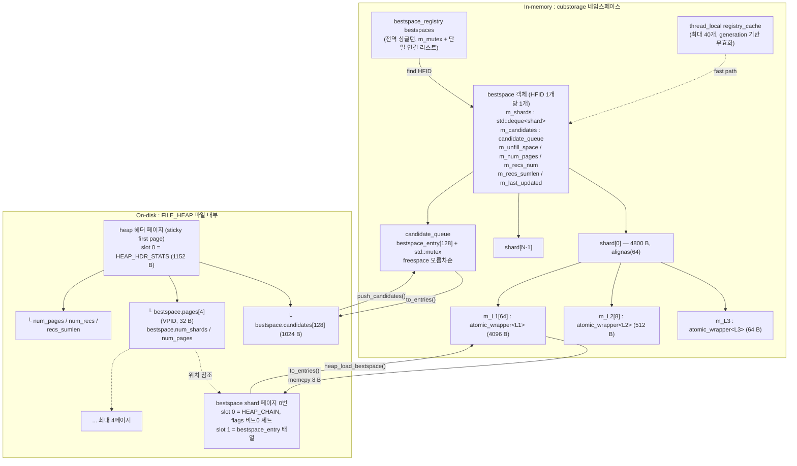
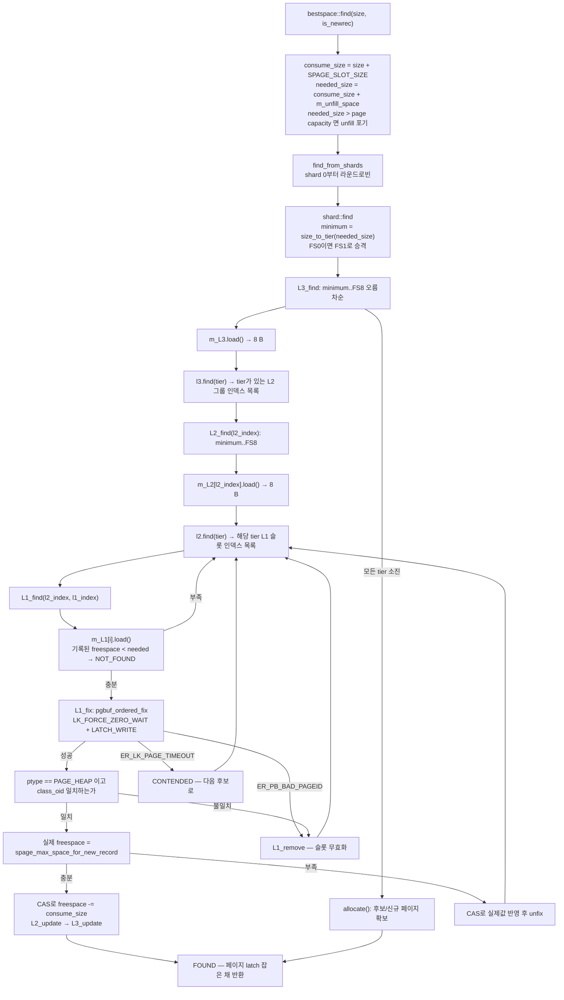
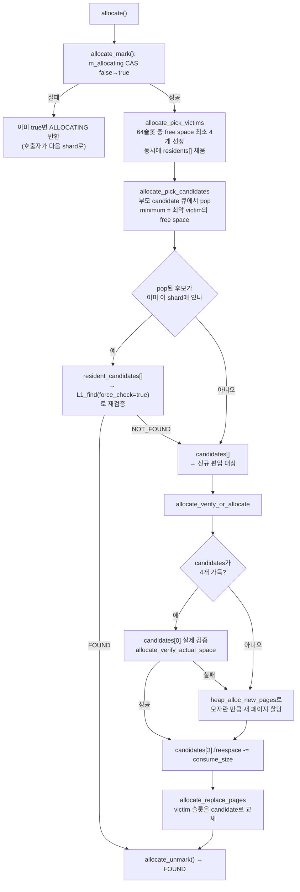
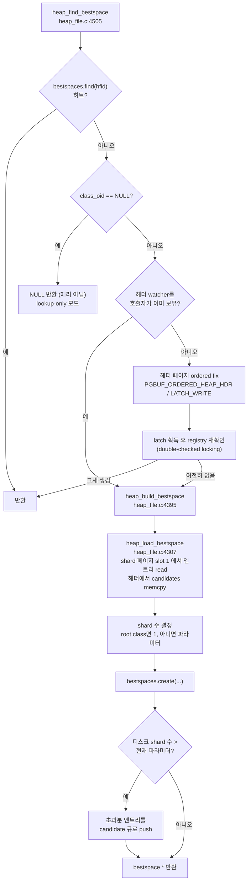

# CBRD-26176 Redesign bestspace — TO-BE 아키텍처 구조 레퍼런스

| 항목 | 값 |
|---|---|
| 기준 커밋 | `e84a7f6dc` — `[CBRD-26176] Redesign bestspace (#7353)` (2026-07-22, Yeoun) |
| 작성일 | 2026-07-28 |
| 작성 주체 | claude-fable-5 |
| 대상 독자 | 이 PR을 원본 없이 재작성해야 하는 CUBRID 엔진 개발자 |

## 0. 이 문서를 읽기 전에

### 0.1 인용 규칙

모든 인용은 **커밋 `e84a7f6dc` 시점의 파일 내용**을 기준으로 한다. 워킹트리가 아니다.

이 구분이 중요한 이유가 있다. 문서를 쓰는 동안 워킹트리의 `src/storage/bestspace.cpp`와 `src/storage/heap_file.c` 두 파일이 병렬 작업(Phase 3 call-flow 추적)의 `BSTRACE` 계측 때문에 수정되고 있었다. 결과적으로 두 파일은 커밋 시점과 라인 번호가 어긋난다 — `bestspace.cpp`는 최대 46줄, `heap_file.c`는 구간에 따라 **−12줄에서 +71줄까지** 편차가 있다(단일 오프셋이 아니므로 산술 보정으로는 맞출 수 없다).

이 문서의 모든 라인 번호는 아래로 꺼낸 원본을 기준으로 재검증했다.

```
git show e84a7f6dc:src/storage/bestspace.cpp
git show e84a7f6dc:src/storage/heap_file.c
```

`bestspace.hpp`, `heap_file.h`, `page_buffer.c`, `page_buffer.h`, `system_parameter.c/.h`, `slotted_page.c/.h`, `recovery.c/.h`, `boot_sr.c`, `vacuum.c`, `show_meta.c`는 워킹트리가 깨끗했으므로 라인 번호가 그대로 일치한다.

`e84a7f6dc^:` 접두가 붙은 인용은 **부모 리비전**(변경 전) 기준이다.

### 0.2 소스 인벤토리

| 파일 | 이 PR에서의 변화 | 역할 |
|---|---|---|
| `src/storage/bestspace.hpp` | 신규 486줄 | in-memory 계층 전체 선언 |
| `src/storage/bestspace.cpp` | 신규 1841줄 | in-memory 계층 구현 + registry |
| `src/storage/heap_file.c` | 5360줄 변경 | on-disk 구조, 생성/적재/플러시, heap 연동 |
| `src/storage/heap_file.h` | 25줄 | 공개 API |
| `src/storage/page_buffer.c/.h` | 331/13줄 | `pgbuf_ordered_callback` 신규 |
| `src/base/system_parameter.c/.h` | 18/4줄 | 신규 파라미터 1개, obsolete 처리 1개 |
| `src/storage/slotted_page.c/.h` | 40/7줄 | `need_update_best_hint` 비트 제거 |
| `src/transaction/recovery.c/.h` | 6/3줄 | `RVHF_UPDATE_BESTSPACE_ENTRIES` 신규 |
| `src/transaction/boot_sr.c` | 3줄 | 셧다운 동기화 훅 |
| `src/query/vacuum.c` | 38줄 | candidate 공급 + drop 시 registry 정리 |
| `src/parser/show_meta.c` | 19줄 | `SHOW HEAP HEADER` 컬럼 재정의 |

### 0.3 한 문단 요약

구 설계는 전역 해시 테이블 두 개(`hfid_ht`, `vpid_ht`)를 `pthread_mutex` 하나로 감싼 `heap_Bestspace` 캐시와, heap 헤더 페이지에 박힌 10칸짜리 원형 배열(`estimates.best[10]`)이었다. 신 설계는 이것을 **HFID별 in-memory 객체**로 바꾼다. 객체 하나는 N개의 shard(기본 8, 파라미터로 1~28)를 갖고, shard 하나는 64개의 페이지 슬롯을 3단 비트맵(L3→L2→L1)으로 색인한다. 탐색 경로는 **락이 전혀 없다** — 8바이트 원자 워드에 대한 load/CAS만 쓴다. mutex는 candidate 큐와 registry 리스트에만 남고, 실제 페이지 접근은 page latch(`pgbuf_ordered_fix`)가 보호한다. 디스크에는 heap 파일 안에 전용 shard 페이지 1~4개가 생겨 64×N개의 엔트리를 통째로 보관하고, heap 헤더에는 128칸 candidate 배열이 들어간다.

---

## 1. 전체 대응 관계



핵심 대응은 **`bestspace::L1` ≡ `bestspace_entry` ≡ 디스크 8바이트 엔트리**라는 3중 항등식이다. 세 표현의 바이트 레이아웃이 동일하도록 `static_assert`로 못 박혀 있어서, 플러시와 적재가 `memcpy` 한 번으로 끝난다.

`bestspace.cpp:139-141` (커밋 기준):

```cpp
static_assert (offsetof (L1, m_freespace) == offsetof (bestspace_entry, freespace), "offset must be same");
static_assert (offsetof (L1, m_volid) == offsetof (bestspace_entry, volid), "offset must be same");
static_assert (offsetof (L1, m_pageid) == offsetof (bestspace_entry, pageid), "offset must be same");
```

---

## 2. In-memory 계층

### 2.1 상수

전부 `bestspace.hpp:74-81`에 `static constexpr`로 선언된다.

| 상수 | 값 | 선언 | 의미 |
|---|---|---|---|
| `BITS_PER_BYTE` | 8 | `bestspace.hpp:74` | `numeric_limits<unsigned char>::digits` |
| `MAX_CANDIDATES_QUEUE_SIZE` | **128** | `bestspace.hpp:75` | candidate 큐 정원, on-disk 배열 크기와 동일 |
| `MAX_SHARD_PAGE_COUNT` | **4** | `bestspace.hpp:76` | heap 내 shard 페이지 최대 개수 |
| `ALLOC_BATCH_SIZE` | **4** | `bestspace.hpp:77` | victim/candidate 배치 크기 |
| `L3_FANOUT` | **8** | `bestspace.hpp:78` | shard당 L2 그룹 수 |
| `L2_FANOUT` | **8** | `bestspace.hpp:79` | L2 그룹당 L1 슬롯 수 |
| `ENTRIES_PER_SHARD` | **64** | `bestspace.hpp:80` | `L3_FANOUT * L2_FANOUT` |
| `DEFAULT_SHARD_COUNT` | **8** | `bestspace.hpp:81` | 파라미터 기본값과 일치 |
| `TLS_MAX_SIZE` | **40** | `bestspace.hpp:465` | thread-local registry 캐시 정원 |
| `UPDATE_TIME_THRESHOLD` | **30** (초) | `bestspace.cpp:1312` | 주기 동기화 간격, 함수 지역 constexpr |

### 2.2 `bestspace_entry` — 3중 공용 ABI

`bestspace.hpp:47-65`:

```cpp
typedef struct bestspace_entry BESTSPACE_ENTRY;
struct bestspace_entry
{
  std::uint16_t freespace;
  short volid;
  int32_t pageid;

  void set_null ()
  {
    freespace = 0;
    volid = NULL_VOLID;
    pageid = NULL_PAGEID;
  }
};

static_assert (sizeof (bestspace_entry) == 8, "bestspace_entry must be 8 bytes");
static_assert (offsetof (bestspace_entry, freespace) == 0, "freespace must be placed at first");
static_assert (offsetof (bestspace_entry, volid) == 2, "volid must be placed at second");
static_assert (offsetof (bestspace_entry, pageid) == 4, "pageid must be placed at last");
```

| 오프셋 | 필드 | 타입 | 크기 |
|---|---|---|---|
| 0 | `freespace` | `uint16_t` | 2 |
| 2 | `volid` | `short` | 2 |
| 4 | `pageid` | `int32_t` | 4 |
| | **합계** | | **8** |

`freespace`가 오프셋 0에 있는 것은 우연이 아니다. 뒤에 나올 L2/L3 비트맵 갱신이 이 값의 tier만 보면 되고, 8바이트 워드 전체를 원자적으로 CAS할 때 free space와 VPID가 항상 짝을 이뤄 갱신되어야 하기 때문이다. `freespace`가 `uint16_t`라서 `DB_PAGESIZE`가 65536 이상이면 표현 불가인데, CUBRID 최대 페이지 크기가 16K이므로 문제되지 않는다.

### 2.3 tier — free space 구간 열거

`bestspace.hpp:83-95`:

```cpp
enum class tier : std::int8_t
{
  FS0 = -1,   // 1-7%
  FS1 = 0,    // 8-15%
  FS2,        // 16-24%
  FS3,        // 25-34%
  FS4,        // 35-45%
  FS5,        // 46-57%
  FS6,        // 58-70%
  FS7,        // 71-84%
  FS8,        // 85-100%
  FSEND       // END
};
```

**`FS0 = -1`이라는 값 선택이 이 설계의 핵심 트릭이다.** L2/L3 비트맵은 `std::array<bitmap, 8>`이고 인덱스 0~7이 FS1~FS8에 1:1 대응한다. FS0은 음수라 배열 인덱스가 될 수 없고, 따라서 **비트맵에 아예 색인되지 않는다**. "7% 이하만 남은 페이지"는 사실상 사용 불가이므로 색인에서 배제하겠다는 의도이고, 이 덕분에 8개 tier가 정확히 8바이트에 들어맞는다.

경계 판정은 `bestspace::size_to_tier` (`bestspace.cpp:1367-1394`):

```cpp
static constexpr std::int16_t threshold[] = { 7, 15, 24, 34, 45, 57, 70, 84 };
std::int16_t percentage;
std::int8_t i;

percentage = size * 100 / DB_PAGESIZE;
for (i = 0; i < static_cast<std::int8_t> (tier::FS8) + 1; i++)
  {
    if (percentage <= threshold[i])
      {
        return static_cast<tier> (i - 1);
      }
  }
return tier::FS8;
```

루프는 i=0..7을 돌고 `tier(i - 1)`을 반환하므로 첫 히트 i=0이 곧 `tier(-1) = FS0`이다. 아래는 `DB_PAGESIZE = 16384`(기본값)에서의 실제 바이트 경계다. **아래 바이트 열은 위 정수 나눗셈 공식에서 유도한 계산값**이며 코드에 리터럴로 존재하지 않는다.

| tier | enum 값 | 백분율 | 16K 페이지 기준 free space (바이트) | 비트맵 색인 |
|---|---|---|---|---|
| `FS0` | −1 | ≤ 7% | 0 – 1310 | **안 됨** |
| `FS1` | 0 | 8 – 15% | 1311 – 2621 | 인덱스 0 |
| `FS2` | 1 | 16 – 24% | 2622 – 4095 | 인덱스 1 |
| `FS3` | 2 | 25 – 34% | 4096 – 5734 | 인덱스 2 |
| `FS4` | 3 | 35 – 45% | 5735 – 7536 | 인덱스 3 |
| `FS5` | 4 | 46 – 57% | 7537 – 9502 | 인덱스 4 |
| `FS6` | 5 | 58 – 70% | 9503 – 11632 | 인덱스 5 |
| `FS7` | 6 | 71 – 84% | 11633 – 13926 | 인덱스 6 |
| `FS8` | 7 | 85 – 100% | 13927 – 16384 | 인덱스 7 |
| `FSEND` | 8 | — | — | 루프 종료 감시값 |

`FS3`(25% 이상)은 별도의 의미를 갖는다. `heap_add_bestpage`가 candidate 큐에 페이지를 넣을지 결정하는 문턱값이다 (`heap_file.c:4640`).

tier에는 전위/후위 증가 연산자가 friend로 정의되어 있고, `FSEND`를 넘지 않도록 클램프된다 (`bestspace.hpp:108-122`).

### 2.4 `bitmap` — 1바이트 원자 단위

`bestspace.hpp:155-170` / `bestspace.cpp:89-132`. 멤버는 `std::uint8_t m_bits` 하나뿐이고 `sizeof == 1`이 강제된다 (`bestspace.hpp:399`).

| 메서드 | 구현 | 위치 |
|---|---|---|
| `empty()` | `m_bits == 0` | `bestspace.cpp:94-98` |
| `set(i)` | `m_bits \|= (0x1 << i)` | `bestspace.cpp:100-106` |
| `clear(i)` | `m_bits &= ~(0x1 << i)` | `bestspace.cpp:108-114` |
| `find(pos, len)` | 세트된 비트 위치를 `pos` 배열에 수집, 개수 반환 | `bestspace.cpp:116-132` |

`find`는 비트 스캔 명령을 쓰지 않고 8회 루프를 돈다. 8비트라 분기 예측이 잘 먹고 벡터화 여지도 없어서 실질 손해는 없다 — 라고 추정한다(코드에 근거 주석 없음).

### 2.5 `L1` — 페이지 슬롯

`bestspace.hpp:172-189`:

```cpp
class L1
{
  public:
    L1 () noexcept;
    ~L1 () = default;

    std::uint16_t get_freespace ();
    void set_freespace (std::uint16_t size);

    VPID get_vpid ();
    void set_vpid (VPID vpid);

  private:
    std::uint16_t m_freespace;

    short m_volid;
    int32_t m_pageid;
};
```

`bestspace_entry`와 필드 순서·타입이 완전히 같다. `sizeof(L1) == 8`, `std::atomic<L1>::is_always_lock_free`가 둘 다 강제된다 (`bestspace.hpp:402`, `405`). 즉 L1 하나는 **단일 `lock cmpxchg` 명령으로 통째로 교체**된다. free space와 VPID가 찢어질 수 없다는 뜻이고, 이것이 탐색 경로에서 mutex를 없앨 수 있었던 근본 이유다.

### 2.6 `L2` / `L3` — tier 비트맵

둘 다 구조가 같다: `std::array<bitmap, 8> m_freespace`, `sizeof == 8`, `atomic` lock-free 강제 (`bestspace.hpp:402-407`).

**의미가 다르다.**

- `L2`의 `m_freespace[t]`는 8비트 비트맵이고, 비트 j = "이 L2 그룹의 L1 슬롯 j가 tier t에 속한다".
- `L3`의 `m_freespace[t]`는 8비트 비트맵이고, 비트 i = "L2 그룹 i에 tier t인 L1이 **하나 이상** 있다".

즉 L3는 L2의 OR 요약이다. 64개 슬롯을 8+8 두 단계로 접어서, 최악의 경우에도 8바이트 로드 1회 + 8바이트 로드 최대 8회로 후보를 좁힌다.

| 메서드 | L2 | L3 | 동작 |
|---|---|---|---|
| `find(minimum, pos)` | `bestspace.cpp:174-180` | `bestspace.cpp:243-249` | `m_freespace[minimum]`의 세트 비트 위치 수집. **정확히 그 tier만**, 이상(以上)이 아님 |
| `collect(tiers)` | `bestspace.cpp:182-198` | 없음 | 비어 있지 않은 tier 목록 수집 (L3 갱신용) |
| `empty(fs)` | `bestspace.cpp:200-206` | 없음 | 해당 tier 비트맵이 0인가 |
| `clear()` | `bestspace.cpp:208-215` | `bestspace.cpp:251-258` | 8바이트 전체 0 |
| `clear(index)` | `bestspace.cpp:217-227` | `bestspace.cpp:260-270` | **모든 tier**에서 해당 인덱스 비트 제거 |
| `set(fs, index)` | `bestspace.cpp:229-236` | `bestspace.cpp:272-279` | 한 tier의 한 비트만 세트 |

`clear(index)`의 구현이 영리하다. `bestspace.cpp:217-227`:

```cpp
std::memcpy (&val, m_freespace.data (), sizeof (uint64_t));
val &= ~ (0x0101010101010101ULL << index);
std::memcpy (static_cast<void *> (m_freespace.data ()), &val, sizeof (uint64_t));
```

`0x0101010101010101ULL << index`는 8개 바이트 각각의 `index`번째 비트를 세운 마스크다. 이 한 줄로 "슬롯 index를 모든 tier에서 제거"가 끝난다. 갱신 로직이 항상 `clear(index)` 후 `set(newtier, index)` 순서를 밟는 이유이기도 하다 — 이전 tier가 무엇이었는지 알 필요가 없다.

`find`가 "이상"이 아니라 "정확히 그 tier"만 돌려주는 점은 재구현 시 놓치기 쉽다. 상위 tier 탐색은 호출자가 `for (; minimum <= tier::FS8; minimum++)` 루프로 처리한다 (`bestspace.cpp:429`, `503`).

### 2.7 `atomic_wrapper` — 64바이트 패딩

`bestspace.hpp:124-153`:

```cpp
template <typename T>
struct alignas (64) atomic_wrapper
{
  std::atomic<T> value;

  atomic_wrapper ()
    : value ()
  {
  }

  atomic_wrapper (T val)
    : value (val)
  {
  }

  T load () const noexcept { return value.load (); }
  void store (T desired) noexcept { value.store (desired); }
  bool compare_exchange_strong (T &expected, T desired) noexcept
  {
    return value.compare_exchange_strong (expected, desired);
  }
};
```

8바이트짜리 원자 변수를 64바이트 캐시라인 하나에 독점시킨다. `bestspace.hpp:408-413`이 크기 64와 정렬 64를 L1/L2/L3 전부에 대해 강제한다.

```cpp
static_assert (sizeof (atomic_wrapper<L1>) == 64, "bestspace::atomic_wrapper<L1> must be 64 bytes");
static_assert (alignof (atomic_wrapper<L1>) == 64, "bestspace::atomic_wrapper<L1> must be aligned as 64 bytes");
```

메모리 대비 8배 낭비다(64 슬롯 × 64B = 4KB). 그 대가로 **서로 다른 페이지 슬롯을 갱신하는 스레드끼리 false sharing이 완전히 사라진다**. shard 하나가 4800바이트나 되는 것도 여기서 나온다. 인메모리 bestspace를 "작게 유지"하려는 시도가 아니라 "경합 없이 유지"하려는 설계임을 보여주는 지점이다.

### 2.8 `shard` — 4800바이트

`bestspace.hpp:237-328`. 클래스 자체가 `alignas(64)`이고 `sizeof == 4800`, `alignof == 64`가 강제된다 (`bestspace.hpp:415-416`).

멤버 선언 (`bestspace.hpp:256-285`):

```cpp
private:
  // core
  atomic_wrapper<bool> m_allocating;

  atomic_wrapper<L3> m_L3;
  atomic_wrapper<L2> m_L2[L3_FANOUT];
  atomic_wrapper<L1> m_L1[L3_FANOUT * L2_FANOUT];

  // information per shard
  bestspace &m_parent;

  std::atomic<int> m_num_pages;
  std::atomic<std::uint64_t> m_recs_num;
  std::atomic<std::uint64_t> m_recs_sumlen;

  // stats
  struct
  {
    std::atomic<bool> enabled;

    std::atomic<std::uint32_t> request;
    std::atomic<std::uint32_t> advance_shard;

    std::atomic<std::uint32_t> fetch_L3;
    std::atomic<std::uint32_t> fetch_L2;
    std::atomic<std::uint32_t> fetch_L1;

    std::atomic<std::uint32_t> found;
    std::atomic<std::uint32_t> allocated;
  } m_stats;
```

바이트 배치 (아래 오프셋 열은 **계산값**이며, 총합 4800만이 `static_assert`로 검증된다):

| 오프셋 | 멤버 | 크기 | 비고 |
|---|---|---|---|
| 0 | `m_allocating` | 64 | `atomic_wrapper<bool>`, 캐시라인 독점 |
| 64 | `m_L3` | 64 | |
| 128 | `m_L2[8]` | 512 | 8 × 64 |
| 640 | `m_L1[64]` | 4096 | 64 × 64 |
| 4736 | `m_parent` | 8 | `bestspace &` 참조 |
| 4744 | `m_num_pages` | 4 | `atomic<int>` |
| 4752 | `m_recs_num` | 8 | 8정렬 패딩 4바이트 선행 |
| 4760 | `m_recs_sumlen` | 8 | |
| 4768 | `m_stats` | 32 | bool 1 + uint32 7개, 4정렬 |
| | **합계** | **4800** | 64 × 75 |

기본 8 shard일 때 bestspace 객체 하나의 shard 영역은 **38,400바이트**다.

#### 왜 allocating 비트를 L3에서 떼어냈나

커밋 메시지 "split the allocating bit and L3"(`a8482a6e6`)가 이 결정을 직접 기록한다. 분리 **전** 코드는 allocating 플래그를 L3 원자 워드 안에 욱여넣고 있었다:

```cpp
-	  static constexpr std::uint64_t FLAG_MASK = 0x8080808080808080;
-	  static constexpr std::uint64_t FLAG_ALLOCATING = 0x8000000000000000;
...
-	  bool is_allocating ();
-	  void clear_allocating ();
-	  void set_allocating ();
```

`FLAG_MASK = 0x8080808080808080`이 말해주듯, 플래그를 담기 위해 **8개 tier 바이트 각각의 최상위 비트를 예약**해야 했다. 바이트당 7비트만 남으므로 L2 그룹은 7개가 상한이었고, 실제로 같은 커밋에서 이렇게 바뀐다:

```cpp
-      static constexpr std::size_t L3_FANOUT = 7;
+      static constexpr std::size_t L3_FANOUT = 8;
```

분리로 얻은 것이 세 가지다.

1. **fanout 7 → 8**, shard당 엔트리 56 → **64개**. 8의 거듭제곱이 되면서 `l2_index = i / L2_FANOUT`, `l1_index = i % L2_FANOUT` 같은 인덱스 산술이 시프트/마스크로 떨어진다.
2. **`operator==`가 단순해진다.** 마스킹 비교가 `memcmp` 8바이트로 바뀐다 (`bestspace.hpp:228-231`).
3. **경합 분리.** allocating 표시와 tier 비트맵 갱신이 같은 원자 워드를 CAS하지 않게 되어, 할당 중인 shard에서도 다른 스레드의 L3 갱신이 실패하지 않는다.

`m_allocating`이 `atomic_wrapper<bool>`로 캐시라인 하나를 통째로 쓰는 것도 이 맥락이다. shard 진입마다 읽히는 값이므로 L3와 같은 라인에 두면 다시 false sharing이 생긴다.

#### estimates의 lock-free 갱신

`m_num_pages` / `m_recs_num` / `m_recs_sumlen`은 `atomic_wrapper`가 아닌 **맨 `std::atomic`**이다. 정확도보다 갱신 비용이 중요한 값이라 캐시라인 패딩을 주지 않았다 — 라고 추정한다(주석 없음). 세 값은 인접해 있어 같은 라인을 공유한다.

갱신은 CAS 없이 `fetch_add` / `fetch_sub`만 쓴다 (`bestspace.cpp:367-381`):

```cpp
void
bestspace::shard::add_estimates (int num_pages, std::uint64_t recs_num, std::uint64_t recs_sumlen)
{
  m_num_pages.fetch_add (num_pages);
  m_recs_num.fetch_add (recs_num);
  m_recs_sumlen.fetch_add (recs_sumlen);
}
```

세 변수가 개별 원자 연산이므로 **세 값이 서로 일관된 스냅샷이라는 보장은 없다**. 통계 추정치이므로 허용된다.

집계는 누산 방식이다 — `get_estimates`가 `=`가 아니라 `+=`를 쓴다 (`bestspace.cpp:383-389`):

```cpp
void
bestspace::shard::get_estimates (int &num_pages, std::uint64_t &recs_num, std::uint64_t &recs_sumlen)
{
  num_pages += m_num_pages.load ();
  recs_num += m_recs_num.load ();
  recs_sumlen += m_recs_sumlen.load ();
}
```

상위 `bestspace::get_estimates` (`bestspace.cpp:1419-1431`)가 객체 수준 베이스값을 먼저 `load()`로 넣고, 모든 shard를 순회하며 델타를 누산한다. 즉 **최종값 = 객체 베이스 + Σ(shard 델타)** 구조다.

`set_estimates` (`bestspace.cpp:1396-1417`)는 그 역이다. 베이스를 새 값으로 `store`한 뒤, 각 shard의 현재 누적분을 읽어서 그만큼 다시 빼 0으로 만든다.

```cpp
// It's better for the estimates to be higher than the actual values rather than lower.
m_num_pages.store (num_pages);
m_recs_num.store (recs_num);
m_recs_sumlen.store (recs_sumlen);

// and sub
for (i = 0; i < m_shards.size (); i++)
  {
    shard_num_pages = 0;
    shard_recs_num = 0;
    shard_recs_sumlen = 0;
    m_shards[i].get_estimates (shard_num_pages, shard_recs_num, shard_recs_sumlen);
    m_shards[i].subtract_estimates (shard_num_pages, shard_recs_num, shard_recs_sumlen);
  }
```

읽고 빼는 사이에 다른 스레드가 `add_estimates`를 하면 그만큼이 살아남는다. 코드 주석이 밝히듯 **과대 추정을 과소 추정보다 선호**하는 의도적 선택이다.

델타를 넣는 지점은 탐색 성공 직후 한 곳뿐이다 (`bestspace.cpp:1497`):

```cpp
m_shards[ (shard + i) % m_shards.size ()].add_estimates (0, is_newrec ? 1 : 0, consume_size - SPAGE_SLOT_SIZE);
```

`num_pages`에는 0을 넣는다. 페이지 수 증가는 실제로 새 페이지를 할당한 `allocate_new_pages`에서만 올린다 (`bestspace.cpp:980`).

### 2.9 탐색 구조



#### 탐색 진입 — `bestspace::find`

`bestspace.cpp:1324-1365`. 세 가지 일을 한다.

첫째, **stale error 방어** (`bestspace.cpp:1336-1341`). 진입 시점에 이미 에러가 걸려 있으면 즉시 반환하고, 아니면 `er_clear()`로 지운다. 이 경로가 `er_errid()`로 상태를 판별하는 곳이 많아서 오염을 막아야 한다.

둘째, **needed_size 계산** (`bestspace.cpp:1354-1359`):

```cpp
consume_size = static_cast<int> (size) + SPAGE_SLOT_SIZE;
needed_size = consume_size + m_unfill_space;
if (needed_size > heap_nonheader_page_capacity ())
  {
    needed_size = consume_size;
  }
```

`unfill_space`는 나중 UPDATE를 위해 남겨두는 여유 공간이다. 그런데 레코드가 커서 여유분까지 요구하면 어떤 페이지도 못 찾으므로, 페이지 용량을 넘어서면 여유분을 포기한다. **탐색은 `needed_size`로 하고 예약은 `consume_size`로 한다** — 이 비대칭이 중요하다.

셋째, watcher를 `PGBUF_ORDERED_HEAP_NORMAL`로 초기화한다 (`bestspace.cpp:1351`).

#### shard 순회 — `find_from_shards`

`bestspace.cpp:1471-1520`. 반환 상태는 `FOUND` / `ALLOCATING` / `FAILURE` 셋 뿐이라고 단언한다 (`bestspace.cpp:1492-1494`) — `shard::find`가 내부에서 `NOT_FOUND`/`CONTENDED`를 `allocate()`로 흡수하기 때문이다.

모든 shard가 `ALLOCATING`을 반환하면 대기에 들어가는데, 여기가 이 PR에서 가장 미묘한 부분이다 (`bestspace.cpp:1510`):

```cpp
errid = pgbuf_ordered_callback (&thread_ref, wait_for_shard_allocation, &retry);
```

**대기 전에 자신이 잡고 있는 모든 페이지 latch를 풀어야 한다.** 안 그러면 할당 중인 스레드가 내 latch를 기다리고 나는 그 스레드를 기다리는 교착이 생긴다. 그래서 `pgbuf_ordered_callback`이라는 신규 헬퍼가 page_buffer에 추가됐다 (3.5절).

대기 콜백은 `bestspace.cpp:55-81`이다. 20회까지는 `std::this_thread::yield()`, 이후 10μs sleep, 매회 `logtb_is_interrupted` 확인.

#### shard 진입 — `shard::find`

`bestspace.cpp:340-365`:

```cpp
// FS0 is not indexed by L2/L3. search the same tier and let L1_find perform the exact size check.
minimum = size_to_tier (needed_size);
if (minimum == tier::FS0)
  {
    minimum = tier::FS1;
  }
```

FS0은 비트맵에 없으므로 FS1부터 뒤진다. 그러면 실제로는 FS0 크기로 충분한 요청에 FS1 이상 페이지를 주게 되는데, 정확한 크기 검사는 `L1_find`가 하므로 정합성은 유지된다.

`L3_find`가 `FOUND`나 `FAILURE`면 그대로 반환, 아니면(`NOT_FOUND`/`CONTENDED`) `allocate()`로 넘어간다.

#### L1 검증 — `L1_find`

`bestspace.cpp:567-650`. 실제 페이지를 만지는 유일한 지점이고, 낙관적 검증의 전형이다.

1. **기록값 선검사** (`bestspace.cpp:584-589`). `force_check`가 false이고 기록된 free space가 부족하면 페이지를 잡지도 않고 반환. `force_check=true`는 `allocate_get_candidates_or_update_residents`에서만 쓰인다.
2. **페이지 fix** — `L1_fix` (`bestspace.cpp:652-683`). `xlogtb_reset_wait_msecs(LK_FORCE_ZERO_WAIT)`로 대기를 끄고 `pgbuf_ordered_fix(OLD_PAGE_MAYBE_DEALLOCATED, PGBUF_LATCH_WRITE)`. 끝나면 원래 wait_msecs 복구.
   - `ER_LK_PAGE_TIMEOUT` → `er_clear()` 후 `CONTENDED`. 남이 쓰는 페이지는 그냥 건너뛴다.
   - `ER_PB_BAD_PAGEID` → 페이지가 사라졌으므로 `L1_remove`로 슬롯 무효화 후 `NOT_FOUND`.
3. **소유권 확인** (`bestspace.cpp:601-608`). `pgbuf_get_page_ptype != PAGE_HEAP`이거나 `heap_get_class_oid_from_page` 결과가 `class_oid`와 다르면 슬롯 제거. 페이지가 재활용되어 다른 클래스로 넘어갔을 수 있다.
4. **실제 free space 측정** (`bestspace.cpp:615`). `spage_max_space_for_new_record`. 기록값은 어디까지나 힌트다.
5. **반영** (`bestspace.cpp:616-645`). 부족하면 실제값으로 CAS 갱신 후 `NOT_FOUND`, 충분하면 `freespace - consume_size`로 CAS 갱신 후 `FOUND`.

CAS 앞에 `VPID_EQ(&vpid, &old_vpid)` 가드가 붙는다 (`bestspace.cpp:619`, `635`). 내가 페이지를 잡고 있는 동안 다른 스레드가 이 L1 슬롯을 완전히 다른 페이지로 교체했을 수 있고, 그 경우 내 측정값을 쓰면 안 된다. 주석이 의도를 밝힌다: `// and I'm the only one that can modify this L1`.

CAS 실패는 무시하고 그냥 진행한다. 예약에 실패해도 페이지는 잡았으므로 삽입은 가능하고, free space 정보는 다음 방문에서 교정된다.

#### 비트맵 상향 전파 — `L2_update` / `L3_update`

`L2_update` (`bestspace.cpp:528-565`)는 이중 루프다.

```cpp
while (true)
  {
    expected = m_L2[l2_index].load ();
    do
      {
        desired = expected;
        desired.clear (l1_index);

        l1 = m_L1[l2_index * L2_FANOUT + l1_index].load ();
        tier_to = size_to_tier (l1.get_freespace ());
        if (tier_to > tier::FS0)
          {
            desired.set (tier_to, l1_index);
          }

        if (desired == expected)
          {
            return;
          }
      }
    while (!m_L2[l2_index].compare_exchange_strong (expected, desired));

    tier_now = size_to_tier (m_L1[l2_index * L2_FANOUT + l1_index].load ().get_freespace ());
    if (tier_now == tier_to)
      {
        break;
      }
  }

L3_update (l2_index);
```

안쪽 `do-while`은 표준 CAS 재시도다. **바깥 `while`이 핵심이다** — CAS에 성공한 직후 L1을 다시 읽어서 tier가 그대로인지 확인한다. 내가 L2를 갱신하는 사이 L1이 또 바뀌었다면 방금 쓴 값은 이미 낡았으므로 처음부터 다시 한다. 갱신 순서가 L1 먼저, L2 나중이라 생기는 race를 이렇게 닫는다.

`L3_update` (`bestspace.cpp:454-489`)도 같은 이중 루프 패턴이다. `l2.collect(tiers)`로 해당 L2 그룹에 존재하는 tier 전부를 모아 L3의 해당 비트 열을 재구성하고, CAS 후 `l2 == m_L2[l2_index].load()`로 재확인한다.

두 함수 모두 `desired == expected`면 CAS 없이 조기 반환한다. 실제로 대부분의 삽입은 tier를 바꾸지 않으므로 이 조기 반환이 상시 경로다.

### 2.10 할당 경로 — `shard::allocate`

`bestspace.cpp:1021-1067`. 탐색이 실패했을 때만 진입한다.



#### allocating 비트

`allocate_mark` (`bestspace.cpp:698-714`)는 CAS로 false→true를 시도하고, 이미 true면 `ALLOCATING`을 반환한다. **shard당 할당 스레드는 한 명뿐**이라는 것이 이 설계의 직렬화 지점이다. 나머지 스레드는 다음 shard로 넘어가고(`STATS_INC(advance_shard, 1)`), 모든 shard가 할당 중이면 앞서 본 `pgbuf_ordered_callback` 대기로 들어간다.

#### victim 선정

`allocate_pick_victims` (`bestspace.cpp:724-756`). 64슬롯을 한 번 훑으면서 두 가지를 동시에 한다: `residents[]` 배열에 모든 슬롯의 VPID를 기록하고, free space 최소 4개를 삽입 정렬로 뽑는다. `victims`는 `(슬롯 인덱스, free space)` 쌍이고 초기값은 `(UINT16_MAX, UINT16_MAX)`다.

`residents[]`의 용량이 `64 + ALLOC_BATCH_SIZE`인 이유는 뒤에 새로 편입되는 candidate까지 담아 중복 검사를 이어가기 위해서다 (`bestspace.cpp:796-798`).

#### 중복 방지

`allocate_pick_candidates` (`bestspace.cpp:758-802`)가 큐에서 뽑은 후보를 `residents[]`와 대조해 둘로 가른다.

- 이미 이 shard에 있는 페이지 → `resident_candidates[]`. 슬롯 교체 대상이 아니라 **재검증 대상**이다. 같은 페이지가 두 슬롯을 차지하는 것을 막는다.
- 없는 페이지 → `candidates[]`. 새로 편입하고 `residents[]`에도 추가해 이후 후보와도 대조되게 한다.

커밋 "avoid duplicate replacement pages"가 이 로직에 대응한다.

`resident_candidates`는 `L1_find(..., force_check=true)`로 다시 확인된다 (`bestspace.cpp:822-849`). 기록값이 낡아서 탐색 단계에서 걸러졌을 뿐 실제로는 공간이 있을 수 있기 때문이다. 여기서 `FOUND`가 나오면 페이지 할당 없이 끝난다 — 이 경우 이미 뽑아둔 `candidates[]`는 큐로 되돌린다.

#### 신규 페이지 할당

`allocate_new_pages` (`bestspace.cpp:965-993`)는 `heap_alloc_new_pages`로 `ALLOC_BATCH_SIZE - num_candidates`개를 한 번에 받는다. 반환된 watcher는 **마지막 candidate의 페이지**를 잡고 있고, 이 페이지가 호출자에게 돌아간다.

역순 채우기에 주의해야 한다 (`bestspace.cpp:986-991`):

```cpp
for (i = ALLOC_BATCH_SIZE - 1; i >= static_cast<int> (num_candidates); i--)
  {
    candidates[i].freespace = freespace;
    candidates[i].volid = vpids[ALLOC_BATCH_SIZE - 1 - i].volid;
    candidates[i].pageid = vpids[ALLOC_BATCH_SIZE - 1 - i].pageid;
  }
```

모든 신규 페이지에 **같은** `freespace` 값(마지막 페이지에서 측정한 값)을 넣는다. 새 페이지는 다 비어 있으므로 동일하다는 전제다.

`allocate_verify_or_allocate` (`bestspace.cpp:917-963`)는 후보가 4개 다 찼을 때만 첫 번째(가장 큰) 후보를 실제 검증한다. 성공하면 `candidates[0]`과 `candidates[3]`을 swap한다 — **호출자에게 돌려줄 페이지는 항상 마지막 칸**이라는 규약이다 (`bestspace.cpp:936-937` 주석).

#### 슬롯 교체

`allocate_replace_pages` (`bestspace.cpp:995-1019`). 앞의 3개는 무조건 교체하고, **마지막 하나는 조건부**다:

```cpp
if (candidates[i].freespace > victims[i].second)
```

마지막 candidate는 이미 `consume_size`만큼 차감된 상태(`bestspace.cpp:1060`)라, victim보다 나쁠 수 있다. 그러면 교체하지 않는다.

### 2.11 `candidate_queue`

`bestspace.hpp:330-353`. bestspace 객체당 하나이고 **모든 shard가 공유**한다.

```cpp
private:
  std::array<bestspace_entry, MAX_CANDIDATES_QUEUE_SIZE> m_array;
  std::size_t m_size;

  std::mutex m_mutex;
```

정원 128개, `std::mutex` 보호, **free space 오름차순 정렬 유지**. 즉 `m_array[0]`이 최악, `m_array[m_size-1]`이 최선이다. 이 순서 규약이 모든 연산의 상수 시간 판정을 만든다.

| 연산 | 위치 | 동작 |
|---|---|---|
| `try_push` | `bestspace.cpp:1097-1119` | `try_to_lock`. 실패하면 후보를 버리고 false 반환 |
| `push` | `bestspace.cpp:1121-1135` | 블로킹 lock |
| `pop` | `bestspace.cpp:1137-1157` | 뒤(최선)에서 최대 4개 |
| `to_entries` | `bestspace.cpp:1159-1174` | **역순** 복사 — 내림차순 출력 |
| `reset` | `bestspace.cpp:1083-1095` | 전부 null, size 0 |

`try_push`가 락 획득에 실패하면 그냥 포기한다 (`bestspace.cpp:1103-1106`). candidate는 힌트일 뿐이므로 vacuum이나 삽입 경로가 이것 때문에 멈춰서는 안 된다는 판단이다.

두 push 모두 삽입 전에 `remove_if_exist`로 같은 VPID를 제거한다 (`bestspace.cpp:1176-1191`). 중복 방지가 큐 레벨에서도 걸려 있다.

정원이 찼을 때는 최악 후보(`m_array[0]`)보다 나쁘면 버린다:

```cpp
if (m_size == MAX_CANDIDATES_QUEUE_SIZE && candidate.freespace <= m_array[0].freespace)
```

`insert` (`bestspace.cpp:1193-1226`)는 삽입 위치를 선형 탐색한 뒤 `memmove`한다. 큐가 가득 차면 `m_array[0]`을 밀어내고 아니면 뒤로 민다.

`pop` (`bestspace.cpp:1137-1157`)의 개수 결정이 흥미롭다:

```cpp
num = (m_array[m_size - 1].freespace >= needed_size) ? ALLOC_BATCH_SIZE : ALLOC_BATCH_SIZE - 1;
for (i = 0; i < num && m_size > 0 && m_array[m_size - 1].freespace > minimum; i++)
```

최선 후보가 요청 크기를 만족하면 4개, 아니면 **3개만** 꺼낸다. 4개를 다 채우지 않으면 `allocate_verify_or_allocate`가 반드시 `allocate_new_pages`를 타게 되고(`num_candidates < ALLOC_BATCH_SIZE` 조건), 결과적으로 **최소 한 장의 새 페이지가 확보**된다. 후보가 다 부실할 때 헛돌지 않게 하는 장치다.

`minimum`(최악 victim의 free space)보다 나쁜 후보는 애초에 꺼내지 않는다. 교체해봐야 손해이기 때문이다.

`to_entries`가 역순인 이유는 디스크 candidate 배열이 **내림차순**이기 때문이다. on-disk 삽입 함수 `heap_bestspace_add_candidate`(`heap_file.c:3723`)가 내림차순 정렬을 유지하므로, 적재 시 `push_candidates`가 앞에서부터 넣으면 in-memory 오름차순이 자연스럽게 만들어진다.

---

## 3. Registry

### 3.1 구조

`bestspace.hpp:423-481`. 전역 싱글턴 `cubstorage::bestspaces` (`bestspace.hpp:483`, 정의 `bestspace.cpp:1840`).

```cpp
private:
  struct registry_entry
  {
    HFID hfid;
    bestspace *entry;

    registry_entry *next;
  };

  struct registry_cache
  {
    registry_entry *head;
    std::size_t size;
    std::size_t generation;

    registry_cache ();
    ~registry_cache ();
  };
...
private:
  registry_entry *m_head;
  std::mutex m_mutex;

  alignas (64) std::atomic<uint64_t> m_generation;

  static constexpr std::size_t TLS_MAX_SIZE = 40;
  inline static thread_local registry_cache TLS_cache;
```

전역 리스트는 **단일 연결 리스트 + mutex**다. 해시 테이블이 아니다. 한 서버가 동시에 여는 heap 수가 많지 않고, thread-local 캐시가 대부분의 조회를 흡수한다는 가정이다 — 라고 추정한다(설계 근거 주석 없음). 다만 `find_from_global`은 선형 탐색이므로 heap 수가 많아지면 mutex 아래 O(n)이 된다.

### 3.2 왜 키가 HFID 하나인가

커밋 `0ba2a3603` "uese only hfid as a key"(오타는 원문 그대로)가 이 변경을 담는다. 그 전에는 키가 `(OID class_oid, HFID hfid)` 복합이었다:

```cpp
   struct registry_entry
   {
-	OID class_oid;
 	HFID hfid;
 	bestspace *entry;
```

같은 커밋에서 조회·생성·삭제 API 전부가 `class_oid`를 잃고, **`destroy(const VFID *)` 오버로드가 새로 생긴다**:

```cpp
-      void destroy (OID *class_oid, HFID *hfid);
+      void destroy (const VFID *vfid);
+      void destroy (const HFID *hfid);
```

근거는 두 가지로 읽힌다.

**첫째, 키가 중복이었다.** heap 파일 하나는 정확히 한 클래스에 속하므로 HFID가 정해지면 class_oid는 종속적이다. 복합 키는 정보를 더하지 않으면서 호출자에게 부담만 지운다.

**둘째, class_oid를 모르는 호출자가 실재한다.** `vacuum_rv_notify_dropped_file`은 복구 데이터에서 VFID만 얻는다 (`vacuum.c:6424`):

```c
cubstorage::bestspaces.destroy (&rcv_data->vfid);
```

`HFID`가 `VFID + hpgid` 구조이므로 VFID만으로도 매칭이 가능하다. class_oid가 키에 포함되어 있으면 이 경로가 성립하지 않는다. `heap_add_bestpage`도 `class_oid`에 NULL을 넘긴다 (`heap_file.c:4633`).

### 3.3 조회 — 2단 경로

`find` (`bestspace.cpp:1615-1626`)는 TLS 캐시를 먼저 보고 없으면 전역으로 간다.

**`find_from_cache`** (`bestspace.cpp:1660-1683`):

```cpp
generation = m_generation.load ();
if (TLS_cache.generation != generation)
  {
    TLS_cache.generation = generation;
    invalidate_entries (TLS_cache.head);
    return nullptr;
  }

cache = get_node_from_list (TLS_cache.head, hfid);
if (!cache)
  {
    return nullptr;
  }

// make this cache the first (LRU)
insert_entry (TLS_cache.head, cache);
return cache->entry;
```

generation 기반 일괄 무효화다. 어떤 스레드든 `destroy`를 부르면 전역 `m_generation`이 1 증가하고(`bestspace.cpp:1596`, `1610`), 다른 스레드는 다음 조회 때 세대 불일치를 보고 **자기 캐시 전체를 버린다**. `invalidate_entries`(`bestspace.cpp:1764-1773`)는 노드를 해제하지 않고 HFID를 NULL로, entry를 nullptr로 만든다 — 노드 자체는 재사용된다.

이 방식은 dangling pointer를 막는 대가로 과잉 무효화를 감수한다. heap 하나가 drop되면 모든 스레드의 모든 캐시가 날아간다. `m_generation`이 `alignas(64)`인 것은 이 값이 매 조회마다 읽히기 때문이다.

`get_node_from_list`는 노드를 리스트에서 **떼어내고**, 호출자가 `insert_entry`로 맨 앞에 다시 붙인다. 이 조합이 LRU를 만든다.

**`find_from_global`** (`bestspace.cpp:1685-1718`):

```cpp
std::unique_lock<std::mutex> ulock (m_mutex);

auto pair = find_entry (m_head, hfid);
if (!pair)
  {
    // invalid class oid and hfid
    return nullptr;
  }
entry = (pair->second)->entry;

ulock.unlock ();

// register in TLS list
if (TLS_cache.size < TLS_MAX_SIZE)
  {
    cache = new registry_entry;
    TLS_cache.size++;
  }
else
  {
    cache = get_tail_from_list (TLS_cache.head);
  }
cache->hfid = *hfid;
cache->entry = entry;

insert_entry (TLS_cache.head, cache);
return entry;
```

전역 락을 **먼저 풀고** TLS에 등록한다. TLS 조작은 다른 스레드와 무관하므로 락 구간을 최소화한다. 캐시가 40개를 넘으면 꼬리(LRU)를 재활용한다.

### 3.4 생성 — `create`

`bestspace.cpp:1568-1585`:

```cpp
node = new registry_entry;
node->hfid = *hfid;
node->entry = new bestspace (shard_count, num_pages, recs_num, recs_sumlen, unfill_space);
node->entry->reset (entries, num_entries);
node->entry->push_candidates (candidates, num_candidates);

std::lock_guard<std::mutex> lock (m_mutex);

assert (!find_entry (m_head, hfid));
insert_entry (m_head, node);
```

객체 구성을 **락 밖에서** 끝내고 링크만 락 안에서 한다. `assert`는 중복 생성을 잡지만 릴리스 빌드에서는 사라진다 — 중복 방지는 호출자(`heap_find_bestspace`)의 double-checked locking에 의존한다.

여기서 `create`는 `bestspace *`를 반환하지 않는다. 호출자가 곧바로 `find`를 다시 불러 포인터를 얻는다 (`heap_file.c:4468`).

### 3.5 rebuild 흐름

registry에 항목이 없으면 디스크에서 복원한다. 세 함수가 계단식으로 엮인다.



`heap_find_bestspace`의 `class_oid == NULL` 규약이 중요하다 (`heap_file.c:4521-4526`). "있으면 달라, 없으면 만들지 말고 NULL" 이라는 뜻이고 **에러가 아니다**. `heap_add_bestpage`가 이 모드를 쓴다 — candidate 추가는 부수적 작업이라 없는 bestspace를 굳이 만들 이유가 없다.

`OID_ISNULL(class_oid)`면 `oid_Root_class_oid`로 치환한다 (`heap_file.c:4528-4531`). 부트스트랩 경로 대응이다.

shard 수 결정 (`heap_file.c:4454-4461`)은 **root class면 1개**, 아니면 파라미터 값이다. 카탈로그 heap은 경합이 적어 shard를 나눌 이유가 없다.

디스크 shard 수와 현재 파라미터가 다를 수 있다. 파라미터를 줄이고 재기동한 경우인데, 남는 엔트리를 버리지 않고 candidate 큐로 흘려보낸다 (`heap_file.c:4485-4488`).

> **재구현 주의.** 같은 `if` 블록 안에서 조건식(`heap_file.c:4485`)은 `ENTRIES_PER_SHARD`를 쓰는데 본문(`heap_file.c:4487`)은 리터럴 `64`를 두 번 쓴다.
>
> ```c
> if (num_entries > num_shards * cubstorage::bestspace::ENTRIES_PER_SHARD)
>   {
>     bestspace->push_candidates (&entries[num_shards * 64], num_entries - num_shards * 64);
>   }
> ```
>
> `ENTRIES_PER_SHARD`를 바꾸면 조건과 본문이 어긋나 버퍼 경계를 넘는다.

---

## 4. On-disk 구조

### 4.1 `HEAP_HDR_STATS` — 새 레이아웃

`heap_file.c:184-217`. 헤더 파일이 아니라 `.c`에 있다(구 버전도 마찬가지였다).

```c
typedef struct heap_hdr_stats HEAP_HDR_STATS;
struct heap_hdr_stats
{
  /* the first must be class_oid */
  OID class_oid;

  VFID ovf_vfid;		/* Overflow file identifier (if any) */

  VPID next_vpid;		/* Next page (i.e., the 2nd page of heap file) */
  VPID last_vpid;		/* Last page */

  int unfill_space;		/* Stop inserting when page has run below this. leave it for updates */

  int num_pages;		/* Estimation of number of user heap pages. Consult file manager if accurate number is needed */
  uint64_t num_recs;		/* Estimation of number of objects in heap */
  uint64_t recs_sumlen;		/* Estimation total length of records */

  struct
  {
    std::size_t num_candidates;
    // *INDENT-OFF*
    cubstorage::bestspace_entry candidates[cubstorage::bestspace::MAX_CANDIDATES_QUEUE_SIZE];
    // *INDENT-ON*

    std::size_t num_shards;

    std::size_t num_pages;
    VPID pages[cubstorage::bestspace::MAX_SHARD_PAGE_COUNT];
  } bestspace;

  int reserve0;			/* Nothing reserved for future */
  int reserve1;			/* Nothing reserved for future */
  int reserve2;			/* Nothing reserved for future */
};
```

바이트 배치 (**계산값**. `OID` 8 / `VFID` 8 / `VPID` 8, `size_t` 8, x86-64 LP64 기준):

| 오프셋 | 필드 | 선언 | 타입 | 크기 |
|---|---|---|---|---|
| 0 | `class_oid` | `heap_file.c:188` | `OID` | 8 |
| 8 | `ovf_vfid` | `heap_file.c:190` | `VFID` | 8 |
| 16 | `next_vpid` | `heap_file.c:192` | `VPID` | 8 |
| 24 | `last_vpid` | `heap_file.c:193` | `VPID` | 8 |
| 32 | `unfill_space` | `heap_file.c:195` | `int` | 4 |
| 36 | `num_pages` | `heap_file.c:197` | `int` | 4 |
| 40 | `num_recs` | `heap_file.c:198` | `uint64_t` | 8 |
| 48 | `recs_sumlen` | `heap_file.c:199` | `uint64_t` | 8 |
| 56 | `bestspace` | `heap_file.c:201-212` | 익명 struct | **1080** |
| 56 | ↳ `num_candidates` | `heap_file.c:203` | `size_t` | 8 |
| 64 | ↳ `candidates[128]` | `heap_file.c:205` | `bestspace_entry[]` | 1024 |
| 1088 | ↳ `num_shards` | `heap_file.c:208` | `size_t` | 8 |
| 1096 | ↳ `num_pages` | `heap_file.c:210` | `size_t` | 8 |
| 1104 | ↳ `pages[4]` | `heap_file.c:211` | `VPID[]` | 32 |
| 1136 | `reserve0` | `heap_file.c:214` | `int` | 4 |
| 1140 | `reserve1` | `heap_file.c:215` | `int` | 4 |
| 1144 | `reserve2` | `heap_file.c:216` | `int` | 4 |
| 1148 | *(꼬리 패딩)* | | | 4 |
| | **합계** | | | **1152** |

구조체 크기에 대한 `static_assert`는 **없다**. `heap_file.c`와 `heap_file.h` 전체에 `static_assert`/`STATIC_ASSERT`가 하나도 없다. 유일한 검증은 런타임 `assert (recdes.length == sizeof (HEAP_HDR_STATS))` (`heap_file.c:4415`, `4960`)뿐이다. 이식성 관점에서는 약한 보증이므로, 재구현 시 `static_assert`를 추가할 것을 권한다.

1152바이트는 4K 페이지의 `spage_max_record_size()`(4060)에도 들어간다. 다만 구 버전 296바이트 대비 **3.9배**로, 헤더 페이지 여유가 그만큼 줄었다.

`bestspace` 하위 구조체는 세 가지 역할을 겸한다: **candidate 영속화**(128칸), **shard 페이지 위치 색인**(`pages[4]`), **적재 시 크기 정보**(`num_shards`, `num_pages`).

### 4.2 shard 페이지

전용 타입이 없다. `HEAP_BESTSPACE_SHARD` 같은 struct는 존재하지 않고, 페이지 레이아웃은 슬롯 규약으로만 정의된다.

| 슬롯 | 내용 | 상수 |
|---|---|---|
| 0 | `HEAP_CHAIN` (40바이트), `flags |= HEAP_PAGE_FLAG_BESTSPACE` | `HEAP_HEADER_AND_CHAIN_SLOTID` = 0 (`heap_file.h:62`) |
| 1 | `bestspace_entry[entries_per_page]` 연속 배열, `REC_HOME` | `HEAP_BESTSPACE_ENTRIES_SLOTID` = 1 (`heap_file.c:231`) |

신규 매크로 (`heap_file.c:220-231`):

```c
/* Define heap page flags. */
#define HEAP_PAGE_FLAG_BESTSPACE		  0x00000001
#define HEAP_PAGE_FLAG_VACUUM_STATUS_MASK	  0xC0000000
#define HEAP_PAGE_FLAG_VACUUM_ONCE		  0x80000000
#define HEAP_PAGE_FLAG_VACUUM_UNKNOWN		  0x40000000

#define HEAP_PAGE_IS_BESTSPACE(chain) \
  (((chain)->flags & HEAP_PAGE_FLAG_BESTSPACE) != 0)

#define HEAP_PAGE_SET_BESTSPACE(chain) \
  ((chain)->flags |= HEAP_PAGE_FLAG_BESTSPACE)

#define HEAP_BESTSPACE_ENTRIES_SLOTID (HEAP_HEADER_AND_CHAIN_SLOTID + 1)
```

`HEAP_CHAIN`의 필드는 그대로다 (`heap_file.c:258-267`). 바뀐 것은 **비트 0의 의미**뿐이고, 주석이 그 사실을 반영한다: 구 버전 `"Flags for heap page. 2 bits are used for vacuum state."` → 신 버전 `"High 2 bits are used for vacuum state."` vacuum 상태는 상위 2비트(0xC0000000)라 비트 0과 충돌하지 않는다.

판별은 `heap_page_is_bestspace` (`heap_file.h:427`, `heap_file.c:2750`)다. 슬롯 0을 PEEK해서 `recdes.length != sizeof (HEAP_CHAIN)`이면 false를 반환하는데, **길이가 다르다는 것은 그 페이지가 heap 헤더 페이지라는 뜻**이다(헤더는 슬롯 0에 1152바이트 `HEAP_HDR_STATS`를 담는다). 타입 태그 없이 레코드 길이로 페이지 종류를 가르는 방식이다.

### 4.3 몇 페이지가, 어디에 생기나

생성자는 `heap_create_bestspace` (`heap_file.c:3796-3974`) 하나뿐이고, `heap_create_internal`에서 정확히 한 번 호출된다 (`heap_file.c:4818`).

개수 계산 (`heap_file.c:3831-3855`):

```c
heap_hdr->bestspace.num_shards = prm_get_integer_value (PRM_ID_BESTSPACE_SHARD_COUNT);
...
error = sysprm_get_range (PRM_ID_BESTSPACE_SHARD_COUNT, &min_shards, &max_shards);
...
max_entries = max_shards * cubstorage::bestspace::ENTRIES_PER_SHARD;

page_capacity = spage_max_record_size () - DB_ALIGN (sizeof (HEAP_CHAIN), HEAP_MAX_ALIGN) - SPAGE_SLOT_SIZE;
entries_per_page = page_capacity / sizeof (cubstorage::bestspace_entry);
...
max_pages = cubstorage::bestspace::MAX_SHARD_PAGE_COUNT;
heap_hdr->bestspace.num_pages = (max_entries + entries_per_page - 1) / entries_per_page;
if (heap_hdr->bestspace.num_pages > max_pages) { assert(false); return ER_HEAP_UNABLE_TO_CREATE_HEAP; }
```

**현재 파라미터 값이 아니라 파라미터의 상한(28)으로 공간을 잡는다.** 그래서 나중에 `bestspace_shard_count`를 올려도 페이지를 새로 만들 필요가 없다. 대신 실제 사용량과 무관하게 최대치가 항상 예약된다.

`spage_max_record_size()` = `DB_PAGESIZE - 32 - 4` (`slotted_page.c:841-844`), `HEAP_MAX_ALIGN` = `INT_ALIGNMENT` = 4 (`heap_file.h:64`), `sizeof(HEAP_CHAIN)` = 40:

| `DB_PAGESIZE` | `page_capacity` | `entries_per_page` | `max_entries` | `num_pages` |
|---|---|---|---|---|
| 4 K | 4096−36−40−4 = 4016 | 502 | 1792 | **4** |
| 8 K | 8192−36−40−4 = 8112 | 1014 | 1792 | **2** |
| 16 K (기본) | 16384−36−40−4 = 16304 | 2038 | 1792 | **1** |

`MAX_SHARD_PAGE_COUNT == 4`가 왜 4인지가 여기서 나온다. 최소 페이지 크기 4K에서 필요한 값이 정확히 4다.

배치 (`heap_file.c:3866-3903`):

```c
page_chain.class_oid = heap_hdr->class_oid;
VPID_SET_NULL (&page_chain.prev_vpid); VPID_SET_NULL (&page_chain.next_vpid);
page_chain.max_mvccid = MVCCID_NULL;
page_chain.flags = 0;
HEAP_PAGE_SET_VACUUM_STATUS (&page_chain, HEAP_PAGE_VACUUM_NONE);
HEAP_PAGE_SET_BESTSPACE (&page_chain);
error = file_alloc_multiple (thread_p, &hfid->vfid, heap_vpid_init_new, &page_chain,
                             heap_hdr->bestspace.num_pages, heap_hdr->bestspace.pages);
...
for (i = 0; i < (int) heap_hdr->bestspace.num_pages; i++)
  prev_vpid = (i == 0) ? &header_vpid : &heap_hdr->bestspace.pages[i - 1];
  next_vpid = (i == num_pages - 1) ? &null_vpid : &heap_hdr->bestspace.pages[i + 1];
  heap_add_chain_links (thread_p, hfid, &heap_hdr->bestspace.pages[i], next_vpid, prev_vpid, ...);
...
heap_hdr->next_vpid = heap_hdr->bestspace.pages[0];
heap_hdr->last_vpid = heap_hdr->bestspace.pages[heap_hdr->bestspace.num_pages - 1];
```

shard 페이지는 **같은 `FILE_HEAP` 파일 안**, 헤더(sticky first page) 바로 다음에 놓이고, heap의 이중 연결 페이지 체인에 2번째~N+1번째로 끼워진다. 이후 데이터 페이지는 그 뒤에 붙는다.

체인에 들어가 있다는 것은 **페이지를 순회하는 모든 코드가 이들을 건너뛰어야 한다**는 뜻이다. 실제로 여러 곳에 스킵이 들어간다: `heap_update_statistics`(`heap_file.c:8952`), `xheap_reclaim_addresses`(`heap_file.c:5793-5797`), `heap_reuse`(`heap_file.c:5095-5112`). 통계용 페이지 수를 셀 때도 빼야 해서 `heap_get_num_data_pages`(`heap_file.h:457`, `heap_file.c:9001-9059`)가 신설됐다 — `file_get_num_user_pages`에서 `bestspace.num_pages`를 뺀다.

찾을 때는 스캔하지 않는다. 항상 헤더의 `bestspace.pages[]`를 보고 `heap_bestspace_fix_page`(`heap_file.c:3761-3789`)로 직접 fix하며, `heap_page_is_bestspace`로 검증하고 실패하면 unfix 후 `ER_GENERIC_ERROR`(fatal)를 낸다.

### 4.4 on-disk candidate 배열

별도 페이지가 아니라 헤더의 `bestspace.candidates[128]`이다. 관리 함수 두 개:

- `heap_bestspace_clear_candidates` (`heap_file.c:3699-3716`) — 개수 0, 전 슬롯 `set_null()`.
- `heap_bestspace_add_candidate` (`heap_file.c:3723-3753`) — **free space 내림차순** 삽입 정렬. 가득 찼고 새 후보가 마지막(최소)보다 작거나 같으면 조기 반환.

in-memory 큐가 오름차순, on-disk 배열이 내림차순이라는 점을 기억해야 한다. `candidate_queue::to_entries`가 역순 복사로 이 차이를 흡수한다.

### 4.5 AS-IS / TO-BE 대비

#### `HEAP_HDR_STATS`

| 항목 | AS-IS (`e84a7f6dc^:heap_file.c:196-235`) | TO-BE (`heap_file.c:184-217`) |
|---|---|---|
| 전체 크기 | **296 B** | **1152 B** |
| `class_oid` / `ovf_vfid` / `next_vpid` | 동일 | 동일 |
| `last_vpid` | `estimates.last_vpid` (중첩) | **최상위로 승격** |
| `full_search_vpid` | `estimates.full_search_vpid` | **삭제** |
| `num_recs` | `int` (중첩) | **`uint64_t`, 최상위** |
| `recs_sumlen` | `float` (중첩) | **`uint64_t`, 최상위** |
| `num_pages` | `int` (중첩) | `int`, 최상위 |
| best 페이지 배열 | `HEAP_BESTSPACE best[10]` (120 B, 원형) | **삭제** → shard 페이지로 이동 |
| second best | `VPID second_best[10]` + 인덱스 4개 | **전부 삭제** |
| 원형 배열 관리 | `head`, `num_high_best`, `num_other_high_best`, `num_substitutions` | **전부 삭제** |
| candidate | 없음 | **`candidates[128]` (1024 B)** |
| shard 페이지 색인 | 없음 | **`pages[4]` + `num_shards` + `num_pages`** |
| reserve | `reserve0~2_for_future` | `reserve0~2` (이름만 변경) |
| 로깅 | *"not logged since these values are only used for hints"* | **`RVHF_STATS` redo 로깅** |

`HEAP_BESTSPACE` 구조체 자체(`e84a7f6dc^:heap_file.h:119-124`, VPID + int freespace = 12 B)가 통째로 삭제되고 8바이트 `bestspace_entry`로 대체됐다.

#### 전역 캐시

| 항목 | AS-IS | TO-BE |
|---|---|---|
| 자료구조 | `HEAP_STATS_BESTSPACE_CACHE` — 해시 테이블 2개(`hfid_ht`, `vpid_ht`) + free list (`e84a7f6dc^:heap_file.c:474-483`) | 단일 연결 리스트 + thread-local LRU 캐시 (`bestspace.hpp:423-481`) |
| 동기화 | `pthread_mutex_t bestspace_mutex` 하나 | `std::mutex` (리스트/candidate만), 탐색은 무락 |
| 엔트리 | `HEAP_STATS_ENTRY` = HFID + `HEAP_BESTSPACE` + next (`e84a7f6dc^:heap_file.c:237-243`) | `registry_entry` = HFID + `bestspace *` + next |
| 정원 | `PRM_ID_HF_MAX_BESTSPACE_ENTRIES` (기본 1,000,000) | HFID당 객체 1개, 페이지 정원은 `shard 수 × 64` |
| 전역 | `heap_Bestspace` (`e84a7f6dc^:heap_file.c:503-505`) | `cubstorage::bestspaces` (`bestspace.hpp:483`) |

#### 삭제된 함수

`e84a7f6dc^:src/storage/heap_file.c` 기준으로 다음이 전부 사라졌다: `heap_stats_get_min_freespace`, `heap_stats_update_internal`, `heap_stats_put_second_best`, `heap_stats_get_second_best`, `heap_stats_quick_num_fit_in_bestspace`, `heap_stats_find_page_in_bestspace`, `heap_stats_find_best_page`, `heap_stats_sync_bestspace`, `heap_stats_bestspace_initialize/finalize`, `heap_stats_del_bestspace_by_vpid/by_hfid`, `heap_stats_get_bestspace_by_vpid`, `heap_stats_add_bestspace`, `heap_stats_entry_free`, `heap_stats_update`, `heap_get_best_space_num_stats_entries`, `heap_should_try_update_stat`.

삭제된 상수: `HEAP_DROP_FREE_SPACE` (`DB_PAGESIZE * 0.3`), `HEAP_NUM_BEST_SPACESTATS` (10), `HEAP_STATS_NEXT_BEST_INDEX`, `HEAP_STATS_PREV_BEST_INDEX`, `HEAP_BESTSPACE_SYNC_THRESHOLD` (0.1f), `HEAP_STATS_ENTRY_MHT_EST_SIZE` (1000), `HEAP_STATS_ENTRY_FREELIST_SIZE` (1000), `heap_Find_best_page_limit` (100).

신규 공개 API (`heap_file.h`): `heap_update_all_bestspaces`(398), `heap_page_is_bestspace`(427), `heap_get_num_data_pages`(457), `heap_add_bestpage`(672-673), `heap_alloc_new_pages`(707-708), `heap_nonheader_page_capacity`(710).

#### `SHOW HEAP HEADER`

`show_meta.c:299-311`. 컬럼이 22개에서 12개로 줄었다. `Estimates_*` 14개가 삭제되고 `Last_vpid`, `Num_pages`, `Num_recs`, `Avg_rec_len` 4개가 추가됐다. 삭제된 것 중에는 `Estimates_best_list varchar(512)`, `Estimates_second_best_list varchar(256)`처럼 구 원형 배열을 문자열로 덤프하던 컬럼이 포함된다.

`SHOW SLOTTED PAGE HEADER`에서도 `Need_update_best_hint` 컬럼이 빠졌다 (`show_meta.c:212-227`). `SPAGE_HEADER`의 `need_update_best_hint:1` 비트가 삭제되고 `reserved_bits`가 30→31로 늘었기 때문이다 (`slotted_page.h:74-81`). 온디스크 크기는 그대로다. 짝을 이루던 `spage_set_need_update_best_hint`도 삭제됐고, `spage_get_free_space_without_saving`은 `bool *need_update` 출력 인자를 잃었다 (`slotted_page.h:98`).

---

## 5. 동기화 모델

### 5.1 무엇을 무엇이 지키는가

| 대상 | 보호 수단 | 근거 | 비고 |
|---|---|---|---|
| `shard::m_L1[i]` | **원자 CAS/store** (8 B lock-free) | `bestspace.hpp:405`, `bestspace.cpp:625` | free space와 VPID가 함께 갱신됨 |
| `shard::m_L2[i]` | **원자 CAS** + 재확인 루프 | `bestspace.cpp:555-561` | CAS 후 L1 tier 재검증 |
| `shard::m_L3` | **원자 CAS** + 재확인 루프 | `bestspace.cpp:482-487` | CAS 후 L2 재검증 |
| `shard::m_allocating` | **원자 CAS** (false→true) | `bestspace.cpp:703-711` | shard당 할당자 1명 |
| `shard::m_num_pages` 외 estimates | **원자 fetch_add/sub** | `bestspace.cpp:367-381` | 세 값 간 원자성 없음 |
| `shard::m_stats.*` | 원자 fetch_add, `enabled` 게이트 | `bestspace.cpp:37-45` | |
| `candidate_queue::m_array` / `m_size` | **`std::mutex`** | `bestspace.hpp:349` | `try_push`는 try_to_lock |
| `bestspace_registry::m_head` | **`std::mutex`** | `bestspace.hpp:461` | 삽입/삭제/`for_each` 전 구간 |
| `registry_cache` (TLS) | **동기화 없음** | `bestspace.hpp:466` | thread_local, generation으로 무효화 |
| `bestspace_registry::m_generation` | **원자 fetch_add** | `bestspace.cpp:1596`, `1610` | `alignas(64)` |
| `bestspace::m_last_updated` | **원자 CAS** | `bestspace.cpp:1319` | 동기화 중복 실행 방지 |
| heap 데이터 페이지 | **page latch** (`pgbuf_ordered_fix`, WRITE) | `bestspace.cpp:661`, `870` | ordered fix로 교착 회피 |
| heap 헤더 페이지 | **page latch** (`PGBUF_ORDERED_HEAP_HDR`, WRITE) | `heap_file.c:4200-4207` | 디스크 플러시 직렬화 지점 |
| shard 페이지 | **page latch** (`heap_bestspace_fix_page`, WRITE) | `heap_file.c:3761-3789` | |
| 디스크 엔트리 갱신 | page latch + **`RVHF_UPDATE_BESTSPACE_ENTRIES` redo 로그** | `heap_file.c:4133` | |

핵심 원칙 하나로 요약하면 이렇다. **in-memory 색인은 원자 연산만 쓰고, 실제 페이지 접근은 page latch가 지키며, 둘 사이의 불일치는 오류가 아니라 정상 상태로 취급해 접근 시점에 교정한다.** `L1_find`가 기록된 free space를 믿지 않고 매번 `spage_max_space_for_new_record`로 재측정하는 것이 그 실천이다.

### 5.2 교착 회피

두 겹이다.

**1. ordered fix.** bestspace 경로의 모든 페이지 fix는 `pgbuf_ordered_fix`를 쓴다. 커밋 "uses ordered fix to avoid deadlock in bestspace path"가 이 결정을 기록한다. `LK_FORCE_ZERO_WAIT`와 함께 쓰여, 대기 대신 `ER_LK_PAGE_TIMEOUT`을 받고 `CONTENDED`로 넘어간다 (`bestspace.cpp:660-661`).

**2. `pgbuf_ordered_callback`.** 모든 shard가 할당 중이라 대기해야 할 때, latch를 쥔 채 자면 안 된다. 이 신규 함수가 **잡고 있던 모든 ordered 페이지를 일시 해제하고, 콜백을 실행하고, VPID 순서로 다시 잡는다**.

선언 (`page_buffer.h:251`, `290-294` 디버그 / `340-343` 릴리스):

```c
typedef int (*PGBUF_ORDERED_CALLBACK_FUNC) (THREAD_ENTRY * thread_p, void *args);

#define pgbuf_ordered_callback(thread_p, callback_func, callback_args) \
        pgbuf_ordered_callback_release(thread_p, callback_func, callback_args)
extern int pgbuf_ordered_callback_release (THREAD_ENTRY * thread_p, PGBUF_ORDERED_CALLBACK_FUNC callback_func,
					   void *callback_args);
```

정의는 `page_buffer.c:13002-13309`. 함수 주석이 계약을 명시한다:

```
 * Note: All pages fixed by the current thread must be ordered pages and every fix must have a watcher. The callback
 *       must not leave any page fixed. Previously fixed pages are re-fixed in page order even when the callback
 *       returns an error. If re-fixing fails, some watchers may remain without a fixed page and callers must check
 *       watcher page pointers before using them.
```

동작 순서:

1. 현재 스레드의 holder 리스트를 스택 배열로 스냅샷하며 검증한다. **watcher 없는 raw fix가 하나라도 있으면 실패** — 재fix 후 페이지 포인터를 갱신해줄 대상이 없기 때문이다 (`page_buffer.c:13064` 주석). ordered 페이지 타입이 아니어도 실패.
2. VPID로 `qsort`. ordered fix와 같은 비교자를 써서 전역 페이지 순서를 맞춘다 (`page_buffer.c:13141-13143`).
3. 각 페이지에 `pgbuf_bcb_register_avoid_deallocation`을 걸고 unfix. 대기 중 페이지가 해제되는 것을 막는다 (`page_buffer.c:13167-13169`).
4. holder 리스트가 비었는지 단언 후 콜백 실행 (`page_buffer.c:13192-13194`).
5. 콜백이 페이지를 잡지 않았는지 다시 단언 (`page_buffer.c:13196-13198`).
6. 정렬된 순서로 재fix하고 watcher를 재부착. 재fix 실패 시 `ER_PB_ORDERED_REFIX_FAILED` (`page_buffer.c:13254`).
7. **콜백의 반환값을 그대로 반환**한다 (`page_buffer.c:13299`). 콜백이 에러여도 페이지는 전부 복구된 상태다.

트리 전체에서 유일한 호출자가 `bestspace::find_from_shards` (`bestspace.cpp:1510`)다.

이 커밋은 page_buffer에 **새 fix 모드도, 새 페이지 플래그도 추가하지 않았다**. bestspace 페이지 플래그는 heap_file 쪽 `HEAP_CHAIN::flags` 비트 0이다. page_buffer.c의 나머지 변경은 주석 한 줄(`page_buffer.c:12335`, 예시 함수명을 `heap_stats_find_page_in_bestspace`에서 `heap_find_bestpage`로 교체)뿐이다.

### 5.3 주기 동기화

**전용 데몬이 없다.** 삽입 경로에 얹혀 있다.

`heap_find_bestpage` (`heap_file.c:4585-4613`):

```c
bestspace = heap_find_bestspace (thread_p, class_oid, hfid, NULL);
if (!bestspace)
  {
    ASSERT_ERROR ();
    error = er_errid ();
    return error != NO_ERROR ? error : ER_FAILED;
  }

/* update may unfix the fixed page (best page) so sync in-memory bestspace with disk first */
if (bestspace->updatable ())
  {
    error = heap_update_bestspace (thread_p, hfid, bestspace);
    if (error != NO_ERROR)
      {
	return error;
      }
  }

/* find */
return bestspace->find (*thread_p, class_oid, hfid, size, is_newrec, *page_watcher);
```

게이트는 `bestspace::updatable()` (`bestspace.cpp:1309-1322`):

```cpp
constexpr std::uint64_t UPDATE_TIME_THRESHOLD = 30;
std::uint64_t last_updated, now;

last_updated = m_last_updated.load ();
now = monotonic_seconds ();
if (now >= last_updated && now - last_updated >= UPDATE_TIME_THRESHOLD)
  {
    return m_last_updated.compare_exchange_strong (last_updated, now);
  }
return false;
```

**30초**마다 한 번, CAS로 승자 한 명만 동기화를 수행한다. CAS 실패자는 false를 받고 그냥 탐색을 진행한다. 시계는 `std::chrono::steady_clock` 기반 `monotonic_seconds()` (`bestspace.cpp:47-52`)라 시스템 시각 변경에 영향받지 않는다.

동기화를 **탐색 전에** 하는 이유가 주석에 있다. `heap_update_bestspace`는 헤더 페이지를 잡아야 하고 그 과정에서 이미 잡은 페이지가 unfix될 수 있으므로, 좋은 페이지를 찾아놓은 뒤에 하면 그 페이지를 잃는다.

### 5.4 플러시 — `heap_update_bestspace`

`heap_file.c:4163-4279`. in-memory 상태를 디스크에 반영하는 유일한 경로다.

1. `num_entries = get_num_shards() * 64` 계산 후 버퍼 malloc (`heap_file.c:4188-4196`).
2. 헤더 페이지를 `PGBUF_ORDERED_HEAP_HDR` / `PGBUF_LATCH_WRITE`로 ordered fix (`heap_file.c:4200-4207`). **여기가 직렬화 지점이다.**
3. `to_entries()` + `get_estimates()`로 스냅샷 (`heap_file.c:4210-4211`).
4. 헤더의 `bestspace.num_pages` 유효성 검사. 0이거나 4 초과면 `assert_release(false)` + `ER_GENERIC_ERROR` (`heap_file.c:4220-4226`).
5. **헤더 latch를 쥔 채** `heap_update_bestspace_entries`로 shard 페이지들을 갱신 (`heap_file.c:4232`). 이후 `assert (!header_watcher.page_was_unfixed)` (`heap_file.c:4238`).
6. estimates 반영 (`heap_file.c:4248-4250`). 여기에 비대칭이 있다:

   ```c
   heap_hdr->num_pages = MAX (heap_hdr->num_pages, num_pages);
   ```

   `num_pages`만 **단조 증가**로 처리하고 `num_recs`/`recs_sumlen`은 무조건 덮어쓴다. 주석(`heap_file.c:4247`)이 이유를 밝힌다 — 페이지 할당은 in-memory 델타를 공개하기 전에 헤더를 먼저 갱신하므로, 덮어쓰면 이미 반영된 증가분을 되돌리게 된다.
7. candidate 배열 재작성 (`heap_file.c:4252-4261`).
8. `log_append_redo_data (RVHF_STATS, ...)` 후 dirty 설정 (`heap_file.c:4266`).

`heap_update_bestspace_entries` (`heap_file.c:4060-4157`)는 shard 페이지별로 slot 1을 PEEK해서 `recdes.length % 8 == 0`을 검증하고, 담을 수 있는 만큼 복사한 뒤 나머지를 `set_null()`한다. 로깅이 `spage_update`보다 **먼저** 온다 (`heap_file.c:4133-4134`).

### 5.5 셧다운 동기화

`heap_update_all_bestspaces` (`heap_file.h:398`, `heap_file.c:4294-4300`):

```c
int
heap_update_all_bestspaces (THREAD_ENTRY * thread_p)
{
  assert (thread_p != NULL);

  return cubstorage::bestspaces.for_each (heap_update_bestspace_registry_entry, thread_p);
}
```

**트리 전체에서 호출 지점이 딱 하나다.** `xboot_shutdown_server` (`boot_sr.c:3087-3088`):

```c
  /* persist the latest heap bestspace hints before the log and buffer managers are finalized. */
  (void) heap_update_all_bestspaces (thread_p);
```

위치가 의미를 갖는다. `vacuum_stop_workers`(3073)와 `logtb_reflect_global_unique_stats_to_btree`(3076) **이후**, `log_stop_ha_delay_registration`(3090)과 `vacuum_stop_master`, `pgbuf_daemons_destroy` **이전**이다. 로그·버퍼 매니저가 살아 있는 마지막 시점이다. 시스템 트랜잭션(`logtb_set_to_system_tran_index`, 3071)에서 돌고 반환값은 의도적으로 버린다.

`for_each` (`bestspace.cpp:1628-1658`)는 registry mutex를 잡고 순회하면서 **첫 번째 에러만 보존**한다. 이후 호출은 `er_stack_push`/`pop`으로 감싸서 저장된 에러가 덮이지 않게 한다.

**정리하면 영속화는 두 갈래뿐이다.** 30초 주기 삽입 경로 편승(HFID 단위)과 셧다운 일괄(전체). checkpoint 훅도, vacuum 주기 훅도 없다. 비정상 종료 시 최대 30초분의 bestspace 힌트가 유실될 수 있지만, 힌트이므로 정합성 문제는 아니다.

### 5.6 candidate 공급원

| 호출 지점 | 위치 | 맥락 |
|---|---|---|
| `vacuum_heap_record` | `vacuum.c:2421-2422` | vacuum이 정리한 forward 페이지 |
| `vacuum_heap_page_log_and_reset` | `vacuum.c:2603` | vacuum이 정리한 home 페이지 |
| `heap_update_statistics` | `heap_file.c:8959` | 전체 페이지 순회 시 |
| `heap_rv_...` (복구) | `heap_file.c:16163` | 복구 재적용 경로 |
| heap 내부 | `heap_file.c:21949` | |

구 코드에서 vacuum은 `PRM_ID_HF_MAX_BESTSPACE_ENTRIES > 0` 게이트와 `HEAP_DROP_FREE_SPACE`(페이지의 30%) 문턱을 통과해야 `heap_stats_update`를 불렀다. 신 코드는 두 게이트를 다 없애고 `heap_add_bestpage` 한 줄로 대체했으며, 문턱 판정은 `heap_add_bestpage` 안의 `tier >= FS3`(25%)로 옮겨갔다 (`heap_file.c:4640`).

registry 정리는 `vacuum_rv_notify_dropped_file` (`vacuum.c:6424`)에서 VFID 기준으로 이뤄진다. heap 파괴 경로(`heap_file.c:5360`, `5404`)와 heap 재사용 직전(`heap_file.c:4723`)에도 `destroy`가 호출된다.

---

## 6. 시스템 파라미터

### 6.1 신규 — `bestspace_shard_count`

| 항목 | 값 |
|---|---|
| PRM ID | `PRM_ID_BESTSPACE_SHARD_COUNT` (`system_parameter.h:538`) |
| 이름 | `"bestspace_shard_count"` (`system_parameter.c:804`) |
| 타입 | `PRM_INTEGER` |
| 기본값 | **8** |
| 하한 | **1** |
| 상한 | **28** |
| 플래그 | `PRM_FOR_SERVER` 만 |
| 동적 플래그 | `PRM_CLEAR_DYNAMIC_FLAG` |

`PRM_LAST_ID`도 이 값으로 갱신됐다 (`system_parameter.h:541`).

테이블 항목 (`system_parameter.c:5389-5399`, `prm_Def[]`의 **마지막** 원소):

```c
  {PRM_ID_BESTSPACE_SHARD_COUNT,
   PRM_NAME_BESTSPACE_SHARD_COUNT,
   (PRM_FOR_SERVER),
   PRM_INTEGER,
   PRM_CLEAR_DYNAMIC_FLAG,
   {false, {.i = 8}},
   {false, {.i = 8}},
   {false, {.i = 28}},
   {false, {.i = 1}},
   (char *) NULL,
   (DUP_PRM_FUNC) NULL,
   (DUP_PRM_FUNC) NULL}
```

필드 순서는 `struct sysprm_param` (`system_parameter.h:707-721`) 기준으로 `id, name, static_flag, datatype, dynamic_flag, default_value, value, upper_limit, lower_limit, force_value, set_dup, get_dup`이다. 즉 **상한이 하한보다 먼저** 온다 — 읽을 때 헷갈리기 쉬운 지점이다.

`prm_..._default` / `_lower` / `_upper` 정적 변수는 **만들지 않았다**. 값이 테이블에 인라인 리터럴로 들어 있다.

`PRM_FOR_SERVER`만 붙어 있어서 `PRM_USER_CHANGE`가 없다. 세션 중 변경이 불가하고 서버 기동 시에만 반영된다. 상한 28은 `MAX_SHARD_PAGE_COUNT = 4`와 맞물린 값이다 — 28 × 64 = 1792 엔트리가 4K 페이지 4장(502 × 4 = 2008)에 들어가는 최대치다.

읽는 곳은 전부 `heap_file.c`다: `3831`(생성 시 기록), `3834`(범위 조회), `4460`(rebuild), `5205`(reuse), `5751`(compactdb).

### 6.2 obsolete — `PRM_ID_HF_MAX_BESTSPACE_ENTRIES`

플래그에 `PRM_OBSOLETED`가 추가됐다 (`system_parameter.c:1201`). `PRM_OBSOLETED = 0x80000000` (`system_parameter.h:643`).

**변경 후** (`system_parameter.c:1199-1210`):

```c
  {PRM_ID_HF_MAX_BESTSPACE_ENTRIES,
   PRM_NAME_HF_MAX_BESTSPACE_ENTRIES,
   (PRM_FOR_SERVER | PRM_HIDDEN | PRM_USER_CHANGE | PRM_OBSOLETED),
   PRM_INTEGER,
   PRM_CLEAR_DYNAMIC_FLAG,
   {false, {.i = 1000000 /* 110 M */ }},
   {false, {.i = 1000000}},
   NULL_SYSPRM_PARAM_VALUE,
   NULL_SYSPRM_PARAM_VALUE,
   (char *) NULL,
   (DUP_PRM_FUNC) NULL,
   (DUP_PRM_FUNC) NULL},
```

**변경 전** (`e84a7f6dc^:src/base/system_parameter.c:1198-1209`)은 플래그가 `(PRM_FOR_SERVER | PRM_HIDDEN | PRM_USER_CHANGE)`였다. 기본값 1000000과 NULL 한계는 그대로다. 나머지 diff는 `NULL_SYSPRM_PARAM_VALUE` 두 개를 각각 다른 줄로 나눈 포매팅 변경뿐이다.

이름 매크로(`"max_bestspace_entries"`, `system_parameter.c:148`)와 enum(`system_parameter.h:116`)은 남아 있다. 기존 설정 파일에 이 항목이 있어도 기동이 실패하지 않고 무시된다.

### 6.3 손대지 않은 것

- **`PRM_ID_HF_UNFILL_FACTOR`는 그대로다.** `system_parameter.c:1188-1198`, `PRM_FLOAT`, 기본 0.10, 상한 0.3, 하한 0.0. 다만 소비 방식이 바뀌었다: `heap_hdr.unfill_space = (int)((float) DB_PAGESIZE * prm_get_float_value (PRM_ID_HF_UNFILL_FACTOR))`로 계산해 헤더에 저장하고(`heap_file.c:4804`, `5200`), 그 값이 `bestspace::m_unfill_space`로 전달되어(`heap_file.c:4466`) `needed_size` 계산에 쓰인다(`bestspace.cpp:1355`).
- **동기화 주기 파라미터는 없다.** 30초는 `bestspace.cpp:1312`의 하드코딩 `constexpr`이다.
- `PRM_NAME_DEBUG_BESTSPACE`(`"debug_heap_bestspace"`, `system_parameter.c:702`)는 이 PR 이전부터 있던 것으로 변경 없다.

`system_parameter.c` diff는 정확히 3개 hunk(이름 매크로, obsolete 처리, 신규 항목), `.h`는 1개 hunk다.

---

## 7. 복구

### 7.1 신규 인덱스

`recovery.h:187-189`:

```c
  RVHF_LOB_REMOVE_DIR = 129,
  RVHF_UPDATE_BESTSPACE_ENTRIES = 130,

  RV_LAST_LOGID = RVHF_UPDATE_BESTSPACE_ENTRIES,
```

값 **130**, `RV_LAST_LOGID`가 129에서 130으로 이동.

`RV_fun[]` 항목 (`recovery.c:844-849`):

```c
  {RVHF_UPDATE_BESTSPACE_ENTRIES,
   "RVHF_UPDATE_BESTSPACE_ENTRIES",
   NULL,                    /* undofun — redo-only */
   heap_rv_redo_update,     /* redofun */
   NULL,                    /* dump_undofun */
   log_rv_dump_hexa},       /* dump_redofun */
```

**redo 전용**이고, redo 함수는 새로 쓰지 않고 기존 범용 핸들러 `heap_rv_redo_update`(`heap_file.h:594`, `heap_file.c:16610`)를 재사용한다. 발행 지점은 `heap_update_bestspace_entries` 한 곳 (`heap_file.c:4133`), `addr.offset = HEAP_BESTSPACE_ENTRIES_SLOTID`.

### 7.2 복제 회피

커밋 "skip operation if the page is bestspace and add bestspace recovery index to avoid replication"이 다루는 문제다. 두 장치가 쓰인다.

**첫째, 전용 인덱스 130.** shard 페이지 엔트리 갱신에 `RVHF_UPDATE_BESTSPACE_ENTRIES`를 쓰면 crash recovery에는 redo가 적용되지만 HA/복제 필터가 이를 사용자 데이터 변경으로 오인하지 않는다.

**둘째, 생성 시 `RVHF_INSERT_NEWHOME` 사용** (`heap_file.c:3959-3964`):

```c
  /* undo deallocates newly created bestspace pages with the heap file. */
  /* RVHF_INSERT can be seemed this data is target of HA, so uses RVHF_INSERT_NEWHOME to avoid this */
  log_append_redo_recdes (thread_p, RVHF_INSERT_NEWHOME, &addr, &recdes);
```

주석이 의도를 명시한다. `RVHF_INSERT`는 HA 대상으로 보일 수 있어 `RVHF_INSERT_NEWHOME`으로 우회한다.

헤더 페이지는 기존 `RVHF_STATS`를 그대로 쓰고(핸들러 `heap_rv_undoredo_pagehdr` / `heap_rv_dump_statistics`, `recovery.c:267-272`), shard 페이지 체인 재작성은 `RVHF_CHAIN`(`heap_file.c:4032`)을 쓴다.

---

## 8. 재구현 체크리스트

원본 없이 이 PR을 다시 만들 때 특히 놓치기 쉬운 항목들이다.

**불변식 (static_assert로 강제되는 것)**
- `sizeof(bestspace_entry) == 8`, 오프셋 0/2/4 고정.
- `sizeof(L1) == sizeof(L2) == sizeof(L3) == 8`, 셋 다 `is_always_lock_free`.
- `sizeof(atomic_wrapper<T>) == 64`, `alignof == 64`.
- `sizeof(shard) == 4800`, `alignof(shard) == 64`.
- `L1`과 `bestspace_entry`의 필드 오프셋 일치 (`bestspace.cpp:139-141`).

**설계 결정과 그 근거**
- `FS0 = -1`이라 L2/L3 비트맵에 색인되지 않는다. `shard::find`가 FS1로 승격시킨다.
- `L2::find`/`L3::find`는 "정확히 그 tier"만 돌려준다. 상위 tier 탐색은 호출자 루프의 책임.
- `L2_update`/`L3_update`의 **이중 루프**. CAS 성공 후 하위 레벨을 재확인하지 않으면 낡은 요약이 남는다.
- allocating 비트를 L3에서 분리해야 `L3_FANOUT`이 8이 되고 shard당 64엔트리가 나온다.
- candidate 큐는 in-memory 오름차순, on-disk 내림차순. `to_entries`가 역순 복사로 흡수.
- `pop`이 3개만 꺼내는 조건은 "새 페이지를 반드시 하나 확보"하기 위한 장치다.
- `allocate_replace_pages`의 마지막 슬롯만 조건부 교체.
- 탐색은 `needed_size`(unfill 포함), 예약은 `consume_size`(unfill 제외).

**연동부에서 빠뜨리기 쉬운 것**
- shard 페이지가 heap 페이지 체인에 들어 있으므로 **모든 순회 코드에 스킵이 필요하다** (`heap_update_statistics`, `xheap_reclaim_addresses`, `heap_reuse`).
- 페이지 수를 셀 때 shard 페이지를 빼야 한다 (`heap_get_num_data_pages`).
- `heap_find_bestspace(class_oid = NULL)`은 "만들지 마라"는 뜻이고 NULL 반환이 에러가 아니다.
- 디스크 shard 수와 파라미터가 다를 수 있다. 초과분은 candidate 큐로.
- 셧다운 플러시는 로그·버퍼 매니저 종료 **전에** 와야 한다.
- `pgbuf_ordered_callback`은 watcher 없는 raw fix가 하나라도 있으면 실패한다.

**코드에 남아 있는 거친 부분** (재구현 시 개선 여지)
- `heap_file.c:4487`가 `ENTRIES_PER_SHARD` 대신 리터럴 `64`를 쓴다.
- `HEAP_HDR_STATS`에 크기 `static_assert`가 없다. 런타임 `assert`만 있다.
- `heap_update_bestspace`에서 `num_pages`만 `MAX()`이고 나머지 estimates는 덮어쓰기다.
- `heap_add_bestpage`의 `prev_freespace` 인자는 받기만 하고 쓰지 않는다 (`heap_file.c:4630-4631`, "leave this for future feature").
- `set_estimates`의 read-then-subtract 사이 race로 과대 추정이 남는다(의도된 것).

---

## 부록 A. 주요 심볼 색인

| 심볼 | 위치 |
|---|---|
| `cubstorage::bestspace_entry` | `bestspace.hpp:47-65` |
| `cubstorage::bestspace` | `bestspace.hpp:71-417` |
| `bestspace::tier` | `bestspace.hpp:83-95` |
| `bestspace::status` | `bestspace.hpp:98-106` |
| `bestspace::atomic_wrapper<T>` | `bestspace.hpp:124-153` |
| `bestspace::bitmap` | `bestspace.hpp:155-170` |
| `bestspace::L1` / `L2` / `L3` | `bestspace.hpp:172-189` / `191-214` / `216-235` |
| `bestspace::shard` | `bestspace.hpp:237-328` |
| `bestspace::candidate_queue` | `bestspace.hpp:330-353` |
| `cubstorage::bestspace_registry` | `bestspace.hpp:423-481` |
| `cubstorage::bestspaces` (전역) | `bestspace.hpp:483` / `bestspace.cpp:1840` |
| `size_to_tier` | `bestspace.cpp:1367-1394` |
| `find` / `find_from_shards` | `bestspace.cpp:1324-1365` / `1471-1520` |
| `shard::find` | `bestspace.cpp:340-365` |
| `L3_find` / `L3_update` | `bestspace.cpp:417-452` / `454-489` |
| `L2_find` / `L2_update` | `bestspace.cpp:491-526` / `528-565` |
| `L1_find` / `L1_fix` / `L1_remove` | `bestspace.cpp:567-650` / `652-683` / `685-696` |
| `shard::allocate` | `bestspace.cpp:1021-1067` |
| `updatable` | `bestspace.cpp:1309-1322` |
| `HEAP_HDR_STATS` | `heap_file.c:184-217` |
| `HEAP_CHAIN` | `heap_file.c:258-267` |
| bestspace 페이지 플래그 매크로 | `heap_file.c:220-231` |
| `heap_create_bestspace` | `heap_file.c:3796-3974` |
| `heap_update_bestspace` | `heap_file.c:4163-4279` |
| `heap_update_all_bestspaces` | `heap_file.c:4294-4300` |
| `heap_load_bestspace` | `heap_file.c:4306-4385` |
| `heap_build_bestspace` | `heap_file.c:4393-4496` |
| `heap_find_bestspace` | `heap_file.c:4503-4578` |
| `heap_find_bestpage` | `heap_file.c:4584-4613` |
| `heap_add_bestpage` | `heap_file.c:4619-4650` |
| `pgbuf_ordered_callback` | `page_buffer.c:13002-13309` |
| `PRM_ID_BESTSPACE_SHARD_COUNT` | `system_parameter.h:538` / `system_parameter.c:5389-5399` |
| `RVHF_UPDATE_BESTSPACE_ENTRIES` | `recovery.h:187` / `recovery.c:844-849` |
| 셧다운 훅 | `boot_sr.c:3087-3088` |

## 부록 B. 참고한 중간 커밋

PR 브랜치의 중간 커밋 중 설계 근거를 직접 담고 있는 것들이다.

| 커밋 | 메시지 | 담고 있는 근거 |
|---|---|---|
| `a8482a6e6` | split the allocating bit and L3 | `FLAG_MASK`/`FLAG_ALLOCATING` 제거, `L3_FANOUT` 7→8 |
| `0ba2a3603` | uese only hfid as a key | `registry_entry`에서 `OID class_oid` 제거, `destroy(VFID)` 추가 |

(동일 메시지의 짝 커밋 `df0d1dc1c`, `c95133170`도 존재한다.)
