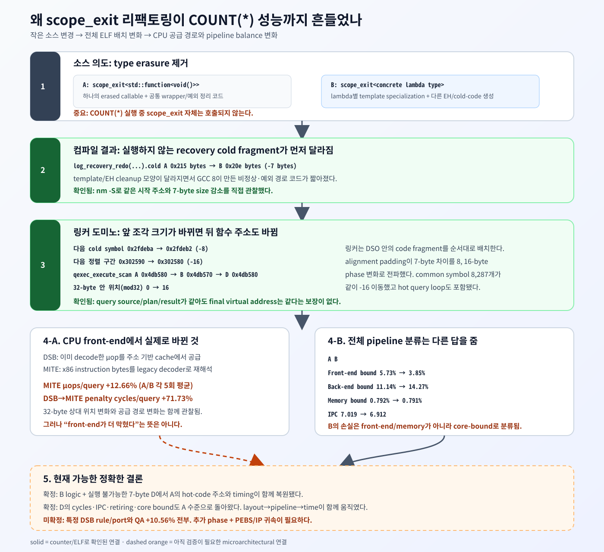

# CBRD-26382: `std::function` 제거가 `COUNT(*)` 성능까지 흔든 과정

- 작성일: 2026-08-26
- 대상 변경: CUBRID PR [#6636](https://github.com/CUBRID/cubrid/pull/6636)
- 상세 실험 보고서: [GCC 8 full-binary follow-up](CBRD-26382-gcc8-full-server-follow-up_codex.md)
- 결론 수준: final-ELF 배치 변화와 pipeline 분류까지 확인, 마지막 microarchitectural 연결은 추가 검증 필요

## 한 문장 답

`scope_exit`은 이 쿼리에서 실행되지 않지만, `std::function`을 concrete lambda type으로 바꾸자 GCC 8이 만든
recovery cold code가 7 byte 짧아졌고, 링크 정렬의 도미노 효과로 실제 쿼리 hot function들이 모두 16 byte
이동했다. 이 이동은 CPU가 instruction을 묶고 공급하는 방식까지 바꿨다. 다만 5회로 확장한 Top-down 결과는
slowdown을 front-end bound가 아니라 **execution core bound 증가**로 분류한다. 따라서 “DSB miss가 전부의
원인”은 아니며, 현재 정확히 확인된 원인은 **소스 로직의 직접 실행 비용이 아니라 final-binary layout에 민감한
CPU pipeline balance 변화**다.



## 먼저 구분할 두 질문

이번 현상에는 서로 다른 질문이 섞이기 쉽다.

| 질문 | 현재 답 |
|---|---|
| `scope_exit` callback이 `COUNT(*)` 실행 중 느려졌나? | 아니다. 이 query path는 `scope_exit`을 호출하지 않는다. |
| `scope_exit` refactor가 최종 server binary를 바꿔 query code의 CPU 실행 조건까지 바꿨나? | 그렇다. ELF 주소, 32-byte phase, PMU 공급 통계, Top-down 분류가 모두 바뀌었다. |
| 그 변화가 QA의 `+10.56%` 전부를 설명하나? | 아직 아니다. stable PC에서는 방향만 `+1.464%`로 재현됐고 historical QA ELF가 없다. |

즉 “호출하지 않는 함수이므로 영향이 0이어야 한다”는 결론은 source-level call graph까지만 본 것이다. CPU가
실행하는 것은 source file이 아니라 linker가 만든 하나의 `libcubrid.so.11.5`다.

## 쉬운 비유: 책 한 권을 얇게 만들었더니 뒤 책의 선반 칸이 바뀌었다

도서관 선반에 여러 책을 빈틈없이 놓는다고 생각하면 된다.

1. recovery라는 앞쪽 책에서 7쪽이 줄었다.
2. 선반은 8쪽, 16쪽 같은 경계에 맞춰 다음 책을 배치한다.
3. 중간의 빈 공간까지 다시 계산되면서 뒤에 있던 query 책들이 16칸 앞쪽으로 이동했다.
4. 사람에게 책 내용은 같아도 CPU에게는 “주소가 다른 instruction”이다.
5. CPU 내부의 decoded-instruction cache, fetch block, predictor 등은 주소를 색인으로 사용하므로 새 주소에서
   같은 code가 다른 경계와 내부 set을 사용할 수 있다.

이것이 “실행되지 않는 recovery code가 query 성능에 영향을 줄 수 있는” 연결 고리다.

## 1. 소스에서는 무엇이 바뀌었나

변경의 의도는 `std::function<void()>`의 type erasure와 간접 호출 가능성을 없애는 것이었다.

```cpp
// A: old
scope_exit<std::function<void (void)>> guard ([&] { cleanup (); });

// B: refactored
scope_exit guard {[&] { cleanup (); }};
```

실제 PR diff는 `scope_exit.hpp`와 `log_recovery_redo.hpp` 두 파일, `+45/-36`줄이다. 단순히 type 이름 한 줄만
지운 것은 아니고 다음도 함께 달라진다.

- 하나의 `std::function` wrapper 대신 lambda type별 template specialization이 생성된다.
- constructor/move/destructor의 exception specification과 cleanup code 모양이 달라진다.
- recovery의 page-unfix callback도 concrete lambda로 compile된다.

정상 recovery path에서는 이 refactor가 object 크기와 간접 호출 비용을 줄이는 좋은 변경이다. 문제는 C++
template와 exception cleanup 변화가 정상 경로뿐 아니라 `.text.unlikely`, EH table, COMDAT 배치에도 영향을
준다는 점이다.

## 2. 최초의 바이너리 변화는 query가 아니라 recovery cold code였다

CentOS 6/devtoolset-8 GCC 8.3.1 release build의 최종 DSO를 `nm -n -S -C`로 비교하면 첫 도미노를 직접 볼 수 있다.

| 단계 | A | B | 변화 |
|---|---:|---:|---:|
| `log_recovery_redo(...).cold` 시작 | `0x2fd72a` | `0x2fd72a` | 동일 |
| 같은 cold fragment 크기 | `0x215` | `0x20e` | **-7 byte** |
| 바로 뒤 common cold symbol | `0x2fdeba` | `0x2fdeb2` | **-8 byte** |
| 다음 정렬 구간 | `0x302590` | `0x302580` | **-16 byte** |

처음 두 build의 cold fragment 시작은 같다. B fragment의 끝만 7 byte 빨라진다. 다음 symbol은 alignment를 거치며
8 byte 앞당겨지고, 이후 정렬 경계에서 16 byte phase가 만들어진다. 그 뒤
`_GLOBAL__sub_I_fileline_location.cpp`부터 `log_recovery_analysis`까지 **8,287개 common symbol**이 연속해서
`-16` 이동한다. query executor가 이 구간 안에 있다.

원시 chain은
[`layout-shift-chain.csv`](artifacts/full-server-gcc8/stable-pc-cubridci/layout-shift-chain.csv)에 보존했다.

## 3. query code에는 어떤 변화가 전달됐나

아래 함수들은 A와 B 사이에 source-level query 로직 변경이 없지만 final address가 모두 16 byte 바뀌었다.

| hot function | A | B | address `% 32` A→B |
|---|---:|---:|---:|
| `qexec_execute_scan` | `0x4db580` | `0x4db570` | `0 → 16` |
| `fetch_val_list` | `0x47aa10` | `0x47aa00` | `16 → 0` |
| `qdata_evaluate_aggregate_list` | `0x49aee0` | `0x49aed0` | `0 → 16` |
| `qexec_execute_mainblock` | `0x4d3f20` | `0x4d3f10` | `0 → 16` |
| `scan_next_scan` | `0x501ef0` | `0x501ee0` | `16 → 0` |

`perf record`의 cycle profile에서 실제 query 시간의 대부분이 바로 이 함수들에 모였다. 가장 큰 함수는
`qexec_execute_scan`으로 전체 sample의 약 25~27%다. 따라서 주소가 바뀐 code와 실행된 code가 따로 놀지 않는다.

A/B 함수 raw byte hash도 다르다. 로직이 달라졌다는 뜻은 아니다. 다른 함수나 constant를 가리키는 PC-relative
displacement는 함수가 이동하면 machine-code byte도 달라질 수 있다. 반대로 B/C는 hot-function 주소와 raw byte
hash가 모두 같다. 이 B/C 대조군이 forced destructor `noexcept`가 query code를 되돌리지 못했다는 강한 증거다.

## 4. CPU front-end에서는 왜 16 byte가 의미가 있나

x86 core는 복잡한 instruction byte를 내부의 단순한 µop로 바꿔 실행한다. Intel front-end에는 크게 두 공급
경로가 있다.

- **MITE**: instruction cache에서 가져온 x86 byte를 legacy decoder가 새로 decode한다.
- **DSB**: 전에 decode한 µop를 저장해 두었다가 fetch/decode 일부를 우회해 공급한다.

Intel Optimization Reference Manual은 DSB가 더 높은 µop bandwidth와 낮은 front-end latency를 제공하며,
instruction을 32-byte aligned region 단위의 제약 아래 저장한다고 설명한다. 그러므로 hot code가 16 byte
이동하면 “같은 instruction이 어느 32-byte region에 묶이는가”가 뒤집힐 수 있다.
([Intel Optimization Reference Manual](https://www.intel.com/content/www/us/en/developer/articles/technical/intel64-and-ia32-architectures-optimization.html),
[Volume 2, §2.1.1.2](https://cdrdv2-public.intel.com/821614/356477-Optimization-Reference-Manual-V2-050.pdf))

주의할 점이 있다. “모든 32-byte 경계가 항상 느리다”는 규칙은 없다. branch 수, µop 수, DSB set/way, code
working set, flush 등이 함께 작용한다. Intel의 JCC 문서에 나오는 특정 32-byte branch 규칙도 해당 erratum과
processor에 한정되며 현재 CPU에 일반화하면 안 된다.
([Intel JCC mitigation guidance](https://www.intel.com/content/www/us/en/developer/articles/technical/software-security-guidance/best-practices/mitigation-strategies-jcc-microcode.html))

## 5. 5회로 늘린 PMU가 보여 준 실제 front-end 변화

초기 2회에서는 retired DSB miss/s가 B에서 `+52.819%`로 크게 보였다. 이를 그대로 결론으로 쓰지 않고 A/B의
core, L1I, front-end, DSB/MITE, retired-front-end 그룹을 각각 5회로 늘렸다.

| A→B metric | 5회 평균 변화 | 해석 |
|---|---:|---|
| DSB µops/query | `-0.039%` | 전체 DSB 공급량은 사실상 같다. |
| MITE µops/query | `+12.664%` | legacy decoder에서 공급한 µop가 늘었다. |
| host perf의 DSB→MITE penalty cycles/query | `+71.729%` | 공급 경로 전환 비용 신호가 늘었다. |
| retired DSB miss/query | `+10.923%` | 평균은 증가했지만 A 한 건의 큰 outlier로 분산이 크다. |
| L1I load miss/query | `+3.783%` | 일반 L1I capacity miss 증가는 작다. |
| IPC | `-1.519%` | A의 최저 IPC도 B의 최고 IPC보다 높아 5/5 분리됐다. |
| core-group query time | `+1.832%` | B가 느린 방향이 5회 평균에서도 유지됐다. |

`IDQ.MITE_UOPS` 증가는 “MITE가 더 많은 µop를 공급했다”는 직접 관측이다. 그러나 이것만으로 “왜 MITE로
갔는지” 또는 “그것이 wall time을 얼마나 늘렸는지”는 알 수 없다. Intel도 DSB/MITE 공급원 차이는 front-end가
실제 병목일 때 함께 해석해야 한다고 설명한다.
([Intel VTune CPU Metrics Reference](https://www.intel.com/content/www/us/en/docs/vtune-profiler/user-guide/2024-2/cpu-metrics-reference.html),
[Intel Arrow Lake P-core events](https://perfmon-events.intel.com/platforms/arrowlake/core-events/p-core/))

또한 현재 host `perf`가 노출한 `DSB2MITE_SWITCHES.PENALTY_CYCLES`는 count됐지만, 현재 Intel Arrow Lake
P-core online event 표에는 같은 이름이 없다. 따라서 이 값은 보조 신호로만 사용하고 결정적 근거로 사용하지
않는다.

## 6. 중요한 수정: slowdown은 front-end bound로 분류되지 않았다

DSB/MITE 변화가 곧 slowdown 원인인지 확인하려고 Intel Top-down L1/L2를 A/B 각각 5회 추가 측정했다.

| Top-down slot 비율 | A | B | B-A |
|---|---:|---:|---:|
| Retiring | `82.27%` | `81.02%` | `-1.25%p` |
| Front-end bound | `5.73%` | `3.85%` | `-1.88%p` |
| Back-end bound | `11.14%` | `14.27%` | **`+3.13%p`** |
| Bad speculation | `0.87%` | `0.94%` | `+0.08%p` |
| Memory bound | `0.792%` | `0.791%` | 사실상 동일 |
| Core bound (`backend - memory`) | `10.58%` | `13.48%` | **`+2.90%p`** |

B에서는 front-end bound가 오히려 줄었다. DSB/MITE 공급 경로가 바뀐 것은 사실이지만, CPU가 분류한 손실의
증가분은 memory가 아닌 execution core 쪽이다. 그러므로 다음 문장은 서로 다르다.

- 맞는 문장: “16-byte phase와 함께 DSB/MITE 공급 통계가 달라졌다.”
- 틀린 문장: “DSB miss `+52.8%`가 `+1.46%` slowdown을 전부 일으켰다.”

현재 가능한 microarchitectural 시나리오는 16-byte phase가 fetch/decode의 공급 timing과 burst 모양을 바꾸고,
그 결과 downstream scheduler/실행 port의 압력 분포까지 달라졌다는 것이다. 그러나 Top-down L1/L2만으로는
“어느 instruction이 어느 port/dependency에서 더 기다렸는가”까지 식별하지 못한다. 이 마지막 화살표는 아직
가설이다.

## 7. 왜 이 짧은 query에서 차이가 누적되나

대상 SQL은 다음 5중 Cartesian product다.

```sql
SELECT COUNT(*) FROM db_class a, db_class b, db_class c, db_class d, db_class e;
```

현재 DB에서는 `49^5 = 282,475,249`개의 조합을 세며, 같은 executor/scan loop를 매우 많이 반복한다. 한 iteration의
차이가 극히 작아도 수억 번 누적하면 wall time에서 보인다. 반대로 데이터는 이미 memory에 있고 결과도 한 행이라
storage 영향은 거의 없다.

실제 I/O matrix 40/40에서 physical `read_bytes=0`, major fault=0이었다. 따라서 최신 NVMe와 QA의 오래된
SATA/HDD 차이는 이 측정 구간의 version delta를 직접 설명하지 않는다.

## 8. 대안 가설을 어떻게 제거했나

| 대안 | 관측 | 판정 |
|---|---|---|
| query 결과/작업량 차이 | 모든 run이 `282475249` | 제거 |
| query plan 차이 | 네 variant normalized plan hash 동일 | 제거 |
| disk I/O | 40/40 `read_bytes=0`, major fault=0 | 제거 |
| CPU migration | migration과 elapsed time `r=0.085` | 주원인 아님 |
| `scope_exit` 직접 호출 비용 | 대상 query path에서 호출되지 않음 | 제거 |
| forced destructor `noexcept` | B/C hot address와 bytes 동일, timing 방향 불일치 | 해결책 아님 |
| `log_Gl` cache line | A/B 모두 `%64=0`, B/C layout 동일 | 주원인 아님 |
| general instruction front-end bound | B에서 Top-down FE bound 감소 | slowdown의 주분류 아님 |
| memory hierarchy bound | A/B memory bound 사실상 동일 | stable PC 주원인 아님 |

남는 공통 변수는 PR refactor가 만든 final-link code/data phase와 그에 따른 address-sensitive CPU core 동작이다.

## 9. QA에서는 왜 `+10.56%`였고 여기서는 `+1.464%`인가

stable PC에서 QA-2029/B를 각 20회 합치면 B는 평균 `+1.464%`, bootstrap 95% CI는
`+1.039% ~ +1.899%`다. slowdown 방향은 재현됐지만 QA의 크기는 재현되지 않았다.

오래된 QA CPU는 front-end, predictor, execution port, cache 구조와 frequency 제어가 현재 Intel Core Ultra와
다르다. 절대 query time도 QA `17.58~19.44s`, stable PC `4.76~4.83s`로 크게 다르다. 따라서 같은 binary phase
변화가 다른 크기로 증폭될 가능성은 충분하다. 하지만 “오래된 CPU라서 정확히 10.56%가 됐다”는 것은 아직
측정하지 않은 추론이다.

historical `cubridci:develop` digest, QA 원본 package ELF, QA CPU model/PMU가 없으므로 정확한 배율의 나머지는
현재 증거로 복원할 수 없다.

## 10. 인과를 마지막까지 확정하려면

“layout-sensitive”를 넘어 정확한 hardware 원인을 확정하려면 다음 순서가 필요하다.

1. **Padding sweep**: B의 source logic은 그대로 두고 앞쪽 cold section padding만 `0/8/16/24/32...`로 바꾼
   여러 binary를 만든다. query hot address phase와 time이 함께 주기적으로 움직이는지 확인한다.
2. **PEBS/IP attribution**: 지원되는 `FRONTEND_RETIRED.*` precise event와 core-bound 관련 precise event를
   instruction address에 귀속시킨다.
3. **Execution-port/dependency 분해**: Top-down L3의 port utilization, zero-port execution stall, load dependency,
   serialization을 동일 phase별로 비교한다.
4. **Historical QA 대조**: 당시 image digest와 `.2029/.2031` ELF를 확보해 같은 symbol phase와 PMU를 확인한다.

padding만 바꿔 time과 core-bound 비율이 되돌아오면 source semantics가 아니라 link phase가 원인이라는 인과가
완성된다. PEBS가 특정 hot instruction을 가리키면 마지막 hardware resource까지 특정할 수 있다.

## 결론

1. `std::function` 제거는 query에서 직접 실행되지 않았지만 GCC 8의 recovery cold fragment를 7 byte 줄였다.
2. linker alignment가 이를 8 byte, 다시 16 byte 주소 변화로 증폭해 hot query loop의 `%32` phase를 뒤집었다.
3. CPU front-end 공급 경로도 실제로 달라져 MITE µop와 전환 penalty 신호가 증가했다.
4. 그러나 확장 Top-down 측정은 B의 slowdown을 front-end가 아니라 **execution core bound 증가**로 분류했다.
5. 따라서 현재의 정확한 설명은 “`scope_exit` 실행 비용”이나 “DSB miss 단독 원인”이 아니라
   **PR이 만든 final-binary layout 변화에 따라 CPU pipeline balance가 달라진 현상**이다.
6. forced `noexcept`는 hot layout을 바꾸지 않아 해결책이 아니다. 정확한 hardware resource와 QA `+10.56%`
   배율을 확정하려면 padding sweep, PEBS, historical QA ELF가 필요하다.

## Evidence

- Stable-PC compact evidence:
  [`stable-pc-cubridci/`](artifacts/full-server-gcc8/stable-pc-cubridci/)
- Expanded 110-run PMU summary:
  [`pmu-summary-110-runs.json`](artifacts/full-server-gcc8/stable-pc-cubridci/pmu-summary-110-runs.json)
- Hot symbol address:
  [`hot-symbols.csv`](artifacts/full-server-gcc8/stable-pc-cubridci/hot-symbols.csv)
- Hot function raw-byte hashes:
  [`hot-function-hashes.csv`](artifacts/full-server-gcc8/stable-pc-cubridci/hot-function-hashes.csv)
- Link shift chain:
  [`layout-shift-chain.csv`](artifacts/full-server-gcc8/stable-pc-cubridci/layout-shift-chain.csv)
