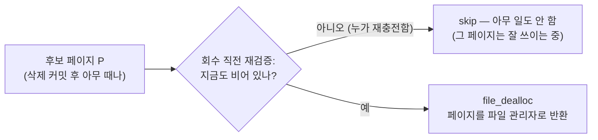

# R3 그림 설명 — "회수가 heap 페이지 latch 를 쥔 채 실행됩니다" (InChiJun 코멘트 #1)

> PR #7617 리뷰 코멘트 R3 가 무엇을 지적했고, 왜 맞는 지적이며, 커밋 `b43950a38` 이 어떻게 고쳤는지를 그림으로 설명한다.
> 한 줄 요약: **vacuum 이 heap 페이지 자물쇠를 쥔 채로 무거운 OOS 페이지 회수까지 하고 있었다 → 회수를 자물쇠를 놓은 뒤로 미뤘다 (미뤄도 절대 손해가 없는 작업이라서).**

## 0. 먼저 latch 란?

latch 는 **페이지 하나짜리 짧은 자물쇠**다. 어떤 스레드가 페이지를 WRITE latch 로 잡으면, 그 페이지를 읽거나 쓰려는 다른 트랜잭션은 전부 줄을 서서 기다린다. 그래서 철칙은 하나다: **자물쇠를 쥔 동안엔 꼭 필요한 최소한의 일만 하고 빨리 놓아라.**

<svg viewBox="0 0 760 210" xmlns="http://www.w3.org/2000/svg" role="img" aria-labelledby="svg1-title">
  <title id="svg1-title">WRITE latch 를 쥔 스레드와 대기하는 트랜잭션들</title>
  <rect x="300" y="70" width="170" height="70" rx="10" fill="#4a90d9" fill-opacity="0.15" stroke="currentColor"/>
  <text x="385" y="100" text-anchor="middle" fill="currentColor" font-size="15" font-weight="bold">heap 페이지</text>
  <text x="385" y="122" text-anchor="middle" fill="currentColor" font-size="12">(행들이 담긴 16KB 페이지)</text>
  <rect x="40" y="80" width="150" height="50" rx="10" fill="#e2574c" fill-opacity="0.15" stroke="currentColor"/>
  <text x="115" y="101" text-anchor="middle" fill="currentColor" font-size="14" font-weight="bold">vacuum</text>
  <text x="115" y="119" text-anchor="middle" fill="currentColor" font-size="12">WRITE latch 보유 중</text>
  <path d="M192 105 H296" stroke="currentColor" stroke-width="2"/>
  <path d="M296 105 l-9 -5 v10 z" fill="currentColor"/>
  <text x="244" y="96" text-anchor="middle" fill="currentColor" font-size="13">잠금</text>
  <rect x="560" y="20" width="160" height="42" rx="8" fill="none" stroke="currentColor" stroke-dasharray="5 4"/>
  <text x="640" y="46" text-anchor="middle" fill="currentColor" font-size="13">SELECT ... 대기</text>
  <rect x="560" y="84" width="160" height="42" rx="8" fill="none" stroke="currentColor" stroke-dasharray="5 4"/>
  <text x="640" y="110" text-anchor="middle" fill="currentColor" font-size="13">UPDATE ... 대기</text>
  <rect x="560" y="148" width="160" height="42" rx="8" fill="none" stroke="currentColor" stroke-dasharray="5 4"/>
  <text x="640" y="174" text-anchor="middle" fill="currentColor" font-size="13">DELETE ... 대기</text>
  <path d="M556 41 L474 88" stroke="currentColor" stroke-dasharray="5 4"/>
  <path d="M556 105 H474" stroke="currentColor" stroke-dasharray="5 4"/>
  <path d="M556 169 L474 122" stroke="currentColor" stroke-dasharray="5 4"/>
  <text x="515" y="140" text-anchor="middle" fill="currentColor" font-size="12">전부 대기</text>
</svg>

## 1. AS-IS: 자물쇠를 쥔 채 무거운 회수까지

vacuum 은 heap 페이지 하나를 잡고, 그 안의 레코드들을 차례로 청소한다. 문제의 코드는 **레코드 하나 청소가 끝날 때마다 그 자리에서 바로** OOS 빈 페이지 회수를 호출했다. 회수는 가벼운 일이 아니다 — 후보 페이지마다 ① OOS 통계 헤더 페이지를 **무조건 대기 WRITE latch** 로 잡고 ② `file_dealloc` + sysop 커밋 (로그 기록) 까지 한다.

<svg viewBox="0 0 780 250" xmlns="http://www.w3.org/2000/svg" role="img" aria-labelledby="svg2-title">
  <title id="svg2-title">AS-IS 타임라인: heap latch 보유 구간 안에서 회수가 반복된다</title>
  <text x="20" y="30" fill="currentColor" font-size="14" font-weight="bold">AS-IS: heap 페이지 WRITE latch 보유 구간</text>
  <rect x="20" y="45" width="740" height="56" rx="8" fill="#e2574c" fill-opacity="0.10" stroke="currentColor"/>
  <rect x="32" y="57" width="92" height="32" rx="5" fill="#4a90d9" fill-opacity="0.25" stroke="currentColor"/>
  <text x="78" y="77" text-anchor="middle" fill="currentColor" font-size="11">레코드1 삭제</text>
  <rect x="130" y="57" width="150" height="32" rx="5" fill="#e2a144" fill-opacity="0.35" stroke="currentColor"/>
  <text x="205" y="72" text-anchor="middle" fill="currentColor" font-size="11">회수: 헤더 latch 대기</text>
  <text x="205" y="85" text-anchor="middle" fill="currentColor" font-size="11">+ dealloc + 커밋</text>
  <rect x="286" y="57" width="92" height="32" rx="5" fill="#4a90d9" fill-opacity="0.25" stroke="currentColor"/>
  <text x="332" y="77" text-anchor="middle" fill="currentColor" font-size="11">레코드2 삭제</text>
  <rect x="384" y="57" width="150" height="32" rx="5" fill="#e2a144" fill-opacity="0.35" stroke="currentColor"/>
  <text x="459" y="72" text-anchor="middle" fill="currentColor" font-size="11">회수: 헤더 latch 대기</text>
  <text x="459" y="85" text-anchor="middle" fill="currentColor" font-size="11">+ dealloc + 커밋</text>
  <rect x="540" y="57" width="92" height="32" rx="5" fill="#4a90d9" fill-opacity="0.25" stroke="currentColor"/>
  <text x="586" y="77" text-anchor="middle" fill="currentColor" font-size="11">레코드3 삭제</text>
  <text x="694" y="77" text-anchor="middle" fill="currentColor" font-size="13">…</text>
  <path d="M20 130 H760" stroke="currentColor" stroke-width="2"/>
  <path d="M20 124 v12 M760 124 v12" stroke="currentColor" stroke-width="2"/>
  <text x="390" y="152" text-anchor="middle" fill="currentColor" font-size="13" font-weight="bold">다른 트랜잭션이 이 heap 페이지를 기다리는 시간 = 이 구간 전체</text>
  <text x="390" y="176" text-anchor="middle" fill="currentColor" font-size="12">회수 후보가 많을수록 (주황 구간이 늘어날수록) 대기 시간이 비례해서 늘어난다.</text>
  <text x="390" y="196" text-anchor="middle" fill="currentColor" font-size="12">주황 구간은 heap 페이지와 무관한 일인데도 heap 대기자들이 같이 기다린다.</text>
</svg>

## 2. 왜 특히 나쁜가 — 경합의 전이 (두 병목이 사슬로 엮임)

OOS 통계 헤더 페이지는 **모든 OOS INSERT 가 지나가는 관문**이다 (insert 는 "빈 공간 있는 페이지 어디지?" 를 찾을 때 이 헤더를 WRITE latch 로 잡는다). vacuum 이 heap 자물쇠를 쥔 채 이 관문 앞에 줄을 서면, 서로 무관해야 할 두 병목이 이렇게 엮인다:

<svg viewBox="0 0 780 300" xmlns="http://www.w3.org/2000/svg" role="img" aria-labelledby="svg3-title">
  <title id="svg3-title">경합 전이: INSERT 혼잡이 heap 페이지 대기로 번지는 사슬</title>
  <rect x="30" y="30" width="130" height="40" rx="8" fill="#4a90d9" fill-opacity="0.15" stroke="currentColor"/>
  <text x="95" y="55" text-anchor="middle" fill="currentColor" font-size="13">INSERT 1</text>
  <rect x="30" y="85" width="130" height="40" rx="8" fill="#4a90d9" fill-opacity="0.15" stroke="currentColor"/>
  <text x="95" y="110" text-anchor="middle" fill="currentColor" font-size="13">INSERT 2</text>
  <rect x="30" y="140" width="130" height="40" rx="8" fill="#4a90d9" fill-opacity="0.15" stroke="currentColor"/>
  <text x="95" y="165" text-anchor="middle" fill="currentColor" font-size="13">INSERT 3</text>
  <rect x="300" y="80" width="190" height="60" rx="10" fill="#e2a144" fill-opacity="0.25" stroke="currentColor" stroke-width="2"/>
  <text x="395" y="105" text-anchor="middle" fill="currentColor" font-size="14" font-weight="bold">OOS 통계 헤더</text>
  <text x="395" y="126" text-anchor="middle" fill="currentColor" font-size="12">모든 insert 의 관문 (choke point)</text>
  <path d="M162 50 L296 92" stroke="currentColor"/>
  <path d="M296 92 l-10 -2 6 8 z" fill="currentColor"/>
  <path d="M162 105 H296" stroke="currentColor"/>
  <path d="M296 105 l-9 -5 v10 z" fill="currentColor"/>
  <path d="M162 160 L296 128" stroke="currentColor"/>
  <path d="M296 128 l-10 2 6 -8 z" fill="currentColor"/>
  <rect x="300" y="210" width="190" height="52" rx="10" fill="#e2574c" fill-opacity="0.15" stroke="currentColor"/>
  <text x="395" y="231" text-anchor="middle" fill="currentColor" font-size="14" font-weight="bold">vacuum</text>
  <text x="395" y="250" text-anchor="middle" fill="currentColor" font-size="12">heap latch 쥔 채 헤더 대기</text>
  <path d="M395 206 V144" stroke="currentColor" stroke-dasharray="5 4" stroke-width="2"/>
  <path d="M395 144 l-5 9 h10 z" fill="currentColor"/>
  <rect x="580" y="206" width="170" height="60" rx="10" fill="#4a90d9" fill-opacity="0.15" stroke="currentColor"/>
  <text x="665" y="230" text-anchor="middle" fill="currentColor" font-size="14" font-weight="bold">heap 페이지</text>
  <text x="665" y="250" text-anchor="middle" fill="currentColor" font-size="12">대기자들이 줄 서 있음</text>
  <path d="M494 236 H576" stroke="currentColor" stroke-width="2"/>
  <path d="M576 236 l-9 -5 v10 z" fill="currentColor"/>
  <text x="535" y="228" text-anchor="middle" fill="currentColor" font-size="11">잠금 유지</text>
  <text x="390" y="288" text-anchor="middle" fill="currentColor" font-size="13" font-weight="bold">사슬: INSERT 가 붐빈다 → vacuum 의 헤더 대기 ↑ → heap 페이지 대기 ↑</text>
</svg>

리뷰어가 스스로 정확히 짚은 뉘앙스: 이것은 **데드락이 아니다**. 자물쇠를 잡는 순서 (heap → OOS 헤더) 가 어디서도 역방향으로 나타나지 않으므로 서로 물고 도는 교착은 불가능하다. 문제는 순수하게 **보유 시간**과 **경합 전이**다.

## 3. 덤으로 지적된 것 — dedupe (중복 제거) 무력화

15KB 급 값이 아니라면 한 OOS 페이지에 여러 값이 들어가므로, **이웃한 행들이 같은 OOS 페이지를 공유**하는 것이 보통이다. 그런데 회수 후보 목록이 "레코드 처리 함수의 지역 변수"였다 — 레코드마다 목록이 새로 만들어지니, 같은 페이지 P 를 레코드 수만큼 반복 검사했다.

<svg viewBox="0 0 780 240" xmlns="http://www.w3.org/2000/svg" role="img" aria-labelledby="svg4-title">
  <title id="svg4-title">레코드 단위 dedupe 와 페이지 배치 dedupe 비교</title>
  <rect x="30" y="40" width="150" height="150" rx="10" fill="#4a90d9" fill-opacity="0.10" stroke="currentColor"/>
  <text x="105" y="30" text-anchor="middle" fill="currentColor" font-size="13" font-weight="bold">heap 페이지</text>
  <rect x="45" y="55" width="120" height="34" rx="5" fill="none" stroke="currentColor"/>
  <text x="105" y="76" text-anchor="middle" fill="currentColor" font-size="12">레코드 r1</text>
  <rect x="45" y="98" width="120" height="34" rx="5" fill="none" stroke="currentColor"/>
  <text x="105" y="119" text-anchor="middle" fill="currentColor" font-size="12">레코드 r2</text>
  <rect x="45" y="141" width="120" height="34" rx="5" fill="none" stroke="currentColor"/>
  <text x="105" y="162" text-anchor="middle" fill="currentColor" font-size="12">레코드 r3</text>
  <rect x="280" y="90" width="140" height="56" rx="10" fill="#e2a144" fill-opacity="0.2" stroke="currentColor"/>
  <text x="350" y="114" text-anchor="middle" fill="currentColor" font-size="13" font-weight="bold">OOS 페이지 P</text>
  <text x="350" y="134" text-anchor="middle" fill="currentColor" font-size="12">세 레코드의 값이 함께</text>
  <path d="M168 72 L276 104" stroke="currentColor"/>
  <path d="M168 115 H276" stroke="currentColor"/>
  <path d="M168 158 L276 128" stroke="currentColor"/>
  <rect x="490" y="30" width="260" height="80" rx="10" fill="#e2574c" fill-opacity="0.12" stroke="currentColor"/>
  <text x="620" y="55" text-anchor="middle" fill="currentColor" font-size="13" font-weight="bold">AS-IS: 레코드 단위 목록</text>
  <text x="620" y="76" text-anchor="middle" fill="currentColor" font-size="12">r1 처리 → P 검사, r2 처리 → P 검사,</text>
  <text x="620" y="94" text-anchor="middle" fill="currentColor" font-size="12">r3 처리 → P 검사 … 같은 일 ×3</text>
  <rect x="490" y="130" width="260" height="80" rx="10" fill="#3d9970" fill-opacity="0.12" stroke="currentColor"/>
  <text x="620" y="155" text-anchor="middle" fill="currentColor" font-size="13" font-weight="bold">TO-BE: heap 페이지 배치 목록</text>
  <text x="620" y="176" text-anchor="middle" fill="currentColor" font-size="12">{P, P, P} 모아서 → 중복 제거 →</text>
  <text x="620" y="194" text-anchor="middle" fill="currentColor" font-size="12">P 검사 ×1</text>
</svg>

## 4. TO-BE: 자물쇠 안에서는 "수집만", 회수는 자물쇠를 놓은 뒤 1회

수정 (`b43950a38`) 은 회수를 없애는 것이 아니라 **시점을 옮기는 것**이다. 자물쇠 안에서는 페이지 번호를 목록에 적기만 하고 (매우 가벼움), 자물쇠를 놓은 뒤 모아서 한 번에 회수한다.

<svg viewBox="0 0 780 250" xmlns="http://www.w3.org/2000/svg" role="img" aria-labelledby="svg5-title">
  <title id="svg5-title">TO-BE 타임라인: latch 구간은 짧아지고 회수는 unfix 후 배치 1회</title>
  <text x="20" y="30" fill="currentColor" font-size="14" font-weight="bold">TO-BE: heap 페이지 WRITE latch 보유 구간 (짧아짐)</text>
  <rect x="20" y="45" width="400" height="56" rx="8" fill="#3d9970" fill-opacity="0.10" stroke="currentColor"/>
  <rect x="32" y="57" width="110" height="32" rx="5" fill="#4a90d9" fill-opacity="0.25" stroke="currentColor"/>
  <text x="87" y="72" text-anchor="middle" fill="currentColor" font-size="11">레코드1 삭제</text>
  <text x="87" y="85" text-anchor="middle" fill="currentColor" font-size="11">+ 후보 수집</text>
  <rect x="152" y="57" width="110" height="32" rx="5" fill="#4a90d9" fill-opacity="0.25" stroke="currentColor"/>
  <text x="207" y="72" text-anchor="middle" fill="currentColor" font-size="11">레코드2 삭제</text>
  <text x="207" y="85" text-anchor="middle" fill="currentColor" font-size="11">+ 후보 수집</text>
  <rect x="272" y="57" width="110" height="32" rx="5" fill="#4a90d9" fill-opacity="0.25" stroke="currentColor"/>
  <text x="327" y="72" text-anchor="middle" fill="currentColor" font-size="11">레코드3 삭제</text>
  <text x="327" y="85" text-anchor="middle" fill="currentColor" font-size="11">+ 후보 수집</text>
  <text x="440" y="80" fill="currentColor" font-size="12">← 여기서 latch 해제 (unfix)</text>
  <rect x="470" y="120" width="290" height="56" rx="8" fill="#e2a144" fill-opacity="0.25" stroke="currentColor"/>
  <text x="615" y="143" text-anchor="middle" fill="currentColor" font-size="12" font-weight="bold">배치 회수 1회 (중복 제거 후)</text>
  <text x="615" y="163" text-anchor="middle" fill="currentColor" font-size="12">헤더 latch·dealloc·커밋 — latch 밖에서</text>
  <path d="M420 73 C450 73 450 148 466 148" stroke="currentColor" fill="none" stroke-dasharray="5 4"/>
  <path d="M466 148 l-9 -5 v10 z" fill="currentColor"/>
  <path d="M20 200 H420" stroke="currentColor" stroke-width="2"/>
  <path d="M20 194 v12 M420 194 v12" stroke="currentColor" stroke-width="2"/>
  <text x="220" y="222" text-anchor="middle" fill="currentColor" font-size="13" font-weight="bold">heap 대기 시간: 삭제 자체 비용만 남음</text>
  <text x="615" y="200" text-anchor="middle" fill="currentColor" font-size="12">이 구간엔 heap 페이지 대기자가 없다</text>
</svg>

호출 지점은 `vacuum_heap_page` 의 `end:` 라벨 — 정상 경로·페이지 제거 경로·에러 경로가 전부 합류한 뒤, 즉 **home page 가 확실히 unfix 된 뒤**다.

## 5. 왜 "미뤄도" 안전한가 — 이 수정의 정당성

회수의 유일한 전제는 "페이지를 비운 삭제가 **커밋**됐을 것" (커밋 전에 회수하면, 그 삭제가 abort 될 때 undo 가 이미 없어진 페이지에 데이터를 되살리려다 사고가 남). 그리고 회수는 멱등이다. 그러면:

- **앞당기는 것** (커밋 전) 은 위험하고,
- **미루는 것**은 아무리 미뤄도 안전하다 — 커밋은 더 확실히 끝나 있고, 그 사이 누가 페이지를 다시 채웠으면 회수 직전의 재검증이 걸러서 그냥 건너뛴다.

즉 "삭제 직후 그 자리에서" 하던 것을 "heap 페이지 배치가 끝난 뒤"로 옮기는 일은, **안전성은 그대로 (오히려 여유가 늘고) 성능 문제만 제거**하는 방향의 이동이다. 이것이 이 수정이 관측 가능한 회수 결과를 바꾸지 않는 "동작 중립" 리팩터링인 이유다.

## 6. 정리 — 지적 vs 반영

| InChiJun 지적 | 반영 (`b43950a38`) |
|---|---|
| 회수가 heap home page WRITE latch 보유 중 실행 | 회수를 home page **unfix 후** 로 이동, heap 페이지 배치당 1회 |
| latch 보유 시간이 후보 수에 비례해 증가 | latch 안에서는 후보 페이지 번호 수집만 (상수급 비용) |
| OOS 헤더 경합이 heap 대기로 전이 | 헤더 경합이 일어나도 heap latch 는 이미 놓은 상태 — 사슬 절단 |
| dedupe 가 레코드 단위라 무력 | 후보 목록을 heap 페이지 스코프로 승격 — 배치 전체에서 중복 제거 |
| (후보당 무조건 헤더 latch 비용 — 코멘트 #2 와 겹침) | 2단계 판정 (`50c18b7de`) 에서 해결 — R4 답글에서 설명 |

답글 초안은 이 표의 오른쪽 열을 그대로 서술하고, 마지막 행은 R4 답글로 안내한다.
