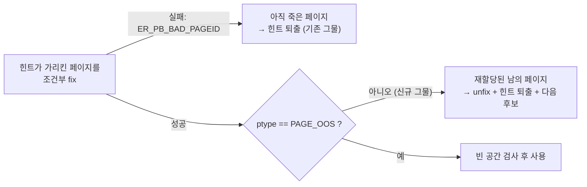

# hornetmj 리뷰 그림 설명 — 머지 보류 (B1·B2 blocker + M1–M4 + minor 14건)

> PR #7617 에 hornetmj 님이 2026-08-27 JIRA 첨부로 남긴 **머지 보류 리뷰**의 각 항목이 무엇이고, 왜 맞으며, 무엇으로 어떻게 처리했는지를 그림으로 설명한다.
> 중요한 맥락: 이 리뷰는 **옛 head `66cd3cc`** (티켓 11–15 스택이 올라가기 전) 를 기준으로 작성됐다. 그래서 상당수 (B2·M1·M3·M4 대부분) 는 이미 올라간 스택이 해소했고, **B1 하나가 현재 코드에도 살아 있던 진짜 결함**이라 새 커밋 `8ba9b5398` 로 고쳤다. 답글의 임무는 "항목 → 처리 → 커밋" 매핑 표와 재리뷰 요청이다.

## 0. 전체 지도

| # | 등급 | 요지 | 처리 | 커밋 |
|---|---|---|---|---|
| B1 | 🚫 blocker | 쓰기 직전 `ptype` 검증 누락 → 재할당된 파일테이블 페이지에 INSERT (release 손상 **실측 재현**) | **신규 수정** (리뷰 후에도 살아 있던 결함) | `8ba9b5398` |
| B2 | 🚫 blocker | "next vacuum cycle 에 재시도" 주석이 거짓 — 재시도 메커니즘 부재 | 주석 삭제를 넘어 **재시도 메커니즘을 실물로 구현** (성장 게이트 sweep) | `132163dab` |
| M1 | ⚠️ major | record 단위 회수 + heap latch 중 무조건 헤더 latch | = InChiJun R3+R4 와 동일 축 — 이미 반영 | `b43950a38`, `50c18b7de` |
| M2 | ⚠️ major | insert 경로에서 파일 전체 페이지 목록 materialize (15배 낭비 실측) | **동의, 후속 티켓** | — |
| M3 | ⚠️ major | `ER_INTERRUPTED` 를 삼키고 루프 계속 | 즉시 전파로 수정 | `50c18b7de` |
| M4 | ⚠️ major | 이 PR 의 실효를 검증하는 테스트 없음 (커버리지 0% 실측) | 실효 감지형 테스트로 재배선 | `8ba9b5398`, `132163dab` |
| 💡 | 제안 | `OLD_PAGE_PREVENT_DEALLOC` 프로토콜을 왜 안 쓰나 | 미채택 — 근거를 주석으로 명시 | `8ba9b5398` |
| 🔹 | minor ×14 | 아래 §6 | 8건 반영 / 6건 후속 | 혼합 |

## 1. B1 — 이 리뷰의 백미: "재할당된 페이지" 는 기존 그물을 전부 통과한다

### 1-1. 페이지의 일생과 힌트의 시차

bestspace 힌트는 "이 페이지에 빈 공간 있음" 이라는 **메모**다. 문제는 메모가 페이지의 실제 운명보다 오래 산다는 것:

<svg viewBox="0 0 760 260" xmlns="http://www.w3.org/2000/svg" role="img" aria-labelledby="hmsvg1-title">
  <title id="hmsvg1-title">페이지 1|578 의 일생: OOS 페이지에서 회수되고 파일테이블 페이지로 재할당되는 동안, 힌트는 계속 옛 주소를 가리킨다</title>
  <path d="M40 90 H720" stroke="currentColor" stroke-width="2"/>
  <circle cx="110" cy="90" r="7" fill="#4a90d9"/>
  <text x="110" y="60" text-anchor="middle" fill="currentColor" font-size="12" font-weight="bold">① OOS 페이지</text>
  <text x="110" y="76" text-anchor="middle" fill="currentColor" font-size="11">힌트 등록: "1|578 비어감"</text>
  <circle cx="300" cy="90" r="7" fill="#3d9970"/>
  <text x="300" y="60" text-anchor="middle" fill="currentColor" font-size="12" font-weight="bold">② 회수 (dealloc)</text>
  <text x="300" y="76" text-anchor="middle" fill="currentColor" font-size="11">이 구간은 기존 그물이 잡음</text>
  <circle cx="500" cy="90" r="7" fill="#e2574c"/>
  <text x="500" y="60" text-anchor="middle" fill="currentColor" font-size="12" font-weight="bold">③ 재할당: PAGE_FTAB</text>
  <text x="500" y="76" text-anchor="middle" fill="currentColor" font-size="11">파일테이블 페이지로 새 삶</text>
  <circle cx="660" cy="90" r="7" fill="#e2574c"/>
  <text x="660" y="60" text-anchor="middle" fill="currentColor" font-size="12" font-weight="bold">④ 힌트를 믿은 INSERT</text>
  <text x="660" y="76" text-anchor="middle" fill="currentColor" font-size="11">남의 페이지에 기록!</text>
  <rect x="180" y="130" width="250" height="44" rx="8" fill="#3d9970" fill-opacity="0.15" stroke="currentColor"/>
  <text x="305" y="149" text-anchor="middle" fill="currentColor" font-size="12">② 구간: 페이지가 "죽어 있는" 동안의 fix 는</text>
  <text x="305" y="166" text-anchor="middle" fill="currentColor" font-size="12">ER_PB_BAD_PAGEID 로 실패 → 힌트 퇴출 (기존 코드 OK)</text>
  <rect x="450" y="190" width="290" height="60" rx="8" fill="#e2574c" fill-opacity="0.15" stroke="currentColor" stroke-width="2"/>
  <text x="595" y="212" text-anchor="middle" fill="currentColor" font-size="12" font-weight="bold">③ 이후: 페이지가 "다시 유효" 해지면</text>
  <text x="595" y="230" text-anchor="middle" fill="currentColor" font-size="12" font-weight="bold">fix 가 성공한다 — 옛 그물이 못 잡는 구멍!</text>
  <text x="595" y="246" text-anchor="middle" fill="currentColor" font-size="11">유일한 단서는 페이지 타입 (ptype ≠ PAGE_OOS)</text>
</svg>

### 1-2. 왜 "정상 슬롯 페이지처럼" 보였나 — 리뷰어의 포렌식

리뷰어는 실측으로 더 무서운 사실을 보였다: 파일테이블 초기화는 데이터 영역을 memset 하지 않아서, **직전 OOS 페이지의 잔재 바이트들이 우연히 "그럴듯한 슬롯 페이지 헤더"로 읽힌다** (alignment=8 잔존, total_free 가 큰 양수로 해석, anchor 값도 유효 범위). 그래서 debug 빌드의 슬롯 페이지 검증 assert 조차 한참 뒤 (`spage_compact`) 에야 터지고, **release 빌드는 assert 를 지나쳐 파일테이블 페이지를 슬롯 페이지로 compact + INSERT + WAL 로깅까지 진행** — 즉 redo 로 재현되는 영구 손상이 된다.

<svg viewBox="0 0 760 250" xmlns="http://www.w3.org/2000/svg" role="img" aria-labelledby="hmsvg2-title">
  <title id="hmsvg2-title">네 개의 검사 지점 중 세 곳은 ptype 을 확인하는데, 정작 페이지에 쓰는 경로만 확인이 없었다</title>
  <text x="20" y="28" fill="currentColor" font-size="14" font-weight="bold">"회수를 아는" 네 지점의 방어 상태 (리뷰어의 표)</text>
  <rect x="20" y="45" width="345" height="40" rx="8" fill="#3d9970" fill-opacity="0.15" stroke="currentColor"/>
  <text x="192" y="70" text-anchor="middle" fill="currentColor" font-size="12">sync 스캔 (읽기) — MAYBE_DEALLOCATED ✓ + ptype ✓</text>
  <rect x="20" y="95" width="345" height="40" rx="8" fill="#3d9970" fill-opacity="0.15" stroke="currentColor"/>
  <text x="192" y="120" text-anchor="middle" fill="currentColor" font-size="12">통계 수집 (읽기) — MAYBE_DEALLOCATED ✓ + ptype ✓</text>
  <rect x="20" y="145" width="345" height="40" rx="8" fill="#3d9970" fill-opacity="0.15" stroke="currentColor"/>
  <text x="192" y="170" text-anchor="middle" fill="currentColor" font-size="12">회수기 자신 — MAYBE_DEALLOCATED ✓ + ptype ✓</text>
  <rect x="20" y="195" width="345" height="44" rx="8" fill="#e2574c" fill-opacity="0.2" stroke="currentColor" stroke-width="2"/>
  <text x="192" y="214" text-anchor="middle" fill="currentColor" font-size="12" font-weight="bold">bestspace lookup → 여기서 얻은 페이지에 INSERT</text>
  <text x="192" y="232" text-anchor="middle" fill="currentColor" font-size="12" font-weight="bold">MAYBE_DEALLOCATED ✓ … ptype ✗ (유일한 쓰기 경로!)</text>
  <rect x="420" y="95" width="320" height="100" rx="10" fill="none" stroke="currentColor" stroke-dasharray="5 4"/>
  <text x="580" y="122" text-anchor="middle" fill="currentColor" font-size="12">아이러니: 읽기만 하는 세 곳은 타입을 확인하고,</text>
  <text x="580" y="142" text-anchor="middle" fill="currentColor" font-size="12">실제로 페이지를 훼손할 수 있는 유일한 곳</text>
  <text x="580" y="162" text-anchor="middle" fill="currentColor" font-size="12">(INSERT 가 쓸 페이지를 고르는 곳) 만</text>
  <text x="580" y="182" text-anchor="middle" fill="currentColor" font-size="12">확인이 빠져 있었다.</text>
</svg>

### 1-3. 수정 — 리뷰어의 제안 그대로 + 한 걸음 더

fix 성공 직후 `pgbuf_get_page_ptype () != PAGE_OOS` 면 그 자리에서 힌트 퇴출 + 다음 후보로. 퇴출 로직은 기존 `ER_PB_BAD_PAGEID` 분기와 같아서 헬퍼 (`oos_stats_evict_stale_hint`) 로 묶었다 (리뷰어도 "헬퍼로 묶는 편이 낫겠다"고 제안). 회귀 테스트는 **파일 자신의 파일테이블 헤더 페이지 (`PAGE_FTAB`, vpid = {fileid, volid})** 를 가리키는 힌트를 일부러 심고, lookup 이 두 번 다 그 페이지를 내주지 않는지 확인한다 — "재할당된 남의 페이지"를 별도 파일 없이 재현하는 결정적 장치다.

## 2. B2 — "다음 vacuum 사이클이 재시도한다" 는 주석은 거짓이었다

리뷰어의 논증: 회수 후보는 "**이번 배치가** 청크를 지운 페이지" 에서만 나온다. 그러니 busy 로 한 번 skip 된 페이지, eager 경로가 비운 페이지, PR 이전부터 쌓인 빈 페이지를 "다음 사이클" 이 다시 후보로 만들 방법이 코드에 없다 — 주석만 낙관적이었다. **전적으로 맞는 지적**이고, 사실 이 지적이 (H2SU 실측과 함께) 성장 게이트 sweep 을 만들게 한 원동력이다.

| 빈 페이지 발생 경로 (리뷰어의 표) | 리뷰 시점 | 현재 (sweep 이후) |
|---|---|---|
| 이번 배치가 비움 (busy 아님) | ✅ 회수 | ✅ 회수 (fast path) |
| 이번 배치가 비웠으나 그 순간 busy | ❌ 영구 미회수 | ✅ 다음 성장 sweep 이 재발견 |
| eager 즉시삭제 경로 (SA·카탈로그) | ❌ 미연결 | ✅ 카운터가 게이트를 무장, sweep 회수 |
| PR 이전의 누적 빈 페이지 (부채) | ❌ 앞 100페이지 밖이면 영구 미발견 | ✅ boot rule — 부팅 후 첫 성장이 무조건 1바퀴 |

제안 ① (당시 죽은 필드 `full_search_vpid` 로 재개 지점 구현) 은 **side map 커서**로 대체 구현됐다 (같은 아이디어, 저장 위치만 in-memory — 유실돼도 boot rule 이 흡수하므로 영속화가 불필요). 죽은 writer 는 제거했다.

## 3. M1·M3 — 이미 스택이 해소한 항목들

- **M1** (record 단위 회수 + heap latch 중 무조건 대기 헤더 latch): InChiJun R3+R4 와 같은 축 — heap 페이지 배치 상향 + unfix 후 호출 (`b43950a38`), 2단계 판정으로 non-empty 후보의 헤더 비용 0 (`50c18b7de`). 헤더 latch 를 CONDITIONAL 로 바꾸라는 하위 제안 (a) 는 **부분 채택** — UNCONDITIONAL 을 유지하되, 잡는 주체가 "빈 페이지 확정분 + heap latch 무보유 상태" 로 한정되어 원지적 (경합 전이) 이 소멸했기 때문. 답글에 이 차이를 정직하게 명시했다.
- **M3** (`ER_INTERRUPTED` 삼킴): 리뷰어 제안 그대로 — 인터럽트는 즉시 전파·중단, 나머지 실패만 흡수 (`50c18b7de`).

## 4. M4 — "테스트가 통과하는데 회수는 0번 실행됐다"

리뷰어가 계측으로 보인 뼈아픈 사실: 페이지 수 상한을 단정하는 테스트 (TC-V8 "+2 이내", TC-V9 "×2 이내") 가 **회수를 한 번도 부르지 않고도 통과**하고 있었다. 상한이 느슨하면 "회수가 조용히 안 도는" 회귀를 영원히 못 잡는다.

<svg viewBox="0 0 760 210" xmlns="http://www.w3.org/2000/svg" role="img" aria-labelledby="hmsvg3-title">
  <title id="hmsvg3-title">느슨한 상한 단정은 회수 미실행을 통과시키지만, 감소 단정은 실행 여부를 감지한다</title>
  <text x="20" y="28" fill="currentColor" font-size="14" font-weight="bold">TC-V9 (10행 전부 삭제 후) 의 단정 비교</text>
  <rect x="20" y="48" width="350" height="130" rx="10" fill="#e2574c" fill-opacity="0.12" stroke="currentColor"/>
  <text x="195" y="72" text-anchor="middle" fill="currentColor" font-size="13" font-weight="bold">AS-IS: "재삽입 후 ≤ 처음×2"</text>
  <text x="195" y="98" text-anchor="middle" fill="currentColor" font-size="12">회수가 아예 안 돌아도 (0회 실측)</text>
  <text x="195" y="118" text-anchor="middle" fill="currentColor" font-size="12">bestspace 재사용만으로 통과 가능</text>
  <text x="195" y="150" text-anchor="middle" fill="currentColor" font-size="12" font-weight="bold">→ 커버리지 0%</text>
  <rect x="390" y="48" width="350" height="130" rx="10" fill="#3d9970" fill-opacity="0.12" stroke="currentColor" stroke-width="2"/>
  <text x="565" y="72" text-anchor="middle" fill="currentColor" font-size="13" font-weight="bold">TO-BE: 실제 배치 회수 실행 후</text>
  <text x="565" y="98" text-anchor="middle" fill="currentColor" font-size="12">"페이지 수 == 1 (sticky first page 만)"</text>
  <text x="565" y="118" text-anchor="middle" fill="currentColor" font-size="12">+ 재삽입 후 ≤ 초기 footprint</text>
  <text x="565" y="150" text-anchor="middle" fill="currentColor" font-size="12" font-weight="bold">→ 회수가 안 돌면 즉시 실패</text>
</svg>

함께: `vacuum_heap_oos_delete_within_sysop` 의 `= NULL` 기본 인자를 제거해 (호출자가 회수 생략을 **명시적으로** 선택해야 함) "조용한 생략" 재발을 막았고, 성장 sweep 자체는 신규 스위트 (`test_oos_growth_sweep`, 7종) 가 net 페이지 수로 검증한다.

## 5. 💡 PREVENT_DEALLOC 제안 — 채택하지 않고, 근거를 주석으로

제안: heap 의 동일 기능처럼 `OLD_PAGE_PREVENT_DEALLOC` (리더가 "내가 이 페이지에 도달했다" 를 표시해 dealloc 을 막는 프로토콜) 을 쓰지 그러냐 + 안 쓰면 근거를 주석으로.

미채택 근거 (주석으로 추가, `8ba9b5398`): 리더가 OOS 체인 페이지에 도달하는 유일한 경로는 **살아 있는 레코드 버전의 head OOS OID** 인데, vacuum 은 **모든 활성 스냅샷에 불가시한 버전**의 체인만 지운다. 따라서 "리더가 걷는 중인 체인의 페이지가 비어서 회수되는" 시나리오 자체가 성립하지 않는다 (heap 스캔과 달리 OOS 는 임의 순회가 없다). 기존의 dealloc 내성 (probe, `MAYBE_DEALLOCATED`, 이번 ptype 재검증) 은 stale **힌트**에 대한 심층 방어이고, PREVENT_DEALLOC 이 더해 줄 것은 zero-wait 로 설계된 경로에 대기 간선을 되들이는 비용뿐이다.

## 6. Minor 14건 — 처리 분류

| 처리 | 항목 |
|---|---|
| **반영 (8)** | second_best 링 청소 (`:1336`) · 죽은 `full_search_vpid` writer 제거 (`:903`) · 후보 수집 OOM 비치명화 — 배치 롤백 제거 (`:2451`) · 해시 후보의 무관 best[] 슬롯 오염 (`:677`) · `oos_find_best_page` nullptr 미검사 (`:1792`) · fhead 조회 배치당 1회 hoist (`:1257`) · 레코드당 vector 생성 (`vacuum.c:2460`) · sync 추월 힌트 (`:879`) — ptype 재검증이 최종 방어선 |
| **후속 (6)** | `log_skip_logging` no-op 정리 · 성장 경로 set_dirty (`:2288`) · `oos_get_length` gone 보고 방식 (`:2665`) · read/delete 경로 dealloc 내성 비대칭 (`:2390` 등) · ADR 문서 인리포 반영 · M2 (컬렉터 상한/iterator) |
| **의견 차 명시 (1)** | `oos_delete` 의 `touched_vpids = NULL` 기본 인자는 유지 — eager/forward-walk 호출자는 후보 리스트가 없는 게 정당 (sweep 이 backstop). 위험했던 vacuum 쪽 (`within_sysop`) 기본값만 제거 |

## 7. 답글이 왜 이 구성인가

이 리뷰는 실측까지 곁들인 고밀도 리뷰라, 답글의 예의는 **같은 밀도의 매핑**이다: 항목마다 (a) 처리 여부 (b) 커밋 해시 (c) 다르게 한 부분은 그 이유 — 특히 "리뷰 기준 head 이후 스택이 올라갔다" 는 맥락을 첫 줄에 밝혀, 리뷰어가 어떤 커밋부터 다시 보면 되는지 즉시 알 수 있게 한다. 마지막의 재측정 표와 "재리뷰 부탁드립니다" 가 머지 보류를 푸는 공식 요청이다.
