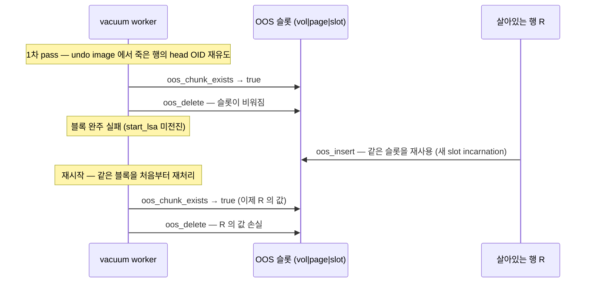

# [CBRD-26950] Verify OOS chain identity before vacuum delete — 상세 설명 (page LSA 신원 스탬프)

- JIRA: https://jira.cubrid.org/browse/CBRD-26950
- PR: https://github.com/CUBRID/cubrid/pull/7695
- 대상 커밋: `eaf1165bb` (base: `feat/oos` `f4299ac0c`, CBRD-26786 빈 페이지 회수 포함)
- 이전 판: `c09d6c6d9` 판 ([문서](./CBRD-26950-oos-identity-stamp-page-lsa_c09d6c6_claude.md)). 설계는 그대로이고, 그 뒤 리뷰 수정 여섯 조각이 붙었다 — 아래 "리뷰 수정".
- 이전 설계: PR head `ecebe6288` 의 generation counter 설계는 리뷰를 거쳐 폐기했다. 판단 근거는 [page LSA vs generation 비교 문서](./2026-08-20-CBRD-26950-page-lsa-vs-generation_ecebe62_claude.md).
- 작성: 2026-09-04, 갱신: 2026-09-11, Claude Code

## Purpose

vacuum 이 죽은 행의 OOS 값 체인을 회수할 때, 그 사이 다른 살아있는 행이 재사용한 저장 위치를 잘못 지워 데이터가 사라지는 문제를 막는다.

OOS (Out-of-row Overflow Storage) 는 heap 행의 큰 가변 컬럼 값을 별도 OOS 파일의 페이지로 빼서 저장하고, 행에는 작은 참조 (OOS inline stub) 만 남기는 방식이다. 이 참조의 핵심은 head OOS OID 인데, OID 는 `(volid, pageid, slotid)` 물리 주소라서 슬롯이 비고 다시 채워지면 같은 OID 가 다른 값을 가리킨다. 이 문서에서는 한 슬롯을 한 레코드가 연속으로 차지하는 구간을 **slot incarnation (슬롯 점유 세대)**, 한 페이지가 할당되어 해제되기까지를 **page incarnation (페이지 할당 세대)** 이라 부른다.

- **AS-IS**: 회수 직전 확인은 "슬롯에 무엇이 있나" 만 보는 점유 여부 검사 (`oos_chunk_exists`) 하나뿐이다. vacuum 블록이 완주하지 못하면 (`start_lsa` 미전진) 재시작 후 같은 블록을 불변의 undo image 부터 다시 걷는데, 1차 pass 가 비운 슬롯을 그 사이 살아있는 행이 재사용했다면 2차 pass 가 그 행의 값을 지운다. JIRA 재현 스크립트가 실행마다 수백 건의 커밋된 값을 잃는다. CBRD-26786 이 base 에 들어온 뒤로는 한 단계 위, 페이지가 해제되고 재할당되는 경우에도 같은 실패가 성립한다.
- **TO-BE**: 모든 OOS 값 체인은 만들어질 때 **identity stamp (신원 스탬프)** 를 받는다. 값은 head 청크를 넣기 직전, write latch 아래에서 읽은 그 페이지의 page LSA 다. 스탬프는 청크 헤더와 heap 의 OOS inline stub 양쪽에 기록되고, `oos_delete` 는 삭제 전에 stub 의 스탬프와 head 청크의 스탬프를 대조해 같을 때만 지운다. head 가 없거나, 스탬프가 다르거나, 페이지가 해제되어 있으면 에러 없는 no-op 이다. 읽기 경로 (`oos_read`) 도 같은 스탬프를 검증해 남의 체인 바이트를 돌려주는 대신 손상 에러를 낸다.

새 카운터가 아니라 page LSA 를 쓰는 이유는 ADR 로 정리한 대로다. page LSA 는 이미 모든 페이지에 있고, 페이지별로 단조 증가하며 정상 운영에서 역행하지 않고, 로깅된 청크 이미지 안에 들어 있어 redo 가 그대로 복원한다. 관리할 새 상태가 없으니 slot 0 헤더 레코드, 새 복구 인덱스, redo 의 MAX 재생, wrap-around 은퇴, 페이지 재할당 시 리셋 규칙이 전부 사라진다. 비용은 스탬프가 4B 대신 8B 라는 것 하나다.

AS-IS 의 사고 시퀀스:

TO-BE 에서는 마지막 두 단계가 `oos_delete (ref)` 하나로 바뀌고, head 청크의 스탬프가 stub 의 스탬프와 다르므로 아무것도 지우지 않고 성공으로 돌아온다.

## Implementation

커밋은 티켓 단위로 다섯 개, 그리고 리뷰 후속 하나다. 각 커밋은 단독으로 빌드되고 OOS ctest 전부를 통과한다.

| 커밋 | 내용 |
|---|---|
| `0c398694e` | 빈 페이지 후보 목록 정제 (CBRD-26786 의 후속, 의도적으로 포함) |
| `b19662930` | 청크 헤더에 identity stamp 발급, 공개 accessor, 체인 참조 타입 |
| `a718e2365` | OOS inline stub 24B, 파서·추출기가 체인 참조 반환, 읽기 검증 |
| `eb6830d0b` | 모든 회수 경로에서 신원 검증 후 삭제, 점유 probe 를 forward walk 에서 제거 |
| `cef95fad1` | 복제 publication 에 스탬프 동반, slave fixup 이 stub 의 OID·스탬프 재기록 |
| `c09d6c6d9` | 리뷰 후속: stub 추출기가 두 bigint 읽기의 상태를 각각 확인, 청크 헤더·stub 24B 를 테스트로 고정, 테스트 주석 정리 |
| `c78d31f90` | 리뷰 수정 1 — stub 필드 경계 |
| `29fc3567f` | 리뷰 수정 2 — stale·재타입 참조 |
| `72ab54e14`, `be06f5f89` | 리뷰 수정 3 — eager 진단 |
| `4e74f33d2` | 리뷰 수정 4 — 로깅 전제 |
| `e19ddb9e2` | 리뷰 수정 5 — 복구 신원 |
| `eaf1165bb` | 리뷰 수정 6 — 두 축 리뷰 반영 |

### 리뷰 수정

`c09d6c6d9` 판을 대상으로 한 독립 리뷰의 지적을 여섯 조각으로 나눴다. 앞의 셋은 동작 수정이고, 뒤의 셋은 계약을 정확히 적고 증명하는 작업이다. 조각마다 수정 전 head 에서 먼저 실패를 확인했고, 그럴 수 없는 경우 (없던 진단, 없던 보장) 는 반대 방향으로 민감도를 세웠다 — 고친 트리에서 동작 하나씩을 껐을 때 의도한 케이스만 실패하는지.

| 조각 | 문제 | 수정 | 민감도 |
|---|---|---|---|
| 1. stub 필드 경계 | 파서·추출기·replica fixup 이 레코드 끝만 보고 24B 를 읽었다. 16B 짧은 필드 뒤에 다른 속성이 오면 fixup 이 그 속성 위에 스탬프를 썼다 | 셋 다 VOT 이 정한 필드 폭 안에서만 읽고 쓴다 | 수정 전 head 에서 세 케이스가 각각 0/-1040/-1380 로 실패 |
| 2. stale·재타입 참조 | 해제된 페이지·부재 슬롯·재사용 슬롯을 읽으면 page buffer 의 dead-page assert, slotted page 헤더 검증, head index assert 에서 프로세스가 죽거나 새 점유자의 바이트가 호출자 버퍼에 들어갔다 | head 페이지는 해제 허용 fix 로 잡고 latch 아래에서 페이지 타입을 먼저 확인한다. 신원을 가장 먼저 비교하고, 스탬프가 맞아도 head 가 아닌 청크를 가리키는 참조는 아무것도 바꾸기 전에 거부한다 | 수정 전 head 에서 여섯 케이스가 abort 하거나 남의 바이트를 돌려줬다 |
| 3. eager 진단 | 비 MVCC (SA) 경로의 즉시 회수가 대상이 사라져도 아무 말 없이 성공했다 | DML 은 완료하되 건너뛴 회수마다 `ER_HEAP_OOS_EAGER_CLEANUP_SKIPPED` 를 남기고, 성공한 호출은 에러 스택을 비워 둔다. vacuum 재주행은 예상된 상황이라 조용하다 | 진단 발행을 끄면 진단 케이스 6개만 실패하고 "조용해야 한다" 는 4개는 통과한다. 같은 알림을 `oos_delete` 에서도 내면 vacuum 쪽 2개가 실패한다 |
| 4. 로깅 전제 | 한 슬롯의 두 점유자가 다른 스탬프를 갖는다는 불변식이 조건 없이 적혀 있었다 | 로깅이 켜진 연산에 한한 보장임을 발급 지점·stub 필드 주석·삭제 계약 양쪽 NOTE·ADR·규범 문서에 적었다. 판단 기준은 시작 파라미터가 아니라 실제 상태 (`log_is_no_logging`) 다 | 같은 슬롯 재사용 시나리오가 로깅 켠 상태에서는 스탬프를 가르고, 끈 상태에서는 겹친다 — 한 테스트 안에서 둘 다 |
| 5. 복구 신원 | 기존 abort 테스트는 head 청크가 **지금** 갖고 있는 스탬프로 참조를 만들어 읽었다. 복구가 무엇을 되살렸든 그것과 일치하므로 보존을 증명하지 못한다 | 삭제 전 원본 참조와 원본 payload 를 붙잡아 두고 그 참조로 되읽는다. 트랜잭션 abort·sysop abort·다중 청크 롤백·부분 적용 후 롤백·복구 콜백 직접 호출·정상 재시작·실제 크래시 redo 를 각각 따로 검증한다 | `oos_rv_redo_insert` 가 재생하는 스탬프를 1 만큼 밀면 다섯 케이스와 크래시 케이스가 전부 실패하고 정상 재시작 대조군만 통과한다 |
| 6. 검증 | — | 두 축 (Standards / Spec) 독립 리뷰를 다시 돌리고, 지적을 반영하거나 근거를 남기고 기각했다 | — |

조각 4 의 전제를 한 번 더 좁혀 둔다. 런타임 활성화 (`log_set_no_logging`) 는 standalone 전용이지만, 숨은 `no_logging` 파라미터는 `PRM_FOR_SERVER` 이고 `log_initialize` 가 모드 구분 없이 여기서 `log_No_logging` 을 채운다. 즉 서버도 로깅 없이 뜰 수 있고, vacuum 블록 재주행이 있는 곳은 서버다. 이번 수리에서 그런 운영 경로를 확인하지는 못했고, 합의된 정책은 전제를 명시하는 쪽이다 — 앞으로 stale 참조를 만드는 쪽이 이 전제를 지키거나 설계를 다시 열어야 한다.

### 온디스크 변경 (feat/oos 미출시 — DB 재생성으로 충분)

| 대상 | AS-IS | TO-BE |
|------|-------|-------|
| 청크 헤더 `oos_record_header` (`src/storage/oos_file.hpp`) | 16B: `total_data_length`, `chunk_index`, `next_chunk_oid` | 24B: 뒤에 `LOG_LSA identity_stamp` 추가. 페이지당 최대 청크 payload 는 헤더 상수를 따라 8B 줄어든다 |
| OOS inline stub (`OR_OOS_INLINE_SIZE`, `src/base/object_representation.h`) | 16B: head OID 8B + full length 8B | 24B: + identity stamp 8B. `LOG_LSA` 를 bigint 하나로 packing 해 (`oos_pack_identity_stamp` / `oos_unpack_identity_stamp`) 8B 정렬을 유지한다. 12B 를 쓰는 기존 LSA helper 는 쓰지 않는다 |
| 삭제 조건 | 슬롯 점유 여부 | head 청크 스탬프 == stub 스탬프. 불일치·부재·페이지 해제는 no-op |
| 읽기 조건 | `chunk_index`, `total_data_length` 일치 | + 스탬프 일치. 불일치는 `ER_HEAP_OOS_CORRUPTED_RECORD` (새 에러 코드 없음) |
| 빈 페이지 회수 후보 목록 | 청크를 지운 모든 페이지 (중복 허용, "touched") | 삭제로 레코드 0개가 된 페이지만, 한 번씩 ("emptied") |

### 발급 — `src/storage/oos_file.cpp`

`oos_insert_record_in_fixed_page` 는 이미 write latch 를 쥔 채 청크 헤더를 만든다. 헤더 바이트를 만들기 **전에** `pgbuf_get_lsa (page_ptr)` 를 읽어 `identity_stamp` 에 넣고, 그 latch 를 slotted page insert 와 이 청크의 로그 append 까지 유지한다. 그래서 스탬프는 "이 청크의 로깅 직전 page LSA" 다. 이 지점에 세 불변식을 주석으로 적어 두었다.

1. 스탬프는 이 청크의 로그 append **이전** 의 page LSA 다. redo 는 자신이 재생하는 레코드의 LSA 를 알 수 없지만, 스탬프가 로깅된 청크 이미지 안에 있으므로 redo (와 나중 delete 의 undo) 가 그대로 복원한다.
2. **로깅이 켜져 있는 동안만** 성립한다: 한 슬롯의 두 incarnation 사이에는 로깅된 페이지 연산이 최소 하나 있다. 첫 점유자의 insert 로그가 page LSA 를 스탬프 너머로 올리고 page LSA 는 역행하지 않으므로, 다음 점유자는 항상 다른 스탬프를 받는다. 지금은 배치 삽입을 포함해 청크 insert·delete 하나가 로그 레코드 하나다. 여러 insert 를 로그 레코드 하나로 합치는 최적화가 생기면 이 불변식을 지켜야 한다. 로깅이 꺼져 있으면 append 를 건너뛰어 page LSA 가 그대로이므로 두 incarnation 이 같은 스탬프를 가질 수 있다 — 문서화된 no-logging 대량 적재는 그대로 지원하고 전제만 명시한다.
3. NULL 은 특별 취급 없는 보통 값이다. NULL page LSA 를 만드는 것은 오프라인 로그 재생성 유틸리티 (`log_recreate`) 뿐이고, 그것은 로그와 함께 대기 중인 회수 요청도 모두 버리므로 stale 참조가 새 LSA 공간으로 넘어올 수 없다.

체인은 tail 부터 쓰므로 `oos_insert_across_pages` 는 마지막 반복 (head, `i == 0`) 의 스탬프를 보고한다. 각 청크는 자기 페이지의 LSA 를 갖고, stub 에는 head 의 값만 들어간다. `oos_insert` 와 `oos_insert_request` 에 선택적 출력 (`identity_stamp_out`) 을 두었고, 새 페이지는 `RVPGBUF_NEW_PAGE` 로 로깅되어 초기화되므로 정상 삽입이 NULL 스탬프를 관측하는 일은 없다.

### 참조 타입과 heap 측 — `src/storage/heap_file.c`, `heap_oos.cpp`, `heap_file.h`

- `oos_chain_ref { OID head_oid; LOG_LSA identity_stamp; }` 가 "체인 참조" 값 타입이다. stub 파서 `heap_oos_parse_inline_ref` 가 이것을 내고, 레코드 단위 추출기 `heap_recdes_get_oos_refs` (구 `heap_recdes_get_oos_oids`) 가 `OOS_REF_VECTOR` 를 낸다. `oos_read`, `oos_read_request`, `oos_delete` 는 모두 이 참조를 받으므로 OID 와 스탬프가 따로 흘러갈 길이 없다.
- heap 의 컬럼 계획 `heap_oos_column_plan` 이 insert 가 보고한 스탬프를 받고, stub 작성기 `heap_attrinfo_transform_variable_to_disk` 가 길이 뒤에 packing 한 스탬프를 쓴다. 다중 컬럼 키 크기 검증 (`heap_midxkey_get_oos_extra_size`), 파서 bounds, 추출기 bounds, 로그 applier 의 stub 디코드는 모두 `OR_OOS_INLINE_SIZE` 를 따른다.
- 공개 accessor `oos_get_identity_stamp` 는 head 청크가 지금 갖고 있는 스탬프를 돌려준다. 테스트와 진단이 올바른 체인 참조를 만들 때 쓰고, 청크 부재나 페이지 해제는 에러다. 운영 코드는 스탬프를 스토리지에서 되읽지 않고 insert 출력이나 stub 에서 가져온다.

### 삭제 계약 — `oos_delete` / `oos_delete_chain`

head 페이지는 `pgbuf_fix_if_not_deallocated` 로 고정하고, slotted page 로 읽기 **전에** latch 아래에서 페이지 타입을 확인한다 (재사용된 페이지의 바이트는 slotted page 가 아닐 수 있다). 해제·재타입된 페이지, 없는 head 슬롯, 스탬프 불일치 네 경우 모두 에러 스택을 `er_clear` 로 비우고 debug 레벨 OOS 로그를 남긴 뒤 아무것도 바꾸지 않고 성공을 돌려주며, 회수 후보도 보고하지 않는다. 검증은 head 를 지우는 바로 그 write latch 아래에서 하므로 검사와 삭제 사이에 슬롯이 비고 재사용될 틈이 없다. 일치하면 종전처럼 체인을 걷어 지우고, 뒤 청크의 페이지는 일반 fix 를 유지한다 (검증된 head 가 체인이 살아 있음을 증명하므로). 각 청크 삭제 뒤 페이지 레코드 수가 0 이면 그 페이지를 후보 목록에 한 번 넣는다. 실제로 지운 경우에만 성장 게이트 (`oos_reclaim_note_delete`) 를 무장한다.

스탬프는 맞는데 대상이 head 가 아닌 청크인 참조는 malformed 이고, 앞쪽 청크를 고아로 만들며 살아있는 체인의 일부를 지우게 되므로 아무것도 바꾸기 전에 `ER_HEAP_OOS_CORRUPTED_RECORD` 로 거부한다 (skip 이 아니라 에러 — 호출자의 stub 이 스토리지와 어긋난 것이다).

이 계약 하나로 vacuum 블록 재시도와 같은 체인의 중복 삭제자가 호출자 측 lock 없이 안전해진다. 페이지 latch 가 head 에서 직렬화하고, 첫 삭제자가 지우고, 이후 호출자는 모두 no-op 이다. 이 안전성은 체인이 로깅된 상태에서 쓰였다는 전제 위에 있다 (불변식 2).

### 회수 경로 — `src/query/vacuum_oos.cpp`, `src/storage/heap_oos.cpp`

- forward walk (`vacuum_forward_walk_oos_delete_atomic`): `oos_chunk_exists` 사전 probe 를 제거하고 참조를 `oos_delete` 에 직접 넘긴다. 점유 probe 는 "누가 있나" 를 답하지 못하므로 삭제를 gate 할 수 없다.
- REMOVE 경로 (`vacuum_heap_oos_delete_within_sysop`) 와 eager 경로 (`heap_oos_delete_unreferenced`) 도 참조를 넘기고 같은 계약을 따른다. eager 경로는 사용자 DML 이므로 no-op 이 에러 스택을 남기지 않는 것이 특히 중요하다.
- `oos_chunk_exists` 는 테스트·진단용으로 남기고, 점유만 증명하고 신원은 증명하지 않으며 삭제를 gate 하면 안 된다는 주석을 달았다.

### 복제 — `src/thread/thread_entry.hpp`, `src/transaction/locator_sr.c`

thread 로컬 publication 벡터 `oos_oids` 의 원소를 `{ OID oid; LOG_LSA identity_stamp; }` 쌍으로 바꾸고, 모든 publish 지점이 스탬프를 함께 넣는다. 다중 페이지 체인의 경계 마커는 NULL OID + NULL 스탬프다. slave 의 `locator_fixup_oos_oids_in_recdes` 는 publish 된 쌍 순서대로 각 stub 의 OID 와 스탬프를 재기록하고, 중간 8B 길이는 `or_advance` 로 건너뛰며, OOS 스토리지를 읽지 않는다. stub 이 레코드 범위를 넘으면 쓰기 전에 `ER_HA_GENERIC_ERROR` 로 거부한다. 복제 로그를 내는 두 루프는 원소의 `.oid` 필드를 쓴다. slave 의 stub 이 slave 자신이 발급한 스탬프를 갖게 되어 slave 측 vacuum 이 체인을 정상 회수한다.

### 복구

새 복구 인덱스는 없다. `RVOOS_INSERT` 의 redo 와 `RVOOS_DELETE` 의 undo 는 **같은 함수** 이고, 로깅된 청크 이미지를 그대로 복원하므로 스탬프도 함께 복원된다. redo 는 자신이 재생하는 레코드의 LSA 를 알 수 없으므로, 스탬프가 이미지 안에 들어 있다는 점이 설계의 전제다 (불변식 1).

이것을 증명하는 방식이 리뷰 수정 5 다. 복구가 되살린 것을 그대로 읽으면 언제나 일치하므로, 삭제 **전** 의 원본 참조 (head OOS OID + 발급받은 스탬프) 와 원본 payload 를 붙잡아 두고 롤백·복구 후에 그 참조로 되읽는다. 경로마다 재생되는 기계가 다르므로 서로 대신할 수 없다: 트랜잭션 abort, sysop abort (forward walk 가 중간 실패를 가두는 방식), 다중 청크 체인 전체 롤백, 한 체인을 지우고 다음 삭제가 실패한 뒤의 롤백, 복구 콜백 직접 호출, 정상 재시작 (복구가 **돌지 않아야** 한다), 실제 크래시 후 redo.

크래시 케이스는 자식 프로세스가 SQL 로 행을 적재하고 커밋한 뒤 종료 처리 없이 죽는다. 로그 헤더는 여전히 "DB 가 떠 있다" 로 남고 적재가 더럽힌 데이터 페이지는 사라지므로, 부모가 부팅하면 redo 가 페이지를 로그에서 다시 만든다. 프로세스 안에서 확인하는 것은 복구가 돌았고 redo phase 앞에 이 적재 분량 이상의 로그 레코드가 있었다는 것까지다. 어떤 레코드를 적용했는지는 기록된 민감도 실험이 답한다 — 재생 스탬프를 1 밀면 여섯 행 전부 실패하고, redo phase 를 계측하면 page LSA 가 레코드 LSA 보다 뒤인 `RVOOS_INSERT` 19건을 실제로 적용한다.

### CBRD-26786 후보 목록 정제 (의도적 포함)

이 PR 이 이미 unmerged 인 `feat/oos` 의 온디스크 포맷을 바꾸므로, CBRD-26786 의 회수 후보 목록도 문서화된 의미에 맞췄다. `oos_delete` 는 삭제로 페이지가 비었을 때만 그 페이지를 보고하고, 이름은 "touched" 에서 "emptied" 로 바꿨다 (`VACUUM_OOS_EMPTIED_PAGES`, `emptied_vpids`, `oos_emptied_pages`). 회수 게이트, 성장 sweep, 해제 경로는 건드리지 않았다.

## Remarks

### 리뷰 의견 반영

| 리뷰어 | 의견 | 반영 |
|---|---|---|
| hgryoo | generation counter 대신 page LSA | 이 설계 자체. 지적한 "삽입 직전 LSA" 조건은 불변식 1 |
| InChiJun | `generation` 은 구현 이름, 역할 이름을 | `identity_stamp` (OOS 구조체 필드), `oos_identity_stamp` / `expected_oos_identity_stamp` (모듈 밖). generation·version·counter 라는 낱말은 쓰지 않았다 |
| InChiJun | "chunk gone" no-op 이 `ER_SP_UNKNOWN_SLOTID` 를 남긴다 | 세 no-op 경로 모두 `er_clear`. eager 경로 테스트가 `er_errid () == NO_ERROR` 를 확인한다 |
| H2SU | 페이지 재할당 시 카운터 리셋 → 재발급 | 구조적으로 사라졌다. 재할당된 페이지의 초기화가 로깅되어 page LSA 가 앞으로만 가므로 새 page incarnation 은 새 슬롯 점유와 같다. 해제·재할당 시나리오를 단위 테스트로 재현한다 |
| H2SU | 읽기 경로가 신원을 검증하지 않는다 | `oos_check_head_header` 가 스탬프를 비교해 `ER_HEAP_OOS_CORRUPTED_RECORD` |
| H2SU | 발급되지 않은 값 0 의 stub | 대응 개념이 없다. NULL 은 보통 값이고 "미발급" 상태 자체가 없다 (불변식 3) |
| InChiJun | `btree_load.c` 무관 수정 | 이번 diff 에는 없다 |

2차 (두 축) 리뷰에서 나온 것 중 반영한 것: 삭제 계약의 두 NOTE 가 로깅 전제 없이 재시도 안전성을 주장하던 것, no-logging 이 standalone 전용이라는 틀린 단정, 순서에 기대던 세 테스트를 shuffle 이 실제로 깨뜨린 것, 복구 콜백 케이스가 페이지에서 이미지를 읽으므로 "로깅된 이미지가 스탬프를 담는다" 까지는 증명하지 못한다는 것, 크래시 케이스의 redo 카운트가 종류를 가리지 않는다는 것, astyle 미적용, `memory_wrapper.hpp` 가 마지막이 아니게 된 것, 없는 파일 이름 두 곳, `PATH_MAX` 헤더, 중복된 DB 헬퍼 한 쌍.

### 리뷰 포인트

1. 발급 지점 `oos_insert_record_in_fixed_page` 의 순서 (LSA 읽기 → 헤더 → insert → 로그) 와 세 불변식 주석.
2. `oos_delete_chain` 의 head 처리: 해제 허용 fix, `S_DOESNT_EXIST`, 스탬프 비교, 각 no-op 의 `er_clear`.
3. `heap_oos_parse_inline_ref` / `heap_recdes_get_oos_refs` / `heap_attrinfo_transform_variable_to_disk` 가 같은 24B 레이아웃을 읽고 쓰는지.
4. `locator_fixup_oos_oids_in_recdes` 가 스토리지를 읽지 않고 publish 된 쌍만으로 stub 을 고치는지.

### 제한과 후속

- head 가 아닌 청크의 신원은 체인 walk 중 검증하지 않는다 (검증된 head 가 링크의 무결성을 보증).
- 건너뛴 삭제의 성능 통계 카운터, 읽기 불일치 전용 에러 코드는 범위 밖이다.
- 온디스크 포맷이 바뀌므로 기존 feat/oos 테스트 DB 는 재생성해야 한다.
- **신원 판별은 로깅된 연산에 한한 보장이다.** 로깅이 꺼지면 append 를 건너뛰어 page LSA 가 움직이지 않으므로 한 슬롯의 두 점유자가 같은 스탬프를 가질 수 있다. 문서화된 no-logging 대량 적재는 그대로 지원하고, 대체 카운터나 OOS 쓰기 거부는 넣지 않았다.
- CBRD-27230 (UPDATE 체인 재사용) 은 publish 쌍의 모양만 의존하며 종류는 바뀌지 않았다.
- 리뷰에서 지적됐지만 이번 PR 에서 하지 않은 것 (근거를 남기고 기각): 12줄짜리 insert 어댑터 공유와 `make_chain_ref` 도입 (리뷰 중인 파일에서 각각 35곳·30곳을 고쳐야 한다 — repair plan 이 테스트 어댑터 공유를 낮은 우선순위 후속으로 분류했다), CTest fixture 블록을 함수로 접기 (기존 등록 두 개와 그 timeout 을 함께 고쳐야 한다).
- 이번 검증 중 발견한 **별건** 둘. `cubrid loaddb` 는 큰 값을 OOS 로 내리지 않는다 (`--no-logging` 유무와 무관하게 재현되고, 이미 OOS 를 쓰는 테이블에 적재해도 OOS 청크가 늘지 않아 loaddb insert 경로로 좁혀진다 — unloaddb/compactdb 가 OOS 를 못 보는 CBRD-26948 과 같은 종류다). 그리고 로깅이 꺼진 상태의 파일 destroy 는 postpone 을 즉시 실행하면서 `file_rv_destroy` 가 요구하는 system operation 밖에서 돌아 debug assert 를 친다. 둘 다 기존 동작이고 이 수리 범위 밖이다.

### Test Plan

단위 테스트는 공개 OOS 파일 API 와 heap·vacuum 진입점만 몰고, 반환 코드·에러 스택·되읽은 바이트·emptied 목록·accessor 가 보고한 스탬프만 관측한다.

- 새 파일 `unit_tests/oos/test_oos_identity_stamp.cpp`: insert 출력 == accessor, 한 슬롯의 연속 점유자는 다른 스탬프, 새 페이지는 non-NULL, 다중 페이지 insert 는 head 의 스탬프, 배치 insert 는 요청마다 하나, 부재 청크에서 accessor 실패, packing 라운드트립 (NULL 포함), 24B stub 쓰기-파싱 라운드트립, 일치 참조 읽기 성공, 불일치 스탬프 읽기 실패 후 체인 무손상, 그룹 읽기 검증, **불일치 삭제는 깨끗한 no-op**, **사라진 head 삭제는 깨끗한 no-op**, **슬롯 재사용 뒤 stale 참조 삭제가 살아있는 체인을 남김**, **해제·재할당된 페이지의 stale 참조 삭제가 깨끗한 no-op 이고 새 점유자 생존**, 점유 probe 는 두 점유자를 구분하지 못함.
- `test_oos_delete.cpp` / `test_oos_delete_server.cpp`: emptied 목록 의미 (남은 레코드 있으면 미보고, 마지막 청크는 한 번, 다중 페이지 체인은 페이지마다 한 번), SERVER_MODE 삭제 계약.
- `test_oos_vacuum_server.cpp`: 추출기가 accessor 와 같은 스탬프를 내는지, REMOVE 경로·forward walk·eager 경로가 살아있는 참조는 회수하고 stale 참조는 건너뛰는지 (실제 heap 파일 + OOS 파일 fixture).
- `test_oos_server.cpp`: publication 쌍이 스토리지의 스탬프와 같은지, 경계 마커의 NULL 스탬프, fixup 이 master 의 스탬프를 slave 의 것으로 바꾸는지, 잘린 stub 거부.
- `sql/test_oos_sql_storage.cpp`: FORCE_OUTLINE 경계가 22/23 자 (packed 24/28B) 로 이동, 디스크 크기 24. `sql/test_oos_sql_bigone.cpp`: 압축되는 VARCHAR 대신 BIT VARYING 을 써서 stub 크기와 무관한 정확한 디스크 크기를 얻는다 (1000자 반복 VARCHAR 는 압축 후 약 20B 로 stub 크기 바로 옆에 놓인다).
- 기존 `oos_delete` 호출 54곳 (8개 파일) 은 공용 헬퍼 `oos_delete_with_current_identity_stamp` 로 이전했다. accessor 로 현재 스탬프를 읽어 새 API 를 부르므로 "지워진 청크를 또 지우면 에러" 라는 기존 관측치가 보존된다.

리뷰 수정이 더한 것:

- `test_oos_identity_stamp.cpp` 에 stale·재타입 참조 (부재 슬롯, 해제된 페이지, 재사용된 head 슬롯, 후속 청크가 차지한 슬롯, 파일 메타데이터로 재사용된 페이지, 스탬프가 맞는 non-head 참조, 인터럽트는 skip 이 아니라 에러) 와 복구 신원 (트랜잭션 abort, sysop abort, 다중 청크 롤백, 부분 적용 후 롤백, 복구 콜백 직접 호출) 케이스. 33 케이스.
- 새 파일 `unit_tests/oos/test_oos_eager_diagnostics.cpp`: 실제 heap DML 로 eager 회수를 몰아, 건너뛴 회수마다 진단이 남고 정상 회수·vacuum 재주행은 조용한지. 10 케이스.
- 새 파일 `unit_tests/oos/test_oos_no_logging.cpp`: 로깅 전제의 양쪽 — 같은 슬롯 재사용이 로깅 켠 상태에서는 스탬프를 가르고 끈 상태에서는 겹치는 것, 실제 상태가 시작 파라미터와 어긋나는 것, no-logging 대량 적재가 그대로 되읽히는 것. 전환이 단방향이라 한 테스트 안에서 순서대로 돈다 (쪼개면 shuffle 된 실행이 로깅 켠 쪽을 skip 으로 날린다).
- 새 파일 `unit_tests/oos/sql/test_oos_sql_crash_recovery.cpp`: SQL 로 적재한 행의 stub 이 실제로 heap 레코드에 남고 SELECT 가 그것을 파싱하는 지점에서, 정상 재시작 (복구가 돌지 않아야 함) 과 실제 크래시 redo 를 검증한다.
- 프로세스 전역 상태를 바꾸거나 쓰는 프로세스를 죽이는 두 바이너리는 공용 `unittestdb` fixture 대신 자기 DB (`oosnologdb`, `oosrecoverydb`) 를 갖고, fixture 가 매 실행마다 새로 만든다. 공용 fixture 와 달리 기존 DB 를 보존하지 않으므로 디스크 레이아웃이 항상 이 빌드의 것이다.

설정된 테스트 스위트는 debug 35/35 (156 초), release 35/35 (152 초) 통과. `test_oos_no_logging` 은 `GTEST_SHUFFLE=1` seed 0/1/7/42 에서도 통과한다. `.github/workflows/codestyle.sh` 를 손댄 모든 소스에 돌렸고 더 이상 바뀌지 않는다. 카운터 설계 잔재 (generation, 데이터 페이지 헤더 레코드, 페이지 헤더 복구 인덱스, 단조 재생, wrap-around) 와 후보 목록의 "touched" 이름이 없음을 검색으로 확인했다.

### JIRA 재현 스크립트

JIRA 첨부 재현 스크립트 `cbrd-26950-poc.sh` 를 기본값 (R1 20,000행, 5,000B payload, R3 writer 6개) 으로, 수리된 head `eaf1165bb` 의 debug 빌드에서, 스크립트가 스스로 만드는 DB 에 대해 실행했다. 스크립트 판정은 "NOT reproduced" (exit 1) 이고, 세 합격 기준을 `oos.log` 와 `SHOW HEAP OOS OF t` 로 직접 대조했다.

판정이 공허하지 않다는 근거부터 — 시나리오가 요구하는 조건이 실제로 모두 성립했다:

| 조건 | 값 |
|---|---|
| 1차 pass 가 회수한 죽은 체인 | 7,782 / 20,000 → 12,218개 backlog 가 남았다 |
| 중간에 버려진 vacuum 블록 | 1 |
| 정지 전에 커밋된 R3 행 (비워진 슬롯을 가져간 쪽) | 2,016 |

그 위에서 합격 기준:

| 지표 | 값 |
|---|---|
| 두 pass 에서 모두 삭제된 OOS OID | **0** |
| 판독 불가 커밋 행 (gen-1 대조군 / gen-3 피해군) | **0 / 0** |
| 살아있는 체인 수 vs 남은 행 수 | **22,016 = 22,016** (20,000 + 커밋된 R3 2,016) |
| 재주행의 삭제 요청 | 13,563 |
| 그중 stale — 전부 no-op | 1,346 — head 부재 1,292, **슬롯 재사용 54** |
| 재주행이 회수한 죽은 체인 | 12,218 — backlog 와 정확히 일치, 과도한 skip 없음 |

슬롯 재사용 54건이 정확히 이 티켓의 데이터 손실 지점이다. 이전 코드라면 그 54개의 살아있는 R3 값을 지웠을 것이고, 지금은 stub 의 스탬프와 head 청크의 스탬프가 달라 건너뛴다.

참고: 스크립트의 "the retry deleted 0 chunks" 표시는 재시작 직후 5초 안정 판정이 복구 시간보다 먼저 끝나서 나오는 값이고, 이전 판에서도 같았다. 위 표는 재시작 (로그 타임스탬프 기준) 이후의 구간을 직접 집계한 것이다.
