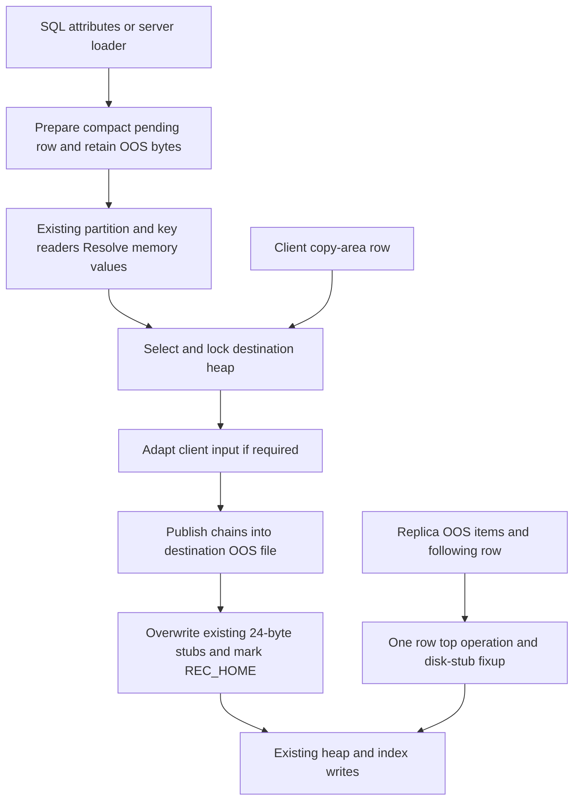

# PR #7927 code review guide — aecce0e12

Review [PR #7927](https://github.com/CUBRID/cubrid/pull/7927) at **`aecce0e1216a813771621c13112c8f27d43df22e`**, relative to exact merge base **`fb567a629cdb390fff920542173fa36f454c74a0`** on `feature/oos-merge`. This is the net PR diff: 19 files, 2,452 insertions and 138 deletions. Source links below are pinned to HEAD, not the moving branch.

The bug is physical ownership: serialization used to write OOS chains into the input/root heap before partition selection, while the row subsequently went into a child heap. SELECT can still succeed by following its stub, but vacuum looks for the OOS file in the row's owning heap. The change retains selected serialized values in memory, routes the compact row, then publishes those values into the destination heap's OOS file.

The current implementation uses `heap_pending_record` and `heap_oos_value_ref`. Older reports describing `heap_prepared_row`, a five-part column store or an explicit building/prepared/consumed/completed state machine describe earlier PR revisions. Those types and mechanisms are not in this net diff. Rationale here is reconstructed from this exact source, the current PR body and [CBRD-27089](https://jira.cubrid.org/browse/CBRD-27089), whose historical description still uses the old names.

## Read in this order

1. The ownership/reference types and their inline methods: `heap_pending_record.hpp/.cpp`, `heap_oos.hpp`.
2. Prepare and Resolve: `heap_attrinfo_prepare_record`, `heap_prepare_oos_record`, the changed serializer and attribute/key readers.
3. Destination selection and publication: `locator_insert_force`, `locator_update_force`, `locator_move_record`, `heap_oos_finalize_record`.
4. Producers that bypass ordinary SQL preparation: copy areas, redistribution, loader, replica apply.
5. Storage/transport guards, duplicate probes, and the individually mapped regression tests.

## Review contracts and limits

- The pending owner holds the record allocation and only separately serialized selected OOS values. Its destructor frees memory; rollback of written chains belongs to the enclosing transaction/system operation.
- Pending RECDES views borrow the owner. Moving an owner preserves allocations; destroying it invalidates its unfinalized memory references. A copied descriptor does not extend that lifetime.
- Finalization updates the type of the RECDES argument, not every aliased descriptor. The bulk path explicitly writes the finalized type back to its owner; other force callers consume a local borrowed descriptor while the owner stays alive.
- Prepare retains selected values without inserting their OOS chains. It can read old OOS values and can perform established LOB-copy effects; it is not a guarantee of zero I/O or zero other side effects.
- Finalize happens after routing and before accepted heap/index writes. It changes stubs in place, preserves record length/offset layout and publishes no partial set of stub replacements on batch failure. Its result does not mean the heap write or transaction committed.
- A failed finalization must be rolled back. Unlike the older prepared-row implementation, this revision has no explicit consumed phase field enforcing one-shot retry; review every caller against the stated non-retryable contract.
- `REC_OOS_PENDING` authorizes process-address decoding only for locally prepared descriptors. Heap insert/update and descriptor packing reject it; unpack/copy-area construction do not give received bytes that authorization. Review the guards as a complete caller chain, not merely the null-OID check.
- The loader's 8 MiB threshold includes retained payloads and queue capacity; one large legal input can exceed it transiently. Partitioned, replicated and error-filtered loads take the per-row path. Child-input validation also changes ordinary integer-only loader behavior.
- Replication keeps consecutive OOS items and their following heap row atomic. `LC_IS_FLUSH_INSERT` includes `LC_FLUSH_INSERT_OOS`; the continuation check therefore permits multiple OOS items. Review rejection of truncated groups and operation-depth cleanup.
- This PR changes OOS publication timing, not the 24-byte durable stub, identity-stamp mechanism, demotion policy or CDC historical lifetime. The base's raw `DB_PAGESIZE/4` gate differs from the normative four-record physical target; that inherited conformance gap is outside this diff.

## CI findings to bring into the review

The [exact-head CI analysis](../ci_analysis_report_aecce0e_codex.md) records six failed cases: three medium queries differing only in unordered row presentation, one loader case directly affected by child-domain validation, and two CDC failure categories also observed on the exact merge base. The medium result is not enough to attribute drift to the engine: CTP revisions differ between runs. The loader's rejection is intentional according to the PR description, but its legacy answer must still be reconciled with the intended partition contract. No all-green CI or whole-OOS acceptance is claimed.

## Every changed definition

Each entry answers what the symbol is, why it exists and why it is changed at this HEAD. Functions declared in more than one file have one explanation plus a declaration-location index below. C++ classes, the new union and enums are included in addition to structs. Added `= delete` declarations prohibit copying; they are not deletions of previously implemented functions. There are no deleted function/type definitions in this net diff.

### src/loaddb/load_server_loader.cpp

#### `cubload::server_class_installer::register_class_with_attributes` — modified function

[Source, line 333](https://github.com/CUBRID/cubrid/blob/aecce0e1216a813771621c13112c8f27d43df22e/src/loaddb/load_server_loader.cpp#L333)

- **What:** Registers a loader class and its attribute metadata under the loading session.
- **Why it exists:** Worker insertions need class information and the locks acquired by their session.
- **Why changed here:** Acquires BU locks on every child destination of a partitioned input before workers route rows; releases temporary partition metadata and reports lock failures through the loader's normal error handler.

#### `cubload::server_object_loader::destroy` — modified function

[Source, line 647](https://github.com/CUBRID/cubrid/blob/aecce0e1216a813771621c13112c8f27d43df22e/src/loaddb/load_server_loader.cpp#L647)

- **What:** Tears down class-specific attribute, scan-cache and queue state.
- **Why it exists:** Loader reuse/destruction must release rows and their retained values before switching context.
- **Why changed here:** Resets retained bytes when clearing the pending-owner queue, keeping memory accounting consistent with RAII cleanup.

#### `cubload::server_object_loader::finish_line` — modified function

[Source, line 724](https://github.com/CUBRID/cubrid/blob/aecce0e1216a813771621c13112c8f27d43df22e/src/loaddb/load_server_loader.cpp#L724)

- **What:** Completes conversion of one input line and queues its row when syntax-only mode and errors permit.
- **Why it exists:** Parsed DB_VALUEs are cleared after each line, but inserts can be delayed until a batch flush.
- **Why changed here:** Prepares a pending owner, catches queue allocation failures, retains payload memory before clearing input, and flushes at 8 MiB including row/vector overhead. A single larger legal row is queued and flushed immediately.

#### `cubload::server_object_loader::flush_records` — modified function

[Source, line 775](https://github.com/CUBRID/cubrid/blob/aecce0e1216a813771621c13112c8f27d43df22e/src/loaddb/load_server_loader.cpp#L775)

- **What:** Writes collected loader rows with either per-row top operations or optimized bulk insertion.
- **Why it exists:** Error filtering, replication and partition routing impose different atomicity and bookkeeping needs.
- **Why changed here:** Adds the partitioned per-row path and pruning context, uses SINGLE_ROW_INSERT for routed unique statistics, aborts failed rows, distinguishes filtered errors from session failure and resets retained accounting after a successful flush. This is the direct CI partition-test behavior change.

#### `cubload::server_object_loader::server_object_loader` — modified function

[Source, line 606](https://github.com/CUBRID/cubrid/blob/aecce0e1216a813771621c13112c8f27d43df22e/src/loaddb/load_server_loader.cpp#L606)

- **What:** Initializes the worker's loader state and queue.
- **Why it exists:** Each worker starts with no collected rows or active class-specific routing state.
- **Why changed here:** Initializes retained bytes to zero and pruning type to DB_NOT_PARTITIONED_CLASS for the newly owned queue.

#### `cubload::server_object_loader::start_attrinfo` — modified function

[Source, line 1204](https://github.com/CUBRID/cubrid/blob/aecce0e1216a813771621c13112c8f27d43df22e/src/loaddb/load_server_loader.cpp#L1204)

- **What:** Starts the class attribute cache for the current loader target.
- **Why it exists:** The loader needs current representation and partition metadata before preparing or writing rows.
- **Why changed here:** Resolves the root OID and records whether input names an ordinary table, partitioned root or direct child; that distinction selects routing or child-domain verification at flush.

### src/loaddb/load_server_loader.hpp

#### `cubload::server_object_loader` — modified class

[Source, line 74](https://github.com/CUBRID/cubrid/blob/aecce0e1216a813771621c13112c8f27d43df22e/src/loaddb/load_server_loader.hpp#L74)

- **What:** The per-worker loader maintaining converted DB_VALUEs, an insertion queue and a scan cache.
- **Why it exists:** Server loaddb parses lines separately from flushing batches into heap/index storage.
- **Why changed here:** Replaces a vector of bare record descriptors with pending owners and adds retained-byte accounting and persistent pruning type, so queued references outlive input cleanup and rows can route correctly.

### src/query/query_executor.c

#### `qexec_oid_of_duplicate_key_update` — modified function

[Source, line 12264](https://github.com/CUBRID/cubrid/blob/aecce0e1216a813771621c13112c8f27d43df22e/src/query/query_executor.c#L12264)

- **What:** Finds the conflicting row for INSERT ON DUPLICATE KEY UPDATE, including unique/composite index keys.
- **Why it exists:** The executor must choose between inserting the candidate and updating an existing row.
- **Why changed here:** Uses pending preparation with copy_lobs=true instead of a copy area; existing LOB semantics remain distinct from REPLACE while abandoned candidate OOS values stay in memory.

#### `qexec_remove_duplicates_for_replace` — modified function

[Source, line 12044](https://github.com/CUBRID/cubrid/blob/aecce0e1216a813771621c13112c8f27d43df22e/src/query/query_executor.c#L12044)

- **What:** Finds rows conflicting with a REPLACE candidate across unique indexes so they can be removed.
- **Why it exists:** REPLACE must identify its conflicts before performing the accepted row write.
- **Why changed here:** Replaces an immediately serialized copy area with a local pending owner using copy_lobs=false. Candidate keys remain readable, but conflict probing alone creates no candidate OOS chains; RAII handles memory cleanup.

### src/storage/heap_file.c

#### `heap_attrinfo_prepare_record` — added function

[Source, line 13251](https://github.com/CUBRID/cubrid/blob/aecce0e1216a813771621c13112c8f27d43df22e/src/storage/heap_file.c#L13251)

- **What:** Builds the ordinary compact row with the existing serializer while retaining selected OOS values in a heap_pending_record.
- **Why it exists:** SQL writes and duplicate probes need a routable row before any destination-specific OOS insertion.
- **Why changed here:** Adds the pending preparation entry point, resets publication state, catches allocation failures, preserves the LOB-copy choice and marks successful rows REC_OOS_PENDING, including rows with no selected OOS value.

#### `heap_attrinfo_transform_columns_to_disk` — modified function

[Source, line 13753](https://github.com/CUBRID/cubrid/blob/aecce0e1216a813771621c13112c8f27d43df22e/src/storage/heap_file.c#L13753)

- **What:** Walks all attributes and delegates fixed and variable byte serialization.
- **Why it exists:** Every column must follow the representation's ordering and offset-size contract.
- **Why changed here:** Broadens the selected-plan assertion to accept retained memory before publication; all column consumers still use the established writer.

#### `heap_attrinfo_transform_to_disk_internal` — modified function

[Source, line 13837](https://github.com/CUBRID/cubrid/blob/aecce0e1216a813771621c13112c8f27d43df22e/src/storage/heap_file.c#L13837)

- **What:** The shared serializer that fills defaults/unassigned values, plans layout, builds headers and writes columns with grow-and-retry buffer handling.
- **Why it exists:** One serializer must preserve established type, LOB, MVCC and variable-offset semantics for all producers.
- **Why changed here:** Adds an optional pending owner: selected values are retained in memory when supplied, while legacy callers still publish immediately. Existing OOS-plus-bigone rejection precedes both paths; growth retries reuse already serialized selected values.

#### `heap_attrinfo_transform_variable_to_disk` — modified function

[Source, line 13564](https://github.com/CUBRID/cubrid/blob/aecce0e1216a813771621c13112c8f27d43df22e/src/storage/heap_file.c#L13564)

- **What:** Writes one variable attribute and updates its variable-offset-table entry.
- **Why it exists:** Compact records require the same offset layout for inline values and OOS stubs.
- **Why changed here:** Adds the memory-stub branch after the existing bounds check, advances by the same OR_OOS_INLINE_SIZE and leaves the existing disk-stub writer available.

#### `heap_attrvalue_read_oos_inline` — modified function

[Source, line 11079](https://github.com/CUBRID/cubrid/blob/aecce0e1216a813771621c13112c8f27d43df22e/src/storage/heap_file.c#L11079)

- **What:** Resolves one OOS-marked attribute into a scratch or owned raw-value buffer.
- **Why it exists:** Type deserialization needs logical value bytes rather than a packed inline stub.
- **Why changed here:** Uses heap_oos_value_ref decode/read_into so partition and index callers can read pending memory values through the existing attribute API, preserving allocation and error cleanup.

#### `heap_insert_logical` — modified function

[Source, line 25125](https://github.com/CUBRID/cubrid/blob/aecce0e1216a813771621c13112c8f27d43df22e/src/storage/heap_file.c#L25125)

- **What:** The storage entry point for logical row insertion, including MVCC, logging and address reservations.
- **Why it exists:** Locator ultimately needs one engine path that stores a valid durable record.
- **Why changed here:** Rejects REC_OOS_PENDING before storage and adds a test-only one-shot heap-insert failure after an OOS-bearing row has been finalized. An address reservation is excluded from that injection.

#### `heap_midxkey_get_oos_extra_size` — modified function

[Source, line 11521](https://github.com/CUBRID/cubrid/blob/aecce0e1216a813771621c13112c8f27d43df22e/src/storage/heap_file.c#L11521)

- **What:** Computes the serialized value capacity required when an OOS-marked attribute participates in a multi-column index key.
- **Why it exists:** A composite key must reserve space for the value rather than the short stub.
- **Why changed here:** Replaces its disk-only null-OID check with the common decoder, making pending memory keys eligible while rejecting malformed references through the same validation boundary.

#### `heap_oos_test_fail_heap_insert_once` — added function

[Source, line 13248](https://github.com/CUBRID/cubrid/blob/aecce0e1216a813771621c13112c8f27d43df22e/src/storage/heap_file.c#L13248)

- **What:** A test-only function arming a failure at logical heap insertion of an OOS-bearing record.
- **Why it exists:** A successful chain publication followed by a failed row write is a different rollback boundary from failed preparation.
- **Why changed here:** Lets new tests prove that the surrounding transaction rolls back chains when the later row insertion fails.

#### `heap_oos_test_fail_preparation_once` — added function

[Source, line 13247](https://github.com/CUBRID/cubrid/blob/aecce0e1216a813771621c13112c8f27d43df22e/src/storage/heap_file.c#L13247)

- **What:** A test-only function arming an atomic one-shot preparation failure.
- **Why it exists:** Deterministic allocation-boundary tests must fail the next preparation without depending on real memory exhaustion.
- **Why changed here:** Adds a failure seam to check zero partial publication, owner cleanup and the usability of the next operation.

#### `heap_prepare_oos_record` — added function

[Source, line 13287](https://github.com/CUBRID/cubrid/blob/aecce0e1216a813771621c13112c8f27d43df22e/src/storage/heap_file.c#L13287)

- **What:** Adapts an existing serialized row into a pending owner through attribute reads and the current class representation.
- **Why it exists:** Workspace copy-area rows and redistribution start with serialized bytes rather than the SQL producer's attribute cache.
- **Why changed here:** Rebuilds without repeating LOB copies or assignment effects, preserves insert/delete IDs and previous-version LSA, and recomputes representation ID and HAS_OOS for the new compact row.

#### `heap_update_logical` — modified function

[Source, line 25557](https://github.com/CUBRID/cubrid/blob/aecce0e1216a813771621c13112c8f27d43df22e/src/storage/heap_file.c#L25557)

- **What:** The corresponding logical row-update entry point.
- **Why it exists:** Updating heap bytes must preserve MVCC and logging contracts.
- **Why changed here:** Rejects pending descriptors before storage so a missed finalization cannot persist a process address.

#### `heap_oos_column_plan` — modified struct

[Source, line 731](https://github.com/CUBRID/cubrid/blob/aecce0e1216a813771621c13112c8f27d43df22e/src/storage/heap_file.c#L731)

- **What:** The serializer's per-attribute demotion plan containing selection, length and eventual chain identity.
- **Why it exists:** Layout planning separates choosing which values move out of row from writing their representations.
- **Why changed here:** Adds memory so a selected value can be serialized to retained bytes before publication. A selected plan now requires either memory or a real head OOS OID.

### src/storage/heap_oos.cpp

#### `heap_oos_finalize_record` — added function

[Source, line 136](https://github.com/CUBRID/cubrid/blob/aecce0e1216a813771621c13112c8f27d43df22e/src/storage/heap_oos.cpp#L136)

- **What:** Publishes all selected memory payloads into the destination class's OOS file and overwrites their stubs in the existing record buffer.
- **Why it exists:** Only the selected destination heap may own the chains referenced by its row; indexes and heap storage need real disk stubs.
- **Why changed here:** Moves publication after routing. All request/result/stub arrays are prepared before insertion, stubs change only after batch success, and the descriptor becomes REC_HOME. On failure the caller must roll back; the call is not a retryable insertion contract.

#### `heap_oos_read_grouped_payloads` — modified function

[Source, line 703](https://github.com/CUBRID/cubrid/blob/aecce0e1216a813771621c13112c8f27d43df22e/src/storage/heap_oos.cpp#L703)

- **What:** Collects selected attributes' raw payload buffers for grouped attribute Resolve.
- **Why it exists:** Reading several disk-backed values together reuses the existing batched storage read path.
- **Why changed here:** Copies pending memory values directly and queues only disk references for oos_read_many; a memory-only group does not perform a disk batch read.

#### `heap_oos_value_ref::decode` — added function

[Source, line 66](https://github.com/CUBRID/cubrid/blob/aecce0e1216a813771621c13112c8f27d43df22e/src/storage/heap_oos.cpp#L66)

- **What:** Bounds-checks the stub, validates length, then decodes either a permitted pending pointer or an identity-checked disk reference.
- **Why it exists:** Reading a corrupt stub or treating remote bytes as an address can invalidate the entire record-read path.
- **Why changed here:** Accepts null head OIDs only when the descriptor is locally marked REC_OOS_PENDING and its address is nonzero; existing disk validation still uses heap_oos_parse_inline_ref.

#### `heap_oos_value_ref::encode_memory` — added function

[Source, line 55](https://github.com/CUBRID/cubrid/blob/aecce0e1216a813771621c13112c8f27d43df22e/src/storage/heap_oos.cpp#L55)

- **What:** Writes a null head OOS OID, payload length and packed process address into a temporary 24-byte stub.
- **Why it exists:** The ordinary variable-offset table and attribute readers must locate a selected value before an OOS OID exists.
- **Why changed here:** Introduces a local-only encoding identified by REC_OOS_PENDING. The uintptr_t static assertion checks that an address fits the packed field; this encoding must never be stored or transmitted.

#### `heap_oos_value_ref::read_into` — added function

[Source, line 117](https://github.com/CUBRID/cubrid/blob/aecce0e1216a813771621c13112c8f27d43df22e/src/storage/heap_oos.cpp#L117)

- **What:** Copies the memory alternative with memcpy or invokes oos_read for the disk alternative after checking destination length and address.
- **Why it exists:** Callers need caller-owned bytes regardless of where the value currently resides.
- **Why changed here:** Keeps pending payload borrowing inside the reference wrapper; logical consumers receive their own buffers rather than a pointer whose owner may disappear.

### src/storage/heap_oos.hpp

#### `heap_oos_value_ref` — added class

[Source, line 36](https://github.com/CUBRID/cubrid/blob/aecce0e1216a813771621c13112c8f27d43df22e/src/storage/heap_oos.hpp#L36)

- **What:** A decoded, non-owning tagged reference with memory and disk alternatives and a common length/read_into interface.
- **Why it exists:** Partition-key evaluation, ordinary attribute reads and composite-index reads need logical values before disk publication as well as after it.
- **Why changed here:** Extends the existing per-attribute Resolve boundary to server-created pending rows while keeping fetched and received rows disk-only.

#### `heap_oos_value_ref::kind` — added enum

[Source, line 49](https://github.com/CUBRID/cubrid/blob/aecce0e1216a813771621c13112c8f27d43df22e/src/storage/heap_oos.hpp#L49)

- **What:** The private enum distinguishing memory from disk references.
- **Why it exists:** The same 24-byte stub fields have different meanings before and after finalization.
- **Why changed here:** Makes the decoder choose an explicit alternative so a pending address is never passed to oos_read as an OOS chain.

#### `heap_oos_value_ref::heap_oos_value_ref` — added function

[Source, line 39](https://github.com/CUBRID/cubrid/blob/aecce0e1216a813771621c13112c8f27d43df22e/src/storage/heap_oos.hpp#L39)

- **What:** Initializes disk kind, zero length and the union.
- **Why it exists:** Attribute readers construct a destination wrapper before decoding a stub.
- **Why changed here:** Provides an inert starting state for the new common reference API.

#### `heap_oos_value_ref::length` — added function

[Source, line 42](https://github.com/CUBRID/cubrid/blob/aecce0e1216a813771621c13112c8f27d43df22e/src/storage/heap_oos.hpp#L42)

- **What:** Returns the validated serialized byte length stored by decode.
- **Why it exists:** Readers allocate exactly the destination capacity required by either alternative.
- **Why changed here:** Lets memory and disk consumers share size logic and allows index-key sizing without reading a disk chain.

#### `heap_oos_value_ref::value::value` — added function

[Source, line 56](https://github.com/CUBRID/cubrid/blob/aecce0e1216a813771621c13112c8f27d43df22e/src/storage/heap_oos.hpp#L56)

- **What:** The union constructor value-initializes its disk member.
- **Why it exists:** A default-constructed wrapper needs deterministic storage before decode succeeds.
- **Why changed here:** Gives the new union a valid initial alternative. Callers must still check decode's result before reading.

#### `heap_oos_value_ref::value` — added union

[Source, line 52](https://github.com/CUBRID/cubrid/blob/aecce0e1216a813771621c13112c8f27d43df22e/src/storage/heap_oos.hpp#L52)

- **What:** A private union containing either a borrowed const char pointer or an oos_chain_ref.
- **Why it exists:** A decoded reference carries one alternative at a time and owns neither allocation nor page.
- **Why changed here:** Stores pending memory references alongside existing chain identity without changing the durable stub layout.

### src/storage/heap_pending_record.cpp

#### `heap_pending_record::heap_pending_record(default)` — added function

[Source, line 35](https://github.com/CUBRID/cubrid/blob/aecce0e1216a813771621c13112c8f27d43df22e/src/storage/heap_pending_record.cpp#L35)

- **What:** The default constructor creates a STANDARD_BLOCK_ALLOCATOR record descriptor and explicitly sets an empty external buffer.
- **Why it exists:** Preparation requires an initially empty record, and the pending owner must own any buffer the serializer subsequently allocates.
- **Why changed here:** Establishes the empty-data precondition used by heap_attrinfo_prepare_record. Setting the empty external buffer makes get_recdes legal before serialization; a default record_descriptor otherwise has INVALID data-source state.

#### `heap_pending_record::heap_pending_record(move)` — added function

[Source, line 41](https://github.com/CUBRID/cubrid/blob/aecce0e1216a813771621c13112c8f27d43df22e/src/storage/heap_pending_record.cpp#L41)

- **What:** A noexcept move constructor transfers the record allocation and swaps the payload vector, then zeros the source byte count.
- **Why it exists:** Loader vector growth and explicit owner handoff must preserve the addresses encoded into pending stubs.
- **Why changed here:** Enables queueing a prepared row without copying payloads or freeing memory still referenced by the moved record.

#### `heap_pending_record::retain` — added function

[Source, line 58](https://github.com/CUBRID/cubrid/blob/aecce0e1216a813771621c13112c8f27d43df22e/src/storage/heap_pending_record.cpp#L58)

- **What:** Transfers an oos_buffer allocation into the owner's vector and increments the payload byte count only after insertion succeeds.
- **Why it exists:** Newly serialized selected values must survive destruction of their DB_VALUE sources.
- **Why changed here:** Adds explicit ownership transfer with bad_alloc translated to ER_OUT_OF_VIRTUAL_MEMORY. On failure the caller still owns and frees the rejected payload.

#### `heap_pending_record::~heap_pending_record` — added function

[Source, line 49](https://github.com/CUBRID/cubrid/blob/aecce0e1216a813771621c13112c8f27d43df22e/src/storage/heap_pending_record.cpp#L49)

- **What:** The destructor frees each retained payload allocation; record_descriptor separately releases its record buffer.
- **Why it exists:** One abandoned candidate or failed preparation must release all owned memory exactly once.
- **Why changed here:** Replaces manual copy-area cleanup for pending rows. It does not delete persisted OOS chains or roll back transactions; those remain the caller's responsibility.

### src/storage/heap_pending_record.hpp

#### `heap_pending_record` — added class

[Source, line 32](https://github.com/CUBRID/cubrid/blob/aecce0e1216a813771621c13112c8f27d43df22e/src/storage/heap_pending_record.hpp#L32)

- **What:** A move-only owner of one compact record_descriptor and the separately allocated serialized OOS values referenced by that record.
- **Why it exists:** The producer's DB_VALUEs and attribute cache can be cleared before routing or a loader flush; the row and all its borrowed memory references need one lifetime.
- **Why changed here:** Adds a small ownership module around the existing serializer instead of publishing chains during serialization. Only selected OOS payloads need separate retention; inline values already live in the compact record.

#### `heap_pending_record::get_recdes` — added function

[Source, line 45](https://github.com/CUBRID/cubrid/blob/aecce0e1216a813771621c13112c8f27d43df22e/src/storage/heap_pending_record.hpp#L45)

- **What:** A const accessor returning a borrowed RECDES view of the owned record.
- **Why it exists:** Partition, index and locator APIs already consume RECDES; changing those interfaces would spread the redesign.
- **Why changed here:** Lets existing consumers read the compact pending row while its owner remains alive. A copied RECDES is not an ownership transfer.

#### `heap_pending_record::heap_pending_record(copy deleted)` — added function

[Source, line 38](https://github.com/CUBRID/cubrid/blob/aecce0e1216a813771621c13112c8f27d43df22e/src/storage/heap_pending_record.hpp#L38)

- **What:** An explicitly deleted copy constructor.
- **Why it exists:** Copying this owner's raw buffer references would create two owners of the same allocations.
- **Why changed here:** Makes accidental copies fail at compile time; loader and other handoffs must use moves.

#### `heap_pending_record::operator=` — added function

[Source, line 39](https://github.com/CUBRID/cubrid/blob/aecce0e1216a813771621c13112c8f27d43df22e/src/storage/heap_pending_record.hpp#L39)

- **What:** An explicitly deleted copy assignment operator.
- **Why it exists:** Assignment must not duplicate ownership or invalidate pointers borrowed from an existing row.
- **Why changed here:** Completes the non-copyable contract. The class provides move construction, not an unrestricted assignment API.

#### `heap_pending_record::record` — added function

[Source, line 41](https://github.com/CUBRID/cubrid/blob/aecce0e1216a813771621c13112c8f27d43df22e/src/storage/heap_pending_record.hpp#L41)

- **What:** A mutable accessor returning the owned record_descriptor.
- **Why it exists:** Preparation needs a serializer destination, and bulk finalization must update the owner's descriptor type.
- **Why changed here:** Provides a narrow bridge to existing buffer and serializer operations without exposing the payload vector.

#### `heap_pending_record::retained_bytes` — added function

[Source, line 49](https://github.com/CUBRID/cubrid/blob/aecce0e1216a813771621c13112c8f27d43df22e/src/storage/heap_pending_record.hpp#L49)

- **What:** Computes record buffer capacity, retained payload lengths and payload-vector capacity overhead.
- **Why it exists:** A tiny compact record can reference many megabytes of retained values, so compact length alone understates queue memory.
- **Why changed here:** Supplies the loader's 8 MiB flush accounting. This is retained allocation accounting, not a process RSS measurement or a hard cap on a single row.

#### `_HEAP_PENDING_RECORD_HPP_` — added macro

[Source, line 22](https://github.com/CUBRID/cubrid/blob/aecce0e1216a813771621c13112c8f27d43df22e/src/storage/heap_pending_record.hpp#L22)

- **What:** The include guard for the new pending-owner header.
- **Why it exists:** The class definition must appear once per translation unit.
- **Why changed here:** Adds conventional protection for the new ownership module; this macro has no runtime behavior.

### src/storage/record_descriptor.cpp

#### `record_descriptor::pack` — modified function

[Source, line 326](https://github.com/CUBRID/cubrid/blob/aecce0e1216a813771621c13112c8f27d43df22e/src/storage/record_descriptor.cpp#L326)

- **What:** Serializes a descriptor type and record bytes into a transport buffer.
- **Why it exists:** Ordinary descriptors are sent through existing packing interfaces.
- **Why changed here:** Returns with ER_GENERIC_ERROR before writing any bytes if the descriptor is REC_OOS_PENDING, preventing both the temporary type and process addresses from leaving the server.

#### `record_descriptor::unpack` — modified function

[Source, line 338](https://github.com/CUBRID/cubrid/blob/aecce0e1216a813771621c13112c8f27d43df22e/src/storage/record_descriptor.cpp#L338)

- **What:** Reconstructs a descriptor and copied buffer from transport data.
- **Why it exists:** Received records must remain ordinary serialized input, even when the sender supplies an unexpected type.
- **Why changed here:** Maps an incoming pending type to REC_UNKNOWN; receipt alone cannot authorize the memory branch of heap_oos_value_ref::decode. It does not validate every other possible incoming type.

### src/storage/storage_common.h

#### `REC_OOS_PENDING` — added macro

[Source, line 221](https://github.com/CUBRID/cubrid/blob/aecce0e1216a813771621c13112c8f27d43df22e/src/storage/storage_common.h#L221)

- **What:** A descriptor-only marker with value 0x100, outside the ordinary persisted record-type domain.
- **Why it exists:** Null-OID temporary stubs must be authorized only for locally constructed rows.
- **Why changed here:** Introduces the marker shared by preparation, Resolve, finalization and storage/transport guards; it is not a new slotted-page or network record type.

### src/transaction/locator.h

#### `LC_RECDES_IN_COPYAREA` — modified macro

[Source, line 77](https://github.com/CUBRID/cubrid/blob/aecce0e1216a813771621c13112c8f27d43df22e/src/transaction/locator.h#L77)

- **What:** A macro initializing a RECDES view at the start of a copy area's data region.
- **Why it exists:** Existing copy-area construction/decoding needs a complete descriptor.
- **Why changed here:** Initializes REC_HOME for the same local-versus-received type distinction.

#### `LC_RECDES_TO_GET_ONEOBJ` — modified macro

[Source, line 55](https://github.com/CUBRID/cubrid/blob/aecce0e1216a813771621c13112c8f27d43df22e/src/transaction/locator.h#L55)

- **What:** A macro constructing an ordinary RECDES view over one received copy-area object.
- **Why it exists:** Client flush decoding must populate descriptor metadata before locator processing.
- **Why changed here:** Explicitly sets REC_HOME so uninitialized/reused descriptor state cannot authorize pending-memory decoding.

#### `LC_REPL_RECDES_FOR_ONEOBJ` — modified macro

[Source, line 68](https://github.com/CUBRID/cubrid/blob/aecce0e1216a813771621c13112c8f27d43df22e/src/transaction/locator.h#L68)

- **What:** A macro constructing a replicated row's descriptor after its packed key bytes.
- **Why it exists:** Replication copy-area data needs the established key/record offset adjustment.
- **Why changed here:** Sets REC_HOME explicitly for received disk-format replication records; no process-address alternative is admitted.

### src/transaction/locator_sr.c

#### `locator_add_or_remove_index_internal` — modified function

[Source, line 7991](https://github.com/CUBRID/cubrid/blob/aecce0e1216a813771621c13112c8f27d43df22e/src/transaction/locator_sr.c#L7991)

- **What:** Maintains indexes and the primary-key replication information associated with a row operation.
- **Why it exists:** Index changes and replication must agree on the row's stored values and operation ordering.
- **Why changed here:** Emits the accumulated OOS replication items only on the insert side, preventing stale insert publication state from being consumed by an index-removal pass.

#### `locator_attribute_info_force` — modified function

[Source, line 7692](https://github.com/CUBRID/cubrid/blob/aecce0e1216a813771621c13112c8f27d43df22e/src/transaction/locator_sr.c#L7692)

- **What:** The server-side attribute-cache dispatcher for INSERT/UPDATE/DELETE and related operations.
- **Why it exists:** SQL execution supplies changed DB_VALUEs and an old row rather than a client copy area.
- **Why changed here:** Owns a heap_pending_record for insert/update preparation, passes the borrowed row to existing routing/force APIs and clears publication state on errors; deleted operations retain their established path.

#### `locator_force_for_multi_update` — modified function

[Source, line 6696](https://github.com/CUBRID/cubrid/blob/aecce0e1216a813771621c13112c8f27d43df22e/src/transaction/locator_sr.c#L6696)

- **What:** Applies a batch of serialized updates from an LC_COPYAREA.
- **Why it exists:** The multi-update protocol shares update logic while supplying record bytes directly.
- **Why changed here:** Marks those rows from_copyarea=true and resets OOS publication state on failure, ensuring this producer gets adaptation instead of bypassing deferred ownership.

#### `locator_insert_force` — modified function

[Source, line 4976](https://github.com/CUBRID/cubrid/blob/aecce0e1216a813771621c13112c8f27d43df22e/src/transaction/locator_sr.c#L4976)

- **What:** Routes, locks and inserts one row and its indexes into the chosen heap.
- **Why it exists:** This is the shared write boundary for SQL, client copy areas, loader and movement.
- **Why changed here:** Adds from_copyarea adaptation after partition selection, finalizes against real_class_oid before heap/index writes, and lets loader workers use the session's already held destination BU locks.

#### `locator_move_record` — modified function

[Source, line 5407](https://github.com/CUBRID/cubrid/blob/aecce0e1216a813771621c13112c8f27d43df22e/src/transaction/locator_sr.c#L5407)

- **What:** Inserts the post-image into a new heap and removes the old row as one movement operation.
- **Why it exists:** A partition-key update cannot keep the row in its former heap.
- **Why changed here:** Propagates from_copyarea through both destination-insert paths so a workspace move gets destination preparation, while an already pending SQL row keeps its original owner until consumption finishes.

#### `locator_multi_insert_force` — modified function

[Source, line 14152](https://github.com/CUBRID/cubrid/blob/aecce0e1216a813771621c13112c8f27d43df22e/src/transaction/locator_sr.c#L14152)

- **What:** The loader's optimized nonpartitioned, non-HA multirow insertion path.
- **Why it exists:** Bulk page logging reduces overhead when row-by-row routing or replication is unnecessary.
- **Why changed here:** Changes its input to movable pending owners, releases any cached heap-page latch, finalizes every row before bulk data-page latching, and updates each owner's descriptor type. Partition/HA/filtered-error loads use the row path instead.

#### `locator_prepare_copyarea_record` — added function

[Source, line 4932](https://github.com/CUBRID/cubrid/blob/aecce0e1216a813771621c13112c8f27d43df22e/src/transaction/locator_sr.c#L4932)

- **What:** A local adapter replacing a received RECDES view with an owner-backed pending view when adaptation succeeds.
- **Why it exists:** Raw workspace/client writes arrive through copy areas and do not pass the SQL attribute-producer path.
- **Why changed here:** Converts only after routing; skips catalog-disabled bootstrap, root/system classes and empty/address-only input. It avoids repeating workspace LOB copies and preserves the incoming header via heap_prepare_oos_record.

#### `locator_update_force` — modified function

[Source, line 5508](https://github.com/CUBRID/cubrid/blob/aecce0e1216a813771621c13112c8f27d43df22e/src/transaction/locator_sr.c#L5508)

- **What:** Applies an update, handles MVCC/index/foreign-key work and selects partition movement when needed.
- **Why it exists:** Existing rows require old-image handling and possibly a new destination heap.
- **Why changed here:** Carries from_copyarea to movement; for nonmoving user rows, adapts received input and finalizes before index updates. Pending SQL rows use the same finalizer without a second adaptation.

#### `redistribute_partition_data` — modified function

[Source, line 13012](https://github.com/CUBRID/cubrid/blob/aecce0e1216a813771621c13112c8f27d43df22e/src/transaction/locator_sr.c#L13012)

- **What:** Moves existing rows when partition definitions are reorganized.
- **Why it exists:** DDL redistribution must preserve each row's logical values and MVCC metadata while changing its owning heap.
- **Why changed here:** Fetches the source child's compact record without eager whole-record Expand, adapts its values into a pending owner and inserts through destination routing. This rebuilds destination-owned chains instead of transplanting source stubs.

#### `xlocator_force` — modified function

[Source, line 7346](https://github.com/CUBRID/cubrid/blob/aecce0e1216a813771621c13112c8f27d43df22e/src/transaction/locator_sr.c#L7346)

- **What:** Applies workspace copy-area inserts, updates and deletes on the server.
- **Why it exists:** Client flushes must retain the existing protocol and input-image contract.
- **Why changed here:** Flags received insert/update rows for adaptation, saves/restores their original representation ID after pruning, and clears publication state on eligible failures. It preserves caller copy-area bytes instead of converting them in place.

#### `xlocator_repl_force` — modified function

[Source, line 7086](https://github.com/CUBRID/cubrid/blob/aecce0e1216a813771621c13112c8f27d43df22e/src/transaction/locator_sr.c#L7086)

- **What:** Applies replication copy-area items, including OOS payload items and their following heap row.
- **Why it exists:** Replica-local OOS OIDs differ from source OIDs and are fixed up before row storage.
- **Why changed here:** Keeps the OOS items and owning row within one row top operation, rejects truncated/interrupted groups, aborts outstanding work on errors, and keeps replicated disk-stub rows out of the workspace adaptation path.

### unit_tests/oos/sql/test_oos_sql_show.cpp

#### `OosSqlShow` — modified class

[Source, line 228](https://github.com/CUBRID/cubrid/blob/aecce0e1216a813771621c13112c8f27d43df22e/unit_tests/oos/sql/test_oos_sql_show.cpp#L228)

- **What:** The GoogleTest fixture for SHOW HEAP OOS and now destination-ownership integration assertions.
- **Why it exists:** SQL-visible statistics provide physical ownership evidence beyond logical SELECT equality.
- **Why changed here:** Extends the existing fixture for the new deferred-write matrix and changes cleanup ordering so dependent tables can be dropped safely.

#### `write_failure` — added enum

[Source, line 51](https://github.com/CUBRID/cubrid/blob/aecce0e1216a813771621c13112c8f27d43df22e/unit_tests/oos/sql/test_oos_sql_show.cpp#L51)

- **What:** A test-only enum naming preparation, VFID lookup, partial batch and heap insertion failures.
- **Why it exists:** Rollback must be checked at several distinct publication boundaries.
- **Why changed here:** Adds a compact way to drive the new failure matrix without duplicating seam-selection logic.

#### `OosSqlShow.AbandonedDuplicateCandidateDoesNotWriteOos` — added function

[Source, line 1267](https://github.com/CUBRID/cubrid/blob/aecce0e1216a813771621c13112c8f27d43df22e/unit_tests/oos/sql/test_oos_sql_show.cpp#L1267)

- **What:** Runs a duplicate candidate whose alternative update does not require retaining its large candidate payload.
- **Why it exists:** Speculative candidate ownership must end without a disk chain if the candidate is abandoned.
- **Why changed here:** Adds direct evidence that only the selected update's values are persisted.

#### `OosSqlShow.AllocationAndStorageFailureLeaveNextInsertUsable` — added function

[Source, line 1093](https://github.com/CUBRID/cubrid/blob/aecce0e1216a813771621c13112c8f27d43df22e/unit_tests/oos/sql/test_oos_sql_show.cpp#L1093)

- **What:** Injects failures at preparation, VFID lookup, partial insertion and later heap insertion.
- **Why it exists:** Every stage has different memory/publication/transaction cleanup obligations.
- **Why changed here:** Adds zero-row/zero-chain rollback assertions and a valid next INSERT for all four boundaries.

#### `OosSqlShow.ConstraintFailureAfterOosAllowsNextInsert` — added function

[Source, line 1125](https://github.com/CUBRID/cubrid/blob/aecce0e1216a813771621c13112c8f27d43df22e/unit_tests/oos/sql/test_oos_sql_show.cpp#L1125)

- **What:** Forces a duplicate primary-key error after preparing an OOS-bearing candidate.
- **Why it exists:** A failed accepted write must not poison the next operation's publication state.
- **Why changed here:** Protects transaction cleanup after finalization and constraint checking.

#### `OosSqlShow.DuplicateProbeFailuresLeaveNextWriteUsable` — added function

[Source, line 1293](https://github.com/CUBRID/cubrid/blob/aecce0e1216a813771621c13112c8f27d43df22e/unit_tests/oos/sql/test_oos_sql_show.cpp#L1293)

- **What:** Injects preparation and subsequent storage failures around duplicate-key operations.
- **Why it exists:** Probe rejection and accepted-write rejection must both leave a clean next operation.
- **Why changed here:** Covers failure cleanup for both executor duplicate functions and their downstream force paths.

#### `OosSqlShow.DuplicateProbesDoNotPersistCandidateValues` — added function

[Source, line 1140](https://github.com/CUBRID/cubrid/blob/aecce0e1216a813771621c13112c8f27d43df22e/unit_tests/oos/sql/test_oos_sql_show.cpp#L1140)

- **What:** Exercises REPLACE and ON DUPLICATE KEY UPDATE with root/child statistics and insertion counters.
- **Why it exists:** A speculative duplicate-key search must read candidate keys without writing speculative chains.
- **Why changed here:** Distinguishes real final-write requests from probe work and checks no root-owned OOS file is created.

#### `OosSqlShow.DuplicateProbesPreserveFunctionIndexesAndCompressedCompositeKeys` — added function

[Source, line 1223](https://github.com/CUBRID/cubrid/blob/aecce0e1216a813771621c13112c8f27d43df22e/unit_tests/oos/sql/test_oos_sql_show.cpp#L1223)

- **What:** Combines compressed character values, composite uniqueness and scalar/composite function indexes.
- **Why it exists:** Key generation has type/compression/function-index paths beyond simple attribute lookup.
- **Why changed here:** Protects those existing semantics while query-executor probes switch to pending rows.

#### `OosSqlShow.DuplicateProbesPreserveLobValuesAndRollback` — added function

[Source, line 1350](https://github.com/CUBRID/cubrid/blob/aecce0e1216a813771621c13112c8f27d43df22e/unit_tests/oos/sql/test_oos_sql_show.cpp#L1350)

- **What:** Runs duplicate operations with LOB values and verifies rollback/readback.
- **Why it exists:** REPLACE and duplicate UPDATE intentionally have different LOB-copy choices.
- **Why changed here:** Guards preservation of external LOB semantics and committed values after the pending-owner change.

#### `OosSqlShow.DuplicateProbesPreserveMultipleUniqueConstraintsAndForeignKeys` — added function

[Source, line 1409](https://github.com/CUBRID/cubrid/blob/aecce0e1216a813771621c13112c8f27d43df22e/unit_tests/oos/sql/test_oos_sql_show.cpp#L1409)

- **What:** Combines several unique constraints with foreign-key checking.
- **Why it exists:** Duplicate detection must continue across indexes and respect referential integrity.
- **Why changed here:** Protects cross-index and FK semantics while speculative row construction stops creating OOS chains.

#### `OosSqlShow.DuplicateProbesReadCompositeKeys` — added function

[Source, line 1193](https://github.com/CUBRID/cubrid/blob/aecce0e1216a813771621c13112c8f27d43df22e/unit_tests/oos/sql/test_oos_sql_show.cpp#L1193)

- **What:** Uses a forced-outline component in a multi-column unique key.
- **Why it exists:** Composite key sizing/deserialization must read complete values rather than temporary stubs.
- **Why changed here:** Guards heap_midxkey_get_oos_extra_size and the common reference decoder in duplicate paths.

#### `OosSqlShow.ForcedOutlineKeyRoutesFromPreparedBytes` — added function

[Source, line 911](https://github.com/CUBRID/cubrid/blob/aecce0e1216a813771621c13112c8f27d43df22e/unit_tests/oos/sql/test_oos_sql_show.cpp#L911)

- **What:** Uses a FORCE_OUTLINE partition key that must be evaluated before its chain exists.
- **Why it exists:** Record-size gating is insufficient: forced-outline values can be selected even for a small row.
- **Why changed here:** Verifies that existing partition readers Resolve the memory alternative and pick the correct child.

#### `OosSqlShow.InsertOwnsOosInDestinationHeap` — added function

[Source, line 423](https://github.com/CUBRID/cubrid/blob/aecce0e1216a813771621c13112c8f27d43df22e/unit_tests/oos/sql/test_oos_sql_show.cpp#L423)

- **What:** Inserts a large value through a range-partitioned root and inspects root/child OOS statistics.
- **Why it exists:** SELECT alone cannot detect chains written into the wrong heap.
- **Why changed here:** Adds the ticket's fundamental destination-ownership regression.

#### `OosSqlShow.InternalAndAddressReservationsBypassPreparation` — added function

[Source, line 880](https://github.com/CUBRID/cubrid/blob/aecce0e1216a813771621c13112c8f27d43df22e/unit_tests/oos/sql/test_oos_sql_show.cpp#L880)

- **What:** Exercises serial/system work and workspace address reservations.
- **Why it exists:** Bootstrap/system records and OID allocation do not satisfy ordinary user-row preparation assumptions.
- **Why changed here:** Protects the explicit copy-area bypass cases from the new adapter.

#### `OosSqlShow.LoaderQueueRetainsClearedInputsAndRollsBackBulkFailure` — added function

[Source, line 1022](https://github.com/CUBRID/cubrid/blob/aecce0e1216a813771621c13112c8f27d43df22e/unit_tests/oos/sql/test_oos_sql_show.cpp#L1022)

- **What:** Queues 64 pending multichunk rows, clears DB_VALUE input and tests bulk failure followed by success.
- **Why it exists:** The loader deliberately delays consumption and moves owners during vector growth.
- **Why changed here:** Checks retained lifetime/accounting and rollback in locator_multi_insert_force; this is a native integration test of the queue contract, not the parser/worker process itself.

#### `OosSqlShow.LobPreparationPreservesSourceAndDestinationValues` — added function

[Source, line 959](https://github.com/CUBRID/cubrid/blob/aecce0e1216a813771621c13112c8f27d43df22e/unit_tests/oos/sql/test_oos_sql_show.cpp#L959)

- **What:** Prepares/uses LOB-containing rows and checks source and destination logical values.
- **Why it exists:** Retaining serialized ELO locators must preserve established external-LOB copying semantics.
- **Why changed here:** Guards the serializer's LOB-copy option while OOS write timing changes.

#### `OosSqlShow.NonpartitionedUpdateChecksForeignKeysAfterFinalization` — added function

[Source, line 1690](https://github.com/CUBRID/cubrid/blob/aecce0e1216a813771621c13112c8f27d43df22e/unit_tests/oos/sql/test_oos_sql_show.cpp#L1690)

- **What:** Rejects an invalid FK while expanding a nonpartitioned row to OOS, then applies a valid FK update.
- **Why it exists:** Ordinary tables share finalization and must not lose existing FK enforcement.
- **Why changed here:** Guards the nonpartitioned update path and preservation of old values after FK rejection.

#### `OosSqlShow.PendingReferencesResolveAndFinalizeInPlace` — added function

[Source, line 684](https://github.com/CUBRID/cubrid/blob/aecce0e1216a813771621c13112c8f27d43df22e/unit_tests/oos/sql/test_oos_sql_show.cpp#L684)

- **What:** Reads two retained values before finalization, rejects transport and untrusted memory decoding, then compares memory and disk payloads.
- **Why it exists:** The central representation boundary must preserve values, lifetimes and all non-stub bytes.
- **Why changed here:** Proves source cleanup survival, grouped Resolve, unchanged buffer/length and stub-only finalization; the finalized copied image survives owner destruction.

#### `OosSqlShow.RawClientInsertOwnsDestinationOos` — added function

[Source, line 452](https://github.com/CUBRID/cubrid/blob/aecce0e1216a813771621c13112c8f27d43df22e/unit_tests/oos/sql/test_oos_sql_show.cpp#L452)

- **What:** Exercises a raw client/workspace row insert and checks destination ownership.
- **Why it exists:** Client flushes bypass SQL's attribute-cache producer.
- **Why changed here:** Verifies that the new copy-area adaptation reaches the selected child.

#### `OosSqlShow.RawClientUpdatePreservesUnassignedValuesAndRollsBackFailure` — added function

[Source, line 644](https://github.com/CUBRID/cubrid/blob/aecce0e1216a813771621c13112c8f27d43df22e/unit_tests/oos/sql/test_oos_sql_show.cpp#L644)

- **What:** Updates selected client attributes while leaving others unassigned, then tests failure rollback.
- **Why it exists:** Adapting received rows must preserve the complete logical post-image and old committed row.
- **Why changed here:** Covers update adaptation and the error path beyond the SQL producer.

#### `OosSqlShow.RawCopyAreaRoutesInsertAndMovementWithoutChangingPayload` — added function

[Source, line 547](https://github.com/CUBRID/cubrid/blob/aecce0e1216a813771621c13112c8f27d43df22e/unit_tests/oos/sql/test_oos_sql_show.cpp#L547)

- **What:** Applies raw copy-area inserts and moving updates and compares the source image.
- **Why it exists:** Pruning can rewrite representation metadata while the client still owns its input buffer.
- **Why changed here:** Checks destination chains together with restoration/preservation of copy-area bytes.

#### `OosSqlShow.RedistributionFailurePreservesSourceAndNextOperation` — added function

[Source, line 837](https://github.com/CUBRID/cubrid/blob/aecce0e1216a813771621c13112c8f27d43df22e/unit_tests/oos/sql/test_oos_sql_show.cpp#L837)

- **What:** Injects preparation, VFID and partial-batch failures during partition reorganization.
- **Why it exists:** DDL movement must not lose original rows or poison a later operation after publication fails.
- **Why changed here:** Checks original multichunk values after rollback and a subsequent successful reorganization.

#### `OosSqlShow.RedistributionRewritesMultichunkValuesAtDestination` — added function

[Source, line 517](https://github.com/CUBRID/cubrid/blob/aecce0e1216a813771621c13112c8f27d43df22e/unit_tests/oos/sql/test_oos_sql_show.cpp#L517)

- **What:** Reorganizes partitions containing multichunk OOS values and checks values and physical ownership.
- **Why it exists:** Copying a source stub unchanged would leave chains owned by the former heap.
- **Why changed here:** Guards the new compact-source adaptation and destination publication in DDL redistribution.

#### `OosSqlShow.RejectedDestinationCreatesNoOosAndNextInsertSucceeds` — added function

[Source, line 935](https://github.com/CUBRID/cubrid/blob/aecce0e1216a813771621c13112c8f27d43df22e/unit_tests/oos/sql/test_oos_sql_show.cpp#L935)

- **What:** Inserts a row outside the declared partition domain and follows it with a valid row.
- **Why it exists:** Routing rejection must occur before destination-specific storage effects and must not corrupt publication state.
- **Why changed here:** Covers no-chain creation on an invalid route and recovery of the next insertion.

#### `OosSqlShow.ReplaceProbeReadsOutlinedCandidateAgainstInlineExistingKey` — added function

[Source, line 1387](https://github.com/CUBRID/cubrid/blob/aecce0e1216a813771621c13112c8f27d43df22e/unit_tests/oos/sql/test_oos_sql_show.cpp#L1387)

- **What:** Matches an outlined candidate key against an inline existing key and checks insertion counts.
- **Why it exists:** Equality must compare logical values despite different storage representations.
- **Why changed here:** Verifies the REPLACE probe's memory Resolve and that it does not publish candidate chains merely to compare keys.

#### `OosSqlShow.RollbackPreservesMultiChunkValuesAndLiveOwnership` — added function

[Source, line 1713](https://github.com/CUBRID/cubrid/blob/aecce0e1216a813771621c13112c8f27d43df22e/unit_tests/oos/sql/test_oos_sql_show.cpp#L1713)

- **What:** Inserts and updates multichunk values, aborts, and checks committed values and current ownership.
- **Why it exists:** Deferred publication must coexist with MVCC undo holding existing disk stubs.
- **Why changed here:** Adds scoped rollback/readback protection; it does not prove long-running vacuum or CDC history correctness.

#### `OosSqlShow.SerializedPreparationPreservesMvccAndOutlivesSource` — added function

[Source, line 778](https://github.com/CUBRID/cubrid/blob/aecce0e1216a813771621c13112c8f27d43df22e/unit_tests/oos/sql/test_oos_sql_show.cpp#L778)

- **What:** Adapts an already serialized record with explicit insert/delete IDs and previous-version LSA, then moves its owner.
- **Why it exists:** Raw adaptation is not a new assignment and must not discard MVCC history or borrow dead input.
- **Why changed here:** Verifies header preservation, default/forced-outline key values and long payload readback after the original owner is gone.

#### `OosSqlShow.SupportedPartitionDomainsPreserveValuesAndOwnership` — added function

[Source, line 991](https://github.com/CUBRID/cubrid/blob/aecce0e1216a813771621c13112c8f27d43df22e/unit_tests/oos/sql/test_oos_sql_show.cpp#L991)

- **What:** Iterates the domain_case matrix for accepted partition-key types.
- **Why it exists:** Canonical bytes must feed the existing type-aware partition evaluator for every supported key domain.
- **Why changed here:** Adds value and physical-ownership coverage across integer, temporal and character keys.

#### `OosSqlShow.UpdateDomainsPreserveUnassignedValuesThroughMovementAndRollback` — added function

[Source, line 1483](https://github.com/CUBRID/cubrid/blob/aecce0e1216a813771621c13112c8f27d43df22e/unit_tests/oos/sql/test_oos_sql_show.cpp#L1483)

- **What:** Iterates partition-key domains while moving rows with unassigned payloads, including rollback.
- **Why it exists:** Retained values must include unassigned UPDATE attributes and survive type-aware key evaluation.
- **Why changed here:** Covers common serializer/default/old-image behavior across moving and aborted updates.

#### `OosSqlShow.UpdateFailureClearsPublicationAndRollsBackBothDestinations` — added function

[Source, line 1595](https://github.com/CUBRID/cubrid/blob/aecce0e1216a813771621c13112c8f27d43df22e/unit_tests/oos/sql/test_oos_sql_show.cpp#L1595)

- **What:** Injects preparation/VFID/partial-batch failures for moving and nonmoving updates.
- **Why it exists:** Either target heap can otherwise retain partial chains after a failed post-image write.
- **Why changed here:** Asserts original row equality, zero new chain records, empty publication state and a usable next update.

#### `OosSqlShow.UpdateForcedKeyUsesCanonicalValueAndRejectsWrongPartition` — added function

[Source, line 1536](https://github.com/CUBRID/cubrid/blob/aecce0e1216a813771621c13112c8f27d43df22e/unit_tests/oos/sql/test_oos_sql_show.cpp#L1536)

- **What:** Rejects a direct-child update to an out-of-domain key, then moves through the root and uses DEFAULT.
- **Why it exists:** Forced-outline/default keys must remain logical routing inputs before chain publication.
- **Why changed here:** Guards child validation, root movement and restoration of default key semantics.

#### `OosSqlShow.UpdateIndexFailureRollsBackMovementAndNonmovement` — added function

[Source, line 1649](https://github.com/CUBRID/cubrid/blob/aecce0e1216a813771621c13112c8f27d43df22e/unit_tests/oos/sql/test_oos_sql_show.cpp#L1649)

- **What:** Forces duplicate-key failures in the same and a different child after values become OOS-sized.
- **Why it exists:** Finalization precedes accepted index maintenance, so later index failure must undo new chains.
- **Why changed here:** Covers rollback and follow-up updates on both movement branches.

#### `OosSqlShow.UpdateLayoutGrowthAndLobOverwritePreserveValues` — added function

[Source, line 1557](https://github.com/CUBRID/cubrid/blob/aecce0e1216a813771621c13112c8f27d43df22e/unit_tests/oos/sql/test_oos_sql_show.cpp#L1557)

- **What:** Varies payload sizes across offset/layout boundaries while replacing and moving a CLOB.
- **Why it exists:** Buffer growth, PREFER_INLINE and LOB overwrites interact with retained selected values.
- **Why changed here:** Checks successful values and aborted old images without duplicating LOB effects during retry/adaptation.

#### `OosSqlShow.UpdateMovementAllocatesOnlyAtDestination` — added function

[Source, line 1455](https://github.com/CUBRID/cubrid/blob/aecce0e1216a813771621c13112c8f27d43df22e/unit_tests/oos/sql/test_oos_sql_show.cpp#L1455)

- **What:** Moves a SQL-updated row between children and inspects ownership.
- **Why it exists:** The UPDATE producer knows the old class before it knows the new destination.
- **Why changed here:** Verifies that the new post-image is published only into the destination child's file.

#### `OosSqlShow.WorkspacePartitionInsertAndMovementOwnDestination` — added function

[Source, line 476](https://github.com/CUBRID/cubrid/blob/aecce0e1216a813771621c13112c8f27d43df22e/unit_tests/oos/sql/test_oos_sql_show.cpp#L476)

- **What:** Inserts and changes a partition key through the workspace object path.
- **Why it exists:** Workspace movement can follow different APIs from SQL UPDATE.
- **Why changed here:** Covers both original child ownership and rewriting values into the destination child's OOS file.

#### `OosSqlShow::SetUp` — modified function

[Source, line 231](https://github.com/CUBRID/cubrid/blob/aecce0e1216a813771621c13112c8f27d43df22e/unit_tests/oos/sql/test_oos_sql_show.cpp#L231)

- **What:** Drops leftover fixture tables and commits before a test.
- **Why it exists:** Previous tests must not contaminate schema or OOS statistics of the next case.
- **Why changed here:** Drops t_oos_show_yes before t_oos_show_no, permitting new cases where yes references no through a foreign key.

#### `OosSqlShow::TearDown` — modified function

[Source, line 239](https://github.com/CUBRID/cubrid/blob/aecce0e1216a813771621c13112c8f27d43df22e/unit_tests/oos/sql/test_oos_sql_show.cpp#L239)

- **What:** Drops the same fixture tables and commits after a test.
- **Why it exists:** Every integration case must release table/OOS resources for subsequent tests.
- **Why changed here:** Uses the same foreign-key-safe drop order as SetUp for the expanded matrix.

#### `arm_write_failure` — added function

[Source, line 56](https://github.com/CUBRID/cubrid/blob/aecce0e1216a813771621c13112c8f27d43df22e/unit_tests/oos/sql/test_oos_sql_show.cpp#L56)

- **What:** Dispatches one write_failure value to its one-shot injection hook.
- **Why it exists:** Each failure case must target the intended boundary deterministically.
- **Why changed here:** Connects both new preparation/heap seams and existing VFID/partial-batch seams to the new SQL integration tests.

#### `domain_case` — added struct

[Source, line 95](https://github.com/CUBRID/cubrid/blob/aecce0e1216a813771621c13112c8f27d43df22e/unit_tests/oos/sql/test_oos_sql_show.cpp#L95)

- **What:** A test-data struct containing SQL type, representative value and partition boundary strings.
- **Why it exists:** Routing correctness must cover supported scalar partition domains rather than one integer fixture.
- **Why changed here:** Adds the shared matrix for integer, date/time/time-zone and character key cases; this is test data, not a new engine domain representation.

### unit_tests/oos/test_oos_server.cpp

#### `OosServerTest.ReplicaIncompleteOosGroupRollsBackAndUnwinds` — added function

[Source, line 785](https://github.com/CUBRID/cubrid/blob/aecce0e1216a813771621c13112c8f27d43df22e/unit_tests/oos/test_oos_server.cpp#L785)

- **What:** Builds a replication force area ending after one OOS item, with and without a publication allocation failure.
- **Why it exists:** A truncated group cannot leave committed chains or an open top operation without an owning heap row.
- **Why changed here:** Checks the new row-group rejection, top-operation depth, empty publication state and unchanged OOS record count.

#### `OosServerTest.ReplicaRowFailureRollsBackItsAppliedOosItem` — added function

[Source, line 853](https://github.com/CUBRID/cubrid/blob/aecce0e1216a813771621c13112c8f27d43df22e/unit_tests/oos/test_oos_server.cpp#L853)

- **What:** Applies one OOS item followed by a heap row requiring two chain references, forcing replica fixup failure.
- **Why it exists:** A row failure must undo OOS items already applied for that row rather than treating each item as independent work.
- **Why changed here:** Guards the shared top-operation boundary and verifies no partial-chain growth or leaked operation depth.

#### `OosServerTest.ReplicaIncompleteOosGroupRollsBackAndUnwinds::lambda#1` — added lambda

[Source, line 791](https://github.com/CUBRID/cubrid/blob/aecce0e1216a813771621c13112c8f27d43df22e/unit_tests/oos/test_oos_server.cpp#L791)

- **What:** Disarms injection hooks, aborts any remaining nested top operations and clears publication/error state.
- **Why it exists:** Assertion exits must not contaminate later server tests.
- **Why changed here:** Adds RAII test cleanup for the newly exercised row-group failure path.

#### `OosServerTest.ReplicaIncompleteOosGroupRollsBackAndUnwinds::lambda#2` — added lambda

[Source, line 810](https://github.com/CUBRID/cubrid/blob/aecce0e1216a813771621c13112c8f27d43df22e/unit_tests/oos/test_oos_server.cpp#L810)

- **What:** Frees the temporary serialized replication record buffers.
- **Why it exists:** The synthetic input buffers outlive apply but must be released on any assertion exit.
- **Why changed here:** Owns the new failure fixture buffers independently of persisted-chain rollback.

#### `OosServerTest.ReplicaIncompleteOosGroupRollsBackAndUnwinds::lambda#3` — added lambda

[Source, line 819](https://github.com/CUBRID/cubrid/blob/aecce0e1216a813771621c13112c8f27d43df22e/unit_tests/oos/test_oos_server.cpp#L819)

- **What:** Frees the request and reply LC_COPYAREA allocations.
- **Why it exists:** Synthetic force areas must be cleaned even if an assertion ends the test early.
- **Why changed here:** Completes RAII cleanup for the new replica failure fixture.

#### `OosServerTest.ReplicaRowFailureRollsBackItsAppliedOosItem::lambda#1` — added lambda

[Source, line 859](https://github.com/CUBRID/cubrid/blob/aecce0e1216a813771621c13112c8f27d43df22e/unit_tests/oos/test_oos_server.cpp#L859)

- **What:** Aborts remaining nested top operations and clears publication/error state.
- **Why it exists:** Assertion exits must not contaminate later server tests.
- **Why changed here:** Adds RAII test cleanup for the newly exercised row-group failure path.

#### `OosServerTest.ReplicaRowFailureRollsBackItsAppliedOosItem::lambda#2` — added lambda

[Source, line 875](https://github.com/CUBRID/cubrid/blob/aecce0e1216a813771621c13112c8f27d43df22e/unit_tests/oos/test_oos_server.cpp#L875)

- **What:** Frees the temporary serialized replication record buffers.
- **Why it exists:** The synthetic input buffers outlive apply but must be released on any assertion exit.
- **Why changed here:** Owns the new failure fixture buffers independently of persisted-chain rollback.

#### `OosServerTest.ReplicaRowFailureRollsBackItsAppliedOosItem::lambda#3` — added lambda

[Source, line 886](https://github.com/CUBRID/cubrid/blob/aecce0e1216a813771621c13112c8f27d43df22e/unit_tests/oos/test_oos_server.cpp#L886)

- **What:** Frees the request and reply LC_COPYAREA allocations.
- **Why it exists:** Synthetic force areas must be cleaned even if an assertion ends the test early.
- **Why changed here:** Completes RAII cleanup for the new replica failure fixture.

### unit_tests/oos/sql/test_oos_sql_show.cpp

#### `bridge_oos_debug_counters_get` — added declaration

[Source, line 45](https://github.com/CUBRID/cubrid/blob/aecce0e1216a813771621c13112c8f27d43df22e/unit_tests/oos/sql/test_oos_sql_show.cpp#L45)

- **What:** A newly declared existing test bridge returning OOS debug counters.
- **Why it exists:** Tests need insertion-request counts to separate final writes from speculative probe writes.
- **Why changed here:** Exposes existing instrumentation for the added duplicate-probe assertions; it does not add a production statistics API.

#### `bridge_oos_debug_counters_reset` — added declaration

[Source, line 44](https://github.com/CUBRID/cubrid/blob/aecce0e1216a813771621c13112c8f27d43df22e/unit_tests/oos/sql/test_oos_sql_show.cpp#L44)

- **What:** A newly declared existing test bridge that clears storage-operation counters.
- **Why it exists:** Logical equality cannot prove that a duplicate probe avoided OOS writes.
- **Why changed here:** Exposes the established counter reset in this test translation unit so individual candidate operations can be measured; its implementation is unchanged.

## Declaration and build wiring index

The following declarations refer to symbols explained above. New function bodies are explained at their definition, while changed defaults/signatures are described in the corresponding entry. The indentation wrappers added around `locator_allocate_copy_area_by_attr_info` in `locator_sr.h` do not change its declaration or implementation; the function itself is unchanged and remains available for other callers.

| Declaration | File and line | Change |
|---|---|---|
| `heap_attrinfo_transform_to_disk_internal` | [src/storage/heap_file.c:827](https://github.com/CUBRID/cubrid/blob/aecce0e1216a813771621c13112c8f27d43df22e/src/storage/heap_file.c#L827) | modified |
| `heap_attrinfo_prepare_record` | [src/storage/heap_file.h:525](https://github.com/CUBRID/cubrid/blob/aecce0e1216a813771621c13112c8f27d43df22e/src/storage/heap_file.h#L525) | added |
| `heap_oos_finalize_record` | [src/storage/heap_oos.hpp:65](https://github.com/CUBRID/cubrid/blob/aecce0e1216a813771621c13112c8f27d43df22e/src/storage/heap_oos.hpp#L65) | added |
| `heap_oos_test_fail_heap_insert_once` | [src/storage/heap_oos.hpp:133](https://github.com/CUBRID/cubrid/blob/aecce0e1216a813771621c13112c8f27d43df22e/src/storage/heap_oos.hpp#L133) | added |
| `heap_oos_test_fail_preparation_once` | [src/storage/heap_oos.hpp:132](https://github.com/CUBRID/cubrid/blob/aecce0e1216a813771621c13112c8f27d43df22e/src/storage/heap_oos.hpp#L132) | added |
| `heap_oos_value_ref::decode` | [src/storage/heap_oos.hpp:40](https://github.com/CUBRID/cubrid/blob/aecce0e1216a813771621c13112c8f27d43df22e/src/storage/heap_oos.hpp#L40) | added |
| `heap_oos_value_ref::encode_memory` | [src/storage/heap_oos.hpp:41](https://github.com/CUBRID/cubrid/blob/aecce0e1216a813771621c13112c8f27d43df22e/src/storage/heap_oos.hpp#L41) | added |
| `heap_oos_value_ref::read_into` | [src/storage/heap_oos.hpp:46](https://github.com/CUBRID/cubrid/blob/aecce0e1216a813771621c13112c8f27d43df22e/src/storage/heap_oos.hpp#L46) | added |
| `heap_prepare_oos_record` | [src/storage/heap_oos.hpp:66](https://github.com/CUBRID/cubrid/blob/aecce0e1216a813771621c13112c8f27d43df22e/src/storage/heap_oos.hpp#L66) | added |
| `heap_pending_record::heap_pending_record(default)` | [src/storage/heap_pending_record.hpp:35](https://github.com/CUBRID/cubrid/blob/aecce0e1216a813771621c13112c8f27d43df22e/src/storage/heap_pending_record.hpp#L35) | added |
| `heap_pending_record::heap_pending_record(move)` | [src/storage/heap_pending_record.hpp:37](https://github.com/CUBRID/cubrid/blob/aecce0e1216a813771621c13112c8f27d43df22e/src/storage/heap_pending_record.hpp#L37) | added |
| `heap_pending_record::retain` | [src/storage/heap_pending_record.hpp:53](https://github.com/CUBRID/cubrid/blob/aecce0e1216a813771621c13112c8f27d43df22e/src/storage/heap_pending_record.hpp#L53) | added |
| `heap_pending_record::~heap_pending_record` | [src/storage/heap_pending_record.hpp:36](https://github.com/CUBRID/cubrid/blob/aecce0e1216a813771621c13112c8f27d43df22e/src/storage/heap_pending_record.hpp#L36) | added |
| `locator_move_record` | [src/transaction/locator_sr.c:158](https://github.com/CUBRID/cubrid/blob/aecce0e1216a813771621c13112c8f27d43df22e/src/transaction/locator_sr.c#L158) | modified |
| `locator_update_force` | [src/transaction/locator_sr.c:152](https://github.com/CUBRID/cubrid/blob/aecce0e1216a813771621c13112c8f27d43df22e/src/transaction/locator_sr.c#L152) | modified |
| `locator_insert_force` | [src/transaction/locator_sr.h:137](https://github.com/CUBRID/cubrid/blob/aecce0e1216a813771621c13112c8f27d43df22e/src/transaction/locator_sr.h#L137) | modified |
| `locator_multi_insert_force` | [src/transaction/locator_sr.h:146](https://github.com/CUBRID/cubrid/blob/aecce0e1216a813771621c13112c8f27d43df22e/src/transaction/locator_sr.h#L146) | modified |
| `bridge_oos_debug_counters_get` | [unit_tests/oos/sql/test_oos_sql_show.cpp:45](https://github.com/CUBRID/cubrid/blob/aecce0e1216a813771621c13112c8f27d43df22e/unit_tests/oos/sql/test_oos_sql_show.cpp#L45) | added |
| `bridge_oos_debug_counters_reset` | [unit_tests/oos/sql/test_oos_sql_show.cpp:44](https://github.com/CUBRID/cubrid/blob/aecce0e1216a813771621c13112c8f27d43df22e/unit_tests/oos/sql/test_oos_sql_show.cpp#L44) | added |

| Other changed file | Why it changes |
|---|---|
| `cubrid/CMakeLists.txt` | Compiles the new pending-owner implementation into the server engine target. |
| `sa/CMakeLists.txt` | Compiles the same owner into standalone mode, including SQL integration consumers. |
| `unit_tests/oos/sql/CMakeLists.txt` | Raises the existing `test_oos_sql_show` timeout to 90 seconds for the expanded expected-error matrix and debug stack-trace collection. |

## Coverage and verification boundary

[Symbol inventory](evidence/symbols.json) was extracted from both exact Git revisions with tree-sitter C++ and a GNU top-level function-boundary fallback for conditionally compiled `.c` functions. [Authoring/coverage script](evidence/build_guide.py) requires an individual three-part explanation for every inventory symbol, including inline methods, deleted copy operations, nested types, newly exposed existing counter declarations and the six new cleanup lambdas. Existing lambdas merely shifted by added lines are not counted as changed.

[Hunk audit](evidence/hunk-coverage.json) independently checks the definition inventory against the zero-context net diff. Non-definition hunks are classified as includes, declarations, build wiring or comments/whitespace. This is an explanation guide, not an independent Standards/Spec review verdict. CI builds passed at this HEAD; the PR body's older local CTest/loader claims were not rerun or promoted into new verification claims during this documentation task.
