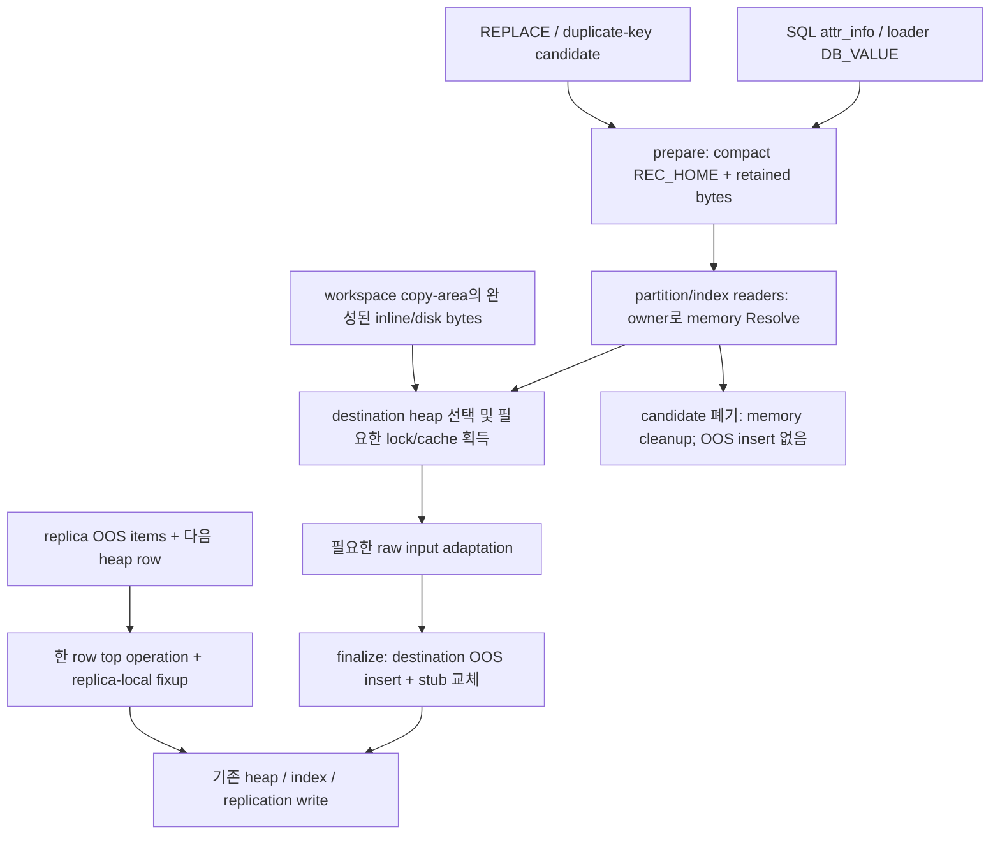

# PR #7927 한국어 코드 리뷰 가이드

> 검토 대상: CBRD-27089, 목적지 heap 선택 뒤 OOS 쓰기 수행. 이 문서는 PR 전체의 순변경과 이번 `heap_oos_value_ref` 파일 분리를 함께 설명한다. 원격 PR: [CUBRID/cubrid #7927](https://github.com/CUBRID/cubrid/pull/7927).

<a id="revisions"></a>
## 1. 고정 리비전과 읽는 방법

| 항목 | 정확한 식별자 |
| --- | --- |
| PR head repository / branch | `vimkim/cubrid` / `feat/oos-deferred-write` |
| PR base repository / branch | `CUBRID/cubrid` / `feature/oos-merge` |
| 검증한 base tip = merge-base | `fb567a629cdb390fff920542173fa36f454c74a0` |
| 게시된 PR head | `4be72fc209ae9cb8aa1709573d7d0ae7fc06df7c` |
| 파일 분리와 통합 검증을 마친 로컬 engine | `f3144ab4b72fc2bf73f115c9da1cf193c756457a` |
| 최종 engine tree | `2b8afa19ef2955320088e38f8989cd5b1c1e4765` |
| 로컬 engine task branch | `CBRD-27089-pr7927-value-ref-extraction` |
| 공개 testcase, `tc/pr-7927` | `f5e610d91efdeaa9fcf089f47bf4a89c103a4a93` |
| 비공개 testcase, `tc/pr-7927` | `10f3500291c3d3f5c7bcf6ed5c90142a6ed0f532` |
| testcase 평가 문서의 로컬 commit | `ef4198f2ee5825c5e5c56c313ef0cebb69097196` |
| 이 작업을 시작한 docs main | `2aa1da2` |

비교 범위는 **위 merge-base → 최종 로컬 engine** 이다. 게시된 head 이후의 추가 engine 변경은 value-reference 파일 분리이며, testcase 변경은 별도 저장소에서 관리한다. `f3144ab4b72fc2bf73f115c9da1cf193c756457a` 는 아직 게시하지 않은 로컬 commit 이므로 해당 SHA의 GitHub 주소를 만들지 않는다. 아래 최종 코드 링크는 검토 worktree 안의 파일과 줄을 가리킨다. worktree를 옮긴 경우 같은 SHA를 checkout한 뒤 표시된 `src/...:line` 에서 읽는다. 게시된 이력은 [base](https://github.com/CUBRID/cubrid/tree/fb567a629cdb390fff920542173fa36f454c74a0) 와 [분리 전 head](https://github.com/vimkim/cubrid/tree/4be72fc209ae9cb8aa1709573d7d0ae7fc06df7c) 에서 확인할 수 있다.

문서의 local integration은 사용자가 승인했다. testcase 평가와 이 가이드의 최종 위치는 `/home/vimkim/gh/my-cubrid-docs/cbrd-27089` 이다. 엔진 추출의 `feat/oos-deferred-write` 통합은 기존 CCI/JDBC 변경을 그대로 보존하라는 후속 결정에 따라 보류했다. 따라서 최종 engine은 계속 검토 worktree의 `f3144ab4b72fc2bf73f115c9da1cf193c756457a` 이며 원격 PR head는 바뀌지 않았다.

문장의 **필수 계약** 은 authoritative OOS context/accepted ADR 또는 이 작업의 명시적 목적을 뜻한다. **현재 구현** 은 고정 engine 소스가 실제 수행하는 동작이다. **추론** 은 그 소스와 실행 증거로 설명한 이유/실패 가능성이며, 새 규범으로 취급하지 않는다. historical guide의 `heap_prepared_row`, `REC_OOS_PENDING`, 포인터가 들어 있는 임시 stub 설명은 현재 revision에 적용하지 않는다. 현재 임시 stub의 세 번째 필드는 owner의 **index** 이다.

<a id="toc"></a>
### 목차

- [문제와 전후 실행](#problem), [prepare → destination → finalize → write](#flow), [변경 경계와 규범](#contracts)
- [`heap_oos_value_ref`](#value-ref): [표현/소유권](#value-ref), [encode](#ref-encode), [decode](#ref-decode), [read](#ref-read), [분리/의존성](#extraction)
- [`heap_pending_record`](#pending-owner): [수명](#owner-lifecycle), [retain](#owner-retain), [owns/resolve](#owner-resolve), [두 클래스의 협력](#cooperation)
- [준비/serialization](#preparation): [entry](#prepare-entry), [adapter](#prepare-adapter), [plan](#column-plan), [shared serializer](#serializer), [variable/columns](#variable-writer)
- [읽기/키](#readers): [scalar Resolve](#scalar-resolve), [grouped Resolve](#grouped-resolve), [attribute dispatcher](#attribute-read), [composite size](#composite-size), [index key](#index-key)
- [최종화와 저장/전송 경계](#finalization): [finalize](#finalize), [disk validation](#disk-validation), [header/offset/stub checks](#record-bounds), [heap writers](#heap-writers), [fetch publication](#fetch-publication), [prefetch](#prefetch)
- [locator/routing](#routing): [shared handoff](#locator-handoff), [INSERT](#insert-force), [UPDATE](#update-force), [movement](#move-record), [SQL force](#attribute-force), [copy area](#copyarea-force), [multi-update](#multi-update), [redistribution](#redistribution), [bulk](#bulk-insert)
- [중복 탐색](#duplicate-probes): [REPLACE](#replace-probe), [duplicate-key UPDATE](#duplicate-update-probe)
- [server loader](#loader): [class members](#loader), [BU locks](#loader-locks), [line completion](#loader-finish), [flush](#loader-flush), [target classification](#loader-attrinfo), [init/destroy](#loader-lifecycle)
- [publication/복제](#replication): [state reset](#publication-reset), [insert helper](#serialized-insert), [PK logging](#index-replication), [replica atomic group](#replica-force)
- [mechanical signature 표](#signatures), [build와 테스트 코드](#test-code), [검증 결과](#verification), [testcase 판단](#testcase-assessment): [실패별 결정](#testcase-decisions), [partition 수정](#testcase-partition), [native 실행](#testcase-native); [한계/남은 문제](#limits), [이력/출처](#history), [질문 색인](#questions)

<a id="problem"></a>
## 2. 원래 문제: 값이 같아도 소유 heap이 틀릴 수 있다

**필수 계약:** OOS file은 heap당 최대 하나이며 heap header의 VFID로 연결된다. 한 OOS value chain은 해당 논리적 heap-record version이 소유한다. 입력 table identity, 이전 heap, destination heap은 구분해야 한다. partitioned root를 대상으로 INSERT했다고 해서 root heap이 행의 소유자가 되는 것은 아니다.

이슈의 historical 재현은 64B `STORAGE FORCE_OUTLINE` 값에서 SELECT equality=1인데 root has_oos=1/child=0이 되는 경우다. [JIRA CBRD-27089](http://jira.cubrid.org/browse/CBRD-27089) 를 2026-10-07에 read-only 조회했다(updated 2026-09-18, Develop/Unresolved). [조회한 로컬 cache](/home/vimkim/.local/share/cubrid-jira/issues/CBRD-27089.md)의 구현 이름/검증 SHA는 이전 설계를 설명하므로 final source로 대체해 읽는다. 아래는 multi-chunk까지 포함하는 실행 예시다.

예를 들어 root `t` 아래에 `p0: id < 10`, `p1: id >= 10` 이 있고 `id=11`, 50,000B VARBIT 값을 INSERT한다고 하자. 큰 값은 여러 OOS chunk record로 나뉜다. **이전 구현** 은 `heap_attrinfo_transform_to_disk_internal` 의 준비 단계에서 `attr_info->class_oid` 를 사용해 즉시 OOS chain을 만들었다. 그 class가 root이면 root OOS file에 값이 들어간다. 그 후 partition pruning은 행을 `p1` 로 보내고, `p1` heap record에는 root file의 head OOS OID가 든 stub이 저장된다.

`oos_read` 가 stub의 물리 OID를 따라가면 SELECT의 값 비교는 성공할 수 있다. 따라서 값이 같은지만 검사하면 소유권 결함을 놓친다. heap을 기준으로 OOS VFID를 찾는 정리 경로, DROP/redistribution 같은 수명 경계는 같은 heap의 OOS file을 전제로 한다. **추론:** 잘못된 연결은 잘못된 file을 대상으로 하는 정리 또는 누락된 회수를 유발할 수 있다. 이 문서는 그 모든 결과를 이번 실행에서 재현했다고 주장하지 않는다.

**현재 구현:** prepare는 selected attribute의 canonical serialized bytes를 owner 메모리에 보관한다. routing이 `p1` 을 고른 뒤 finalizer가 `p1` 의 OOS file에 새 chain을 기록하고 같은 크기의 stub을 disk reference로 바꾼다. heap/index 쓰기는 그 뒤에 수행한다. `InsertOwnsOosInDestinationHeap` 과 movement/redistribution 테스트가 논리값과 heap별 OOS 관찰을 함께 사용한다.

실제 key domain을 인위적으로 바꾸지 않고 준비된 key를 읽는다는 점도 중요하다. 작은 `STORAGE FORCE_OUTLINE` key는 prepare 시 OOS-marked지만 아직 disk chain이 없다. partition reader가 그 값을 읽으려면 pending owner와 value reference의 memory Resolve가 필요하다. key를 미리 별도로 평가하고 쓰기 때 다시 평가하는 구조를 새로 만들지 않는다.

<a id="flow"></a>
### prepare → destination selection → finalize → write



| 단계 | 주 상태 | 가능한 I/O/부수 효과 | 아직 하지 않은 일 |
| --- | --- | --- | --- |
| prepare | `heap_pending_record::prepared`; selected stub은 NULL head + length + index | 기존 값의 OOS Resolve, class/representation 읽기, 선택에 따른 LOB copy | selected 새 OOS chain insert |
| destination selection | 같은 allocation의 RECDES view와 owner를 함께 전달 | pruning expression, class lock, partition scan cache | 목적지 OOS chain insert |
| finalize | prepared owner를 finalized/failed로 전이 | destination OOS VFID 생성/조회, `oos_insert_many`, logged-write publication | heap row commit, transaction commit |
| write | disk-only row가 heap/index 소비자에 전달 | 기존 WAL, index/FK, heap insert/update, replication | 성공 반환만으로 transaction durability 확정되지 않음 |

prepare는 **새 OOS chain 쓰기를 지연** 하는 것이며 zero-I/O/side-effect-free 약속은 아니다. finalization 성공은 chain과 stub 준비의 완료이고, 그 뒤 index/heap 실패는 enclosing transaction/system operation으로 rollback해야 한다. owner destructor로 disk 작업을 취소할 수 없다.

<a id="contracts"></a>
### 규범과 이번 PR의 변경 경계

24B durable stub `[head OOS OID | full length | packed identity stamp]`, identity validation, largest-first demotion, LOB locator의 type-agnostic eligibility는 base에 이미 있다. 이번 PR은 그 durable format과 storage policy를 새로 도입하지 않는다. pending form도 24B field를 사용하지만 NULL head와 owner index는 **로컬 준비 중인 상태** 이고 disk/외부 전송 format으로 허용되지 않는다.

규범의 record gate는 unfill을 제외한 PG-style four-record physical target이다. **현재 구현** 의 `heap_attrinfo_determine_disk_layout` 은 inherited raw `DB_PAGESIZE / 4` gate를 사용한다. 16KB I/O layout의 normative 4,060B target과 같은 계산이 아니며, 이 PR/파일 분리가 그 conformance gap을 해결한 것으로 설명하지 않는다.

UPDATE는 현재 새 record version에 새 OOS chain을 만든다. unchanged attribute의 값을 읽어서 새 준비/새 chain에 포함하는 것과 chain reuse는 다르다. accepted CBRD-27230의 unassigned-chain reuse/commit-conditional notification 설계가 이 PR에서 구현되었다고 주장하지 않는다. 반대로 오래된 문서의 CBRD-27237 blocker를 그대로 현재 base의 미수정 결함으로 쓰지도 않는다. [현재 base와 역사적 관찰의 구분](#limits)을 따른다.

<a id="value-ref"></a>
## 3. `heap_oos_value_ref`: 한 값의 읽기 참조

최종 코드: [heap_oos_value_ref](/home/vimkim/gh/cb/CBRD-27089-pr7927-value-ref-extraction/src/storage/heap_oos_value_ref.hpp:36) (`src/storage/heap_oos_value_ref.hpp:36`) <!-- source-ref:heap_oos_value_ref -->.

**표현과 도입 이유:** 하나의 serialized OOS attribute value를 읽기 위한 decoded reference다. packed record format 자체도 아니고 heap row owner도 아니다. 기존 reader는 disk stub만 읽었으나 routing과 duplicate probe는 아직 disk에 없는 selected value를 읽어야 한다. 이 클래스가 두 저장 위치를 같은 `length()` / `read_into()` 계약으로 처리한다.

| member / type | 의미와 불변 조건 |
| --- | --- |
| `kind { memory, disk }` / `m_kind` | 정상 decode가 선택한 읽기 경로. private이므로 일반 caller가 임의로 바꾸지 못함 |
| `m_length` | 검증된 serialized byte 길이. decode 성공 시 `0 < length <= DB_MAX_STRING_LENGTH` |
| `value` union / `m_value.memory` | prepared owner가 보유한 payload를 가리키는 **borrowed `const char *`** |
| `m_value.disk` | `oos_chain_ref` 값 복사: head OOS OID + unpacked identity stamp |
| 기본 생성 | disk kind, zero length, zero-initialized disk reference. 성공 decode 전에는 유효한 value라는 보장이 없음 |
| `length()` | byte 길이 조회. payload의 논리 type/DB_VALUE를 보유하지 않음 |
| friend `heap_oos_read_grouped_payloads` | disk reference만 grouped I/O request에 넣기 위한 기존 내부 접근 |
| friend `heap_oos_finalize_record` | validated memory reference를 insert request의 borrowed payload로 사용하기 위한 기존 내부 접근 |

**소유권/복사:** ref는 retained payload나 page를 소유하지 않는다. default copy/move는 pointer 또는 disk chain reference를 복사하며 owner 수명을 늘리지 않는다. memory ref는 해당 owner allocation이 살아 있는 동안만 사용할 수 있다. `read_into` 는 caller가 소유한 output buffer로 bytes를 복사한다. ref의 destructor가 payload를 free하지 않으며, disk path도 page pointer를 밖에 내주지 않는다. 이 구분은 “출력은 caller-owned copy”와 “ref 내부는 borrowed pointer”를 동시에 유지한다.

**생성·사용·소멸:** scalar reader/size 계산은 stack ref를 만들어 decode하고 즉시 소비한다. grouped reader는 각 attribute를 decode하여 memory output을 채우거나 disk request를 수집한다. finalizer는 stack ref로 owner의 selected bytes를 검증한다. 이 stack ref들은 owner가 살아 있는 호출 범위 안에서 사라진다. reader output의 ownership은 기존 scratch/allocated payload/DB_VALUE 계약을 따른다.

**제거 시 실패 순서(추론):** FORCE_OUTLINE partition key를 준비하면 stub head는 NULL이다 → 기존 disk-only parser는 key를 거절하거나 존재하지 않는 chain을 읽으려 한다 → partition을 고를 수 없다. 이를 피하려고 먼저 input heap에 chain을 쓰면 원래 소유권 문제가 돌아온다. 동등한 memory/disk 읽기 추상화가 필요하다.

<a id="ref-encode"></a>
### `heap_oos_value_ref::encode_pending`

최종 코드: [heap_oos_value_ref::encode_pending](/home/vimkim/gh/cb/CBRD-27089-pr7927-value-ref-extraction/src/storage/heap_oos_value_ref.cpp:38) (`src/storage/heap_oos_value_ref.cpp:38`) <!-- source-ref:heap_oos_value_ref::encode_pending -->.

caller는 variable writer이며 이미 확보/검사한 24B field에 NULL OID, serialized length, retained-vector index를 OR encoding으로 기록한다. actual pointer를 record bytes에 쓰지 않는다. encode 자체는 owner나 index 범위를 검증하지 않으므로 caller가 성공한 `retain` 의 index를 전달하는 것이 전제다. durable stub과 field 크기가 같아 finalizer가 offsets/record 길이를 바꾸지 않고 대체할 수 있다.

<a id="ref-decode"></a>
### `heap_oos_value_ref::decode` / `decode_stub`

최종 코드: [heap_oos_value_ref::decode](/home/vimkim/gh/cb/CBRD-27089-pr7927-value-ref-extraction/src/storage/heap_oos_value_ref.cpp:48) (`src/storage/heap_oos_value_ref.cpp:48`) <!-- source-ref:heap_oos_value_ref::decode -->, [heap_oos_value_ref::decode_stub](/home/vimkim/gh/cb/CBRD-27089-pr7927-value-ref-extraction/src/storage/heap_oos_value_ref.cpp:57) (`src/storage/heap_oos_value_ref.cpp:57`) <!-- source-ref:heap_oos_value_ref::decode_stub -->.

`decode` 는 attribute location을 `heap_recdes_get_oos_inline_stub` 으로 검증한 후 private decoder에 맡긴다. stub이 없거나 길이가 비정상이면 `ER_HEAP_OOS_BAD_INLINE_HEADER` 이다. non-NULL head이면 identity를 unpack해 disk ref로 만든다. 이 단계는 해당 chain이 실제 존재하는지/읽어도 되는지까지 증명하지 않으며 storage reader가 identity와 chunk를 검증한다.

NULL head일 때는 `pending` 가 필수이고 `0 <= index <= INT_MAX` 를 검사한다. `pending->resolve(record,index,length)` 가 prepared state, **같은 record allocation**, retained-vector 범위, 정확한 payload 길이를 모두 확인해야 memory ref가 된다. 따라서 bytes가 같은 deep copy, 다른 owner, 받은 bytes, NULL owner는 process-memory 접근을 승인하지 못한다. 같은 owner의 shallow RECDES view는 header 확장 후의 length가 area_size 안에 있으면 허용된다.

실패 decode 이후 ref를 유효하다고 사용하지 않는 것이 caller 계약이다. decode가 error를 반환했는데 `length()` 만 보고 allocation/read를 진행하면 잘못된 reference의 이전 member 상태를 사용할 수 있다. 현재 scalar/grouped caller는 error를 먼저 확인한다.

<a id="ref-read"></a>
### `heap_oos_value_ref::read_into`

최종 코드: [heap_oos_value_ref::read_into](/home/vimkim/gh/cb/CBRD-27089-pr7927-value-ref-extraction/src/storage/heap_oos_value_ref.cpp:108) (`src/storage/heap_oos_value_ref.cpp:108`) <!-- source-ref:heap_oos_value_ref::read_into -->.

input은 thread와 caller-owned `oos_buffer` 이다. destination pointer가 NULL이거나 destination.size가 `m_length` 와 정확히 같지 않으면 `ER_GENERIC_ERROR` 를 설정한다. memory kind는 `memcpy`, disk kind는 `oos_read(thread,chain_ref,destination)` 를 수행한다. 반환값과 error stack은 기존 CUBRID error contract이며 ref/owner를 소비하거나 해제하지 않는다. memory kind에서 그 사이 owner가 파괴되면 use-after-free가 되므로 reader를 owner보다 오래 살게 해서는 안 된다.

<a id="extraction"></a>
### 파일 분리: 인터페이스와 의존성

이번 로컬 변경은 class 선언을 `src/storage/heap_oos_value_ref.hpp`, 그 member 구현을 `src/storage/heap_oos_value_ref.cpp` 로 옮긴다. `heap_oos.hpp/.cpp` 는 record-level Expand, finalization, disk validation, grouped Resolve, publication, eager cleanup 책임을 유지한다. `heap_pending_record.hpp/.cpp` 는 allocation 소유를 유지한다. value ref가 row 소유권이나 finalization을 가져가지 않는다.

header는 필요한 value/record/storage type을 포함하고 `heap_pending_record`, `heap_cache_attrinfo` 를 forward-declare하여 owner/heap module 전체를 class 인터페이스에 끌어들이지 않는다. implementation은 owner `resolve`, field-bounds helper와 OR/error/storage read를 사용한다. caller들은 ref를 사용하는 위치에서 새 header를 직접 포함한다. 기존 private access를 위한 두 friend 관계를 보존하며 새 public accessor를 만들지 않는다.

`cubrid/CMakeLists.txt` 와 `sa/CMakeLists.txt` 의 storage source list에 새 cpp가 들어간다. engine object를 사용하는 unit/SQL target도 같은 정의를 연결하므로 declaration만 옮기고 object를 빠뜨리는 unresolved symbol 위험을 점검했다. [최종 검증](#verification)은 파일 이동의 byte-equivalence/헤더 자체 compilation/실제 engine compilation 및 기존 테스트를 구분한다.

<a id="pending-owner"></a>
## 4. `heap_pending_record`: 준비된 행과 retained bytes의 owner

최종 코드: [heap_pending_record](/home/vimkim/gh/cb/CBRD-27089-pr7927-value-ref-extraction/src/storage/heap_pending_record.hpp:32) (`src/storage/heap_pending_record.hpp:32`) <!-- source-ref:heap_pending_record -->.

**표현과 도입 이유:** compact row allocation 하나와 별도로 serialized selected OOS payload allocations를 함께 보유한다. local prepare, routing, finalization이 서로 다른 함수에서 수행되거나 loader input이 먼저 지워져도 bytes의 수명이 이어져야 한다. row 전체를 expanded form으로 재구성하지 않고 compact offsets와 selected bytes만 보유한다.

| member / method | 책임과 계약 |
| --- | --- |
| `m_record: record_descriptor` | compact record allocation 소유; `record()` 는 수정 인터페이스, `get_recdes()` 는 borrowed const descriptor |
| `m_values: vector<oos_buffer>` | 성공 retain으로 인수한 payload allocation들의 span 목록; vector 자체가 pointee를 자동 free하는 구조는 아니므로 destructor가 각각 free |
| `m_bytes` | retained payload size 합계. allocation 추정의 일부이며 OS RSS가 아님 |
| `state { empty, prepared, finalized, failed }` | owner를 통해 memory access/finalization할 수 있는 상태의 구분 |
| `is_prepared()` / `is_finalized()` | state 조회. Resolve는 prepared만, finalize는 prepared/finalized를 구별해 처리 |
| `mark_prepared()` | 성공 prepare 뒤 memory Resolve를 허용 |
| `finish(success)` | finalized/failed로 전이; success이면 owner record type을 `REC_HOME` 으로 설정 |
| `retained_bytes()` | record area_size + payload byte 합계 + payload-vector capacity 비용. loader outer queue capacity는 caller가 더함 |

<a id="owner-lifecycle"></a>
### constructor / move constructor / destructor와 상태 전이

최종 코드: [heap_pending_record::heap_pending_record](/home/vimkim/gh/cb/CBRD-27089-pr7927-value-ref-extraction/src/storage/heap_pending_record.cpp:35) (`src/storage/heap_pending_record.cpp:35`) <!-- source-ref:heap_pending_record::heap_pending_record -->, [heap_pending_record::~heap_pending_record](/home/vimkim/gh/cb/CBRD-27089-pr7927-value-ref-extraction/src/storage/heap_pending_record.cpp:51) (`src/storage/heap_pending_record.cpp:51`) <!-- source-ref:heap_pending_record::~heap_pending_record -->.

constructor는 standard allocator를 설정하되 record buffer는 NULL/0으로 시작한다. copy constructor와 copy assignment `operator=` 는 deleted다. move constructor는 `record_descriptor` 를 move하고 payload vector를 swap하며 bytes/state를 옮긴다. moved-from owner는 bytes=0, state=empty이다. **move assignment는 제공되지 않는다.** 새 loader vector element로 move-construct하거나 vector reallocation 시 이동하는 경로가 allocation 주소를 유지한다. alias RECDES/ref를 다른 owner 객체 주소에 묶는 것이 아니라 allocation에 묶기 때문에 move된 새 owner와 함께 기존 view를 읽을 수 있다.

```text
empty ── successful prepare ──> prepared
                                ├─ successful finalize ──> finalized
                                └─ failed finalize ──────> failed
```

새 prepare는 empty record buffer를 요구한다. partial prepare failure의 retained allocations는 scope 종료에서 해제된다. finalized owner로 다시 finalize하면 disk validation만 하고 insert/publication reset은 반복하지 않는다. failed owner로 재시도하면 finalizer state check에서 error이며 storage rollback을 한 뒤 새 owner로 새 operation을 시작해야 한다. 이 상태들은 메서드를 통해 설정하는 내부 호출 계약이지 arbitrary public setter 사용을 막는 formal type-state 시스템은 아니다.

destructor는 retained data를 각각 free하며 `m_record` member destructor가 compact record allocation을 해제한다. finalization 성공 후에도 retained bytes를 즉시 비우지 않는다. owner가 끝날 때까지 유지되므로 loader의 accounting은 “아직 OOS에 쓰지 않은 byte만”을 뜻하지 않는다. destructor는 OOS chain delete/transaction abort를 수행하지 않는다.

<a id="owner-retain"></a>
### `heap_pending_record::retain`

최종 코드: [heap_pending_record::retain](/home/vimkim/gh/cb/CBRD-27089-pr7927-value-ref-extraction/src/storage/heap_pending_record.cpp:60) (`src/storage/heap_pending_record.cpp:60`) <!-- source-ref:heap_pending_record::retain -->.

input은 malloc 계열로 생성한 serialized `oos_buffer`, output은 stable vector index다. 성공한 `push_back` 이후 owner가 payload 해제 책임을 가진다. vector growth의 `std::bad_alloc` 을 즉시 `ER_OUT_OF_VIRTUAL_MEMORY` 로 바꾼다. 실패하면 owner가 인수하지 않은 buffer는 serializer caller가 free한다. 이미 인수한 앞선 값은 owner가 계속 보유한다. vector element의 relocation은 payload allocation 자체를 움직이지 않으므로 value ref의 pointer 안정성은 유지된다.

<a id="owner-resolve"></a>
### `heap_pending_record::owns` / `resolve`

최종 코드: [heap_pending_record::owns](/home/vimkim/gh/cb/CBRD-27089-pr7927-value-ref-extraction/src/storage/heap_pending_record.cpp:77) (`src/storage/heap_pending_record.cpp:77`) <!-- source-ref:heap_pending_record::owns -->, [heap_pending_record::resolve](/home/vimkim/gh/cb/CBRD-27089-pr7927-value-ref-extraction/src/storage/heap_pending_record.cpp:84) (`src/storage/heap_pending_record.cpp:84`) <!-- source-ref:heap_pending_record::resolve -->.

`owns` 는 non-NULL data pointer가 owner record allocation과 같고 `0 < record.length <= owner.area_size` 인지 검사한다. descriptor의 length/type 전체를 equality 비교하지 않으므로 호출 중 MVCC header가 커진 local view도 동일 allocation의 view로 인정한다. 다른 allocation에 복사한 bytes는 인정하지 않는다.

`resolve` 는 그 조건에 prepared state, index 범위, exact length를 추가한다. 성공하면 borrowed span을 반환하고 실패하면 `{nullptr,0}` 이다. disk chain이나 finalized stub을 memory로 되돌려 주지 않는다. 주 caller는 value-ref decoder이며 일반 attribute 소비자에게 raw retained span을 직접 넘기는 대신 output copying contract를 사용한다.

**제거 시 실패 순서(추론):** loader가 DB_VALUE를 serialized payload로 준비한다 → `finish_line` 이 input DB_VALUE를 지운다 → flush 때 partition key 또는 payload를 읽는다 → owner가 없으면 bytes가 해제되었거나 덮어써져 잘못된 routing/value가 된다. `owns/resolve` 검증만 제거하면 copied/incoming index를 다른 owner의 payload에 적용하는 잘못된 memory Resolve도 가능해진다. current bytes는 process pointer를 저장하지 않는다.

<a id="cooperation"></a>
### 두 클래스가 다른 점과 협력

| 질문 | `heap_pending_record` | `heap_oos_value_ref` |
| --- | --- | --- |
| 표현 단위 | compact row 전체 + selected payload 집합 | 한 attribute의 decoded reference |
| 소유 | row와 retained payload allocations | allocation/page 소유 없음 |
| lifetime | prepare부터 accepted write/probe/queue 종료까지 | 보통 한 reader/finalizer 호출의 stack 범위 |
| copying / moving | copy 금지, move construction만 지원 | 값/borrowed pointer 복사 가능; 수명 연장 없음 |
| authorization | prepared state + allocation identity + index/length | owner 검증 결과를 사용해 memory/disk kind 선택 |
| cleanup | memory free | output buffer/owner/chain cleanup을 하지 않음 |

흐름은 `serialize → owner.retain → index stub → ref.decode(owner) → ref.read_into` 이다. routing이 끝나면 finalizer가 같은 owner 검증을 통해 payload를 destination insert batch에 넣고 durable stub을 기록한다. 그 뒤 새로운 decode는 non-NULL head로 disk path를 선택한다. 기존 memory ref가 disk ref로 자동 전환되는 것은 아니므로 old memory ref를 owner 파괴 뒤 재사용하면 안 된다.

caller 수명은 SQL `locator_attribute_info_force` / 두 duplicate-probe의 stack owner, INSERT/UPDATE raw adaptation의 `received` owner, redistribution 루프의 `prepared` owner, loader `m_recdes_collected` vector에 의해 유지된다. 각 caller는 RECDES view를 자기 scope 안에 두고 force/read 완료 뒤 owner를 파괴한다.

<a id="preparation"></a>
## 5. 준비와 serialization의 주요 심볼

<a id="prepare-entry"></a>
### `heap_attrinfo_prepare_record`

최종 코드: [heap_attrinfo_prepare_record](/home/vimkim/gh/cb/CBRD-27089-pr7927-value-ref-extraction/src/storage/heap_file.c:13279) (`src/storage/heap_file.c:13279`) <!-- source-ref:heap_attrinfo_prepare_record -->.

base에는 이 entry가 없고 ordinary SQL/probe/loader가 immediate serializer를 사용했다. 현재는 attr cache, old record, empty pending owner, `copy_lobs` 를 받아 기존 serializer에 owner를 전달한다. 시작 시 paired publication state를 reset하고 preparation failure seam/`bad_alloc` 을 C-style error로 처리한다. 성공하면 owner record는 `REC_HOME`, state는 prepared다. `REC_HOME` 이라는 type만으로 disk에 저장 가능한지는 알 수 없다.

`old_recdes` 는 UPDATE의 unassigned attribute 읽기와 header 처리에 쓰인다. `copy_lobs` 는 established include/exclude LOB behavior를 선택한다. success `S_SUCCESS` 전에는 owner memory Resolve를 허용하지 않는다. selected bytes를 retain하지만 새 OOS chain은 insert하지 않는다. caller는 SQL force, duplicate probes, loader, serialized adapter이며 [pending/실패 테스트](#test-code)가 input cleanup, allocation 오류, 다음 write의 상태를 검증한다.

<a id="prepare-adapter"></a>
### `heap_prepare_oos_record`

최종 코드: [heap_prepare_oos_record](/home/vimkim/gh/cb/CBRD-27089-pr7927-value-ref-extraction/src/storage/heap_file.c:13316) (`src/storage/heap_file.c:13316`) <!-- source-ref:heap_prepare_oos_record -->.

이미 serialized된 workspace/redistribution row를 한 번 local pending owner로 바꾸는 adapter다. `source_class` 의 representation으로 attributes를 읽고 `heap_attrinfo_prepare_record(...,false)` 로 새 compact row를 만든다. source 값이 OOS-backed면 lazy Resolve를 할 수 있다. received bytes에는 owner가 없으므로 NULL-head 임시 stub을 memory로 신뢰하지 않는다.

새 SQL expression/assignment를 다시 실행하거나 LOB copy를 반복하지 않는다. source MVCC header를 가져와 insert/delete ID, previous-version LSA 등은 유지하고 repid를 최신 representation ID로, HAS_OOS를 새 layout에 맞춘다. header resize 후 실제 target length를 owner에 반영한다. attr cache는 성공/실패 모두 end한다. source allocation은 owner가 인수하지 않으므로 source가 먼저 없어져도 새 owner의 bytes가 살아 있다. `SerializedPreparationPreservesMvccAndOutlivesSource`, raw/movement/redistribution 테스트가 이 경계를 다룬다.

<a id="column-plan"></a>
### `heap_oos_column_plan`

최종 코드: [heap_oos_column_plan](/home/vimkim/gh/cb/CBRD-27089-pr7927-value-ref-extraction/src/storage/heap_file.c:732) (`src/storage/heap_file.c:732`) <!-- source-ref:heap_oos_column_plan -->.

serializer의 attribute별 layout/쓰기 계획이다. 기존 `selected`, eventual head `oid`, `length`, `identity_stamp` 에 `pending_index=-1` 이 추가된다. selected value는 성공적으로 retained된 nonnegative index 또는 immediate legacy path의 non-NULL OID로 표현된다. pending과 disk state를 별도 공개 class로 확장하지 않고 기존 plan 안에서 선택한다. 이 plan은 serializer scope에 있으며 owner의 bytes를 소유하지 않는다.

<a id="serializer"></a>
### `heap_attrinfo_transform_to_disk_internal`

최종 코드: [heap_attrinfo_transform_to_disk_internal](/home/vimkim/gh/cb/CBRD-27089-pr7927-value-ref-extraction/src/storage/heap_file.c:13865) (`src/storage/heap_file.c:13865`) <!-- source-ref:heap_attrinfo_transform_to_disk_internal -->.

base의 공통 serializer를 그대로 사용하되 optional pending owner가 추가된다. uninitialized/default/unassigned 값 채우기, representation/layout 계산, MVCC 최대 header 여유, OOS+bigone rejection, header/column write와 `S_DOESNT_FIT` grow/retry를 유지한다. pending caller와 legacy immediate caller가 별도의 type serializer를 갖지 않기 위해 필요하다.

`has_oos` 가 참이면 pending path는 selected attributes를 established `heap_attrinfo_serialize_oos_value` 로 serialize하고 owner에 retain하여 index/length를 plan에 저장한다. retain failure면 해당 payload는 caller가 free하고 error를 반환한다. pending이 NULL인 legacy path는 기존 `heap_attrinfo_insert_to_oos` 를 사용한다. 이 구분 때문에 “PR 안의 모든 transform-to-disk가 무조건 deferred”라고 해석하면 안 된다.

selected payload serialization은 grow/retry loop 앞에서 수행한다. loop에서는 이미 retained된 bytes를 가리키는 24B stub을 재기록하므로 값의 serialization/LOB copy를 매번 반복하지 않는다. inline writer의 established assignment/LOB guards는 유지한다. OOS+bigone error는 새 chain 쓰기 전이며 ordinary non-OOS bigone은 기존 처리로 간다. serializer의 output length가 성공 때에만 확정되는 점도 유지한다.

<a id="variable-writer"></a>
### `heap_attrinfo_transform_variable_to_disk`

최종 코드: [heap_attrinfo_transform_variable_to_disk](/home/vimkim/gh/cb/CBRD-27089-pr7927-value-ref-extraction/src/storage/heap_file.c:13593) (`src/storage/heap_file.c:13593`) <!-- source-ref:heap_attrinfo_transform_variable_to_disk -->.

variable value와 VOT entry를 쓰는 기존 함수다. selected field의 `*ptr_varvals + OR_OOS_INLINE_SIZE` bounds check 이후 `pending_index >= 0` 이면 `encode_pending` 하고 pointer를 24B만큼 전진시킨다. 그 외에는 기존 head/length/stamp writer를 수행한다. `IS_OOS` 표시와 physical field 크기는 같아 downstream layout을 새로 정의하지 않는다. bounds check가 VOT pointer 대신 실제 field pointer를 보는 기존 수정을 유지한다.

### `heap_attrinfo_transform_columns_to_disk`

최종 코드: [heap_attrinfo_transform_columns_to_disk](/home/vimkim/gh/cb/CBRD-27089-pr7927-value-ref-extraction/src/storage/heap_file.c:13781) (`src/storage/heap_file.c:13781`) <!-- source-ref:heap_attrinfo_transform_columns_to_disk -->.

fixed/variable attributes를 established order로 쓰는 함수다. selected plan assertion이 `pending_index >= 0 || !OID_ISNULL(oid)` 를 허용하도록 바뀐다. 계획만 selected이고 valid retained/disk reference가 없는 상태를 정상으로 인정하지 않는다. incremented-attribute set, offsets/alignment, fixed writer, retry 정책의 변경은 없다. 이 assertion은 bounds/owner 검증을 대체하지 않으며 실제 reader/finalizer가 그 계약을 다시 확인한다.

<a id="readers"></a>
## 6. 준비된 값 읽기와 index key

<a id="scalar-resolve"></a>
### `heap_attrvalue_read_oos_inline`

최종 코드: [heap_attrvalue_read_oos_inline](/home/vimkim/gh/cb/CBRD-27089-pr7927-value-ref-extraction/src/storage/heap_file.c:11102) (`src/storage/heap_file.c:11102`) <!-- source-ref:heap_attrvalue_read_oos_inline -->.

base의 disk-only inline parser + `oos_read` 대신 `heap_oos_value_ref::decode/read_into` 를 사용한다. attribute location과 optional owner를 받아 value length에 맞는 stack scratch 또는 allocated raw buffer를 준비한다. 성공한 memory와 disk 경로 모두 type deserializer가 동일한 serialized bytes를 받는다.

decode failure면 raw data를 detach하고 error를 반환한다. read failure면 heap buffer만 해제하며 stack scratch는 해제하지 않는다. success 뒤 `oos_owned_buffer`/raw value의 기존 transfer/copy cleanup은 유지한다. 여기서 output copy가 있기 때문에 DB_VALUE가 owner의 retained pointer를 직접 소유하게 되는 것이 아니다.

<a id="grouped-resolve"></a>
### `heap_oos_read_grouped_payloads`

최종 코드: [heap_oos_read_grouped_payloads](/home/vimkim/gh/cb/CBRD-27089-pr7927-value-ref-extraction/src/storage/heap_oos.cpp:703) (`src/storage/heap_oos.cpp:703`) <!-- source-ref:heap_oos_read_grouped_payloads -->.

요청된 OOS attributes가 두 개 이상일 때 기존 grouped Resolve를 선택한다. base는 모두 disk `oos_read_many` 요청이었고 현재는 각 ref를 decode한 뒤 memory 값은 개별 output에 즉시 복사하고 disk 값만 requests에 넣는다. disk requests가 비어 있으면 storage batch read를 하지 않는다. 한 개 이하이면 `grouped_applied=false` 로 scalar path를 유지한다.

output vector는 attr-info index와 대응하며 non-OOS entry는 empty다. allocation/decode/read 실패의 partial outputs도 caller가 기존 `heap_oos_free_grouped_payloads` 로 해제한다. requests가 borrowed output span을 가지므로 output allocations가 I/O 완료 전 살아 있어야 하며 current loop는 그 수명을 유지한다. `PendingReferencesResolveAndFinalizeInPlace` 는 두 retained 값을 source cleanup 뒤 grouped path로 읽는다.

<a id="attribute-read"></a>
### `heap_attrinfo_read_dbvalues`

최종 코드: [heap_attrinfo_read_dbvalues](/home/vimkim/gh/cb/CBRD-27089-pr7927-value-ref-extraction/src/storage/heap_file.c:11600) (`src/storage/heap_file.c:11600`) <!-- source-ref:heap_attrinfo_read_dbvalues -->.

representation을 갱신하고 attributes를 논리 DB_VALUE로 읽는 공개 heap reader에 optional `const heap_pending_record *` 가 추가된다. base callers의 기본값 NULL은 disk-only 계약을 유지한다. partition/duplicate/index reader는 자신이 보유한 owner를 명시적으로 전달한다. owner는 mutable 소비 대상이 아니며 읽기는 state를 finalized로 바꾸지 않는다.

실제 per-attribute/prefetch dispatcher들은 owner를 하위 reader로 전달한다. fixed/class/shared attributes는 기존 path로 읽고 OOS-marked variable 값만 공통 ref decoder를 쓴다. representation/attr-info error cleanup과 instance OID/CHN state의 established 처리를 유지한다. propagation-only helpers는 [signature 표](#signatures)에 모았다.

<a id="composite-size"></a>
### `heap_midxkey_get_oos_extra_size`

최종 코드: [heap_midxkey_get_oos_extra_size](/home/vimkim/gh/cb/CBRD-27089-pr7927-value-ref-extraction/src/storage/heap_file.c:11549) (`src/storage/heap_file.c:11549`) <!-- source-ref:heap_midxkey_get_oos_extra_size -->.

composite key buffer에는 24B stub 대신 원래 serialized value의 공간이 필요하다. base는 stub에서 length/head를 직접 읽고 NULL head를 거절했다. 현재는 공통 decoder로 owner/length를 검증한 뒤 `ref.length()` 를 더한다. fixed/non-OOS attribute는 zero extra이다.

decode error에는 0을 반환하므로 이 함수만으로 성공을 판단하지 않는다. 실제 key construction의 value read가 error를 반환하여 candidate probe를 실패시킨다. 이 helper가 기존 error stack을 정리하거나 corruption을 허용한다는 의미가 아니다. composite/function/compressed-key tests가 sizing뿐 아니라 최종 key 동작을 검증한다.

<a id="index-key"></a>
### `heap_attrvalue_get_key`

최종 코드: [heap_attrvalue_get_key](/home/vimkim/gh/cb/CBRD-27089-pr7927-value-ref-extraction/src/storage/heap_file.c:15156) (`src/storage/heap_file.c:15156`) <!-- source-ref:heap_attrvalue_get_key -->.

optional owner를 function-index evaluation, composite extra-size, composite value construction으로 전달한다. single/composite/function index 모두 logical key를 읽는 기존 계약을 유지하며 pending stub 자체를 key로 비교하지 않는다. final key DB_VALUE로 ownership이 넘어가기 전 실패하면 기존 buffer/value cleanup을 수행한다.

`heap_midxkey_get_value`, `heap_midxkey_key_get`, `heap_eval_function_index` 는 owner propagation을 추가해 같은 reader를 사용한다. 이 PR은 index ordering/collation/domain 규칙을 변경하지 않는다. duplicate probe가 `copy_lobs` 를 다르게 선택하는 established 차이는 [중복 탐색](#duplicate-probes)에 설명한다.

<a id="finalization"></a>
## 7. 최종화와 저장·전송 경계

<a id="finalize"></a>
### `heap_oos_finalize_record`

최종 코드: [heap_oos_finalize_record](/home/vimkim/gh/cb/CBRD-27089-pr7927-value-ref-extraction/src/storage/heap_oos.cpp:119) (`src/storage/heap_oos.cpp:119`) <!-- source-ref:heap_oos_finalize_record -->.

새 record-level 함수다. 목적지 class, mutable local RECDES view, optional owner를 받는다. owner가 NULL이면 disk validation만 한다. owner가 있으면 valid row header, 같은 allocation, prepared 또는 finalized state를 확인한다. finalized이면 disk validation으로 끝나며 publication reset과 재삽입을 하지 않는다. failed/empty/wrong owner는 error이다.

prepared row는 `heap_oos_begin_insert_publication` 후 OOS가 없으면 length 동기화/finish(true)만 수행한다. OOS row는 **destination representation** 을 얻어 variable attrs의 VOT/stub을 검증하고 모든 selected refs가 memory인지 확인한다. 잘못된 disk+pending 혼합을 정상 새 준비로 허용하지 않는다.

아래 local `pending_value` struct는 `stub` 위치, borrowed `payload`, result `oos_chain_ref` 를 한 항목에 모은다. `values.reserve` 및 모든 values 수집을 마친 뒤에 `requests` 가 result member 주소를 빌린다. vector growth로 결과 주소가 무효화되는 것을 막는 순서다. source payload를 따로 복제해 소유하지 않으며 owner는 batch와 caller write가 끝날 때까지 살아 있다.

`heap_oos_insert_serialized_values(destination,batch)` 성공 뒤에만 **모든 stub** 을 head/length/stamp로 바꾼다. field 길이와 offsets는 유지하고 header 변경으로 늘어난 local length는 owner에 저장한다. 실패하면 owner를 failed로 만들고 publication state를 다시 clear한다. storage batch가 일부 chain을 써둔 경우 이 함수는 transaction rollback을 대체하지 않는다. exception은 `ER_OUT_OF_VIRTUAL_MEMORY` 로 변환하고 representation을 free한다.

**제거 시 실패 순서(추론):** routing 전 pending row가 생김 → heap write가 NULL head를 저장하거나 input heap에 미리 insert → disk-only guard의 error 또는 잘못된 OOS ownership. 동등한 destination-finalization handoff가 필요하다. `FinalizationResetsPublicationOnceAndFailureCannotRetry` 와 rollback failure tests가 재호출/실패 계약을 확인한다.

### `heap_oos_finalize_record::pending_value`

최종 코드: [pending_value](/home/vimkim/gh/cb/CBRD-27089-pr7927-value-ref-extraction/src/storage/heap_oos.cpp:156) (`src/storage/heap_oos.cpp:156`) <!-- source-ref:pending_value -->.

finalizer local struct의 세 members는 mutable stub 위치, owner가 보유한 serialized payload span, batch insert result chain ref다. base에는 이 struct가 없었다. inserted head/stamp의 result addresses를 payload/stub와 같은 stable vector element에 두어 batch completion 뒤 같은 field에 결과를 쓰도록 한다. local vector가 memory payload를 소유하거나 caller owner lifetime을 연장하지는 않는다.

<a id="disk-validation"></a>
### `heap_oos_validate_disk_record`

최종 코드: [heap_oos_validate_disk_record](/home/vimkim/gh/cb/CBRD-27089-pr7927-value-ref-extraction/src/storage/heap_oos.cpp:57) (`src/storage/heap_oos.cpp:57`) <!-- source-ref:heap_oos_validate_disk_record -->.

받은 row/copy/legacy row에는 외부 owner가 없으므로 bytes만으로 memory를 읽지 못하게 하는 저장 계약이다. root class metadata와 `REC_ASSIGN_ADDRESS` 는 다른 format이므로 명시적 bypass다. 그 외는 valid header를 요구하며 HAS_OOS가 없으면 정상 반환한다.

HAS_OOS row는 class representation을 얻고 variable-table가 표현할 수 있는 attribute count인지 검사한다. variable location/VOT entry를 검사하고 OOS-marked field는 기존 disk-only `heap_oos_parse_inline_ref` 로 검사한다. HAS_OOS인데 실제 marked field가 하나도 없거나 NULL head/invalid length/field가 있으면 `ER_HEAP_OOS_BAD_INLINE_HEADER` 이다. representation은 항상 release한다.

이 검사는 record가 디스크 형식을 갖추었는지 검사하며 각 chain existence, transaction visibility 또는 destination OOS file 소속을 증명하지 않는다. 목적지 file 선택은 finalizer, 실제 physical ownership 확인은 heap별 regression 관찰의 책임이다. finalized row도 이 검사를 통과해야 하지만 raw fetch는 **모든 OOS stubs가 Expand된** 별도 계약이므로 finalize만 했다고 client export할 수 없다.

<a id="record-bounds"></a>
### `heap_recdes_has_valid_header`

최종 코드: [heap_recdes_has_valid_header](/home/vimkim/gh/cb/CBRD-27089-pr7927-value-ref-extraction/src/storage/heap_file.c:29052) (`src/storage/heap_file.c:29052`) <!-- source-ref:heap_recdes_has_valid_header -->.

new helper는 descriptor/data가 있고 최소 MVCC header 길이 이상이며 encoded header size가 record.length 안에 들어가는지 확인한다. “valid header”는 이 최소 byte-structure 판정이고 complete row/schema/chain 검증과 동일하지 않다. short input에서 OR macros가 길이 밖을 읽기 전에 실행한다.

### `heap_recdes_get_var_offset_entry`

최종 코드: [heap_recdes_get_var_offset_entry](/home/vimkim/gh/cb/CBRD-27089-pr7927-value-ref-extraction/src/storage/heap_file.c:10980) (`src/storage/heap_file.c:10980`) <!-- source-ref:heap_recdes_get_var_offset_entry -->.

기존 VOT entry 접근에 header/nonnegative location와 table byte 범위 검사가 추가된다. location을 무조건 곱해 pointer를 만들기 전에 record 안에 entry가 있는지 검사하여 malformed input의 read를 막는다. 정상 byte/short/int offset entry parsing은 유지한다.

### `heap_recdes_get_oos_inline_stub`

최종 코드: [heap_recdes_get_oos_inline_stub](/home/vimkim/gh/cb/CBRD-27089-pr7927-value-ref-extraction/src/storage/heap_file.c:11043) (`src/storage/heap_file.c:11043`) <!-- source-ref:heap_recdes_get_oos_inline_stub -->.

stub_out을 먼저 NULL로 설정하고 valid header/location을 요구한다. 현재/다음 두 offset entry가 record 안에 있는지 검사하여 field가 정확히 24B인지, OOS flag와 offsets가 유효한지 확인하는 기존 계약을 지킨다. bounds formula를 나눗셈 기반으로 바꿔 untrusted location의 곱셈 overflow를 피한다. pending decoder와 disk parser가 공유하는 field-validation 경계이다.

<a id="heap-writers"></a>
### `heap_insert_logical`

최종 코드: [heap_insert_logical](/home/vimkim/gh/cb/CBRD-27089-pr7927-value-ref-extraction/src/storage/heap_file.c:25161) (`src/storage/heap_file.c:25161`) <!-- source-ref:heap_insert_logical -->.

실제 heap 저장 전 disk validation을 호출한다. missed finalization, owner없는 임시 copied row, short header를 storage에 쓰지 않는다. root metadata/address reservation의 explicit bypass는 위 validator에 있다. 나머지 MVCC/heap logging/page routing은 기존 구현을 사용한다.

unit-only heap-insert failure seam은 **OOS-bearing row를 finalization한 뒤** 삽입 직전에 error를 내며 address reservation에는 적용하지 않는다. 새 chain write 성공 뒤 heap failure는 준비 allocation 실패와 다른 rollback 경계이므로 dedicated 테스트가 필요하다. caller가 transaction/sysop을 abort하면 chain도 돌아가야 한다.

### `heap_update_logical`

최종 코드: [heap_update_logical](/home/vimkim/gh/cb/CBRD-27089-pr7927-value-ref-extraction/src/storage/heap_file.c:25593) (`src/storage/heap_file.c:25593`) <!-- source-ref:heap_update_logical -->.

non-NULL replacement row에 같은 disk validation을 추가한다. deletion/header-only operation의 기존 NULL record 계약은 보존한다. 임시 memory reference를 durable heap/undo image에 기록하지 않도록하는 마지막 저장 경계다. 검사 이후 previous-version, logging, eager/vacuum cleanup semantics를 이번 diff에서 새로 정하지 않는다.

<a id="fetch-publication"></a>
### `locator_copyarea_add_fetch`

최종 코드: [locator_copyarea_add_fetch](/home/vimkim/gh/cb/CBRD-27089-pr7927-value-ref-extraction/src/transaction/locator_sr.c:2181) (`src/transaction/locator_sr.c:2181`) <!-- source-ref:locator_copyarea_add_fetch -->.

raw-byte fetch publication에 대한 새 공통 helper다. non-root row는 valid header와 **HAS_OOS 없음** 을 요구한다. producer들이 raw-consumer Expand를 요청했는데 stubs가 남으면 descriptor를 작성하거나 `mobjs->num_objs` 를 증가시키기 전에 error를 반환한다. 잘못된 pending image뿐 아니라 아직 Expand되지 않은 올바른 disk stub도 이 경계에서는 거절한다.

성공이면 class/OID/flag/HFID/length/offset/LC_FETCH와 object count를 established 방식으로 채운다. 기존 `locator_return_object_assign`, `xlocator_fetch_all`, `xlocator_lock_and_fetch_all` 의 중복 descriptor publication이 이 helper로 바뀐다. 이 세 producer의 fetch 방식은 이미 raw-byte consumer를 위해 Expand를 요청한다. helper는 Expand를 대신 실행하지 않는다.

`GenericDescriptorsPreserveArbitraryBytes` 는 generic `record_descriptor` pack/unpack에 row-specific restrictions를 넣지 않았음을 확인한다. 저장/전송 계약은 실제 row boundary에 위치한다. root metadata의 다른 format bypass도 전송 boundary test로 확인한다.

<a id="copyarea-descriptors"></a>
### `LC_RECDES_TO_GET_ONEOBJ`, `LC_REPL_RECDES_FOR_ONEOBJ`, `LC_RECDES_IN_COPYAREA`

최종 코드: [LC_RECDES_TO_GET_ONEOBJ](/home/vimkim/gh/cb/CBRD-27089-pr7927-value-ref-extraction/src/transaction/locator.h:55) (`src/transaction/locator.h:55`) <!-- source-ref:LC_RECDES_TO_GET_ONEOBJ -->, [LC_REPL_RECDES_FOR_ONEOBJ](/home/vimkim/gh/cb/CBRD-27089-pr7927-value-ref-extraction/src/transaction/locator.h:68) (`src/transaction/locator.h:68`) <!-- source-ref:LC_REPL_RECDES_FOR_ONEOBJ -->, [LC_RECDES_IN_COPYAREA](/home/vimkim/gh/cb/CBRD-27089-pr7927-value-ref-extraction/src/transaction/locator.h:77) (`src/transaction/locator.h:77`) <!-- source-ref:LC_RECDES_IN_COPYAREA -->. 현재는 borrowed input view를 만들 때 `recdes.type=REC_HOME` 을 명시적으로 초기화한다. 일반 object, replication key 뒤 payload, whole copy area의 세 data/length/area-size 처리 자체는 유지한다. base처럼 type이 이전 stack 상태에 의존하지 않게 하는 변경이다.

이 type 초기화는 received bytes를 locally prepared memory reference로 승인하지 않는다. NULL-head/index form을 읽으려면 별도 allocation-matching owner가 여전히 필요하고, storage validation/export 계약도 그대로 적용된다. macros가 borrowed data를 인수·free하거나 OOS Expand를 수행하지 않는다.

<a id="prefetch"></a>
### `heap_prefetch`

최종 코드: [heap_prefetch](/home/vimkim/gh/cb/CBRD-27089-pr7927-value-ref-extraction/src/storage/heap_file.c:15900) (`src/storage/heap_file.c:15900`) <!-- source-ref:heap_prefetch -->.

base의 optional neighbor prefetch는 heap latch 아래 `spage_*_record(...,COPY)` 로 raw row를 복사해 바로 copy area에 넣었다. 현재는 non-root neighbor가 valid header이고 HAS_OOS가 없을 때만 publication한다. OOS neighbor는 이 최적화에서 건너뛰며 ordinary fetch가 Expand 후 전달한다. latch 아래에서 새 OOS I/O를 추가하지 않는 선택이다.

left/right 양쪽을 동일하게 처리하고 root class metadata는 별도 format으로 유지한다. 이 변경은 OOS neighbor의 correctness를 확보하면서 prefetch 효과를 그 row에 적용하지 않는 비용이 있다. `PrefetchSkipsUnexpandedOosNeighbors` 는 neighbor의 raw stubs가 전송되지 않는 경계를 검사한다.

<a id="routing"></a>
## 8. routing과 locator의 쓰기 handoff

### `partition_find_partition_for_record`

최종 코드: [partition_find_partition_for_record](/home/vimkim/gh/cb/CBRD-27089-pr7927-value-ref-extraction/src/query/partition.c:3467) (`src/query/partition.c:3467`) <!-- source-ref:partition_find_partition_for_record -->.

기존 partition expression 평가를 유지하면서 attr read에 owner를 전달한다. record repid를 잠시 root repid로 바꾸어 logical key를 읽고 원래 repid를 복원한다. 정상 destination을 하나 찾으면 selected child repid를 record에 적용하는 기존 shortcut을 유지한다. partition layout이 repid bits 외에는 같다는 established 전제를 사용하는 것이지 arbitrary class 간 변환이 아니다.

memory Resolve를 통해 prepared FORCE_OUTLINE key도 기존 function/collation/domain semantics로 평가한다. unmatched/null/error/복수 destination 처리는 기존 `ER_PARTITION_NOT_EXIST` 등을 유지하며 성공/cleanup에 attr values를 clear한다. “prepare 시 key를 따로 미리 계산”하는 경로를 만들지 않는다.

### `partition_prune_insert`

최종 코드: [partition_prune_insert](/home/vimkim/gh/cb/CBRD-27089-pr7927-value-ref-extraction/src/query/partition.c:3605) (`src/query/partition.c:3605`) <!-- source-ref:partition_prune_insert -->.

optional owner를 위 helper로 전달한다. root input은 matching child로 routing하고 `DB_PARTITION_CLASS` direct-child input이면 selected child와 결과가 같아야 한다는 기존 검증을 적용한다. 이 PR에서 loader가 그 기존 pruning 계약을 이제 사용하므로 invalid child load의 관찰 동작이 바뀐다. caller 제공 context는 성공 때 유지하고 오류/temporary context는 기존 cleanup으로 정리한다.

### `partition_prune_update`

최종 코드: [partition_prune_update](/home/vimkim/gh/cb/CBRD-27089-pr7927-value-ref-extraction/src/query/partition.c:3712) (`src/query/partition.c:3712`) <!-- source-ref:partition_prune_update -->.

새 post-image의 owner를 reader로 전달해 destination을 찾는다. UPDATE의 class_oid는 실제 현재 child일 수 있으므로 root를 찾는 기존 처리를 유지한다. direct-child input에서는 다른 child로 나가는 값을 거절한다. “현재 row의 child”와 “새 destination”을 구분해야 movement branch가 올바르다. representation/location/owner 수명은 insert와 같은 validation을 거친다.

<a id="locator-handoff"></a>
### `locator_finalize_oos_record`

최종 코드: [locator_finalize_oos_record](/home/vimkim/gh/cb/CBRD-27089-pr7927-value-ref-extraction/src/transaction/locator_sr.c:4949) (`src/transaction/locator_sr.c:4949`) <!-- source-ref:locator_finalize_oos_record -->.

INSERT/UPDATE가 공통으로 사용하는 post-routing handoff다. `RECDES **record` 로 실제 사용할 view를 바꿀 수 있고 caller가 stack `received` owner와 `converted` view의 수명을 유지한다. `from_copyarea && catcls_Enable && ordinary non-root/non-system positive-length row` 이면 destination class로 raw input을 한 번 prepare하고 pointer를 converted view로 바꾼다. 그 외에는 받은 pending 또는 disk row를 그대로 finalizer에 전달한다.

catalog bootstrap/internal rows를 일반 attribute preparation으로 오인하지 않는 explicit condition이다. received header/LOB effects를 반복하지 않는 adapter를 사용한다. `from_copyarea` 는 replica의 이미 고쳐진 disk OOS row에 새 chain을 다시 만드는 플래그가 아니므로 replica는 false를 전달한다. `InternalAndAddressReservationsBypassPreparation` 등 raw/copy/serialized tests가 이 경계를 확인한다.

<a id="insert-force"></a>
### `locator_insert_force`

최종 코드: [locator_insert_force](/home/vimkim/gh/cb/CBRD-27089-pr7927-value-ref-extraction/src/transaction/locator_sr.c:4996) (`src/transaction/locator_sr.c:4996`) <!-- source-ref:locator_insert_force -->.

base는 입력 recdes를 pruning한 다음 바로 heap/index 쓰기로 넘겼다. 현재는 `pending` 를 pruning에 전달하고 실제 `real_class_oid/real_hfid` 선택과 subclass locking, destination scan-cache 선택을 마친 뒤 shared handoff를 호출한다. local received/converted가 함수 종료까지 살아 있어 raw adaptation의 borrowed bytes를 heap/index consumers가 사용할 수 있다.

loader가 session transaction에서 이미 destination BU lock을 얻었고 `has_BU_lock` 이 참이면 worker는 그 lock을 사용한다. 없으면 기존 IX subclass lock을 요청한다. destination을 고르기 전에 input/root OOS file에 쓰는 동작은 deferred caller에 없다. finalization failure는 기존 error path로 가고 accepted heap/index write를 시작하지 않는다.

finalized record로 기존 insert context를 만들고 heap insert, OID assignment, index/FK/replication을 수행한다. 후속 error가 생기면 caller rollback이 필요하며 finalize success만으로 row가 commit된 것은 아니다. `use_bulk_logging`, update-in-place style 등 기존 실행 mode를 보존한다.

<a id="update-force"></a>
### `locator_update_force`

최종 코드: [locator_update_force](/home/vimkim/gh/cb/CBRD-27089-pr7927-value-ref-extraction/src/transaction/locator_sr.c:5522) (`src/transaction/locator_sr.c:5522`) <!-- source-ref:locator_update_force -->.

optional pending/from_copyarea와 local received/converted를 추가한다. old row는 기존 MVCC re-evaluation/locking을 거치며 새 post-image의 owner가 partition pruning에 전달된다. destination이 바뀌면 같은 owner를 movement에 넘겨 destination insert 쪽에서 finalize한다. 같은 heap이면 pruning 완료 뒤 shared handoff로 finalize하고 기존 index/FK/heap update로 진행한다.

unassigned attributes가 statement에서 바뀌지 않았어도 shared serializer가 old record에서 logical value를 읽어 준비한다. source의 old OOS chains를 이 시점에 owner destructor가 정리하지 않는다. rollback/snapshot/old version cleanup은 existing storage/transaction 책임이다. failure after OOS insert, index/FK failure, nonmovement/movement rollback은 각각 별도 regression으로 다룬다.

<a id="move-record"></a>
### `locator_move_record`

최종 코드: [locator_move_record](/home/vimkim/gh/cb/CBRD-27089-pr7927-value-ref-extraction/src/transaction/locator_sr.c:5421) (`src/transaction/locator_sr.c:5421`) <!-- source-ref:locator_move_record -->.

old heap에서 new heap으로 row를 이동하는 기존 insert-then-delete operation이다. from_copyarea/pending을 destination `locator_insert_force` 에 전달한다. context가 있으면 destination partition scan cache, 없으면 local insert cache를 사용한다. source에서 먼저 chain을 만드는 대안을 추가하지 않는다.

destination insert가 성공한 뒤 source row 삭제로 이동을 마친다. old/new 행과 chains는 enclosing operation의 rollback 범위에 있어야 한다. source DELETE가 방금 destination INSERT의 OOS publication을 다시 소비하지 않도록 [replication logging 조건](#index-replication)도 변경한다. returned class/OID/force_count는 기존 movement caller가 처리한다.

<a id="attribute-force"></a>
### `locator_attribute_info_force`

최종 코드: [locator_attribute_info_force](/home/vimkim/gh/cb/CBRD-27089-pr7927-value-ref-extraction/src/transaction/locator_sr.c:7701) (`src/transaction/locator_sr.c:7701`) <!-- source-ref:locator_attribute_info_force -->.

ordinary SQL INSERT/UPDATE force의 owner 생성 지점이다. base의 `locator_allocate_copy_area_by_attr_info`/manual copyarea free 대신 stack `heap_pending_record` 를 준비하고 borrowed `new_recdes` 를 insert/update force에 전달한다. owner는 routing/finalization/accepted write가 끝날 때까지 살아 있다.

DELETE operation은 기존 delete path를 유지한다. error면 paired publication state를 clear하고 반환한다. RAII는 memory를 정리하며 statement/transaction abort를 대신하지 않는다. `old_recdes`, updated attribute IDs, MVCC re-eval, FK, indexes, in-place flag를 기존 force API에 계속 전달한다.

<a id="copyarea-force"></a>
### `xlocator_force`

최종 코드: [xlocator_force](/home/vimkim/gh/cb/CBRD-27089-pr7927-value-ref-extraction/src/transaction/locator_sr.c:7355) (`src/transaction/locator_sr.c:7355`) <!-- source-ref:xlocator_force -->.

client/workspace copy area의 INSERT/UPDATE에 `from_copyarea=true` 를 전달한다. raw source image에는 owner가 없고 destination 선택 뒤 shared handoff가 local owner로 adaptation한다. input copy area를 temporary pointer/index stub 형태로 받아 신뢰하지 않는다.

pruning이 record repid를 바꿀 수 있으므로 source repid를 operation 전에 보관하고 원본 received recdes에 복원한다. local converted bytes의 finalized destination repid와 caller source image의 repid를 혼동하지 않는 계약이다. ordinary catalog-enabled row error는 publication clear를 수행하고 기존 ignored-error/log-applier flow를 유지한다.

<a id="multi-update"></a>
### `locator_force_for_multi_update`

최종 코드: [locator_force_for_multi_update](/home/vimkim/gh/cb/CBRD-27089-pr7927-value-ref-extraction/src/transaction/locator_sr.c:6705) (`src/transaction/locator_sr.c:6705`) <!-- source-ref:locator_force_for_multi_update -->.

multi-row client update의 각 row를 `from_copyarea=true` 로 update force에 전달한다. row adaptation/owner lifetime은 update force 내부에 있으며 force-area 전체가 pending payload owner인 것으로 가정하지 않는다. error면 publication state를 clear한 뒤 기존 error/continue/transaction 정책으로 간다. native broad UPDATE regression과 raw-client failure tests를 함께 읽어야 하는 경계다.

<a id="redistribution"></a>
### `redistribute_partition_data`

최종 코드: [redistribute_partition_data](/home/vimkim/gh/cb/CBRD-27089-pr7927-value-ref-extraction/src/transaction/locator_sr.c:13019) (`src/transaction/locator_sr.c:13019`) <!-- source-ref:redistribute_partition_data -->.

base의 source fetch는 whole-record Expand를 요청하고 root identity를 사용했다. 현재는 실제 source child `oid_list[i]` 로 unexpanded visible row를 fetch한다. attribute adapter가 필요한 logical bytes를 Resolve하여 local `prepared` owner를 만든 뒤 root/destination pruning으로 넘긴다. 이미 저장된 source OOS stubs를 그대로 다른 heap에 복사하지 않는다.

per-row owner는 force 완료 뒤 파괴되고 source row allocation과는 별개다. destination insert는 `UPDATE_INPLACE_OLD_MVCCID` 를 사용하며 preserved source MVCC header를 유지한다. DDL의 supplemental-log suppression과 existing source deletion flow를 유지한다. failure exit는 publication clear와 기존 latch/cache cleanup을 수행한다. multi-chunk readback/heap ownership, injected failure 후 source 유지/다음 operation 검증이 지원 증거다.

<a id="bulk-insert"></a>
### `locator_multi_insert_force`

최종 코드: [locator_multi_insert_force](/home/vimkim/gh/cb/CBRD-27089-pr7927-value-ref-extraction/src/transaction/locator_sr.c:14159) (`src/transaction/locator_sr.c:14159`) <!-- source-ref:locator_multi_insert_force -->.

bare `vector<record_descriptor>` 대신 mutable `vector<heap_pending_record>` 를 받는다. optimized bulk path는 nonpartitioned + HA disabled에 한정한다. 이전 scan-cache page watcher를 unfix하고 caching을 끈 뒤 **모든 row를 bulk data-page latch 전에 finalize** 한다. OOS lookup이 heap header를 fix하므로 data page를 먼저 latch한 상태에서 lookup하지 않기 위한 순서다.

finalized type를 owner descriptor에도 반영하고 그 뒤 기존 page grouping/unfill/overflow/redo-page/postpone append 처리로 간다. bulk operation의 single sysop failure는 loader caller가 abort한다. 이미 finalized된 owners의 재insert가 필요하면 lower call에는 owner가 없고 disk validation만 수행한다. HA의 row별 publication/LSA를 이 bulk page-log optimization으로 대체하지 않는다.

<a id="duplicate-probes"></a>
## 9. 아직 채택하지 않은 candidate의 중복 탐색

<a id="replace-probe"></a>
### `qexec_remove_duplicates_for_replace`

최종 코드: [qexec_remove_duplicates_for_replace](/home/vimkim/gh/cb/CBRD-27089-pr7927-value-ref-extraction/src/query/query_executor.c:12044) (`src/query/query_executor.c:12044`) <!-- source-ref:qexec_remove_duplicates_for_replace -->.

base는 key probe를 위해 copy area를 serialize하면서 OOS chain까지 만들었다. 현재는 stack pending owner를 `copy_lobs=false` 로 준비하고 single/composite/function unique key reader에 owner를 전달한다. duplicate 탐색/필요한 existing-row deletion은 기존 정책이며 candidate 자체는 여기서 finalize하지 않는다.

probe가 abandoned/error로 끝나면 retained memory는 RAII로 해제된다. candidate selected values를 disk에 insert하지 않으므로 conflict 탐색만으로 orphan candidate chain을 만들지 않는다. REPLACE의 established LOB exclude behavior를 보존한다. 실제 accepted replacement write는 별도 prepare/force 경로이며 probe owner를 그 write가 재사용하는 구조는 아니다.

<a id="duplicate-update-probe"></a>
### `qexec_oid_of_duplicate_key_update`

최종 코드: [qexec_oid_of_duplicate_key_update](/home/vimkim/gh/cb/CBRD-27089-pr7927-value-ref-extraction/src/query/query_executor.c:12264) (`src/query/query_executor.c:12264`) <!-- source-ref:qexec_oid_of_duplicate_key_update -->.

INSERT ON DUPLICATE KEY UPDATE가 conflict OID를 찾는 probe다. copy area를 pending owner로 바꾸되 `copy_lobs=true` 를 유지한다. REPLACE와 LOB choice가 다르다고 둘을 기계적으로 같게 바꾸지 않는다. canonical value로 key를 읽고 multiple/composite/function index의 기존 key domain, foreign-key/unique semantics를 사용한다.

candidate OOS insertion은 없지만 established LOB-copy effects까지 없다는 주장은 하지 않는다. key error면 기존 DB_VALUE/key cleanup과 owner cleanup을 수행하고 이후 accepted write가 자기 publication state를 새로 준비한다. named duplicate tests는 abandoned candidate, allocation/key failure 뒤 다음 write, LOB/rollback, compressed composite keys, multi-unique/FK를 구분해 검증한다.

<a id="loader"></a>
## 10. `cubload::server_object_loader` 와 server-side loaddb

최종 코드: [cubload::server_object_loader](/home/vimkim/gh/cb/CBRD-27089-pr7927-value-ref-extraction/src/loaddb/load_server_loader.hpp:74) (`src/loaddb/load_server_loader.hpp:74`) <!-- source-ref:cubload::server_object_loader -->.

per-worker class가 입력 DB_VALUE, attr cache, collected rows, scan cache, row count를 가진다. changed members는 `vector<heap_pending_record> m_recdes_collected`, `size_t m_retained_bytes`, `int m_pruning_type` 이다. queued row가 parse input cleanup 뒤에도 살아 있고 root/child input contract가 flush 때까지 유지되는 것이 목적이다. vector는 owners를 move-construct하며 borrowed descriptors를 long-lived 별도 queue로 저장하지 않는다.

<a id="loader-locks"></a>
### `server_class_installer::register_class_with_attributes`

최종 코드: [cubload::server_class_installer::register_class_with_attributes](/home/vimkim/gh/cb/CBRD-27089-pr7927-value-ref-extraction/src/loaddb/load_server_loader.cpp:333) (`src/loaddb/load_server_loader.cpp:333`) <!-- source-ref:cubload::server_class_installer::register_class_with_attributes -->.

class registration/session 준비 때 partition metadata를 얻어 destination children 모두에 BU locks를 얻는다. load workers는 session transaction의 locks를 사용하므로 worker pruning 후 subclass lock을 새로 얻으려는 상황을 줄인다. 임시 partition metadata를 clear하며 lock/metadata 실패는 attr-info end와 loader normal failure handler로 전달한다. arbitrary locking subsystem 설계를 바꾸는 PR은 아니다.

<a id="loader-finish"></a>
### `server_object_loader::finish_line`

최종 코드: [cubload::server_object_loader::finish_line](/home/vimkim/gh/cb/CBRD-27089-pr7927-value-ref-extraction/src/loaddb/load_server_loader.cpp:724) (`src/loaddb/load_server_loader.cpp:724`) <!-- source-ref:cubload::server_object_loader::finish_line -->.

이미 session 실패면 반환하고 syntax-only/line-error 상태를 고려한다. 오류인 line은 새 prepare를 하지 않고 line-error flag를 reset한다. 유효한 line은 pending owner를 `copy_lobs=false` 로 준비해 vector에 move한다. prepare/queue `bad_alloc` 은 loader failure로 보고하고 input values를 clear한 뒤 반환한다. 정상 path도 line statistics 갱신 후 DB_VALUE를 clear한다.

큐 한도는 retained row area/payload/payload-vector와 outer vector capacity를 합한 **8MiB per-worker flush criterion** 이다. 한 legal oversized row는 그 한도를 넘을 수 있고 즉시 flush된다. process RSS cap이나 전체 worker 합계 상한은 아니다. finalized payload도 owner 종료까지 보유하는 비용이 있다. historical process-RSS 측정을 현재 revision의 새 측정으로 재사용하지 않는다.

line-error를 가진 input은 prepare의 또 다른 error를 발생시키지 않게 바뀐다. parser diagnostic/failed-object count의 정당성은 별도 testcase assessment가 결정하며 `cbrd_26280` 의 expected answer를 이 코드 변경만 보고 자동으로 바꾸지 않는다.

<a id="loader-flush"></a>
### `server_object_loader::flush_records`

최종 코드: [cubload::server_object_loader::flush_records](/home/vimkim/gh/cb/CBRD-27089-pr7927-value-ref-extraction/src/loaddb/load_server_loader.cpp:775) (`src/loaddb/load_server_loader.cpp:775`) <!-- source-ref:cubload::server_object_loader::flush_records -->.

base의 error-filtered 또는 HA per-row path 조건에 partitioned input을 추가한다. row마다 fresh destination OID/HFID와 pruning context를 써서 앞 row의 child를 다음 row의 input으로 오인하지 않는다. routed row는 `SINGLE_ROW_INSERT` 를 사용한다. partition cache의 multi-row unique stats가 context clear 때 사라지는 문제를 피하기 위한 기존 stats handoff 조건이다.

각 row의 sysop 안에서 force가 routing/finalization/write를 수행한다. error면 publication clear, error handler, sysop abort를 수행한다. filtered error면 다음 row를 계속하고 session 자체가 failed면 전체 path를 반환한다. success면 sysop attach, count 증가. 큐 clear 성공 경계에서 retained bytes=0이다.

nonpartitioned/non-HA/unfiltered load는 bulk path로 가며 하나의 sysop이 전체 queue를 감싼다. bulk failure는 abort하고 성공은 attach+count+clear이다. loader row queue를 단순 disk descriptors로 바꾸면 input lifetime과 destination-finalization-before-latch 계약이 둘 다 사라진다.

<a id="loader-attrinfo"></a>
### `server_object_loader::start_attrinfo`

최종 코드: [cubload::server_object_loader::start_attrinfo](/home/vimkim/gh/cb/CBRD-27089-pr7927-value-ref-extraction/src/loaddb/load_server_loader.cpp:1204) (`src/loaddb/load_server_loader.cpp:1204`) <!-- source-ref:cubload::server_object_loader::start_attrinfo -->.

attr cache가 시작되면 default ordinary state로 두고 partition info가 있으면 root OID를 찾는다. named input이 root면 `DB_PARTITIONED_CLASS`, direct child면 `DB_PARTITION_CLASS` 이다. root는 값에 따라 routing하고 child는 그 child domain을 검증한다. invalid direct-child value를 그대로 저장하던 legacy load는 이 계약 때문에 이제 거절될 수 있다. representation/routing lookup error는 load failure이다.

<a id="loader-lifecycle"></a>
### `server_object_loader::server_object_loader` / `destroy`

최종 코드: [cubload::server_object_loader::server_object_loader](/home/vimkim/gh/cb/CBRD-27089-pr7927-value-ref-extraction/src/loaddb/load_server_loader.cpp:606) (`src/loaddb/load_server_loader.cpp:606`) <!-- source-ref:cubload::server_object_loader::server_object_loader -->, [cubload::server_object_loader::destroy](/home/vimkim/gh/cb/CBRD-27089-pr7927-value-ref-extraction/src/loaddb/load_server_loader.cpp:647) (`src/loaddb/load_server_loader.cpp:647`) <!-- source-ref:cubload::server_object_loader::destroy -->.

constructor는 retained byte count=0, pruning type=ordinary로 새 members를 초기화한다. destroy는 기존 scan/attr state 종료 뒤 owners queue를 clear하고 retained bytes를 0으로 만든다. queue clear가 payload/record destructors를 호출하는 실제 memory release 경계다. destroy는 queue와 memory accounting을 정리하지만 `m_pruning_type` 를 reset하지 않는다. routing 기본값은 constructor에서 설정하고 다음 class의 `start_attrinfo` 가 새 input의 root/child 구분을 다시 기록한다.

<a id="replication"></a>
## 11. publication과 복제 atomicity

<a id="publication-reset"></a>
### `heap_oos_begin_insert_publication`

최종 코드: [heap_oos_begin_insert_publication](/home/vimkim/gh/cb/CBRD-27089-pr7927-value-ref-extraction/src/storage/heap_oos.cpp:808) (`src/storage/heap_oos.cpp:808`) <!-- source-ref:heap_oos_begin_insert_publication -->.

이 함수는 base에 이미 있던 paired reset boundary이며 PR의 prepare/finalize/error paths가 사용한다. 현재 thread의 `oos_oids` 와 transaction descriptor의 `oos_insert_lsa_queue` 는 한 logical row의 publication이다. TDES를 **먼저** 찾아 없으면 둘 다 그대로 두고 fatal transaction-index error를 반환한다. 성공 때 둘을 함께 clear한다.

prepare 때 이전 operation의 상태를 지우고, finalization 때 새 destination publication을 시작한다. finalized owner의 재검증은 reset을 반복하지 않아 다음/현재 row의 publication을 덮어쓰지 않는다. 실패 clear는 storage rollback과 구분해야 한다. [최종화](#finalize)의 retry test가 두 containers를 함께 관찰한다.

<a id="serialized-insert"></a>
### `heap_oos_insert_serialized_values`

최종 코드: [heap_oos_insert_serialized_values](/home/vimkim/gh/cb/CBRD-27089-pr7927-value-ref-extraction/src/storage/heap_oos.cpp:832) (`src/storage/heap_oos.cpp:832`) <!-- source-ref:heap_oos_insert_serialized_values -->.

base의 helper를 새 finalizer가 재사용한다. class → HFID → OOS VFID lookup/create를 하고 borrowed serialized request batch를 `oos_insert_many` 로 전달한다. DB_VALUE serialization/LOB copy는 heap serializer에, row publication reset은 logical caller에 남긴다. destination class가 이 helper의 input이어야 deferred-write 목적을 달성한다.

request result pointers는 finalizer의 stable `pending_value` storage를 가리킨다. batch error의 C-style status를 finalizer가 변환/전파한다. existing unit seam `heap_oos_test_fail_before_vfid_lookup_once` 는 VFID allocation 전에 실패시켜 chain allocation 실패와 다음-operation 상태를 검사한다.

<a id="index-replication"></a>
### `locator_add_or_remove_index_internal`

최종 코드: [locator_add_or_remove_index_internal](/home/vimkim/gh/cb/CBRD-27089-pr7927-value-ref-extraction/src/transaction/locator_sr.c:8001) (`src/transaction/locator_sr.c:8001`) <!-- source-ref:locator_add_or_remove_index_internal -->.

PK-based replication bookkeeping에서 OOS replication items emission 조건이 `is_insert && heap_recdes_contains_oos(recdes)` 로 좁혀진다. base는 index removal에서도 남아 있는 thread OOS publications를 다시 기록할 수 있었다. movement의 destination INSERT는 새 chains를 publish하고 source DELETE는 old row key를 기록해야 하므로 같은 OOS items를 다시 emit하면 안 된다.

OOS item → following heap row와 row operation ordering은 existing replication consumer가 기대하는 계약이다. 이 조건 변경이 source DELETE의 key replication을 없애지 않는다. ordinary UPDATE replication producer를 이 helper로 새로 옮기지도 않는다. replica OID/identity는 source와 같아야 한다는 계약 대신 replica logical values가 같아야 한다.

<a id="replica-force"></a>
### `xlocator_repl_force`

최종 코드: [xlocator_repl_force](/home/vimkim/gh/cb/CBRD-27089-pr7927-value-ref-extraction/src/transaction/locator_sr.c:7095) (`src/transaction/locator_sr.c:7095`) <!-- source-ref:xlocator_repl_force -->.

base는 각 force-area object마다 row top operation을 열고 닫아 OOS item 성공과 뒤 heap-row 실패가 별개 atomic unit이 될 수 있었다. 현재 `row_topop_active` 를 두어 consecutive `LC_FLUSH_INSERT_OOS` items와 following INSERT/UPDATE row가 같은 row top operation에 들어간다. `LC_IS_FLUSH_INSERT` 는 OOS operation도 포함하므로 연속 OOS items가 허용된다.

OOS item 실패는 pending group 전체를 error path로 보낸다. row가 무시 가능한 실패이면 row topop abort로 앞 OOS allocations도 취소하고 reply/continue 처리한다. 정상 heap row 성공은 attach하고 group을 닫는다. group 중 부적절한 다음 operation 또는 force area 끝의 truncated OOS group은 error이며 active row topop과 outer topop을 abort해 depth를 복원한다.

incoming disk stubs는 existing `locator_fixup_oos_oids_in_recdes` 가 replica-local head/stamp로 고친다. 이 fixup의 정의는 이번 PR에서 바뀌지 않았다. replica INSERT/UPDATE는 `from_copyarea=false` 이므로 이미 적용한 OOS values를 다시 prepare/insert하지 않는다. `ReplicaIncompleteOosGroupRollsBackAndUnwinds`, `ReplicaRowFailureRollsBackItsAppliedOosItem` 은 live chunk count와 topop depth/publication을 확인한다. 정상 멀티노드 failover 전체를 이 두 unit test로 증명하지 않는다.

<a id="signatures"></a>
## 12. 기계적 signature/forward-declaration 변경

아래 함수들은 주요 behavior section으로 이어지는 owner 전달이 주 변경이다. reader의 type/domain/key semantics 자체를 다시 구현하지 않는다. `pending=nullptr` 기본값은 기존 disk-only callers를 유지하고 새 memory caller만 owner를 제공한다.

| 심볼 | 변경 | 실질 동작 설명 |
| --- | --- | --- |
| `heap_attrvalue_point_variable` | const owner를 scalar Resolve로 전달 | [scalar reader](#scalar-resolve) |
| `heap_attrvalue_read` | const owner 추가/전달 | [attribute dispatcher](#attribute-read) |
| `heap_attrinfo_read_dbvalues_individually` | owner를 각 attr에 전달 | [attribute dispatcher](#attribute-read) |
| `heap_attrinfo_read_dbvalues_from_prefetched_oos` | fallback attr read에도 owner 전달 | [grouped Resolve](#grouped-resolve) |
| `heap_attrinfo_read_dbvalues_with_oos_prefetch` | grouped/scalar branches에 owner 전달 | [grouped Resolve](#grouped-resolve) |
| `heap_midxkey_get_value` | variable reader에 owner 전달 | [key](#index-key) |
| `heap_midxkey_key_get` | per-key value reader에 owner 전달 | [key](#index-key) |
| `heap_eval_function_index` | function attr read에 owner 전달 | [key](#index-key) |
| `heap_file.h` | owner forward declaration, prepare/header helper declarations, read/key owner args | [준비](#preparation), [읽기](#readers), [bounds](#record-bounds) |
| `partition_sr.h` | insert/update pruning const owner args | [routing](#routing) |
| `locator_sr.h` | force args/from_copyarea/defaults; mutable owner-vector bulk declaration; fetch helper | [locator](#routing), [bulk](#bulk-insert), [export](#fetch-publication) |
| `locator.h` | 세 receive/view macro에서 `REC_HOME` 초기화; 의미 있는 변경은 별도 설명 | [copy-area descriptors](#copyarea-descriptors) |
| `load_server_loader.hpp` | pending owner/include/member types | [loader](#loader) |
| `heap_oos.hpp` / new `heap_oos_value_ref.hpp` | relocated class, owner/attr-info forward declarations, record-level declarations maintained | [분리](#extraction) |

기존 `heap_attrinfo_transform_to_disk`, `_except_lob`, `heap_attrinfo_insert_to_oos`, `heap_oos_parse_inline_ref`, `heap_oos_free_grouped_payloads` 는 이번 PR에서 behavior를 바꾸지 않은 주요 재사용 함수다. generic `RECDES`, `record_descriptor`, slotted-page metadata format에도 pending-specific flag/pack restriction을 추가하지 않는다.

<a id="test-code"></a>
## 13. build와 테스트 코드의 변화

### `OosSqlHeapFixture`, `OosSqlShow`, `OosSqlDeferredWrite`

최종 코드: [OosSqlHeapFixture](/home/vimkim/gh/cb/CBRD-27089-pr7927-value-ref-extraction/unit_tests/oos/sql/test_oos_sql_heap_fixture.hpp:106) (`unit_tests/oos/sql/test_oos_sql_heap_fixture.hpp:106`) <!-- source-ref:OosSqlHeapFixture -->, [OosSqlShow](/home/vimkim/gh/cb/CBRD-27089-pr7927-value-ref-extraction/unit_tests/oos/sql/test_oos_sql_show.cpp:83) (`unit_tests/oos/sql/test_oos_sql_show.cpp:83`) <!-- source-ref:OosSqlShow -->, [OosSqlDeferredWrite](/home/vimkim/gh/cb/CBRD-27089-pr7927-value-ref-extraction/unit_tests/oos/sql/test_oos_sql_deferred_write.cpp:106) (`unit_tests/oos/sql/test_oos_sql_deferred_write.cpp:106`) <!-- source-ref:OosSqlDeferredWrite -->.

SHOW HEAP OOS의 column enum, query/int-column helper와 table cleanup fixture를 `unit_tests/oos/sql/test_oos_sql_heap_fixture.hpp` 로 공유한다. existing SHOW diagnostic tests는 `OosSqlShow : OosSqlHeapFixture` 에 남고 deferred-write tests는 별도 `test_oos_sql_deferred_write.cpp` / executable로 분리된다. fixture의 `SetUp` / `TearDown` 은 test table drop/commit으로 각 test의 관찰 상태를 준비·정리한다. 기존 `OosSqlShow::SetUp/TearDown` 의 로직을 공유 fixture로 이동하여 상속한다. deferred behavior를 SHOW command의 기능인 것으로 읽지 않게 하는 분리이며 통계 observation은 여전히 재사용한다.

[show_heap_oos_column](/home/vimkim/gh/cb/CBRD-27089-pr7927-value-ref-extraction/unit_tests/oos/sql/test_oos_sql_heap_fixture.hpp:28) (`unit_tests/oos/sql/test_oos_sql_heap_fixture.hpp:28`) <!-- source-ref:show_heap_oos_column -->, [show_heap_oos_query](/home/vimkim/gh/cb/CBRD-27089-pr7927-value-ref-extraction/unit_tests/oos/sql/test_oos_sql_heap_fixture.hpp:46) (`unit_tests/oos/sql/test_oos_sql_heap_fixture.hpp:46`) <!-- source-ref:show_heap_oos_query -->, [get_int_column](/home/vimkim/gh/cb/CBRD-27089-pr7927-value-ref-extraction/unit_tests/oos/sql/test_oos_sql_heap_fixture.hpp:70) (`unit_tests/oos/sql/test_oos_sql_heap_fixture.hpp:70`) <!-- source-ref:get_int_column --> 은 stats column 위치/첫 tuple/int-type 변환을 제공한다. deferred test의 class-OID/function-predicate/fetch-value helpers는 실제 engine boundary를 부르는 fixture plumbing이며 production API가 아니다. SHOW에 남은 bigint/page-size helpers도 기존 diagnostic test의 검증을 유지한다.

### `write_failure` / `arm_write_failure`

최종 코드: [write_failure](/home/vimkim/gh/cb/CBRD-27089-pr7927-value-ref-extraction/unit_tests/oos/sql/test_oos_sql_deferred_write.cpp:57) (`unit_tests/oos/sql/test_oos_sql_deferred_write.cpp:57`) <!-- source-ref:write_failure -->, [arm_write_failure](/home/vimkim/gh/cb/CBRD-27089-pr7927-value-ref-extraction/unit_tests/oos/sql/test_oos_sql_deferred_write.cpp:62) (`unit_tests/oos/sql/test_oos_sql_deferred_write.cpp:62`) <!-- source-ref:arm_write_failure -->.

새 SQL test helper enum은 preparation, VFID lookup, partial insert batch, finalized heap insert의 네 실패 지점을 구분한다. `arm_write_failure` 는 그 선택에 맞는 existing/new one-shot seam을 arm한다. 동일한 실패 주입이 아니라 preparation-before-allocation과 storage-after-partial-publication을 구분하기 위해 도입되었고 production interface가 아니다. tests는 오류 뒤 publication/값/다음 작업을 확인한다.

### `domain_case`

최종 코드: [domain_case](/home/vimkim/gh/cb/CBRD-27089-pr7927-value-ref-extraction/unit_tests/oos/sql/test_oos_sql_deferred_write.cpp:83) (`unit_tests/oos/sql/test_oos_sql_deferred_write.cpp:83`) <!-- source-ref:domain_case -->.

`type`, `value`, `boundary` 문자열을 가진 test-only struct다. integer/date/time/timestamp/timezone/datetime/string의 13 partition-domain fixtures가 같은 flow를 통과할 때 값과 ownership을 보존하는지 parameter loop로 검사한다. canonical value/domain을 별도로 축소하지 않았음을 보여주는 input inventory이며 engine domain semantics를 정하는 struct가 아니다.

### 공통 observation와 실행 helpers

`bridge_oos_debug_counters_reset` / `bridge_oos_debug_counters_get` 는 unit-only bridge declarations로 candidate probe가 OOS storage에 새 쓰기를 했는지 counters를 관찰한다. 각 test executable의 `main` 은 shared SQL environment를 초기화/정리하며 Google Test를 실행한다. helper 존재, 테스트 발견, 실제 실행 verdict를 서로 구분한다.

### `build_heap_recdes_with_oos` / `build_record_with_stubs`

최종 코드: [build_heap_recdes_with_oos](/home/vimkim/gh/cb/CBRD-27089-pr7927-value-ref-extraction/unit_tests/oos/test_oos_real_vacuum_server.cpp:87) (`unit_tests/oos/test_oos_real_vacuum_server.cpp:87`) <!-- source-ref:build_heap_recdes_with_oos -->, [build_record_with_stubs](/home/vimkim/gh/cb/CBRD-27089-pr7927-value-ref-extraction/unit_tests/oos/test_oos_eager_diagnostics.cpp:76) (`unit_tests/oos/test_oos_eager_diagnostics.cpp:76`) <!-- source-ref:build_heap_recdes_with_oos_eager -->.

새 logical-write validator는 class representation과 VOT를 함께 확인한다. 두 existing test files의 synthetic row builders는 borrowed `db_user` representation의 actual repid와 `n_variable` 를 가져오고 빈 나머지 attributes/terminal offset까지 만든다. 실제 OOS references/identity stamps의 검증 목적을 유지하면서 새 row-contract boundary를 만족시키기 위한 fixture repair다. arbitrary invalid row를 production validator가 허용하도록 완화한 것이 아니다.

### 테스트 전용 실패 seam

[heap_oos_test_fail_preparation_once](/home/vimkim/gh/cb/CBRD-27089-pr7927-value-ref-extraction/src/storage/heap_file.c:13275) (`src/storage/heap_file.c:13275`) <!-- source-ref:heap_oos_test_fail_preparation_once -->, [heap_oos_test_fail_heap_insert_once](/home/vimkim/gh/cb/CBRD-27089-pr7927-value-ref-extraction/src/storage/heap_file.c:13276) (`src/storage/heap_file.c:13276`) <!-- source-ref:heap_oos_test_fail_heap_insert_once --> 는 `CUBRID_UNIT_TEST_ENABLED` 아래 atomic one-shot flags다. prepare allocation boundary와 finalized OOS row의 heap write failure를 분리해서 재현한다. existing VFID-lookup/OOS-publication seams와 함께 쓰며 release product behavior로 간주하지 않는다.

### target/source registration

[cubrid_STORAGE_SOURCES](/home/vimkim/gh/cb/CBRD-27089-pr7927-value-ref-extraction/cubrid/CMakeLists.txt:516) (`cubrid/CMakeLists.txt:516`) <!-- source-ref:cubrid_STORAGE_SOURCES -->, [sa_STORAGE_SOURCES](/home/vimkim/gh/cb/CBRD-27089-pr7927-value-ref-extraction/sa/CMakeLists.txt:518) (`sa/CMakeLists.txt:518`) <!-- source-ref:sa_STORAGE_SOURCES --> 는 PR의 `heap_pending_record.cpp` 및 이번 `heap_oos_value_ref.cpp` 를 engine storage source lists에 등록한다. [sql_CMake_deferred](/home/vimkim/gh/cb/CBRD-27089-pr7927-value-ref-extraction/unit_tests/oos/sql/CMakeLists.txt:48) (`unit_tests/oos/sql/CMakeLists.txt:48`) <!-- source-ref:sql_CMake_deferred --> 는 shared lib/executable discovery 구조를 이용해 deferred test target을 CTest에 등록하고 OOS_DB fixture/RUN_SERIAL을 사용한다. expected error debug-stack capture 때문에 deferred test timeout은 180초다. target이 compile되었다는 결과와 DB fixture가 실제 실행되어 passed한 결과는 [검증](#verification)에서 구분한다.

### 회귀 증거의 symbol 연결

테스트 이름은 최종 `unit_tests/oos/sql/test_oos_sql_deferred_write.cpp` 에 그대로 존재한다. 아래는 주요 계약과 해당 test symbol의 연결이며 “테스트 소스 존재”를 “현재 모두 실행 PASS”로 바꾸지 않는다.

| 계약 | test symbol |
| --- | --- |
| INSERT/Workspace/raw destination ownership | `InsertOwnsOosInDestinationHeap`, `RawClientInsertOwnsDestinationOos`, `WorkspacePartitionInsertAndMovementOwnDestination`, `RawCopyAreaRoutesInsertAndMovementWithoutChangingPayload` |
| adapter/MVCC/source lifetime/redistribution | `SerializedPreparationPreservesMvccAndOutlivesSource`, `RedistributionRewritesMultichunkValuesAtDestination`, `RedistributionFailurePreservesSourceAndNextOperation` |
| ref/owner authorization/in-place finalize/raw guards | `PendingReferencesResolveAndFinalizeInPlace`, `FinalizationResetsPublicationOnceAndFailureCannotRetry`, `GenericDescriptorsPreserveArbitraryBytes`, `PrefetchSkipsUnexpandedOosNeighbors`, `InternalAndAddressReservationsBypassPreparation` |
| key/partition contracts | `ForcedOutlineKeyRoutesFromPreparedBytes`, `RejectedDestinationCreatesNoOosAndNextInsertSucceeds`, `SupportedPartitionDomainsPreserveValuesAndOwnership`, `UpdateForcedKeyUsesCanonicalValueAndRejectsWrongPartition` |
| retained bytes/loader/failed storage | `LoaderQueueRetainsClearedInputsAndRollsBackBulkFailure`, `AllocationAndStorageFailureLeaveNextInsertUsable`, `ConstraintFailureAfterOosAllowsNextInsert` |
| LOB choices | `LobPreparationPreservesSourceAndDestinationValues`, `DuplicateProbesPreserveLobValuesAndRollback`, `UpdateLayoutGrowthAndLobOverwritePreserveValues` |
| probes/composite/function/unique/FK | `DuplicateProbesDoNotPersistCandidateValues`, `DuplicateProbesReadCompositeKeys`, `DuplicateProbesPreserveFunctionIndexesAndCompressedCompositeKeys`, `AbandonedDuplicateCandidateDoesNotWriteOos`, `DuplicateProbeFailuresLeaveNextWriteUsable`, `ReplaceProbeReadsOutlinedCandidateAgainstInlineExistingKey`, `DuplicateProbesPreserveMultipleUniqueConstraintsAndForeignKeys` |
| UPDATE/movement/unassigned/FK/rollback | `RawClientUpdatePreservesUnassignedValuesAndRollsBackFailure`, `UpdateMovementAllocatesOnlyAtDestination`, `UpdateDomainsPreserveUnassignedValuesThroughMovementAndRollback`, `UpdateFailureClearsPublicationAndRollsBackBothDestinations`, `UpdateIndexFailureRollsBackMovementAndNonmovement`, `NonpartitionedUpdateChecksForeignKeysAfterFinalization`, `RollbackPreservesMultiChunkValuesAndLiveOwnership` |
| replica group atomicity | `OosServerTest.ReplicaIncompleteOosGroupRollsBackAndUnwinds`, `OosServerTest.ReplicaRowFailureRollsBackItsAppliedOosItem` |

35 `TEST_F(OosSqlDeferredWrite,...)` 와 1 `OosSqlPacking` test를 기준으로 source inventory를 검증한다. fixture/test helper definition까지 full PR diff의 coverage manifest에 기록한다. test coverage matrix는 publication/rollback, byte lifetime, valid routing을 입증하는 evidence pointers이며 exhaustive concurrency/recovery qualification은 아니다.

<a id="verification"></a>
## 14. 최종 compilation·통합 확인

orchestrator가 2026-10-07에 최종 engine gate를 통과시켰다. 아래 compilation/tests의 source tree는 `2b8afa19ef2955320088e38f8989cd5b1c1e4765` 이며 최종 commit과 일치한다. commit 뒤 version metadata를 다시 configure/build/install하고 actual installed version을 확인했다.

| 확인 | 정확한 결과/경계 | 증거 |
| --- | --- | --- |
| focused extraction diff | 8 task files; 네 member bodies byte-for-byte 이동. class는 friend의 동등한 `HEAP_CACHE_ATTRINFO *` → forward-declared `heap_cache_attrinfo *` spelling만 변경 | [body preservation](/home/vimkim/gh/cb/CBRD-27089-pr7927-value-ref-extraction/build_preset_debug_gcc/pr7927-extraction-evidence/body-preservation.txt), orchestrator 독립 검사 |
| header standalone compilation | `SA_MODE`, `SERVER_MODE` 모두 diagnostics 없이 통과 | [독립 orchestrator receipt](review-guide-ko-orchestration.json) |
| final Debug/GCC configure/build/install | PASS; 실제 설치 `11.5.0.2648-f3144ab` | [final receipt](/home/vimkim/gh/cb/CBRD-27089-pr7927-value-ref-extraction/build_preset_debug_gcc/pr7927-extraction-evidence/final-receipt.json), [version](/home/vimkim/gh/cb/CBRD-27089-pr7927-value-ref-extraction/build_preset_debug_gcc/pr7927-extraction-evidence/postcommit-version.txt) |
| complete configured CTest | 동일 최종 source tree **36/36 PASS**, 250.24초 | [CTest log](/home/vimkim/gh/cb/CBRD-27089-pr7927-value-ref-extraction/build_preset_debug_gcc/pr7927-extraction-evidence/ctest.log) |
| postcommit deferred CTest + DB fixtures | **3/3 PASS**; 그 안의 deferred Google Tests **36 PASS**, 60.47초 | [postcommit log](/home/vimkim/gh/cb/CBRD-27089-pr7927-value-ref-extraction/build_preset_debug_gcc/pr7927-extraction-evidence/postcommit-deferred-ctest.log) |
| copy/move traits syntax compilation | ref copy/move construction/assignment 가능, owner copy 불가/noexcept move construction/ move assignment 불가의 8 static assertions PASS(SA_MODE) | [source/command/result](review-guide-ko-type-traits.json) |
| source identity/working status | task source hashes가 committed bytes와 일치; engine task worktree clean | [receipt](/home/vimkim/gh/cb/CBRD-27089-pr7927-value-ref-extraction/build_preset_debug_gcc/pr7927-extraction-evidence/final-receipt.json) |
| guide source/navigation audit | 최종 net diff **25 files**, changed symbol records **194**, hunks **221**; refs/anchors/전체 name coverage 검증. final 수치는 [coverage](review-guide-ko-coverage.json) 참조 | `verify-review-guide-ko.py`, root 독립 검토 |

36/36은 configured CTest **target/fixture 수** 이며 36 deferred GTests와 같은 집계 단위가 아니다. complete CTest는 commit 직전과 동일한 최종 tree를 실행했고, commit 뒤에는 git/version metadata를 갱신한 설치에서 focused deferred target을 다시 실행했다. complete native medium/shell은 별도의 [testcase 조사](#testcase-assessment) 결과다. engine extraction은 이미 clean commit이지만 source push/새 CI 실행은 하지 않았다.

재확인은 저장소 CMake preset으로 configure/build/install한 뒤 `ctest --test-dir <build-directory> --output-on-failure` 를 실행한다. focused 재확인은 `ctest --test-dir <build-directory> -R '^test_oos_sql_deferred_write$' --output-on-failure` 이며 required setup/cleanup fixtures를 포함한다. DB registry/ports/install/runtime은 task 전용이었고 final installed prefix는 이후 native partition 재검증에만 인계했다. 개인 convenience recipes를 팀 reviewer 절차로 요구하지 않는다.

문서 audit의 실제 호출은 다음과 같다. `--final` 은 placeholder 없음, orchestrator receipt 존재, immutable engine SHA/현재 파일 bytes 일치를 요구한다. parser packages는 `tree-sitter==0.25.2`, `tree-sitter-cpp==0.23.4` 로 고정했다.

```sh
/tmp/pr7927-guide-audit-venv-312/bin/python \
  cbrd-27089/verify-review-guide-ko.py \
  /home/vimkim/gh/cb/CBRD-27089-pr7927-value-ref-extraction \
  --revision f3144ab4b72fc2bf73f115c9da1cf193c756457a --final
```


원격 exact-head CI는 file extraction **전** `4be72fc209ae9cb8aa1709573d7d0ae7fc06df7c` 에 대한 run [37595050033/1](https://github.com/CUBRID/cubrid/actions/runs/37595050033) 이다. pinned report commit `1f16cb1e0da2ac63d76023f8b9a399d2c3f92b93` 의 [게시된 terminal analysis](https://github.com/vimkim/my-cubrid-docs/blob/1f16cb1e0da2ac63d76023f8b9a399d2c3f92b93/cbrd-27089/ci_analysis_report_4be72fc_codex.md) 및 [로컬 report](/home/vimkim/gh/my-cubrid-docs-pr7927-ci-4be72fc/cbrd-27089/ci_analysis_report_4be72fc_codex.md)는 medium 975 중 3 failures, SQL 17,471 PASS, shell 3,289 중 5 failures/30 skips를 검증했다. 이 CI는 red이며 새 local extraction SHA의 CI가 아니다. Actions API의 workflow `head_sha` 와 실제 tested engine SHA는 다르다. 위 exact engine identity는 workflow commit 이름에서 추정한 것이 아니라 고정 test/build receipt와 terminal report의 artifact 검증으로 확인했다.

exact base run은 [36570256001/1](https://github.com/CUBRID/cubrid/actions/runs/36570256001) 이다. public/private testcase bytes는 같았지만 CTP revisions와 일부 shard/runtime inputs가 달라 당시 head-fail/base-pass만으로 controlled engine causality를 확정하지 않았다. 이번 native testcase 조사는 [다음 절](#testcase-assessment)의 exact revisions/runner artifacts로 그 경계를 좁힌다.

<a id="testcase-assessment"></a>
## 15. 선택된 testcase 실패의 평가와 수정

[최종 testcase 평가](/home/vimkim/gh/my-cubrid-docs/cbrd-27089/testcase-assessment/assessment.md)는 로컬 docs commit `ef4198f2ee5825c5e5c56c313ef0cebb69097196` 에 고정했다. 아래는 pinned CI의 **8개 head failures 각각** 에 대한 결정이다. tracker 242의 ordering 보존/귀속 후속 작업을 계속 사용하며, 이번 실행 결과로 historical CI를 green으로 바꾸지 않는다.

<a id="testcase-decisions"></a>
### 실패별 계약, 증거, 결정

| 선택한 실패 | 보존할 계약과 native/기존 증거 | 결정과 남은 한계 |
| --- | --- | --- |
| `to_char_order_by.sql` | complete serial `_02_xtests` 실행에서 head/base의 raw 결과가 기존 answer와 byte-equal. conversion 값과 명시한 ORDER BY 결과, 이번 ordering 보존 목적을 유지 | testcase 변경 없음. historical order drift의 원인은 미확정 |
| `to_number_order_by.sql` | 같은 조건에서 head/base/answer bytes가 모두 같음 | testcase 변경 없음. sort 또는 answer 재작성으로 관찰을 지우지 않음 |
| `to_timestamp_order_by.sql` | 같은 조건에서 head/base/answer bytes가 모두 같음 | testcase 변경 없음. historical execution state/plan/tool 차이는 미해결 |
| `cbrd_26280.sh` | strict focused head/base 모두 기존 **18 assertions PASS**: SA/CS formatting, malformed `NNUL` syntax diagnostic, missing attribute 한 번, diagnostic 비중복, failed-error count 유지 | testcase 변경 없음. missing parser diagnostic/count-one CI 관찰은 재현되지 않았으며 새 계약을 입증할 callback trace 없음 |
| `bug_bts_15489.sh` | 기존 4K DB/46,000 rows/DELETE/60초 후 **`0 < total_pages < 100`** 유지. accepted strict head/base 관찰은 **92/82 pages**, 기존 assertion PASS | bound 변경 없음. historical exact-100은 설명되지 않음. capacity trace/cleanup time series/동일 CI predecessor 검증 없음 |
| `partition_tbls.sh` | generated input이 direct child를 지정함. out-of-domain row 거절, valid child 허용, root routing, batch rollback, committed rows 보존, 다음 valid load를 독립 probe로 확인. old testcase는 base PASS/head FAIL | 세 파일의 narrow fix만 정당함. final engine + committed testcase **1/1 PASS, 28 OK, 0 NOK**. Windows 실행은 미검증 |
| CDC `cbrd_27064.sh` | pinned exact base에도 DELETE/UPDATE extraction failure category가 있음. accepted ADR-0005의 history scope/visible tests 계약 | 변경·local rerun 없음. pre-existing 관찰로 PR 영향 없음/CI waiver를 주장하지 않음 |
| CDC `cbrd_27075.sh` | pinned head/base 모두 extraction errors, page-size/count 관찰은 다름. ADR-0005에 따라 enabled 상태 유지 | 변경·local rerun 없음. extractor error/LSA 후속 조사 유지 |

세 medium 결과의 구체적인 byte comparison과 각각의 raw `.result` 는 [ordering receipt](/home/vimkim/gh/my-cubrid-docs/cbrd-27089/testcase-assessment/ordering/comparison.json)에 있다. `ORDER BY` 없는 SQL이 일반적으로 order를 보장하지 않는다는 manual 규칙만으로 이번 ordering 보존 목적이나 existing answer를 취소하지 않았다. 전체 directory의 444 verdict와 predecessor 입력을 유지했다.

`cbrd_26280` 의 grammar/error-handler/session source blobs는 base/head가 같지만 loader `finish_line` 경로는 바뀌었다. 이 사실과 local PASS만으로 historical callback 누락의 원인을 특정할 수 없다. index/B-tree/vacuum 관련 source의 동일함도 changed insert caller의 allocation 영향을 배제하지 않는다. 두 사례의 기존 assertion과 answer를 유지하고 미재현 관찰을 미해결로 남긴다. pinned 8 failures는 shared CDC 두 건, additional partition 한 건, **five uncomparable findings**(ordering 세 건 + parser diagnostic 한 건 + index 한 건)이다. independently justified partition fix는 additional finding을 다루며 five uncomparable 안에 포함하지 않는다. controlled local PASS를 확인했어도 그 다섯 historical 관찰의 귀속은 모두 미해결로 유지한다.

<a id="testcase-partition"></a>
### partition 수정: 실패를 기대하는 근거와 유지한 성공 동작

manual revision `3b6ae97bfbdc664b010ffa933ded5a05b291ae03` 의 [range domain](https://github.com/CUBRID/cubrid-manual/blob/3b6ae97bfbdc664b010ffa933ded5a05b291ae03/en/sql/partition.rst#L115)은 어떤 range도 값을 받지 못하면 오류를 요구하고, [direct child domain](https://github.com/CUBRID/cubrid-manual/blob/3b6ae97bfbdc664b010ffa933ded5a05b291ae03/en/sql/partition.rst#L325)은 지정한 child에 속하지 않는 INSERT/UPDATE를 거절한다. SQL 규범을 server loaddb에 적용하는 근거는 **PR 목적 + 변경된 loader routing + fresh loader probe** 를 함께 사용한다. manual 한 문장만으로 utility behavior를 가정하지 않는다. [현재 loader target 분류](#loader-attrinfo), [flush](#loader-flush), [partition pruning](#routing)이 연결 코드다.

fresh probe는 실제 `unloaddb` 가 생성한 `%class [dba].[t__p__p0] ([i])` 를 확인한 뒤 valid `1` 에 invalid `100` 을 추가했다. `p0 < 10` 은 `100` 을 받을 수 없으며, load는 nonzero status/partition error/**0 inserted, 1 failed** 로 끝나고 root/child는 empty였다. 원래 valid input의 다음 load는 root/child에 정확히 `1` 하나를 남겼다. 별도의 two-child fixture는 root `1,11` 을 p0/p1에 배치하고 direct-p0 `2` 를 허용했다. direct-p0 `3,11` 은 sibling이 `11` 을 받더라도 **잘못 지정한 child** 오류(-1109)로 거절하고, root `4,100` 은 **destination 없음** 오류(-891)로 거절한다. 두 failed batches 뒤 committed root `1,2,11` 및 각 child rows가 유지되고, root `12` 의 다음 load도 성공했다. [fresh oracle verdict](/home/vimkim/gh/my-cubrid-docs/cbrd-27089/testcase-assessment/evidence/head-partition-contract-03/verdict.txt)와 [각 실행/SQL evidence](/home/vimkim/gh/my-cubrid-docs/cbrd-27089/testcase-assessment/evidence/head-partition-contract-03/events.json)가 이 결정의 증거다.

private testcase commit `10f3500291c3d3f5c7bcf6ed5c90142a6ed0f532` 는 `partition_tbls/cases` 아래 다음 세 파일만 바꿨다. original private revision은 `57ed79b2178c66c5a7c57d455b8673ada2dba15e` 이며 selected directory bytes가 pinned CI `c4b9d482fbd491a68510b2552df2c3cac91911fc` 와 같았다.

| 파일/최종 위치 | 변경과 유지하는 검증 |
| --- | --- |
| [partition_tbls.sh:67](/home/vimkim/gh/cubrid-testcases-private-ex/tc-pr-7927/shell/_35_cherry/issue_21654_server_side_loaddb/partition_tbls/cases/partition_tbls.sh:67) | invalid test2 output을 success answer에서 분리. `-c 100` 으로 두 rows를 같은 failed batch에 넣고 exit/error/count/root+child rollback/valid reload를 직접 확인 |
| [row/load helpers:131](/home/vimkim/gh/cubrid-testcases-private-ex/tc-pr-7927/shell/_35_cherry/issue_21654_server_side_loaddb/partition_tbls/cases/partition_tbls.sh:131) | `check_partition_rows`, `check_partition_load` 로 count/min/max, status/diagnostic/object counts 검사. [routing fixture:165](/home/vimkim/gh/cubrid-testcases-private-ex/tc-pr-7927/shell/_35_cherry/issue_21654_server_side_loaddb/partition_tbls/cases/partition_tbls.sh:165)가 root/child/sibling rejection, committed rows 보존, recovery를 추가 |
| [bug_bts_11093.answer](/home/vimkim/gh/cubrid-testcases-private-ex/tc-pr-7927/shell/_35_cherry/issue_21654_server_side_loaddb/partition_tbls/cases/bug_bts_11093.answer), [Windows answer](/home/vimkim/gh/cubrid-testcases-private-ex/tc-pr-7927/shell/_35_cherry/issue_21654_server_side_loaddb/partition_tbls/cases/bug_bts_11093.answer_WIN) | 각각 invalid test2의 19-line success transcript만 제거. test1/test3 bytes와 기존 carriage-return 형식 유지. Windows native execution은 하지 않음 |

test1의 40-row 성공, test3의 10,000-row periodic-commit/count 확인은 계속 실행한다. testcase는 error text 하나만 answer로 바꾼 것이 아니라 실패 batch가 남긴 실제 rows와 후속 정상 사용을 검증한다. helper의 count/min/max 관찰은 여기의 제한된 입력값/순차 batch와 함께 해석하며 임의 multiset의 equality 검증으로 일반화하지 않는다.

<a id="testcase-native"></a>
### exact native 실행과 귀속 한계

public `f5e610d91efdeaa9fcf089f47bf4a89c103a4a93` 는 변경하지 않았다(selected `_02_xtests` bytes = pinned CI `bdba62aee0faec05abdd861518824c69b6c1b3c5`). 초기 private `57ed79b...` 에서 다음 controlled comparisons를 수행했고, 마지막 partition replay만 final private `10f350029...` 를 사용했다.

| native attempt / source | verdict-bearing 결과 |
| --- | --- |
| `head-medium-02`: engine `4be72fc...` + public `f5e610d...` | complete serial `_02_xtests` **444/444 PASS**. [strict receipt](/home/vimkim/gh/my-cubrid-docs/cbrd-27089/testcase-assessment/evidence/head-medium-02/verification.txt), full summary/JUnit retained |
| `base-medium-02`: engine `fb567a629...` + 같은 public | **444/444 PASS**, 위 세 selected 결과의 raw bytes가 head/answer와 같음. [strict receipt](/home/vimkim/gh/my-cubrid-docs/cbrd-27089/testcase-assessment/evidence/base-medium-02/verification.txt) |
| `head-shell-02`: engine `4be72fc...` + private `57ed79b...` | exactly3 executed/zero skips: index·parser PASS, 기존 partition FAIL. runner0이지만 strict verifier1. [case assertions](/home/vimkim/gh/my-cubrid-docs/cbrd-27089/testcase-assessment/evidence/head-shell-02/assertion-excerpts.txt) |
| `base-shell-02`: engine `fb567a629...` + 같은 private | exactly3 executed/**3/3 PASS**, zero skips. [strict receipt](/home/vimkim/gh/my-cubrid-docs/cbrd-27089/testcase-assessment/evidence/base-shell-02/verification.txt) |
| `head-partition-fixed-02`: engine `4be72fc...` + corrected precommit patch | **1/1 PASS, 28 OK/0 NOK**. original PR head에서도 narrow change를 검증. [receipt](/home/vimkim/gh/my-cubrid-docs/cbrd-27089/testcase-assessment/evidence/head-partition-fixed-02/verification.txt) |
| `final-partition`: final engine `f3144ab...` + committed private `10f350029...` | **1/1 PASS**, zero skips, **28 OK/0 NOK**. installed `11.5.0.2648-f3144ab`; engine/testcase status clean. [identity](/home/vimkim/gh/my-cubrid-docs/cbrd-27089/testcase-assessment/evidence/final-partition/identity.json), [strict receipt](/home/vimkim/gh/my-cubrid-docs/cbrd-27089/testcase-assessment/evidence/final-partition/verification.txt), [JUnit](/home/vimkim/gh/my-cubrid-docs/cbrd-27089/testcase-assessment/evidence/final-partition/test-shell.xml), [assertions](/home/vimkim/gh/my-cubrid-docs/cbrd-27089/testcase-assessment/evidence/final-partition/assertion-counts.json) |

orchestrator는 final partition의 identity/JUnit/strict verdict/28 assertions와 medium summary/JUnit/selected byte equality를 독립 확인했다. native runner는 `cubrid-testkit dev`, binary SHA-256 `31be3b1e542b05d1ac7581d47f785319ce61421f4b5d94681a9c558d71445f5a`, copied CTP는 `9c62858b10005d721546cc007be260844033b9e9` 이다. CTP에는 기존 executable-mode/broker-port modifications 및 result/JDBC assets가 있었으며 이를 보존했다. [input manifest](/home/vimkim/gh/my-cubrid-docs/cbrd-27089/testcase-assessment/input-manifest.json)에 tracked asset hashes/dirty status, medium archive와 scenario hashes를 고정했다. **pristine CTP checkout이나 historical CI tool equality를 주장하지 않는다.**

각 attempt는 별도 installation copy, HOME/DB registry/config/TMP/contained process·IPC·network resources를 사용하고, medium은 전체 directory를 predecessor 순서대로 serial 실행했다. head/base normalized configs는 attempt paths만 치환하면 byte-equal이다. 최초 shell attempts의 21 unselected macro skips는 aggregate proof로 거절했고, selected membership이 변하지 않음을 확인한 뒤 attempt-local macro filter만 비웠다. 최초 medium setup의 ccache permission/locale failure, probe의 stdout-pipe/wrong expected diagnostic, generated-class regex assertion 실패도 보존했다. setup/runner 실패를 engine PASS 또는 testcase defect로 분류하지 않는다. [전체 attempt/evidence manifest](/home/vimkim/gh/my-cubrid-docs/cbrd-27089/testcase-assessment/evidence/manifest.json)와 assessment가 실패한 attempts를 포함한다.

후속 attribution이 필요한 것은 historical ordering drift, parser diagnostic/count-one, exact-100 allocation/vacuum endpoint다. CDC 두 건과 base-only process/service/DB-link observations는 이번 local rerun 범위 밖이다. final engine에서 **medium·index·parser 전체를 새로 반복한 것은 아니며**, 같은 source tree의 behavior-preserving extraction evidence와 final native partition replay를 통합 경계로 삼았다. Linux native PASS가 Windows/전체 QA/새 remote CI PASS를 뜻하지 않는다.

이 절의 native verdict는 complete medium directory 및 focused shell runs의 verdict-bearing artifacts를 기준으로 한다. SQL/unit CTest나 historical CI 통과를 native testcase 실행으로 대신하지 않는다. engine/testcase/tool revision과 isolated runtime을 함께 읽어야 하며 answer와 observed output이 같다는 것만으로 contract가 정당화되는 것은 아니다.

<a id="limits"></a>
## 16. 남은 문제와 검증 한계

- finalization 성공 이후의 index/heap failure는 enclosing transaction/sysop rollback이 필수다. memory owner destruction이나 publication-vector reset은 durable chain rollback을 대신하지 않는다.
- raw fetch boundary는 no-stub Expanded row를 요구하며 disk storage boundary는 valid disk stub을 허용한다. 두 validator를 같은 규칙으로 합쳐서는 안 된다.
- inherited raw record gate와 accepted chain-reuse 설계의 미구현 부분은 [규범 구분](#contracts)의 별도 conformance 범위다. 이번 behavior-preserving extraction으로 해결되었다고 주장하지 않는다.
- CDC `cbrd_27064` / `cbrd_27075` 는 accepted ADR-0005에 따라 11.5 OOS merge의 historical-image 범위가 deferred된 실패다. pinned exact base에서도 같은 실패 category가 관찰되었다. 현재 개별 extractor instruction의 원인이 모두 분리된 것은 아니며 tests는 enabled/visible로 유지한다.
- 2026-09-09 이전 guide가 기록한 rollback+vacuum CBRD-27237 결함을 현재 PR의 미수정 defect로 그대로 반복하지 않는다. 현재 base의 `src/query/vacuum.c` 는 `RVHF_UPDATE_NOTIFY_VACUUM` 등 전용 tags로 forward-walk 대상을 제한하고 `src/query/vacuum_oos.cpp` 도 그 contract를 설명한다. `2c792b423ccac027c41317c0ba28e26f5336870d` integration에 들어 있는 repair다. **현재 구현에 repair가 있다는 source 사실**, historical 실패, accepted CBRD-27230의 더 넓은 reuse/notification 설계를 구분한다. 이 문서의 file extraction checks가 exhaustive vacuum correctness를 새로 증명한 것은 아니다.
- loader의 8MiB criterion은 worker queue flush 기준이다. 하나의 큰 legal row, 여러 workers, input staging, allocator/buffer pool을 합친 process peak가 그 값 이하라는 보장은 없다.
- local compilation/scoped tests와 original remote CI는 release throughput, full QA, 모든 page sizes, HA failover, exhaustive race/recovery correctness를 대신하지 않는다. 실제 수행 범위와 남은 test limitation은 [최종 검증](#verification), [testcase 평가](#testcase-assessment)에 고정했다.

<a id="history"></a>
## 17. 설계·소스·이력 근거

| 근거 | 권위와 이 문서에서 사용하는 범위 |
| --- | --- |
| [로컬 authoritative OOS context](/home/vimkim/gh/cubrid-oos-context/OOS-CONTEXT.md) | normative 용어, 24B layout, ownership/WAL/undo/file 연결, demotion target. 읽은 working-file SHA-256: `8b42fe41a314cca6dcdeac90d32d40b51974a11177fd14f4f2ca0d590e912dc7`; repository HEAD `75f8b58674ac901d478ba60f9b2cc2fff11f66f6`, working file이 modified이므로 HEAD bytes와 동일하다고 하지 않음 |
| [ADR-0002, published pin](https://github.com/vimkim/cubrid-oos-context/blob/75f8b58674ac901d478ba60f9b2cc2fff11f66f6/docs/adr/0002-oos-lob-locator-demotion.md) | accepted LOB locator의 demotion eligibility와 copy behavior. external LOB payload 수명을 OOS chain cleanup과 혼동하지 않음 |
| [ADR-0003, published pin](https://github.com/vimkim/cubrid-oos-context/blob/75f8b58674ac901d478ba60f9b2cc2fff11f66f6/docs/adr/0003-oos-expansion-is-opt-in.md) | accepted raw-byte consumer는 Expand, attribute reader는 lazy Resolve. 현재 source의 consume-raw flag API로 그 계약을 확인 |
| [ADR-0005, published pin](https://github.com/vimkim/cubrid-oos-context/blob/75f8b58674ac901d478ba60f9b2cc2fff11f66f6/docs/adr/0005-defer-oos-history-from-the-11-5-merge.md) | accepted CDC/flashback 11.5 scope와 visible tests 유지 |
| [base serializer](https://github.com/CUBRID/cubrid/blob/fb567a629cdb390fff920542173fa36f454c74a0/src/storage/heap_file.c#L13744) | before: selected values의 immediate insert. final source와 직접 비교해 before/after를 설명 |
| [published ref/finalizer before extraction](https://github.com/vimkim/cubrid/blob/4be72fc209ae9cb8aa1709573d7d0ae7fc06df7c/src/storage/heap_oos.cpp#L58) | class member 구현이 heap_oos 안에 있던 정확한 이전 위치. 새 file이 이 published commit에 있다고 링크하지 않음 |
| [published pending owner](https://github.com/vimkim/cubrid/blob/4be72fc209ae9cb8aa1709573d7d0ae7fc06df7c/src/storage/heap_pending_record.hpp#L33) | 현재 owner type의 출처. historical prepared-row module와 구분 |
| [published routing handoff](https://github.com/vimkim/cubrid/blob/4be72fc209ae9cb8aa1709573d7d0ae7fc06df7c/src/transaction/locator_sr.c#L4950) | post-routing adaptation/finalization의 published behavior |
| [historical aecce0e guide](/home/vimkim/gh/my-cubrid-docs/cbrd-27089/review-aecce0e/code_review_guide.md) | supporting history. 타입/임시 encoding/line refs는 final source로 다시 검증 |
| [게시된 terminal CI report](https://github.com/vimkim/my-cubrid-docs/blob/1f16cb1e0da2ac63d76023f8b9a399d2c3f92b93/cbrd-27089/ci_analysis_report_4be72fc_codex.md) / [local commit 1f16cb1](/home/vimkim/gh/my-cubrid-docs-pr7927-ci-4be72fc/cbrd-27089/ci_analysis_report_4be72fc_codex.md) | exact head/base artifacts와 귀속 경계. five uncomparable findings의 controlled proof로 오인하지 않음 |
| [최종 testcase assessment](/home/vimkim/gh/my-cubrid-docs/cbrd-27089/testcase-assessment/assessment.md) | 로컬 docs `ef4198f2ee5825c5e5c56c313ef0cebb69097196`; 8 selected failures의 계약/결정/정확한 native revisions/제약과 narrow testcase diff |
| [최종 orchestrator receipt](review-guide-ko-orchestration.json) / [coverage audit](review-guide-ko-coverage.json) | 최종 revisions, local integration checks, source lines/anchors/symbol inventory의 독립 확인 |

PR commit history는 initial value-reference 도입 `581a96332`, transport guard `f578cd0d0`, owner module `b5b5eacbb`, ownership simplification `aecce0e12`, owner-index Resolve `c73f01c1d`, record-type 제거/실제 publication guard `29281a205`, loader/raw prefetch 경계 `6b53181d3`, finalization result-lifetime 묶음 `ae36758cc`, shared handoff `b039873fd`, verification target 분리 `4be72fc20` 순이다. 이 이름들은 과거 설계를 final 설명에 섞지 않기 위한 탐색 지점이다. 최종 authority는 합쳐진 net diff와 고정 소스이며 commit title만으로 design claim을 입증하지 않는다.

<a id="questions"></a>
## 18. Reviewer 질문 → 설명 → 코드 색인

| Reviewer 질문 | 설명 절 | 핵심 code symbol |
| --- | --- | --- |
| SELECT 값은 맞는데 왜 bug인가? | [전후 예시](#problem) | `heap_attrinfo_transform_to_disk_internal`, `locator_insert_force` |
| 목적지를 고르기 전에 FORCE_OUTLINE key를 어떻게 읽나? | [ref decode](#ref-decode), [routing](#routing) | `heap_oos_value_ref::decode`, `partition_find_partition_for_record` |
| 임시 stub에 process pointer가 들어가나? | [encode](#ref-encode), [owner resolve](#owner-resolve) | `encode_pending`, `heap_pending_record::resolve` |
| ref가 bytes를 소유하나? copy하면 owner가 오래 살아 있나? | [value ref](#value-ref), [협력](#cooperation) | `heap_oos_value_ref`, `heap_pending_record` |
| shallow/deep copy와 owner move의 차이는? | [owner lifecycle](#owner-lifecycle), [owner checks](#owner-resolve) | move constructor, `owns`, `resolve` |
| finalize를 두 번 부르면 새 chains가 생기나? failure도 retry되나? | [finalizer](#finalize) | `heap_oos_finalize_record`, `finish` |
| failed heap write에서 chains는 누가 rollback하나? | [heap writer](#heap-writers), [최종화](#finalize) | `heap_insert_logical`, enclosing transaction/sysop |
| raw client rows와 replica rows가 같은 adaptation을 하나? | [handoff](#locator-handoff), [replica](#replica-force) | `from_copyarea`, `locator_fixup_oos_oids_in_recdes` |
| 저장에 허용된 disk stub를 왜 copy area에서는 거절하나? | [disk validation](#disk-validation), [fetch](#fetch-publication) | `heap_oos_validate_disk_record`, `locator_copyarea_add_fetch` |
| generic descriptor packing까지 바뀌었나? | [fetch contract](#fetch-publication), [tests](#test-code) | `OosSqlPacking.GenericDescriptorsPreserveArbitraryBytes` |
| UPDATE에서 안 바뀐 값/movement/MVCC는? | [UPDATE](#update-force), [adapter](#prepare-adapter), [redistribution](#redistribution) | `locator_update_force`, `heap_prepare_oos_record` |
| REPLACE probe 때문에 디스크 bytes가 생기나? | [probes](#duplicate-probes) | `qexec_remove_duplicates_for_replace`, `qexec_oid_of_duplicate_key_update` |
| LOB copy가 retry 때 반복되나? | [serializer](#serializer), [adapter](#prepare-adapter) | `heap_attrinfo_serialize_oos_value`, `heap_attrinfo_transform_to_disk_internal` |
| loader input을 clear한 뒤 values는 누가 잡고 있나? | [loader finish](#loader-finish), [owner](#pending-owner) | `m_recdes_collected`, `retain`, `finish_line` |
| loader가 child 입력을 왜 거절하나? answer를 고쳐도 되나? | [target classification](#loader-attrinfo), [partition 계약/수정](#testcase-partition) | `start_attrinfo`, `partition_prune_insert` |
| bulk에서 header/data page latch 순서는? | [bulk](#bulk-insert) | `locator_multi_insert_force` |
| replica가 OOS items만 받은 뒤 row 실패하면? | [replica atomicity](#replica-force) | `row_topop_active`, `xlocator_repl_force` |
| source DELETE가 destination OOS publication을 재사용하나? | [replication logging](#index-replication) | `locator_add_or_remove_index_internal` |
| extraction이 새 API나 dependency cycle을 만들었나? | [파일 분리](#extraction) | `heap_oos_value_ref.hpp/.cpp`, two friend functions |
| 이번에 정확히 무엇을 build/test했고 CI는 green인가? | [검증](#verification), [assessment](#testcase-assessment), [한계](#limits) | CMake/CTest targets, native runner artifacts, pinned CI |
| 모든 주요 changed symbols/line refs를 확인했나? | [signature 표](#signatures), [coverage audit](review-guide-ko-coverage.json) | full merge-base→final diff inventory |
