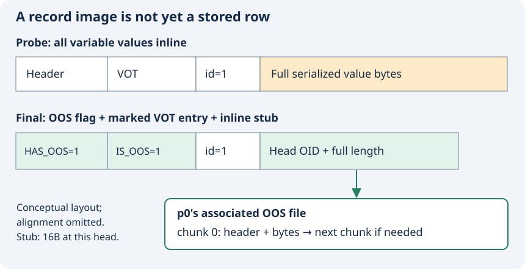
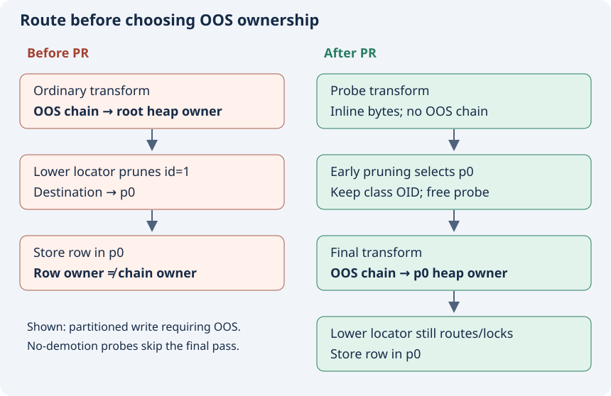

# 2. Why correct SELECT results can conceal wrong ownership

## A row can refer to a value stored elsewhere

OOS means Out-of-row Overflow Storage. Instead of keeping an eligible serialized value entirely inside a heap record, the engine stores that value in an OOS file and keeps an inline stub in the heap record. In this pinned revision the stub contains a head OOS OID and the full serialized value length. The OID leads to the first chunk; a value too large for one chunk uses a linked value chain. [C-009]

The record has two levels of marking. A record-level OOS flag says at least one attribute is represented out of row. A variable-offset-table entry marks the individual attribute that contains a stub. The VOT tells a reader where variable attributes begin; it is not itself the payload. The writer sets the attribute flag and writes the OID/length pair for a selected plan entry. [C-009]

The diagram omits alignment and exact header widths. It shows the key relationship: an OOS-backed row remains a heap record, while its large attribute bytes live in a separate file. Ordinary whole-record overflow (`REC_BIGONE`) is a distinct mechanism; the transformer rejects a record that would need both OOS and bigone in this revision. [C-009] [C-010]

## The ownership invariant

The heap header has an `oos_vfid` field. Given an owner class, `heap_oos_insert_serialized_values` obtains its HFID, finds or creates that heap's OOS file, and inserts the serialized requests there. Consequently the choice of class OID determines the owner heap of the new OOS chains. [C-001]

| Heap | Contains our row? | OOS file for this example? |
|---|---|---|
| Root | No | No |
| p0 | Yes | Yes: contains the chain referenced by that row |
| p1 | No | No |

“Same owner” does not mean “same file.” The p0 heap file and its OOS file remain separate files. Their association is recorded in p0's heap header. [C-001] [C-003]

## Follow the old sequence

Before the PR, `locator_attribute_info_force` built the record through an ordinary transform before calling the lower insert/update locator. The transform selected OOS values and inserted them using `attr_info->class_oid`. The lower locator subsequently pruned to the destination child and stored the record there. For a root-targeted INSERT that means the chain can be created under the root heap before the row is routed to p0. [C-002]

The head OOS OID can still point to readable bytes. The attribute reader parses that OID and calls `oos_read` directly; it does not first derive the chain's address from the row's heap header. This explains how a logical equality query can succeed even when the heap-level ownership relation is wrong. It is an inference from the two paths, corroborated by the earlier report's recorded result, not a new reproduction of the old binary. [C-011]

Vacuum's dependency is different: cleanup consults the heap's OOS VFID. An incorrect association can remain hidden during SELECT and emerge during reclamation. The added test deliberately checks ownership as well as value equality. [C-012] [C-003]

## Read executable conditions, not only comments

The historical issue says a missing OOS VFID led to temporary abort instrumentation. At the pinned head, `heap_oos_find_vfid(..., false)` returns success with a null VFID when no OOS file exists. `vacuum_oos_find_vfid_for_heap_record` returns early on that success; its abort is reached on the lookup-failure branch. Therefore “a null VFID always triggers this exact abort at this head” is not supported by the current condition. The wrong ownership remains the PR's problem, but the historical crash narrative must not be substituted for the current control flow. [C-012]

An error-message string and a nearby comment cannot prove the branch that executes. A current-server experiment with a deliberately inconsistent record would be needed to establish the full downstream failure path; we have not manufactured corruption for this book. [C-013]

## Two timelines also differ in storage policy

The OOS normative context specifies a four-record physical-capacity target, 4,060 bytes for its described 16KB layout. The pinned PR source still compares against `DB_PAGESIZE / 4`. That is an implementation conformance gap relative to the loaded specification. We teach the literal comparison when walking this code. The 64-byte `FORCE_OUTLINE` regression does not depend on settling that threshold difference. [C-014]

## Predict before continuing

1. Why is a value-equality SELECT insufficient as the only regression assertion?
2. Where must the OOS file identifier be found for a row stored in p0?
3. What evidence is needed before saying a missing VFID must abort at this revision?
4. Distinguish a heap record, an OOS chunk record and an OOS value chain.
