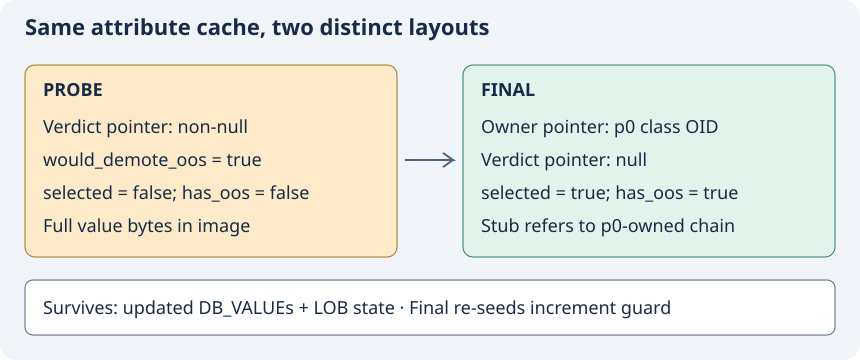

# 4. How suppression and exactly-once effects work

## A hypothetical layout is different from a chosen layout

`heap_attrinfo_determine_disk_layout` computes serialized column sizes, payload size, variable-offset width and header size. It begins with `*has_oos=false` and clears a provided verdict. A fresh `oos_plan` has no selected columns. These initial conditions prevent a probe from inheriting selection from a previous transformation. [C-020]

The forced-outline loop runs before the ordinary record-size gate. An eligible forced candidate is variable, not null, and larger than `OR_OOS_INLINE_SIZE`. In normal mode the loop selects it, subtracts its inline size, adds the stub size and sets `has_oos`. In suppressed mode the added block sets the verdict and executes `continue`, bypassing all those changes. [C-021]

The `continue` is essential. Merely reporting true and falling through would still select the column and later write its chain. The verdict answers “would this need OOS?”; `has_oos` answers “does this constructed layout actually contain OOS?” A probe can have the first true and the second false. [C-021]

For ordinary candidates the planner checks the size gate, collects eligible columns and checks suppression. If candidates exist it sets the verdict. It returns the full inline size immediately, before sorting and selection. If the list is empty it leaves any verdict already set by the forced loop intact. Normal mode sorts by storage preference and size, demotes until the target is reached or candidates run out, then recomputes header size. [C-020]

The diagram shows the successful forced-outline example: the probe changes preparation state but leaves OOS selection empty; the final pass selects a value and writes its chain under p0. Its record-level flag is set when the header is serialized. [C-021] [C-022]

## Why the second commit matters

The first PR commit added suppression at the ordinary candidate path. The second added suppression inside the earlier forced-outline loop. A small forced value can bypass the size gate altogether. Without the second fix, that loop can create OOS selection even in a supposed probe and fail to request the final pass. The 64-byte regression targets precisely this ordering. [C-023]

## Internal transform sequence

MVCC means multi-version concurrency control: readers can see the appropriate version of a row for their snapshot while another transaction changes it. The record header can carry insert/delete IDs and a link to an older version through the log. Here those fields matter because layout calculation reserves enough space for header evolution. A representation ID is different: it identifies the schema layout needed to interpret a record's bytes. [C-009] [C-019] [C-022]

The internal transform rejects an uninitialized attribute structure, optionally seeds the increment set, and fills unset values from the old record or defaults. It determines MVCC treatment from the attribute class, computes layout and reserves header growth space. It rejects unsupported OOS-plus-bigone before chain insertion. Only `has_oos=true` reaches `heap_attrinfo_insert_to_oos`. [C-010] [C-022]

The insertion helper serializes selected payloads, builds requests pointing to each plan entry's OID output, and delegates to `heap_oos_insert_serialized_values`. The changed conditional expression chooses the owner override if supplied, otherwise the original attribute class. After insertion, the record writer uses resulting plan OIDs to emit stubs. [C-001] [C-022]

The buffer-writing loop grows the buffer by `DB_PAGESIZE` when header or column writing returns `S_DOESNT_FIT`. OOS insertion is outside this retry loop, so buffer growth does not itself reinsert chains. The increment set also outlives individual attempts within that transform. Success records the actual record length. [C-022]

## INCR and DECR: state crosses two boundaries

The fixed-attribute writer checks `do_increment` and whether the current attribute index is in `incremented_attrids`. If needed it calls `qdata_increment_dbval`, modifying the `DB_VALUE`, then inserts the index into the set. This already prevents a buffer retry from incrementing again. [C-024]

Separate transforms have separate local sets. After a successful probe the updated `DB_VALUE` survives in `attr_info`, but the probe's set does not. The final wrapper passes `increments_already_applied=true`. The internal function seeds the new set with every index whose `do_increment` is nonzero. The unchanged fixed writer then skips the second increment. Despite the set's name, entries are array indices `i`, not necessarily schema attribute IDs. [C-024]

Example: a fixed value starts at 7 and carries an increment of 1. The probe produces 8. A buffer retry still writes 8. The final transform must also write 8. If the final wrapper passed false, a fresh empty set could produce 9. Calling the final wrapper first would pre-mark work that had never been done. [C-024]

## LOB copy: an existing state marker does the work

A BLOB/CLOB value contains an external-storage locator. OOS demotion concerns serialized locator bytes; it does not imply moving the external LOB payload into an OOS chain. Both the inline writer and OOS serializer gate LOB copying on `LOB_FLAG_INCLUDE_LOB` and `HEAP_WRITTEN_ATTRVALUE`. After preparing the copy they change state to `HEAP_WRITTEN_LOB_ATTRVALUE` and replace the DB_VALUE with the destination locator. [C-025]

The probe follows the inline writer and performs that transition. The final pass sees the changed state and skips copying again. The mechanism already existed for retries and now works across passes because attribute state survives. OOS suppression therefore does not mean “pure function.” LOB path metadata still uses the attribute class; the override specifically changes OOS-file ownership, not all class-dependent behavior. [C-025]

## Predict before continuing

1. For the small forced value, state probe verdict, `has_oos` and plan selection.
2. Which changes execute accidentally if `continue` is removed?
3. Distinguish an intra-transform retry from a second transform for increments.
4. Which object retains the LOB state marker across passes?
5. Why put OOS insertion outside the serialization retry loop?
