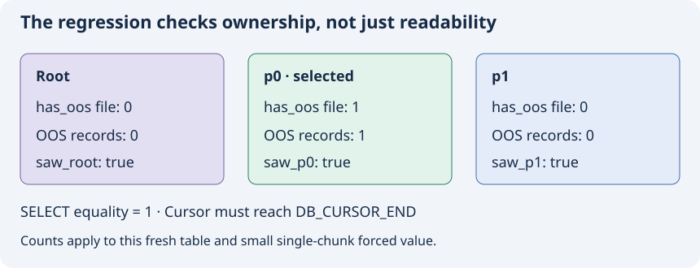

# 7. Read the regression as a specification

The added test is `OosSqlShow.PartitionedForceOutlineStoresOosInPrunedHeap`. Although the directory-level guidance describes many Catch2 tests, this particular target links `GTest::gtest` and uses `TEST_F`, `ASSERT_*` and `EXPECT_*`. Its SQL test environment links `cubridsa` and opens `unittestdb` in process under SA_MODE. Read the target's own CMake and test helper to determine its execution model. [C-030]

## What each phase establishes

The fixture first drops any previous test tables and commits. The new test creates a two-child range table with forced-outline storage and inserts the small binary value. `ASSERT_GE(rc,0)` accepts successful SQL statuses or affected-row counts; it is not a comparison against only `NO_ERROR`. The test commits before querying. The commit's return is not separately asserted in this test. [C-003]

The equality SELECT must return 1. That checks logical bytes, but cannot distinguish right-owner storage from an otherwise readable wrong-owner chain. The next query, `SHOW ALL HEAP OOS`, supplies the physical ownership check. Its helper has already moved to the first tuple, which is why the loop is `do ... while` rather than fetching a new tuple first. [C-003]

For each diagnostic row, the test reads the table name, file-existence flag and OOS record count. It removes a schema qualifier from the name before matching the root and generated child names. `saw_root`, `saw_p0` and `saw_p1` prevent a missing result row from accidentally passing the assertions. The expected values are root 0/0, p0 1/1, p1 0/0. [C-003]

`num_recs` counts OOS chunk records, not SQL rows in general. A large value could span multiple chunks. The one-record expectation is meaningful for this small value. The loop expects `DB_CURSOR_END`; another cursor failure is not accepted as completion. `db_query_end` releases the result on the normal path. Fatal assertions may return early from the test, so do not treat the success cleanup as a proof of all assertion-failure cleanup. [C-003]



The diagram presents expected state for this isolated example. A test that checks only p0's positive value would miss some duplicate-write errors; checking root and p1 for absence helps distinguish the intended owner. The three presence booleans additionally guard the diagnostic output shape. [C-003]

## Fresh observation in this book

On 2026-09-08, `scripts/run-regression.py` created a new private database registry and private copy of the installed configuration under `/tmp/pr7600-teaching-*`. It ran the existing setup fixture and then the existing binary with this filter:

```text
test_oos_sql_show --gtest_filter=OosSqlShow.PartitionedForceOutlineStoresOosInPrunedHeap
```

The selected test passed: **1 test, 0 failures**. Its equality and three ownership branches completed successfully. The standalone engine shut down cleanly. The full command arguments, output, environment paths and SHA-256 of the pre-existing binary are in `evidence/regression.json`. This session did not rebuild that binary; its passing behavior is a runtime observation of the recorded binary, while source claims use the pinned Git head. [C-031]

The script retains its owned database and configuration for inspection, starts no server daemon and never targets the shared `unittestdb` registry. The existing test fixture drops its own test tables on teardown. No CUBRID source instrumentation was added. The retained sandbox path and cleanup status are in the evidence file. A rerun allocates a fresh temporary environment. [C-031]

## What remains unproved

| Question | Evidence we have | Additional discriminating experiment |
|---|---|---|
| Is the INSERT owner correct for this forced value? | Added test source and fresh passing binary | Covered for this input |
| Does UPDATE move chains to another child? | Source routing trace | Update partition key, inspect all heap OOS rows and value equality |
| Are increments applied once in two passes? | Writer guard and final-pass pre-seeding | Partitioned OOS UPDATE with a supported increment assignment |
| Is a LOB copied once? | Shared state guard in both writers | Observe locator creation/count across a two-pass write and retry |
| Do REPLACE/ODKU leave no probe chains? | Suppressed call sites | Dedicated duplicate-hit/miss cases with ownership and chunk counts |
| Does server vacuum reclaim correctly? | Correct owner prerequisite and bounded cleanup trace | SERVER_MODE committed delete with eventual reclamation checks |
| What happens on crash or allocation failure? | Error/order source trace | Isolated fault injection with transaction and restart observations |

These are coverage limits [C-032], not assertions that the implementation fails. The earlier report records broader tests and a 999-row workload; those results were not rerun here. Its backup step failed because of a name collision and must not be cited as successful backup/restart verification.

## Exercises

1. Remove the `saw_p1` check mentally. What missing-output mistake could become invisible?
2. Why use a forced value below the normal threshold?
3. Why is one OOS record not a universal expectation for one SQL row?
4. Design an UPDATE experiment whose observations would distinguish “readable value” from “correct new owner.”
