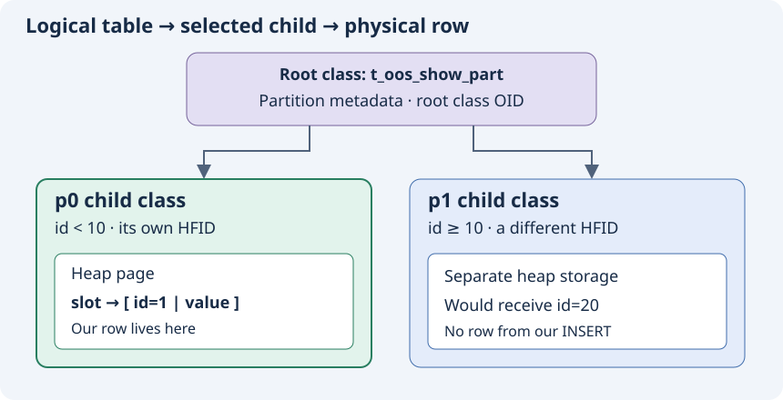

# PR 7600 teaching book

Head `b871ea386d2c5419b7abae07dda58b9b7f36377a`; base `2940b1cfbc3c2d4d0fac3f9244a960350debd380`.

Read the numbered chapters in order. See README.md for build and verification instructions.

# 1. From a SQL table to a stored record

PR #7600 makes a large value belong to the same partition heap as the row that refers to it. To understand why that requires two transformations, first distinguish a SQL name, a storage file, and a record buffer. [C-001] [C-002]

## What this book covers

We follow the six-file PR diff from base `2940b1cfbc3c2d4d0fac3f9244a960350debd380` to head `b871ea386d2c5419b7abae07dda58b9b7f36377a`. The source worktree is `/home/vimkim/gh/cb/CBRD-27089-has-oos-but-no-oos`; the six changed files match that head. Unrelated local work is excluded. The scope is partition write preparation, its immediate dependencies and the regression; it does not certify the entire OOS subsystem. [C-029]

Read chapters 1–5 for the mental model, then chapter 6 for all 30 hunks. Chapters 7–8 develop test reasoning and review exercises. Chapter 9 holds answers and chapter 10 the evidence ledger. Claim links such as [C-001] jump to exact source references. Source links are supplementary; the lessons, code listings and SVGs work offline.

## A concrete table

```sql
CREATE TABLE t_oos_show_part (
  id INT,
  data_col BIT VARYING STORAGE FORCE_OUTLINE
)
PARTITION BY RANGE (id) (
  PARTITION p0 VALUES LESS THAN (10),
  PARTITION p1 VALUES LESS THAN MAXVALUE
);
INSERT INTO t_oos_show_part VALUES (1, REPEAT(X'EE', 64));
```

This is the table and input used by the added regression. The first partition accepts values below 10; the second accepts values from 10 upward. Our `id=1` row belongs to p0. The example deliberately uses a small value with a forced storage policy, so it exercises the path that ordinary large-row tests can miss. `REPEAT(X'EE',64)` constructs 64 repeated bytes; the serialized attribute may also carry type-specific overhead. [C-003]

The local manual describes partitions as independent physical units implemented as subclasses of the partitioned table. Its range-partition section specifies exclusive upper bounds and `MAXVALUE`. That explains SQL routing; source code establishes how the selected class maps to its heap. Manual provenance is recorded in the source map. [C-004]

## Heap means row storage here

A heap file holds table records in pages. A page is a fixed-sized unit managed by the storage layer. Within a slotted page, a slot directory identifies individual records: a slot points to a record's location and length within that page. This lets page contents be organized without requiring a table's rows to appear in primary-key order. A B-tree index provides a different structure for key-based access. Here, “heap” names database storage; it is separate from a C++ process's allocation heap. [C-005]

The SQL table is represented internally as a class. A partitioned root class describes the logical table and its partitions. Child classes represent p0 and p1 and each supplies a heap identifier. In the traced UPDATE implementation the root holds no row data; an existing row comes from a child. “The partition heap” means the heap belonging to that selected child class. It does not introduce a new slotted-page format. [C-004] [C-006]



In the diagram, p0 owns the page containing our row; p1 is a different possible destination. A SQL query using the root name can access child data through partition-aware execution. Do not interpret the root box as one physical page containing both child heaps. [C-006]

## Five identifiers and two record representations

| Name | What it identifies | How it matters in this PR |
|---|---|---|
| OID | An object address, with volume, page and slot components | A row OID identifies a row; a class OID identifies a class object. Same type, different referent. |
| Class OID | The OID of a class | The selected child's class OID is passed as the OOS owner. |
| VPID | A volume/page address | Locates a physical page. |
| VFID | A volume/file identifier | Identifies a database file, not a filesystem pathname. |
| HFID | A heap VFID plus its header page ID | Leads to the heap header and its OOS VFID. |
| `HEAP_CACHE_ATTRINFO` | In-memory attribute values and representation metadata | Survives both passes and carries their state. |
| `RECDES` | A byte buffer descriptor: data, length, allocated area, record type | A probe can be valid serialized bytes without yet being a stored row. |

These types connect identity to storage. An HFID is not the class OID; the code must look up a class's HFID. An OOS value also has an OID, but that OID refers to an OOS chunk record rather than the table row. [C-005] [C-007]

`DB_VALUE` represents a logical typed value in memory. Transformation serializes values into the byte layout expected by the engine. `record_descriptor` helps manage a buffer while `RECDES` describes its bytes. `LC_COPYAREA` supplies memory returned to the locator caller. These are stages in preparing data, not evidence that the row has already been inserted. [C-007] [C-008]

## Predict before continuing

1. Where does `id=10` belong? Which destination changes if `id=1` becomes `id=20`?
2. Why can a function receive both a class OID and an HFID?
3. Does a successful transformation imply there is already a heap row?
4. Draw the root, p0, p1 and the stored row without looking at the diagram.

Answers are in chapter 9. Continue when you can distinguish class identity, file identity and record bytes.


# 2. Why correct SELECT results can conceal wrong ownership

## A row can refer to a value stored elsewhere

OOS means Out-of-row Overflow Storage. Instead of keeping an eligible serialized value entirely inside a heap record, the engine stores that value in an OOS file and keeps an inline stub in the heap record. In this pinned revision the stub contains a head OOS OID and the full serialized value length. The OID leads to the first chunk; a value too large for one chunk uses a linked value chain. [C-009]

The record has two levels of marking. A record-level OOS flag says at least one attribute is represented out of row. A variable-offset-table entry marks the individual attribute that contains a stub. The VOT tells a reader where variable attributes begin; it is not itself the payload. The writer sets the attribute flag and writes the OID/length pair for a selected plan entry. [C-009]


The diagram omits alignment and exact header widths. It shows the key relationship: an OOS-backed row remains a heap record, while its large attribute bytes live in a separate file. Ordinary whole-record overflow (`REC_BIGONE`) is a distinct mechanism; the transformer rejects a record that would need both OOS and bigone in this revision. [C-009] [C-010]

## The ownership invariant

The heap header has an `oos_vfid` field. Given an owner class, `heap_oos_insert_serialized_values` obtains its HFID, finds or creates that heap's OOS file, and inserts the serialized requests there. Consequently the choice of class OID determines the owner heap of the new OOS chains. [C-001]

| Heap | Contains our row? | OOS file for this example? |
|---|---|---|
| Root | No | No |
| p0 | Yes | Yes: contains the chain referenced by that row |
| p1 | No | No |

“Same owner” does not mean “same file.” The p0 heap file and its OOS file remain separate files. Their association is recorded in p0's heap header. [C-001] [C-003]

## Follow the old sequence

Before the PR, `locator_attribute_info_force` built the record through an ordinary transform before calling the lower insert/update locator. The transform selected OOS values and inserted them using `attr_info->class_oid`. The lower locator subsequently pruned to the destination child and stored the record there. For a root-targeted INSERT that means the chain can be created under the root heap before the row is routed to p0. [C-002]


The head OOS OID can still point to readable bytes. The attribute reader parses that OID and calls `oos_read` directly; it does not first derive the chain's address from the row's heap header. This explains how a logical equality query can succeed even when the heap-level ownership relation is wrong. It is an inference from the two paths, corroborated by the earlier report's recorded result, not a new reproduction of the old binary. [C-011]

Vacuum's dependency is different: cleanup consults the heap's OOS VFID. An incorrect association can remain hidden during SELECT and emerge during reclamation. The added test deliberately checks ownership as well as value equality. [C-012] [C-003]

## Read executable conditions, not only comments

The historical issue says a missing OOS VFID led to temporary abort instrumentation. At the pinned head, `heap_oos_find_vfid(..., false)` returns success with a null VFID when no OOS file exists. `vacuum_oos_find_vfid_for_heap_record` returns early on that success; its abort is reached on the lookup-failure branch. Therefore “a null VFID always triggers this exact abort at this head” is not supported by the current condition. The wrong ownership remains the PR's problem, but the historical crash narrative must not be substituted for the current control flow. [C-012]

An error-message string and a nearby comment cannot prove the branch that executes. A current-server experiment with a deliberately inconsistent record would be needed to establish the full downstream failure path; we have not manufactured corruption for this book. [C-013]

## Two timelines also differ in storage policy

The OOS normative context specifies a four-record physical-capacity target, 4,060 bytes for its described 16KB layout. The pinned PR source still compares against `DB_PAGESIZE / 4`. That is an implementation conformance gap relative to the loaded specification. We teach the literal comparison when walking this code. The 64-byte `FORCE_OUTLINE` regression does not depend on settling that threshold difference. [C-014]

## Predict before continuing

1. Why is a value-equality SELECT insufficient as the only regression assertion?
2. Where must the OOS file identifier be found for a row stored in p0?
3. What evidence is needed before saying a missing VFID must abort at this revision?
4. Distinguish a heap record, an OOS chunk record and an OOS value chain.


# 3. Build a probe, choose the partition, then store the value

Transformation has two jobs that used to run together: produce bytes usable by downstream code, and create the out-of-row values referenced by those bytes. Partition selection needs the first job before the destination is known. The PR introduces a mode that prepares a fully-inline record while reporting whether an ordinary transform would choose OOS. [C-015]

## Trace the example from SQL execution

The SQL executor evaluates values into attribute information and calls `locator_attribute_info_force` for the write. For INSERT, `old_recdes` is null. For UPDATE, the function first obtains the old row representation and deliberately falls through to the shared transformation code. The `[[fallthrough]]` explains why code under the INSERT case labels also handles UPDATE. [C-016]

With a partitioned operation, the new branch does the following:

1. Initialize `would_demote_oos=false` and pass its address to the allocator. The address selects suppression mode. The initial false value is not what enables suppression.
2. Build a fully-inline probe. For our forced-outline value, the planner reports true but leaves the plan unselected and `has_oos=false`.
3. If the copy area exists and demotion is needed, initialize output identifiers and call insert or update pruning with the probe bytes.
4. Free the probe copy area, clear its pointer and descriptor fields, and check the pruning error.
5. On success, build the final image with `&pruned_class_oid` and a null probe output. OOS creation now uses p0 as owner.
6. Continue into the existing `locator_insert_force` or `locator_update_force` path, then release the final copy area. [C-016]

## A second pruning still happens

The new early pruning does not replace the lower locator's existing pruning. The lower insert locator prunes again, selects the appropriate scan cache, obtains the subclass lock and forms a heap insert context from the final class/HFID. It then calls `heap_insert_logical`. The UPDATE path may call `locator_move_record` if the final destination differs from the row's current class. [C-017]

The early outputs `pruned_hfid` and `superclass_oid` satisfy the pruning API; the final transform specifically consumes `pruned_class_oid`. The PR does not overwrite the outer class/HFID with these early outputs. The lower locator continues to own actual write routing, locking and representation adjustment. [C-016] [C-017]

A useful invariant is agreement between early and final routing. Both operate on the same logical values, even though the final bytes can contain stubs. The partition reader uses the attribute layer to obtain a logical key. Probe increments have already been applied before early routing, and final serialization avoids applying them again. These facts support agreement; exhaustive agreement under every concurrent schema change is beyond the single regression. [C-018]

## What pruning actually reads

`partition_find_partition_for_record` initializes an attribute cache for the partition key, temporarily changes the record's representation ID to the root representation, reads key values and restores the original ID. It evaluates the partition expression, searches matching partitions and requires exactly one match. It copies the chosen class OID and HFID to outputs. If the class changed, it adjusts the record representation ID to the child's representation. [C-019]

Existing partition code can therefore consume the probe before storage. The final image still needs lower-level routing because the early probe whose representation was adjusted is freed. [C-019] [C-016]

## The mode table is the API

| Call | Owner override | Verdict pointer | Increments already applied | Result |
|---|---|---|---|---|
| Ordinary | Null | Null | False | Normal policy; owner from attribute info |
| Probe | Null | Non-null | False | Inline image; report demotion; apply attribute effects |
| Final owner | Selected class | Null | True | Normal policy; selected owner; skip repeated increments |
| Except-LOB | Null | Null | False | Ordinary policy with existing excluded-LOB behavior |

At the allocator boundary dispatch order is probe pointer first, owner pointer second, then LOB mode. If both pointers were non-null, probe wins. Intended changed callers pass only the meaningful pointer. The public probe wrapper does not assert a non-null verdict pointer: passing null would fail to select suppression internally. The final wrapper assumes a successful probe on the same attribute state. These are caller obligations, not compiler-enforced mode types. [C-008] [C-015]

## Paths that do less work

For a nonpartitioned class both pointers are null and the previous ordinary transform is selected. For a partitioned record whose probe reports no demotion, the probe copy area is retained and passed into the ordinary lower locator. There is no second transform; normal routing still occurs downstream. An oversized record with no eligible OOS attribute can also report no demotion—record size alone is not the verdict. [C-016] [C-020]

## Prediction questions

1. How many transforms and pruning calls occur for our forced-outline INSERT?
2. What happens when a partitioned probe returns false?
3. Why free the probe before constructing the final image?
4. If an UPDATE changes `id=1` to `id=20`, which heap should receive the new chain?
5. Why would passing null as the probe verdict pointer be dangerous?


# 4. How suppression and exactly-once effects work

## A hypothetical layout is different from a chosen layout

`heap_attrinfo_determine_disk_layout` computes serialized column sizes, payload size, variable-offset width and header size. It begins with `*has_oos=false` and clears a provided verdict. A fresh `oos_plan` has no selected columns. These initial conditions prevent a probe from inheriting selection from a previous transformation. [C-020]

The forced-outline loop runs before the ordinary record-size gate. An eligible forced candidate is variable, not null, and larger than `OR_OOS_INLINE_SIZE`. In normal mode the loop selects it, subtracts its inline size, adds the stub size and sets `has_oos`. In suppressed mode the added block sets the verdict and executes `continue`, bypassing all those changes. [C-021]

The `continue` is essential. Merely reporting true and falling through would still select the column and later write its chain. The verdict answers “would this need OOS?”; `has_oos` answers “does this constructed layout actually contain OOS?” A probe can have the first true and the second false. [C-021]

For ordinary candidates the planner checks the size gate, collects eligible columns and checks suppression. If candidates exist it sets the verdict. It returns the full inline size immediately, before sorting and selection. If the list is empty it leaves any verdict already set by the forced loop intact. Normal mode sorts by storage preference and size, demotes until the target is reached or candidates run out, then recomputes header size. [C-020]


The diagram shows the successful forced-outline example: the probe changes preparation state but leaves OOS selection empty; the final pass selects a value and writes its chain under p0. Its record-level flag is set when the header is serialized. [C-021] [C-022]

## Why the second commit matters

The first PR commit added suppression at the ordinary candidate path. The second added suppression inside the earlier forced-outline loop. A small forced value can bypass the size gate altogether. Without the second fix, that loop can create OOS selection even in a supposed probe and fail to request the final pass. The 64-byte regression targets precisely this ordering. [C-023]

## Internal transform sequence

MVCC means multi-version concurrency control: readers can see the appropriate version of a row for their snapshot while another transaction changes it. The record header can carry insert/delete IDs and a link to an older version through the log. Here those fields matter because layout calculation reserves enough space for header evolution. A representation ID is different: it identifies the schema layout needed to interpret a record's bytes. [C-009] [C-019] [C-022]

The internal transform rejects an uninitialized attribute structure, optionally seeds the increment set, and fills unset values from the old record or defaults. It determines MVCC treatment from the attribute class, computes layout and reserves header growth space. It rejects unsupported OOS-plus-bigone before chain insertion. Only `has_oos=true` reaches `heap_attrinfo_insert_to_oos`. [C-010] [C-022]

The insertion helper serializes selected payloads, builds requests pointing to each plan entry's OID output, and delegates to `heap_oos_insert_serialized_values`. The changed conditional expression chooses the owner override if supplied, otherwise the original attribute class. After insertion, the record writer uses resulting plan OIDs to emit stubs. [C-001] [C-022]

The buffer-writing loop grows the buffer by `DB_PAGESIZE` when header or column writing returns `S_DOESNT_FIT`. OOS insertion is outside this retry loop, so buffer growth does not itself reinsert chains. The increment set also outlives individual attempts within that transform. Success records the actual record length. [C-022]

## INCR and DECR: state crosses two boundaries

The fixed-attribute writer checks `do_increment` and whether the current attribute index is in `incremented_attrids`. If needed it calls `qdata_increment_dbval`, modifying the `DB_VALUE`, then inserts the index into the set. This already prevents a buffer retry from incrementing again. [C-024]

Separate transforms have separate local sets. After a successful probe the updated `DB_VALUE` survives in `attr_info`, but the probe's set does not. The final wrapper passes `increments_already_applied=true`. The internal function seeds the new set with every index whose `do_increment` is nonzero. The unchanged fixed writer then skips the second increment. Despite the set's name, entries are array indices `i`, not necessarily schema attribute IDs. [C-024]

Example: a fixed value starts at 7 and carries an increment of 1. The probe produces 8. A buffer retry still writes 8. The final transform must also write 8. If the final wrapper passed false, a fresh empty set could produce 9. Calling the final wrapper first would pre-mark work that had never been done. [C-024]

## LOB copy: an existing state marker does the work

A BLOB/CLOB value contains an external-storage locator. OOS demotion concerns serialized locator bytes; it does not imply moving the external LOB payload into an OOS chain. Both the inline writer and OOS serializer gate LOB copying on `LOB_FLAG_INCLUDE_LOB` and `HEAP_WRITTEN_ATTRVALUE`. After preparing the copy they change state to `HEAP_WRITTEN_LOB_ATTRVALUE` and replace the DB_VALUE with the destination locator. [C-025]

The probe follows the inline writer and performs that transition. The final pass sees the changed state and skips copying again. The mechanism already existed for retries and now works across passes because attribute state survives. OOS suppression therefore does not mean “pure function.” LOB path metadata still uses the attribute class; the override specifically changes OOS-file ownership, not all class-dependent behavior. [C-025]

## Predict before continuing

1. For the small forced value, state probe verdict, `has_oos` and plan selection.
2. Which changes execute accidentally if `continue` is removed?
3. Distinguish an intra-transform retry from a second transform for increments.
4. Which object retains the LOB state marker across passes?
5. Why put OOS insertion outside the serialization retry loop?


# 5. Duplicate probes, errors and lifetime

## A temporary image can cause a permanent mistake

REPLACE first needs to find conflicting unique keys so existing rows can be removed. ODKU (`INSERT ... ON DUPLICATE KEY UPDATE`) needs to find the row that would conflict before choosing its update behavior. Both paths construct a candidate record for key extraction. That candidate image is not itself the row finally inserted. [C-026]

The PR adds a local boolean and passes its address to the allocator in both helpers. Neither helper needs the resulting true/false verdict: the pointer's presence selects OOS suppression. This prevents the discarded key-probe image from creating an unowned chain. REPLACE preserves `LOB_FLAG_EXCLUDE_LOB`; ODKU preserves `LOB_FLAG_INCLUDE_LOB`. Suppression changes OOS publication, not the existing LOB policy. [C-026]

The rest of each helper still does real work. REPLACE loops over unique indexes, extracts keys, prunes index targets, calls `xbtree_find_unique`, and deletes conflicting rows when found. ODKU searches for a duplicate, records its OID and can select its partition scan cache. Calling the entire helper “side-effect free” would therefore be wrong. Only the temporary transformation's OOS creation is suppressed. [C-026]

## Three different lifetimes

| Object | Owner and lifetime | End of lifetime |
|---|---|---|
| Probe/final `LC_COPYAREA` | Locator preparation owns transient bytes | Freed after pruning or after lower write call |
| `attr_info` DB_VALUEs and state | Caller-provided attribute cache survives both passes | Released by its surrounding operation; not by freeing a copy area |
| OOS value chains | Persistent records associated with the selected heap | Managed by transaction/recovery and reclamation paths, not `locator_free_copy_area` |

The distinction is essential on errors. Freeing a copy area releases a memory buffer; it does not undo previously published database records. Before the final pass, suppression prevents OOS chains from being created for the probe. Once the final pass writes chains, a later failure must use the existing transaction/error machinery. [C-008] [C-016] [C-027]

## Follow each failure exit

| Failure | Immediate action visible in the traced code | What the caller must understand |
|---|---|---|
| First copy-area allocation fails | Allocator returns null | No transform ran |
| Probe transform fails | Allocator frees its copy area and returns null | Attribute preparation may already have changed state; caller reports failure |
| Early partition pruning fails | Locator frees probe, clears pointer/area, breaks with pruning error | No final OOS pass runs |
| Final transform fails | Allocator returns null; locator sets `ER_FAILED` | OOS work may have begun; memory cleanup is not rollback |
| Unsupported OOS-plus-bigone layout | Internal transform sets error and returns before insertion | No chain is written by this transformation |
| Buffer too small | Internal loop enlarges and retries writing | Increment set and LOB markers prevent repeated successful effects |
| Lower insert/update fails | Error is propagated, final copy area is freed | Existing statement/transaction recovery obligations remain |

These are source control-flow facts, not a claim that every allocation failure was injected. One adjacent pre-existing path merits caution: after `release_buffer`, the allocator frees its original copy area and allocates a larger one; if that allocation fails, the shown return occurs before the explicit `free(allocated_data)`. We do not certify all allocation cleanup in this dependency. The book's scope is the PR ordering change. [C-008] [C-027]

## Locks, persistence and ownership

A transaction groups database work that can commit or roll back. Write-ahead logging records changes needed for recovery; a successful memory allocation has no equivalent durability meaning. A lock coordinates logical access between transactions, while a page latch protects a brief physical page operation. The PR changes the order of preparation and routing within that existing machinery. [C-017] [C-027]

The new early phase selects a destination; it does not introduce a new locking protocol. The lower locator retains subclass locks, scan-cache selection and actual row operations. Any change to skip its second pruning would need to preserve those responsibilities and the representation-ID handling. The PR is also not a new commit boundary: successful OOS insertion is not equivalent to a committed SQL row. [C-017] [C-027]

One unchanged lower layer makes the persistence distinction concrete. If `heap_oos_find_vfid` must create a file, it starts a system operation, creates the OOS file, applies the class encryption policy, logs the heap-header update, marks the page dirty and completes the system operation. Errors abort that system operation and return failure. This file-creation operation is not the SQL transaction's final commit, and the PR adds no replacement for it. [C-034]

For MVCC, old row versions can still be visible to older transactions. Their out-of-row values cannot be reclaimed merely because the current SQL UPDATE has constructed new values. The unchanged eager-cleanup helper describes a separate non-MVCC path and compares old/new references. Full vacuum retry safety, chain identity and crash recovery are neighboring OOS concerns, not solved by choosing the correct partition owner. [C-027]

## Costs and observable behavior

Partitioned OOS writes now serialize a fully-inline probe and a compact final image, and prune early as well as through the ordinary lower path. The probe can be much larger than the stored record. This introduces extra CPU and transient memory work proportional to the logical values being serialized. No latency or peak-memory benchmark is reported here. Nonpartitioned writes retain the ordinary path, and no-demotion partition writes reuse their single probe image. [C-028]

`SHOW ALL HEAP OOS` is useful because it reports separate root/child rows and per-file counts. Its `has_oos` diagnostic column means the heap has an OOS file; it must not be confused with a record's `HAS_OOS` flag. An empty-but-existing OOS file can still have a true file-existence indicator. This regression starts from a clean table, so zero file indicators have a precise meaning. [C-003]

Security: no new SQL authorization interface, parser rule or client protocol is introduced by these six files' diff. Existing locks and class lookup remain dependencies. This observation is limited to the patch; it is not an audit of all OOS access control or encryption. Network/restart experiments are not applicable to the fresh standalone observation, which opens an owned local database in process. [C-029]

## Prediction questions

1. Why does a duplicate-key helper pass a verdict pointer and never read the verdict?
2. What survives when the probe copy area is freed?
3. Why does freeing the final buffer not undo its OOS writes?
4. What responsibilities would be lost if you simply removed the lower locator's pruning block?
5. Which cost would you measure for a multi-megabyte value even if the final heap record is small?


# 6. Every changed line, in its source context

This chapter covers all 30 default-context Git hunks. Read chapters 1–5 first, then use this appendix to connect every addition and deletion to the mechanism. The complete original diff is preserved in `evidence/pr-7600.patch`. Blank lines and brace-only changes are shown along with executable statements.

Each listing shows **old line | new line | diff sign | source text**. A dash means that side has no line. `+` is added at the head, `-` is deleted from the base, and a blank sign is unchanged context. Source text is preserved apart from display tab expansion. Hunk headers come from Git and may name a preceding symbol; the commentary identifies the actual affected function.

For each hunk: identify inputs, follow the described state changes, then explain what its omission would affect. Structural signature/include hunks make the changed code callable; they need not each produce an independent runtime effect.

## Coverage index

| Hunk | File | Old lines | New lines | Lesson |
|---|---|---|---|---|
| [H01](#h01) | `src/query/query_executor.c` | 11937–11942 | 11937–11943 | REPLACE allocates a mode selector |
| [H02](#h02) | `src/query/query_executor.c` | 11951–11957 | 11952–11962 | REPLACE suppresses discarded-image OOS writes |
| [H03](#h03) | `src/query/query_executor.c` | 12170–12175 | 12175–12181 | ODKU allocates its mode selector |
| [H04](#h04) | `src/query/query_executor.c` | 12189–12195 | 12195–12205 | ODKU obtains an inline key image |
| [H05](#h05) | `src/storage/heap_file.c` | 694–702 | 694–703 | Declare layout mode and verdict |
| [H06](#h06) | `src/storage/heap_file.c` | 782–788 | 783–790 | Declare the internal transformation protocol |
| [H07](#h07) | `src/storage/heap_file.c` | 12297–12305 | 12299–12309 | Document hypothetical versus actual layout |
| [H08](#h08) | `src/storage/heap_file.c` | 12307–12315 | 12311–12320 | Match the layout definition to its declaration |
| [H09](#h09) | `src/storage/heap_file.c` | 12320–12325 | 12325–12334 | Clear the verdict before planning |
| [H10](#h10) | `src/storage/heap_file.c` | 12334–12339 | 12343–12357 | Stop FORCE_OUTLINE selection inside a probe |
| [H11](#h11) | `src/storage/heap_file.c` | 12369–12374 | 12387–12405 | Return full inline size for an ordinary probe |
| [H12](#h12) | `src/storage/heap_file.c` | 12680–12690 | 12711–12725 | Carry an owner without replacing attribute metadata |
| [H13](#h13) | `src/storage/heap_file.c` | 12724–12730 | 12759–12765 | Select the actual OOS owner at publication |
| [H14](#h14) | `src/storage/heap_file.c` | 12755–12761 | 12790–12834 | Expose ordinary, probe and final wrappers |
| [H15](#h15) | `src/storage/heap_file.c` | 12775–12781 | 12848–12855 | Preserve the except-LOB entry point |
| [H16](#h16) | `src/storage/heap_file.c` | 13232–13243 | 13306–13322 | Specify the internal caller obligations |
| [H17](#h17) | `src/storage/heap_file.c` | 13245–13250 | 13324–13331 | Derive suppression and allocate an index variable |
| [H18](#h18) | `src/storage/heap_file.c` | 13258–13263 | 13339–13357 | Reconstruct the increment guard for the second pass |
| [H19](#h19) | `src/storage/heap_file.c` | 13271–13278 | 13365–13372 | Pass mode and verdict into layout calculation |
| [H20](#h20) | `src/storage/heap_file.c` | 13307–13313 | 13401–13407 | Forward the selected owner only when inserting OOS |
| [H21](#h21) | `src/storage/heap_file.c` | 28431–28436 | 28525–28530 | Keep the unit-test bridge on its original owner |
| [H22](#h22) | `src/storage/heap_file.h` | 507–512 | 507–518 | Publish the two transformation interfaces |
| [H23](#h23) | `src/transaction/locator_sr.c` | 7475–7486 | 7475–7492 | Extend the copy-area adapter |
| [H24](#h24) | `src/transaction/locator_sr.c` | 7504–7510 | 7510–7526 | Dispatch probe before owner before LOB mode |
| [H25](#h25) | `src/transaction/locator_sr.c` | 7692–7700 | 7708–7770 | Orchestrate probe, early routing and final serialization |
| [H26](#h26) | `src/transaction/locator_sr.c` | 13781–13787 | 13851–13857 | Keep MVCC reevaluation on its existing path |
| [H27](#h27) | `src/transaction/locator_sr.h` | 83–89 | 83–90 | Expose the adapter’s expanded signature |
| [H28](#h28) | `unit_tests/oos/sql/test_oos_sql_show.cpp` | 21–26 | 21–27 | Include the string type directly |
| [H29](#h29) | `unit_tests/oos/sql/test_oos_sql_show.cpp` | 154–159 | 155–192 | Copy and normalize the diagnostic name |
| [H30](#h30) | `unit_tests/oos/sql/test_oos_sql_show.cpp` | 351–356 | 384–458 | Check value and all three heap owners |

<a id="h01"></a>
## H01. REPLACE allocates a mode selector

[C-101] Head: [src/query/query_executor.c:11937–11943](https://github.com/CUBRID/cubrid/blob/b871ea386d2c5419b7abae07dda58b9b7f36377a/src/query/query_executor.c#L11937-L11943). Base: [src/query/query_executor.c:11937–11942](https://github.com/CUBRID/cubrid/blob/2940b1cfbc3c2d4d0fac3f9244a960350debd380/src/query/query_executor.c#L11937-L11942).

```text
 11937  11937     OID class_oid, pruned_oid;
 11938  11938     BTID btid;
 11939  11939     bool is_global_index;
     —  11940 +   bool probe_would_demote_oos = false;
 11940  11941     HFID class_hfid, pruned_hfid;
 11941  11942     int local_op_type = SINGLE_ROW_DELETE;
 11942  11943     HEAP_SCANCACHE *local_scan_cache = NULL;
```

The new local bool starts false. Its address is passed below to select probe mode. Its value is not consumed later: the helper needs suppression, not a demotion decision. Its lifetime covers the synchronous allocator call. Without an addressable object the caller could not select the pointer-based mode.

<a id="h02"></a>
## H02. REPLACE suppresses discarded-image OOS writes

[C-102] Head: [src/query/query_executor.c:11952–11962](https://github.com/CUBRID/cubrid/blob/b871ea386d2c5419b7abae07dda58b9b7f36377a/src/query/query_executor.c#L11952-L11962). Base: [src/query/query_executor.c:11951–11957](https://github.com/CUBRID/cubrid/blob/2940b1cfbc3c2d4d0fac3f9244a960350debd380/src/query/query_executor.c#L11951-L11957).

```text
 11951  11952         goto error_exit;
 11952  11953       }
 11953  11954   
 11954      — -   copyarea = locator_allocate_copy_area_by_attr_info (thread_p, attr_info, NULL, &new_recdes, -1, LOB_FLAG_EXCLUDE_LOB);
     —  11955 +   /* This record image is only probed for duplicate keys, never inserted: suppress OOS demotion so
     —  11956 +    * no OOS value chain is written (and later orphaned) for it. */
     —  11957 +   copyarea =
     —  11958 +     locator_allocate_copy_area_by_attr_info (thread_p, attr_info, NULL, &new_recdes, -1, LOB_FLAG_EXCLUDE_LOB, NULL,
     —  11959 + 					     &probe_would_demote_oos);
 11955  11960     if (copyarea == NULL)
 11956  11961       {
 11957  11962         goto error_exit;
```

The deleted call used the ordinary transform. The new comment identifies this image as a duplicate-key candidate, and the replacement call appends NULL owner plus &probe_would_demote_oos. The owner argument does not choose a heap in probe mode. LOB_FLAG_EXCLUDE_LOB is preserved. The existing null-result check still goes to error_exit. No duplicate-search/deletion logic is replaced by this hunk.

<a id="h03"></a>
## H03. ODKU allocates its mode selector

[C-103] Head: [src/query/query_executor.c:12175–12181](https://github.com/CUBRID/cubrid/blob/b871ea386d2c5419b7abae07dda58b9b7f36377a/src/query/query_executor.c#L12175-L12181). Base: [src/query/query_executor.c:12170–12175](https://github.com/CUBRID/cubrid/blob/2940b1cfbc3c2d4d0fac3f9244a960350debd380/src/query/query_executor.c#L12170-L12175).

```text
 12170  12175     OID class_oid;
 12171  12176     HFID class_hfid;
 12172  12177     bool is_global_index = false;
     —  12178 +   bool probe_would_demote_oos = false;
 12173  12179     int local_op_type = SINGLE_ROW_UPDATE;
 12174  12180     BTREE_SEARCH r;
 12175  12181   
```

This second local bool belongs to the duplicate-OID lookup helper, not the final UPDATE. Starting at false avoids stale state; pointer presence selects suppression. It remains alive until the allocator returns and is intentionally not used to decide whether an UPDATE should occur.

<a id="h04"></a>
## H04. ODKU obtains an inline key image

[C-104] Head: [src/query/query_executor.c:12195–12205](https://github.com/CUBRID/cubrid/blob/b871ea386d2c5419b7abae07dda58b9b7f36377a/src/query/query_executor.c#L12195-L12205). Base: [src/query/query_executor.c:12189–12195](https://github.com/CUBRID/cubrid/blob/2940b1cfbc3c2d4d0fac3f9244a960350debd380/src/query/query_executor.c#L12189-L12195).

```text
 12189  12195         goto error_exit;
 12190  12196       }
 12191  12197   
 12192      — -   copyarea = locator_allocate_copy_area_by_attr_info (thread_p, attr_info, NULL, &recdes, -1, LOB_FLAG_INCLUDE_LOB);
     —  12198 +   /* This record image is only probed for unique-index duplicates, never inserted: suppress OOS
     —  12199 +    * demotion so no OOS value chain is written (and later orphaned) for it. */
     —  12200 +   copyarea =
     —  12201 +     locator_allocate_copy_area_by_attr_info (thread_p, attr_info, NULL, &recdes, -1, LOB_FLAG_INCLUDE_LOB, NULL,
     —  12202 + 					     &probe_would_demote_oos);
 12193  12203     if (copyarea == NULL)
 12194  12204       {
 12195  12205         goto error_exit;
```

The new comment explains why this candidate must not publish OOS chains. The call keeps old_recdes=NULL because it describes candidate INSERT values, keeps the default copy-area hint -1, and retains LOB_FLAG_INCLUDE_LOB. NULL and the verdict address select probe mode. The existing failure jump is unchanged. The helper then reads key values and finds a duplicate OID; the surrounding executor decides whether to update or insert.

<a id="h05"></a>
## H05. Declare layout mode and verdict

[C-105] Head: [src/storage/heap_file.c:694–703](https://github.com/CUBRID/cubrid/blob/b871ea386d2c5419b7abae07dda58b9b7f36377a/src/storage/heap_file.c#L694-L703). Base: [src/storage/heap_file.c:694–702](https://github.com/CUBRID/cubrid/blob/2940b1cfbc3c2d4d0fac3f9244a960350debd380/src/storage/heap_file.c#L694-L702).

```text
   694    694     DB_BIGINT length = 0;
   695    695   };
   696    696   static int heap_attrinfo_determine_disk_layout (HEAP_CACHE_ATTRINFO * attr_info, bool is_mvcc_class,
   697      — - 						size_t * offset_size_ptr,
     —    697 + 						bool suppress_oos, size_t * offset_size_ptr,
   698    698   						std::vector<heap_oos_column_plan> * oos_plan,
   699      — - 						bool * has_oos, size_t * inline_size_after_oos_ptr);
     —    699 + 						bool * has_oos, bool * would_demote_oos,
     —    700 + 						size_t * inline_size_after_oos_ptr);
   700    701   // *INDENT-ON*
   701    702   
   702    703   static void heap_attrvalue_point_fixed (RECDES * recdes, HEAP_CACHE_ATTRINFO * attr_info, OR_ATTRIBUTE * attrepr,
```

The static declaration gains suppress_oos before offset_size_ptr and would_demote_oos before the final size output. The existing vector parameter still carries actual per-column selections. These are distinct concepts: suppress_oos controls selection, would_demote_oos reports a hypothetical selection, and has_oos reports actual selected content. The line splits align a longer declaration; they do not change the vector type.

<a id="h06"></a>
## H06. Declare the internal transformation protocol

[C-106] Head: [src/storage/heap_file.c:783–790](https://github.com/CUBRID/cubrid/blob/b871ea386d2c5419b7abae07dda58b9b7f36377a/src/storage/heap_file.c#L783-L790). Base: [src/storage/heap_file.c:782–788](https://github.com/CUBRID/cubrid/blob/2940b1cfbc3c2d4d0fac3f9244a960350debd380/src/storage/heap_file.c#L782-L788).

```text
   782    783   
   783    784   static SCAN_CODE heap_attrinfo_transform_to_disk_internal (THREAD_ENTRY * thread_p, HEAP_CACHE_ATTRINFO * attr_info,
   784    785   							   RECDES * old_recdes, record_descriptor * new_recdes,
   785      — - 							   int lob_create_flag);
     —    786 + 							   int lob_create_flag, const OID * oos_class_oid,
     —    787 + 							   bool * would_demote_oos, bool increments_already_applied);
   786    788   
   787    789   static int heap_update_statistics (THREAD_ENTRY * thread_p, const HFID * hfid, HEAP_HDR_STATS * heap_hdr,
   788    790   				   PGBUF_WATCHER * header_watcher);
```

The internal declaration now receives an optional owner, an optional verdict and increments_already_applied after the LOB mode. Every wrapper must provide all three. The pointer types preserve caller data: const OID prevents this function from modifying the chosen identity; bool* permits reporting and also selects suppression. The final bool conveys successful prior preparation, not a request to increment.

<a id="h07"></a>
## H07. Document hypothetical versus actual layout

[C-107] Head: [src/storage/heap_file.c:12299–12309](https://github.com/CUBRID/cubrid/blob/b871ea386d2c5419b7abae07dda58b9b7f36377a/src/storage/heap_file.c#L12299-L12309). Base: [src/storage/heap_file.c:12297–12305](https://github.com/CUBRID/cubrid/blob/2940b1cfbc3c2d4d0fac3f9244a960350debd380/src/storage/heap_file.c#L12297-L12305).

```text
 12297  12299    *   return: NO_ERROR, or error code
 12298  12300    *   attr_info(in/out): The attribute information structure
 12299  12301    *   is_mvcc_class(in): true, if MVCC class
     —  12302 +  *   suppress_oos(in): true to keep every column inline even when the record exceeds the OOS trigger
 12300  12303    *   offset_size_ptr(out): offset size
 12301  12304    *   oos_plan(out): selected columns are demoted to OOS
 12302  12305    *   has_oos(out): true if any column is demoted to OOS
     —  12306 +  *   would_demote_oos(out): with suppress_oos, true if a normal layout would have demoted a column
 12303  12307    *   inline_size_after_oos_ptr(out): inline heap record size after OOS demotion
 12304  12308    *
 12305  12309    * Note: Choose the OOS layout and compute the inline heap record size. This size is not the logical
```

The two added parameter comments describe suppression and the verdict. Existing has_oos and oos_plan outputs remain actual-layout outputs. The word trigger in the suppression comment must be read with the forced-outline branch below: suppression also applies below the ordinary size threshold. Comments specify intent; the two guarded branches implement it.

<a id="h08"></a>
## H08. Match the layout definition to its declaration

[C-108] Head: [src/storage/heap_file.c:12311–12320](https://github.com/CUBRID/cubrid/blob/b871ea386d2c5419b7abae07dda58b9b7f36377a/src/storage/heap_file.c#L12311-L12320). Base: [src/storage/heap_file.c:12307–12315](https://github.com/CUBRID/cubrid/blob/2940b1cfbc3c2d4d0fac3f9244a960350debd380/src/storage/heap_file.c#L12307-L12315).

```text
 12307  12311    */
 12308  12312   // *INDENT-OFF*
 12309  12313   static int
 12310      — - heap_attrinfo_determine_disk_layout (HEAP_CACHE_ATTRINFO * attr_info, bool is_mvcc_class, size_t * offset_size_ptr,
     —  12314 + heap_attrinfo_determine_disk_layout (HEAP_CACHE_ATTRINFO * attr_info, bool is_mvcc_class, bool suppress_oos,
     —  12315 + 					     size_t * offset_size_ptr,
 12311  12316   					     std::vector<heap_oos_column_plan> * oos_plan, bool * has_oos,
 12312      — - 					     size_t * inline_size_after_oos_ptr)
     —  12317 + 					     bool * would_demote_oos, size_t * inline_size_after_oos_ptr)
 12313  12318   // *INDENT-ON*
 12314  12319   {
 12315  12320   // *INDENT-OFF*
```

The definition accepts suppress_oos and would_demote_oos in the same order as the declaration. offset_size_ptr still receives the VOT offset width. The new parameters are then available inside the function; this signature hunk alone does not suppress any effects. The surrounding INDENT directives delimit existing C++-formatted declarations.

<a id="h09"></a>
## H09. Clear the verdict before planning

[C-109] Head: [src/storage/heap_file.c:12325–12334](https://github.com/CUBRID/cubrid/blob/b871ea386d2c5419b7abae07dda58b9b7f36377a/src/storage/heap_file.c#L12325-L12334). Base: [src/storage/heap_file.c:12320–12325](https://github.com/CUBRID/cubrid/blob/2940b1cfbc3c2d4d0fac3f9244a960350debd380/src/storage/heap_file.c#L12320-L12325).

```text
 12320  12325     int i;
 12321  12326   
 12322  12327     *has_oos = false;
     —  12328 +   if (would_demote_oos != NULL)
     —  12329 +     {
     —  12330 +       *would_demote_oos = false;
     —  12331 +     }
 12323  12332   
 12324  12333     /* calcuate the entire size of columns */
 12325  12334     payload_size = heap_attrinfo_get_record_payload_size (attr_info, &column_size);
```

has_oos is still reset unconditionally. The added null check protects the optional pointer, and its assignment starts each planning call with a false hypothetical verdict. The braces make that assignment conditional. Later forced and ordinary candidates can set it true. Not resetting it would allow a reused caller bool to falsely request a final pass for a no-demotion row.

<a id="h10"></a>
## H10. Stop FORCE_OUTLINE selection inside a probe

[C-110] Head: [src/storage/heap_file.c:12343–12357](https://github.com/CUBRID/cubrid/blob/b871ea386d2c5419b7abae07dda58b9b7f36377a/src/storage/heap_file.c#L12343-L12357). Base: [src/storage/heap_file.c:12334–12339](https://github.com/CUBRID/cubrid/blob/2940b1cfbc3c2d4d0fac3f9244a960350debd380/src/storage/heap_file.c#L12334-L12339).

```text
 12334  12343   	  && attr_info->values[i].last_attrepr->oos_storage == OR_ATTRIBUTE_OOS_STORAGE_FORCE_OUTLINE
 12335  12344   	  && !db_value_is_null (&attr_info->values[i].dbvalue) && column_size[i] > OR_OOS_INLINE_SIZE)
 12336  12345   	{
     —  12346 + 	  if (suppress_oos)
     —  12347 + 	    {
     —  12348 + 	      if (would_demote_oos != NULL)
     —  12349 + 		{
     —  12350 + 		  *would_demote_oos = true;
     —  12351 + 		}
     —  12352 + 	      continue;
     —  12353 + 	    }
     —  12354 + 
 12337  12355   	  (*oos_plan)[i].selected = true;
 12338  12356   	  payload_size -= column_size[i];
 12339  12357   	  payload_size += OR_OOS_INLINE_SIZE;
```

The surrounding condition has already established a non-null variable forced value larger than a stub. The added if(suppress_oos) detects the probe; the nested pointer check guards the output write; true reports that a final transform will need OOS. continue jumps to the next attribute before selected=true, payload subtraction, stub-size addition and has_oos=true. It also avoids doing ordinary selection merely because the forced policy bypasses the normal size gate. This is the second commit’s decisive fix.

<a id="h11"></a>
## H11. Return full inline size for an ordinary probe

[C-111] Head: [src/storage/heap_file.c:12387–12405](https://github.com/CUBRID/cubrid/blob/b871ea386d2c5419b7abae07dda58b9b7f36377a/src/storage/heap_file.c#L12387-L12405). Base: [src/storage/heap_file.c:12369–12374](https://github.com/CUBRID/cubrid/blob/2940b1cfbc3c2d4d0fac3f9244a960350debd380/src/storage/heap_file.c#L12369-L12374).

```text
 12369  12387   	    }
 12370  12388   	}
 12371  12389   
     —  12390 +       if (suppress_oos)
     —  12391 + 	{
     —  12392 + 	  /* The caller only wants a fully-inline image plus the demotion verdict (e.g. to route a
     —  12393 + 	   * partitioned write before the target heap of its OOS value chains is known). */
     —  12394 + 	  if (would_demote_oos != NULL && !oos_candidates.empty ())
     —  12395 + 	    {
     —  12396 + 	      *would_demote_oos = true;
     —  12397 + 	    }
     —  12398 + 
     —  12399 + 	  *inline_size_after_oos_ptr = header_size + payload_size;
     —  12400 + 	  return NO_ERROR;
     —  12401 + 	}
     —  12402 + 
 12372  12403         // *INDENT-OFF*
 12373  12404         /* Demote order: columns flagged STORAGE PREFER_INLINE sink to the tail and are externalized
 12374  12405          * only as a last resort; within each priority class, largest first. The idx-descending
```

This block runs after candidate collection inside the record-size gate. suppress_oos selects it. The nonempty check reports a possible demotion only if an eligible variable value exists; an oversized fixed-only record does not qualify. It does not reset a true result from the forced loop. The size assignment uses the unchanged payload plus current header; it is an output-buffer size, not a guarantee that a slotted page can hold it. return NO_ERROR exits before sorting and plan mutation. Normal mode falls through to the old demotion loop.

<a id="h12"></a>
## H12. Carry an owner without replacing attribute metadata

[C-112] Head: [src/storage/heap_file.c:12711–12725](https://github.com/CUBRID/cubrid/blob/b871ea386d2c5419b7abae07dda58b9b7f36377a/src/storage/heap_file.c#L12711-L12725). Base: [src/storage/heap_file.c:12680–12690](https://github.com/CUBRID/cubrid/blob/2940b1cfbc3c2d4d0fac3f9244a960350debd380/src/storage/heap_file.c#L12680-L12690).

```text
 12680  12711    * the BLOB/CLOB ELO-locator copy step, with the inline record writer. This logical heap boundary
 12681  12712    * begins OOS insert publication before any fallible preparation; heap_oos.cpp owns the paired-reset
 12682  12713    * internals, OOS file lookup, and the batched OOS insert call.
     —  12714 +  *
     —  12715 +  * oos_class_oid designates the class whose heap receives the OOS value chains; NULL means
     —  12716 +  * attr_info->class_oid. A partitioned write must pass the pruned partition class, because the
     —  12717 +  * value chains must live in the OOS file of the heap that stores the record (CBRD-27089).
 12683  12718    */
 12684  12719   // *INDENT-OFF*
 12685  12720   static SCAN_CODE
 12686  12721   heap_attrinfo_insert_to_oos (THREAD_ENTRY * thread_p, HEAP_CACHE_ATTRINFO * attr_info, int lob_create_flag,
 12687      — - 			     std::vector<heap_oos_column_plan> * oos_plan)
     —  12722 + 			     const OID * oos_class_oid, std::vector<heap_oos_column_plan> * oos_plan)
 12688  12723   // *INDENT-ON*
 12689  12724   
 12690  12725   {
```

The added comment states the same-heap ownership rule and NULL fallback. The signature adds const OID* before the existing plan vector. The original attr_info remains the source of values, schema representation, MVCC classification and LOB serialization context. Only the downstream OOS file selection is redirected; changing attr_info->class_oid globally would have a wider effect.

<a id="h13"></a>
## H13. Select the actual OOS owner at publication

[C-113] Head: [src/storage/heap_file.c:12759–12765](https://github.com/CUBRID/cubrid/blob/b871ea386d2c5419b7abae07dda58b9b7f36377a/src/storage/heap_file.c#L12759-L12765). Base: [src/storage/heap_file.c:12724–12730](https://github.com/CUBRID/cubrid/blob/2940b1cfbc3c2d4d0fac3f9244a960350debd380/src/storage/heap_file.c#L12724-L12730).

```text
 12724  12759         goto cleanup;
 12725  12760       }
 12726  12761   
 12727      — -   if (heap_oos_insert_serialized_values (thread_p, &attr_info->class_oid,
     —  12762 +   if (heap_oos_insert_serialized_values (thread_p, oos_class_oid != NULL ? oos_class_oid : &attr_info->class_oid,
 12728  12763   					 cubbase::span < oos_insert_request > (requests.data (), requests.size ()))
 12729  12764         != S_SUCCESS)
 12730  12765       {
```

The old expression always passed &attr_info->class_oid. The ternary now passes oos_class_oid when non-null, otherwise that original address. requests remains a span over the same prepared request vector, whose output OID pointers update plan entries. The existing failure condition still sends execution to cleanup. This one expression is where the early pruning decision becomes a storage-owner choice.

<a id="h14"></a>
## H14. Expose ordinary, probe and final wrappers

[C-114] Head: [src/storage/heap_file.c:12790–12834](https://github.com/CUBRID/cubrid/blob/b871ea386d2c5419b7abae07dda58b9b7f36377a/src/storage/heap_file.c#L12790-L12834). Base: [src/storage/heap_file.c:12755–12761](https://github.com/CUBRID/cubrid/blob/2940b1cfbc3c2d4d0fac3f9244a960350debd380/src/storage/heap_file.c#L12755-L12761).

```text
 12755  12790   heap_attrinfo_transform_to_disk (THREAD_ENTRY * thread_p, HEAP_CACHE_ATTRINFO * attr_info, RECDES * old_recdes,
 12756  12791   				 record_descriptor * new_recdes)
 12757  12792   {
 12758      — -   return heap_attrinfo_transform_to_disk_internal (thread_p, attr_info, old_recdes, new_recdes, LOB_FLAG_INCLUDE_LOB);
     —  12793 +   return heap_attrinfo_transform_to_disk_internal (thread_p, attr_info, old_recdes, new_recdes, LOB_FLAG_INCLUDE_LOB,
     —  12794 + 						   NULL, NULL, false);
     —  12795 + }
     —  12796 + 
     —  12797 + /*
     —  12798 +  * heap_attrinfo_transform_to_disk_probe_oos () - Transform to disk with OOS demotion suppressed.
     —  12799 +  *
     —  12800 +  *   would_demote_oos(out): true if a normal transform would have demoted at least one column
     —  12801 +  *
     —  12802 +  * Note: Every column stays inline, so the resulting recdes can be larger than a slotted-page
     —  12803 +  * record allows; it is meant for record routing and key extraction, not for direct insertion.
     —  12804 +  * No OOS value chain is written. Side effects on attr_info (LOB copy, INCR/DECR application)
     —  12805 +  * still happen exactly once, so a subsequent heap_attrinfo_transform_to_disk_oos_class call
     —  12806 +  * completes the write without repeating them.
     —  12807 +  */
     —  12808 + SCAN_CODE
     —  12809 + heap_attrinfo_transform_to_disk_probe_oos (THREAD_ENTRY * thread_p, HEAP_CACHE_ATTRINFO * attr_info,
     —  12810 + 					   RECDES * old_recdes, record_descriptor * new_recdes, int lob_create_flag,
     —  12811 + 					   bool * would_demote_oos)
     —  12812 + {
     —  12813 +   return heap_attrinfo_transform_to_disk_internal (thread_p, attr_info, old_recdes, new_recdes, lob_create_flag,
     —  12814 + 						   NULL, would_demote_oos, false);
     —  12815 + }
     —  12816 + 
     —  12817 + /*
     —  12818 +  * heap_attrinfo_transform_to_disk_oos_class () - Transform to disk, writing OOS value chains to the
     —  12819 +  *                                                heap of oos_class_oid instead of attr_info->class_oid.
     —  12820 +  *
     —  12821 +  * Note: This is the second pass of a two-pass partitioned write; it assumes
     —  12822 +  * heap_attrinfo_transform_to_disk_probe_oos already ran on the same attr_info, so pending
     —  12823 +  * INCR/DECR assignments were already applied and are not applied again here.
     —  12824 +  */
     —  12825 + SCAN_CODE
     —  12826 + heap_attrinfo_transform_to_disk_oos_class (THREAD_ENTRY * thread_p, HEAP_CACHE_ATTRINFO * attr_info,
     —  12827 + 					   RECDES * old_recdes, record_descriptor * new_recdes, int lob_create_flag,
     —  12828 + 					   const OID * oos_class_oid)
     —  12829 + {
     —  12830 +   return heap_attrinfo_transform_to_disk_internal (thread_p, attr_info, old_recdes, new_recdes, lob_create_flag,
     —  12831 + 						   oos_class_oid, NULL, true);
 12759  12832   }
 12760  12833   
 12761  12834   /*
```

The ordinary wrapper appends NULL,NULL,false, preserving ordinary layout and normal increment application. The first added documentation block explains that a probe image may exceed a page and writes no OOS chain; it still prepares DB_VALUE state. The probe wrapper forwards its LOB flag, no owner, the caller’s verdict pointer and false. A non-null verdict is a required caller convention. The second block documents the final wrapper’s successful-probe prerequisite. Its wrapper forwards the selected owner, NULL verdict and true. That disables suppression, restores normal policy and tells the internal writer not to repeat increments. All wrappers return SCAN_CODE directly, preserving error/status propagation; they introduce no local allocation or cleanup.

### Statement-by-statement reading guide

| Head lines | Meaning |
|---|---|
| 12793–12794 | Ordinary mode forwards include-LOB, no owner override, no verdict and no prior increment application. |
| 12797–12807 | Probe contract: inline bytes may exceed page capacity; OOS publication is suppressed but attribute preparation still occurs. |
| 12808–12811 | Public SCAN_CODE signature exposes the shared inputs and caller-owned verdict output. |
| 12813–12814 | Forward the verdict address to select suppression; false allows first-time increment application. |
| 12817–12824 | Final-pass contract requires the successful probe on the same attr_info; the selected class controls OOS ownership. |
| 12825–12828 | Final signature replaces the probe verdict with a const owner-class pointer. |
| 12830–12831 | Forward owner, NULL verdict and true: normal OOS policy, selected heap and seeded increment guard. |

<a id="h15"></a>
## H15. Preserve the except-LOB entry point

[C-115] Head: [src/storage/heap_file.c:12848–12855](https://github.com/CUBRID/cubrid/blob/b871ea386d2c5419b7abae07dda58b9b7f36377a/src/storage/heap_file.c#L12848-L12855). Base: [src/storage/heap_file.c:12775–12781](https://github.com/CUBRID/cubrid/blob/2940b1cfbc3c2d4d0fac3f9244a960350debd380/src/storage/heap_file.c#L12775-L12781).

```text
 12775  12848   heap_attrinfo_transform_to_disk_except_lob (THREAD_ENTRY * thread_p, HEAP_CACHE_ATTRINFO * attr_info,
 12776  12849   					    RECDES * old_recdes, record_descriptor * new_recdes)
 12777  12850   {
 12778      — -   return heap_attrinfo_transform_to_disk_internal (thread_p, attr_info, old_recdes, new_recdes, LOB_FLAG_EXCLUDE_LOB);
     —  12851 +   return heap_attrinfo_transform_to_disk_internal (thread_p, attr_info, old_recdes, new_recdes, LOB_FLAG_EXCLUDE_LOB,
     —  12852 + 						   NULL, NULL, false);
 12779  12853   }
 12780  12854   
 12781  12855   /*
```

The existing except-LOB wrapper gains NULL,NULL,false. It still passes LOB_FLAG_EXCLUDE_LOB, chooses no alternate owner and performs no probe. Updating this wrapper is necessary to match the longer internal signature, and preserves the existing behavior for callers that deliberately exclude LOB copying.

<a id="h16"></a>
## H16. Specify the internal caller obligations

[C-116] Head: [src/storage/heap_file.c:13306–13322](https://github.com/CUBRID/cubrid/blob/b871ea386d2c5419b7abae07dda58b9b7f36377a/src/storage/heap_file.c#L13306-L13322). Base: [src/storage/heap_file.c:13232–13243](https://github.com/CUBRID/cubrid/blob/2940b1cfbc3c2d4d0fac3f9244a960350debd380/src/storage/heap_file.c#L13232-L13243).

```text
 13232  13306    *   old_recdes(in): where the object's disk format is deposited
 13233  13307    *   new_recdes(in):
 13234  13308    *   lob_create_flag(in):
     —  13309 +  *   oos_class_oid(in): class whose heap receives the OOS value chains; NULL means attr_info->class_oid
     —  13310 +  *   would_demote_oos(out): non-NULL suppresses OOS demotion and reports whether it would have happened
     —  13311 +  *   increments_already_applied(in): true if a previous probe pass already applied INCR/DECR assignments
 13235  13312    *
 13236  13313    * Note: Transform the object represented by attr_info to disk format
 13237  13314    */
 13238  13315   static SCAN_CODE
 13239  13316   heap_attrinfo_transform_to_disk_internal (THREAD_ENTRY * thread_p, HEAP_CACHE_ATTRINFO * attr_info,
 13240      — - 					  RECDES * old_recdes, record_descriptor * new_recdes, int lob_create_flag)
     —  13317 + 					  RECDES * old_recdes, record_descriptor * new_recdes, int lob_create_flag,
     —  13318 + 					  const OID * oos_class_oid, bool * would_demote_oos,
     —  13319 + 					  bool increments_already_applied)
 13241  13320   {
 13242  13321     OR_BUF buf;
 13243  13322     size_t inline_size_after_oos, mvcc_extra;
```

Three parameter descriptions are added together with matching definition arguments. oos_class_oid picks storage owner with a NULL fallback; would_demote_oos selects suppressed mode when non-null; increments_already_applied says preparation already ran. The comments and definition must agree with both wrappers and the static declaration. The function continues to return SCAN_CODE; no new error enum is introduced.

<a id="h17"></a>
## H17. Derive suppression and allocate an index variable

[C-117] Head: [src/storage/heap_file.c:13324–13331](https://github.com/CUBRID/cubrid/blob/b871ea386d2c5419b7abae07dda58b9b7f36377a/src/storage/heap_file.c#L13324-L13331). Base: [src/storage/heap_file.c:13245–13250](https://github.com/CUBRID/cubrid/blob/2940b1cfbc3c2d4d0fac3f9244a960350debd380/src/storage/heap_file.c#L13245-L13250).

```text
 13245  13324     SCAN_CODE status;
 13246  13325     bool is_mvcc_class, is_update;
 13247  13326     bool has_oos;
     —  13327 +   bool suppress_oos = would_demote_oos != NULL;
     —  13328 +   int i;
 13248  13329     // *INDENT-OFF*
 13249  13330     std::vector<heap_oos_column_plan> oos_plan (attr_info->num_values);
 13250  13331     std::set<int> incremented_attrids;
```

bool suppress_oos = would_demote_oos != NULL tests the pointer, not the pointed-to value. int i supports the pre-seeding loop below. The existing oos_plan and incremented_attrids remain fresh per-call containers. Therefore a false value behind a non-null pointer still suppresses OOS, while a null pointer does not suppress it.

<a id="h18"></a>
## H18. Reconstruct the increment guard for the second pass

[C-118] Head: [src/storage/heap_file.c:13339–13357](https://github.com/CUBRID/cubrid/blob/b871ea386d2c5419b7abae07dda58b9b7f36377a/src/storage/heap_file.c#L13339-L13357). Base: [src/storage/heap_file.c:13258–13263](https://github.com/CUBRID/cubrid/blob/2940b1cfbc3c2d4d0fac3f9244a960350debd380/src/storage/heap_file.c#L13258-L13263).

```text
 13258  13339         return S_ERROR;
 13259  13340       }
 13260  13341   
     —  13342 +   if (increments_already_applied)
     —  13343 +     {
     —  13344 +       /* a probe pass already applied the pending INCR/DECR assignments to the dbvalues; pre-mark
     —  13345 +        * them so the column writer below does not apply them a second time */
     —  13346 +       for (i = 0; i < attr_info->num_values; i++)
     —  13347 + 	{
     —  13348 + 	  if (attr_info->values[i].do_increment != 0)
     —  13349 + 	    {
     —  13350 + 	      incremented_attrids.insert (i);
     —  13351 + 	    }
     —  13352 + 	}
     —  13353 +     }
     —  13354 + 
 13261  13355     /* get any of the values that have not been set/read */
 13262  13356     if (heap_attrinfo_set_uninitialized (thread_p, &attr_info->inst_oid, old_recdes, attr_info) != NO_ERROR)
 13263  13357       {
```

Only increments_already_applied enters this block. The loop visits each current attribute index, tests nonzero do_increment and inserts that index into the new set. It does not modify the DB_VALUE again or clear do_increment. The unchanged fixed writer later sees membership and skips qdata_increment_dbval. Braces delimit the mode guard, iteration and per-attribute guard. The successful probe on the same attr_info is essential: otherwise this set would falsely claim work had happened.

<a id="h19"></a>
## H19. Pass mode and verdict into layout calculation

[C-119] Head: [src/storage/heap_file.c:13365–13372](https://github.com/CUBRID/cubrid/blob/b871ea386d2c5419b7abae07dda58b9b7f36377a/src/storage/heap_file.c#L13365-L13372). Base: [src/storage/heap_file.c:13271–13278](https://github.com/CUBRID/cubrid/blob/2940b1cfbc3c2d4d0fac3f9244a960350debd380/src/storage/heap_file.c#L13271-L13278).

```text
 13271  13365     is_mvcc_class = !mvcc_is_mvcc_disabled_class (&(attr_info->class_oid));
 13272  13366   
 13273  13367     /* determine the layout and the size */
 13274      — -   if (heap_attrinfo_determine_disk_layout (attr_info, is_mvcc_class, &offset_size, &oos_plan, &has_oos,
 13275      — - 					   &inline_size_after_oos) != NO_ERROR)
     —  13368 +   if (heap_attrinfo_determine_disk_layout (attr_info, is_mvcc_class, suppress_oos, &offset_size, &oos_plan, &has_oos,
     —  13369 + 					   would_demote_oos, &inline_size_after_oos) != NO_ERROR)
 13276  13370       {
 13277  13371         return S_ERROR;
 13278  13372       }
```

The call adds suppress_oos after is_mvcc_class and the verdict before the size output, matching the new declaration. offset_size, plan and has_oos still receive concrete layout information. The existing comparison with NO_ERROR and S_ERROR return remain intact. Suppression is decided before layout, not patched into an already serialized record.

<a id="h20"></a>
## H20. Forward the selected owner only when inserting OOS

[C-120] Head: [src/storage/heap_file.c:13401–13407](https://github.com/CUBRID/cubrid/blob/b871ea386d2c5419b7abae07dda58b9b7f36377a/src/storage/heap_file.c#L13401-L13407). Base: [src/storage/heap_file.c:13307–13313](https://github.com/CUBRID/cubrid/blob/2940b1cfbc3c2d4d0fac3f9244a960350debd380/src/storage/heap_file.c#L13307-L13313).

```text
 13307  13401     if (has_oos)
 13308  13402       {
 13309  13403         /* insert big columns to OOS */
 13310      — -       status = heap_attrinfo_insert_to_oos (thread_p, attr_info, lob_create_flag, &oos_plan);
     —  13404 +       status = heap_attrinfo_insert_to_oos (thread_p, attr_info, lob_create_flag, oos_class_oid, &oos_plan);
 13311  13405         if (status != S_SUCCESS)
 13312  13406   	{
 13313  13407   	  return S_ERROR;
```

The call inside if(has_oos) adds oos_class_oid. A successful suppressed layout never enters this branch. Normal/final layouts use it to reach the conditional owner expression in the insertion helper. The existing S_SUCCESS check still returns S_ERROR on failure. This hunk does not move chain insertion into the buffer retry loop.

<a id="h21"></a>
## H21. Keep the unit-test bridge on its original owner

[C-121] Head: [src/storage/heap_file.c:28525–28530](https://github.com/CUBRID/cubrid/blob/b871ea386d2c5419b7abae07dda58b9b7f36377a/src/storage/heap_file.c#L28525-L28530). Base: [src/storage/heap_file.c:28431–28436](https://github.com/CUBRID/cubrid/blob/2940b1cfbc3c2d4d0fac3f9244a960350debd380/src/storage/heap_file.c#L28431-L28436).

```text
 28431  28525   
 28432  28526     COPY_OID (&attr_info.class_oid, class_oid);
 28433  28527     attr_info.num_values = 0;
 28434      — -   return heap_attrinfo_insert_to_oos (thread_p, &attr_info, LOB_FLAG_INCLUDE_LOB, &oos_plan);
     —  28528 +   return heap_attrinfo_insert_to_oos (thread_p, &attr_info, LOB_FLAG_INCLUDE_LOB, NULL, &oos_plan);
 28435  28529   }
 28436  28530   #endif /* CUBRID_UNIT_TEST_ENABLED */
```

The bridge constructs attribute info with the provided class OID and no attribute values, then invokes the private helper. The new NULL argument means use the class already copied into attr_info. It is an API-compatibility adjustment for this test seam; it does not activate partition probing or force a second pass.

<a id="h22"></a>
## H22. Publish the two transformation interfaces

[C-122] Head: [src/storage/heap_file.h:507–518](https://github.com/CUBRID/cubrid/blob/b871ea386d2c5419b7abae07dda58b9b7f36377a/src/storage/heap_file.h#L507-L518). Base: [src/storage/heap_file.h:507–512](https://github.com/CUBRID/cubrid/blob/2940b1cfbc3c2d4d0fac3f9244a960350debd380/src/storage/heap_file.h#L507-L512).

```text
   507    507   						  RECDES * old_recdes, record_descriptor * new_recdes);
   508    508   extern SCAN_CODE heap_attrinfo_transform_to_disk_except_lob (THREAD_ENTRY * thread_p, HEAP_CACHE_ATTRINFO * attr_info,
   509    509   							     RECDES * old_recdes, record_descriptor * new_recdes);
     —    510 + extern SCAN_CODE heap_attrinfo_transform_to_disk_probe_oos (THREAD_ENTRY * thread_p, HEAP_CACHE_ATTRINFO * attr_info,
     —    511 + 							    RECDES * old_recdes, record_descriptor * new_recdes,
     —    512 + 							    int lob_create_flag, bool * would_demote_oos);
     —    513 + extern SCAN_CODE heap_attrinfo_transform_to_disk_oos_class (THREAD_ENTRY * thread_p, HEAP_CACHE_ATTRINFO * attr_info,
     —    514 + 							    RECDES * old_recdes, record_descriptor * new_recdes,
     —    515 + 							    int lob_create_flag, const OID * oos_class_oid);
   510    516   
   511    517   extern DB_VALUE *heap_attrinfo_generate_key (THREAD_ENTRY * thread_p, int n_atts, int *att_ids, int *atts_prefix_length,
   512    518   					     HEAP_CACHE_ATTRINFO * attr_info, RECDES * recdes, DB_VALUE * dbvalue,
```

The two extern declarations let locator_sr.c call the probe and final wrappers. Both retain thread, mutable attribute info, optional old record and managed output descriptor. Both accept the LOB flag. The last argument is a bool output for probe versus const class identity for final, reflecting their different contracts. Ordinary and except-LOB declarations remain available. These additions affect internal engine source interfaces, not a new SQL statement.

<a id="h23"></a>
## H23. Extend the copy-area adapter

[C-123] Head: [src/transaction/locator_sr.c:7475–7492](https://github.com/CUBRID/cubrid/blob/b871ea386d2c5419b7abae07dda58b9b7f36377a/src/transaction/locator_sr.c#L7475-L7492). Base: [src/transaction/locator_sr.c:7475–7486](https://github.com/CUBRID/cubrid/blob/2940b1cfbc3c2d4d0fac3f9244a960350debd380/src/transaction/locator_sr.c#L7475-L7486).

```text
  7475   7475    *   copyarea_length_hint(in): An estimated size for the LC_COPYAREA or -1 if
  7476   7476    *                             an estimated size is not known.
  7477   7477    *   lob_create_flag(in) :
     —   7478 +  *   oos_class_oid(in): class whose heap receives the OOS value chains; NULL means
     —   7479 +  *                      attr_info->class_oid. A partitioned write passes the pruned partition.
     —   7480 +  *   probe_would_demote_oos(out): when non-NULL, suppress OOS demotion (build a fully-inline
     —   7481 +  *                                image, write no OOS value chain) and report whether a normal
     —   7482 +  *                                transform would have demoted a column.
  7478   7483    *
  7479   7484    * Note: The allocated should be freed by using locator_free_copy_area ()
  7480   7485    */
  7481   7486   LC_COPYAREA *
  7482   7487   locator_allocate_copy_area_by_attr_info (THREAD_ENTRY * thread_p, HEAP_CACHE_ATTRINFO * attr_info, RECDES * old_recdes,
  7483      — - 					 RECDES * new_recdes, const int copyarea_length_hint, int lob_create_flag)
     —   7488 + 					 RECDES * new_recdes, const int copyarea_length_hint, int lob_create_flag,
     —   7489 + 					 const OID * oos_class_oid, bool * probe_would_demote_oos)
  7484   7490   {
  7485   7491     LC_COPYAREA *copyarea = NULL;
  7486   7492     int copyarea_length = copyarea_length_hint <= 0 ? DB_PAGESIZE : copyarea_length_hint;
```

The parameter comments explain the two pointer protocols. The function definition appends optional OOS owner and probe output arguments after lob_create_flag. Existing allocation size hint semantics are unchanged. The returned copy area still must be released by locator_free_copy_area; new_recdes describes bytes whose lifetime follows that area. Signature changes require all call sites and the header declaration to agree.

<a id="h24"></a>
## H24. Dispatch probe before owner before LOB mode

[C-124] Head: [src/transaction/locator_sr.c:7510–7526](https://github.com/CUBRID/cubrid/blob/b871ea386d2c5419b7abae07dda58b9b7f36377a/src/transaction/locator_sr.c#L7510-L7526). Base: [src/transaction/locator_sr.c:7504–7510](https://github.com/CUBRID/cubrid/blob/2940b1cfbc3c2d4d0fac3f9244a960350debd380/src/transaction/locator_sr.c#L7504-L7510).

```text
  7504   7510     new_recdes->data = copyarea->mem;
  7505   7511     new_recdes->area_size = copyarea->length;
  7506   7512   
  7507      — -   if (lob_create_flag == LOB_FLAG_EXCLUDE_LOB)
     —   7513 +   if (probe_would_demote_oos != NULL)
     —   7514 +     {
     —   7515 +       scan = heap_attrinfo_transform_to_disk_probe_oos (thread_p, attr_info, old_recdes, &build_record,
     —   7516 + 							lob_create_flag, probe_would_demote_oos);
     —   7517 +     }
     —   7518 +   else if (oos_class_oid != NULL)
     —   7519 +     {
     —   7520 +       scan = heap_attrinfo_transform_to_disk_oos_class (thread_p, attr_info, old_recdes, &build_record,
     —   7521 + 							lob_create_flag, oos_class_oid);
     —   7522 +     }
     —   7523 +   else if (lob_create_flag == LOB_FLAG_EXCLUDE_LOB)
  7508   7524       {
  7509   7525         scan = heap_attrinfo_transform_to_disk_except_lob (thread_p, attr_info, old_recdes, &build_record);
  7510   7526       }
```

The new first if tests probe_would_demote_oos and forwards it to the probe wrapper. The else-if tests oos_class_oid and invokes the final-owner wrapper. The former top-level LOB condition becomes a later else-if, preserving the ordinary except-LOB branch. Both new calls pass the same attr_info and build_record so value state and buffer handling remain centralized. Probe has priority if both pointers are set; intended callers avoid that combination. The shared scan-status check below handles every branch.

<a id="h25"></a>
## H25. Orchestrate probe, early routing and final serialization

[C-125] Head: [src/transaction/locator_sr.c:7708–7770](https://github.com/CUBRID/cubrid/blob/b871ea386d2c5419b7abae07dda58b9b7f36377a/src/transaction/locator_sr.c#L7708-L7770). Base: [src/transaction/locator_sr.c:7692–7700](https://github.com/CUBRID/cubrid/blob/2940b1cfbc3c2d4d0fac3f9244a960350debd380/src/transaction/locator_sr.c#L7692-L7700).

```text
  7692   7708       case LC_FLUSH_INSERT:
  7693   7709       case LC_FLUSH_INSERT_PRUNE:
  7694   7710       case LC_FLUSH_INSERT_PRUNE_VERIFY:
  7695      — -       copyarea =
  7696      — - 	locator_allocate_copy_area_by_attr_info (thread_p, attr_info, old_recdes, &new_recdes, -1,
  7697      — - 						 LOB_FLAG_INCLUDE_LOB);
     —   7711 +       if (pruning_type != DB_NOT_PARTITIONED_CLASS)
     —   7712 + 	{
     —   7713 + 	  bool would_demote_oos = false;
     —   7714 + 
     —   7715 + 	  /* An OOS value chain must live in the OOS file of the heap that stores its record, and the
     —   7716 + 	   * target heap of a partitioned write is only known after pruning. Build the record with OOS
     —   7717 + 	   * demotion suppressed, prune with that fully-inline image, and when demotion is needed
     —   7718 + 	   * rebuild the record with its OOS value chains written to the pruned partition's heap
     —   7719 + 	   * (CBRD-27089). */
     —   7720 + 	  copyarea =
     —   7721 + 	    locator_allocate_copy_area_by_attr_info (thread_p, attr_info, old_recdes, &new_recdes, -1,
     —   7722 + 						     LOB_FLAG_INCLUDE_LOB, NULL, &would_demote_oos);
     —   7723 + 	  if (copyarea != NULL && would_demote_oos)
     —   7724 + 	    {
     —   7725 + 	      OID pruned_class_oid;
     —   7726 + 	      HFID pruned_hfid;
     —   7727 + 	      OID superclass_oid;
     —   7728 + 
     —   7729 + 	      COPY_OID (&pruned_class_oid, &class_oid);
     —   7730 + 	      HFID_COPY (&pruned_hfid, &class_hfid);
     —   7731 + 	      OID_SET_NULL (&superclass_oid);
     —   7732 + 
     —   7733 + 	      if (LC_IS_FLUSH_INSERT (operation))
     —   7734 + 		{
     —   7735 + 		  error_code =
     —   7736 + 		    partition_prune_insert (thread_p, &class_oid, &new_recdes, scan_cache, pcontext, pruning_type,
     —   7737 + 					    &pruned_class_oid, &pruned_hfid, &superclass_oid);
     —   7738 + 		}
     —   7739 + 	      else
     —   7740 + 		{
     —   7741 + 		  assert (LC_IS_FLUSH_UPDATE (operation));
     —   7742 + 		  error_code =
     —   7743 + 		    partition_prune_update (thread_p, &class_oid, &new_recdes, pcontext, pruning_type,
     —   7744 + 					    &pruned_class_oid, &pruned_hfid, &superclass_oid);
     —   7745 + 		}
     —   7746 + 
     —   7747 + 	      locator_free_copy_area (copyarea);
     —   7748 + 	      copyarea = NULL;
     —   7749 + 	      new_recdes.data = NULL;
     —   7750 + 	      new_recdes.area_size = 0;
     —   7751 + 
     —   7752 + 	      if (error_code != NO_ERROR)
     —   7753 + 		{
     —   7754 + 		  break;
     —   7755 + 		}
     —   7756 + 
     —   7757 + 	      copyarea =
     —   7758 + 		locator_allocate_copy_area_by_attr_info (thread_p, attr_info, old_recdes, &new_recdes, -1,
     —   7759 + 							 LOB_FLAG_INCLUDE_LOB, &pruned_class_oid, NULL);
     —   7760 + 	    }
     —   7761 + 	}
     —   7762 +       else
     —   7763 + 	{
     —   7764 + 	  copyarea =
     —   7765 + 	    locator_allocate_copy_area_by_attr_info (thread_p, attr_info, old_recdes, &new_recdes, -1,
     —   7766 + 						     LOB_FLAG_INCLUDE_LOB, NULL, NULL);
     —   7767 + 	}
  7698   7768         if (copyarea == NULL)
  7699   7769   	{
  7700   7770   	  error_code = ER_FAILED;
```

The deleted unconditional allocator call becomes a partition-mode branch. The local bool and explanatory comment establish why routing precedes OOS publication. The probe call uses INCLUDE_LOB,NULL,&would_demote_oos. Short-circuiting copyarea != NULL && would_demote_oos avoids reading a failed probe as usable output and avoids a second pass when OOS is unnecessary. Three stack identifiers hold pruning outputs; COPY_OID/HFID_COPY seed them and OID_SET_NULL initializes the superclass. LC_IS_FLUSH_INSERT selects insert pruning; otherwise the assert establishes UPDATE and the update-pruning call is used. Both receive the fully-inline new_recdes. The probe is freed regardless of pruning success, then copyarea and descriptor pointer/capacity are cleared. On pruning failure break exits the operation switch before any final pass. On success the final allocation passes &pruned_class_oid and NULL verdict. The outer else preserves ordinary nonpartitioned allocation with both pointers NULL. The existing copyarea-null check below still handles either failed allocation. Important surrounding lines: UPDATE falls through into this code; lower locator_insert_force/locator_update_force still run; their ordinary pruning is not removed. The early HFID/superclass outputs do not overwrite the outer write context.

### Statement-by-statement reading guide

| Head lines | Meaning |
|---|---|
| 7711–7713 | Enter only for partitioned operation modes; create the addressable false verdict. |
| 7715–7719 | Explain the ownership invariant and ordering requirement in the source comment. |
| 7720–7722 | Pass old/new records and same attribute cache; -1 requests the default area hint; INCLUDE_LOB, NULL, &verdict selects preparation with suppression. |
| 7723–7724 | Only a successful probe that would demote requires early routing plus another transform. |
| 7725–7727 | Declare selected child class, selected heap and root/superclass outputs. |
| 7729 | Initialize class output from the current class as a safe starting value for pruning. |
| 7730 | Initialize heap output from the current heap. |
| 7731 | Initialize superclass to null so missing output cannot be read as a real class. |
| 7733–7737 | INSERT predicate selects insert pruning; capture status and all three output identities. |
| 7739–7744 | The alternative must be UPDATE, established by assert; call its pruning API, which lacks the insert scan-cache parameter. |
| 7747 | Release only the probe byte area, not attr_info or the old row. |
| 7748 | Null the owning copyarea pointer after free. |
| 7749 | Null the RECDES data pointer that referred to the freed bytes. |
| 7750 | Set advertised buffer capacity to zero; length is not reused before a new successful allocation. |
| 7752–7755 | A pruning error exits the operation switch; no final chain publication follows. |
| 7757–7759 | Rebuild using the selected child as OOS owner; NULL verdict restores normal selection and allocator dispatch chooses the final wrapper. |
| 7760–7761 | Close the second-pass condition and partition-mode branch; a false verdict kept the first copy area. |
| 7762–7767 | Nonpartitioned branch uses ordinary transform with both extra pointers null. |
| 7768–7772 | Unchanged shared failure guard translates a null copyarea into ER_FAILED and exits the switch. |

<a id="h26"></a>
## H26. Keep MVCC reevaluation on its existing path

[C-126] Head: [src/transaction/locator_sr.c:13851–13857](https://github.com/CUBRID/cubrid/blob/b871ea386d2c5419b7abae07dda58b9b7f36377a/src/transaction/locator_sr.c#L13851-L13857). Base: [src/transaction/locator_sr.c:13781–13787](https://github.com/CUBRID/cubrid/blob/2940b1cfbc3c2d4d0fac3f9244a960350debd380/src/transaction/locator_sr.c#L13781-L13787).

```text
 13781  13851   	}
 13782  13852         mvcc_reev_data->copyarea =
 13783  13853   	locator_allocate_copy_area_by_attr_info (thread_p, mvcc_reev_data->curr_attrinfo, recdes,
 13784      — - 						 mvcc_reev_data->new_recdes, -1, LOB_FLAG_INCLUDE_LOB);
     —  13854 + 						 mvcc_reev_data->new_recdes, -1, LOB_FLAG_INCLUDE_LOB, NULL, NULL);
 13785  13855         if (mvcc_reev_data->copyarea == NULL)
 13786  13856   	{
 13787  13857   	  ev_res = V_ERROR;
```

The reevaluation copy-area call gains NULL,NULL after INCLUDE_LOB. It therefore selects ordinary transformation, preserving prior behavior and satisfying the new signature. The adjacent null-result handling remains V_ERROR. This hunk is not evidence that all reevaluation paths gained the new two-pass protocol; it only shows the chosen mode at this particular call site.

<a id="h27"></a>
## H27. Expose the adapter’s expanded signature

[C-127] Head: [src/transaction/locator_sr.h:83–90](https://github.com/CUBRID/cubrid/blob/b871ea386d2c5419b7abae07dda58b9b7f36377a/src/transaction/locator_sr.h#L83-L90). Base: [src/transaction/locator_sr.h:83–89](https://github.com/CUBRID/cubrid/blob/2940b1cfbc3c2d4d0fac3f9244a960350debd380/src/transaction/locator_sr.h#L83-L89).

```text
    83     83   					 bool need_locking);
    84     84   extern LC_COPYAREA *locator_allocate_copy_area_by_attr_info (THREAD_ENTRY * thread_p, HEAP_CACHE_ATTRINFO * attr_info,
    85     85   							     RECDES * old_recdes, RECDES * new_recdes,
    86      — - 							     const int copyarea_length_hint, int lob_create_flag);
     —     86 + 							     const int copyarea_length_hint, int lob_create_flag,
     —     87 + 							     const OID * oos_class_oid, bool * probe_would_demote_oos);
    87     88   extern int locator_other_insert_delete (THREAD_ENTRY * thread_p, HFID * hfid, OID * oid, BTID * btid,
    88     89   					bool btid_dup_key_locked, HFID * newhfid, OID * newoid,
    89     90   					HEAP_CACHE_ATTRINFO * attr_info, HEAP_SCANCACHE * scan_cache, int *force_count,
```

The public internal declaration appends const OID* and bool* in the same order as the definition. Every source caller now supplies an owner override or probe output, or two NULLs. The split line preserves the existing copy-area size hint and LOB arguments. Missing this hunk would leave callers and declaration inconsistent.

<a id="h28"></a>
## H28. Include the string type directly

[C-128] Head: [unit_tests/oos/sql/test_oos_sql_show.cpp:21–27](https://github.com/CUBRID/cubrid/blob/b871ea386d2c5419b7abae07dda58b9b7f36377a/unit_tests/oos/sql/test_oos_sql_show.cpp#L21-L27). Base: [unit_tests/oos/sql/test_oos_sql_show.cpp:21–26](https://github.com/CUBRID/cubrid/blob/2940b1cfbc3c2d4d0fac3f9244a960350debd380/unit_tests/oos/sql/test_oos_sql_show.cpp#L21-L26).

```text
    21     21    */
    22     22   
    23     23   #include <algorithm>
     —     24 + #include <string>
    24     25   
    25     26   #include "test_oos_sql_common.hpp"
    26     27   
```

The test now uses std::string for diagnostic names. Including <string> declares that dependency explicitly instead of relying on an incidental transitive include. Existing algorithm and common-test includes remain in their original order.

<a id="h29"></a>
## H29. Copy and normalize the diagnostic name

[C-129] Head: [unit_tests/oos/sql/test_oos_sql_show.cpp:155–192](https://github.com/CUBRID/cubrid/blob/b871ea386d2c5419b7abae07dda58b9b7f36377a/unit_tests/oos/sql/test_oos_sql_show.cpp#L155-L192). Base: [unit_tests/oos/sql/test_oos_sql_show.cpp:154–159](https://github.com/CUBRID/cubrid/blob/2940b1cfbc3c2d4d0fac3f9244a960350debd380/unit_tests/oos/sql/test_oos_sql_show.cpp#L154-L159).

```text
   154    155       db_value_clear (&val);
   155    156       return rc;
   156    157     }
     —    158 + 
     —    159 +   static int
     —    160 +   get_string_column (DB_QUERY_RESULT *result, int column, std::string *out_val)
     —    161 +   {
     —    162 +     DB_VALUE val;
     —    163 +     int rc;
     —    164 + 
     —    165 +     db_make_null (&val);
     —    166 +     rc = db_query_get_tuple_value (result, column, &val);
     —    167 +     if (rc == NO_ERROR)
     —    168 +       {
     —    169 + 	const char *str = db_get_string (&val);
     —    170 + 	if (str == nullptr)
     —    171 + 	  {
     —    172 + 	    rc = ER_FAILED;
     —    173 + 	  }
     —    174 + 	else
     —    175 + 	  {
     —    176 + 	    *out_val = str;
     —    177 + 	  }
     —    178 +       }
     —    179 + 
     —    180 +     db_value_clear (&val);
     —    181 +     return rc;
     —    182 +   }
     —    183 + 
     —    184 +   static std::string
     —    185 +   unqualified_table_name (const std::string &table_name)
     —    186 +   {
     —    187 +     std::string::size_type separator = table_name.rfind ('.');
     —    188 +     return separator == std::string::npos ? table_name : table_name.substr (separator + 1);
     —    189 +   }
   157    190   }
   158    191   
   159    192   class OosSqlShow : public ::testing::Test
```

get_string_column declares a DB_VALUE and status, initializes the value to null, fetches the requested column, and only reads a string on NO_ERROR. A null string produces ER_FAILED; a valid string is copied into the caller’s std::string before db_value_clear releases temporary storage. The unconditional clear and returned rc preserve cleanup/status for this helper. unqualified_table_name uses rfind to locate the last dot; npos returns the original name, otherwise substr(separator+1) returns the unqualified suffix. It is sufficient for the simple fixture names and is not a general SQL identifier parser. The helpers are in the existing anonymous namespace.

<a id="h30"></a>
## H30. Check value and all three heap owners

[C-130] Head: [unit_tests/oos/sql/test_oos_sql_show.cpp:384–458](https://github.com/CUBRID/cubrid/blob/b871ea386d2c5419b7abae07dda58b9b7f36377a/unit_tests/oos/sql/test_oos_sql_show.cpp#L384-L458). Base: [unit_tests/oos/sql/test_oos_sql_show.cpp:351–356](https://github.com/CUBRID/cubrid/blob/2940b1cfbc3c2d4d0fac3f9244a960350debd380/unit_tests/oos/sql/test_oos_sql_show.cpp#L351-L356).

```text
   351    384     db_query_end (result);
   352    385   }
   353    386   
     —    387 + TEST_F (OosSqlShow, PartitionedForceOutlineStoresOosInPrunedHeap)
     —    388 + {
     —    389 +   int rc = exec_sql ("CREATE TABLE t_oos_show_part ("
     —    390 + 		     "id INT, data_col BIT VARYING STORAGE FORCE_OUTLINE) "
     —    391 + 		     "PARTITION BY RANGE (id) ("
     —    392 + 		     "PARTITION p0 VALUES LESS THAN (10), "
     —    393 + 		     "PARTITION p1 VALUES LESS THAN MAXVALUE)");
     —    394 +   ASSERT_GE (rc, 0);
     —    395 +   rc = exec_sql ("INSERT INTO t_oos_show_part VALUES (1, REPEAT(X'EE', 64))");
     —    396 +   ASSERT_GE (rc, 0);
     —    397 +   db_commit_transaction ();
     —    398 + 
     —    399 +   int value_matches = 0;
     —    400 +   rc = fetch_single_int ("SELECT data_col = CAST(REPEAT(X'EE', 64) AS BIT VARYING) "
     —    401 + 			 "FROM t_oos_show_part WHERE id = 1", &value_matches);
     —    402 +   ASSERT_EQ (rc, NO_ERROR);
     —    403 +   EXPECT_EQ (value_matches, 1);
     —    404 + 
     —    405 +   DB_QUERY_RESULT *result = nullptr;
     —    406 +   rc = show_heap_oos_query ("SHOW ALL HEAP OOS OF t_oos_show_part", &result);
     —    407 +   ASSERT_EQ (rc, NO_ERROR);
     —    408 +   ASSERT_NE (result, nullptr);
     —    409 + 
     —    410 +   bool saw_root = false;
     —    411 +   bool saw_p0 = false;
     —    412 +   bool saw_p1 = false;
     —    413 +   do
     —    414 +     {
     —    415 +       std::string table_name;
     —    416 +       int has_oos = -1;
     —    417 +       int num_recs = -1;
     —    418 + 
     —    419 +       rc = get_string_column (result, COL_TABLE_NAME, &table_name);
     —    420 +       ASSERT_EQ (rc, NO_ERROR);
     —    421 +       rc = get_int_column (result, COL_HAS_OOS_FILE, &has_oos);
     —    422 +       ASSERT_EQ (rc, NO_ERROR);
     —    423 +       rc = get_int_column (result, COL_OOS_NUM_RECS, &num_recs);
     —    424 +       ASSERT_EQ (rc, NO_ERROR);
     —    425 + 
     —    426 +       table_name = unqualified_table_name (table_name);
     —    427 +       if (table_name == "t_oos_show_part")
     —    428 + 	{
     —    429 + 	  saw_root = true;
     —    430 + 	  EXPECT_EQ (has_oos, 0);
     —    431 + 	  EXPECT_EQ (num_recs, 0);
     —    432 + 	}
     —    433 +       else if (table_name == "t_oos_show_part__p__p0")
     —    434 + 	{
     —    435 + 	  saw_p0 = true;
     —    436 + 	  EXPECT_EQ (has_oos, 1);
     —    437 + 	  EXPECT_EQ (num_recs, 1);
     —    438 + 	}
     —    439 +       else if (table_name == "t_oos_show_part__p__p1")
     —    440 + 	{
     —    441 + 	  saw_p1 = true;
     —    442 + 	  EXPECT_EQ (has_oos, 0);
     —    443 + 	  EXPECT_EQ (num_recs, 0);
     —    444 + 	}
     —    445 +     }
     —    446 +   while ((rc = db_query_next_tuple (result)) == DB_CURSOR_SUCCESS);
     —    447 + 
     —    448 +   EXPECT_EQ (rc, DB_CURSOR_END);
     —    449 +   EXPECT_TRUE (saw_root);
     —    450 +   EXPECT_TRUE (saw_p0);
     —    451 +   EXPECT_TRUE (saw_p1);
     —    452 + 
     —    453 +   db_query_end (result);
     —    454 + }
     —    455 + 
   354    456   int
   355    457   main (int argc, char **argv)
   356    458   {
```

The TEST_F declaration uses existing SetUp/TearDown table cleanup. Adjacent SQL string literals form one CREATE statement; FORCE_OUTLINE plus a 64-byte value exercises demotion below the normal threshold. ASSERT_GE checks successful SQL execution, and db_commit_transaction makes the write visible to later queries without asserting its return. The equality SELECT fills value_matches; ASSERT_EQ validates fetching and EXPECT_EQ checks true. The SHOW helper positions the first tuple, so do begins by inspecting that row. Three saw flags start false; per-row sentinels -1 prevent unnoticed default success. get_string_column and two get_int_column calls each have fatal status checks. Name normalization allows an optional schema prefix. Root expects zero file/records; p0 expects one file/record; p1 expects zero. Each matched branch marks its saw flag. db_query_next_tuple advances until not-success; DB_CURSOR_END must then be the reason for termination. All three saw flags must be true, and db_query_end releases the result on normal completion. The test does not reject additional unknown names, assert exact total row count, execute UPDATE or run a SERVER_MODE vacuum cycle. Its OOS_NUM_RECS expectation is for a small single-chunk value, not every row size.

### Statement-by-statement reading guide

| Head lines | Meaning |
|---|---|
| 387–388 | Register the test with the existing table-cleanup fixture. |
| 389–393 | Concatenate CREATE statement fragments: fixed id, forced variable value, range expression and both child bounds. |
| 394 | Require a nonnegative SQL result before using the table. |
| 395–396 | Insert the below-threshold forced value in p0 and require success. |
| 397 | Commit; this line does not check the commit return value. |
| 399 | Start equality output at false so missing assignment cannot look like true. |
| 400–401 | Fetch the boolean SQL equality as an integer for the id=1 row. |
| 402–403 | Require successful fetch, then nonfatally expect equality 1. |
| 405 | Initialize the query-result handle to null. |
| 406–408 | Request all heap OOS rows; require success and a real result handle. |
| 410–412 | Track whether root and both child rows were actually seen. |
| 413–417 | Inspect the already-positioned first tuple; initialize a string and sentinel numeric outputs per iteration. |
| 419–420 | Read and validate the name before branching on it. |
| 421–422 | Read the heap OOS-file indicator, not the row-level HAS_OOS bit. |
| 423–424 | Read OOS chunk-record count and require a valid typed result. |
| 426 | Remove a possible schema prefix from the simple fixture name. |
| 427–432 | Recognize root, record its presence, and expect neither file nor OOS records. |
| 433–438 | Recognize p0, record its presence, and expect exactly one file indicator and one chunk record. |
| 439–444 | Recognize p1, record its presence, and expect no OOS allocation. |
| 445–446 | Advance the cursor only after examining the current row; keep looping on SUCCESS. |
| 448 | Check that iteration stopped at END rather than a cursor error. |
| 449–451 | Require all three named rows; no order assumption is needed. |
| 453–454 | Close the query result and finish the normal test path. |

## Hunk checkpoint

Explain H10 without using the word “flag” ambiguously. Then trace H25 for both a successful forced-outline INSERT and a probe that reports false. Finally, walk H30 from the first tuple through cursor termination and explain the lifetime of each temporary value.


# 7. Read the regression as a specification

The added test is `OosSqlShow.PartitionedForceOutlineStoresOosInPrunedHeap`. Although the directory-level guidance describes many Catch2 tests, this particular target links `GTest::gtest` and uses `TEST_F`, `ASSERT_*` and `EXPECT_*`. Its SQL test environment links `cubridsa` and opens `unittestdb` in process under SA_MODE. Read the target's own CMake and test helper to determine its execution model. [C-030]

## What each phase establishes

The fixture first drops any previous test tables and commits. The new test creates a two-child range table with forced-outline storage and inserts the small binary value. `ASSERT_GE(rc,0)` accepts successful SQL statuses or affected-row counts; it is not a comparison against only `NO_ERROR`. The test commits before querying. The commit's return is not separately asserted in this test. [C-003]

The equality SELECT must return 1. That checks logical bytes, but cannot distinguish right-owner storage from an otherwise readable wrong-owner chain. The next query, `SHOW ALL HEAP OOS`, supplies the physical ownership check. Its helper has already moved to the first tuple, which is why the loop is `do ... while` rather than fetching a new tuple first. [C-003]

For each diagnostic row, the test reads the table name, file-existence flag and OOS record count. It removes a schema qualifier from the name before matching the root and generated child names. `saw_root`, `saw_p0` and `saw_p1` prevent a missing result row from accidentally passing the assertions. The expected values are root 0/0, p0 1/1, p1 0/0. [C-003]

`num_recs` counts OOS chunk records, not SQL rows in general. A large value could span multiple chunks. The one-record expectation is meaningful for this small value. The loop expects `DB_CURSOR_END`; another cursor failure is not accepted as completion. `db_query_end` releases the result on the normal path. Fatal assertions may return early from the test, so do not treat the success cleanup as a proof of all assertion-failure cleanup. [C-003]


The diagram presents expected state for this isolated example. A test that checks only p0's positive value would miss some duplicate-write errors; checking root and p1 for absence helps distinguish the intended owner. The three presence booleans additionally guard the diagnostic output shape. [C-003]

## Fresh observation in this book

On 2026-09-08, `scripts/run-regression.py` created a new private database registry and private copy of the installed configuration under `/tmp/pr7600-teaching-*`. It ran the existing setup fixture and then the existing binary with this filter:

```text
test_oos_sql_show --gtest_filter=OosSqlShow.PartitionedForceOutlineStoresOosInPrunedHeap
```

The selected test passed: **1 test, 0 failures**. Its equality and three ownership branches completed successfully. The standalone engine shut down cleanly. The full command arguments, output, environment paths and SHA-256 of the pre-existing binary are in `evidence/regression.json`. This session did not rebuild that binary; its passing behavior is a runtime observation of the recorded binary, while source claims use the pinned Git head. [C-031]

The script retains its owned database and configuration for inspection, starts no server daemon and never targets the shared `unittestdb` registry. The existing test fixture drops its own test tables on teardown. No CUBRID source instrumentation was added. The retained sandbox path and cleanup status are in the evidence file. A rerun allocates a fresh temporary environment. [C-031]

## What remains unproved

| Question | Evidence we have | Additional discriminating experiment |
|---|---|---|
| Is the INSERT owner correct for this forced value? | Added test source and fresh passing binary | Covered for this input |
| Does UPDATE move chains to another child? | Source routing trace | Update partition key, inspect all heap OOS rows and value equality |
| Are increments applied once in two passes? | Writer guard and final-pass pre-seeding | Partitioned OOS UPDATE with a supported increment assignment |
| Is a LOB copied once? | Shared state guard in both writers | Observe locator creation/count across a two-pass write and retry |
| Do REPLACE/ODKU leave no probe chains? | Suppressed call sites | Dedicated duplicate-hit/miss cases with ownership and chunk counts |
| Does server vacuum reclaim correctly? | Correct owner prerequisite and bounded cleanup trace | SERVER_MODE committed delete with eventual reclamation checks |
| What happens on crash or allocation failure? | Error/order source trace | Isolated fault injection with transaction and restart observations |

These are coverage limits [C-032], not assertions that the implementation fails. The earlier report records broader tests and a 999-row workload; those results were not rerun here. Its backup step failed because of a name collision and must not be cited as successful backup/restart verification.

## Exercises

1. Remove the `saw_p1` check mentally. What missing-output mistake could become invisible?
2. Why use a forced value below the normal threshold?
3. Why is one OOS record not a universal expectation for one SQL row?
4. Design an UPDATE experiment whose observations would distinguish “readable value” from “correct new owner.”


# 8. Explain the design, then challenge it

## What this patch buys

The patch reuses the existing serializer and partition reader. The probe provides the byte representation that routing already understands, and an owner override lets final serialization keep using the original attribute metadata while selecting the destination heap. Its small interface additions connect query execution, locator orchestration and storage preparation. [C-015] [C-016]

The cost is a protocol spread across several parameters and mutable state. A nullable output pointer selects a mode; a wrapper silently assumes prior increment application; a LOB state enum carries history across calls. A future caller must know those preconditions. An explicit mode or prepared-write object could express them more directly, but adopting one would require reviewing all callers and retry behavior. That is a design option, not part of this PR. [C-033]

## An end-to-end explanation you should be able to give

For a root-targeted INSERT of `id=1`, the executor prepares attribute values and asks the locator to write them. The locator needs a record image before it can find p0. The probe produces inline bytes without OOS selection and reports that the forced value will need OOS. Pruning chooses p0 from the logical key. The locator discards probe memory but retains prepared attribute state. Final transformation uses p0's class OID for OOS-file lookup, creates the chain and puts its stub in the final image. The ordinary lower locator routes that image, locks and selects the child context, and stores the heap row. The regression checks value equality and root/p0/p1 file ownership. [C-001] [C-003] [C-016] [C-017]

For UPDATE, start with the existing child's old row, apply the new values during preparation and select the destination from the new record. If the partition key changes to 20, final OOS ownership should be p1; the lower update path can move the row. Old versions and their values remain subject to the existing MVCC/cleanup rules. [C-017] [C-027]

## Review exercises: change one line

For each hypothetical edit, identify the changed invariant, the expected observation and a test that would expose it.

1. Remove `continue` from the forced-outline suppression branch.
2. Pass null instead of `&would_demote_oos` in the partitioned probe call.
3. Pass `&class_oid` instead of `&pruned_class_oid` to the final allocator.
4. Change the final wrapper's last argument from true to false.
5. Delete `would_demote_oos` from the `copyarea != NULL && would_demote_oos` condition.
6. Free `attr_info` along with the probe copy area.
7. Replace the duplicate-key helper's probe with an ordinary transform.
8. Remove the lower locator's partition-pruning block because early pruning already ran.
9. Assert only SELECT equality and remove SHOW ownership assertions.
10. Treat a true return from `heap_oos_find_vfid(...,false)` as proof that an OOS file exists.

## Evidence boundaries

The source explanation is pinned to head `b871ea386d2c5419b7abae07dda58b9b7f36377a`, base `2940b1cfbc3c2d4d0fac3f9244a960350debd380`. The six diff files match the head. Unrelated working-tree and submodule changes are excluded. The hunk appendix includes every addition and deletion, and its coverage index is generated from the captured Git diff. [C-029]

The two substantive open boundaries are the current-server behavior of inconsistent ownership [C-013] and runtime coverage beyond the selected standalone regression [C-032]. Neither prevents understanding how the patch is constructed. Both limit operational claims such as “every possible vacuum failure is fixed” or “all side-effect paths were executed.”

**READY WITHIN DECLARED SCOPE.** The book supports the PR mechanism and the recorded regression. C-013 and C-032 remain explicit limits on broader correctness claims.

## Chapter checkpoint

Give a five-minute explanation using only the diagrams. Then open chapter 6 and explain each hunk without its commentary. Record which questions remain in `learning-progress.md`; completion of this book does not automatically mark your mastery complete.


# 9. Answers and teach-back rubric

Attempt the questions before reading this chapter. These are model answers you can compare with your own; explaining the dependency in your own words matters more than reproducing a phrase.

## Chapter 1

1. `id=10` belongs to p1 because p0's upper bound is exclusive. Moving 1 to 20 changes the destination from p0 to p1.
2. Class identity selects metadata and permissions; HFID selects the heap storage. A lookup connects them.
3. No. A probe is serialized bytes in memory. A normal OOS transform may already have written chains even though the heap row has not yet been inserted.
4. Root connects to two child classes; p0 connects to a heap page and row slot; p1 connects to its own heap. The root is not one page enclosing both heaps. [C-004] [C-006] [C-008]

## Chapter 2

1. The stub's physical OID may still reach the right bytes even if the OOS file belongs to the wrong heap.
2. In p0's heap header `oos_vfid`, which identifies p0's associated OOS file.
3. Inspect the return contract and actual branches at the pinned revision, then reproduce that path if making a runtime claim. True-with-null and false-on-error differ here.
4. The heap record is the row representation, the chunk record is one physical piece of an OOS value, and a chain is the sequence of chunks comprising the complete serialized value. [C-009] [C-011] [C-012]

## Chapter 3

1. Two transforms, one early pruning call and another in the lower INSERT locator for the normal partitioned path.
2. Retain the inline image and continue to the lower locator; skip the additional final transform.
3. The image has served routing. Clearing its pointer prevents reuse and avoids retaining two copy areas unnecessarily; prepared attribute state is separate.
4. p1's associated OOS file should receive the new chain.
5. Internal suppression is computed from pointer presence, so null selects normal behavior despite the wrapper's name. [C-015] [C-016] [C-017]

## Chapter 4

1. Verdict true; `has_oos=false`; selection false. Final mode changes selection and flag.
2. Plan selection, payload replacement accounting and `has_oos=true` would still execute.
3. The local set survives retries within a call. A second call needs a new set seeded from the successful probe's history.
4. The `HEAP_ATTRVALUE` inside the surviving attribute cache retains the state and updated DB_VALUE.
5. Retrying buffer output should not publish another chain for the same prepared value. [C-020] [C-021] [C-022] [C-024] [C-025]

## Chapter 5

1. The non-null pointer selects suppression; duplicate lookup does not need to know whether an eventual write would demote.
2. The attribute cache and its DB_VALUE changes survive; probe bytes do not.
3. Database records and transaction logs have a separate lifetime from a process memory buffer.
4. Final routing/representation handling, child locks, scan-cache selection and the move decision remain there.
5. Measure serialization CPU, temporary peak memory and repeat routing cost as logical value sizes grow. [C-026] [C-027] [C-028]

## Chapter 6

Use the coverage table to identify the file and old/new interval of each hunk. Explain the pointer arguments before interpreting a wrapper name. For the large locator hunk, trace both the successful early-prune branch and the no-demotion branch. For the test, explain first-tuple positioning before the loop and why all three `saw_*` checks matter. Source listings and C-101 through C-130 supply the exact answer key.

## Chapter 7

1. A result set that omitted p1 could pass all remaining per-row checks without proving p1 was inspected.
2. It reaches the forced loop while avoiding the ordinary size gate; this distinguishes the second commit's missing suppression case.
3. A value may have many chunks and a row may have many OOS-backed attributes.
4. Begin from fresh p0 ownership, UPDATE the partition key to p1, then verify the logical row is in p1 and the new chain is associated with p1. Separate old-version retention from leaks; in SERVER_MODE account for vacuum and older snapshots before expecting old counts to vanish. [C-003] [C-032]

## Chapter 8: counterfactual review

| Edit | Consequence to investigate |
|---|---|
| 1. Remove `continue` | Probe can select/write forced OOS values before routing. |
| 2. Null probe pointer | Ordinary transform can publish under the original class. |
| 3. Original class as final owner | Correct routing can still be paired with wrong OOS ownership, especially cross-partition UPDATE. |
| 4. Final increment flag false | A pending fixed increment can run twice. |
| 5. Always do second pass | Unnecessary serialization/routing on no-demotion writes; correctness requires rechecking the side-effect protocol. |
| 6. Free attribute cache | Final pass loses values/metadata and may access freed state. |
| 7. Ordinary duplicate probe | Candidate images can create chains that no inserted row owns. |
| 8. Remove lower pruning | Early outputs do not replace final class/HFID, representation and locking responsibilities. |
| 9. Equality-only test | Correct bytes can mask wrong ownership. |
| 10. True implies existing file | The documented true-with-null result is misinterpreted. |

These answers derive from the mode, writer and routing traces [C-008] [C-012] [C-016] [C-017] [C-024] [C-026]. A counterfactual is a prediction; no mutated engine was built for these exercises.

## A practical rubric

Score each of these five areas from 0 to 2: storage identities, old/new flow, side-effect lifetime, every-hunk explanation, and test evidence limits. Zero means recognition without explanation; one means you can explain with the source open; two means you can predict a changed input or missing line and then locate the evidence. A ten-point score requires explaining why SELECT success and a passing SA test have limited scope. Mark your own results in the progress file.


# 10. Source map and evidence ledger

Claims below connect the narrative and diagrams to exact source intervals. All unmarked source intervals refer to the pinned head. History claims explicitly identify the base. Source facts describe code; inferences explain consequences; runtime observations apply to the recorded binary/input; unknowns name missing evidence.

Head: `b871ea386d2c5419b7abae07dda58b9b7f36377a`. Base: `2940b1cfbc3c2d4d0fac3f9244a960350debd380`. Full SHA links remain usable after the PR changes. The captured source intervals are also in `evidence/source-excerpts.json` for offline inspection.

## Supplemental reading

- OOS normative context: `/home/vimkim/gh/cubrid-oos-context/OOS-CONTEXT.md`, last-updated label 2026-08-28. Its target policy differs from the pinned layout code; see chapter 2.
- [CUBRID manual, partitioning](https://github.com/CUBRID/cubrid-manual/blob/3b6ae97bfbdc664b010ffa933ded5a05b291ae03/en/sql/partition.rst#L1-L120): local checkout at `3b6ae97bfbdc664b010ffa933ded5a05b291ae03`, lines 1–120; used for SQL concepts, not proof of OOS implementation.
- [Earlier PR report](https://github.com/vimkim/my-cubrid-docs/blob/main/cbrd-27089/CBRD-27089-oos-chain-owner-b871ea3_codex.md): historical broader tests and issue narrative; no new CI or backup claim.
- Local issue draft: `/home/vimkim/gh/my-cubrid-jira/issues/CBRD-27089-partition-oos-owner_b871ea3_codex.md`; intent and prior results.

## Claims

<a id="C-001"></a>
### C-001 · source_fact

The selected class determines the heap whose OOS file receives serialized values.

- [src/storage/heap_oos.cpp:631–660](https://github.com/CUBRID/cubrid/blob/b871ea386d2c5419b7abae07dda58b9b7f36377a/src/storage/heap_oos.cpp#L631-L660) — `heap_oos_insert_serialized_values`
- [src/storage/heap_file.c:199–209](https://github.com/CUBRID/cubrid/blob/b871ea386d2c5419b7abae07dda58b9b7f36377a/src/storage/heap_file.c#L199-L209) — `HEAP_HDR_STATS`
- [src/storage/heap_file.c:12759–12768](https://github.com/CUBRID/cubrid/blob/b871ea386d2c5419b7abae07dda58b9b7f36377a/src/storage/heap_file.c#L12759-L12768) — `heap_attrinfo_insert_to_oos`

<a id="C-002"></a>
### C-002 · source_fact

Before the PR ordinary serialization preceded lower-locator partition routing.

- [src/transaction/locator_sr.c:7692–7725](https://github.com/CUBRID/cubrid/blob/2940b1cfbc3c2d4d0fac3f9244a960350debd380/src/transaction/locator_sr.c#L7692-L7725) — `locator_attribute_info_force` **BASE history**
- [src/storage/heap_file.c:12724–12735](https://github.com/CUBRID/cubrid/blob/2940b1cfbc3c2d4d0fac3f9244a960350debd380/src/storage/heap_file.c#L12724-L12735) — `heap_attrinfo_insert_to_oos` **BASE history**
- [src/transaction/locator_sr.c:4984–4996](https://github.com/CUBRID/cubrid/blob/b871ea386d2c5419b7abae07dda58b9b7f36377a/src/transaction/locator_sr.c#L4984-L4996) — `locator_insert_force`

<a id="C-003"></a>
### C-003 · source_fact

The added regression checks logical equality and root/p0/p1 OOS ownership.

- [unit_tests/oos/sql/test_oos_sql_show.cpp:387–456](https://github.com/CUBRID/cubrid/blob/b871ea386d2c5419b7abae07dda58b9b7f36377a/unit_tests/oos/sql/test_oos_sql_show.cpp#L387-L456) — `PartitionedForceOutlineStoresOosInPrunedHeap`
- [unit_tests/oos/sql/test_oos_sql_show.cpp:47–67](https://github.com/CUBRID/cubrid/blob/b871ea386d2c5419b7abae07dda58b9b7f36377a/unit_tests/oos/sql/test_oos_sql_show.cpp#L47-L67) — `show_heap_oos_query`
- [unit_tests/oos/sql/test_oos_sql_show.cpp:194–214](https://github.com/CUBRID/cubrid/blob/b871ea386d2c5419b7abae07dda58b9b7f36377a/unit_tests/oos/sql/test_oos_sql_show.cpp#L194-L214) — `OosSqlShow fixture`

<a id="C-004"></a>
### C-004 · source_fact

Partition routing evaluates a partition key and returns child class and heap identities.

- [src/query/partition.c:3467–3581](https://github.com/CUBRID/cubrid/blob/b871ea386d2c5419b7abae07dda58b9b7f36377a/src/query/partition.c#L3467-L3581) — `partition_find_partition_for_record`
- [src/query/partition.c:3605–3689](https://github.com/CUBRID/cubrid/blob/b871ea386d2c5419b7abae07dda58b9b7f36377a/src/query/partition.c#L3605-L3689) — `partition_prune_insert`

<a id="C-005"></a>
### C-005 · source_fact

Heap records use slotted pages; OID, VPID, VFID and HFID identify different storage objects.

- [src/storage/slotted_page.h:85–91](https://github.com/CUBRID/cubrid/blob/b871ea386d2c5419b7abae07dda58b9b7f36377a/src/storage/slotted_page.h#L85-L91) — `SPAGE_SLOT`
- [src/storage/storage_common.h:190–231](https://github.com/CUBRID/cubrid/blob/b871ea386d2c5419b7abae07dda58b9b7f36377a/src/storage/storage_common.h#L190-L231) — `HFID and RECDES`
- [src/compat/dbtype_def.h:956–974](https://github.com/CUBRID/cubrid/blob/b871ea386d2c5419b7abae07dda58b9b7f36377a/src/compat/dbtype_def.h#L956-L974) — `VPID and VFID`
- [src/compat/dbtype_def.h:1040–1055](https://github.com/CUBRID/cubrid/blob/b871ea386d2c5419b7abae07dda58b9b7f36377a/src/compat/dbtype_def.h#L1040-L1055) — `OID`

<a id="C-006"></a>
### C-006 · source_fact

The partitioned root holds no row data on the traced UPDATE path; child partitions supply heap identities.

- [src/query/partition.c:3755–3777](https://github.com/CUBRID/cubrid/blob/b871ea386d2c5419b7abae07dda58b9b7f36377a/src/query/partition.c#L3755-L3777) — `partition_prune_update`
- [src/query/partition.c:3550–3570](https://github.com/CUBRID/cubrid/blob/b871ea386d2c5419b7abae07dda58b9b7f36377a/src/query/partition.c#L3550-L3570) — `partition_find_partition_for_record`

<a id="C-007"></a>
### C-007 · source_fact

Attribute state, record descriptors and copy-area memory have distinct roles.

- [src/storage/storage_common.h:220–231](https://github.com/CUBRID/cubrid/blob/b871ea386d2c5419b7abae07dda58b9b7f36377a/src/storage/storage_common.h#L220-L231) — `RECDES`
- [src/transaction/locator_sr.c:7490–7562](https://github.com/CUBRID/cubrid/blob/b871ea386d2c5419b7abae07dda58b9b7f36377a/src/transaction/locator_sr.c#L7490-L7562) — `locator_allocate_copy_area_by_attr_info`
- [src/storage/heap_file.c:13317–13359](https://github.com/CUBRID/cubrid/blob/b871ea386d2c5419b7abae07dda58b9b7f36377a/src/storage/heap_file.c#L13317-L13359) — `heap_attrinfo_transform_to_disk_internal`

<a id="C-008"></a>
### C-008 · source_fact

The allocator dispatches probe first, then explicit-owner final mode, then LOB-specific ordinary mode.

- [src/transaction/locator_sr.c:7490–7562](https://github.com/CUBRID/cubrid/blob/b871ea386d2c5419b7abae07dda58b9b7f36377a/src/transaction/locator_sr.c#L7490-L7562) — `locator_allocate_copy_area_by_attr_info`

<a id="C-009"></a>
### C-009 · source_fact

OOS uses a head-OID/length stub, attribute offset flag, record flag and linked chunk headers.

- [src/base/object_representation.h:448–468](https://github.com/CUBRID/cubrid/blob/b871ea386d2c5419b7abae07dda58b9b7f36377a/src/base/object_representation.h#L448-L468) — `OR_OOS_INLINE_SIZE`
- [src/base/object_representation_constants.h:159–174](https://github.com/CUBRID/cubrid/blob/b871ea386d2c5419b7abae07dda58b9b7f36377a/src/base/object_representation_constants.h#L159-L174) — `OR_RECORD_FLAG_HAS_OOS`
- [src/storage/oos_file.hpp:28–34](https://github.com/CUBRID/cubrid/blob/b871ea386d2c5419b7abae07dda58b9b7f36377a/src/storage/oos_file.hpp#L28-L34) — `oos_record_header`
- [src/storage/heap_file.c:13088–13122](https://github.com/CUBRID/cubrid/blob/b871ea386d2c5419b7abae07dda58b9b7f36377a/src/storage/heap_file.c#L13088-L13122) — `heap_attrinfo_transform_variable_to_disk`
- [src/storage/heap_file.c:12869–12910](https://github.com/CUBRID/cubrid/blob/b871ea386d2c5419b7abae07dda58b9b7f36377a/src/storage/heap_file.c#L12869-L12910) — `heap_attrinfo_transform_header_to_disk`

<a id="C-010"></a>
### C-010 · source_fact

The transformer rejects OOS plus bigone before OOS insertion.

- [src/storage/heap_file.c:13386–13410](https://github.com/CUBRID/cubrid/blob/b871ea386d2c5419b7abae07dda58b9b7f36377a/src/storage/heap_file.c#L13386-L13410) — `heap_attrinfo_transform_to_disk_internal`

<a id="C-011"></a>
### C-011 · inference

Logical SELECT can succeed despite a wrong heap-owner association.

- [src/storage/heap_file.c:10452–10505](https://github.com/CUBRID/cubrid/blob/b871ea386d2c5419b7abae07dda58b9b7f36377a/src/storage/heap_file.c#L10452-L10505) — `heap_attrvalue_read_oos_inline`
- [src/storage/heap_oos.cpp:631–660](https://github.com/CUBRID/cubrid/blob/b871ea386d2c5419b7abae07dda58b9b7f36377a/src/storage/heap_oos.cpp#L631-L660) — `heap_oos_insert_serialized_values`

Rationale: The read uses the parsed physical head OID directly, while write ownership is selected by class-to-heap lookup. A wrong owner can leave a readable physical chain. Earlier reports corroborate this but the old binary was not rerun.

<a id="C-012"></a>
### C-012 · source_fact

At the pinned head, missing-file success and lookup failure take different branches in the vacuum helper.

- [src/storage/heap_file.c:12433–12543](https://github.com/CUBRID/cubrid/blob/b871ea386d2c5419b7abae07dda58b9b7f36377a/src/storage/heap_file.c#L12433-L12543) — `heap_oos_find_vfid`
- [src/query/vacuum_oos.cpp:401–446](https://github.com/CUBRID/cubrid/blob/b871ea386d2c5419b7abae07dda58b9b7f36377a/src/query/vacuum_oos.cpp#L401-L446) — `vacuum_oos_find_vfid_for_heap_record`

<a id="C-013"></a>
### C-013 · unknown

The full current-server failure path of deliberately inconsistent ownership has not been reproduced here.


Resolve by: Use an owned SERVER_MODE database and a controlled test seam to construct wrong ownership, then trace lookup result, VFID and cleanup. Do not infer current abort behavior from old comments.

<a id="C-014"></a>
### C-014 · source_fact

The pinned layout code still uses DB_PAGESIZE/4; this differs from the loaded normative physical-capacity target.

- [src/storage/heap_file.c:12365–12430](https://github.com/CUBRID/cubrid/blob/b871ea386d2c5419b7abae07dda58b9b7f36377a/src/storage/heap_file.c#L12365-L12430) — `heap_attrinfo_determine_disk_layout`

<a id="C-015"></a>
### C-015 · source_fact

The new wrappers implement ordinary/probe/final modes; final mode assumes a previous successful probe.

- [src/storage/heap_file.c:12790–12854](https://github.com/CUBRID/cubrid/blob/b871ea386d2c5419b7abae07dda58b9b7f36377a/src/storage/heap_file.c#L12790-L12854) — `transform wrappers`
- [src/storage/heap_file.c:13317–13356](https://github.com/CUBRID/cubrid/blob/b871ea386d2c5419b7abae07dda58b9b7f36377a/src/storage/heap_file.c#L13317-L13356) — `heap_attrinfo_transform_to_disk_internal`

<a id="C-016"></a>
### C-016 · source_fact

The locator shares INSERT/UPDATE preparation, performs suppressed early routing when needed, and retains the ordinary no-demotion path.

- [src/transaction/locator_sr.c:7599–7875](https://github.com/CUBRID/cubrid/blob/b871ea386d2c5419b7abae07dda58b9b7f36377a/src/transaction/locator_sr.c#L7599-L7875) — `locator_attribute_info_force`
- [src/query/query_executor.c:13620–13644](https://github.com/CUBRID/cubrid/blob/b871ea386d2c5419b7abae07dda58b9b7f36377a/src/query/query_executor.c#L13620-L13644) — `qexec_execute_insert`

<a id="C-017"></a>
### C-017 · source_fact

Lower locators still route, lock and write; cross-partition UPDATE can move the record.

- [src/transaction/locator_sr.c:4984–5079](https://github.com/CUBRID/cubrid/blob/b871ea386d2c5419b7abae07dda58b9b7f36377a/src/transaction/locator_sr.c#L4984-L5079) — `locator_insert_force`
- [src/transaction/locator_sr.c:5980–6050](https://github.com/CUBRID/cubrid/blob/b871ea386d2c5419b7abae07dda58b9b7f36377a/src/transaction/locator_sr.c#L5980-L6050) — `locator_update_force`

<a id="C-018"></a>
### C-018 · inference

Early and final routing should agree because the logical partition values are preserved across serialization modes.

- [src/query/partition.c:3496–3514](https://github.com/CUBRID/cubrid/blob/b871ea386d2c5419b7abae07dda58b9b7f36377a/src/query/partition.c#L3496-L3514) — `partition_find_partition_for_record`
- [src/storage/heap_file.c:13339–13354](https://github.com/CUBRID/cubrid/blob/b871ea386d2c5419b7abae07dda58b9b7f36377a/src/storage/heap_file.c#L13339-L13354) — `increment pre-seeding`
- [src/transaction/locator_sr.c:7719–7799](https://github.com/CUBRID/cubrid/blob/b871ea386d2c5419b7abae07dda58b9b7f36377a/src/transaction/locator_sr.c#L7719-L7799) — `locator_attribute_info_force`

Rationale: The same prepared DB_VALUEs underlie the inline probe and final image, and routing reads logical values. This supports agreement but is not exhaustive concurrency validation.

<a id="C-019"></a>
### C-019 · source_fact

Partition selection reads through root representation and adjusts the chosen child representation.

- [src/query/partition.c:3467–3581](https://github.com/CUBRID/cubrid/blob/b871ea386d2c5419b7abae07dda58b9b7f36377a/src/query/partition.c#L3467-L3581) — `partition_find_partition_for_record`

<a id="C-020"></a>
### C-020 · source_fact

Ordinary suppression returns inline size before sorting and selection; oversized rows without eligible candidates need not demote.

- [src/storage/heap_file.c:12312–12430](https://github.com/CUBRID/cubrid/blob/b871ea386d2c5419b7abae07dda58b9b7f36377a/src/storage/heap_file.c#L12312-L12430) — `heap_attrinfo_determine_disk_layout`

<a id="C-021"></a>
### C-021 · source_fact

FORCE_OUTLINE suppression reports a hypothetical demotion and continues before mutating selection/payload/has_oos.

- [src/storage/heap_file.c:12338–12363](https://github.com/CUBRID/cubrid/blob/b871ea386d2c5419b7abae07dda58b9b7f36377a/src/storage/heap_file.c#L12338-L12363) — `heap_attrinfo_determine_disk_layout`

<a id="C-022"></a>
### C-022 · source_fact

Layout precedes OOS insertion, and OOS insertion precedes the buffer-writing retry loop.

- [src/storage/heap_file.c:13317–13450](https://github.com/CUBRID/cubrid/blob/b871ea386d2c5419b7abae07dda58b9b7f36377a/src/storage/heap_file.c#L13317-L13450) — `heap_attrinfo_transform_to_disk_internal`
- [src/storage/heap_file.c:12632–12776](https://github.com/CUBRID/cubrid/blob/b871ea386d2c5419b7abae07dda58b9b7f36377a/src/storage/heap_file.c#L12632-L12776) — `OOS request preparation and insertion`

<a id="C-023"></a>
### C-023 · source_fact

The second PR commit added the forced-loop suppression and its small-value regression.

- [src/storage/heap_file.c:12343–12352](https://github.com/CUBRID/cubrid/blob/b871ea386d2c5419b7abae07dda58b9b7f36377a/src/storage/heap_file.c#L12343-L12352) — `FORCE_OUTLINE suppression`
- [unit_tests/oos/sql/test_oos_sql_show.cpp:387–456](https://github.com/CUBRID/cubrid/blob/b871ea386d2c5419b7abae07dda58b9b7f36377a/unit_tests/oos/sql/test_oos_sql_show.cpp#L387-L456) — `PartitionedForceOutlineStoresOosInPrunedHeap`

<a id="C-024"></a>
### C-024 · source_fact

A per-call set prevents repeated fixed increments; final mode seeds a new set after a successful probe.

- [src/storage/heap_file.c:12964–13035](https://github.com/CUBRID/cubrid/blob/b871ea386d2c5419b7abae07dda58b9b7f36377a/src/storage/heap_file.c#L12964-L13035) — `heap_attrinfo_transform_fixed_to_disk`
- [src/storage/heap_file.c:13339–13354](https://github.com/CUBRID/cubrid/blob/b871ea386d2c5419b7abae07dda58b9b7f36377a/src/storage/heap_file.c#L13339-L13354) — `heap_attrinfo_transform_to_disk_internal`

<a id="C-025"></a>
### C-025 · source_fact

Both inline and OOS serializers use the LOB-written state guard, which survives in attr_info across passes.

- [src/storage/heap_file.c:12545–12647](https://github.com/CUBRID/cubrid/blob/b871ea386d2c5419b7abae07dda58b9b7f36377a/src/storage/heap_file.c#L12545-L12647) — `heap_attrinfo_dbvalue_to_recdes and serialize helper`
- [src/storage/heap_file.c:13123–13201](https://github.com/CUBRID/cubrid/blob/b871ea386d2c5419b7abae07dda58b9b7f36377a/src/storage/heap_file.c#L13123-L13201) — `heap_attrinfo_transform_variable_to_disk`

<a id="C-026"></a>
### C-026 · source_fact

REPLACE and ODKU use suppressed temporary key images while retaining their duplicate-search behavior and LOB modes.

- [src/query/query_executor.c:11920–12143](https://github.com/CUBRID/cubrid/blob/b871ea386d2c5419b7abae07dda58b9b7f36377a/src/query/query_executor.c#L11920-L12143) — `qexec_remove_duplicates_for_replace`
- [src/query/query_executor.c:12158–12373](https://github.com/CUBRID/cubrid/blob/b871ea386d2c5419b7abae07dda58b9b7f36377a/src/query/query_executor.c#L12158-L12373) — `qexec_oid_of_duplicate_key_update`

<a id="C-027"></a>
### C-027 · source_fact

Copy-area cleanup is distinct from persistent-chain lifetime; the new final pass does not create a transaction boundary.

- [src/transaction/locator_sr.c:7747–7875](https://github.com/CUBRID/cubrid/blob/b871ea386d2c5419b7abae07dda58b9b7f36377a/src/transaction/locator_sr.c#L7747-L7875) — `locator_attribute_info_force`
- [src/storage/heap_oos.cpp:674–701](https://github.com/CUBRID/cubrid/blob/b871ea386d2c5419b7abae07dda58b9b7f36377a/src/storage/heap_oos.cpp#L674-L701) — `heap_oos_delete_unreferenced contract`
- [src/storage/heap_file.c:12727–12776](https://github.com/CUBRID/cubrid/blob/b871ea386d2c5419b7abae07dda58b9b7f36377a/src/storage/heap_file.c#L12727-L12776) — `heap_attrinfo_insert_to_oos`

<a id="C-028"></a>
### C-028 · inference

The OOS partition path adds serialization and routing work and can require a large temporary inline image.

- [src/transaction/locator_sr.c:7710–7778](https://github.com/CUBRID/cubrid/blob/b871ea386d2c5419b7abae07dda58b9b7f36377a/src/transaction/locator_sr.c#L7710-L7778) — `locator_attribute_info_force`
- [src/storage/heap_file.c:13412–13445](https://github.com/CUBRID/cubrid/blob/b871ea386d2c5419b7abae07dda58b9b7f36377a/src/storage/heap_file.c#L13412-L13445) — `buffer growth loop`

Rationale: Two explicit transformations and an early pruning call add work. The probe retains logical inline payload bytes. No latency or memory benchmark was performed.

<a id="C-029"></a>
### C-029 · source_fact

The pinned PR changes six implementation/header/test files, with 306 additions and 23 deletions.

- [src/storage/heap_file.h:505–518](https://github.com/CUBRID/cubrid/blob/b871ea386d2c5419b7abae07dda58b9b7f36377a/src/storage/heap_file.h#L505-L518) — `new declarations`
- [src/transaction/locator_sr.h:83–90](https://github.com/CUBRID/cubrid/blob/b871ea386d2c5419b7abae07dda58b9b7f36377a/src/transaction/locator_sr.h#L83-L90) — `allocator declaration`

<a id="C-030"></a>
### C-030 · source_fact

The selected regression target uses GoogleTest and the standalone engine.

- [unit_tests/oos/sql/CMakeLists.txt:21–56](https://github.com/CUBRID/cubrid/blob/b871ea386d2c5419b7abae07dda58b9b7f36377a/unit_tests/oos/sql/CMakeLists.txt#L21-L56) — `SA test targets`
- [unit_tests/oos/sql/test_oos_sql_common.hpp:51–86](https://github.com/CUBRID/cubrid/blob/b871ea386d2c5419b7abae07dda58b9b7f36377a/unit_tests/oos/sql/test_oos_sql_common.hpp#L51-L86) — `SqlServerEnv`

<a id="C-031"></a>
### C-031 · runtime_observation

The existing recorded regression binary passed the selected test in a fresh private SA database.

Runtime check R-001: `evidence/regression.json`.


<a id="C-032"></a>
### C-032 · unknown

Runtime validation of the full UPDATE/LOB/increment/duplicate/vacuum/crash matrix remains open.


Resolve by: Add/run the distinct focused experiments listed in chapter 7 in owned environments, recording actual state and ownership rather than only SQL equality.

<a id="C-033"></a>
### C-033 · inference

The interface is a stateful caller protocol that could be made more explicit in a future design.

- [src/storage/heap_file.c:12796–12831](https://github.com/CUBRID/cubrid/blob/b871ea386d2c5419b7abae07dda58b9b7f36377a/src/storage/heap_file.c#L12796-L12831) — `probe and final wrappers`
- [src/transaction/locator_sr.c:7513–7533](https://github.com/CUBRID/cubrid/blob/b871ea386d2c5419b7abae07dda58b9b7f36377a/src/transaction/locator_sr.c#L7513-L7533) — `mode dispatch`

Rationale: Mode depends on nullable pointers and prior mutation. A mode/prepared-state type is a possible design improvement, not implemented in this PR.

<a id="C-034"></a>
### C-034 · source_fact

Lazy OOS file creation uses a system operation with encryption policy, heap-header logging and page cleanup.

- [src/storage/heap_file.c:12446–12542](https://github.com/CUBRID/cubrid/blob/b871ea386d2c5419b7abae07dda58b9b7f36377a/src/storage/heap_file.c#L12446-L12542) — `heap_oos_find_vfid`

<a id="C-101"></a>
### C-101 · source_fact

REPLACE allocates a mode selector. Exact changes and commentary are in H01 of chapter 6.

- [src/query/query_executor.c:11937–11943](https://github.com/CUBRID/cubrid/blob/b871ea386d2c5419b7abae07dda58b9b7f36377a/src/query/query_executor.c#L11937-L11943) — `REPLACE allocates a mode selector`

<a id="C-102"></a>
### C-102 · source_fact

REPLACE suppresses discarded-image OOS writes. Exact changes and commentary are in H02 of chapter 6.

- [src/query/query_executor.c:11952–11962](https://github.com/CUBRID/cubrid/blob/b871ea386d2c5419b7abae07dda58b9b7f36377a/src/query/query_executor.c#L11952-L11962) — `REPLACE suppresses discarded-image OOS writes`

<a id="C-103"></a>
### C-103 · source_fact

ODKU allocates its mode selector. Exact changes and commentary are in H03 of chapter 6.

- [src/query/query_executor.c:12175–12181](https://github.com/CUBRID/cubrid/blob/b871ea386d2c5419b7abae07dda58b9b7f36377a/src/query/query_executor.c#L12175-L12181) — `ODKU allocates its mode selector`

<a id="C-104"></a>
### C-104 · source_fact

ODKU obtains an inline key image. Exact changes and commentary are in H04 of chapter 6.

- [src/query/query_executor.c:12195–12205](https://github.com/CUBRID/cubrid/blob/b871ea386d2c5419b7abae07dda58b9b7f36377a/src/query/query_executor.c#L12195-L12205) — `ODKU obtains an inline key image`

<a id="C-105"></a>
### C-105 · source_fact

Declare layout mode and verdict. Exact changes and commentary are in H05 of chapter 6.

- [src/storage/heap_file.c:694–703](https://github.com/CUBRID/cubrid/blob/b871ea386d2c5419b7abae07dda58b9b7f36377a/src/storage/heap_file.c#L694-L703) — `Declare layout mode and verdict`

<a id="C-106"></a>
### C-106 · source_fact

Declare the internal transformation protocol. Exact changes and commentary are in H06 of chapter 6.

- [src/storage/heap_file.c:783–790](https://github.com/CUBRID/cubrid/blob/b871ea386d2c5419b7abae07dda58b9b7f36377a/src/storage/heap_file.c#L783-L790) — `Declare the internal transformation protocol`

<a id="C-107"></a>
### C-107 · source_fact

Document hypothetical versus actual layout. Exact changes and commentary are in H07 of chapter 6.

- [src/storage/heap_file.c:12299–12309](https://github.com/CUBRID/cubrid/blob/b871ea386d2c5419b7abae07dda58b9b7f36377a/src/storage/heap_file.c#L12299-L12309) — `Document hypothetical versus actual layout`

<a id="C-108"></a>
### C-108 · source_fact

Match the layout definition to its declaration. Exact changes and commentary are in H08 of chapter 6.

- [src/storage/heap_file.c:12311–12320](https://github.com/CUBRID/cubrid/blob/b871ea386d2c5419b7abae07dda58b9b7f36377a/src/storage/heap_file.c#L12311-L12320) — `Match the layout definition to its declaration`

<a id="C-109"></a>
### C-109 · source_fact

Clear the verdict before planning. Exact changes and commentary are in H09 of chapter 6.

- [src/storage/heap_file.c:12325–12334](https://github.com/CUBRID/cubrid/blob/b871ea386d2c5419b7abae07dda58b9b7f36377a/src/storage/heap_file.c#L12325-L12334) — `Clear the verdict before planning`

<a id="C-110"></a>
### C-110 · source_fact

Stop FORCE_OUTLINE selection inside a probe. Exact changes and commentary are in H10 of chapter 6.

- [src/storage/heap_file.c:12343–12357](https://github.com/CUBRID/cubrid/blob/b871ea386d2c5419b7abae07dda58b9b7f36377a/src/storage/heap_file.c#L12343-L12357) — `Stop FORCE_OUTLINE selection inside a probe`

<a id="C-111"></a>
### C-111 · source_fact

Return full inline size for an ordinary probe. Exact changes and commentary are in H11 of chapter 6.

- [src/storage/heap_file.c:12387–12405](https://github.com/CUBRID/cubrid/blob/b871ea386d2c5419b7abae07dda58b9b7f36377a/src/storage/heap_file.c#L12387-L12405) — `Return full inline size for an ordinary probe`

<a id="C-112"></a>
### C-112 · source_fact

Carry an owner without replacing attribute metadata. Exact changes and commentary are in H12 of chapter 6.

- [src/storage/heap_file.c:12711–12725](https://github.com/CUBRID/cubrid/blob/b871ea386d2c5419b7abae07dda58b9b7f36377a/src/storage/heap_file.c#L12711-L12725) — `Carry an owner without replacing attribute metadata`

<a id="C-113"></a>
### C-113 · source_fact

Select the actual OOS owner at publication. Exact changes and commentary are in H13 of chapter 6.

- [src/storage/heap_file.c:12759–12765](https://github.com/CUBRID/cubrid/blob/b871ea386d2c5419b7abae07dda58b9b7f36377a/src/storage/heap_file.c#L12759-L12765) — `Select the actual OOS owner at publication`

<a id="C-114"></a>
### C-114 · source_fact

Expose ordinary, probe and final wrappers. Exact changes and commentary are in H14 of chapter 6.

- [src/storage/heap_file.c:12790–12834](https://github.com/CUBRID/cubrid/blob/b871ea386d2c5419b7abae07dda58b9b7f36377a/src/storage/heap_file.c#L12790-L12834) — `Expose ordinary, probe and final wrappers`

<a id="C-115"></a>
### C-115 · source_fact

Preserve the except-LOB entry point. Exact changes and commentary are in H15 of chapter 6.

- [src/storage/heap_file.c:12848–12855](https://github.com/CUBRID/cubrid/blob/b871ea386d2c5419b7abae07dda58b9b7f36377a/src/storage/heap_file.c#L12848-L12855) — `Preserve the except-LOB entry point`

<a id="C-116"></a>
### C-116 · source_fact

Specify the internal caller obligations. Exact changes and commentary are in H16 of chapter 6.

- [src/storage/heap_file.c:13306–13322](https://github.com/CUBRID/cubrid/blob/b871ea386d2c5419b7abae07dda58b9b7f36377a/src/storage/heap_file.c#L13306-L13322) — `Specify the internal caller obligations`

<a id="C-117"></a>
### C-117 · source_fact

Derive suppression and allocate an index variable. Exact changes and commentary are in H17 of chapter 6.

- [src/storage/heap_file.c:13324–13331](https://github.com/CUBRID/cubrid/blob/b871ea386d2c5419b7abae07dda58b9b7f36377a/src/storage/heap_file.c#L13324-L13331) — `Derive suppression and allocate an index variable`

<a id="C-118"></a>
### C-118 · source_fact

Reconstruct the increment guard for the second pass. Exact changes and commentary are in H18 of chapter 6.

- [src/storage/heap_file.c:13339–13357](https://github.com/CUBRID/cubrid/blob/b871ea386d2c5419b7abae07dda58b9b7f36377a/src/storage/heap_file.c#L13339-L13357) — `Reconstruct the increment guard for the second pass`

<a id="C-119"></a>
### C-119 · source_fact

Pass mode and verdict into layout calculation. Exact changes and commentary are in H19 of chapter 6.

- [src/storage/heap_file.c:13365–13372](https://github.com/CUBRID/cubrid/blob/b871ea386d2c5419b7abae07dda58b9b7f36377a/src/storage/heap_file.c#L13365-L13372) — `Pass mode and verdict into layout calculation`

<a id="C-120"></a>
### C-120 · source_fact

Forward the selected owner only when inserting OOS. Exact changes and commentary are in H20 of chapter 6.

- [src/storage/heap_file.c:13401–13407](https://github.com/CUBRID/cubrid/blob/b871ea386d2c5419b7abae07dda58b9b7f36377a/src/storage/heap_file.c#L13401-L13407) — `Forward the selected owner only when inserting OOS`

<a id="C-121"></a>
### C-121 · source_fact

Keep the unit-test bridge on its original owner. Exact changes and commentary are in H21 of chapter 6.

- [src/storage/heap_file.c:28525–28530](https://github.com/CUBRID/cubrid/blob/b871ea386d2c5419b7abae07dda58b9b7f36377a/src/storage/heap_file.c#L28525-L28530) — `Keep the unit-test bridge on its original owner`

<a id="C-122"></a>
### C-122 · source_fact

Publish the two transformation interfaces. Exact changes and commentary are in H22 of chapter 6.

- [src/storage/heap_file.h:507–518](https://github.com/CUBRID/cubrid/blob/b871ea386d2c5419b7abae07dda58b9b7f36377a/src/storage/heap_file.h#L507-L518) — `Publish the two transformation interfaces`

<a id="C-123"></a>
### C-123 · source_fact

Extend the copy-area adapter. Exact changes and commentary are in H23 of chapter 6.

- [src/transaction/locator_sr.c:7475–7492](https://github.com/CUBRID/cubrid/blob/b871ea386d2c5419b7abae07dda58b9b7f36377a/src/transaction/locator_sr.c#L7475-L7492) — `Extend the copy-area adapter`

<a id="C-124"></a>
### C-124 · source_fact

Dispatch probe before owner before LOB mode. Exact changes and commentary are in H24 of chapter 6.

- [src/transaction/locator_sr.c:7510–7526](https://github.com/CUBRID/cubrid/blob/b871ea386d2c5419b7abae07dda58b9b7f36377a/src/transaction/locator_sr.c#L7510-L7526) — `Dispatch probe before owner before LOB mode`

<a id="C-125"></a>
### C-125 · source_fact

Orchestrate probe, early routing and final serialization. Exact changes and commentary are in H25 of chapter 6.

- [src/transaction/locator_sr.c:7708–7770](https://github.com/CUBRID/cubrid/blob/b871ea386d2c5419b7abae07dda58b9b7f36377a/src/transaction/locator_sr.c#L7708-L7770) — `Orchestrate probe, early routing and final serialization`

<a id="C-126"></a>
### C-126 · source_fact

Keep MVCC reevaluation on its existing path. Exact changes and commentary are in H26 of chapter 6.

- [src/transaction/locator_sr.c:13851–13857](https://github.com/CUBRID/cubrid/blob/b871ea386d2c5419b7abae07dda58b9b7f36377a/src/transaction/locator_sr.c#L13851-L13857) — `Keep MVCC reevaluation on its existing path`

<a id="C-127"></a>
### C-127 · source_fact

Expose the adapter’s expanded signature. Exact changes and commentary are in H27 of chapter 6.

- [src/transaction/locator_sr.h:83–90](https://github.com/CUBRID/cubrid/blob/b871ea386d2c5419b7abae07dda58b9b7f36377a/src/transaction/locator_sr.h#L83-L90) — `Expose the adapter’s expanded signature`

<a id="C-128"></a>
### C-128 · source_fact

Include the string type directly. Exact changes and commentary are in H28 of chapter 6.

- [unit_tests/oos/sql/test_oos_sql_show.cpp:21–27](https://github.com/CUBRID/cubrid/blob/b871ea386d2c5419b7abae07dda58b9b7f36377a/unit_tests/oos/sql/test_oos_sql_show.cpp#L21-L27) — `Include the string type directly`

<a id="C-129"></a>
### C-129 · source_fact

Copy and normalize the diagnostic name. Exact changes and commentary are in H29 of chapter 6.

- [unit_tests/oos/sql/test_oos_sql_show.cpp:155–192](https://github.com/CUBRID/cubrid/blob/b871ea386d2c5419b7abae07dda58b9b7f36377a/unit_tests/oos/sql/test_oos_sql_show.cpp#L155-L192) — `Copy and normalize the diagnostic name`

<a id="C-130"></a>
### C-130 · source_fact

Check value and all three heap owners. Exact changes and commentary are in H30 of chapter 6.

- [unit_tests/oos/sql/test_oos_sql_show.cpp:384–458](https://github.com/CUBRID/cubrid/blob/b871ea386d2c5419b7abae07dda58b9b7f36377a/unit_tests/oos/sql/test_oos_sql_show.cpp#L384-L458) — `Check value and all three heap owners`

