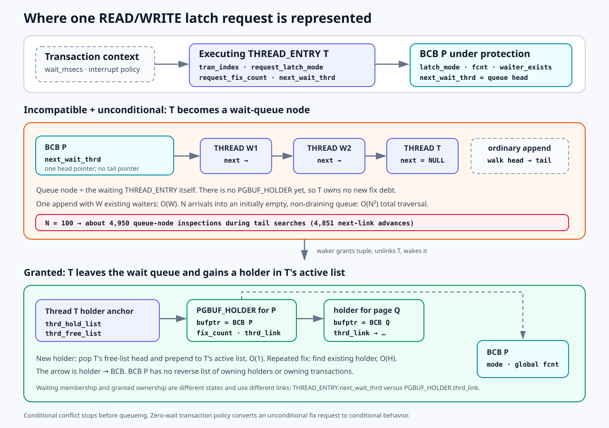
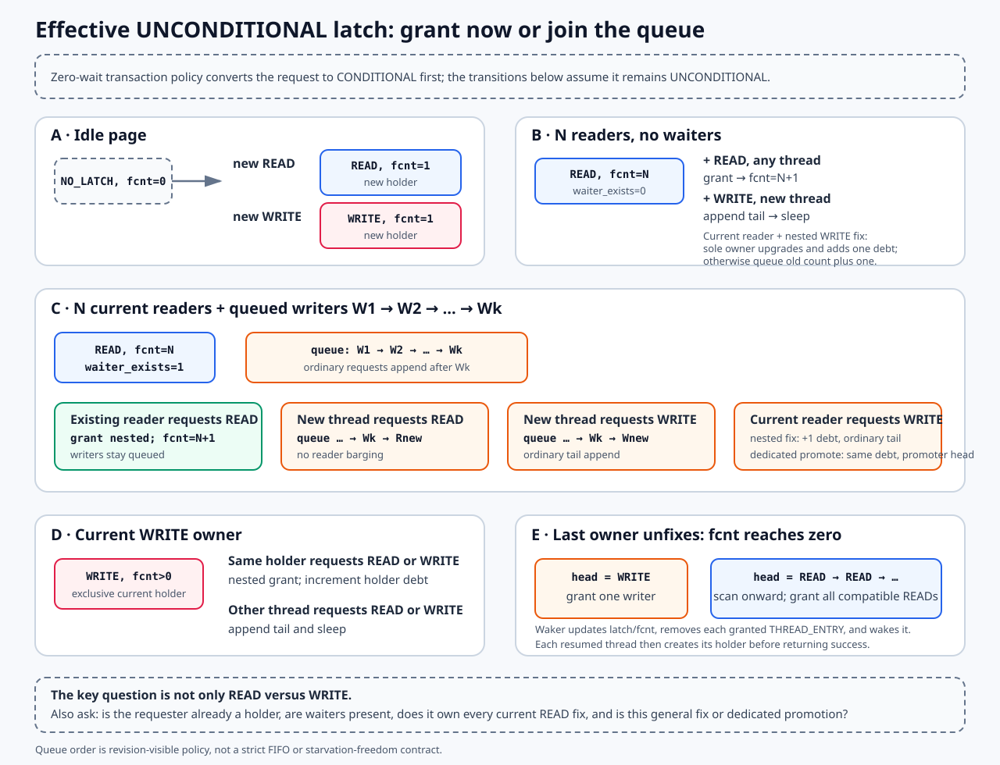
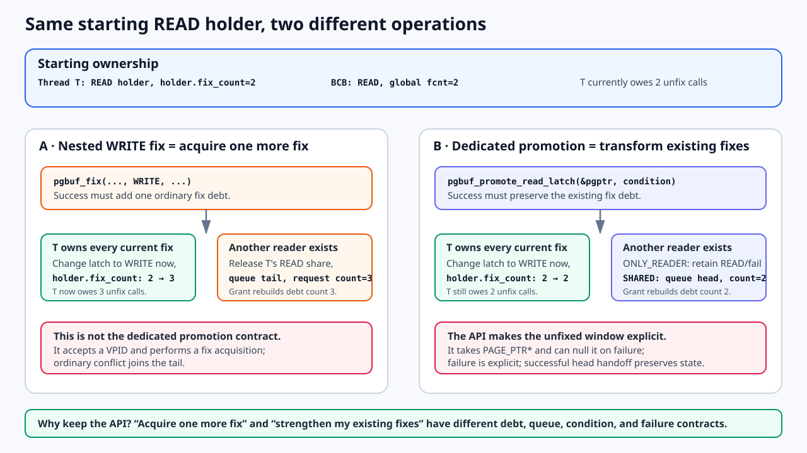
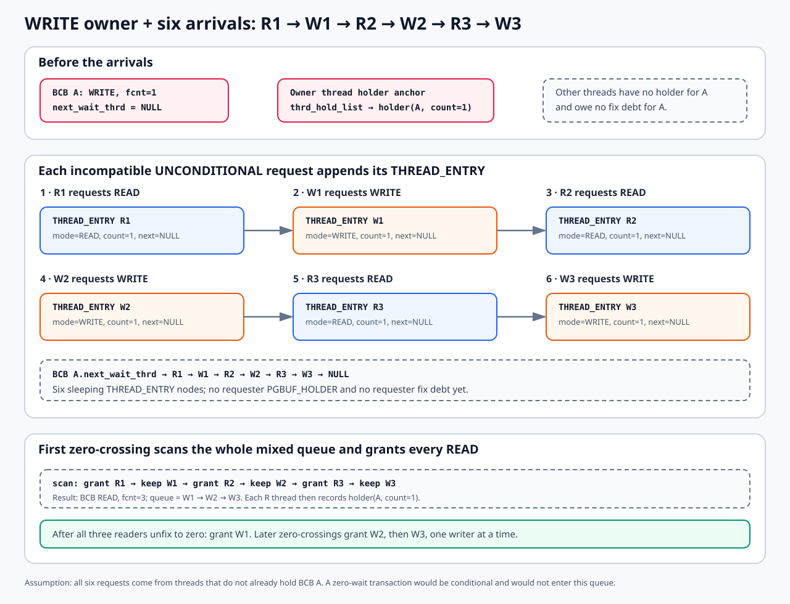
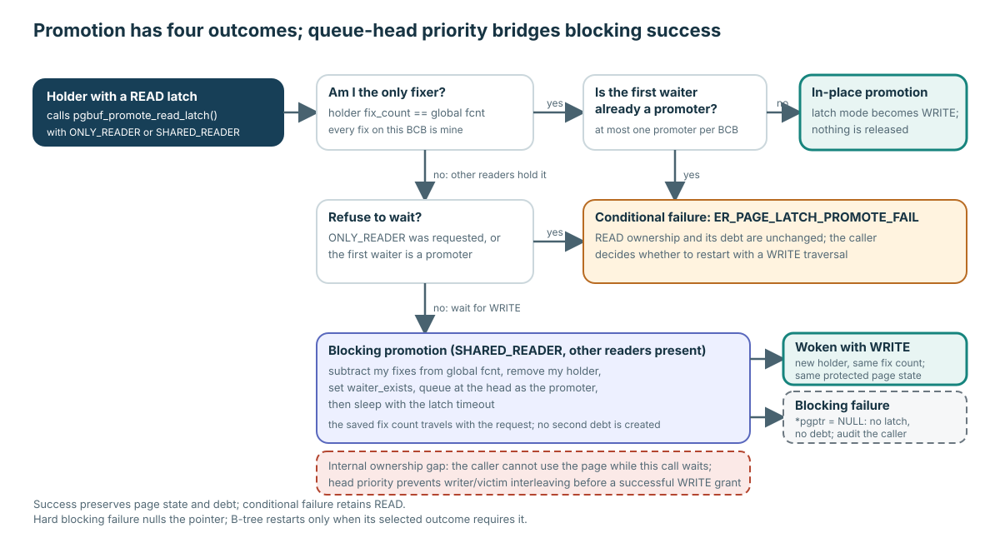
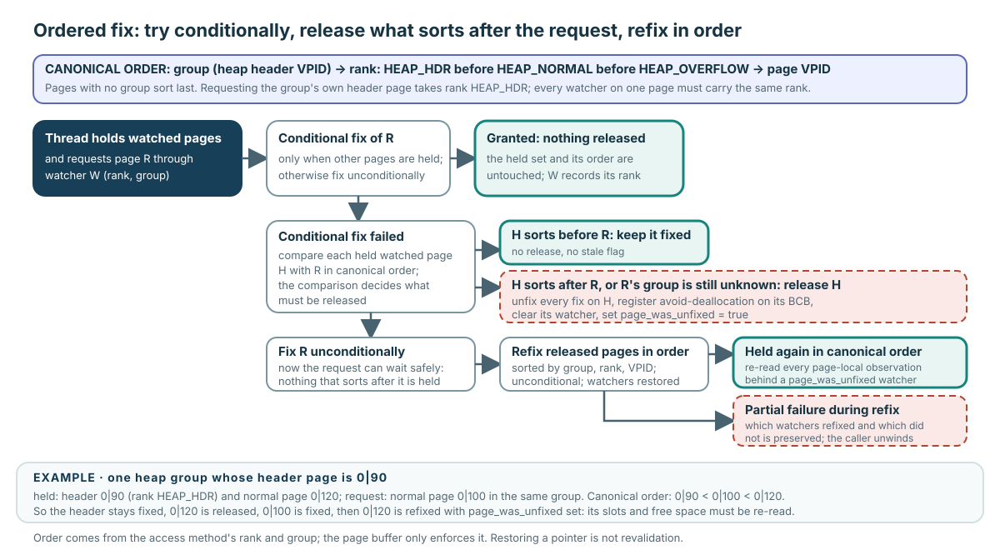

# Acquisition Concurrency and Multi-page Ownership

**Level:** Advanced
**Prerequisites:** [Fix, Hold, and Release](../learning/02-fix-hold-release.md)
**Capability gained:** Trace optimized hits, load serialization, latch/promotion waits, and ordered multi-page acquisition without weakening the normal ownership contract.
**Source baseline:** `f799e05d77d5300c6ea5753b4a6cc7caee6d8912`
**Evidence used:** Interface contract, Verified mechanism, and Inference from the [pinned-source inventory](../source-inventory.md), exact ranges below, and representative heap/B-tree callers.

The caller contract remains the core one: success creates fix debt and a borrowed lifetime; failure does not. The mechanisms below are alternative internal ways to establish or reorganize that same contract.

## Lock-free READ hit: optimization under the same contract

A lock-free READ hit has the same caller contract as the locked resident path.

The optimized resident READ path samples the BCB identity and atomic latch tuple, rejects non-READ/waiter/zero-fix or mismatched-VPID state, then uses an atomic compare/exchange with `memory_order_acq_rel`/acquire to increment `fcnt`. It records the current thread’s holder before returning the page pointer.

Its safety argument depends on existing invariants: a positive `fcnt` excludes victim reuse; stable BCB storage makes the sampled object valid; the atomic memory ordering makes the accepted tuple/identity observations usable for the grant. This is not a separate “weak” caller contract. The holder/fix debt and borrowed-pointer lifetime are the same as the locked path.

Source: `src/storage/page_buffer.c:7725-7786`. The missing post-CAS VPID recheck is tracked as proof obligation `VS-14` by the [uncertainty registry](../unresolved-or-version-sensitive-findings.md); this page does not change that status.

## VPID-keyed load serialization: identity ownership, not an I/O count

On a miss, a VPID-keyed buffer-lock protocol chooses one resident-identity owner. The owner prepares a provisional BCB, loads/validates bytes, publishes the hash mapping, and wakes waiters; waiters retry lookup rather than publish a second resident mapping.

This establishes one resident-identity owner/load protocol. It does not prove exactly one physical device I/O: a read may consult DWB or the data volume, the OS may cache, and lower layers may retry. State the identity claim at the page-buffer boundary.

Source: lookup/load ownership at `src/storage/page_buffer.c:7981-8178` and provisional load/publication at `src/storage/page_buffer.c:8392-8634`. The DWB-read early-return candidate is routed as `VS-10` in the [uncertainty registry](../unresolved-or-version-sensitive-findings.md).

## Thread view: a request is waiting state first, holder state only after grant

Page-latch bookkeeping is structurally **thread-oriented**, not transaction-owned. The executing `THREAD_ENTRY` carries `tran_index`; page buffer uses that association to read the transaction descriptor's `wait_msecs` and to report timeout or interrupt outcomes. But the page buffer does not attach latch requests or holders to a transaction-owned list.

There are two different singly linked lists, and a request means something different in each:

| State | Anchor and link | Node | Meaning |
|---|---|---|---|
| Waiting for an incompatible latch | `PGBUF_BCB.next_wait_thrd` → `THREAD_ENTRY.next_wait_thrd` | The waiting `THREAD_ENTRY` itself | Pending request only. `request_latch_mode` and `request_fix_count` describe the requested grant; no new holder/fix debt belongs to the requester yet. |
| Latch granted | `PGBUF_HOLDER_ANCHOR.thrd_hold_list` → `PGBUF_HOLDER.thrd_link` | A holder entry owned by the successful thread | Active ownership. `bufptr` identifies the BCB and `fix_count` attributes nested debt to this thread. |

The transition is deliberate. `pgbuf_block_bcb()` writes the request fields into the current `THREAD_ENTRY`, links that entry into the BCB queue, releases the BCB mutex, and sleeps. At a zero-crossing, the releasing thread updates the BCB's atomic latch tuple, removes the waiter from the queue, clears that waiter's `next_wait_thrd`, and wakes it. The resumed thread then allocates or reuses a `PGBUF_HOLDER`, prepends it to its own active list, and returns success. The BCB stores the global latch mode, global `fcnt`, `waiter_exists`, and the queue head; it has no reverse list of holders or transactions.

### READ and WRITE with an effective unconditional condition

“Unconditional” means “wait if the request cannot be granted now,” not “always block.” An outer `pgbuf_fix()` first converts the request to conditional behavior when the current transaction uses zero-wait policy. Otherwise the protected grant decision is:

| Current BCB state | READ request | WRITE request |
|---|---|---|
| `NO_LATCH` | Grant immediately; set READ and `fcnt=1`; create this thread's holder. | Grant immediately; set WRITE and `fcnt=1`; create this thread's holder. |
| READ, no blocked reader/writer | Grant another reader. Reuse this thread's holder when nested; otherwise create a new holder. | For a nested `pgbuf_fix(..., WRITE, ...)`, change the latch to WRITE immediately only when this thread owns every current fix, then add the newly acquired fix debt. Otherwise wait; if this thread was already a reader, remove its READ contribution and holder before queueing its old count plus the new request. |
| READ, `waiter_exists` | An existing holder may re-enter. A new reader waits so it does not barge past queued work. | The same nested-WRITE-fix rule applies. This row is not the contract of `pgbuf_promote_read_latch()`. |
| WRITE | The current holder may make a nested READ request. Any other thread waits. | The current holder may re-enter WRITE. Any other thread waits. |

The visual makes the ambiguous “one more reader” case explicit. With `N` current readers and no waiter, another reader is compatible and joins immediately. With `N` current readers and queued writers, a **new non-holder reader** appends behind the queued writers, while a reader that already owns this BCB may take a nested READ immediately. Likewise, a new WRITE requester appends at the tail. “A current reader asks for WRITE” is still incomplete: it can mean a nested WRITE fix, which acquires another debt, or the dedicated promotion operation, which transforms the existing debt.

An incompatible **conditional** request returns without queue membership and without new ownership. A dedicated blocking promotion through `pgbuf_promote_read_latch()` differs from the general fix path: it releases the caller's READ ownership and inserts the promoter at the queue head. Ordinary incompatible fix requests append at the tail.

### Why a dedicated READ-to-WRITE promotion API exists

The general fix API and the promotion API answer different caller intentions. Suppose thread T already has a READ holder with `fix_count=2`:

| Question | Nested `pgbuf_fix(..., WRITE, ...)` | `pgbuf_promote_read_latch(&pgptr, condition)` |
|---|---|---|
| Caller intention | Acquire the page one more time, requesting WRITE for that new acquisition. | Strengthen the latch protecting the fixes T already owns. |
| Debt after immediate success | `2 → 3`; every successful ordinary fix adds one matching unfix obligation. | `2 → 2`; no logical fix is added. |
| If other readers exist and waiting is allowed | Remove T's READ contribution, append an ordinary request at the queue tail, and carry request count `2 + 1 = 3`. | Remove T's READ contribution, insert a promoter at the queue head, and carry the unchanged count `2`. |
| Caller-selectable condition | The fix condition controls whether an incompatible acquisition may wait. | `PGBUF_PROMOTE_ONLY_READER` preserves READ ownership and reports promotion failure; `PGBUF_PROMOTE_SHARED_READER` may release and wait. |
| Interface/failure signal | Starts from a VPID and returns the result of another fix acquisition. | Starts from the caller's existing `PAGE_PTR *`; a blocking failure can null that pointer, exposing that the old borrowed lifetime ended. |

That is why the dedicated function is not redundant even though the general latch helper contains an immediate READ-to-WRITE branch. The helper's branch implements the **new fix acquisition** contract. The dedicated API implements an **in-place-or-transferred upgrade of existing ownership**, supplies promotion-specific policy, preserves the old debt count, and makes the possible unfixed window visible to the caller. B-tree and file-manager callers use it after examining a page under READ and later discovering that mutation requires WRITE; on failure they can restart or refix through an explicit WRITE path.

The B-tree source explains the higher-level strategy rather than leaving it as a performance guess. Non-leaf insertion traversal optimistically assumes that no split or maximum-key update is needed, so it starts with READ. After examining the node, an uncommon structural change may require WRITE on that already-fixed page. Promotion preserves the traversal's existing fix debt in the uncontended case. For a current page held alongside related pages, B-tree chooses `PGBUF_PROMOTE_ONLY_READER` so it can fail/restart instead of sleeping in a multi-page latch cycle; the source includes a three-thread dead-latch example. If the optimistic path cannot be preserved, traversal restarts with WRITE latches so the retry does not fail indefinitely. Leaves, which are expected to change almost every time, are fixed WRITE from the start because the source says promotion can perform poorly there. Thus lower uncontended cost is part of the intent, but the decisive difference is the caller-visible ownership and retry protocol.

> **Pinned-source anomaly:** do not infer that the ordinary immediate branch maintains matching global and per-thread counts. At `f799e05`, it sets tuple `fcnt=1` and then increments the existing holder. Starting from holder count 2 appears to leave tuple count 1 and holder count 3. The branch is recorded as candidate `VS-18` in [Unresolved or Version-sensitive Findings](../unresolved-or-version-sensitive-findings.md); it needs a focused runtime test before any stronger safety claim. The debt comparison above states the ordinary API's caller contract and the holder update visible in source, not proof that this branch preserves the two-ledger invariant.

Source: the ordinary fix-family interface and acquisition are at `src/storage/page_buffer.h:277-348` and `src/storage/page_buffer.c:2256-2679`; nested WRITE handling, combined request count, and ordinary holder accounting are at `src/storage/page_buffer.c:6277-6634`; dedicated promotion is at `src/storage/page_buffer.c:2842-3050`. B-tree states the optimistic READ/promotion/restart design and dead-latch constraint at `src/storage/btree.c:28307-28393,28638-28696`; the delete/merge variant is at `src/storage/btree.c:31672-31866`. A file-manager fallback is at `src/storage/file_manager.c:8251-8262`.

Evidence reference: [Why Read-to-Write Promotion Is a Separate Operation](../reference/read-to-write-promotion-rationale.md).

### List costs: the BCB queue has no tail pointer

Let `W` be the number of current entries in one BCB wait queue and `H` the number of distinct BCB holders in one thread's active holder list. These are source-structure bounds, not measured latency:

| Operation | Structural cost | Why |
|---|---:|---|
| Find whether this thread already holds the BCB | `O(H)` | Linear `thrd_hold_list` search by `holder->bufptr`. |
| Reuse an existing holder after grant | `O(H)` lookup, then `O(1)` increment | Nested fixes share one per-thread/per-BCB holder entry. |
| Add a new holder | `O(1)` list work | Pop the thread free-list head and prepend to the active-list head; holder-pool expansion is a separate exceptional allocation path. |
| Ordinary wait-queue append | `O(W)` | The BCB stores only the head. `pgbuf_block_bcb()` walks `THREAD_ENTRY.next_wait_thrd` until the tail. |
| Blocking promoter head insertion | `O(1)` | The promoter links directly before the old head. |
| Wakeup | `O(S)`, `S ≤ W` | Scan from the head. A granted head WRITE makes the latch WRITE and stops the scan. A granted READ makes it READ; the scan can skip incompatible WRITE and FLUSH nodes, remove cancelled nodes, and grant later READ nodes, so it may inspect the full queue. |
| Timeout/interrupt removal | `O(W)` worst case | Removing an arbitrary thread searches for its predecessor in the singly linked queue. |

If 100 ordinary incompatible requests arrive while the queue never drains, their individual append scans grow from 0 to 99 existing nodes. The cumulative work is quadratic: about `1 + 2 + ... + 99 = 4,950` queue-node inspections (`4,851` actual `next_wait_thrd` advances in the loop). Thus the **enqueue phase is `O(N²)` cumulatively**, not `O(N)`, because there is no tail pointer. For 100 pure WRITE waiters, dequeue is not another quadratic pass: each zero-crossing normally removes the head writer with constant list work. Arbitrary mass timeouts can again become quadratic because each removal may search the queue.

All queue traversal and mutation occurs while holding the BCB mutex, so a large `W` is a plausible contention amplifier. It becomes a demonstrated bottleneck only when a profile or focused queue-depth experiment attributes meaningful time to these scans; Big-O alone is not a latency measurement.

Source: holder/BCB structures at `src/storage/page_buffer.c:460-528`; holder lookup/allocation at `src/storage/page_buffer.c:5922-6086`; grant decision and post-wakeup holder recording at `src/storage/page_buffer.c:6277-6634`; queue insertion at `src/storage/page_buffer.c:7041-7099`; timeout removal at `src/storage/page_buffer.c:7198-7279`; zero-crossing grant at `src/storage/page_buffer.c:7452-7590`; transaction wait-policy lookup at `src/storage/page_buffer.c:16945-16969`; request fields at `src/thread/thread_entry.hpp:228-256`.

## Latch queue: classify the outcome

The normal latch path can produce distinct outcomes:

| Outcome | Ownership result | Evidence to retain |
|---|---|---|
| Immediate grant | Atomic tuple changes; holder debt is recorded | mode, `fcnt`, holder, identity |
| Conditional rejection | Return without queueing or ownership | condition and no new release debt |
| Wait | Request is represented in the BCB wait protocol | requested mode/count, prior owners, thread state |
| Timeout/interrupt | Wait ends without successful caller acquisition | error, queue removal, unchanged caller debt |
| Wakeup/grant | Waiter resumes and completes holder recording | grant state and post-wakeup failure seam |

Readers and writers may sometimes pass or be grouped according to current tuple/queue logic; that is a bounded barging observation, not a fairness theorem. Source tracing at `src/storage/page_buffer.c:6277-7590` does not establish strict FIFO, starvation freedom, or exact timeout timing. Those require controlled schedules plus scheduler/timeout evidence.

### Worked case: one hundred unconditional WRITE requests

Suppose one thread holds a WRITE latch and one hundred other threads request WRITE unconditionally. The pinned mechanism is:

1. **Queue.** Each incompatible request is appended to the BCB's `next_wait_thrd` list in arrival order and sets the atomic latch's `waiter_exists` bit. A blocking promoter is the one exception: it is inserted at the head, and the source asserts that at most one promoter waits per BCB.
2. **Sleep with a bound.** Each waiter sleeps in `pgbuf_timed_sleep()` with a timeout taken from the hidden server parameter `page_latch_timeout_in_msecs` (300 seconds at the pinned revision); a transaction configured for zero wait was already converted to conditional behavior and never queues. The sleep is interrupt-aware for worker threads.
3. **Hand off at zero.** When the holder unfixes and global `fcnt` reaches zero (the zero-crossing that starts a grant scan), the releasing thread sets `NO_LATCH` and calls `pgbuf_wakeup_reader_writer()` while still holding the BCB mutex. It walks from the head, removes entries whose request mode was reset to `NO_LATCH` by timeout/interrupt, and leaves FLUSH waiters in place. If the first grantable reader is selected, the tuple becomes READ; the scan continues through the rest of the list, leaves incompatible WRITE entries linked, and grants later READ entries too. If the first grantable request is WRITE, the tuple becomes WRITE and the scan stops, so only that writer is granted. For each grant the waker adds `request_fix_count` to global `fcnt`, removes that `THREAD_ENTRY`, clears its queue link, and wakes it; the resumed thread then records its own holder.
4. **Keep newcomers honest.** While blocked readers or writers remain, `waiter_exists` stays set, so a newly arriving non-holder READ blocks even though the latch mode might be compatible. A thread that already holds the BCB may still re-enter.
5. **Exit without debt.** A timed-out waiter is treated as a page-latch deadlock victim: `ER_PAGE_LATCH_TIMEDOUT` is raised, followed by `ER_LK_UNILATERALLY_ABORTED` for a transaction with infinite lock wait or `ER_LK_PAGE_TIMEOUT` for a finite one. An interrupted waiter removes itself from the queue. Neither outcome creates a fix debt, and neither leaves the caller with a page pointer.

One hundred writers are therefore served one grant per zero-crossing, which is roughly arrival order. Three things reorder service and are the reason fairness is not a contract: holder re-entry (a current holder's nested request is granted past waiters), promoter head insertion, and reader grouping (after selecting READ, one scan may grant READ requests that appear behind waiting writers). The source also states its own design position in a comment: page latches do not guarantee deadlock freedom, so the timed sleep is the deadlock guard. Treat the timeout as a policy value and the ordering as a Verified mechanism of this revision, not as an Interface contract.

### Worked mixed queue: six alternating requests behind a WRITE owner

Assume BCB A is held WRITE with `fcnt=1`, and six **new non-holder threads** arrive unconditionally in order: `R1 → W1 → R2 → W2 → R3 → W3`. Every request conflicts with the current WRITE latch. Each request therefore appends its own `THREAD_ENTRY` to `BCB A.next_wait_thrd`; its `request_latch_mode` is READ or WRITE, `request_fix_count=1`, and `next_wait_thrd` links to the next request. None of these six threads has a `PGBUF_HOLDER` or fix debt yet. Only the original owner has `holder(A, count=1)` in its thread-local active list.

When the owner unfixes and `fcnt` reaches zero, the actual loop does **not** stop at W1 after granting R1. Granting R1 changes the tuple to READ. W1 is now incompatible, so the loop leaves W1 linked and continues; R2 is compatible and is granted, W2 is left linked, and R3 is granted. The first scan therefore ends with `READ, fcnt=3`, wakes R1/R2/R3, and leaves `W1 → W2 → W3`. Each woken reader then creates its own holder with count 1. Only after all three readers unfix and the combined `fcnt` returns to zero is W1 granted. Later zero-crossings grant W2 and W3 one at a time.

This distinction matters: the source comment summarizes the case as waking readers “at the head,” but the pinned loop's control flow continues past incompatible WRITE and FLUSH entries while the tuple is READ. The maintainer-facing mechanism here follows the executable control flow, not the looser comment. Source: `src/storage/page_buffer.c:7452-7590`.

The cost has two separate phases; do not multiply them together as though every reader arrival performs a group wakeup:

| Non-draining queue built behind the original WRITE owner | Ordinary tail-append work | Work caused by READ arrivals alone | Reader-group wakeup |
|---|---:|---:|---:|
| 100 total alternating requests: 50 READ + 50 WRITE | 4,950 node inspections cumulatively | 2,450 if READ arrives first; 2,500 if WRITE arrives first | One `O(100)` scan grants all 50 readers. If WRITE is first, that writer is granted first and the reader scan happens at its release. |
| 200 total requests: 100 READ + 100 WRITE | 19,900 node inspections cumulatively | 9,900 if READ arrives first; 10,000 if WRITE arrives first | One `O(200)` scan grants all 100 readers, subject to the same first-WRITE step. |

Why do READ arrivals account for thousands of inspections? It is **ordinary enqueue**, not reader grouping. With no tail pointer, arrival `i` walks the existing singly linked queue from its head to its tail while holding the BCB mutex. The one group wakeup later scans the mixed list once, grants the READ entries, and leaves the WRITE entries linked. It is `O(N²)` cumulative append work plus `O(N)` group-scan work, not `O(N²)` group-wakeup work. These exact sums assume the original WRITE owner remains fixed until every arrival has queued; concurrent dequeue shortens later append walks.

Evidence reference: [Alternating Reader/Writer Wakeup Cost](../reference/alternating-reader-writer-wakeup-cost.md).

The insertion cost is separate from the one-per-zero-crossing handoff. Because the queue has no tail pointer, enqueueing those 100 writers into a non-draining queue performs roughly 4,950 cumulative node inspections, or `O(N²)`. Once they are queued, each pure-WRITE handoff removes the head with constant list work. See the structural diagram and cost table above rather than describing the entire scenario with one complexity label.

Source: grant/wait decision at `src/storage/page_buffer.c:6278-6634`; queue append and timed sleep at `src/storage/page_buffer.c:7041-7450`; zero-crossing wakeup at `src/storage/page_buffer.c:7452-7590`; timeout parameter at `src/base/system_parameter.c:5308-5319`.

## Blocking promotion uses queue priority to preserve page state

Promotion is trivial when the caller is the only fixer: latch mode changes in place. The shared-reader path is subtler. It temporarily subtracts the caller's READ fixes and removes its holder, but—while still under the BCB mutex—installs the same thread as the single promoter at the queue **head** before sleeping.

Head placement is not only priority tuning. Existing active owners are READ holders, so they cannot legally modify the page. Ordinary queued writers remain behind the promoter. When the remaining readers drain to zero, the wakeup code grants the head WRITE promoter under the same protected handoff, leaving no writer or victimization gap. A successful first-promoter wait therefore restores the same fix count and preserves page-byte observations made under the original READ latch. Pinned B-tree callers rely on this: they compute `need_split`, `max_key_len`, and retain `node_header` before `PGBUF_PROMOTE_SHARED_READER`, then use those values directly after success rather than re-searching the page.

The function still has an **internal ownership gap**: while it is blocked, this thread has no holder and must not access the page. The distinction is the return outcome:

- in-place success keeps continuous ownership, the same page state, and the same debt;
- blocking success transfers the same debt through the head promoter and returns with the protected page state preserved by the intended latch protocol;
- `ER_PAGE_LATCH_PROMOTE_FAIL` occurs before ownership is surrendered, so READ ownership and the pointer remain valid; B-tree may skip work or restart by policy;
- a hard blocking failure after ownership was surrendered sets `*pgptr_p = NULL`, so the old pointer must not be used or unfixed;
- holder-allocation failure after a grant is the separate unresolved `VS-11` seam and must not be collapsed into the clean hard-failure contract.

The single-promoter rule is part of the continuity proof. A second promoter is rejected because letting it upgrade while the first waits could change the page before the first returns. The proof also relies on the intended protocol that READ owners do not mutate or bypass the promoter with an ordinary nested WRITE fix; the pinned ordinary immediate-upgrade anomaly is tracked separately as `VS-18`.

Source: promotion transfer and head insertion at `src/storage/page_buffer.c:2842-3050,7041-7099`; zero-crossing handoff at `src/storage/page_buffer.c:7452-7590`. B-tree consumes pre-promotion observations after success at `src/storage/btree.c:28304-28409,28627-28710`; restart policy is at `src/storage/btree.c:28365-28393,28638-28696`.

## Ordered watchers: multi-page access as an owner protocol

`PGBUF_WATCHER` adds ordering metadata and state to the normal page debt. The caller chooses a rank and group from its access method; page buffer does not invent the semantic order.

### Ordered-fix input and output contract

The public call is conceptually `pgbuf_ordered_fix(thread, req_vpid, fetch_mode, request_mode, req_watcher)`. It returns an error code, not a page pointer.

| Direction | Value | Contract at the pinned revision |
|---|---|---|
| Input | `thread_p` | Selects the current thread's holder list. The caller does not pass the already-held watcher set separately; the helper discovers it through those holders. |
| Input | `req_vpid`, `fetch_mode`, `request_mode` | Name the requested identity and its ordinary fetch/latch requirements. |
| Input through watcher | `initial_rank`, `group_id` | `PGBUF_INIT_WATCHER()` initializes a clean watcher with the access-method rank and, when known, the heap-header `VPID` derived from `HFID`. `pgptr` must be `NULL`. |
| Primary output | return code and `req_watcher.pgptr` | `NO_ERROR` plus a non-`NULL` `pgptr` represents the new watched fix. The watcher also records the granted latch mode, current rank, links, and resolved group when discovery was needed. |
| Side output | existing watchers | A released/refixed watcher receives its current page pointer again and keeps `page_was_unfixed=true`. On partial failure, some existing watcher pointers may be restored while later ones remain `NULL`; callers must inspect each watcher. |

The watcher is therefore not only an input option record or only an output handle. It is an in/out ownership ledger. The requested watcher must be initialized and unattached before the call; after success it is the handle used by `pgbuf_ordered_unfix()`.

### What the helper does internally

The ordered protocol can:

1. attempt conditional acquisition in the requested order;
2. detect that the new request would violate the order of already held pages;
3. release eligible watched pages, sort the requested/held set, and refix it in order;
4. transfer watcher ownership as callers reorganize their context;
5. unwind a partial failure, preserving which watchers refixed and which did not.

The canonical order is the access method's, not the page buffer's: pages sort by group (the heap header `VPID`), then by rank (`PGBUF_ORDERED_HEAP_HDR` before `PGBUF_ORDERED_HEAP_NORMAL` before `PGBUF_ORDERED_HEAP_OVERFLOW`), then by `VPID`, and pages without a group sort last. When a conditional fix of the new page fails, every held watched page that sorts after the request is fully unfixed with avoid-deallocation registered on its BCB, the request is fixed unconditionally, and the released pages are refixed in sorted order. Only those released pages come back with `page_was_unfixed` set.

More concretely, the fast case uses an unconditional fix when the thread holds no other page (or only another fix of the same page); otherwise it first tries conditionally so it never waits while holding a potentially conflicting set. A successful attempt attaches `req_watcher` and returns. After a conditional rejection, the helper validates that every reorderable fix has a watcher, saves each page's watcher count, strongest latch mode, type, group, rank, and identity, and leaves pages that already sort before the request fixed. It registers avoid-deallocation before fully unfixing only the pages that sort after the request. If the request's group was unknown, it may temporarily fix the heap page to derive the `HFID`/header VPID, then includes the request in the saved set. The set is sorted and acquired unconditionally in canonical order; old fix counts and watcher chains are rebuilt, avoid-deallocation is balanced, and every actually released watcher retains `page_was_unfixed=true`.

If a refix fails, the helper removes the requested fix if it acquired one, clears outstanding avoid-deallocation registrations, and returns an error. It cannot make the output set atomic: earlier pages in sorted order may already be refixed while later watcher pointers are still `NULL`. That is why the error contract requires a watcher-by-watcher ownership audit.

When a watcher reports `page_was_unfixed`, page-local observations—including record pointers, slots, free-space decisions, and headers—may be stale. The access method must reconstruct and revalidate them after refix; restoring the pointer is not enough.

Source: watcher initialization and interface at `src/storage/page_buffer.h:90-164,205-258,282-352`; ordered comparison, fix, and cleanup at `src/storage/page_buffer.c:12186-13063`; ordered callback at `src/storage/page_buffer.c:13065-13531`. Heap’s destination/watcher owner protocol is visible at `src/storage/heap_file.c:20493-20664`; B-tree’s promotion/restart caller is visible at `src/storage/btree.c:28365-28393`.

## Review checklist

- Does every optimized success still create exactly one holder/fix debt?
- Which identity and tuple observations are protected by the atomic ordering?
- Does “one loader” mean resident publication owner rather than device I/O count?
- Is the wait outcome classified before fairness/timing claims are made?
- Which ownership is released by promotion or ordered refix?
- Which page-local observations are reconstructed after `page_was_unfixed`?
- Does every partial failure release or retain each watcher explicitly?

## Related routes

- Practice: [lock-free READ-hit proof](../questions/advanced.md#pgbuf-qb-031-what-closes-the-lock-free-read-hit-proof)
- Practice: [many unconditional WRITE waiters](../questions/advanced.md#pgbuf-qb-033-how-are-many-unconditional-write-waiters-handled)
- Core prerequisite: [Fix, Hold, and Release](../learning/02-fix-hold-release.md)
- Caller boundary: [Caller Completes Correctness](../learning/03-caller-completes-correctness.md)
- Plan a modification: [Change the Module Safely](../playbooks/change-safely.md)
- Investigate a symptom: [Diagnose Page-buffer Symptoms](../playbooks/debug-by-symptom.md)
- Locate symbols and callers: [Source and Caller Map](../reference/source-map.md)
