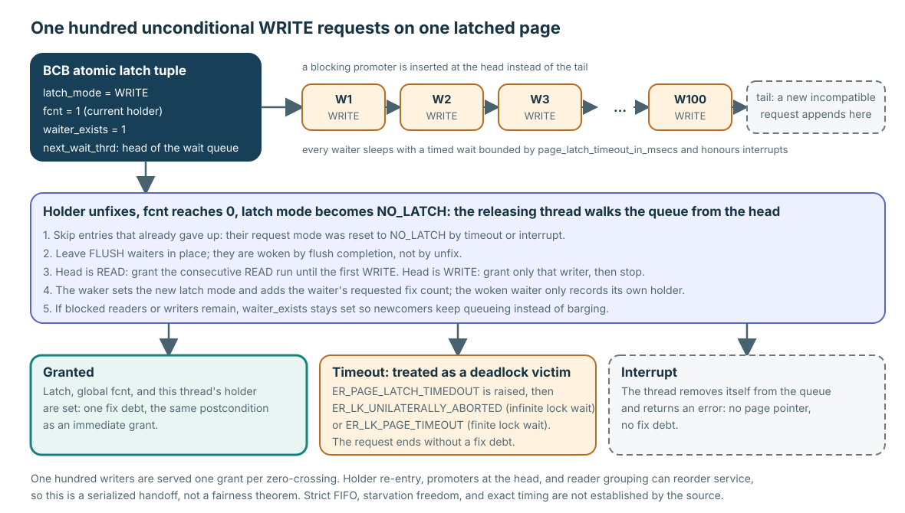

# Acquisition Concurrency and Multi-page Ownership

**Level:** Advanced
**Prerequisites:** [Fix, Hold, and Release](../learning/02-fix-hold-release.md)
**Capability gained:** Trace optimized hits, load serialization, latch/promotion waits, and ordered multi-page acquisition without weakening the normal ownership contract.
**Source baseline:** `f799e05d77d5300c6ea5753b4a6cc7caee6d8912`
**Evidence used:** Interface contract, Verified mechanism, and Inference from the [pinned-source inventory](../source-inventory.md), exact ranges below, and representative heap/B-tree callers.

The caller contract remains the core one: success creates fix debt and a borrowed lifetime; failure does not. The mechanisms below are alternative internal ways to establish or reorganize that same contract.

## Lock-free READ hit: optimization under the same contract

A lock-free READ hit has the same caller contract as the locked resident path.

The optimized resident READ path samples the BCB identity and atomic latch tuple, rejects non-READ/waiter/zero-fix or mismatched-VPID state, then uses an atomic compare/exchange with `memory_order_acq_rel`/acquire to increment `fcnt`. It records the current thread’s holder before returning the page pointer.

Its safety argument depends on existing invariants: a positive `fcnt` excludes victim reuse; stable BCB storage makes the sampled object valid; the atomic memory ordering makes the accepted tuple/identity observations usable for the grant. This is not a separate “weak” caller contract. The holder/fix debt and borrowed-pointer lifetime are the same as the locked path.

Source: `src/storage/page_buffer.c:7725-7786`. The missing post-CAS VPID recheck is tracked as proof obligation `VS-14` by the [uncertainty registry](../unresolved-or-version-sensitive-findings.md); this page does not change that status.

## VPID-keyed load serialization: identity ownership, not an I/O count

On a miss, a VPID-keyed buffer-lock protocol chooses one resident-identity owner. The owner prepares a provisional BCB, loads/validates bytes, publishes the hash mapping, and wakes waiters; waiters retry lookup rather than publish a second resident mapping.

This establishes one resident-identity owner/load protocol. It does not prove exactly one physical device I/O: a read may consult DWB or the data volume, the OS may cache, and lower layers may retry. State the identity claim at the page-buffer boundary.

Source: lookup/load ownership at `src/storage/page_buffer.c:7981-8178` and provisional load/publication at `src/storage/page_buffer.c:8392-8634`. The DWB-read early-return candidate is routed as `VS-10` in the [uncertainty registry](../unresolved-or-version-sensitive-findings.md).

## Latch queue: classify the outcome

The normal latch path can produce distinct outcomes:

| Outcome | Ownership result | Evidence to retain |
|---|---|---|
| Immediate grant | Atomic tuple changes; holder debt is recorded | mode, `fcnt`, holder, identity |
| Conditional rejection | Return without queueing or ownership | condition and no new release debt |
| Wait | Request is represented in the BCB wait protocol | requested mode/count, prior owners, thread state |
| Timeout/interrupt | Wait ends without successful caller acquisition | error, queue removal, unchanged caller debt |
| Wakeup/grant | Waiter resumes and completes holder recording | grant state and post-wakeup failure seam |

Readers and writers may sometimes pass or be grouped according to current tuple/queue logic; that is a bounded barging observation, not a fairness theorem. Source tracing at `src/storage/page_buffer.c:6277-7590` does not establish strict FIFO, starvation freedom, or exact timeout timing. Those require controlled schedules plus scheduler/timeout evidence.

### Worked case: one hundred unconditional WRITE requests

Suppose one thread holds a WRITE latch and one hundred other threads request WRITE unconditionally. The pinned mechanism is:

1. **Queue.** Each incompatible request is appended to the BCB's `next_wait_thrd` list in arrival order and sets the atomic latch's `waiter_exists` bit. A blocking promoter is the one exception: it is inserted at the head, and the source asserts that at most one promoter waits per BCB.
2. **Sleep with a bound.** Each waiter sleeps in `pgbuf_timed_sleep()` with a timeout taken from the hidden server parameter `page_latch_timeout_in_msecs` (300 seconds at the pinned revision); a transaction configured for zero wait was already converted to conditional behavior and never queues. The sleep is interrupt-aware for worker threads.
3. **Hand off at zero.** When the holder unfixes and global `fcnt` reaches zero, the releasing thread sets `NO_LATCH` and calls `pgbuf_wakeup_reader_writer()` while still holding the BCB mutex. It walks the queue from the head, skipping entries whose request mode was reset to `NO_LATCH` by a timeout or interrupt and leaving FLUSH waiters in place. If the head is a reader, it grants every queued reader and leaves writers waiting; if the head is a writer, it grants only that writer and stops. The waker performs the grant by updating the latch tuple with the waiter's requested mode and fix count; the woken thread then allocates its own holder and returns `NO_ERROR` with the ordinary success postcondition.
4. **Keep newcomers honest.** While blocked readers or writers remain, `waiter_exists` stays set, so a newly arriving non-holder READ blocks even though the latch mode might be compatible. A thread that already holds the BCB may still re-enter.
5. **Exit without debt.** A timed-out waiter is treated as a page-latch deadlock victim: `ER_PAGE_LATCH_TIMEDOUT` is raised, followed by `ER_LK_UNILATERALLY_ABORTED` for a transaction with infinite lock wait or `ER_LK_PAGE_TIMEOUT` for a finite one. An interrupted waiter removes itself from the queue. Neither outcome creates a fix debt, and neither leaves the caller with a page pointer.

One hundred writers are therefore served one grant per zero-crossing, which is roughly arrival order. Three things reorder service and are the reason fairness is not a contract: holder re-entry (a current holder's nested request is granted past waiters), promoter head insertion, and reader grouping (a wakeup that starts with a reader grants every queued reader ahead of every queued writer). The source also states its own design position in a comment: page latches do not guarantee deadlock freedom, so the timed sleep is the deadlock guard. Treat the timeout as a policy value and the ordering as a Verified mechanism of this revision, not as an Interface contract.

Source: grant/wait decision at `src/storage/page_buffer.c:6278-6634`; queue append and timed sleep at `src/storage/page_buffer.c:7041-7450`; zero-crossing wakeup at `src/storage/page_buffer.c:7452-7590`; timeout parameter at `src/base/system_parameter.c:5308-5319`.

## Blocking promotion releases observations

Promotion is easy only when the caller is the eligible reader. In a blocking path, the implementation can release the current READ ownership, enqueue/wait for WRITE, and later return with different protection. Every observation derived from the old page bytes, latch tuple, waiter set, or related page set becomes stale across that release.

A promotion caller must therefore distinguish:

- conditional promotion failure, where the algorithm chooses whether to restart;
- blocking promotion, where released ownership invalidates page-local observations;
- error/interrupt, where the pointer/debt result must be audited;
- success, where the caller revalidates its access-method preconditions.

Source: `src/storage/page_buffer.c:2842-3050`. Representative B-tree restart policy: `src/storage/btree.c:28365-28393` and `src/storage/btree.c:28638-28696`.

## Ordered watchers: multi-page access as an owner protocol

`PGBUF_WATCHER` adds ordering metadata and state to the normal page debt. The caller chooses a rank and group from its access method; page buffer does not invent the semantic order.

The ordered protocol can:

1. attempt conditional acquisition in the requested order;
2. detect that the new request would violate the order of already held pages;
3. release eligible watched pages, sort the requested/held set, and refix it in order;
4. transfer watcher ownership as callers reorganize their context;
5. unwind a partial failure, preserving which watchers refixed and which did not.

When a watcher reports `page_was_unfixed`, page-local observations—including record pointers, slots, free-space decisions, and headers—may be stale. The access method must reconstruct and revalidate them after refix; restoring the pointer is not enough.

Source: ordered helpers and callbacks at `src/storage/page_buffer.c:12268-13531`. Heap’s destination/watcher owner protocol is visible at `src/storage/heap_file.c:20493-20664`; B-tree’s promotion/restart caller is visible at `src/storage/btree.c:28365-28393`.

## Review checklist

- Does every optimized success still create exactly one holder/fix debt?
- Which identity and tuple observations are protected by the atomic ordering?
- Does “one loader” mean resident publication owner rather than device I/O count?
- Is the wait outcome classified before fairness/timing claims are made?
- Which ownership is released by promotion or ordered refix?
- Which page-local observations are reconstructed after `page_was_unfixed`?
- Does every partial failure release or retain each watcher explicitly?

## Related routes

- Practice: [lock-free READ-hit proof](../questions/advanced.md#pgbuf-qb-031-what-closes-the-lock-free-read-hit-proof)
- Practice: [many unconditional WRITE waiters](../questions/advanced.md#pgbuf-qb-033-how-are-many-unconditional-write-waiters-handled)
- Core prerequisite: [Fix, Hold, and Release](../learning/02-fix-hold-release.md)
- Caller boundary: [Caller Completes Correctness](../learning/03-caller-completes-correctness.md)
- Plan a modification: [Change the Module Safely](../playbooks/change-safely.md)
- Investigate a symptom: [Diagnose Page-buffer Symptoms](../playbooks/debug-by-symptom.md)
- Locate symbols and callers: [Source and Caller Map](../reference/source-map.md)
