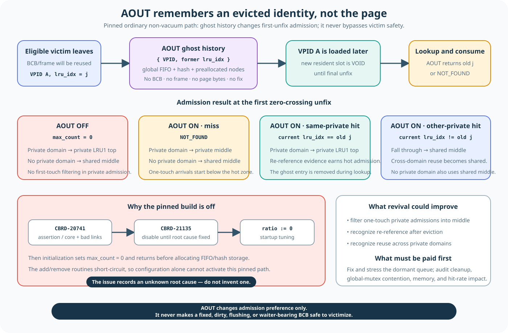

# Dormant AOUT Ghost History

**Level:** Advanced
**Prerequisites:** [Replacement Policy and Background Progress](./replacement-progress.md)
**Capability gained:** Distinguish the active replacement algorithm from the retained AOUT design; explain exactly what one ghost entry remembers, how it would affect first placement, and why the pinned build does not use it.
**Source baseline:** `f799e05d77d5300c6ea5753b4a6cc7caee6d8912`
**Evidence used:** Verified mechanism from dormant pinned-source structure and revision-bound Historical evidence. No performance benefit or safe re-enable claim is made.

## AOUT stores evicted identities as ghost history

The active replacement lesson does not need AOUT. At the pinned baseline,
startup forces `data_aout_ratio` to zero, so AOUT allocates no entries and takes
no part in admission or victim selection.

The code remains because AOUT was designed as a small **ghost history**: it
remembers that a VPID was evicted and from which LRU it came. It does not retain
the page bytes.



## What one entry contains

One `PGBUF_AOUT_LIST` node contains:

```text
{ VPID, former lru_idx, prev, next }
```

It does **not** contain a BCB, page frame, latch, fix count, dirty generation, or
copy of the page. After victimization, the real BCB/frame pair can already be
rebound to another VPID. The ghost entry is only a historical label.

The global AOUT object owns one FIFO, a free-node list, a VPID lookup hash, and
one `Aout_mutex`. In the retained design, insertion and removal use known
FIFO/hash nodes, so linked-list work is O(1) and hash lookup is expected O(1),
excluding mutex wait.

Source: `src/storage/page_buffer.c:635-666,10468-10636`.

## How large would it be if enabled?

For `N` page-buffer slots:

```text
AOUT entries = min(floor(N × data_aout_ratio), 32,768)
hash tables   = max(floor(AOUT entries / 1,000), 1)
```

All ghost nodes would be preallocated. When full, a new eviction recycles the
oldest FIFO-bottom entry. With the pinned default `data_aout_ratio = 0.0`, the
calculation yields zero and initialization returns before allocating nodes or
hash tables.

Source: `src/base/system_parameter.c:3463-3474` and
`src/storage/page_buffer.c:5802-5903`.

## Effects and non-effects of enabling AOUT

AOUT would not decide which resident BCB becomes a victim. Its retained lookup
runs after a missed page has been loaded into a VOID BCB and affects only that
page's first stable LRU placement:

| Context and ghost result | Retained placement branch |
|---|---|
| Final-unfix context has an enabled private-LRU assignment; ghost hit from the same private LRU | Current private LRU1 top |
| Enabled private-LRU assignment; AOUT miss | Current private LRU2 middle |
| Enabled private-LRU assignment; ghost hit from a different former LRU | Shared LRU2 middle |
| No enabled private-LRU assignment | Shared LRU2 middle |

The idea is admission ranking: a recently evicted identity from the same domain
would get hotter placement than an unremembered identity. `former lru_idx` is
not a transaction ID, ownership record, or permission to use the page. The
canonical [first-placement explanation](./replacement-progress.md#how-the-final-unfix-context-chooses-first-placement)
defines the execution-context assignment and separates this decision from later
BCB movement.

Source: `src/storage/page_buffer.c:6885-6994`.

## What the active pinned build does instead

`prm_tune_parameters()` overwrites the AOUT ratio with zero. Its source comment
says to disable AOUT until CBRD-20741 is fixed. Initialization consequently sets
`max_count = 0`, and add/lookup helpers return immediately.

The active first-placement rule therefore has no ghost hit/miss subdivision.
Both ordinary paths remain: an enabled private-LRU assignment reaches private
LRU1 top, while no enabled assignment reaches shared LRU2 middle. The canonical
[first-placement explanation](./replacement-progress.md#how-the-final-unfix-context-chooses-first-placement)
owns the exact session-to-worker handoff, `S+p` conversion, and BCB state
boundary.

The retained comment that calls the design “LRU + Aout of 2Q” does not prove
that this revision executes 2Q. It describes code structure whose AOUT half is
dormant.

Historical navigation mentions CBRD-20741 and CBRD-21135, but the available
material does not establish the original root cause. Treat it as **unknown root
cause**, not as proof that removing one forced-zero line is safe. Re-enabling
would require a fresh concurrency, memory, policy, and performance review.

Source: forced disable at `src/base/system_parameter.c:9931-9987`; disabled
initialization/add/lookup at `src/storage/page_buffer.c:5816-5833,10468-10636`.
Revision-bound details: [Victim scan cap and AOUT status](../reference/victim-scan-cap-and-aout-evidence.md).

## Why this is a separate page

Mixing AOUT into the active replacement flow causes three common mistakes:

1. calling active CUBRID replacement “2Q”;
2. imagining that AOUT holds a second copy of the page;
3. believing an AOUT hit selects or authorizes a victim.

None is true at the pinned baseline. Learn active INVALID/VOID/LRU behavior
first; use this page only when reading the dormant code or evaluating a revival.

## Review checklist

- Did you state that AOUT capacity is zero in the pinned startup path?
- Did you describe one ghost as `{ VPID, former lru_idx }`, not a frame?
- Did you separate victim selection from first-placement admission?
- Did you avoid promising a performance benefit?
- Did you treat CBRD-20741/CBRD-21135 as historical navigation with unknown root cause?

## Related routes

- Active policy: [Replacement Policy and Background Progress](./replacement-progress.md)
- Core victim safety: [Replace One Frame](../learning/05-replace-one-frame.md)
- Primary-source audit: [CUBRID replacement policy from first principles](../reference/replacement-policy-first-principles-audit.md)
- Revision-bound AOUT evidence: [Victim scan cap and AOUT status](../reference/victim-scan-cap-and-aout-evidence.md)
- Practice: [LRU domains and zones](../questions/advanced.md#pgbuf-qb-037-what-do-lru-domains-and-zones-decide)
