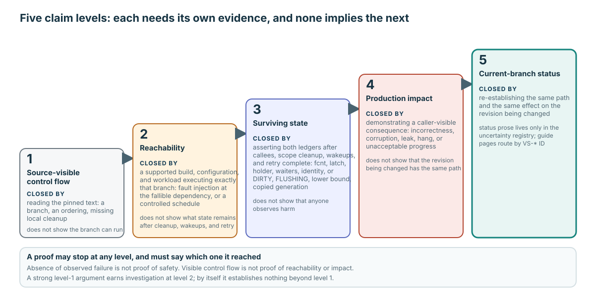

# Failure Unwind and Open Proof Obligations

**Level:** Advanced
**Prerequisites:** All Core pages: [Contract and Objects](../learning/01-contract-and-objects.md), [Fix, Hold, and Release](../learning/02-fix-hold-release.md), [Caller Completes Correctness](../learning/03-caller-completes-correctness.md), [Flush One Generation](../learning/04-flush-one-generation.md), [Replace One Frame](../learning/05-replace-one-frame.md), and [Maintainer Capstone](../learning/06-maintainer-capstone.md); plus the relevant mechanism page: [acquisition](./acquisition-concurrency.md), [replacement](./replacement-progress.md), [recovery and lifecycle](./recovery-and-lifecycle.md), or [specialized interfaces](./specialized-interfaces.md)
**Capability gained:** Turn a source-visible exceptional path into a bounded proof obligation without manufacturing a production defect claim.
**Source baseline:** `f799e05d77d5300c6ea5753b4a6cc7caee6d8912`
**Evidence used:** Verified mechanism, Inference, and Historical evidence from the [source inventory](../source-inventory.md), canonical mechanism pages, and the [uncertainty registry](../unresolved-or-version-sensitive-findings.md).

The uncertainty registry is the sole mutable status source. This page routes IDs and designs proofs; it never updates or copies their current status prose.

## Five claim levels

For every exceptional path, keep these conclusions separate:

1. **Source-visible control flow:** the pinned text contains a branch/ordering/missing local cleanup worth examining.
2. **Reachability:** a supported build/configuration/workload can execute that exact branch.
3. **Surviving state:** after callees, scope cleanup, wakeups, and retry complete, specific state remains.
4. **Production impact:** the surviving state causes caller-visible incorrectness, corruption, leak, hang, or unacceptable progress.
5. **Current-branch status:** the same path and effect exist on the revision being changed.

A proof may stop at any level. Absence of observed failure is not proof of safety, and visible control flow is not proof of reachability or impact.

Read the staircase left to right and stop where the evidence stops. Source reading closes only the first step; fault injection or a controlled schedule is the earliest seam that can reach the second; both ledgers must be asserted for the third; and the fifth is re-established on the revision being changed, with its status prose kept in the uncertainty registry.

## Route every current `VS-*` entry

Use the registry row for current wording, status, and exact evidence.

| ID | Canonical mechanism | Proof route |
|---|---|---|
| `VS-01` | [Specialized interfaces](./specialized-interfaces.md) | Repository definition/caller/link seam; never an optimization choice |
| `VS-02` | [Specialized interfaces](./specialized-interfaces.md) | Area-reader owner contract and miss behavior |
| `VS-03` | [Specialized interfaces](./specialized-interfaces.md) | Area-writer owner, fetch option, logging boundary |
| `VS-04` | [Specialized interfaces](./specialized-interfaces.md) | Declaration/definition/counter-field mapping |
| `VS-05` | [Specialized interfaces](./specialized-interfaces.md) | Approximate snapshot synchronization and authorization boundary |
| `VS-06` | [Specialized interfaces](./specialized-interfaces.md) | Comment versus executable release-path behavior |
| `VS-10` | [Acquisition](./acquisition-concurrency.md) | Cold-load fault injection plus provisional identity/owner cleanup |
| `VS-11` | [Acquisition](./acquisition-concurrency.md) and [core ownership](../learning/02-fix-hold-release.md) | Post-grant allocation fault plus both debt ledgers |
| `VS-12` | [Core flush generation](../learning/04-flush-one-generation.md) | TDE/DWB-slot faults plus both generation ledgers |
| `VS-13` | [Core flush generation](../learning/04-flush-one-generation.md) | Deferred error visibility and caller contract review |
| `VS-14` | [Acquisition](./acquisition-concurrency.md) and [replacement](./replacement-progress.md) | Controlled identity/reuse interleaving plus memory-order argument |
| `VS-15` | [Recovery and lifecycle](./recovery-and-lifecycle.md) | Build-configuration/reachable file-deallocation exit |
| `VS-16` | [Specialized interfaces](./specialized-interfaces.md) | Compile/execute diagnostic branch or resolve macro/data flow |

## Ownership-failure ledger

For acquisition/load failures, record before injection and after all cleanup:

| State | Required postcondition |
|---|---|
| **Global count** (`fcnt`) | No grant remains unless represented as caller success/retry ownership. |
| **Latch grant** | Mode/count/waiter tuple matches the return contract. |
| **Holder** | Per-thread debt equals successful acquisitions, not attempted acquisitions. |
| **Waiters** | Request removed or granted/woken exactly once; no stranded queue state. |
| **Identity** | Hash mapping, VPID, provisional BCB, and load owner agree. |
| **Retry postcondition** | Retrying can locate/load/acquire without duplicating identity or debt. |

Apply it to normal hit, lock-free hit, awakened waiter, and cold-load owner separately. Their local cleanup seams differ even though their caller contract converges.

## Flush-failure ledger

For generation failures, record:

| State | Required postcondition |
|---|---|
| `DIRTY` / `FLUSHING` | Captured G remains retryable; a concurrent G+1 survives independently. |
| **Saved lower bound** | `oldest_unflush_lsa` material is restored or transferred to the correct generation. |
| **Copied generation** | Snapshot ownership and buffer/DWB-slot lifetime are discharged. |
| **Waiters** | Flush waiters are woken or remain owned by a documented retry path. |
| **DWB/TDE/I/O ownership** | Allocation/encryption/slot/write resources have one cleanup owner. |
| **Retry postcondition** | Later flush/victim/checkpoint work can make progress without losing bytes or the WAL floor. |

Inject before snapshot, after `FLUSHING`, after protection release, at WAL, at DWB/TDE, and at direct I/O only when that position is relevant. A low-level mock that never creates the BCB flags cannot prove this ledger.

## Concurrency proof obligations

Write the required interleaving explicitly: initial identity/tuple, thread A observation, thread B transition, thread A atomic operation/recheck, and final ownership. Pair it with the memory-order argument explaining which reads/writes become visible and why reuse is excluded.

Stress without the target interleaving—and absence of observed failure—cannot close a lock-free or stale-observation obligation. Use a controlled schedule, assertions on both ledgers, and repeated stress only as supplementary evidence.

## Choose the highest relevant seam

| Claim | Verification seam |
|---|---|
| Exceptional allocator/read/crypto/write unwind | Fault injection at the exact fallible dependency, with owner-state assertions |
| Waiter, promotion, load, lock-free identity | Controlled schedule at the competing transition |
| Victim search/progress | Controlled pressure that observes an actual candidate/rejection/victim |
| Durable recovery consequence | Crash/recovery at a named WAL/DWB/home-page boundary |

Follow [Verify at the Risk Boundary](../playbooks/verify-a-change.md) and record what the seam does not observe.

## Historical evidence is not a current ticket

Historical findings are revision-bound to their recorded source/experiment. A historical row can teach a review method, but this guide does not create a current ticket from it. Re-establish source presence, reachability, surviving state, and impact on the target branch before proposing work.

## Related routes

- Practice: [interface availability](../questions/advanced.md#pgbuf-qb-053-when-is-an-exported-name-not-an-available-interface)
- Complete the core learning path: [Maintainer Capstone](../learning/06-maintainer-capstone.md)
- Select advanced context: [Acquisition](./acquisition-concurrency.md), [replacement](./replacement-progress.md), [recovery and lifecycle](./recovery-and-lifecycle.md), or [specialized interfaces](./specialized-interfaces.md)
- Design the proof: [Verify at the Risk Boundary](../playbooks/verify-a-change.md)
- Check source evidence: [Source inventory](../source-inventory.md)
- Check the sole status source: [Evidence and uncertainty registry](../unresolved-or-version-sensitive-findings.md)
