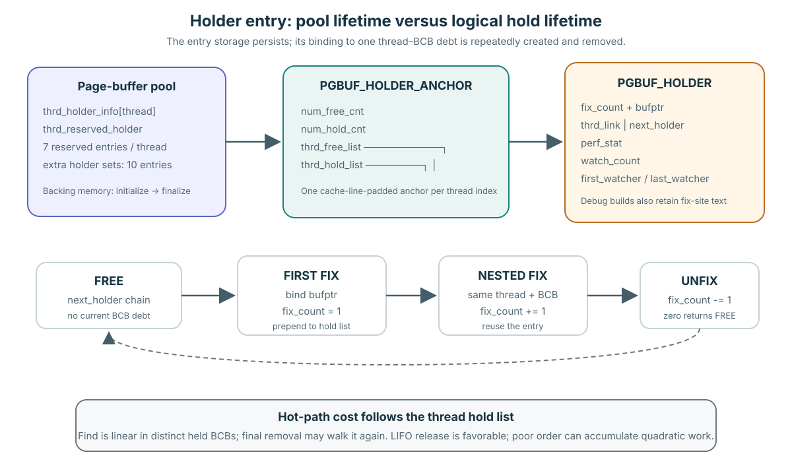
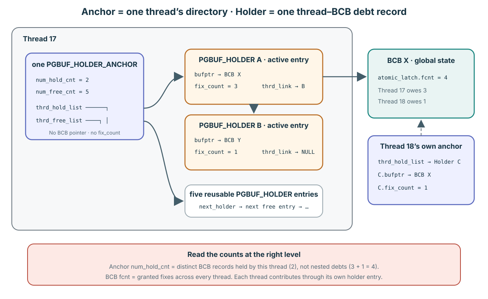
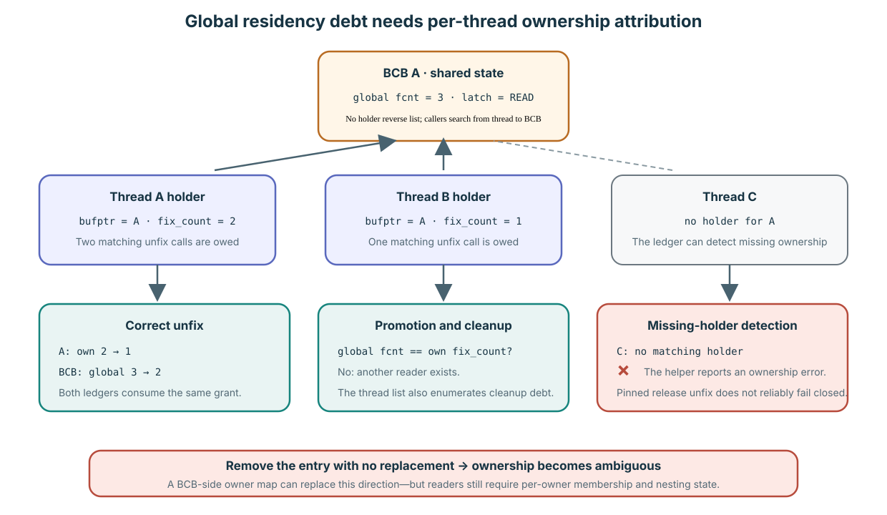

# Holder Entry Structure, Lifetime, and Unfix Cost

**Level:** Advanced
**Prerequisites:** [Fix, Hold, and Release](../learning/02-fix-hold-release.md)
**Capability gained:** Trace a `PGBUF_HOLDER` from pool initialization through nested fix and final unfix, and evaluate when holder-list work can make `pgbuf_unfix()` expensive.
**Source baseline:** `f799e05d77d5300c6ea5753b4a6cc7caee6d8912`
**Evidence used:** Verified mechanism for structure and control flow; Inference for performance consequences. No pinned runtime profile in this corpus proves a bottleneck.

## Why this needs a separate route

The Core material already establishes the two-ledger contract: a BCB's global `fcnt` counts fixes across threads, while one thread's holder `fix_count` records that thread's nested debt to one BCB. It also explains that attribution runs from each thread's holder list toward BCBs, not from a BCB to its holder threads.

That is enough to use fix/unfix correctly, but not enough to answer structure, storage lifetime, growth, list maintenance, or cost questions. This page owns those implementation details.

## Read the design questions in this order

### 1. Can the traversal become expensive?

Yes. Let `H` be the number of distinct BCBs currently held by one thread.
`pgbuf_find_thrd_holder()` starts at that thread's `thrd_hold_list` head and
follows `thrd_link`, so one lookup costs O(`H`) in the worst case. A final unfix
of a non-head entry can walk again to find its predecessor. Holding `N` new,
distinct pages without releasing earlier ones performs
`0 + 1 + ... + (N-1) = N(N-1)/2` unsuccessful comparisons, an O(`N²`)
accumulation.

That shape is a source-proven risk, not proof of a production bottleneck. The
list is thread-local, `H` is often small, and I/O, atomic-latch cache-line
contention, waiter wakeup, or LRU/flush work may dominate. Measure per-thread
hold depth and samples in `pgbuf_find_thrd_holder()` and
`pgbuf_remove_thrd_holder()` before attributing elapsed time to the ledger.

### 2. Can the representation be redesigned?

Yes. The singly linked list is policy, not an Interface contract. A per-thread
hash can provide expected O(1) lookup; an acquisition handle can identify one
release directly; a BCB-side WRITE owner plus reader map can reverse the index.
Each design must still preserve one fact: which thread owns how many nested fixes
of each BCB. WRITE needs one owner and count. Shared READ needs a set of
`<thread_id, fix_count>` records. Moving that tuple does not eliminate it.

### 3. What is the entry's size, count, and lifetime?

At the pinned source layout on the normal 64-bit ABI, a release-build
`PGBUF_HOLDER` is 56 bytes. A non-release build adds a 64 KiB `fixed_at` array
and `fixed_at_size`, making the entry roughly 65.6 KiB; exact ABI size remains a
build property. `PGBUF_HOLDER_ANCHOR` is source-asserted to exactly 64 bytes.

Initialization reserves seven entries per configured thread. Seven is a starting
capacity, not a maximum. When one thread's free list is empty, a process-wide
allocator creates sets of ten entries and hands entries to requesting threads.
There is no small compile-time maximum number of general active holders per
thread; growth stops on allocation failure or a surrounding protocol limit. The
ordered-fix helper has its own separate 64-page save-array limit and must not be
mistaken for a general holder limit.

Backing storage normally lives until page-buffer finalization. A logical binding
lives only from the first successful fix of a thread–BCB pair through the final
matching unfix. Nested fixes reuse the same entry and increase `fix_count`; final
unfix moves the entry to that thread's free list without freeing its storage.

Source: layout and constants at `src/storage/page_buffer.c:86-94,438-497`;
initial reservation and ten-entry expansion at `5922-6086`; lookup/removal at
`6090-6275`; ordered-fix's separate limit at `317-319,12284-12474`.

## Structure: one entry has two mutually exclusive list roles

At the pinned revision, `PGBUF_HOLDER` contains:

| Field group | Meaning while held | Meaning while free |
|---|---|---|
| `fix_count`, `bufptr` | Nested fixes owed by this thread to one BCB, and the BCB back-reference. | No active debt; their old values are not the free-list identity. The next grant overwrites the meaningful values. |
| `thrd_link` | Links this entry through the thread's used/hold list. | Not used to link the free list. |
| `next_holder` | `NULL` by invariant for a held entry. | Links this entry through the owning thread's free list. |
| `perf_stat` | Remembers whether the page was dirty before the hold, whether this holder dirtied it, and whether READ/WRITE latches participated. | Reinitialized when a new logical hold starts. |
| watcher fields | `watch_count`, `first_watcher`, and `last_watcher` attach ordered-watcher ownership to the same thread–BCB record. | Empty before reuse; final holder removal requires `watch_count == 0`. |
| debug fix-site fields | A non-release build can retain call-site text for outstanding fixes. | Diagnostic storage only; not part of the release contract. |

Each thread index also owns one cache-line-sized `PGBUF_HOLDER_ANCHOR`: counters plus `thrd_free_list` and `thrd_hold_list` heads. The anchor is padded to 64 bytes because these fields are hot and adjacent thread anchors must not false-share. Source: constants and structure definitions at `src/storage/page_buffer.c:86-94,127-132,438-500`; pool ownership at `src/storage/page_buffer.c:783-804`.

### How a repeated fix finds the existing entry

The anchor does not remember an entry's numeric position. `pgbuf_find_thrd_holder(thread_p, bufptr)` lazily caches the current thread's array-selected anchor in `thread_p->m_holder_anchor`, starts at that anchor's `thrd_hold_list`, compares each active `holder->bufptr` with the requested BCB address, and follows `thrd_link` until it finds a match or reaches `NULL`.

A successful same-thread fix of the same BCB increments the matching entry's `fix_count`; it does not create another entry or change `num_hold_cnt`. A fix of a different BCB creates a new active entry and prepends it to the list. Consequently, `num_hold_cnt` counts distinct active thread–BCB records, not the sum of nested fix debts. Another thread fixing the same BCB uses its own anchor and its own holder, while the BCB's global `fcnt` combines both threads.

There is no per-thread holder hash table or BCB-owned reverse holder list in this path, so lookup is O(`H`) in the number of distinct BCBs held by that thread. Source: exact traversal at `src/storage/page_buffer.c:6090-6126`; normal match/allocate branches at `6494-6531`; resident READ fast path at `7753-7782`.

## Why an ownership ledger is necessary

The BCB's global `fcnt` and the per-thread holder solve different problems. Global `fcnt` tells replacement and latch code how many granted fixes exist across all threads. It cannot attribute those grants. If `fcnt == 3`, the BCB alone cannot distinguish “Thread A owns two and Thread B owns one” from three other ownership distributions.

That attribution is required because the public release operation receives a `THREAD_ENTRY` and `PAGE_PTR`, not a unique acquisition token. The Module must reconstruct whether this caller owns the corresponding BCB and how many nested calls it still owes:

| Required decision | Why global BCB state is insufficient | Holder responsibility |
|---|---|---|
| Matching unfix | A positive `fcnt` proves only that somebody has debt. Decrementing it for a non-owner would consume another thread's grant. | A matching `bufptr` identifies this caller's debt; `fix_count` consumes one of this thread's nested grants. A missing holder lets the helper produce `ER_PB_UNFIXED_PAGEPTR`, subject to the release-path caveat below. |
| Reentrant acquisition and promotion | Global latch mode and total do not reveal the caller's existing share. | Holder presence identifies an existing owner. Comparing global `fcnt` with holder `fix_count` tells promotion whether this thread owns all current fixes or other readers exist. |
| Request-end cleanup | A pool scan can find fixed BCBs but cannot assign their nested debts to the terminating request's thread. | `pgbuf_unfix_all()` enumerates that thread's hold list as the cleanup and diagnostic safety net. |
| Ordered multi-page fixing | A global count cannot reconstruct which pages and watcher relationships belong to this thread when pages must be conditionally released and re-fixed. | `pgbuf_ordered_fix()` walks the thread's holders and preserves per-binding watcher/rank information. |
| Per-owner diagnostics | BCB state can report a total and latch mode, not the acquisition sites or which holder dirtied the page. | Holder statistics, watcher links, and debug fix-site fields attach observations to the owning thread–BCB binding. |

Removing the entry without replacing its information would therefore leave global replacement protection but break caller-specific ownership accounting. The same `PAGE_PTR` may have been returned by multiple nested fixes and may also be held by other threads; pointer equality and global `fcnt` do not provide a release ledger.

### Release-build misuse detection boundary

The holder is used in release builds, but that does not mean every fix/unfix programming error is prevented:

- **Missing unfix:** the per-thread holder and global `fcnt` remain. The leaked ownership can keep the BCB out of replacement. At request termination, release `pgbuf_unfix_all()` repeatedly unfixes entries from that thread's list; non-release code asserts and reports them. This is delayed cleanup/diagnosis, not prevention at the faulty call site.
- **Extra or wrong-thread unfix:** `pgbuf_unlatch_thrd_holder()` detects the missing caller entry and returns `ER_PB_UNFIXED_PAGEPTR`. In the pinned ordinary release flow, however, `pgbuf_unfix()` does not fail closed on that result: the lock-free READ path has no holder-status parameter, while `pgbuf_unlatch_bcb_upon_unfix()` decrements global `fcnt` before its later `holder_status` check. The old `PAGE_PTR` is already invalid after the final valid unfix and may refer to a reused BCB. Holder detection therefore does not make double-unfix safe.

The accurate separation is: holder attribution is part of normal release semantics; extra fix-site tracking, pointer validation, and assertions are debug aids; robust misuse rejection is a separate proof obligation. Current status is owned by [`VS-17`](../unresolved-or-version-sensitive-findings.md#b-current-pinned-revision-cleanup-and-proof-obligations).

The linked list itself is not mandatory. A per-thread hash keyed by BCB could reduce lookup cost; an explicit acquisition handle could make each fix return a release token; a BCB-owned reverse map could record every owner. But each alternative preserves equivalent attribution and introduces its own memory, synchronization, cleanup, and API obligations. The legitimate design question is “which ownership-ledger representation should we use?”, not “can ownership knowledge disappear?”

### Could owner records move into each BCB?

Yes. For WRITE mode, a single `write_owner_thread_id` plus global `fcnt` could identify the exclusive owner and its total nested count. That is enough to replace the current forward lookup for WRITE re-entry.

READ mode permits multiple simultaneous owners. A BCB-side design therefore needs a reader set. If nested fixes remain legal, membership alone is insufficient: after A fixes twice and unfixes once, A must remain in the set; after its second unfix, A must leave it. The BCB-side representation naturally becomes a map from thread ID to nested count. It has moved the core `PGBUF_HOLDER` tuple into a shared reverse index rather than erased it.

| Representation | Benefit | Cost or semantic change |
|---|---|---|
| Current per-thread linked list | Thread-local ownership updates, compact small-`H` case, direct iteration for ordered fixing. | O(`H`) lookup by BCB; no direct “who owns this BCB?” query. |
| Per-thread hash plus iterable list | Expected O(1) lookup while retaining forward ownership and ordered enumeration. | Additional memory, rehash/lifecycle logic, and two-structure consistency. |
| BCB-side WRITE owner plus reader map | Direct BCB-to-owner lookup. | Shared map updates on READ fix/unfix, synchronization/allocation at the hot BCB, and still one count per nested reader owner. |
| Explicit acquisition handle | Exact release token can eliminate lookup for an individual unfix. | API-wide change; re-entry, promotion aggregation, and watcher ordering still need ownership grouping. |

The BCB does not reverse-reference holders at the pinned revision. It owns global `atomic_latch.fcnt` and waiter/latch state. `pgbuf_find_thrd_holder(thread_p, bufptr)` searches from the caller's anchor to a matching `bufptr`; victimization asks only whether global ownership remains and never enumerates holder threads. `latch_last_thread` is only the most recent grantee, not an authoritative current-owner field and not a replacement for a multi-reader set.

### Consumer survey: core, policy, legacy, and debug uses

| Consumer | Classification | Source-visible use |
|---|---|---|
| Normal grant and latch promotion | General-protocol behavior | Holder presence controls re-entry versus blocking; holder count is compared with/subtracted from global `fcnt`, saved across a blocking promotion, and restored after wakeup. |
| Ordered fix and ordered callback | Specialized protocol behavior | The thread list is enumerated; watcher/rank/latch/count state is saved while pages are released, sorted, and re-fixed. |
| Allocation high-priority classification | Progress policy | Held BCBs are scanned for waiters and important hot page types. This affects direct-victim wait priority, not basic ownership correctness. |
| Dirty/unfix holder statistics | Observability | Per-owner dirtied/read/write history feeds performance metrics and can be redesigned without changing basic residency safety. |
| `pgbuf_unfix_all()` | Legacy cleanup | Its own comment says outstanding pages should not exist at request termination and the system should eventually prevent the situation. It is a safety net, not the architectural reason for the ledger. |
| `fixed_at`, tracker, validation, assertions | Debug support | These augment the release fields only in non-release/debug configurations. |

The codebase also contains a useful counterexample: `pgbuf_simple_fix()`/`pgbuf_simple_unfix()` use only global `fcnt`. Their warning restricts them to temporary-file reads, notes that a writer makes the scheme unsafe, and forbids mixing them with general FIX/latch. A holder is therefore not intrinsic to residency counting. It is required by the current general protocol's richer owner-sensitive latch, promotion, and ordered-watcher semantics.

Source: holder/BCB fields at `src/storage/page_buffer.c:460-535`; holder-free simple protocol at `2688-2811`; caller-aware promotion at `2850-3024` and grant at `6312-6634`; missing-holder detection and nested decrement at `6128-6184`; ordinary unfix at `3062-3201` and global decrement at `6636-6703`; legacy cleanup at `3277-3357`; progress classification at `11705-11785`; ordered fixing/callback at `12250-13350`; watcher attachment through the holder at `13613-13709`.

## Detailed lifecycle: storage and one binding

### Backing-storage lifetime

`pgbuf_initialize_thrd_holder()` runs during page-buffer initialization. It allocates one 64-byte anchor per configured thread and reserves seven `PGBUF_HOLDER` entries per thread (`PGBUF_DEFAULT_FIX_COUNT == 7`). Every thread starts with those seven entries on its free list and an empty hold list. On the pinned 64-bit layout, the release entry is 56 bytes; non-release builds add the 64 KiB fix-site buffer described above.

If a thread has more than seven distinct held BCBs, `pgbuf_allocate_thrd_holder_entry()` takes an entry from a process-wide expansion set. Expansion is serialized by `free_holder_set_mutex` and allocates `PGBUF_NUM_ALLOC_HOLDER == 10` entries at a time. Ten is the allocation batch size, not a per-thread cap. Once an entry is assigned and later released, it goes to that thread's free list. Reserved storage and every expansion set remain allocated until `pgbuf_finalize()` frees the pool; an individual final unfix does not free heap memory.

Source: initialization call at `src/storage/page_buffer.c:1641-1778`; holder initialization at `src/storage/page_buffer.c:5922-5994`; expansion at `src/storage/page_buffer.c:6000-6085`; teardown at `src/storage/page_buffer.c:1921-2003`.

### Logical hold lifetime

One entry's logical binding is shorter:

1. `pgbuf_latch_bcb_upon_fix()` or the lock-free READ hit first searches the current thread's hold list with `pgbuf_find_thrd_holder()`.
2. If no entry points to this BCB, `pgbuf_allocate_thrd_holder_entry()` pops the thread free-list head (or expands), prepends the entry to the hold list, and the grant path sets `bufptr`, `fix_count = 1`, latch/dirty statistics, and empty watcher state.
3. A nested fix by the same thread on the same BCB reuses that entry and increments `fix_count`; it does not allocate a second holder.
4. Watcher helpers attach and detach watcher objects through the same entry. Blocking promotion may remove and later recreate a holder because ownership is temporarily released.
5. `pgbuf_unfix()` calls `pgbuf_unlatch_thrd_holder()`, which finds the entry and decrements `fix_count`. A positive count keeps the binding live. Zero calls `pgbuf_remove_thrd_holder()`, which removes the entry from the hold list and pushes it onto that thread's free list.

The backing address can therefore survive many unrelated logical holds. A holder pointer is not a permanent page identity, just as a `PAGE_PTR` address is not one.

Source: find/decrement/remove at `src/storage/page_buffer.c:6098-6275`; normal grant maintenance at `src/storage/page_buffer.c:6298-6634`; lock-free READ grant at `src/storage/page_buffer.c:7735-7798`; normal unfix at `src/storage/page_buffer.c:3062-3201`; watcher lookup at `src/storage/page_buffer.c:13673-13699`.

## Detailed cost derivation for fix and unfix

**Short answer:** yes, the concern is mechanically plausible for some ownership shapes, but it is not proven for a workload merely because many fixes and unfixes occur.

Let `H` be the number of distinct BCBs currently held by one thread. The per-thread hold list is singly linked and has no BCB-to-holder index:

| Unfix work | Source-visible cost |
|---|---|
| Find the holder | `pgbuf_unlatch_thrd_holder()` calls `pgbuf_find_thrd_holder()`: up to `H` pointer comparisons. |
| Consume a nested debt | Decrement `fix_count`; if it stays positive, the holder remains where it was. |
| Remove the final debt | Unless the entry is the hold-list head, `pgbuf_remove_thrd_holder()` walks from the head again to find its predecessor: up to another `H` links. |
| Release global ownership | Every call decrements the atomic BCB `fcnt`. Compatible READ release can use `pgbuf_lockfree_unfix_ro()` only when the latch is READ, there are no waiters, and global `fcnt > 1`. Other cases take the BCB mutex. |
| Handle global zero | The last global release may wake waiters and execute zone placement, promotion, direct-victim, or async-flush work. This is separate from holder-list complexity. |

First-time acquisition also matters. Fixing `N` distinct pages without releasing earlier ones performs 0, 1, 2, …, `N−1` unsuccessful comparisons: every new BCB lookup must reach the end before it can allocate and prepend an entry. The total is `N(N−1)/2`, or O(`N²`), even if later release order is favorable.

Release order changes the additional cost. New holder entries are prepended, so releasing in LIFO order usually finds and removes the head. Releasing old entries while many newer ones remain, or repeatedly fixing/unfixing an older held page, repeatedly scans a long list; releasing a large set in an unfavorable order can add another O(`N²`) traversal pattern. Repeated nested fixes of the only held page are O(1), and repeated fixes of the current head are also cheap. Reusing a non-head entry does not grow the list, but still costs as many comparisons as its current position.

The list is thread-local, so this traversal does not create cross-thread list-lock contention; its direct costs are instructions and cache accesses. The seven per-thread reserved entries are consistent with a common expected shape of few simultaneous distinct holds, but they are not a hard limit or proof that `H` is small in a particular workload. Extension sets provide more entries.

Two workload shapes are easy to conflate. **One thread holding many distinct pages** stresses the linear holder list. **Many threads fixing the same page** gives each thread its own holder—often at a short-list position—but makes them update the same BCB `atomic_latch` cache line; compatible READ unfix uses a compare/exchange loop and may suffer cache-line contention even when it avoids the BCB mutex. The last owner, a waiter, a WRITE latch, or an asynchronous-flush request takes the slower protected path. Repeated fixes of the same page by one thread still use one holder entry; nested call count increases debt, not list length.

The claim therefore makes sense when a profile shows all three ingredients: many distinct outstanding BCBs per thread, an unfavorable access/release order, and substantial samples in `pgbuf_find_thrd_holder()` or `pgbuf_remove_thrd_holder()` beneath `pgbuf_unfix()`. It makes less sense when `H` is small, access is LIFO, or time is actually dominated by BCB contention, waiter wakeup, LRU movement, flush, or debug/performance instrumentation.

This is an **Inference from pinned data structure and control flow**, not a Runtime observation. Before redesigning the ledger, measure list depth and CPU samples in a controlled reproduction, then preserve nested-debt correctness, request-end cleanup, watcher ownership, promotion/retry behavior, allocation-failure unwind, and thread-local ownership.

Source: unfix entry at `src/storage/page_buffer.c:3062-3201`; linear find/remove at `src/storage/page_buffer.c:6098-6275`; BCB decrement and zero-crossing work at `src/storage/page_buffer.c:6636-6883`; lock-free READ unfix at `src/storage/page_buffer.c:7807-7835`.

## Maintainer checklist

- Distinguish entry storage lifetime from one thread–BCB binding lifetime.
- Count one holder per distinct BCB held by a thread, not one holder per nested fix.
- Treat `thrd_link` and `next_holder` as mutually exclusive list roles.
- Include watcher emptiness before final removal.
- Attribute linear lookup/removal only to the per-thread value `H`, not to global buffer-pool size.
- Separate holder-list cost, atomic BCB release, BCB-mutex contention, and zero-crossing LRU/flush work in any bottleneck claim.
- Label unprofiled performance conclusions as Inference.

## Related routes

- Practice: [Acquisition concurrency questions](../questions/advanced.md#acquisition-concurrency)
- [Fix, Hold, and Release](../learning/02-fix-hold-release.md)
- [Acquisition Concurrency and Multi-page Ownership](./acquisition-concurrency.md)
- [Change the Module Safely](../playbooks/change-safely.md)
- [Source and Caller Map](../reference/source-map.md)
