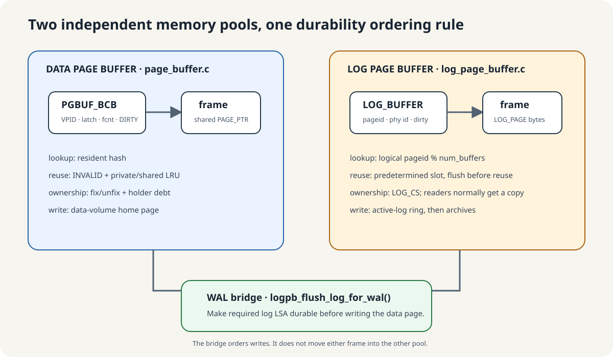
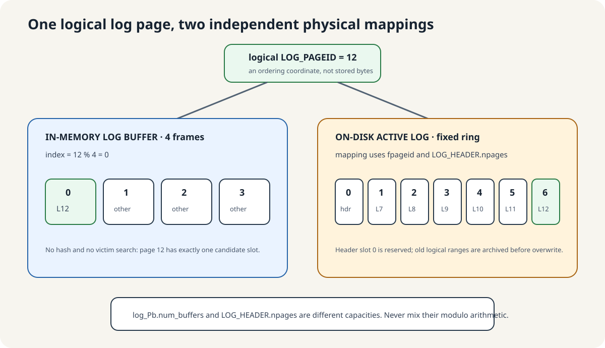
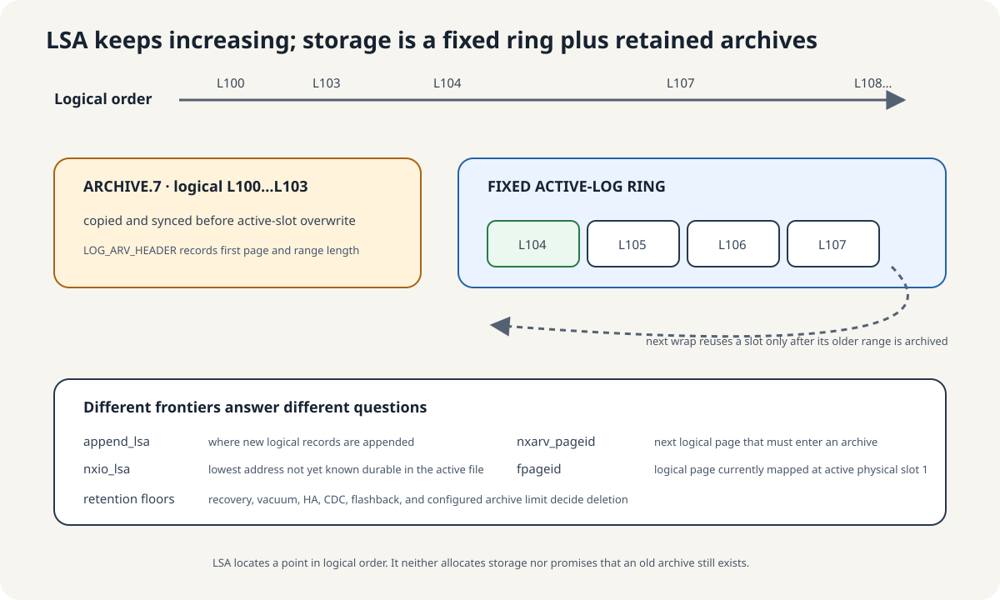
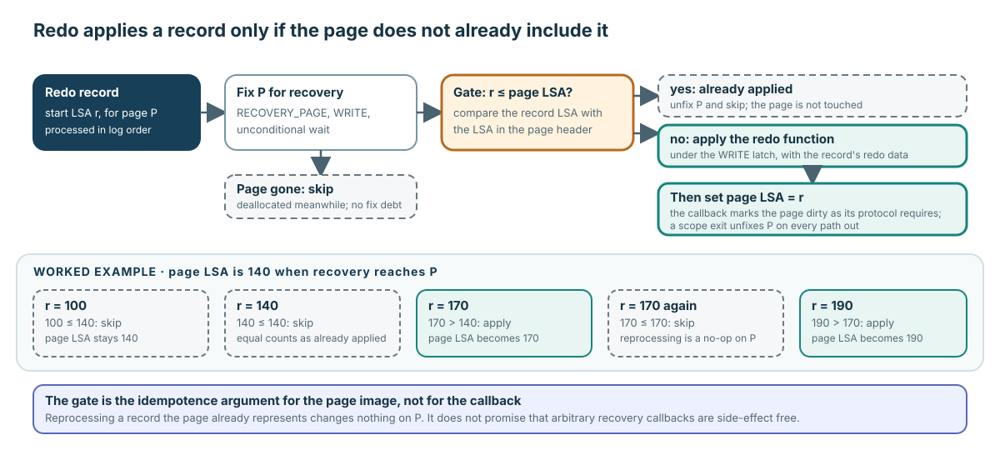
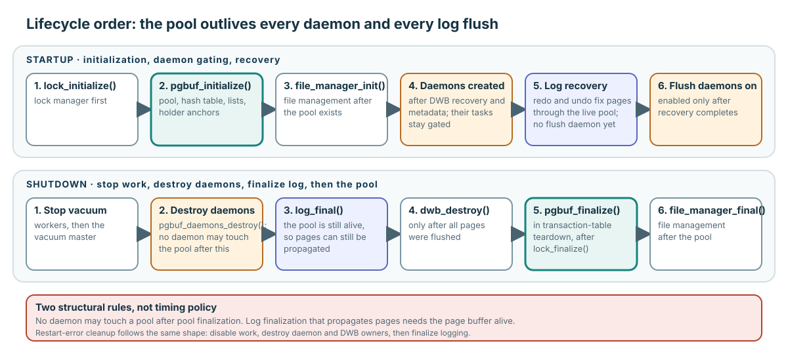

# Recovery, Allocation State, and Module Lifecycle

**Level:** Advanced
**Prerequisites:** [Caller Completes Correctness](../learning/03-caller-completes-correctness.md) and [Flush One Generation](../learning/04-flush-one-generation.md)
**Capability gained:** Connect checkpoint, redo, allocation state, and module lifetime to caller ownership, generation, identity, and idempotence invariants.
**Source baseline:** `f799e05d77d5300c6ea5753b4a6cc7caee6d8912`
**Evidence used:** Verified mechanism, Implementation policy, and Runtime observation from the [pinned-source inventory](../source-inventory.md), exact source ranges below, and the [same-revision caller survey](../../../pgbuf-analysis/f799e05_claude/analysis/research/caller-use-cases.md).

## Data pages and log pages use different buffer pools

`src/transaction/log_page_buffer.c` does not reuse the data-page BCB pool. The two modules coordinate at checkpoint and WAL boundaries, but their descriptors, lookup rules, ownership, replacement, and disk homes are separate.



| Question | Data page buffer | Log page buffer |
|---|---|---|
| Resident descriptor | `PGBUF_BCB` | `LOG_BUFFER` with logical page ID, active-file physical ID, dirty bit, and `LOG_PAGE *` |
| Memory lookup | resident hash by `VPID` | direct slot `logical_pageid % log_Pb.num_buffers` |
| Caller ownership | shared frame pointer plus fix/unfix debt and holder entry | readers normally receive a copy in caller-owned `LOG_PAGE` storage; no per-page BCB fix ledger |
| Protection | per-BCB READ/WRITE latch and mutex | log critical section plus narrower append/flush/archive synchronization |
| Reuse | choose an eligible BCB through INVALID/LRU policy | the modulo formula has already chosen the slot; make that predetermined reuse safe |
| Disk home | a data-volume page | a slot in the active-log ring or a page in an archive file |

The source sometimes calls the current append log page “fixed.” `LOG_BUFFER` has no `fcnt`, holder list, waiter queue, resident hash, or LRU links. Here “fixed” means that the append protocol retains its current frame under log synchronization, not that it borrowed a `PGBUF_BCB` frame.

At the pinned defaults, `log_buffer_size` is 16,384 pages. With the default 16 KiB log page size, its frame area is 256 MiB, excluding descriptors, the extra header page, scratch state, and other metadata. This memory is separate from the default 512 MiB data page buffer. An existing database records its actual log page size, so maintainers should inspect its header instead of assuming 16 KiB.

Source: `LOG_BUFFER` and pool state at `src/transaction/log_page_buffer.c:191-279`; pool initialization at `545-628`; parameter defaults at `src/base/system_parameter.c:1336-1357,5451-5457`.

## Direct mapping replaces BCB lookup and victim selection

For every non-header log page, the in-memory frame index is:

```text
index = logical_pageid % log_Pb.num_buffers
```

With four frames, logical pages 0–3 occupy slots 0–3 and page 4 reuses slot 0. There is no search for a “best” victim. On a hit, `logpb_locate_page()` returns the predetermined frame. On a collision, it invalidates the old identity; a dirty collision is unexpected and has a defensive flush path. A new page is initialized in place, while an old page is read from the active log or an archive.



The append protocol normally prevents a dirty collision. Modified append-page pointers enter the logically ordered `toflush[]` array. It has one pointer slot per log buffer but a usable maximum of `num_buffers - 1`; reaching that threshold forces `logpb_flush_all_append_pages()` before direct mapping can wrap onto an unflushed append page. After a successful flush, the array is cleared and the still-current append page is retained.

This memory mapping must not be confused with the second mapping into the on-disk active-log ring. `log_Pb.num_buffers` determines an in-memory cache slot. `LOG_HEADER.npages` and `fpageid` determine an active-file physical data slot. They can have different sizes.

Source: direct mapping and locate path at `src/transaction/log_page_buffer.c:375-384,788-916`; flush-list capacity and forcing at `10897-10927,2715-2738,3802-3823`.

## Append, flush, and reader ownership

A log record first exists in a `LOG_PRIOR_NODE` staging list. Appending assigns its logical LSA and later copies its header and undo/redo bytes into the current `LOG_PAGE`. Crossing a page boundary advances `append_lsa.pageid`, creates the next direct-mapped frame, and retains the modified append pages in `toflush[]`.

`logpb_flush_all_append_pages()` writes that ordered set with an end-of-log safety rule. It batches successive pages, writes pages after the `nxio_lsa` page first, writes the boundary page last, synchronizes the active-log file, and advances `nxio_lsa`, the lowest LSA not yet known to be on disk. This is why `dirty` alone is insufficient: append order and the durable tail boundary matter to recovery.

Ordinary log reading does not expose a shared frame that must later be unfixed. `logpb_fetch_page()` normally copies resident or on-disk bytes into caller-provided `LOG_PAGE` storage. A recovery reader may populate the direct-mapped pool as a forward-read optimization, but its returned working page is still the caller's copy. The append path is the special writer path that directly retains and changes the current pool frame under the log protocol.

Source: staged records at `src/transaction/log_append.hpp:90-129`; materialization at `src/transaction/log_page_buffer.c:3033-3124`; flush order at `3225-3823`; copy semantics at `1726-1793,1856-1989`.

## The active log is a fixed ring; archives carry older ranges

The logical log is long, but the active log file does not grow once per record. It has physical page 0 for `LOG_HEADER` and a fixed number of data-log slots. `logpb_to_physical_pageid()` maps ever-increasing logical page IDs into those slots relative to `fpageid`.

At the pinned creation default:

```text
log_volume_size = 512 MiB
512 MiB / 16 KiB = 32,768 physical pages
= 1 header page + 32,767 active data-log slots
```

Before the ring overwrites a slot containing an older logical range, `logpb_archive_active_log()` copies and synchronizes that range into a numbered archive, then advances the archive frontier. Background archiving incrementally fills a temporary archive to spread this archive I/O over time; it is not the data-page double-write buffer.



Four frontiers answer different questions:

| Field | Question answered |
|---|---|
| `append_lsa` | Where is the next/current logical append position? |
| `nxio_lsa` | What is the lowest address not yet known durable in the active file? |
| `nxarv_pageid` | Which logical page must be archived next before ring reuse? |
| `fpageid` | Which logical page currently maps to active physical slot 1? |

An LSA is the logical coordinate `(logical page ID, offset)`. It orders and names a log position; it does not allocate disk space or promise that its bytes are still retained. The pinned representation has a positive 47-bit page-ID range, roughly 2 EiB of address span at 16 KiB pages, but that is an address-width observation rather than a supported database-size promise. Old bytes remain readable only while present in the active ring or retained archives. Archive disk use may grow, while deletion policy must also respect recovery, vacuum, HA/log-copy, CDC, flashback, and configured-retention floors.

Source: active-ring header at `src/transaction/log_storage.hpp:112-174`; mapping at `src/transaction/log_page_buffer.c:4939-4982`; archive transition at `5640-5887`; retention at `5991-6210`; LSA width at `src/transaction/log_lsa.hpp:35-72`.

## WAL is the bridge between the two pools

A dirty data page stores the LSA of the newest logged change represented in its bytes. Before its BCB frame reaches the data-volume home, the data-page flush path calls `logpb_flush_log_for_wal()` with that page LSA. If the requested LSA is at or beyond `nxio_lsa`, the log subsystem flushes and synchronizes append pages first. Only then may the data page write proceed.

```text
data page wants to reach its home volume
                 |
                 v
is page LSA at or beyond nxio_lsa?
       | no                         | yes
       v                            v
log is already durable enough   flush/sync append log pages
       |                            |
       +-------------+--------------+
                     v
              write data page
```

WAL orders the two writes. It does not copy a data page into the log buffer or give a log page a BCB.

Source: data-page side at `src/storage/page_buffer.c:10781-10849`; log durability gate at `src/transaction/log_page_buffer.c:4150-4189,11251-11267`. Full evidence: [CUBRID log page buffering from first principles](../reference/log-page-buffer-first-principles-audit.md).

## Checkpoint is selective coordination

Checkpoint is a selective page-buffer flush plus ordered log, filesystem, and metadata boundaries—not “flush every page.” The pinned `logpb_checkpoint()` path:

1. flushes append-log state and appends a start-checkpoint marker;
2. invokes selective page-buffer flush up to a checkpoint boundary, receiving the remaining redo floor;
3. performs filesystem synchronization;
4. records active transaction/system-operation state in the end-checkpoint record and persists log/header state;
5. records checkpoint metadata in permanent volume headers and synchronizes through the configured DWB boundary.

The page-buffer step chooses qualifying dirty pages and reports what remains; other layers own WAL, filesystem synchronization, checkpoint records, and volume metadata. Source: `src/transaction/log_page_buffer.c:6901-7406`.

## Redo: page-LSA idempotence under recovery ownership

The generic synchronous path preserves this sequence:

1. Fix with `RECOVERY_PAGE`, WRITE, unconditional. Recovery-specific fetch accepts allocation states that ordinary `OLD_PAGE` validation may reject.
2. Compare the record LSA with the page LSA. If already applied, unfix and skip.
3. Apply the selected recovery function under the fixed page’s protection.
4. Set the page LSA to the record LSA, mark the result dirty as the recovery callback/protocol requires, and release on every exit through scope cleanup.

This page-LSA gate is the idempotence argument: reprocessing an already represented log record does not apply its page change twice. It is not a general promise that arbitrary recovery callbacks are side-effect free.



The comparison direction matters: a record whose LSA is less than or equal to the page LSA is treated as already applied, so a record equal to the page LSA is skipped, not reapplied. A page that no longer exists because it was deallocated after the record was written is also skipped, and that skip creates no fix debt.

Source: gate at `src/transaction/log_recovery.c:497-536`; fetch semantics at `src/transaction/log_recovery.c:6407-6431`; apply/LSA/cleanup at `src/transaction/log_recovery_redo.hpp:587-668`.

### What “release through scope cleanup” means

This is ordinary lexical C++ lifetime cleanup, not a recovery phase, background worker, commit, or later callback. In `log_rv_redo_record_sync()`, the local `LOG_RCV rcv` owns `rcv.pgptr`. After the fix/gate helper says redo work should continue, the function constructs a local `scope_exit unfix_rcv_pgptr` below `rcv`. The guard captures `thread_p` and `rcv` by reference. When execution leaves that function scope, the guard's destructor invokes:

```cpp
pgbuf_unfix_and_init_after_check (thread_p, rcv.pgptr);
```

That helper checks whether `rcv.pgptr` is non-null, calls `pgbuf_unfix()` once when it is, and then assigns `NULL`. The declaration order matters: the guard is destroyed before the earlier-declared `rcv`, so its references are still valid. The same destructor path runs after the normal fall-through and after the explicit early return caused by redo-data extraction failure. If a recovery callback deliberately leaves `rcv.pgptr == NULL`, the helper is a no-op.

The guard is created only after the initial fix/gate helper returns true. Paths that return before its construction must already leave `rcv.pgptr == NULL`; the code asserts that postcondition. The guard does not mark the page dirty by itself and does not decide whether redo applies. It only guarantees the final fix-debt cleanup for the pointer value present at scope exit.

Source: guard use at `src/transaction/log_recovery_redo.hpp:601-668`; null-safe unfix-and-clear macro at `src/storage/page_buffer.h:64-71`; `scope_exit` destructor and release semantics at `src/base/scope_exit.hpp:28-80`.

## Allocation and special fetch modes stay with their owners

Page buffer materializes an identity supplied by a caller; it does not decide logical allocation. File/disk callers allocate or deallocate identities and choose `NEW_PAGE`, ordinary modes, or bypass-I/O coherence steps. Recovery callers choose recovery-specific modes such as `RECOVERY_PAGE`, `OLD_PAGE_DEALLOCATED`, or `OLD_PAGE_MAYBE_DEALLOCATED` because they own redo/undo knowledge.

Temporary modes and temporary LSAs likewise belong to file/disk/log owner protocols. Do not generalize their relaxed logging/validation behavior to ordinary permanent pages.

Representative allocation ordering: `src/storage/file_manager.c:5420-5590`. Recovery-specific page callbacks: `src/storage/page_buffer.c:14896-14921,15133-15303`.

## Invalidation and deallocation ownership

Use the canonical [victimization, invalidation, unfix, flush, and logical-deallocation distinctions](../learning/05-replace-one-frame.md#similar-verbs-different-operations) before tracing this lifecycle route. This page extends only the owner boundary: file/disk/recovery code decides logical allocation state, while page-buffer invalidation is the required coherence consequence for a resident mapping.

For Logical deallocation, review the file/disk/recovery decision first and then the page-buffer coherence consequence; do not reconstruct those operation definitions here.

Raw/bypass writes require coherence: cached pages must not silently survive an external reset. File/disk protocols flush/invalidate as applicable before raw overwrite. See `src/storage/disk_manager.c:721-811` and the [core identity contract](../learning/01-contract-and-objects.md).

## Lifecycle dependency order

The pinned dependency chain is initialization → daemon gating → recovery → shutdown → log finalization → page-buffer finalization.



The two chains are mirror images around the pool: the pool is created right after the lock manager and torn down right before file management, daemons are created gated and destroyed before log finalization, and `log_final()` runs while the pool is still alive because finishing the log can still propagate pages.

### Initialization and recovery

Transaction-table setup initializes the lock manager, then `pgbuf_initialize()`, then file management. Boot invokes that setup before database mounting/recovery. During restart, DWB recovery and module metadata become ready before page-buffer/DWB daemons are created; their tasks remain gated. Only after log recovery completes does boot enable flush daemons.

Source: `src/transaction/log_tran_table.c:468-512`, `src/transaction/boot_sr.c:1974-2801`, and daemon gates at `src/storage/page_buffer.c:16996-17136`.

### Shutdown and failure cleanup

Normal shutdown stops vacuum/background ownership, destroys page-buffer daemons, calls `log_final()` while the pool still exists, then tears down DWB/pool dependencies. Transaction-table teardown later calls `pgbuf_finalize()` before file-manager finalization. Restart-error cleanup disables work before destroying daemon/DWB owners and finalizing logging.

Source: `src/transaction/boot_sr.c:3055-3113`, restart cleanup within `src/transaction/boot_sr.c:2740-2800`, page-buffer daemon destruction at `src/storage/page_buffer.c:17244-17255`, and transaction-table teardown at `src/transaction/log_tran_table.c:580-594`.

The ordering rule is structural: no daemon may touch a pool after pool finalization, and log finalization that propagates pages needs the page buffer alive.

## Crash and persistence evidence boundary

Existing checkpoint/backup-like observations are bounded evidence. This evidence does not prove crash redo, per-page WAL ordering, DWB recovery, torn-page handling, or home-page persistence. Source tracing establishes intended gates and cleanup; a Runtime observation requires controlled crash points and post-restart state validation at the claimed boundary. Use [Verify at the Risk Boundary](../playbooks/verify-a-change.md).

## Related routes

- Practice: [special fetch and metadata ownership](../questions/advanced.md#pgbuf-qb-044-who-owns-special-fetch-and-metadata-mutation-protocols)
- Core prerequisite: [Caller Completes Correctness](../learning/03-caller-completes-correctness.md)
- Core prerequisite: [Flush One Generation](../learning/04-flush-one-generation.md)
- Identity contract: [Contract and Objects](../learning/01-contract-and-objects.md)
- Plan validation: [Verify at the Risk Boundary](../playbooks/verify-a-change.md)
- Locate symbols and callers: [Source and Caller Map](../reference/source-map.md)
