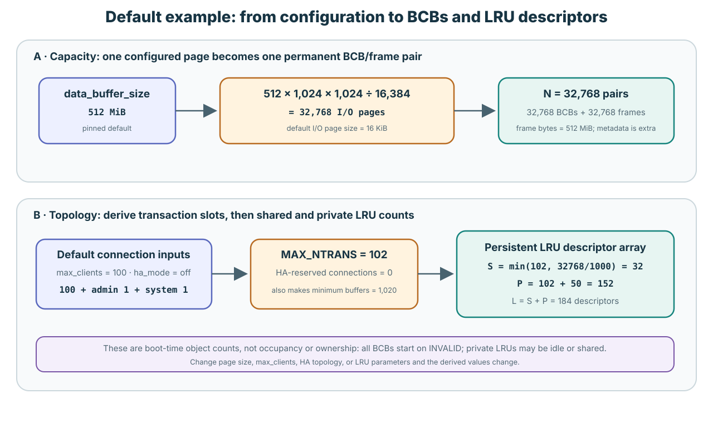
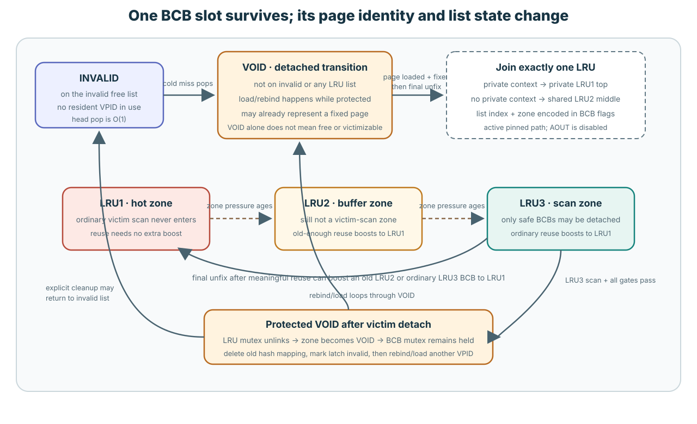
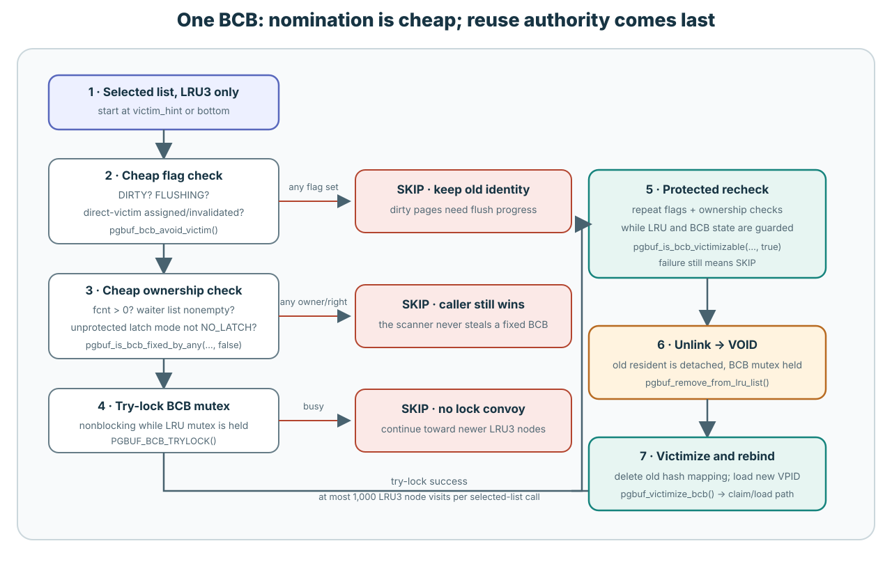
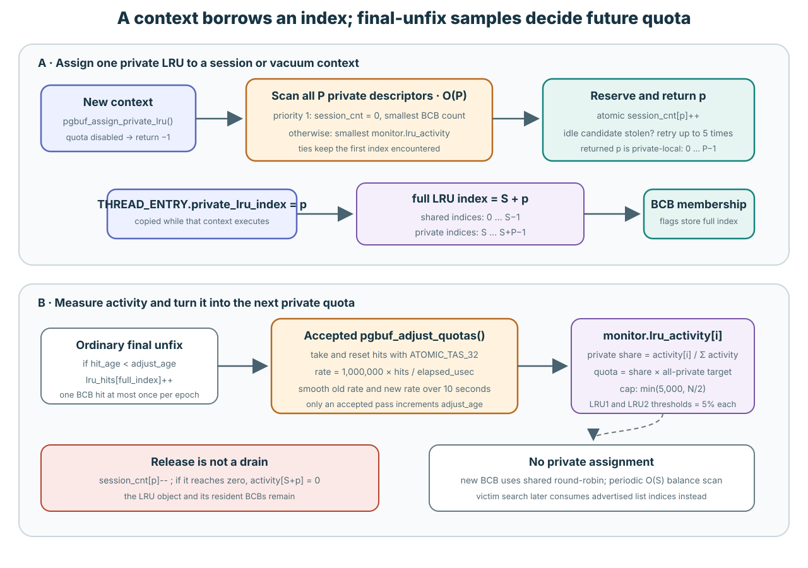

# Replacement Policy and Background Progress

**Level:** Advanced
**Prerequisites:** [Flush One Generation](../learning/04-flush-one-generation.md) and [Replace One Frame](../learning/05-replace-one-frame.md)
**Capability gained:** Follow one BCB from a cold miss through list placement, aging, victim selection, detach, and reuse; explain how private-list assignment and activity change where CUBRID searches.
**Source baseline:** `f799e05d77d5300c6ea5753b4a6cc7caee6d8912`
**Evidence used:** Verified mechanism and Implementation policy from pinned CUBRID source. The available runtime observations did not force an eviction. Historical evidence at `5cd4f860e` is used only as a revision-bound navigation aid in the [older replacement fact sheet](../../../pgbuf-analysis/research/cubrid-lru-victim.md).

## Begin with the reason replacement runs

A requested VPID is not in memory. CUBRID needs one BCB/frame slot into which it
can load that page.

It first asks, “Is there a slot that represents no resident page?” If there is,
it uses that slot immediately. Only when every such slot is gone does it ask,
“Which resident page can I remove?”

That gives the whole algorithm in one sentence:

> Take a BCB from the invalid list if possible; otherwise choose one LRU list,
> inspect the cold part of that list, and detach the first BCB that is still safe
> to overwrite when its current state is checked under protection.

The [Core replacement page](../learning/05-replace-one-frame.md#hard-eligibility)
explains why a fixed, dirty, flushing, or waiter-bearing BCB cannot be reused.
This page applies those conditions to the complete CUBRID search.

## Put real default numbers on the picture

The pinned defaults give a useful scale before we discuss policy. This example
assumes the ordinary server defaults: `data_buffer_size = 512M`, the default
16 KiB I/O page size, `max_clients = 100`, and `ha_mode = off`.



### 32,768 BCB/frame pairs

`data_buffer_size` is converted to I/O pages. At 16 KiB per page:

```text
512 MiB = 512 × 1,024 × 1,024 = 536,870,912 bytes
N = 536,870,912 / 16,384 = 32,768 pages
```

Initialization therefore creates **32,768 BCBs and 32,768 page frames**. BCB
`i` remains paired with frame `i` for the pool lifetime. The 512 MiB value is
the frame-byte budget; BCBs, mutexes, lists, hashes, and other metadata consume
additional memory.

The minimum is `10 × MAX_NTRANS`. In this default example that is only 1,020,
so it does not raise the configured 32,768 count.

### Default `MAX_NTRANS` calculation: 102

`max_clients` supplies 100 normal-client connection slots. With HA off,
`css_get_max_conn()` adds one reserved admin connection and zero HA-reserved
connections:

```text
NUM_NORMAL_TRANS     = 100
NUM_NON_SYSTEM_TRANS = 100 + admin 1 + HA 0 = 101
NUM_SYSTEM_TRANS     = 1
MAX_NTRANS           = 101 + 1 = 102
```

So “default max transactions” is best stated precisely: the user-facing
`max_clients` default is **100**, while the page-buffer formulas see
`MAX_NTRANS = 102` under this HA-off default. An HA topology can add reserved
connections and change the second number.

### 32 shared + 152 private = 184 LRU descriptors

With automatic `num_LRU_chains = 0`, shared count first tries
`MAX_NTRANS = 102`. Because `32,768 / 102` is below the target of 1,000 pages
per shared list, initialization reduces it:

```text
S = max(4, floor(32,768 / 1,000)) = 32 shared LRUs
P = MAX_NTRANS + VACUUM_MAX_WORKER_COUNT
  = 102 + 50 = 152 private LRUs
L = S + P = 184 persistent LRU descriptors
```

These are object counts, not current occupancy and not ownership. At startup
all 32,768 BCBs are on INVALID and all 184 LRU descriptors are empty. A private
LRU may later have no assigned session, or several sessions after an assignment
race/fallback. Stand-alone mode instead disables private LRUs.

Source: defaults and page conversion at
`src/base/system_parameter.c:1169-1189,1569-1582,2329-2342,6732-6807`;
16 KiB default at `src/storage/storage_common.h:91-99`; connection total at
`src/connection/connection_globals.c:84-112,158-245`; transaction formula at
`src/transaction/log_common_impl.h:48-52`; buffer minimum and shared derivation
at `src/storage/page_buffer.c:81-84,1713-1721,5740-5766`; private derivation at
`13941-13985`; vacuum constant at `src/query/vacuum.h:128`.

## Five state words used by the code

The state called a **zone** says which management list currently contains a BCB.
It does not say whether a transaction committed or whether the page is durable.

| State | Plain meaning | Does ordinary victim search inspect it? |
|---|---|---|
| `PGBUF_INVALID_ZONE` | The BCB is on the singly linked invalid/free list. No resident page identity is in use in this slot. | No search is necessary; allocation pops it directly. |
| `PGBUF_VOID_ZONE` | The BCB is temporarily on neither the invalid list nor an LRU. It can be loading, fixed before first placement, moving between LRUs, or detached for reuse. | No. VOID is not an LRU search zone and does not mean “free.” |
| `PGBUF_LRU_1_ZONE` | The hot part of one private or shared LRU. | No. |
| `PGBUF_LRU_2_ZONE` | A second-chance area between hot and cold. | No. |
| `PGBUF_LRU_3_ZONE` | The cold tail of that LRU. LRU3 is the victimization zone. | Yes, but every safety check can still reject the BCB. |

`INVALID`, `VOID`, and the three LRU zones are mutually exclusive. A BCB has one
`prev_BCB`/`next_BCB` pair, and its flags encode only one zone and one LRU index.
`pgbuf_bcb_change_zone()` changes that encoding and the corresponding counters.

Source: `src/storage/page_buffer.c:174-216,625-634,15860-15986`.

## One BCB's full trip through the pool




Read the diagram from INVALID and follow the arrows:

1. **Server startup — INVALID.** All `N = num_buffers` BCBs initially form one
   singly linked invalid list. `invalid_top = BCB[0]` and `invalid_cnt = N`.
2. **A cold miss takes a slot — VOID.**
   `pgbuf_get_bcb_from_invalid_list()` pops the head in O(1), locks the returned
   BCB, clears its list link, and changes INVALID to VOID. It displaced no page.
3. **The new page is loaded and fixed — still VOID.** The BCB can already contain
   a valid resident page and have `fcnt > 0`. It simply has not joined an LRU.
4. **The last unfix places it.** When global `fcnt` becomes zero on the ordinary
   path, a new BCB joins exactly one LRU according to the
   [final-unfix execution context](#how-the-final-unfix-context-chooses-first-placement).
5. **List pressure makes it colder.** When zone sizes exceed their targets,
   `pgbuf_lru_adjust_zones()` moves the oldest LRU1 boundary into LRU2 and the
   oldest LRU2 boundary into LRU3. A wall-clock timer alone does not move it.
6. **Reuse can make it hot again.** An ordinary final unfix keeps LRU1 where it
   is, boosts an old-enough LRU2 BCB to LRU1, and normally boosts an LRU3 BCB to
   LRU1.
7. **A successful victim search detaches it — protected VOID.** The selected
   LRU3 node is unlinked and becomes VOID while its BCB mutex remains held.
   `pgbuf_victimize_bcb()` removes the old VPID from the resident hash and marks
   its latch invalid.
8. **The same BCB/frame slot receives another VPID.** The array pair does not
   change. Its resident identity changes, it is loaded and fixed in VOID, and its
   next final unfix puts it into an LRU again.

The important point is that **VOID only means “not linked to a management
list.”** It does not prove that the BCB is free, unlocked, unfixed, identity-free,
or ready to overwrite. You must look at the transition that put it there.

Source: `src/storage/page_buffer.c:5559-5660,5907-5919,6636-7040,8638-8687,8905-8950,9395-9475,9984-10417`.

## The replacement search from beginning to end

### 1. Try the invalid list

`pgbuf_allocate_bcb()` runs only on a miss. It calls
`pgbuf_get_bcb_from_invalid_list()` first. This is a head pop, not an array walk.
If it returns a BCB, no resident page was victimized.

### 2. Choose one LRU list

If the invalid list is empty, `pgbuf_get_victim()` tries lists in this order:

1. its own private LRU when that list is over the relevant quota condition;
2. one advertised other-private LRU;
3. one advertised shared LRU;
4. its own private LRU as the last fallback, even when under quota, if it was not
   searched in step 1.

When quota is disabled, only shared lists are searched. An under-quota own list
is searched only as the last fallback. CUBRID does not discover another private list
by walking every transaction. Candidate-producing paths advertise integer LRU
indices in lock-free queues; the consumer removes one index and uses it to select
one LRU descriptor.


This ordering is an Implementation policy. It may protect local working sets or
redistribute pressure, but it cannot make a busy or dirty BCB reusable.

Source: `src/storage/page_buffer.c:9067-9265,15674-15728,16370-16567`.

### 3. Walk only the chosen list's LRU3

`pgbuf_get_victim_from_lru_list(thread_p, lru_idx)` receives one already selected
list index. It locks that list, starts at `victim_hint` or `bottom`, and follows
`prev_BCB` toward newer LRU3 nodes.

One call visits at most 1,000 BCB nodes/positions because its local `MAX_DEPTH` is
1,000. This is one selected-list visit budget. It is not a scan of 1,000 LRU
lists, 1,000 transactions, or the whole pool. It can return after one node or
return `NULL` after reaching its limit. If an over-quota private list first needs
`D` zone demotions, those demotions occur outside the 1,000-node loop.

### 4. Decide what to do with each BCB



For BCB A, the code performs these checks:

1. `pgbuf_bcb_avoid_victim()` checks `DIRTY`, `FLUSHING`, and the two direct-
   victim flags. If any is set, A stays resident.
2. `pgbuf_is_bcb_fixed_by_any(..., false)` checks `fcnt`, `next_wait_thrd`, and
   the unprotected latch-mode observation. An owner, waiter, or transition means
   A stays resident.
3. `PGBUF_BCB_TRYLOCK()` tries A's mutex without waiting while the LRU mutex is
   held. If another thread owns it, this scan skips A.
4. After locking, `pgbuf_is_bcb_victimizable(..., true)` repeats the current flag
   and ownership checks. This catches a change that occurred after an earlier
   observation.
5. Only success calls `pgbuf_remove_from_lru_list()`. A becomes VOID and remains
   BCB-locked while the old mapping is removed.

Source: `src/storage/page_buffer.c:221-263,9256-9538,16217-16228`.

## Detailed scenarios for BCB A

“Not selected” below means “this attempt cannot detach A.” A later unfix, flush,
or list movement can change the answer.

| BCB A now | Result now | Concrete reason |
|---|---|---|
| On the INVALID list | Use directly, but it is not a victim | There is no resident VPID to discard. |
| VOID after invalid pop or while loading | Not visible to an LRU scan | Another protected transition owns it. |
| LRU1, clean, `fcnt = 0` | Not inspected | Ordinary victim search does not enter LRU1. |
| LRU2, clean, `fcnt = 0` | Not inspected | LRU2 still gives the page a second chance. |
| LRU3, `fcnt = 2` | Skip | Two fixes still protect the frame. |
| LRU3, `fcnt = 0`, `next_wait_thrd != NULL` | Skip | A queued latch or flush protocol still points at A. |
| LRU3, `fcnt = 0`, sampled latch mode is not `NO_LATCH` | Skip before locking A | The zero count may be inside another transition. |
| LRU3 and DIRTY | Skip; flush work may handle it | Overwriting A would lose changed bytes. |
| LRU3 and FLUSHING, even if DIRTY is clear | Skip | Completion of the copied generation still refers to A. |
| LRU3 with a direct-victim flag | Skip from ordinary selection | Another producer/consumer handoff already refers to A. |
| LRU3 passes the first checks, but its mutex try-lock fails | Skip now | The scanner does not wait for A while holding the LRU mutex. |
| LRU3 passes first checks, then another thread fixes it | Final locked check rejects it | The earlier observation is no longer current. |
| LRU3, clean, not flushing, `fcnt = 0`, no waiter or direct flag, mutex and recheck succeed | **A becomes the victim** | The code unlinks A to protected VOID and may rebind its slot. |
| Private LRU3 is under quota | Usually examined late | Under-quota changes list search order, not whether A is safe once inspected. |

This table is why `fcnt == 0` is not enough. It is also why “A is in LRU3” means
“A may be considered,” not “A will be destroyed.”

## How a private LRU index is assigned

There are three different index operations:

1. A session or vacuum context borrows a private-list-local index `p`.
2. A BCB is linked using a full LRU-array index. Private `p` becomes `S + p`;
   shared indices are already `0 ... S-1`.
3. Victim search later consumes an advertised full index from a candidate queue.

These operations share the word “index,” but they have different purposes.




### `pgbuf_assign_private_lru()` in exact steps

The pool already contains all private LRU descriptors. Assignment does not
create an LRU, BCB, or frame.

1. If private quota is disabled, return `-1`.
2. Scan all `P` private descriptors. Their full array indices are `S` through
   `S + P - 1`.
3. Among lists whose `private_lru_session_cnt[p]` is zero, remember the one with
   the fewest BCBs. This has first priority.
4. At the same time, remember the list with the smallest
   `monitor.lru_activity[full_index]`. This is the fallback if every list is
   already assigned.
5. Prefer the zero-session candidate, convert its full index to local `p`, and
   atomically increment `session_cnt[p]`.
6. If another thread simultaneously took that idle candidate, undo the increment
   and retry while `retry_cnt++ < 5`: one initial attempt and at most five
   retries. After that race budget, several contexts may share the chosen list.
7. Return local `p`. Session/vacuum code stores it, and an executing thread
   carries it in `THREAD_ENTRY.private_lru_index`.

The scan is O(P) per attempt, but it is not performed on every page fix. Releasing
the context decrements `session_cnt[p]`; release does not empty or move the
resident BCBs and does not destroy the LRU. Private means a locality/quota domain,
not ownership. Multiple sessions can use the same private LRU.

The explicit private-list parameter can reach 4,050. The automatic formula
`MAX_NTRANS + 50` is derived separately and is not clamped by the shared-list 1,000 limit.

Source: `src/storage/page_buffer.c:14513-14624`; `src/session/session.c:729-744`;
`src/connection/server_support.c:2069-2087`.

### How a BCB gets a shared index

`pgbuf_get_shared_lru_index_for_add()` normally increments an atomic counter and
returns `counter % S`, so insertions move round-robin across shared indices.

Every `max(2N/S, 10,000)` additions it scans all S shared descriptors. If shared
occupancy is above `N/10` and the largest list is more than 1.3 times the average
or more than twice the smallest, that largest index becomes
`avoid_shared_lru_idx`. When round-robin next chooses it, the function consumes
one more counter value and uses the following list.

The normal call is O(1); the periodic balance sample is O(S). This chooses a
destination for insertion. It does not choose a victim.

Source: `src/storage/page_buffer.c:8988-9063`.

## What private LRU activity means

Private activity is a smoothed rate of sampled page reuse. It is not CPU time,
session count, resident BCB count, or an exact number of fixes.


1. On an ordinary final unfix, `pgbuf_bcb_register_hit_for_lru()` compares
   `bcb->hit_age` with `quota.adjust_age`.
2. If the BCB's epoch is older, it increments
   `monitor.lru_hits[current_full_lru_index]` and copies the current epoch into
   the BCB. One BCB can therefore add at most one hit per accepted epoch.
3. Only an accepted `pgbuf_adjust_quotas()` increments `adjust_age`. The
   maintenance daemon calls it every 100 ms, but disabled/already-running,
   under-1-ms, and insufficient-activity-before-500-ms checks can return without
   incrementing the epoch.

The 100 ms call does not necessarily increment `adjust_age`; only an accepted
pass does.
4. An accepted pass takes and resets every `lru_hits[i]` with `ATOMIC_TAS_32` and
   calculates:

   ```text
   hits_per_second = 1,000,000 × sampled_hits / elapsed_usec
   ```

5. For an interval shorter than ten seconds, a private list is smoothed as:

   ```text
   activity_new =
     ((10s - elapsed) × activity_old + elapsed × hits_per_second) / 10s
   ```

   If at least ten seconds elapsed, activity becomes the new rate.
6. The list receives `activity[i] / sum(private activity)` of the pool-wide
   private target, capped at 5,000 BCBs and `N/2`. Its LRU1 and LRU2 thresholds
   are each 5% of that quota.

When the last context releases `p`, `pgbuf_release_private_lru()` resets
`monitor.lru_activity[S+p]` to zero. It does not empty the list. Sampling
questions that source inspection alone cannot settle are recorded as `VS-21` in
the [uncertainty registry](../unresolved-or-version-sensitive-findings.md).

Hit registration is O(1). An accepted quota pass is O(T + L + D): T thread-entry
activity shards, all `L = S + P` descriptors, and D actual zone demotions.

Source: `src/storage/page_buffer.c:14251-14511,14513-14624,16594-16610,16994-17009,17146-17161`.

## How the final-unfix context chooses first placement

“Private-domain page” is misleading shorthand. Private domain is not an
intrinsic page or BCB property. The precise subject is **a newly loaded VOID BCB
whose final-unfixing execution context has an enabled private-LRU assignment**.
The BCB is already safely allocated and loaded, but it has not joined any LRU.

A session receives a private-local index `p`. A request worker copies it to
`THREAD_ENTRY.private_lru_index`, and `pgbuf_thread_variables_init()` sets
`m_is_private_lru_enabled` only when private chains exist and `p != -1`. On the
first eligible final unfix that changes global `fcnt` to zero,
`PGBUF_THREAD_HAS_PRIVATE_LRU()` supplies the gate. An enabled assignment is
converted to the full private-list index `S+p`; otherwise the placement helper
receives `-1`.

With AOUT disabled at the pinned baseline, both resulting branches execute:

```text
newly loaded BCB: VOID
        |
        | first eligible final unfix, global fcnt -> 0
        v
final-unfix context has enabled private-LRU assignment?
        | yes                              | no
        v                                  v
private list S+p, LRU1 top          selected shared LRU, LRU2 middle
```

The BCB stores no session or transaction owner. After insertion, its flags store
only its current full LRU index and zone. Multiple sessions may share the same
private LRU, so a private LRU is a locality/quota domain, not an ownership
domain. Stand-alone mode, or server mode with private chains disabled, has no
enabled private assignment and ordinary first placement therefore uses only a
selected shared LRU's LRU2 middle.

This first placement is **admission ranking** after the allocator has already
secured a reusable BCB and loaded the requested page. It does not choose the
previous victim, prove ownership, or authorize frame reuse. Disabling AOUT did
not remove the private-LRU1-top or shared-LRU2-middle branch; it disabled the
finer ghost hit/miss ranking. In particular, the retained AOUT-miss branch that
would put the BCB at private LRU2 middle when the final-unfix context has an
enabled private-LRU assignment is dormant. The
[AOUT page](./aout-ghost-history.md) owns that on/off comparison.

Source: session assignment at `src/session/session.c:729-744`; request copy at
`src/connection/server_support.c:2069-2087`; effective gate and index conversion
at `src/storage/page_buffer.c:1079-1105,1545-1560,6713-6750`; BCB representation
at `src/storage/page_buffer.c:499-543`; active VOID branches at
`src/storage/page_buffer.c:6885-6994`; insertion zones at
`src/storage/page_buffer.c:9694-9830`.

## How a BCB becomes cold and may move private → shared

The preceding rule covers only the first placement of a newly loaded VOID BCB.
Later movement also happens only when an unfix changes global `fcnt` to zero. A
non-final unfix does not relink the BCB.


After first placement:

- overfull LRU1: oldest boundary nodes move to LRU2;
- overfull LRU2: oldest boundary nodes move to LRU3;
- LRU1 reuse: keep position;
- young LRU2 reuse: keep position;
- old-enough LRU2 or ordinary LRU3 reuse: boost to LRU1 top.

So a BCB becomes a likely victim because other insertions and quota changes push
it through the zones while it receives too little useful reuse. Time alone does
not flip it into a victim.

`pgbuf_should_move_private_to_shared()` moves a private BCB to shared LRU2 middle
when the unfixing thread's full private index differs from the BCB's list
index—including a thread with no private assignment—or when the BCB is both
approximately hot and old enough. An already-shared BCB does not move back to
private here.

Movement at final unfix is:

```text
BCB mutex remains held
  private LRU mutex: unlink BCB and publish VOID; unlock private LRU
  choose shared index
  shared LRU mutex: insert at LRU2 middle and publish index/zone; unlock shared LRU
BCB mutex is released later
```

The BCB never belongs to both lists. Known-node unlink/insertion is O(1), zone
repair is O(D), and shared selection is amortized O(1) with a periodic O(S)
descriptor scan. Migration is therefore amortized O(1 + D), with a periodic O(S + D)
case excluding mutex wait.

Source: `src/storage/page_buffer.c:6713-7040,9695-10417`.

## What happens when every scan fails


`pgbuf_allocate_bcb()` does not overwrite an unsafe page to make progress:

1. With the server page-flush daemon available, the allocator enters a
   direct-victim waiter queue, wakes the page-flush daemon, and waits with the latch
   timeout. Vacuum and some threads already holding hot/contended pages normally
   use the high-priority queue; other requests use low priority.
2. A producer may reserve a BCB for it. `pgbuf_get_direct_victim()` locks and
   checks that BCB again. If another thread fixed it meanwhile, the direct-victim
   reservation is revoked and the allocator retries at high priority.
3. Interrupt or shutdown returns `ER_INTERRUPTED`. Timeout returns an error. If
   no BCB and no earlier error exist, the fallback name is
   `ER_PB_ALL_BUFFERS_DIRTY`, even if all BCBs were actually fixed rather than
   literally dirty.
4. Without an available daemon, the code triggers synchronous flush/search work
   and searches again.

Every path ends in an assignment, a retry, an interrupt, a timeout, or an explicit error.
This is not an open-ended wait, but it is not a proof that every
waiter eventually succeeds. The source itself describes a possible forgotten waiter
whose practical exit is timeout.

A dirty LRU3 BCB may be flushed to create a future victim. After generation G is
submitted, post-flush still checks its current zone, ownership, flags, and
private quota. A newer dirty generation G+1 prevents direct assignment.

Source: allocation at `src/storage/page_buffer.c:8181-8403`; direct victim
assignment and revocation at `src/storage/page_buffer.c:15420-15652`; flush and
post-flush at `10925-10952,15489-15556`; daemon tasks at
`src/storage/page_buffer.c:16972-17255`. Daemon timing is version-sensitive.

## Structural cost map

Let H be one resident hash-bucket chain length, R the distinct BCBs held by one
thread, W one BCB's waiter count, T managed thread entries, S shared lists, P
private lists, L = S + P total lists, Z3 reachable nodes in one selected LRU3,
and D nodes demoted while repairing zones.

| Operation | Structure touched | Derived CPU work |
|---|---|---|
| Pool initialization | N BCB/frame slots and L LRU descriptors | O(N + L) once |
| Invalid-list pop/push | One singly linked head | O(1) |
| `pgbuf_assign_private_lru()` | P descriptor array | O(P) per attempt; initial plus at most five retries |
| `pgbuf_get_shared_lru_index_for_add()` | Atomic counter; periodic S-descriptor sample | Amortized O(1), periodic O(S) |
| Add/remove/boost a known BCB | Doubly linked neighbors and boundaries | O(1), plus O(D) zone repair |
| `pgbuf_bcb_register_hit_for_lru()` | BCB epoch and one list counter | O(1) |
| `pgbuf_should_move_private_to_shared()` | BCB/list index, hotness, and list age | O(1) |
| One selected-list victim attempt | Optional demotion plus `prev_BCB` walk | O(D + min(Z3, 1,000)) |
| Candidate recheck and known-node detach | Constant fields and links | O(1) after lock acquisition |
| Remove old resident hash mapping | One hash-bucket chain | O(H) |
| Ordinary resident fix | Hash chain and thread holder list | O(H + R), excluding latch wait |
| Ordinary unfix bookkeeping | Holder list, waiter scan, optional placement | O(R + W), plus placement/zone work |
| Accepted quota adjustment | T thread shards, L descriptors, D demotions | O(T + L + D) |
| Page load or flush | Storage/log/DWB path | I/O latency; pointer Big-O is not a duration |

Mutex contention, CAS retries, scheduler delay, and storage latency are not
captured by these traversal counts. Primary-source derivations are in
[Replacement quantities and cost](../reference/replacement-policy-quantities-and-costs.md),
[Private LRU domain, hit-age epochs, and unfix placement](../reference/private-lru-domain-hit-age-and-unfix-placement.md),
and [the first-principles replacement audit](../reference/replacement-policy-first-principles-audit.md).

## AOUT is a separate, inactive design

AOUT data structures exist in the pinned source, but startup forces their
capacity to zero. They do not participate in the active algorithm taught above.
The separate [Dormant AOUT Ghost History](./aout-ghost-history.md) page explains
its `{ VPID, former lru_idx }` records, dormant admission decisions, historical
disablement, and the work required before safe revival.

## Evidence boundary

The accepted runtime corpus is no-eviction evidence. It observed reuse and page-
buffer counters but forced no identified physical victim. It does not prove a
replacement schedule, scan depth, mutex cost, direct-victim timing, or fairness.
All policy choices and numbers on this page must be rechecked for a revision
other than `f799e05`.

## Review checklist

- Can you say what INVALID, VOID, LRU1, LRU2, and LRU3 mean without using one as
  a synonym for another?
- Did allocation try the invalid list before removing a resident page?
- Was BCB A in LRU3, and did its flag, owner/waiter, mutex, and final checks pass?
- Did you distinguish private-local `p`, full `S + p`, and a candidate-queue
  index?
- Did you describe private activity as a smoothed final-unfix sample rate?
- Did private → shared pass through protected VOID rather than dual membership?
- If no victim exists, did the explanation preserve wait, retry, flush, timeout,
  and error outcomes without promising fairness?
- Did you keep AOUT on its separate inactive-design page?

## Related routes

- Core safety explanation: [Replace One Frame](../learning/05-replace-one-frame.md)
- Flush prerequisite: [Flush One Generation](../learning/04-flush-one-generation.md)
- AOUT only: [Dormant AOUT Ghost History](./aout-ghost-history.md)
- Practice: [LRU domains and zones](../questions/advanced.md#pgbuf-qb-037-what-do-lru-domains-and-zones-decide)
- Practice: [no free BCB](../questions/advanced.md#pgbuf-qb-040-what-happens-when-no-free-bcb-is-immediately-available)
- Diagnose: [why the allocator reports no victim](../questions/maintenance-scenarios.md#pgbuf-qb-068-why-can-the-allocator-report-no-victim)
- Symptom playbook: [Diagnose Page-buffer Symptoms](../playbooks/debug-by-symptom.md)
- Verification playbook: [Verify at the Risk Boundary](../playbooks/verify-a-change.md)
