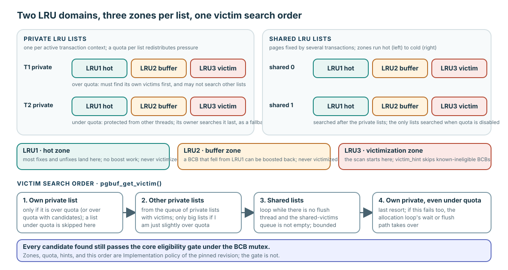
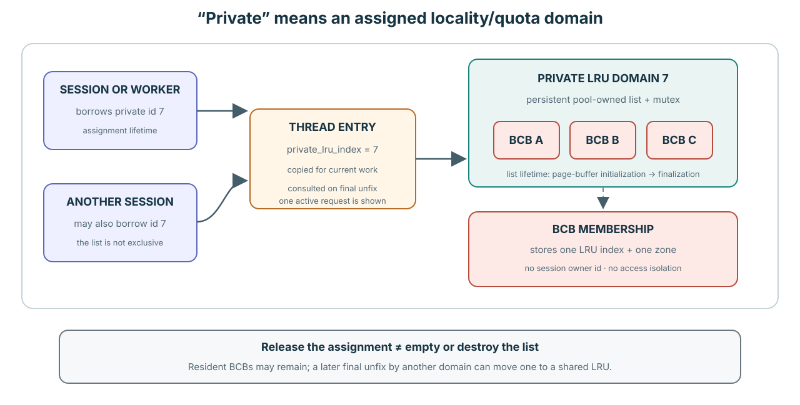
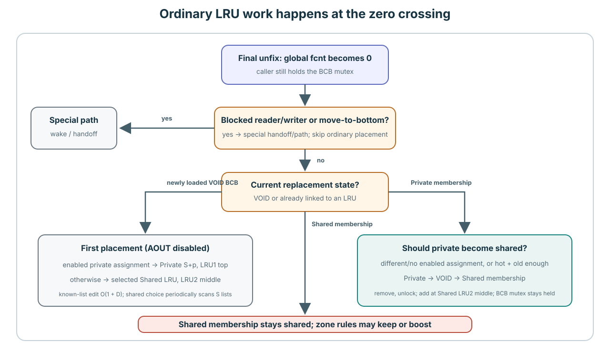
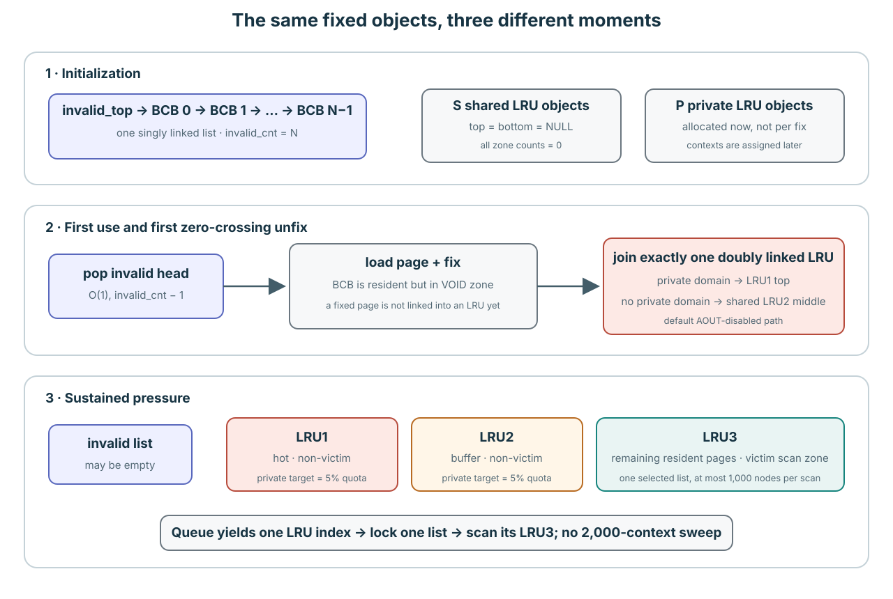
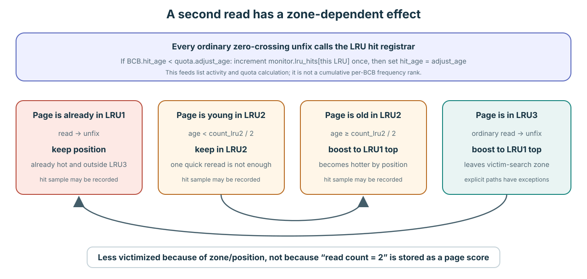
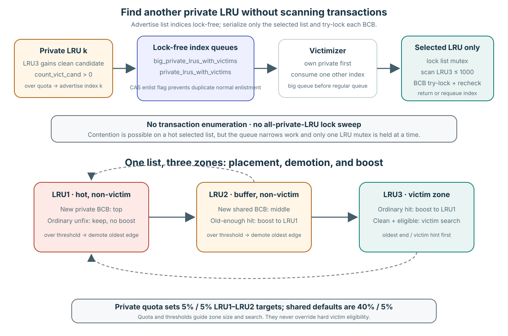
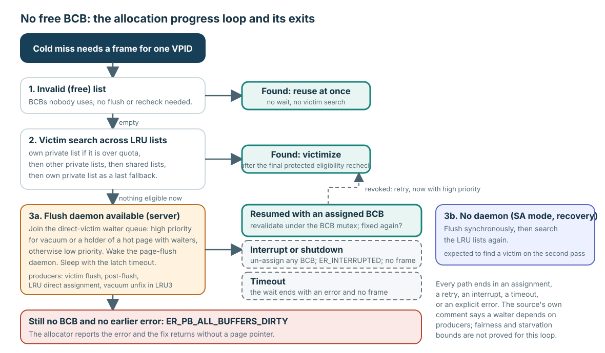

# Replacement Policy and Background Progress

**Level:** Advanced
**Prerequisites:** [Flush One Generation](../learning/04-flush-one-generation.md) and [Replace One Frame](../learning/05-replace-one-frame.md)
**Capability gained:** Analyze pinned replacement and background-progress policy without weakening the core victim-eligibility contract.
**Source baseline:** `f799e05d77d5300c6ea5753b4a6cc7caee6d8912`
**Evidence used:** Verified mechanism, Implementation policy, and Runtime observation from the [pinned-source inventory](../source-inventory.md) and exact ranges below. Historical evidence in the [replacement deep reference](../../../pgbuf-analysis/research/cubrid-lru-victim.md) is explicitly revision-bound to `5cd4f860e`; this page uses it only as a deep navigation aid after revalidating current claims against the pinned baseline.

Eligibility comes before every mechanism on this page. A policy may decide where to look and how to make progress; only the [core eligibility gate](../learning/05-replace-one-frame.md) decides whether a frame is safe to reuse.

Use this simple model before reading the policy details:

- A **session or vacuum worker** borrows a private-LRU number.
- A **thread entry** carries that number while it performs the work.
- A **BCB** does not record that session or worker as its owner. It records only
  the LRU list and zone in which it is currently linked.
- The final `unfix` uses the current thread's number as one input to placement.

“Private” therefore describes a locality/quota domain. It does not mean a
private frame pool, an access-control boundary, or a page-ownership ledger.

## Pinned implementation policy: domains, zones, and hints

The pinned revision distributes resident frames across private LRU domains assigned to active contexts and shared LRU domains. Each list uses three zones: LRU1 is the hot zone, LRU2 is a buffer zone in which a fallen BCB can be boosted back, and LRU3 is the victimization zone, so "victim zone" in this guide always means LRU3. The victim scan starts in LRU3 and may use a victim hint (`victim_hint`) to avoid rescanning known-ineligible candidates.



Read the two panels as domains and the three chips in every list as zones. A private list is assigned as a locality/quota domain to active contexts; it is not necessarily exclusive to one transaction. A caller searches its own list first when that list is over quota. A materially over-quota own list restricts the **other-private** step to the big-private queue; the pinned control flow still proceeds to shared lists. An under-quota own list is searched only as a last resort. The bottom row is the search order of `pgbuf_get_victim()`; when quota is disabled, only the shared lists are searched.

Quota policy adjusts private-list targets from activity and redistributes pressure toward shared lists. Each candidate queue, count, and hint accelerates search; none is an ownership proof. The scan still rejects flags/fix ownership and performs a final BCB-protected eligibility check before removal.

### Counts, quotas, and zone boundaries at the pinned revision

One BCB belongs to one LRU list at a time; “private and shared LRU” names alternative domains, not two simultaneous memberships. Their configured and derived limits are:

| Policy input | Pinned behavior |
|---|---|
| Shared-list count | Hidden `num_LRU_chains`; zero means auto-size from `MAX_NTRANS`, reduce the count to keep roughly 1,000 buffers per list, and never use fewer than four. An explicit value is capped at 1,000. |
| Private-list count | `num_private_chains`; in server mode, `-1` means `MAX_NTRANS + VACUUM_MAX_WORKER_COUNT`, `0` disables private quotas, and a positive value is clamped to at least four. The explicit parameter maximum is 4,050 at this baseline, but the automatic formula includes reserved connections and is not clamped to either 1,000 or 4,050 in this initializer. Stand-alone mode uses no private lists. |
| Total list count | Shared plus private. Initialization allocates one contiguous LRU array for that total. |
| Shared zone targets | `lru_hot_ratio` defaults to 0.40 and `lru_buffer_ratio` to 0.05. Each is clamped to 0.05–0.90, and their sum is constrained to leave at least 0.05 for LRU3. |
| Private zone targets | Each private quota reserves 5% for LRU1 and 5% for LRU2; the remaining quota can age into LRU3. |

The maintenance path samples fix activity, clamps the pool-wide private share to 1%–99.8%, and smooths it over a ten-second interval. It applies that share to the currently resident population, distributes private quotas by each list's activity, caps one private quota at 5,000 pages and half the pool, then divides the remainder across shared lists with a minimum target of 50. These are revision-bound search and placement targets, not ownership limits: reaching a quota does not invalidate a fix and never makes an unsafe page eligible.

### LRU object, assignment, and membership lifetimes



The LRU objects do not come and go with transactions. `pgbuf_initialize_lru_list()` allocates one contiguous `PGBUF_LRU_LIST` array containing all shared indices followed by all private indices. Every list has one mutex; top/bottom and LRU1/LRU2 boundaries; one victim hint; zone/candidate counts; thresholds, quota, ticks, flags, and its immutable array index. The array and mutexes live from page-buffer initialization until `pgbuf_finalize()`.

A private list's **context assignment** is shorter than the object lifetime.
Session creation and vacuum-worker setup call `pgbuf_assign_private_lru()`. The
returned private-list-local number is stored on that context and copied into
`THREAD_ENTRY.private_lru_index`; the page-buffer macro converts it to the full
LRU-array index when needed. Assignment chooses an idle list with the fewest
pages when possible, otherwise the least-active list, and increments that list's
session count. It is an O(P) descriptor-array scan per attempt, not a linked-list
walk over BCBs.

`pgbuf_release_private_lru()` decrements the session count and resets activity
when the last assignment leaves. Release does not destroy the list and does not
empty or move its BCBs; the source comment claiming that it “puts BCB to the
bottom” does not match the executable body at this baseline. Multiple sessions
can therefore share the same private LRU, and resident BCBs can remain after a
session releases its assignment. The list is private only as a replacement
policy domain. It is not the owner of a BCB and does not restrict which thread
may fix the resident page.

A BCB's **membership lifetime** is shorter again. It has only one `prev_BCB`/`next_BCB` pair, and its atomic `flags` value encodes exactly one zone plus one 16-bit LRU index. Add helpers assert that the BCB is not already in an LRU, lock the target list, link it, and atomically publish one index/zone. Removal under that list's mutex clears both links and changes the zone to `PGBUF_VOID_ZONE`. Private-to-shared movement is explicitly remove-then-add, so the BCB passes through VOID instead of belonging to both lists. Zone/index assertions, counters, victim hints, and `pgbuf_lru_sanity_check()` detect protocol violations in diagnostic builds.

Source: structures at `src/storage/page_buffer.c:499-623`; array initialization at `src/storage/page_buffer.c:5744-5800`; finalization at `src/storage/page_buffer.c:1921-1985`; add/remove/move at `src/storage/page_buffer.c:9695-9879,10200-10415`; encoded zone/index update at `src/storage/page_buffer.c:15900-16030`; private assignment/release at `src/storage/page_buffer.c:14513-14650`.

### Fix, final unfix, and private-to-shared movement



Fixing a resident page normally does not relink it. The BCB stays in its current
LRU while fixed; positive `fcnt` makes it ineligible for replacement. Ordinary
placement work begins only when an `unfix` makes the global `fcnt` zero. Even
then, a blocked reader/writer or an explicit move-to-bottom request selects a
special handoff path instead of the ordinary placement branch.

On the ordinary zero crossing, `pgbuf_unlatch_bcb_upon_unfix()` reads the current
thread's full private-LRU index, or `-1` when it has none, and dispatches by the
BCB's current zone:

| Current state | Final-unfix action at the pinned AOUT-disabled baseline |
|---|---|
| VOID, thread has a private assignment | Add at that private LRU1 top. |
| VOID, thread has no private assignment | Add at a selected shared LRU2 middle. |
| LRU1 | Keep its position unless private-to-shared movement applies. |
| LRU2 | Move private-to-shared when required; otherwise boost to LRU1 only when old enough. |
| LRU3 | Move private-to-shared when required; otherwise ordinarily boost to LRU1. |
| Already shared | Never moves “back” to private on this path; ordinary zone keep/boost rules apply. |

`pgbuf_should_move_private_to_shared()` first rejects an already-shared BCB. For
a private member it returns true when the unfixing thread's private LRU array
index differs from the BCB's current list index—including `-1`, meaning no
private assignment. This executable test is a domain-mismatch proxy; it does not
store or prove a set of transaction owners despite the nearby source comment.
It also returns true when the same-domain BCB has reached the saturating hotness
threshold and is old enough in its list.

Movement is two list operations, not a simultaneous dual membership:

```text
lock private list → unlink BCB → publish VOID → unlock private list
lock chosen shared list → insert at LRU2 middle → publish shared index/zone → unlock
```

The caller holds the BCB mutex between those list locks, so another page-buffer
operation cannot treat the transient VOID state as an unprotected free BCB. The
two LRU mutexes are never held together. Each known-node unlink or insertion is
O(1), and zone adjustment can demote D boundary nodes. Choosing a shared
destination is amortized O(1), but periodically scans all S shared descriptors
in O(S) to identify an oversized list. Thus a private-only placement or known-
list boost is O(1 + D); shared placement/migration is amortized O(1 + D) and has
a periodic O(S + D) case. Mutex wait time is contention-dependent and is not
represented by that Big-O.

Source: zero crossing and dispatch at `src/storage/page_buffer.c:6636-6883`;
VOID placement and migration predicate at `src/storage/page_buffer.c:6885-7038`;
link helpers and private-to-shared movement at
`src/storage/page_buffer.c:9695-10417`.

### Concrete pool shape: empty startup, first use, and pressure



Let `N` be `num_buffers`, `S` the shared-list count, and `P` the private-list
count. Initialization allocates the fixed BCB/frame arrays and `S + P` empty LRU
objects. It chains all `N` BCBs through `next_BCB` into the singly linked invalid
list, with `invalid_top = BCB[0]` and `invalid_cnt = N`. Thus the initial resident
population is zero: the LRU descriptors exist, but their top, bottom, boundaries,
and zone counts are empty.

A cold miss pops the invalid head in O(1), loads the requested identity into that
fixed BCB/frame slot, and keeps it in VOID while it is fixed. On the first
zero-crossing unfix, the analyzed AOUT-disabled path links it into exactly one
doubly linked LRU: private LRU1 top when the context has a private domain, or
shared LRU2 middle otherwise. The BCB and frame remain a fixed array-index pair
for the pool lifetime; legal replacement changes the page identity resident in
that pair.

Under sustained pressure, the invalid list may be empty and all frames resident.
Quota/zone adjustment distributes those BCBs across LRU1, LRU2, and LRU3; dirty
LRU3 pages need flush progress, while clean eligible LRU3 pages contribute to
candidate counts and advertise their list indices. There is no extra pool of
unattached frames behind this path.

Source: `src/storage/page_buffer.c:5590-5650,5744-5800,5907-5920,6636-7040,8923-8950`.

First unfix is also policy-visible. With the analyzed default AOUT-disabled path, a newly materialized BCB enters the top of its assigned private list when it has a private domain; otherwise it enters the middle of a shared list. On later zero-crossing unfixes, LRU1 remains hot without being boosted, LRU2 is boosted only after it is old enough, and ordinary reuse boosts an LRU3 page. Zone adjustment ages pages from LRU1 through LRU2 into LRU3.

### What a second read records and changes



There is no exact per-BCB successful-read counter that turns from one to two and
directly ranks victims. `quota.adjust_age` is an epoch number, not wall-clock
time. It starts at zero, and only an accepted `pgbuf_adjust_quotas()` pass
increments `adjust_age`. The 100 ms maintenance daemon calls that function, and
assignment/release may call it too, but a call does not necessarily increment
the epoch: quota-disabled, already-adjusting, sub-1-ms, and insufficient-
activity-before-500-ms gates all return first. Thus “one age per 100 ms” is
incorrect.

On an ordinary zero-crossing unfix, `pgbuf_bcb_register_hit_for_lru()` compares
the BCB's last sampled epoch with the pool epoch:

```text
if bcb.hit_age < quota.adjust_age:
    monitor.lru_hits[current_lru] += 1
    bcb.hit_age = quota.adjust_age
```

The purpose is sample de-duplication: one BCB contributes at most one hit in one
accepted adjustment epoch, no matter how many qualifying final unfixes occur in
that epoch. At the next accepted pass, `ATOMIC_TAS_32` takes and resets every
list's `lru_hits`, converts the sample to hits per second, smooths private-list
activity, and derives quotas. The BCB's `hit_age` is not a recency clock and does
not order the victim scan. When a private BCB first moves to shared, hit
registration occurs after insertion, so the sample belongs to the new shared
LRU.

Let T be the number of managed thread entries inspected for unfix activity, L
the number of LRU descriptors, and D the number of zone demotions caused by new
thresholds. A maintenance-triggered accepted pass is O(T + L + D): O(T) for the
two unfix-counter sums, O(L) for consuming hit arrays and updating lists, and
O(D) for demotions. Assignment/release-triggered calls have the same gate and
accepted-pass work in addition to assignment's O(P) scan.

The immediate per-page effect depends on the current zone:

- LRU1 keeps its position because it is already hot and outside the victim zone.
- A young LRU2 BCB stays in LRU2. “Old enough” means its list-tick distance is at
  least half the current LRU2 count, so a rapid second read does not necessarily
  earn a boost.
- An old-enough LRU2 BCB and an ordinarily reused LRU3 BCB move to LRU1 top.
  They become less likely to be victimized because they must age through the
  zones again, not because a frequency-two score won a comparison.

Thus a second read can protect a page through zone/position and can influence the
containing list's later quota, but it is not guaranteed to change placement.
AOUT could add ghost-history behavior, but the analyzed default disables it.

A separate BCB-lifetime hotness heuristic exists in the high 16 bits of
`count_fix_and_avoid_dealloc`. The general fix path increments it up to 64, but
the overlapping-reader fast path bypasses that registration, so it is not an
exact count of successful reads. Reaching 64 participates in an old
private-to-shared migration condition; the LRU3 victim scan does not rank BCBs
by this counter. It resets when the BCB returns to the invalid list.

Source: epoch initialization and accepted adjustment at
`src/storage/page_buffer.c:13942-13985,14251-14511`; 100 ms caller at
`src/storage/page_buffer.c:16994-17009,17146-17161`; assignment/release callers
at `src/storage/page_buffer.c:14513-14624`; hit registration at
`src/storage/page_buffer.c:16595-16610`; movement and later-read behavior at
`src/storage/page_buffer.c:1053-1061,2408-2489,6730-7038,7724-7787,10210-10360,16313-16367`.

### How the victim search assigns priority

There is no scalar “victim priority” stored on every BCB. Priority is the composition of three ordered decisions:

1. **Domain order:** search the caller's own private list first when it is over quota, then advertised other private lists, then shared lists, and finally its own under-quota private list. If the own list is materially over quota, the other-private step consumes only the big-private queue; shared search still follows in the pinned control flow.
2. **Recency inside a list:** inspect only LRU3, beginning at its victim hint or bottom and visiting at most 1,000 BCB positions toward newer entries. Fixed or avoid-victim BCBs are skipped; the scan uses a nonblocking BCB lock while holding the LRU mutex. This is one selected-list visit budget, not a private-list-count limit or whole-allocation bound.
3. **Safety override:** after the policy finds a candidate, the final BCB-protected identity, ownership, flag, dirty/flush, and list-state checks can reject it. Hard eligibility always outranks policy preference.

Direct-victim waiters have a separate queue priority: vacuum workers and threads already holding a hot or contended page use the high-priority queue; other waiters use the low-priority queue. That decides which waiter receives a produced candidate, not whether the candidate is safe.

Source: zone semantics at `src/storage/page_buffer.c:185-200`; limits at `src/storage/page_buffer.c:1071-1118`; structures and list state at `src/storage/page_buffer.c:560-773`; initialization at `src/storage/page_buffer.c:5744-5903,13942-13985`; placement and aging at `src/storage/page_buffer.c:6636-6994,9695-10197`; victim ordering and scan at `src/storage/page_buffer.c:9067-9538`; quota policy at `src/storage/page_buffer.c:14251-14511`; parameter defaults at `src/base/system_parameter.c:1794-1829,3754-3777,4171-4182`. Detailed routing: [CUBRID LRU/victim fact sheet](../../../pgbuf-analysis/research/cubrid-lru-victim.md).

### How a caller finds another private list



The current transaction does not enumerate other transactions, discover their session objects, or lock every private LRU. Candidate-producing paths advertise **LRU array indices**:

1. When an eligible clean BCB contributes to a list's LRU3 candidate count, `pgbuf_lru_add_victim_candidate()` updates the hint/count. A shared list is advertisable immediately; a private list is advertised when it is over quota. Quota adjustment also republishes qualifying lists.
2. `pgbuf_lfcq_add_lru_with_victims()` atomically sets `PGBUF_LRU_VICTIM_LFCQ_FLAG`, preventing duplicate normal enlistment, then pushes the integer index into a lock-free circular queue. Private, big-private, and shared indices use separate queues; the regular queue capacities are twice their list counts.
3. `pgbuf_lfcq_get_victim_from_private_lru()` consumes the big-private queue first. If the caller is not restricted and that queue is empty, it consumes the regular private queue. The integer selects `pgbuf_Pool.buf_LRU_list[lru_idx]`; no transaction lookup occurs.
4. Only then does `pgbuf_get_victim_from_lru_list()` lock that one list's mutex, inspect at most 1,000 LRU3 entries, and use nonblocking BCB try-locks. The index is requeued when candidates and quota conditions still justify more searches; otherwise the enlistment flag is cleared so a future candidate/quota adjustment can advertise it again.

This design can still contend: several victimizers, unfix/boost operations, and quota adjustment can meet on the same hot list mutex. But the cost is not “lock all other transactions' LRUs.” Queue selection is lock-free, one LRU mutex is held at a time, scan depth is bounded, and BCB locks are tried rather than waited for under the LRU mutex. A bottleneck claim is therefore plausible under concentrated pressure on a small number of advertised lists, but it requires mutex-wait/CPU evidence; the structure alone does not prove severe contention.

For 2,000 open transactions, the victim path does **not** walk 2,000 transaction
objects or private-LRU descriptors. It consumes one advertised integer index and
scans at most 1,000 BCB nodes in that one LRU3. A different operation,
`pgbuf_assign_private_lru()`, does inspect all `P` private descriptors to choose an
idle least-populated list or the least-active fallback. That assignment is O(P)
per attempt and may retry five times after a race; do not attribute its cost to
every victim search.

Source: queue allocation at `src/storage/page_buffer.c:1825-1898`; candidate advertisement at `src/storage/page_buffer.c:15674-15728,16370-16414`; other-private consumption/requeue at `src/storage/page_buffer.c:16417-16506`; bounded per-list locking and scan at `src/storage/page_buffer.c:9330-9538`; quota republishing at `src/storage/page_buffer.c:14380-14511`.

### Structural cost and space ledger

Let `H` be a resident hash-bucket chain length, `R` the number of distinct BCBs
held by one thread, `W` a BCB waiter count, `T` the number of thread entries
inspected for activity, `L = S + P`, `Z3` the selected list's LRU3 length, and
`D` the number of nodes demoted during one zone adjustment.

| Operation | Structure touched | Derived time |
|---|---|---|
| Pool initialization | BCB/frame arrays and all LRU descriptors | O(N + L) |
| Invalid-list pop/push | Singly linked head under one mutex | O(1) |
| Private-LRU assignment | Array of all P private descriptors | O(P) per attempt; at most six attempts in that loop |
| `pgbuf_bcb_register_hit_for_lru()` | BCB epoch plus one current-LRU counter | O(1) structural work |
| `pgbuf_should_move_private_to_shared()` | Encoded list index, hotness, and age fields | O(1) |
| Add/remove/boost a known BCB | Doubly linked neighbors plus boundaries/counts | O(1), excluding adjustment it triggers |
| Zone adjustment | Oldest LRU1/LRU2 nodes, one by one | O(D) |
| `pgbuf_get_shared_lru_index_for_add()` | Atomic round-robin counter; periodic shared-descriptor rebalance sample | Amortized O(1); periodic O(S) |
| First shared placement or private-to-shared movement | Shared selection plus known-node edits and zone repair | Amortized O(1 + D); periodic O(S + D) |
| Resident ordinary fix | One hash chain and the thread's holder list | O(H + R), excluding latch wait |
| Ordinary unfix bookkeeping | Holder lookup/removal, optional waiter wake, then possible LRU work | O(R + W), plus the selected placement/zone work |
| Advertise/consume an LRU index | Bounded lock-free circular queue | No P/S traversal; CAS retry makes wall-clock cost contention-dependent |
| Victim attempt on one selected list | Optional zone demotion, then backward walk in its LRU3 | O(D + min(Z3, 1,000)); `D` is demotion work outside the scan cap, and BCB mutex acquisition is nonblocking |
| Quota adjustment when it runs | T thread-entry shards, all L descriptors, plus demotions | O(T + L + D) |
| Page load or flush | Storage/log/DWB path | Latency-bound I/O; not meaningfully described as O(1) |

Space is O(N) for pool-owned BCBs and frames, O(L) for LRU descriptors,
hit/activity arrays, and victim-index queues, and O(P) for private session
counters. The BCB itself supplies the list links, so LRU membership does not
allocate a second O(N) node set. Big-O here describes structure traversal and
excludes mutex contention and I/O latency unless the row says otherwise.

Primary-source derivation and caveats: [Replacement quantities and cost](../reference/replacement-policy-quantities-and-costs.md) and [Private LRU domain, hit-age epochs, and unfix placement](../reference/private-lru-domain-hit-age-and-unfix-placement.md).

### Promotion and demotion rules in one table

| Current state or event | Pinned transition |
|---|---|
| New BCB, private domain, analyzed default AOUT disabled | First zero-crossing unfix inserts at private LRU1 top. |
| New BCB without a private domain | First zero-crossing unfix inserts at shared LRU2 middle. |
| LRU1 ordinary zero-crossing unfix | Keep position; record activity, with rare private-to-shared movement. No boost is needed because it is already hot/non-victim. |
| LRU1 exceeds `threshold_lru1` | Zone adjustment moves the oldest LRU1 edge into LRU2 until the count fits. |
| LRU2 ordinary zero-crossing unfix | Boost to LRU1 top only if old enough; a very recent repeated fix does not earn promotion. |
| LRU2 exceeds `threshold_lru2` | Zone adjustment moves the oldest LRU2 edge into LRU3 and updates candidate count/hint when eligible. |
| LRU3 ordinary zero-crossing unfix | Boost to LRU1 top; vacuum/direct-victim paths have explicit exceptions. |
| Private BCB fixed from a different private context, or hot and old enough | Remove from its private list, pass through VOID, add at shared LRU2 middle. |
| LRU3 clean and hard-eligible under protected recheck | Detach to VOID and hand to victimization/direct assignment. |

For private lists, LRU1 and LRU2 thresholds are each 5% of that list's current quota. For shared lists, thresholds use the configured 40%/5% defaults against the derived shared target. The remaining tail is LRU3; quota is not a fixed allocation of physical BCBs and does not prevent temporary overage.

Source: zero-crossing placement and movement at `src/storage/page_buffer.c:6636-7040`; add/adjust/boost at `src/storage/page_buffer.c:9695-10353`; quota thresholds at `src/storage/page_buffer.c:14251-14511`.

## No free BCB: the allocation progress loop



A cold miss needs a frame, and "the free list is empty" is sometimes described as the start of an infinite wait. The pinned allocator is a loop with bounded exits, not an open-ended wait:

1. **Invalid list first.** `pgbuf_allocate_bcb()` takes a BCB from the invalid (free) list when one exists. Those BCBs are used by nobody and need no flush or recheck.
2. **Victim search.** Otherwise `pgbuf_get_victim()` searches the LRU lists in a fixed order: the thread's own private list when it is over quota, then other private lists, then the shared lists, and finally the thread's own private list even under quota as a last resort. A found candidate still passes the [core eligibility gate](../learning/05-replace-one-frame.md) under the BCB mutex before it is reused.
3. **Wait for a direct victim (server mode).** If nothing is eligible and the page-flush daemon is available, the thread enqueues itself in the direct-victim waiter queue—high priority for vacuum threads and for threads that hold a hot page or a page others are waiting on, low priority otherwise—wakes the page-flush daemon, and sleeps with the same latch timeout used by latch waiters. Producers of direct victims are victim flush, post-flush, LRU direct assignment, and vacuum unfix in the LRU3 zone.
4. **Resume and revalidate.** A thread resumed with an assigned BCB locks it and revalidates. If another thread fixed the page in between, the assignment is revoked and the allocator retries the wait with high priority. An interrupt or shutdown un-assigns any BCB and returns `ER_INTERRUPTED`. A timeout ends the wait with an error and no frame.
5. **No daemon object.** In stand-alone mode, the thread flushes synchronously and searches the LRU lists again. The allocator's source comment also describes this as the intended fallback whenever the page-flush thread is unavailable, including recovery. At the pinned server boot order, however, daemon objects are created before log recovery and their tasks are separately boot-gated; the availability helper tests only the daemon pointer. Do not generalize the stand-alone branch into a proved statement that every recovery-pressure allocation takes it.
6. **Explicit failure.** If no BCB was produced and no earlier error is set, the allocator reports `ER_PB_ALL_BUFFERS_DIRTY` and the fix returns without a page pointer.

So an empty free list starts a progress protocol whose every path ends in an assignment, a retry, an interrupt, a timeout, or an explicit error. Two limits remain. The source's own comment acknowledges that a waiter depends on producers and describes a theoretical "forgotten waiter" whose only exit is the timeout; the [uncertainty registry](../unresolved-or-version-sensitive-findings.md) records that fairness and starvation bounds for direct victims are not proved. And the timeout, queue priorities, and search order are Implementation policy that another revision may change.

Source: allocation loop at `src/storage/page_buffer.c:8181-8403`; victim search order at `src/storage/page_buffer.c:9067-9265`; direct-victim consumption and revocation at `src/storage/page_buffer.c:15592-15660`; high-priority classification at `src/storage/page_buffer.c:11734-11790`.

## Direct victim assignment and revocation

Direct victims are a progress mechanism for allocators already waiting for a frame. A provider assigns an eligible BCB to a waiting thread; the consumer later locks and revalidates it. If an active worker fixed the page again in the intervening window, invalidation revokes the assignment and the allocator asks for another candidate.

The direct-victim flag is therefore a reservation, not permission to bypass hard predicates. Source: `src/storage/page_buffer.c:15420-15627`.

## Victim flush and post-flush coordination

Dirty frames cannot pass ordinary victim eligibility, so pressure can wake the page-flush path. Flush snapshots one generation using the [core generation model](../learning/04-flush-one-generation.md). Under configured pressure, a successfully submitted snapshot may be queued to post-flush processing, which rechecks whether the BCB is still clean, unfixed, in the victim zone, and policy-eligible before direct assignment.

A newer dirty generation G+1 defeats assignment even though G completed: post-flush must not turn old-generation completion into reuse of new resident bytes. Victim flush and post-flush are progress coordination layered on generation correctness.

Source: flush handoff at `src/storage/page_buffer.c:10925-10952`; post-flush assignment at `src/storage/page_buffer.c:15489-15556`.

## Daemons: ownership is source-visible, cadence is version-sensitive

In server mode, the pinned module attempts to create four independent, single-thread daemon objects through the thread manager. They are not a master and four flush workers. Boot creates the objects before log recovery, their tasks return while the flush-daemon gate is closed, and boot enables the gate after recovery. Stand-alone mode has no page-buffer daemons and uses synchronous progress instead.

| Daemon | Pinned work and wake cadence |
|---|---|
| Maintenance | Adjusts private/shared quotas every 100 ms, then calls a low-activity direct-victim backup. At the pinned revision both backup loops fail their first condition and do not enter as written (`VS-20`). It does not write page images. |
| Page flush | The one page-buffer background flusher: wakes on demand or after `page_bg_flush_interval` (1,000 ms by default), selects dirty LRU3 victim candidates, and may loop while pressure still calls for victim flushing. A nonpositive interval makes it event-driven. |
| Post-flush | Rechecks BCBs after successful page-buffer submission and hands eligible ones to waiters; idle waits grow through 1, 10, and 100 ms and then become wake-only, returning to the fast interval when work is found. It does not initiate another page write, and DWB submission does not prove home-page completion. |
| Flush control | Replaces a post-write soft-pacing token budget from elapsed time every 50 ms. It does not select dirty pages, and its daemon can be absent when flush-control initialization is unavailable. |

The page-flush daemon is not the only thread that can flush a dirty page. Checkpoint, explicit page/volume/lifecycle operations, and a WRITE owner servicing a deferred request execute the same generation mechanism from their own threads. The separate DWB subsystem may then use its own two daemons for downstream block writing and volume synchronization. See the canonical [flush-actor explanation](../learning/04-flush-one-generation.md#who-actually-performs-a-flush) and [primary-source research note](../reference/dirty-page-flush-actors.md).

Daemon count, ownership, and cadence are version-sensitive implementation policy, not caller guarantees. Wake thresholds, periods, priorities, batch sizes, and quota formulas must be rechecked on the target revision and configuration. Do not encode them into the fix/unfix contract.

Source: `src/storage/page_buffer.c:9549-9648`; daemon tasks at `src/storage/page_buffer.c:16972-17255`; lifecycle gate at `src/transaction/boot_sr.c:2405-2441`; default page-flush interval at `src/base/system_parameter.c:1806-1829`; DWB daemons at `src/storage/double_write_buffer.cpp:4017-4152`. Detailed control-loop ledger: [Dirty-page Flush Actors](../reference/dirty-page-flush-actors.md#four-independent-control-loops).

## AOUT: a dormant ghost-history admission filter


### What it stores—and what it does not

The source describes AOUT as the out-history part of 2Q. It is one global, bounded FIFO plus VPID hash. Each preallocated `PGBUF_AOUT_BUF` stores only `{ VPID, former lru_idx, next, prev }`. It does **not** retain the BCB, frame, page bytes, latch, dirty state, or a fix. Calling it a ghost history is literal: it remembers that an identity recently left and which LRU index it left, without keeping the page resident.

If enabled, its capacity would be `min(floor(num_buffers × data_aout_ratio), 32768)`. Victim removal adds the old VPID at the FIFO top, recycling the bottom when full. A later load first owns a different or reused BCB in VOID; at its ordinary first zero-crossing unfix, AOUT lookup removes the ghost and returns the saved LRU index. The admission branch then acts as follows:

| Current context and AOUT result | Pinned dormant branch placement |
|---|---|
| Private LRU; AOUT disabled | Private LRU1 top. This is the path currently executed. |
| Private LRU; enabled but ghost miss | Current private LRU middle, initially below the hot top. |
| Private LRU; ghost records the same LRU index | Current private LRU1 top: refault evidence earns hot admission. |
| Private LRU; ghost records another LRU index | Shared LRU middle: cross-domain reuse becomes shared. |
| No private LRU | Shared LRU middle, regardless of ghost outcome. |

The saved index identifies a list, not a transaction or permanent owner. AOUT changes admission preference only. It never makes a fixed, dirty, flushing, or waiter-bearing BCB eligible for victimization.

### Proof that it is disabled

There are four independent links in the evidence chain:

1. Historical [CBRD-20741](http://jira.cubrid.org/browse/CBRD-20741) records repeated 10.1 crashes/assertions in `pgbuf_add_vpid_to_aout_list()` and queue dumps with inconsistent/cyclic links. The issue remains Confirmed and Unresolved. Its discussion explicitly says the root cause was not known.
2. Follow-up [CBRD-21135](http://jira.cubrid.org/browse/CBRD-21135) says `data_aout_ratio` would be disabled until CBRD-20741 was fixed. Commit [`d3554deee`](https://github.com/CUBRID/cubrid/commit/d3554deee3a5e2e6d2030113db550eaea42a5fa4) implemented that decision.
3. The pinned `prm_tune_parameters()` still unconditionally writes `"0"` to the parameter with the comment `disable AOUT list until we fix CBRD-20741`. This is stronger than merely having a zero default: a nonzero startup configuration is overwritten.
4. `pgbuf_initialize_aout_list()` reads that zero, sets `max_count = 0`, and returns before allocating nodes or hashes. Add and lookup/remove functions short-circuit when `max_count <= 0`.

This proves deliberate disablement at the pinned baseline and its historical reason. It does **not** prove that today's dormant code reproduces the old crash: the JIRA stack used an older replacement topology, and the historical investigation never established a root cause. Do not summarize even the pinned system as actively “using 2Q.”

### What a safe revival could improve—and what it would cost

The dormant branches support three source-derived benefits, not measured performance claims. First-seen private pages would enter at the middle instead of every new page entering LRU1 top, which can reduce one-pass scan pollution. A same-private refault would still enter at the top, rewarding demonstrated reuse after eviction. A refault whose ghost came from another private list would enter shared middle, recognizing cross-domain demand. This history costs metadata rather than page frames.

Revival is not “delete one forced-zero line.” Every eviction insertion and cold-page lookup takes the single global `Aout_mutex`; a maximum 32,768-entry history may churn quickly in a large pool; and middle admission can discard genuinely useful new pages sooner. More importantly, the historical queue corruption must be reproduced or shown obsolete, list/hash/free-list invariants must survive concurrent stress, and the pinned full-list cleanup helper `pgbuf_remove_private_from_aout_list()` has no caller, so private-list reassignment and stale saved indices need an explicit audit. Only then can AOUT-on/off workloads compare hit rate, victim-search work, mutex contention, and tail latency.

Source: structures at `src/storage/page_buffer.c:635-666`; initialization at `5802-5903`; ordinary admission at `6885-6994`; eviction add and refault lookup/remove at `9473,10468-10636`; unused whole-history cleanup at `10638-10721`; forced zero at `src/base/system_parameter.c:9975-9987`. Evidence audit: [Victim scan cap and AOUT status](../reference/victim-scan-cap-and-aout-evidence.md). The original policy context is Johnson and Shasha's [2Q paper](https://www.vldb.org/conf/1994/P439.PDF); CUBRID's exact private/shared admission branches remain its own implementation policy.

## Runtime evidence: no eviction was forced

Existing cold/warm and pressure-adjacent observations are no-eviction evidence: they observed reuse/counters but did not force or identify an actual victim. This evidence does not prove a replacement schedule, LRU-zone choice, direct assignment, daemon cadence, or fairness. Use controlled pressure with explicit victim events before making those claims; see the [source inventory](../source-inventory.md).

## Review checklist

- Have all candidates passed core eligibility before policy is discussed?
- Is a private/shared/zone/quota statement pinned to this revision?
- Can a direct reservation be revoked after a new fix?
- Does post-flush preserve a newer dirty generation?
- Are daemon timing and formulas labelled version-sensitive?
- Is AOUT participation verified rather than inferred from data structures?
- Did runtime evidence force actual eviction?

## Related routes

- Practice: [LRU domains and zones](../questions/advanced.md#pgbuf-qb-037-what-do-lru-domains-and-zones-decide)
- Practice: [no free BCB](../questions/advanced.md#pgbuf-qb-040-what-happens-when-no-free-bcb-is-immediately-available) and [why the allocator reports no victim](../questions/maintenance-scenarios.md#pgbuf-qb-068-why-can-the-allocator-report-no-victim)
- Core prerequisite: [Flush One Generation](../learning/04-flush-one-generation.md)
- Core prerequisite: [Replace One Frame](../learning/05-replace-one-frame.md)
- Investigate a symptom: [Diagnose Page-buffer Symptoms](../playbooks/debug-by-symptom.md)
- Plan validation: [Verify at the Risk Boundary](../playbooks/verify-a-change.md)
- Deep source reference: [CUBRID LRU/victim](../../../pgbuf-analysis/research/cubrid-lru-victim.md)
