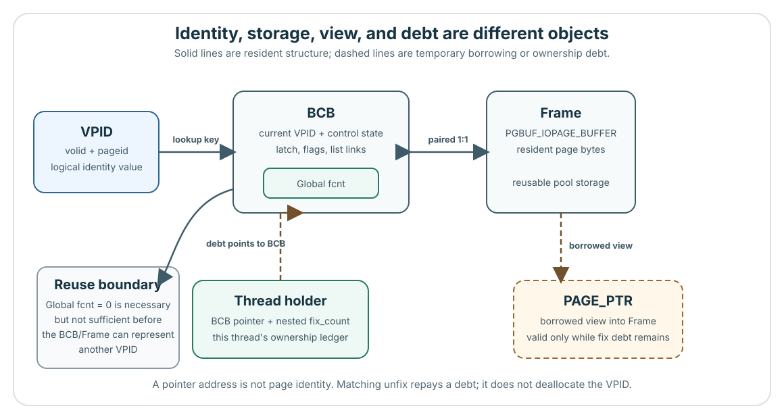
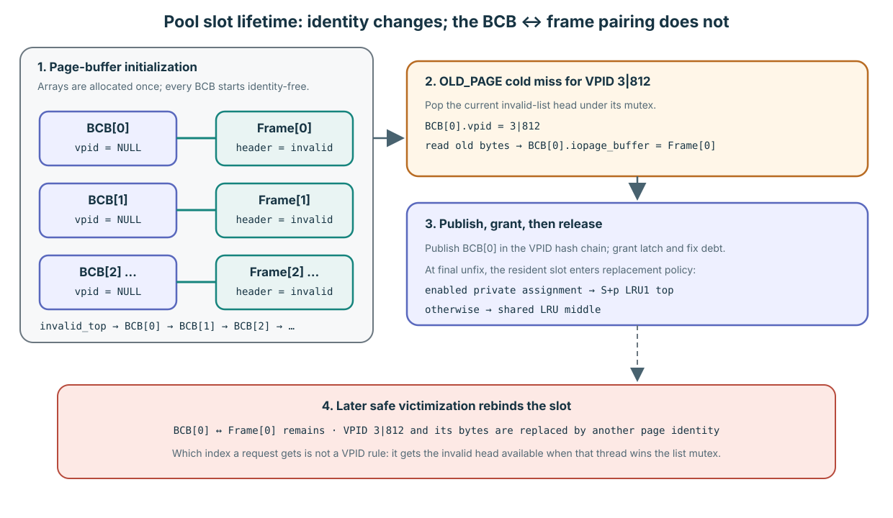

# Contract and Objects: What a Fix Actually Gives You

**Level:** Core
**Prerequisites:** [Target-reader baseline](../page-buffer-teaching-material.md)
**Capability gained:** Produce an object-and-lifetime map that distinguishes page identity, residency, ownership, concurrency, and durability.
**Source baseline:** `f799e05d77d5300c6ea5753b4a6cc7caee6d8912`
**Evidence used:** Interface contract and Verified mechanism, established by the [source inventory](../source-inventory.md) and the pinned source anchors below.

## The maintainer problem

In maintenance discussions, “page” can mean a logical identity, a reusable control block, resident bytes, or a borrowed pointer. Collapsing those meanings produces dangerous shortcuts: resident becomes “owned,” a WRITE latch becomes “durable,” or an unfix becomes “evicted.” Before reading an algorithm, establish what a successful normal fix gives the caller—and what it leaves unfinished.

## Successful fix: the conceptual postcondition

**Interface contract (pinned revision):** when a normal `pgbuf_fix()` call succeeds, its returned `PAGE_PTR` is a borrowed view of the resident bytes for the requested `VPID`, the requested READ or WRITE page latch has been granted, and that call creates one release debt. The caller may use the view only until the matching `pgbuf_unfix()`.

**Verified mechanism:** the resident BCB records the `VPID` and points to its frame; the BCB atomic latch carries the `fcnt` that is global across threads for that BCB; and the current thread's holder records its nested debt to that BCB. Hit and miss paths do different residency work, but both must reach this ownership state before returning a page pointer.

Successful acquisition does not prove that a record still exists, that the caller chose the correct page type or logical lock, or that a mutation is logged, dirty, or durable. Those are caller and dependency obligations developed later in the Learning path.

Pinned-source evidence:

- Caller-visible fetch, latch, and wait choices: `src/storage/page_buffer.h:172-203`
- Normal fix convergence and returned `PAGE_PTR`: `src/storage/page_buffer.c:2260-2685`
- Latch grant, global `fcnt`, and per-thread holder update: `src/storage/page_buffer.c:6277-6634`
- Matching release and renewed replacement eligibility: `src/storage/page_buffer.c:3062-3201`

## The Module boundary

The page-buffer Module sits between storage callers and lower-level persistence services. Its Interface turns a caller's page identity and access intent into temporary access to resident bytes. It does not finish the caller's logical operation.

| The Module owns | The caller still completes | Dependency seam below the Module |
|---|---|---|
| Locate or materialize the resident BCB/frame for a `VPID` | Know whether the page is allocated and interpret its page-specific layout | File and disk I/O provide or accept page images |
| Grant and account temporary ownership plus a page latch | Hold the required transaction lock, validate records, and recheck observations after a release | Thread and transaction services provide wait, interrupt, and timeout context |
| Track dirty resident generations and decide when a frame may be reused | Create the correct log record, page LSA, dirty transition, and all-exit cleanup for a mutation | Log/WAL, TDE, DWB, and file I/O complete the propagation path |

The public header exposes fetch knowledge, latch mode, wait condition, acquisition, release, and flush entry points; representative heap, B-tree, and recovery callers add their own page semantics around those calls. This is boundary evidence, not a claim that every caller is correct: `src/storage/page_buffer.h:172-203,266-268,277-305,327-330`, `src/storage/heap_file.c:25543-25625`, `src/storage/btree.c:16867-17013,23734-24089`, and `src/transaction/log_recovery.c:6399-6431`.

## Six objects, six lifetimes



Read the diagram as an ownership map, not a linear call flow. A logical identity selects a resident control block; that BCB is paired with frame storage; a successful fix lends a pointer into the frame while two ledgers record why the frame cannot yet be reused.

| Object | Meaning and owner | Lifetime to reason about |
|---|---|---|
| `VPID` | A `(volid, pageid)` value naming a database page. Allocation protocols determine whether that identity is valid; the page buffer uses it as a lookup and resident-identity key. | The value may exist without residency. Its meaning as an allocated page is owned outside the page buffer. |
| BCB | The page-buffer-owned Buffer Control Block for one reusable pool slot. It holds the current resident `VPID`, latch/accounting state, flags, list links, and the frame link. | The BCB storage lives from pool initialization to finalization; its resident identity can change when the slot is reused. |
| frame | The page-sized bytes inside the BCB's paired `PGBUF_IOPAGE_BUFFER`. | Frame storage lives with the pool; its contents belong to the current resident-identity generation, not permanently to one `VPID`. |
| `PAGE_PTR` | A caller-visible address into the current frame bytes. It is a view, not an owning object and not an identity token. | Borrowed by a successful fix. That call's use ends at its matching unfix; a separate outstanding fix is a separate debt. |
| global `fcnt` | The count of granted fixes across all threads for one BCB, encoded in its atomic latch state. A positive value excludes ordinary victim reuse. | The field lives with the BCB; its value spans all threads' outstanding fix debts for the current resident use. |
| holder | A per-thread record pointing to a BCB, with a nested `fix_count` for that thread. | Created or reused when the thread first holds the BCB and removed from its hold list after that thread repays its final nested debt. |

Pinned-source evidence:

- `VPID` value layout: `src/compat/dbtype_def.h:956-961`
- `PAGE_PTR` type: `src/storage/storage_common.h:146`
- Holder, global `fcnt`, BCB, and paired frame structures: `src/storage/page_buffer.c:460-555`
- BCB/frame table allocation and one-to-one pairing: `src/storage/page_buffer.c:5559-5660`
- Pool-owned BCB/frame teardown: `src/storage/page_buffer.c:1921-1971`

## The pool is fixed at startup; a miss reuses a slot

**Verified mechanism:** the pinned revision does not heap-create a BCB for each lookup miss. During `pgbuf_initialize()`, `data_buffer_pages` determines `num_buffers` (32,768 by default at this baseline, with an effective lower bound of ten times `MAX_NTRANS`). Initialization allocates exactly `num_buffers` BCBs and exactly `num_buffers` page frames, pairs them one-to-one, and places the BCBs in the invalid/free population. That storage remains pool-owned until finalization.

A miss therefore **claims and rebinds an existing pool slot**. `pgbuf_allocate_bcb()` first removes an identity-free BCB from the invalid list; if none exists, it runs the replacement progress protocol to reuse a safe victim. The source legitimately calls this “allocating a BCB,” but “creating a new BCB” is misleading unless the pool itself is being initialized.

Initialization links the invalid population from `BCB[0]` through increasing table indices and sets `invalid_top` to `BCB[0]`. In a deliberately simplified run with no earlier page-buffer work and no competing misses, the first cold miss therefore claims `BCB[0]` with its permanently paired `Frame[0]`, then index 1, and so on. Real startup activity and concurrency make a later request's exact index nondeterministic: the rule is to pop the protected invalid-list head, not to derive a BCB index from the requested VPID. When the invalid list is empty, victim policy selects a reusable resident slot instead.



The one-to-one **BCB ↔ frame pointer pairing is stable for the pool lifetime**. What victimization replaces is the shorter-lived VPID identity and page bytes associated with that pair. At the first final unfix after materialization, the analyzed policy places the BCB at its assigned private LRU's top when such an assignment exists, otherwise at a selected shared LRU's middle. [Replacement Policy and Background Progress](../advanced/replacement-progress.md) owns that mutable membership policy.

The BCB/frame array is only the storage core. These supporting structures make lookup, ownership, replacement, and background progress possible:

| Structure | Purpose |
|---|---|
| Resident hash anchors | A fixed table of 2^20 mutex-protected buckets maps a `VPID` hash to exact-identity BCB chains and also coordinates in-flight loads. |
| Per-thread holders and load-lock records | Holders account nested fix debt; one load-lock record per thread coordinates concurrent misses for the same `VPID`. |
| Invalid list | Owns BCBs with no resident identity and supplies them before victim selection is attempted. |
| Private and shared LRU lists | Partition resident BCBs into policy domains and zones; they choose where to search, but never override hard victim eligibility. |
| Direct-victim and post-flush queues | Connect allocators waiting for a frame with eligible clean candidates produced by flush or LRU activity. |
| Victim-candidate and optional AOUT state | Accelerate policy decisions. AOUT structures exist, but the analyzed default disables AOUT participation. |

Pinned-source evidence: `src/storage/page_buffer.c:295-300,460-832,1641-1888,5559-5736,8181-8403`; parameter default at `src/base/system_parameter.c:1169-1189`. The exact hash and replacement policies are owned by [Fix, Hold, and Release](./02-fix-hold-release.md#how-resident-hashing-narrows-the-lookup) and [Replacement Policy and Background Progress](../advanced/replacement-progress.md).

## Four independent state axes


Describe a resident page as a tuple, not with one overloaded “page state.” A change on one axis may require checks on another, but it does not merge their meanings.

| Axis | Maintainer question | Representative positions | What this axis does not answer |
|---|---|---|---|
| **Identity / residency** | Which `VPID`, if any, does this BCB/frame currently represent, and is that mapping resident? | Not resident; being located/materialized; resident; invalidated or reused | Whether any thread owns it, whether its bytes are latched, or whether a change is recoverable |
| **Ownership** | Which granted fixes currently prevent ordinary frame reuse? | Global `fcnt == 0`; `fcnt > 0`; one holder with nested debt; several thread holders | Which latch mode protects the bytes or whether the page is dirty |
| **Concurrency** | Who may inspect or mutate the resident bytes now? | `NO_LATCH`; READ; WRITE; incompatible waiter or conditional rejection | Transaction visibility, logical row locks, ownership lifetime, or durability |
| **Durability / propagation** | Which resident generation still needs page-image propagation, and what recovery evidence exists? | Clean; DIRTY; FLUSHING copied generation; concurrent re-dirty | Whether the page is resident, fixed, or safe to reuse without checking the other axes |

The source stores these dimensions in different places: BCB identity and frame linkage, atomic latch mode and `fcnt`, holder records, flags, page LSA, and `oldest_unflush_lsa`. That separation is a Verified mechanism at the pinned revision, not a promise that the same fields or packing remain stable in another revision: `src/storage/page_buffer.c:499-555`.

## Terms that must not collapse

| Term | Precise use in this guide | A state that disproves the synonym |
|---|---|---|
| **Fixed** | At least one granted fix debt protects the resident frame from ordinary reuse. | A page can remain resident after global `fcnt` returns to zero. |
| **Resident** | A current `VPID` is associated with a BCB/frame in the pool. | A resident page may be unfixed, clean or dirty, and latched or idle. |
| **Dirty** | The resident generation has changes that still require page-image propagation. | Its required WAL may already be durable while the data page remains dirty. |
| **Durable** | A stated recovery boundary has made the change recoverable; the exact claim must name that boundary. | Durable WAL does not require the home data page to be clean or evicted. |
| **Flushed** | One copied page generation completed the configured DWB/direct-write boundary. | A newer concurrent generation may leave the resident BCB dirty. |
| **Evicted** | Replacement removes or reuses a resident mapping/frame after its safety predicates pass. | The logical `VPID` can remain allocated and be loaded again. |
| **Invalidated** | The page-buffer mapping is deliberately discarded or made non-resident. | Invalidation does not by itself say that file allocation state changed. |
| **Deallocated** | The file/disk/recovery owner changes the logical allocation state so the page is no longer allocated. | Deallocation and cache invalidation may coordinate, but they are different owner decisions. |

Keep four review sentences visible: **fixed is not resident**, **dirty is not durable**, **unfix is not flush**, and **eviction is not deallocation**.

Pinned-source routing for these distinctions:

- Dirty-state mutation: `src/storage/page_buffer.c:4921-5096`
- BCB invalidation: `src/storage/page_buffer.c:8695-8750`
- Victim eligibility and reuse: `src/storage/page_buffer.c:9314-9538`
- Copied-generation flush and concurrent re-dirty: `src/storage/page_buffer.c:10723-10962`
- Page-buffer deallocation/recovery hooks: `src/storage/page_buffer.c:15182-15335`
- File-owned logical deallocation: `src/storage/file_manager.c:6119-6299`

## Understanding check: Predict–Locate–Explain

Scenario: a caller supplies an allocated `VPID` to a normal `pgbuf_fix()` with `OLD_PAGE`, READ, and unconditional wait. The call returns a non-`NULL` `PAGE_PTR` named `page`.

### Predict

Before reading the source, write down:

1. Which relationship must now connect the `VPID`, BCB, frame, and `PAGE_PTR`?
2. What must global `fcnt` and the current thread's holder record?
3. Which of resident, dirty, durable, flushed, evicted, invalidated, and deallocated can be inferred from success alone?
4. After this call's matching unfix, which fact definitely ends, and which facts may remain true?

### Locate

Use bounded source regions rather than reading `page_buffer.c` in file order:

- Find the two public value/view types at `src/compat/dbtype_def.h:956-961` and `src/storage/storage_common.h:146`.
- Mark the holder, atomic-latch `fcnt`, BCB identity, and frame pair at `src/storage/page_buffer.c:460-555`.
- In `src/storage/page_buffer.c:2260-2685`, identify the common successful return after hit or miss preparation.
- In `src/storage/page_buffer.c:6277-6634`, mark where latch, global debt, and thread debt become granted.
- In `src/storage/page_buffer.c:3062-3201`, mark what the matching unfix repays.

### Explain

Produce one reviewable artifact: an **object/lifetime sketch** with the six objects, their owners, and the point where each borrowed relation ends. Under it, explain two valid cross-axis combinations and one invalid synonym from the terminology table. Keep Interface contract claims separate from Verified mechanism.

### Model answer

One compact sketch is:

```text
allocated VPID value
        |
        | resident identity
        v
page-buffer BCB [global fcnt]  <====>  page-buffer Frame  ----borrowed---->  caller PAGE_PTR
          ^
          | points to BCB
Thread holder [nested fix_count]
```

At the successful return, the BCB/frame represents the requested `VPID`; the requested READ latch is granted; global `fcnt` includes this call; the current thread's holder includes its nested debt; and `page` is usable only while that debt remains. Success alone says nothing about whether the page is dirty, whether a change is durable or flushed, or whether the caller's record-level assumptions are valid.

After the matching unfix, this call's debt and borrowed-pointer lifetime end. The BCB/frame may remain resident with global `fcnt == 0`; global `fcnt` may instead stay positive because another fix exists; and dirty or durability state does not change merely because this call released ownership. Thus “resident and unfixed” and “resident, fixed, and dirty” are both valid cross-axis combinations, while “unfixed means evicted” is invalid.

**Evidence boundary:** the pinned source establishes these structures and the normal fix/unfix transitions at `f799e05`; it does not establish caller correctness, every concurrency schedule, or behavior at another revision. A target-branch change requires rechecking the cited symbols and control flow.

## Learning navigation

**Previous:** [Guide entry](../page-buffer-teaching-material.md)
**Next:** [Fix, Hold, and Release](./02-fix-hold-release.md)

## Related routes

- [Practice the Module boundary](../questions/core.md#pgbuf-qb-001-what-does-the-page-buffer-module-own)
- [Change the Module Safely](../playbooks/change-safely.md)
- [Source and Caller Map](../reference/source-map.md)
- [Maintainer Invariant Index](../reference/invariant-index.md)
