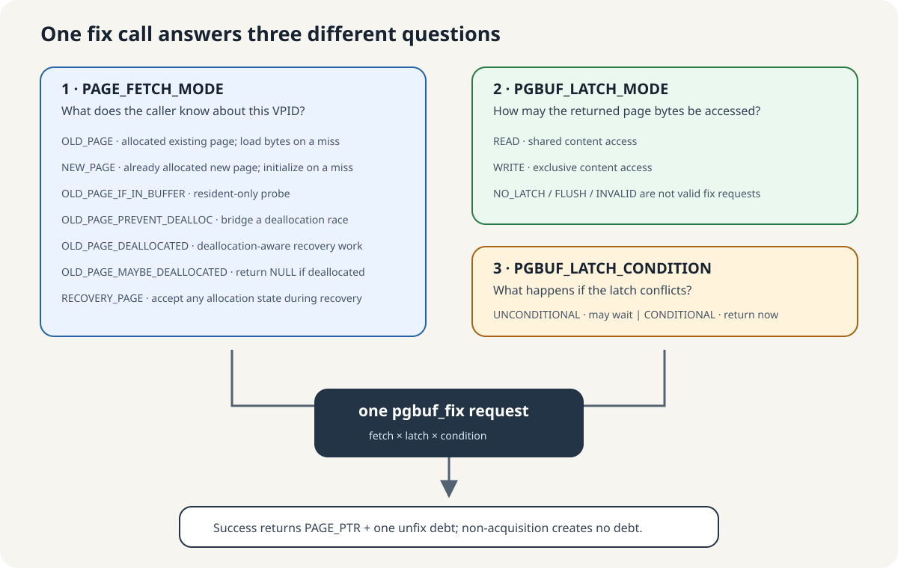
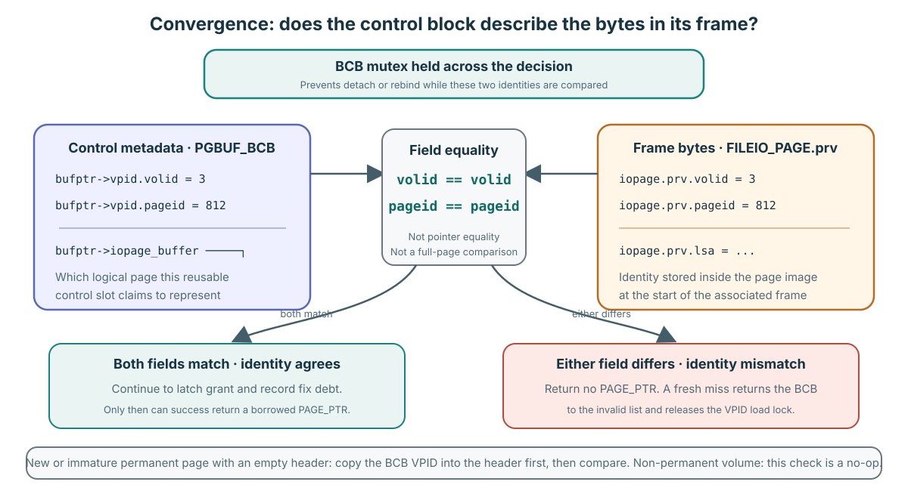
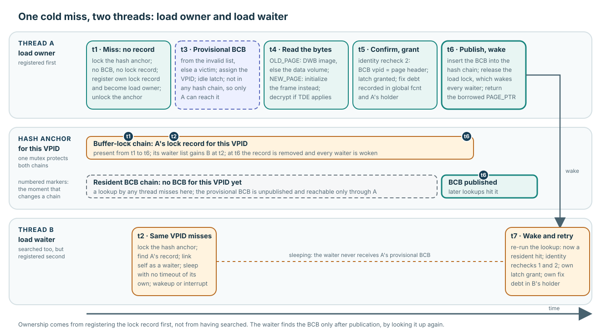
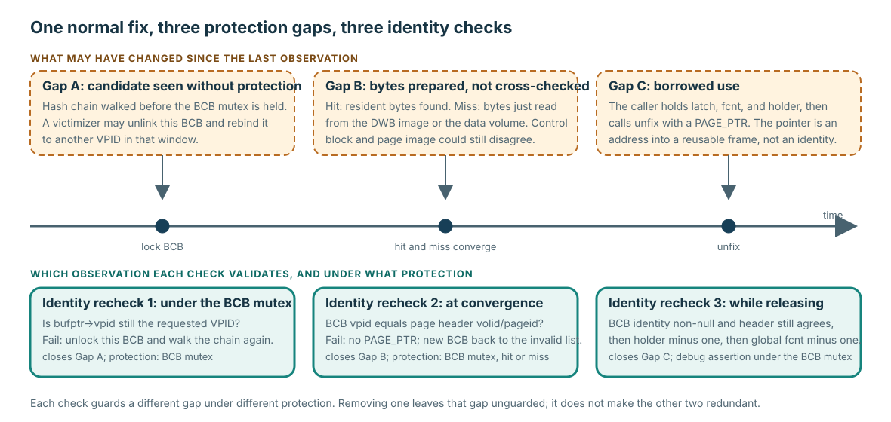
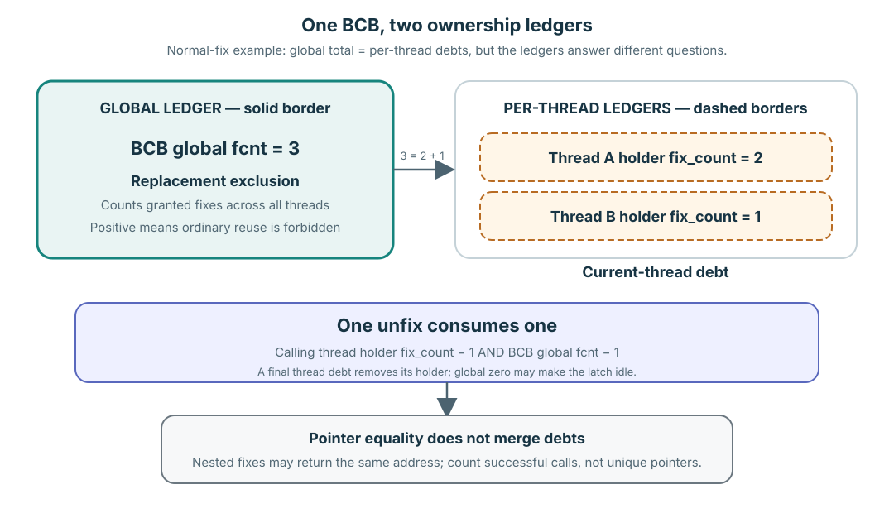

# Fix, Hold, and Release: Borrowing a Resident Page

**Level:** Core
**Prerequisites:** [Contract and Objects](./01-contract-and-objects.md)
**Capability gained:** Trace a normal fix and matching release while accounting for global and per-thread ownership debt.
**Source baseline:** `f799e05d77d5300c6ea5753b4a6cc7caee6d8912`
**Evidence used:** Interface contract and Verified mechanism, established by the [source inventory](../source-inventory.md) and the pinned source anchors below.

## The maintainer problem

A fix is successful only when temporary ownership has been granted and its matching release debt is understood. To audit that boundary, a maintainer must follow caller intent through lookup or materialization, latch grant, both ownership ledgers, borrowed use, and exactly one release.

## Start with caller intent: three separate choices

Before following the hit and miss branches, read a fix call as three independent
answers. The fetch mode describes what the caller believes about the logical page.
The latch mode describes how the returned bytes may be used. The condition says
what to do only when that access conflicts with somebody else.



| Choice | Question answered | Core examples and consequence |
|---|---|---|
| `PAGE_FETCH_MODE` | What kind of page is this, and may a miss materialize it? | Select one of the seven modes in the next table. |
| `PGBUF_LATCH_MODE` | May the borrower read shared bytes or change them exclusively? | A public fix accepts READ or WRITE. |
| `PGBUF_LATCH_CONDITION` | May an incompatible request sleep? | Conditional returns now; unconditional may enter the wait path. |

### All seven fetch modes

Fetch mode is a correctness statement from the caller. It is not a ranking from
weak to strong, and it does not select READ or WRITE.

| Fetch mode | Caller statement | Resident hit | Buffer miss or deallocated page |
|---|---|---|---|
| `OLD_PAGE` | “This VPID is an allocated, existing page.” | Use the resident image after validation. | Materialize existing bytes from DWB or the data volume. A `PAGE_UNKNOWN` image is an error. |
| `NEW_PAGE` | “Allocation already produced this new VPID.” | A leftover resident mapping may be reused; debug checks require any old unflushed generation to be dirty. | Claim a BCB/frame and initialize it without reading old page bytes. `PAGE_UNKNOWN` is expected until the caller initializes the page type. |
| `OLD_PAGE_IF_IN_BUFFER` | “I need this page only if it is already resident.” | Grant the requested latch if possible. The post-latch switch permits a resident `PAGE_UNKNOWN` image, so success alone does not assert a normal allocated page. | Return `NULL` immediately after the hash miss; do not claim a BCB and do not read the volume. |
| `OLD_PAGE_PREVENT_DEALLOC` | “This is an existing page, and the gap before latch grant must not race with deallocation.” | Register a temporary BCB avoid-deallocation count before latch acquisition and remove it after the fix succeeds. | Materialize like `OLD_PAGE`, using the same temporary bridge around latch acquisition. This mode is used by ordered/heap protocols; the returned fix itself then stabilizes the page. |
| `OLD_PAGE_DEALLOCATED` | “A recovery operation needs to access an image marked `PAGE_UNKNOWN`.” | The common post-latch check allows the deallocated image to be returned. | It may be materialized, then returned even when its type is `PAGE_UNKNOWN`. The representative caller is deallocation undo, which restores the old type. The generic fix path does not reject a normal type solely because this mode was chosen. |
| `OLD_PAGE_MAYBE_DEALLOCATED` | “The page usually exists, but concurrent/recovery history may have deallocated it.” | Normal pages are returned. It is also eligible for the lock-free unconditional READ attempt. | Materialize if needed. If the protected image is `PAGE_UNKNOWN`, the function emits the bad-page warning, immediately unfixes its temporary grant, and returns `NULL`; the caller receives no debt. |
| `RECOVERY_PAGE` | “Recovery must accept whatever allocation state is present.” | Accept a normal, new/immature, or deallocated image. | Skip the ordinary allocation-validity precheck, materialize as needed, and accept `PAGE_UNKNOWN`. Recovery callers normally request WRITE because redo/undo changes bytes. |

The table describes the pinned implementation, including deliberately specialized
modes. Most ordinary callers should be explainable with `OLD_PAGE` or `NEW_PAGE`;
choosing a deallocation or recovery mode requires the corresponding owner protocol.

### The five latch-mode enum values

The enum is used in several structures, but `pgbuf_fix()` accepts only two values
as its `request_mode`.

| Latch mode | Meaning in a BCB or request | Valid `pgbuf_fix()` request? |
|---|---|---|
| `PGBUF_NO_LATCH` | In `PGBUF_BCB.atomic_latch.latch_mode`, the resident page currently has no granted READ/WRITE latch. In other owning fields it can mean initialization or a cancelled waiter. | No. |
| `PGBUF_LATCH_READ` | Shared page-content access. Multiple compatible readers may hold it; queued writers and current ownership can change whether a new reader grants immediately. | Yes. |
| `PGBUF_LATCH_WRITE` | Exclusive page-content access. Other threads' READ/WRITE requests conflict; the current owner has defined nested/re-entry paths. | Yes. |
| `PGBUF_LATCH_FLUSH` | A queue request used to wait for flush completion. A page is never fixed with a granted FLUSH content latch. | No. |
| `PGBUF_LATCH_INVALID` | The BCB has no usable resident identity, as on the invalid/free list or during invalidation. | No. |

Always name the owning field when explaining `PGBUF_NO_LATCH`; the complete
[NO_LATCH audit](../reference/no-latch-semantics-audit.md) separates the BCB idle
state, waiter cancellation tombstone, and watcher initialization value.

### Conditional and unconditional conflict handling

`PGBUF_CONDITIONAL_LATCH` means “do not sleep for an incompatible latch.” It does
not make a compatible grant weaker. `PGBUF_UNCONDITIONAL_LATCH` means “the caller
permits the wait path if needed,” not “always sleep.” A compatible request still
grants immediately. Moreover, a transaction configured with zero wait converts an
unconditional request to conditional behavior before lookup.

Expected non-acquisition is part of some owner protocols. On an `OLD_PAGE_IF_IN_BUFFER` miss, `pgbuf_fix_release()` returns `NULL` because the caller explicitly declined materialization. A conditional conflict can also return without a grant. In either case there is no successful acquisition and therefore no release debt. `NULL` alone is not one universal error category: the caller must interpret it using the fetch/wait intent and the error contract for that interface.

**Pinned-source evidence:** all fetch, latch, and condition enum values are at
`src/storage/page_buffer.h:172-203`; accepted public request modes, validation, and
zero-wait conversion are at `src/storage/page_buffer.c:2285-2332`; lock-free READ
eligibility and the resident-only miss are at `2358-2413`; avoid-deallocation
registration spans `2474-2566`; deallocated-image outcomes are at `2572-2615`;
conditional rejection occurs without a grant at `src/storage/page_buffer.c:6560-6594`; the representative
deallocation-undo caller is at `15253-15285`.

## One trace, two preparation paths, one postcondition


The visual deliberately follows the normal mutex-protected path. It shows where a normal resident hit and a cold miss do different preparation, then converge; the optimized READ path is an advanced continuation, not a prerequisite for understanding the contract. The success box at the bottom is shared on purpose: whichever branch ran, the caller receives the same four facts—the page is resident, the requested latch is granted, both ledgers record this acquisition, and one borrowed `PAGE_PTR` owes one unfix. A caller therefore never reasons differently about a hit than about a miss.

### Vocabulary the trace depends on

| Term | Meaning in this trace |
|---|---|
| **Hash anchor** | One bucket head of the `VPID` hash table (`PGBUF_BUFFER_HASH`). It carries a mutex and two chains: the chain of resident BCBs whose identities hash to this bucket, and the buffer-lock chain of loads in flight for such identities. The anchor's mutex protects both chains; each BCB's own mutex protects that BCB. |
| **Hash candidate** | A BCB found by walking the `VPID` hash chain. Until the BCB mutex is held and its `vpid` is compared again, it is an observation, not a resident-identity proof. |
| **VPID load lock and load owner** | The source calls this a buffer lock (`pgbuf_lock_page()`, `buf_lock_table`); this guide says VPID load lock so it is not confused with page latches or transaction locks. On a miss, the thread registers the requested `VPID` in the hash anchor's buffer-lock chain, using the lock record reserved for its own thread index. The first thread to register becomes the load owner. A later thread that misses on the same `VPID` finds the record, links itself as a waiter, and sleeps. Ownership comes from registering the record first, not from having searched: every missing thread searched, but only one registered first. |
| **Invalid list** | The pool's list of BCBs that hold no resident page; their latch mode is `PGBUF_LATCH_INVALID`, so "invalid" means "no identity", which is what "free" means here. Every BCB starts there, a BCB returns there when a load fails or a resident mapping is invalidated, and allocation takes from it before it searches for a victim. |
| **Provisional BCB** | The BCB the load owner takes from the invalid list or victimizes, assigns the requested `VPID`, and resets to an idle latch. It is not yet linked into the hash chain, so no other thread can find it. A woken waiter cannot be handed this object because it has no protected reference to something unpublished; it re-runs lookup and finds the BCB only after the owner publishes it. |
| **DWB** | CUBRID's double-write buffer: a staging area through which flushed page images pass before they reach the data volume. A cold read consults DWB first because the newest image of the page may still be there; otherwise it reads the data volume through file I/O. |
| **Page header identity** | The reserved header at the start of every page image, `FILEIO_PAGE.prv`, carries the page's own `pageid`, `volid`, and LSA. "BCB and page header agree" means the control block's `vpid` equals the identity stored inside the bytes it claims to hold. |
| **Fix debt** | The obligation, created by one successful fix, to call unfix exactly once. This guide does not say "commit debt": that wording suggests transaction commit, which the page buffer never performs. |
| **Stale-observation boundary** | The point after which an observation about a hit candidate can be trusted: the protected identity recheck. Anything observed before it—`vpid`, flags, frame association—may describe a BCB that has since been rebound to another page. |

### What convergence identity agreement compares



The BCB and frame store the same logical identity in two different places. `PGBUF_BCB.vpid` is control metadata saying which page the reusable BCB/frame slot represents. `FILEIO_PAGE.prv.volid` and `FILEIO_PAGE.prv.pageid` are identity fields stored inside the page image occupying that frame. At the common hit/miss path, while holding the BCB mutex, the check is exactly these two field equalities:

```text
bufptr->vpid.volid  == bufptr->iopage_buffer->iopage.prv.volid
bufptr->vpid.pageid == bufptr->iopage_buffer->iopage.prv.pageid
```

This is not pointer equality and not a comparison of all page bytes. The BCB mutex stabilizes the control-slot-to-frame association across the decision so the slot cannot be detached and rebound concurrently; it is not a substitute for the page latch that protects caller access to content after the identity check.

For a fresh `NEW_PAGE` frame or an immature permanent page met during redo, an empty `(NULL_VOLID, NULL_PAGEID)` header is first initialized from the BCB VPID. If both fields then match, acquisition can continue to latch grant and debt recording. If either differs, no borrowed `PAGE_PTR` is returned; on the fresh-miss path the BCB goes back to the invalid list and the VPID load lock is released so waiters can retry. At this revision, a non-permanent volume bypasses the comparison.

Source: BCB control field at `src/storage/page_buffer.c:510-518`; header initialization at `src/storage/page_buffer.c:5433-5471`; exact field comparison at `src/storage/page_buffer.c:11243-11279`; protected convergence and mismatch unwind at `src/storage/page_buffer.c:2440-2472`.

### How resident hashing narrows the lookup

The main resident table has 2^20 (1,048,576) hash anchors. For a `VPID`, the pinned lookup computes:

```text
bucket = (pageid ^ (reverse8(volid & 0xff) << 12)) & 0xfffff
```

In words, it reverses the low eight bits of `volid` into the high eight positions of a 20-bit value, XORs that value with `pageid`, and masks the result to 20 bits. This selects a bucket, not a BCB. Collisions are resolved by walking the bucket's BCB chain, then locking a candidate and rechecking the complete `(volid, pageid)` identity before treating it as resident.

Do not substitute `pgbuf_hash_vpid()` when explaining this path. That function is a separate generic modulo hash used by optional AOUT bookkeeping; `PGBUF_HASH_VALUE()` and `pgbuf_hash_func_mirror()` implement the resident lookup described here.

Source: constants and macro at `src/storage/page_buffer.c:295-300`; mirror function at `src/storage/page_buffer.c:1567-1602`; resident hash initialization at `src/storage/page_buffer.c:5672-5699`; protected exact-identity lookup at `src/storage/page_buffer.c:7594-7722`.

The vocabulary above meets on a cold miss when two threads want the same absent page. Only one of them may load it, and the other must neither load a duplicate nor touch an unpublished BCB:



Read the three lanes against one time axis. Thread A registers the lock record first and becomes load owner; thread B finds that record, links itself as a waiter, and sleeps. The provisional BCB never appears in the hash anchor's resident chain until A publishes it at `t6`, so B cannot find it early; when A publishes the BCB and releases the load lock, B wakes and simply re-runs the lookup as a normal resident hit with its own grant and its own debt. The `t1`–`t7` markers order the visual only; they are not the six steps below.

### The six steps

1. **Locate.** A resident hit finds a BCB whose current `vpid` initially matches the request. A cold miss enters the VPID-keyed buffer-lock protocol. One thread becomes the load owner; a waiter sleeps, wakes, and retries lookup instead of receiving the owner's provisional BCB. The searcher and the load owner are decided by different mechanisms: search is an unprotected chain walk, while load ownership is a lock record registered under the hash-anchor mutex.
2. **Identity recheck 1 — after protecting a hit candidate.** Hash lookup compares the candidate's `vpid`, acquires the BCB mutex, and compares the `vpid` again. The recheck exists because the first comparison happened without protection: between that read and the mutex acquisition, a victimizer holding the same mutex may have unlinked the BCB from the hash chain and a new loader may have assigned it another `VPID`. If the identity changed, lookup releases the candidate and walks the chain again. Locking and reading the BCB through the stale pointer is safe because BCB storage is allocated once at pool initialization and freed only at finalization; unlinking changes what a BCB represents, never whether it exists. The same permanence is a premise of the lock-free READ path, whose proof obligation is routed as `VS-14`. This is the resident-hit stale-observation boundary.
3. **Materialize on a miss.** The load owner allocates a reusable BCB/frame, assigns the requested `VPID`, and obtains the old bytes from DWB or the data volume for `OLD_PAGE`; for `NEW_PAGE` it initializes the frame and header instead of reading. This protocol serializes resident-identity preparation; it does not prove exactly one physical device I/O, because DWB, the operating system, and the device each have their own caches.
4. **Identity recheck 2 — at convergence.** Hit and miss reach the common path with the BCB mutex held. The code sets the page header identity where the header is still empty (a fresh `NEW_PAGE` frame, or an immature page met during redo recovery), then compares the page-header `volid`/`pageid` against the BCB identity. A mismatch exits without returning a borrowed pointer; a freshly loaded BCB is returned to the invalid list and the load lock is released so waiters can retry.
5. **Grant the latch and record the fix debt.** `pgbuf_latch_bcb_upon_fix()` grants the compatible latch and updates global `fcnt` plus the current thread's holder. The fix debt is recorded for the successful fix when this helper returns `NO_ERROR` with both ledgers established. Only then may the common path return `PAGE_PTR`; a newly loaded BCB is also published into the hash chain and its VPID load lock is released before return.
6. **Identity recheck 3 — while releasing.** The mutex-based unfix path asserts that the BCB still has a non-null identity and that the page-header identity still agrees before it decrements global `fcnt`. These are debug-build assertions, so in a release build this recheck documents the caller's obligation rather than guarding it at runtime. The borrowed pointer itself must never be treated as an identity proof.

The common caller-visible postcondition is therefore independent of preparation: the requested page is resident, the requested latch is granted, this acquisition is represented in both ledgers, and one borrowed `PAGE_PTR` is returned with one release debt.

### The distinct job of each identity check



Each check validates a different observation under different protection, so none of them can stand in for another:

| Check | Gap it closes | What could have changed | Cost |
|---|---|---|---|
| Recheck 1 under the BCB mutex | Between the unprotected chain walk and taking the mutex | A victimizer unlinked the BCB and a loader rebound it to another `VPID` | Two integer compares under a mutex the thread already holds |
| Recheck 2 at convergence | Between preparing bytes (hit or miss) and granting access | The control block and the page image disagree: a wrong or corrupted read, or a stale association | Two integer compares against the frame header |
| Recheck 3 at unfix | The borrowed-use period | The caller's `PAGE_PTR` is an address into reusable storage, not an identity token | Debug assertion only |

Removing one check leaves its gap unguarded. It does not make the other two redundant, because they never observed that gap.

Pinned-source trace:

- Normal hit/miss branch, convergence, page-header check, grant, publication, and return: `src/storage/page_buffer.c:2342-2546`
- Protected hash-candidate VPID rechecks: `src/storage/page_buffer.c:7594-7722`
- VPID-keyed load owner/waiter protocol and wakeup: `src/storage/page_buffer.c:7981-8178`
- Cold-miss BCB assignment and DWB/data-volume materialization: `src/storage/page_buffer.c:8392-8634`
- Victimization unlinks a BCB from the hash chain before its identity can be reassigned: `src/storage/page_buffer.c:8638-8690`
- Hash anchor structure: `src/storage/page_buffer.c:575-582`; invalid list structure and its get/put helpers: `src/storage/page_buffer.c:626-633,8905-8985`
- BCB storage allocated once and freed only at finalization: `src/storage/page_buffer.c:5559-5660,1921-1971`
- Page-header identity set and compare: `src/storage/page_buffer.c:5433-5475,11243-11290`
- Release-time BCB/page identity check and global decrement: `src/storage/page_buffer.c:6670-6703`

**Evidence boundary:** this source trace establishes resident-identity serialization and convergence, not one physical I/O, fairness among waiters, or every exceptional cleanup path. In particular, holder allocation occurs after an atomic latch/`fcnt` grant on some paths; `VS-11` routes that failure window to the [uncertainty registry](../unresolved-or-version-sensitive-findings.md), which alone owns its current status. The source trace does not establish a production defect.

### The cold miss in order, and where it can stall

A miss is the longest normal path, so it is where a performance question usually lands. The pinned order is:

1. **Register the load lock.** Under the hash-anchor mutex, the thread either becomes load owner or finds an existing record and sleeps as a waiter. A load waiter's sleep has no timeout of its own; it relies on the owner's publication or on interruption.
2. **Allocate a frame.** The owner takes a BCB from the invalid list, else searches the LRU lists for an eligible victim, else waits to be assigned one. This is the step that can block when the pool is under pressure; [Replacement Policy and Background Progress](../advanced/replacement-progress.md#what-happens-when-every-scan-fails) owns that loop.
3. **Read the bytes.** `OLD_PAGE` consults DWB first and otherwise reads the data volume; the `PSTAT_PB_NUM_IOREADS` counter increments before that choice is made. `NEW_PAGE` initializes the frame instead.
4. **Decrypt if needed.** A page under transparent data encryption is decrypted in place.
5. **Confirm identity, grant, publish.** Identity recheck 2, the latch grant, insertion into the hash chain, and release of the load lock, which wakes every load waiter.

Pinned source: load-lock registration and the untimed waiter sleep at `src/storage/page_buffer.c:7981-8178,11598-11604`; frame allocation at `src/storage/page_buffer.c:8181-8403`; read-source choice, the counter increment at `src/storage/page_buffer.c:8497`, decryption, and header initialization at `src/storage/page_buffer.c:8392-8634`.

Each step is a separate seam where time can go: hash-anchor mutex contention, waiting behind another thread's load of the same page, waiting for a frame, the read itself, decryption, and finally the wakeup of waiters. A performance regression must be attributed to one of these seams with timing evidence; a rising miss counter alone says only that the page was not resident. [Where can a cold-miss performance regression arise?](../questions/maintenance-scenarios.md#pgbuf-qb-063-where-can-a-cold-miss-performance-regression-arise) rehearses that attribution.

## When the latch cannot be granted now

The three caller choices decide the outcome when the requested latch conflicts with the current holders. A **conditional** request returns without a grant and without debt; when the transaction's lock-wait setting is `LK_ZERO_WAIT`, the Module also raises `ER_LK_PAGE_TIMEOUT`. An **unconditional** request joins the BCB's wait queue and sleeps with a bounded timeout; as conflicting holders release, queued requests are granted in turn, and a granted waiter returns the same success postcondition as an immediate grant. A **timeout** or an **interrupt** ends the wait without debt.

One hundred unconditional WRITE requests on one page are therefore served one at a time as each holder releases. For a Core maintainer that is the whole contract: success after waiting creates exactly one fix debt, and failure creates none. Queue order, reader grouping, promotion, the timeout errors, and why fairness is not a contract belong to [the hundred-writer worked case](../advanced/acquisition-concurrency.md#worked-case-one-hundred-unconditional-write-requests).

Pinned source: the grant-or-wait decision and conditional rejection at `src/storage/page_buffer.c:6277-6634`.

## Two ledgers, one debt per acquisition



For the successful normal fixes in the example below, the two counters reconcile in total but answer different maintenance questions.

| Ledger | What it records | What a maintainer uses it to prove |
|---|---|---|
| BCB global `fcnt` | Granted fixes on this BCB across all threads | A positive value excludes ordinary replacement reuse. It does not identify which thread owes which releases. |
| Current thread's holder `fix_count` | This thread's nested granted fixes on one BCB | The thread's release debt and whether its holder record remains live. It does not summarize other threads. |

Suppose thread A fixes one resident page twice under a compatible latch and thread B fixes it once. The BCB's global `fcnt` is 3; A has one holder whose `fix_count` is 2; B has one holder whose `fix_count` is 1. Nested fixes can return the same `PAGE_PTR`, but they create separate call-level debt. Counting unique pointer values would undercount ownership.

**Who holds this BCB?** The BCB carries no list of holder threads. Attribution is stored the other way round: each thread owns a holder anchor (`PGBUF_HOLDER_ANCHOR`, one per thread index in `pgbuf_Pool.thrd_holder_info`) whose `thrd_hold_list` points at the BCBs that thread owes. No pinned routine answers "which threads hold this page" for an arbitrary BCB: the debug dump `pgbuf_dump()` prints each BCB's global `fcnt`, latch mode, and flags without any thread identity, and holder consumers search from one thread toward its BCBs. A diagnostic that needs every owner must scan every thread's holder anchor. `latch_last_thread` on the BCB (`src/storage/page_buffer.c:524`) records only the most recent grantee, not the current owner set. A BCB-side WRITE owner plus multi-reader map is a possible redesign; with nested READ fixes, that map still needs one count per thread. The current forward-list tradeoff and alternatives are analyzed in [Holder Entry Structure, Lifetime, and Unfix Cost](../advanced/holder-entry-lifecycle.md#could-owner-records-move-into-each-bcb). `pgbuf_unfix_all()` is a legacy request-end safety net by its own source comment, not the primary justification for this layout.

**Invariant:** every successful acquisition creates exactly one release debt. One normal `pgbuf_unfix()` decrements the calling thread's nested holder count and the BCB's global count by one. The holder record is removed when that thread's count reaches zero; the BCB may become latch-idle when global `fcnt` reaches zero. Neither event means the resident page was flushed or evicted.

Pinned source separates the holder structure from the BCB atomic state at `src/storage/page_buffer.c:460-488`; the per-thread holder anchor is at `src/storage/page_buffer.c:478-489`, and the thread-blind debug dump is at `src/storage/page_buffer.c:11365-11446`. Grant paths increment global `fcnt` and either create a holder or increment its nested count at `src/storage/page_buffer.c:6277-6634`. Release first decrements the current thread's holder at `src/storage/page_buffer.c:6128-6184`, then decrements global `fcnt` and handles the zero-count transition at `src/storage/page_buffer.c:6636-6883`.

## Release variants: consume debt at the owning protocol

Use the release form paired with the acquisition protocol; do not treat wrappers or emergency cleanup as extra releases.

| Release form | Canonical use | Debt rule |
|---|---|---|
| `pgbuf_unfix()` | Normal release when the caller holds a non-`NULL` borrowed page | Consumes exactly one successful normal-fix debt. |
| `pgbuf_unfix_and_init()` | Normal release plus assignment of the caller's local page variable to `NULL` | Calls `pgbuf_unfix()` once, then clears the local variable. It prevents accidental local reuse; it does not consume additional debt. |
| `pgbuf_unfix_and_init_after_check()` | Cleanup when the local page variable may be `NULL` because acquisition did not succeed | Consumes one debt only when the pointer is non-`NULL`, then clears it. A successful acquisition still requires this branch to run. |
| `pgbuf_ordered_unfix()` | Release through a `PGBUF_WATCHER` owner protocol | Consumes watcher-owned debt. Ordered release/reorder/refix semantics belong to [advanced acquisition](../advanced/acquisition-concurrency.md). Do not substitute raw unfix without auditing the watcher. |
| `pgbuf_unfix_all()` | Request-end diagnostic cleanup for debts that should already have been paired | Not a normal caller strategy and not evidence that individual success/error exits are balanced. |

The public wrappers are defined at `src/storage/page_buffer.h:64-92`; normal release is traced at `src/storage/page_buffer.c:3062-3201`; request-end cleanup is at `src/storage/page_buffer.c:3276-3354`; and the watcher-owned release entry is at `src/storage/page_buffer.c:13471-13531`.

## Borrowed pointers end with ownership

`PAGE_PTR` is an address into reusable frame storage. Any record pointer, slot pointer, key pointer, or offset-derived view computed from it is page-local and shares the same ownership boundary. Once the caller's final applicable ownership ends, neither the page pointer nor a derived pointer may be used. Address equality after a later fix does not establish the same `VPID`, frame generation, record layout, or observation.

Nested ownership needs precise language. If one thread has holder `fix_count == 2`, its first unfix consumes one debt but one granted ownership remains; the thread has not yet reached its final ownership boundary. The second matching unfix ends that thread's remaining ownership. The two fixes may have returned the same `PAGE_PTR`; same address does not merge separate acquisition debt.

Temporary release does not have one universal observation rule. A successful first-promoter handoff uses queue-head priority to preserve the page bytes observed under READ, while a hard promotion failure nulls the pointer; ordered watcher refix can instead expose a genuine stale-observation window through `page_was_unfixed`. [Acquisition Concurrency and Multi-page Ownership](../advanced/acquisition-concurrency.md) owns both mechanisms and their distinct proofs.

## Advanced mechanisms deliberately deferred

This page gives the ordinary contract a stable shape before concurrency optimizations and multi-page protocols are introduced. Continue to [Holder Entry Structure, Lifetime, and Unfix Cost](../advanced/holder-entry-lifecycle.md) for holder storage, growth, list maintenance, and the conditional `pgbuf_unfix()` bottleneck argument. Continue to [Acquisition Concurrency and Multi-page Ownership](../advanced/acquisition-concurrency.md) for the lock-free READ hit and its memory-ordering proof, the full latch wait queue with reader grouping and timeout handling, blocking promotion and its release/reacquire boundary, and ordered watchers with release/reorder/refix. Continue to [Replacement Policy and Background Progress](../advanced/replacement-progress.md) for what happens when a cold miss finds no free frame. Those mechanisms must preserve the identity, debt, and pointer-lifetime invariants taught here; they are not alternative shortcuts around them.

## Understanding check: Predict–Locate–Explain

Scenario: a page is resident and currently has global `fcnt == 0`. Thread A successfully fixes it twice with `OLD_PAGE`, READ, and unconditional wait. Thread B then successfully fixes the same page with a compatible READ. The three calls return equal pointer values. A unfixes once, B unfixes once, and A finally unfixes once.

### Predict

Without reading the answer, write the global `fcnt`, A's holder `fix_count`, and B's holder `fix_count` after each successful fix and each unfix. Mark when A may still use its borrowed page, when B may still use its borrowed page, and when neither thread may use any page-local pointer from this sequence.

### Locate

Annotate one bounded normal call path:

1. Label the three caller choices in `src/storage/page_buffer.h:172-203`.
2. Follow the normal hash hit through convergence and return at `src/storage/page_buffer.c:2342-2546`.
3. Mark the protected VPID recheck at `src/storage/page_buffer.c:7594-7722` and the common page-header check at `src/storage/page_buffer.c:2442-2472`.
4. Mark the global and holder increments, including nested acquisition, at `src/storage/page_buffer.c:6277-6537`.
5. Follow one debt through the holder decrement at `src/storage/page_buffer.c:6128-6184` and the global decrement at `src/storage/page_buffer.c:6636-6703`.

### Explain

Produce one reviewable artifact with two parts:

- an **annotated call path** from caller choices through locate, both acquisition identity checks, the fix-debt record, borrowed return, and matching release;
- a **debt ledger** with one row per event and separate columns for global `fcnt`, A's holder, B's holder, and pointer usability.

Finish with one sentence explaining why equal pointer addresses do not change the number of debts, and one sentence stating what the trace does not prove.

### Model answer

The annotated path for each normal hit is:

```text
VPID + OLD_PAGE + READ + unconditional
  -> hash candidate
  -> lock BCB, recheck candidate VPID                 [identity recheck 1]
  -> verify page-header VPID against BCB identity     [identity recheck 2]
  -> grant compatible READ latch
  -> increment BCB global fcnt and A/B holder count   [fix debt recorded]
  -> return borrowed PAGE_PTR
  -> matching unfix: decrement caller holder, then global fcnt
```

The debt ledger is:

| Event | Global `fcnt` | A holder | B holder | Who still owns usable borrowed access? |
|---|---:|---:|---:|---|
| A fix 1 succeeds | 1 | 1 | — | A |
| A fix 2 succeeds | 2 | 2 | — | A, with two debts |
| B fix succeeds | 3 | 2 | 1 | A and B |
| A unfixes once | 2 | 1 | 1 | A and B |
| B unfixes once | 1 | 1 | removed | A only |
| A unfixes finally | 0 | removed | removed | Neither; all page-local pointers from these borrows are dead |

Thus the global `fcnt` values rise through 1, 2, and 3 while the thread ledgers preserve who owes each release. Pointer equality is expected for borrows of the same resident frame and does not merge three successful calls into one debt. A's first unfix does not end all of A's access because one nested ownership remains; its final unfix does.

**Evidence boundary:** the pinned source proves the normal accounting transitions and the bounded identity checks. This exercise does not prove waiter fairness, the lock-free path's memory-ordering argument, or that `fcnt == 0` by itself makes the BCB a valid victim; replacement has additional predicates.

## Learning navigation

**Previous:** [Contract and Objects](./01-contract-and-objects.md)
**Next:** [Caller Completes Correctness](./03-caller-completes-correctness.md)

## Related routes

- [Practice latch and lock ownership](../questions/core.md#pgbuf-qb-013-how-does-a-page-latch-differ-from-a-transaction-lock)
- [Practice the load owner and waiter trace](../questions/core.md#pgbuf-qb-008-who-is-the-vpid-load-owner)
- [Practice the identity rechecks](../questions/core.md#pgbuf-qb-009-why-is-vpid-checked-more-than-once) and [page-header agreement](../questions/core.md#pgbuf-qb-010-what-does-bcb-and-page-header-agreement-mean)
- [Practice the stale-observation boundary](../questions/core.md#pgbuf-qb-012-what-is-the-resident-hit-stale-observation-boundary)
- [Practice the two ledgers](../questions/core.md#pgbuf-qb-015-what-do-fcnt-and-per-thread-holders-tell-you) and [fix debt naming](../questions/core.md#pgbuf-qb-018-is-fix-debt-the-same-as-commit-debt)
- [Practice many unconditional writers](../questions/advanced.md#pgbuf-qb-033-how-are-many-unconditional-write-waiters-handled) and [no free BCB](../questions/advanced.md#pgbuf-qb-040-what-happens-when-no-free-bcb-is-immediately-available)
- [Change the Module Safely](../playbooks/change-safely.md)
- [Holder Entry Structure, Lifetime, and Unfix Cost](../advanced/holder-entry-lifecycle.md)
- [Source and Caller Map](../reference/source-map.md)
- [Acquisition Concurrency and Multi-page Ownership](../advanced/acquisition-concurrency.md)
