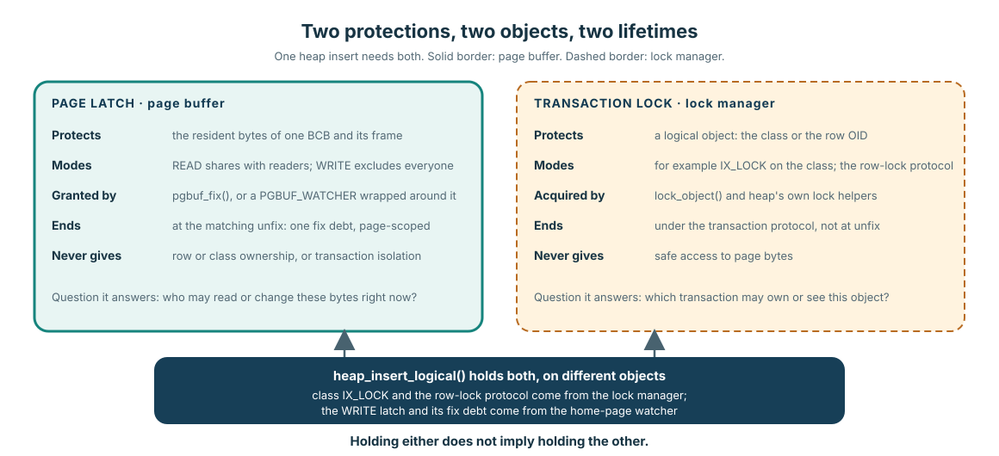
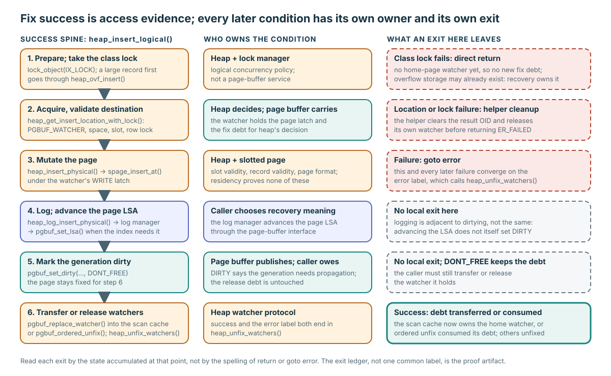

# Caller Completes Correctness: From Access to Logged Mutation

**Level:** Core
**Prerequisites:** [Fix, Hold, and Release](./02-fix-hold-release.md)
**Capability gained:** Trace a mutating caller past successful acquisition, identify which layer owns each correctness condition, and audit cleanup on every exit.
**Source baseline:** `f799e05d77d5300c6ea5753b4a6cc7caee6d8912`
**Evidence used:** Interface contract, Verified mechanism, and Implementation policy from the [pinned-source inventory](../source-inventory.md) and the exact source ranges cited below.

## The maintainer problem

`pgbuf_fix()` returning a non-`NULL` pointer is only an access result. It says nothing about whether a heap slot is suitable, a record representation is valid, a transaction owns the required logical lock, the right recovery record was appended, or every error path releases what it acquired. Those are caller-completed correctness conditions.

The practical review question is therefore not “did fix succeed?” but:

> Which layer establishes each precondition, and which exits still own a page, watcher, lock, or recovery obligation?

## Contract ledger from acquisition through durable mutation

| Page-buffer or log-layer guarantee | Caller obligation |
|---|---|
| A successful fix identifies the requested resident page, records fix ownership, and grants the requested page latch. | Choose fetch intent, latch mode, and wait policy from caller knowledge; then validate the page type and logical identity expected by the access method. |
| A WRITE latch excludes conflicting page-byte access according to the page-latch protocol. | Obtain the transaction lock that protects the logical database object. A page latch and transaction lock protect different state. |
| The returned pointer exposes the resident page representation while fix ownership is held. | Interpret the on-page layout, establish record validity and slot validity, and preserve page-format invariants. |
| A recovery-log append that carries `LOG_DATA_ADDR.pgptr` can advance the page LSA through `pgbuf_set_lsa()`. | Choose the recovery index and undo/redo payload with the correct logging semantics for the mutation. |
| `pgbuf_set_dirty()` publishes that the resident generation needs propagation. | Call it only after the intended mutation/logging sequence, and retain or release ownership deliberately. |
| Unfix consumes one page-fix debt. | Balance every successful acquisition, including failure and restart paths; decide any higher-level retry. |

**Interface contract:** a page latch protects access to the in-memory page bytes. A transaction lock protects a logical database object across the transaction protocol. Holding either one does not imply holding the other.

**Implementation policy:** heap insert deliberately composes both mechanisms: class/row locking belongs to heap and lock management, while a page watcher carries the page-buffer latch and fix debt. Review them as two ledgers, not as interchangeable “locks.”

The visual keeps the two protections side by side because the same heap insert needs both. The latch belongs to one resident frame and ends at unfix; the lock belongs to a class or row identity and follows the transaction protocol. Neither column is a stronger form of the other, so a review that finds one must still look for the other.

## One complete caller trace: `heap_insert_logical()`

The representative path is `heap_insert_logical()` at `src/storage/heap_file.c:23120-23324`. It is large enough to expose the real ownership boundary but still has a recognizable success spine.

Use the spine as the reading order for the six steps below, and the right-hand column as the shape of the exit ledger that the Understanding check asks for. Two exits deserve attention before the details: the class-lock failure returns before any home-page watcher exists but can follow overflow storage that was already created, and every later failure converges on the `error:` label.

### 1. Prepare and take the transaction lock

The caller validates its operation context, adjusts the record header, handles a possible multipage record, and ensures the class has `IX_LOCK` (or the bulk-operation equivalent). This is logical concurrency policy, not a service performed by `pgbuf_fix()`.

The order matters on one direct error exit. For a large record, `heap_ovf_insert()` succeeds inside `heap_insert_handle_multipage_record()` and replaces `recdes_p` with a forwarding record before `lock_object()` requests the class lock. If that class lock fails, `heap_insert_logical()` takes a direct return. No destination or home-page watcher has been acquired yet, so this exit has no new home-page fix debt; however, overflow storage was already created and no compensating overflow deletion is visible on the local path. The successful overflow operation attaches its system operation to the outer transaction, so transaction recovery owns that already-created overflow/recovery obligation. This is a source-visible ordering and ownership boundary, not evidence of a surviving leak or production defect.

Source: overflow setup in `src/storage/heap_file.c:20469-20486`; successful system-operation attachment and local-error abort in `src/storage/overflow_file.c:146-258`; wrapper order in `src/storage/heap_file.c:23120-23221`; and the direct return at `src/storage/heap_file.c:23217-23220`.

### 2. Acquire and validate the destination

`heap_get_insert_location_with_lock()` finds or accepts a candidate page, carries it in a `PGBUF_WATCHER`, checks available space for a hinted page, derives the page identity, selects a free slot, and obtains the applicable row/self-lock protocol. On its lock-failure exit it clears the result OID and releases or relinquishes the selected watcher.

The acquired page is necessary evidence that heap can inspect bytes under a latch. The space check, slot choice, record rules, and object lock are the evidence that this page is a valid heap insertion destination.

Source: `src/storage/heap_file.c:20493-20664` and the call at `src/storage/heap_file.c:23223-23227`.

### 3. Mutate the page

`heap_insert_physical()` asserts the expected context and fixed page, validates the chosen OID fields, optionally checks the heap class in debug builds, and calls `spage_insert_at()`. These are heap/slotted-page responsibilities. Page-buffer residency does not prove that the slot or record is valid.

Source: `src/storage/heap_file.c:20821-20876`, within the combined physical-mutation and logging range `src/storage/heap_file.c:20821-20939`, and `src/storage/heap_file.c:23231-23238`.

### 4. Append recovery logging and advance the page LSA

`heap_log_insert_physical()` constructs a `LOG_DATA_ADDR` containing the page pointer, file identifier, and slot offset, then chooses MVCC or non-MVCC recovery logging. In the ordinary undo/redo append path, the log manager allocates the record, assigns its starting LSA, and calls `pgbuf_set_lsa()` when the recovery index requires a page LSA.

**Implementation policy:** the caller chooses the recovery meaning; the log manager advances the page LSA through the page-buffer interface. Do not rewrite this as “dirtying sets the page LSA”—the two operations are adjacent but distinct.

Source: `src/storage/heap_file.c:20879-20939`, `src/storage/heap_file.c:23242-23255`, `src/transaction/log_manager.c:2194-2226`, and `src/storage/page_buffer.c:4983-5055`.

### 5. Mark the generation dirty

After the physical insertion and ordinary operation logging, `heap_insert_logical()` calls `pgbuf_set_dirty(..., DONT_FREE)`. `DONT_FREE` keeps the page fixed for the following ownership decision; it does not erase the caller’s release debt.

Source: `src/storage/heap_file.c:23257-23260`.

### 6. Transfer or release every watcher

On success, the caller either transfers the home watcher into the scan cache with `pgbuf_replace_watcher()` or releases it with `pgbuf_ordered_unfix()`. It then calls `heap_unfix_watchers()` for the remaining context pages. The common `error:` label calls that cleanup again, allowing later failures to converge on the same ownership audit.

The direct early returns occur before this success release block. Some happen before this function has acquired a destination; the location helper has its own cleanup for a failed selection. But “before destination acquisition” is not equivalent to “no state”: the class-lock return above can follow a successful overflow insertion. Do not infer safety from the spelling of `return` or `goto error`; inspect page-buffer debt, helper-owned state, and higher-layer recovery obligations accumulated at that exact exit.

Source: `src/storage/heap_file.c:23262-23324`.

## `NEW_PAGE` means materialize after allocation

`PAGE_FETCH_MODE::NEW_PAGE` is caller knowledge that an already allocated page identity is being materialized. It is not an allocation operation.

`file_alloc()` makes the ordering visible: file-manager code performs allocation before the `pgbuf_fix(..., NEW_PAGE, PGBUF_LATCH_WRITE, ...)` call. It updates the numerable-file table when needed, then uses the page initializer to supply type/layout and logging appropriate to that file. File management also handles TDE state and release/return ownership.

Source: `src/storage/file_manager.c:5420-5590`.

**Caller rule:** allocation state, page type, initial on-page layout, recovery semantics, dirtying, and cleanup remain with the allocating subsystem. Page buffer materializes and protects the resident frame.

## B-tree contrast: failed promotion can mean restart

Heap insert’s success spine acquires a destination suitable for a write. B-tree traversal shows why higher-level retry cannot be hidden in the generic fix contract.

The B-tree caller may begin with a READ latch, discover that a split or header update requires WRITE, attempt `pgbuf_promote_read_latch()`, and—if promotion reports `ER_PAGE_LATCH_PROMOTE_FAIL`—unfix pages, switch its traversal policy to WRITE, set `restart`, and return to its caller. Elsewhere, callers use conditional acquisition for algorithms that must not wait while holding an incompatible page set.

This is the core lesson: conditional acquisition, promotion, and restart are access-method policy. Their queueing and ordering internals belong in [Acquisition Concurrency and Multi-page Ownership](../advanced/acquisition-concurrency.md).

Source: `src/storage/btree.c:28365-28393` and `src/storage/btree.c:28638-28696`.

## Understanding check: audit every exit

Use the pinned `heap_insert_logical()` and produce an exit ledger.

### Predict

Before reading helpers, mark every `return` and `goto error`. For each, predict whether the context can own the home watcher, another watcher, a transferred scan-cache watcher, or an unlogged/dirty mutation.

### Locate

Trace `heap_get_insert_location_with_lock()`, `heap_insert_physical()`, `heap_log_insert_physical()`, `pgbuf_set_lsa()`, `pgbuf_set_dirty()`, `pgbuf_replace_watcher()`, `pgbuf_ordered_unfix()`, and `heap_unfix_watchers()`. Include the watcher transfer path; do not stop at the successful return.

### Explain

For every exit, record: acquired state, the function that consumes or transfers it, and the remaining logical lock/retry consequence. Flag any conclusion that depends on a helper rather than visible local cleanup.

### Model answer

Fix success stops being sufficient evidence immediately after acquisition: it proves protected access to the requested resident page, not a valid heap destination or a correct mutation. The location helper must establish space, slot, identity, and logical-lock conditions; the physical helper must preserve the slotted-page layout; heap logging must choose recovery meaning and cause the page LSA to advance; dirtying must publish the changed generation; and each watcher must be transferred or released.

The success path transfers or ordered-unfixes the home watcher and cleans the remaining watchers. Physical-insert and later failures converge on `error:` cleanup. Earlier direct returns require local inspection: a failed location selection relies on the location helper’s cleanup, while class-lock failure has no home-page watcher but can follow overflow storage already created by `heap_ovf_insert()`. That state is a higher-layer transaction/recovery obligation, not page-buffer debt. This is why an exit ledger—not the presence of one common label—is the proof artifact.

## Learning navigation

**Previous:** [Fix, Hold, and Release](./02-fix-hold-release.md)
**Next:** [Flush One Generation](./04-flush-one-generation.md)

## Related routes

- [Practice the caller-obligation ledger](../questions/core.md#pgbuf-qb-020-what-correctness-remains-with-a-mutating-caller)
- [Change the Module Safely](../playbooks/change-safely.md)
- [Source and Caller Map](../reference/source-map.md)
- [Acquisition Concurrency and Multi-page Ownership](../advanced/acquisition-concurrency.md)
- [Recovery, Allocation State, and Module Lifecycle](../advanced/recovery-and-lifecycle.md)
