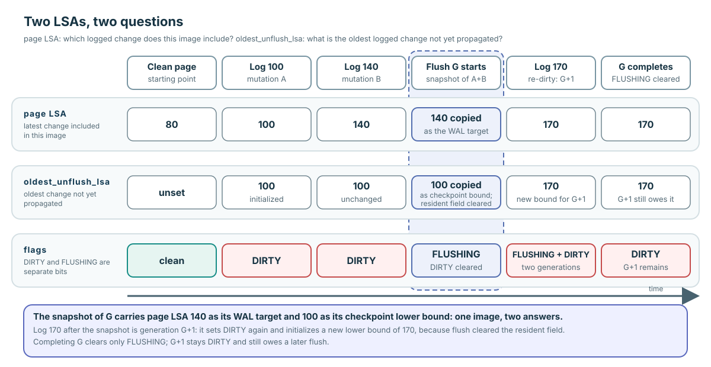

# Flush One Generation: WAL, DWB, and Concurrent Re-dirty

**Level:** Core
**Prerequisites:** [Caller Completes Correctness](./03-caller-completes-correctness.md)
**Capability gained:** Explain and review one dirty generation from logged mutation through stable copy, WAL gating, write submission, concurrent re-dirty, completion, and ordinary rollback.
**Source baseline:** `f799e05d77d5300c6ea5753b4a6cc7caee6d8912`
**Evidence used:** Interface contract, Verified mechanism, Implementation policy, Inference, and Runtime observation from the [pinned-source inventory](../source-inventory.md), [uncertainty registry](../unresolved-or-version-sensitive-findings.md), and exact source ranges below.

## Four moments that must not collapse into “written”

| Moment | What it establishes | What it does not establish |
|---|---|---|
| **Write permission** | A WRITE latch permits exclusive mutation of resident bytes. | Recoverability or persistence. |
| **Recoverability** | An appropriate log record and page LSA let recovery reason about the page change. | That commit WAL or the home page is durable. |
| **Transaction durability** | Commit WAL has reached its required durable boundary. | That every changed data page has reached its home volume. |
| **Page propagation** | A copied page generation has completed the configured DWB/direct-write boundary. | That a concurrently re-dirtied resident generation is clean. |

This separation is the durability contract. A review that says only “flush succeeds” has not identified which moment it means.

## Two LSAs, two questions

The **page LSA** in the page header answers: “which logged change does this resident image include?” The flush path copies it into local `lsa` and asks the log manager to force WAL through it before submitting that copied non-temporary image.

`oldest_unflush_lsa` answers a different checkpoint question: “what is the oldest logged change represented by the currently unpropagated dirty generation?” It is initialized when page logging first makes the generation relevant, copied by flush, and cleared from the BCB while that generation is in flight.

### Worked example

Suppose clean page P starts at page LSA 80. Mutation A appends log 100; P becomes `DIRTY`, its page LSA becomes 100, and `oldest_unflush_lsa` becomes 100. Mutation B appends log 140 before any flush: the page LSA advances to 140, while the lower bound remains 100.

A flush snapshots bytes containing A+B, copies page LSA 140 as its WAL target, and carries 100 as the dirty generation’s checkpoint lower bound. The values differ because “latest change in this image” and “oldest change not yet propagated” are different questions.

The timeline extends the worked example by one event: log 170 arrives while G is in flight. Because the flush cleared the resident lower-bound field, that mutation initializes a new `oldest_unflush_lsa` of 170 for generation G+1, and completing G clears only `FLUSHING`. The Understanding check below asks you to predict exactly these values before reading the source.

Source: page-LSA/lower-bound coupling at `src/storage/page_buffer.c:4983-5055`; flush consumption at `src/storage/page_buffer.c:10723-10962`.

## One flush-generation timeline

`pgbuf_bcb_flush_with_wal()` enters with BCB protection held. For an ordinary successful generation G, read the order exactly:

1. Validate the BCB identity.
2. Set `FLUSHING` and clear `DIRTY`. This creates a separate slot for any later resident mutation.
3. Make a stable snapshot of the page bytes, encrypting the copied image when TDE applies; reserve/copy into a DWB slot when configured.
4. Copy the snapshot page LSA and `oldest_unflush_lsa`, then clear the resident lower-bound field.
5. Release BCB protection.
6. For a logged non-temporary generation, force WAL through the copied page LSA.
7. Submit the copied image to DWB or the direct data-volume write path.
8. Reacquire BCB protection for ordinary completion, clear `FLUSHING`, and wake flush waiters. Under pressure, the post-flush handoff may own completion instead.

Source: `src/storage/page_buffer.c:10723-10962`; flag helpers at `src/storage/page_buffer.c:16077-16126`; WAL gate at `src/transaction/log_page_buffer.c:4150-4189`.

## Concurrent re-dirty is generation G+1

After step 2, another writer can acquire the page, mutate resident bytes, append newer logging, and set `DIRTY` again while snapshot G is in flight. That mutation is generation G+1.

Successful completion of G clears only `FLUSHING`; it does not clear the newer `DIRTY`. Generation G+1 stays `DIRTY` with its own lower-bound material and requires a later flush. This flag split is the reason completion must never blindly “mark the page clean.”

**Implementation policy:** `pgbuf_bcb_mark_is_flushing()` clears the old `DIRTY`; `pgbuf_bcb_mark_was_flushed()` clears only `FLUSHING`. Source: `src/storage/page_buffer.c:16077-16112`.

## Ordinary failure restores retryable state

If DWB addition or direct I/O fails after BCB protection was released, the ordinary error path reacquires it, clears `FLUSHING`, restores `DIRTY` when the captured generation had been dirty, restores the copied `oldest_unflush_lsa`, wakes waiters, and returns failure. That rollback preserves the dirty generation and its checkpoint lower bound for retry.

Source: `src/storage/page_buffer.c:10908-10923` and `src/storage/page_buffer.c:16115-16126`.

### Unresolved early-return candidate

`VS-12` routes this proof obligation to the [uncertainty registry](../unresolved-or-version-sensitive-findings.md), the sole status owner. TDE encryption failure and DWB-slot reservation failure return at `src/storage/page_buffer.c:10809-10828`, before the ordinary rollback block. Source inspection raises a surviving-state concern; only reachable fault injection that inspects `DIRTY`, `FLUSHING`, the oldest LSA, waiters, and retry behavior can establish impact. This page does not assign defect or current-branch status.

## Persistence boundaries: name the one you observed

- **TDE** transforms the copied image before submission; the resident plaintext ownership protocol is separate.
- **DWB** acceptance and later home-page persistence are different boundaries. DWB protects page-image integrity; it does not replace WAL or recovery.
- **Direct-write** completion is the page buffer’s data-volume write boundary when DWB is not used for the submission.
- **Home-page persistence** must not be inferred from a generic page-buffer trace event when the configured path may have completed at DWB-slot acceptance.

Use the wording: “the page-buffer flush path completed at its configured DWB/direct-write boundary” unless evidence observes a later home-volume event.

## Runtime evidence card: dirty generation and backup boundary

**Setup:** **Revision/build/configuration/workload:** CUBRID `f799e05d77d5300c6ea5753b4a6cc7caee6d8912`, sealed CUBRID 11.5.0.2397 64-bit debug build, dedicated database `ca_pgbuf_f799e05` under captured runtime-environment hash `0c23b2fc…`, and table `ca_pb_e4` with 10,000 generation-0 rows and fixed-length payloads. The card does not preserve a separate page-buffer parameter snapshot, so configuration-dependent generalization is unsupported.

**Observation:** Run `rebind-exp4` produced generation min/max 1/1, row count 10,000, zero length violations, and 58,430 dirty calls; `rebind-exp4-backup` completed the accepted synchronous backup.

**Supported conclusion:** The run exercised expected mutation/commit state and a synchronous operational boundary.

**Unsupported conclusion:** It does not prove per-page WAL-before-data order, DWB completion, physical victimization, crash recovery, or a count of data-page writes.

**Receipt:** [Runtime evidence inventory](../source-inventory.md).

## Understanding check: build the generation timeline

### Predict

Start with page LSA 80. Apply log records 100 and 140, begin flush G, then apply log 170 while G is in flight. Predict `DIRTY`, `FLUSHING`, page LSA, and `oldest_unflush_lsa` immediately before and after successful G completion. Then predict the ordinary post-submission failure state.

### Locate

Trace `pgbuf_bcb_mark_is_flushing()`, the snapshot/LSA copies, `logpb_flush_log_for_wal()`, DWB/direct submission, `pgbuf_bcb_mark_was_flushed()`, and `pgbuf_bcb_mark_was_not_flushed()` in the cited ranges.

### Explain

Mark each statement as supported by source, runtime evidence, inference, or still unverified. Explain which generation each flag and LSA belongs to.

### Model answer

Before flush, page LSA is 140 and the lower bound is 100. Starting G sets `FLUSHING`, clears the old `DIRTY`, snapshots LSA 140/lower bound 100, then clears the resident lower bound. Log 170 creates G+1: resident page LSA 170, `DIRTY` set, and a new lower bound for G+1, while `FLUSHING` still represents G. Successful G completion clears only `FLUSHING`, so G+1 stays dirty.

On an ordinary post-submission failure, the code restores G’s dirty bit if it was dirty and restores its captured lower bound before waking waiters. Source establishes this control flow. The recorded runtime observation does not establish this exact interleaving; a controlled schedule and failure injection are needed for runtime evidence at that boundary. Evaluate the earlier TDE/DWB-slot returns through `VS-12` without copying its registry status here.

## Learning navigation

**Previous:** [Caller Completes Correctness](./03-caller-completes-correctness.md)
**Next:** [Replace One Frame](./05-replace-one-frame.md)

## Related routes

- [Practice mutation versus durability](../questions/core.md#pgbuf-qb-025-why-is-a-write-latch-not-durability)
- [Verify at the Risk Boundary](../playbooks/verify-a-change.md)
- [Evidence and uncertainty registry](../unresolved-or-version-sensitive-findings.md)
- [Maintainer Invariant Index](../reference/invariant-index.md)
- [Recovery, Allocation State, and Module Lifecycle](../advanced/recovery-and-lifecycle.md)
