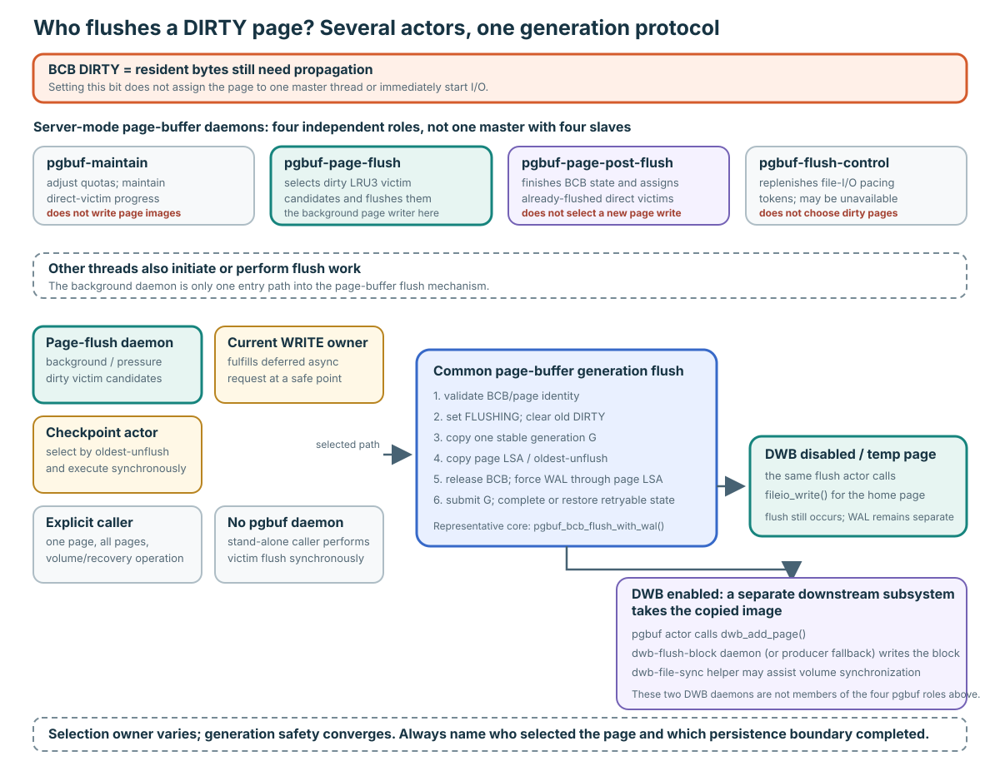
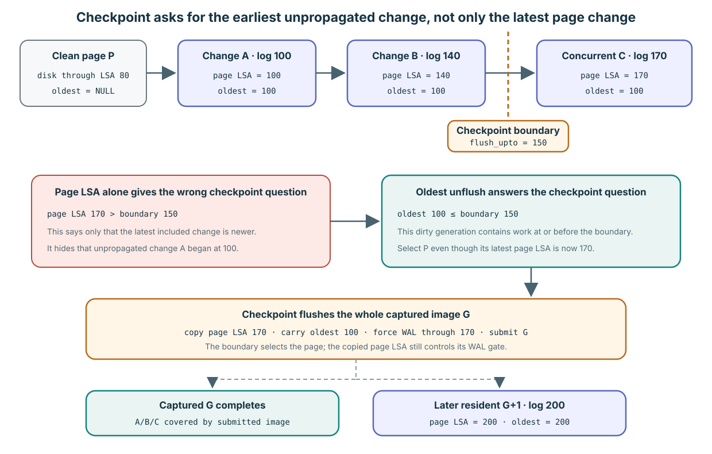
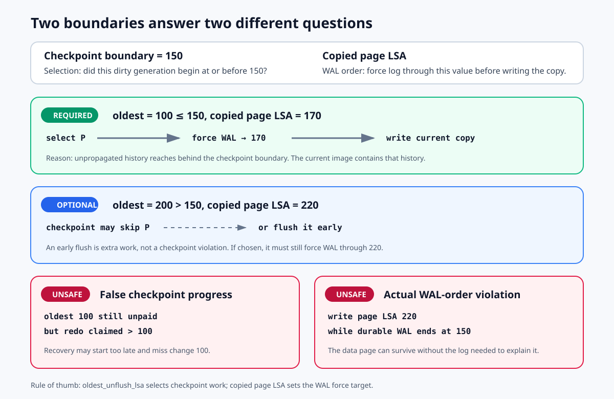

# Flush One Generation: WAL, DWB, and Concurrent Re-dirty

**Level:** Core
**Prerequisites:** [Caller Completes Correctness](./03-caller-completes-correctness.md)
**Capability gained:** Explain and review one dirty generation from logged mutation through stable copy, WAL gating, write submission, concurrent re-dirty, completion, and ordinary rollback.
**Source baseline:** `f799e05d77d5300c6ea5753b4a6cc7caee6d8912`
**Evidence used:** Interface contract, Verified mechanism, Implementation policy, Inference, and Runtime observation from the [pinned-source inventory](../source-inventory.md), [uncertainty registry](../unresolved-or-version-sensitive-findings.md), and exact source ranges below.

## What flushing is and why the page buffer does it

**Flushing** captures a stable image of a resident page and sends that image through the required WAL gate toward persistent page storage. Database mutation happens first in a volatile in-memory frame; setting `DIRTY` records that the resident image has propagation work that is not yet discharged. Flush processes that work so page changes can move beyond volatile buffer memory, checkpoint and shutdown can progress, and a clean unfixed frame can later become eligible for replacement.

Flush is not commit, unfix, eviction, or page deallocation. A successful flush may leave the page resident. The `FLUSHING` flag is likewise not a command: it says a previously captured image is currently owned by an in-progress flush operation.

## Who actually performs a flush?

`DIRTY` does not name one owner and is not a per-page job inserted into a daemon queue. Setting it publishes that resident bytes still need propagation. A later policy or caller selects the page; the selected thread then enters the common generation-flush mechanism described below.

### Four page-buffer daemons are independent roles, not master and slaves

In server mode, the pinned `pgbuf_daemons_init()` attempts to create four daemon objects through the common thread manager. They do not form a page-flush master with four worker slaves:

| Page-buffer daemon | What it owns | Does it initiate a page-image write? |
|---|---|---|
| `pgbuf-maintain` | Periodic quota adjustment and direct-victim progress. | No. |
| `pgbuf-page-flush` | Select dirty LRU3 victim candidates under background/replacement-pressure policy and flush them. | **Yes. This is the page-buffer background flusher.** |
| `pgbuf-page-post-flush` | Finish BCB state and direct-victim handoff for pages the page-flush daemon already submitted. | No new page write; it processes completed submissions. |
| `pgbuf-flush-control` | Replenish file-I/O pacing tokens. Initialization can leave this daemon absent. | No; it controls rate rather than selecting a page. |

The objects are created before log recovery, but their tasks return while the boot-level flush-daemon gate is closed; boot enables them after recovery. Stand-alone builds do not create these page-buffer daemons. Counts, periods, thresholds, and batching are revision-bound **Implementation policy**, not a fix/unfix Interface contract.

### The background flusher is not the only flusher

The important distinction is **who selects the dirty page**, not whether every path has a daemon name:

| Selection owner or trigger | What happens at the pinned revision |
|---|---|
| Background/replacement pressure | `pgbuf-page-flush` scans dirty victim-zone candidates. It does not sweep every dirty BCB merely because `DIRTY` became set. |
| Checkpoint | The log checkpoint actor calls `pgbuf_flush_checkpoint()` in its own thread. That routine scans the BCB table, selects generations whose `oldest_unflush_lsa` crosses the checkpoint boundary, and performs the selective flush. It is not delegated to `pgbuf-page-flush`. |
| Explicit page, volume, recovery, or shutdown work | The calling thread executes `pgbuf_flush_with_wal()` or a `pgbuf_flush_all*()` path synchronously. |
| Another thread asks to flush a page held WRITE | Immediate copying would race with mutation. The requester publishes `PGBUF_BCB_ASYNC_FLUSH_REQ`; the WRITE owner fulfills it at a safe point such as final unfix, or a permanently latched owner checks `pgbuf_flush_if_requested()`. A synchronous requester can wait for that completion. |
| No page-flush daemon in stand-alone mode | The requesting thread calls victim flushing synchronously and searches for a victim again. |

All of these selectors converge on the same per-BCB safety work: claim one generation with `FLUSHING`, copy stable bytes and LSA state, force WAL as required, submit through DWB or direct I/O, then complete or restore retryable state. This convergence is why “the daemon flushed it” is often too vague for a review: name both the selection owner and the common generation boundary.

If DWB is enabled, the page-buffer actor may finish its submission by calling `dwb_add_page()`. The separate DWB subsystem has its own flush-block and file-sync-helper daemons; they are **not** two more members of the four page-buffer roles. When the DWB flush daemon is unavailable, a producer can flush the DWB block itself. With DWB disabled (and for temporary pages on this path), the page-buffer actor calls `fileio_write()` directly for the home page.

Source: daemon tasks and creation at `src/storage/page_buffer.c:16972-17255`; boot gating at `src/transaction/boot_sr.c:2415-2440`; direct and whole-pool interfaces at `src/storage/page_buffer.c:3570-3751`; checkpoint selection/execution at `4173-4610`; deferred-owner handoff at `6815-6890,8810-8901`; stand-alone fallback at `11678-11702`; DWB submission and daemon roles at `src/storage/double_write_buffer.cpp:2715-2820,4017-4120`. Detailed evidence: [Dirty-page Flush Actors](../reference/dirty-page-flush-actors.md).

## Four moments that must not collapse into “written”

| Moment | What it establishes | What it does not establish |
|---|---|---|
| **Write permission** | A WRITE latch permits exclusive mutation of resident bytes. | Recoverability or persistence. |
| **Recoverability** | An appropriate log record and page LSA let recovery reason about the page change. | That commit WAL or the home page is durable. |
| **Transaction durability** | Commit WAL has reached its required durable boundary. | That every changed data page has reached its home volume. |
| **Page propagation** | A copied page generation has completed the configured DWB/direct-write boundary. | That a concurrently re-dirtied resident generation is clean. |

This separation is the durability contract. A review that says only “flush succeeds” has not identified which moment it means.

## Two LSAs, two questions

The **page LSA** in the page header answers: “which logged change does this resident image include?” The flush path copies it into local `lsa` and asks the log manager to force WAL through it before submitting that copied non-temporary image.

`oldest_unflush_lsa` answers a different checkpoint question: “what is the oldest logged change represented by the currently unpropagated dirty generation?” It is initialized when page logging first makes the generation relevant, copied by flush, and cleared from the BCB while that generation is in flight.

### Worked example

Suppose clean page P starts at page LSA 80. Mutation A appends log 100; P becomes `DIRTY`, its page LSA becomes 100, and `oldest_unflush_lsa` becomes 100. Mutation B appends log 140 before any flush: the page LSA advances to 140, while the lower bound remains 100.

A flush snapshots bytes containing A+B, copies page LSA 140 as its WAL target, and carries 100 as the dirty generation’s checkpoint lower bound. The values differ because “latest change in this image” and “oldest change not yet propagated” are different questions.

The timeline extends the worked example by one event: log 170 arrives while G is in flight. Because the flush cleared the resident lower-bound field, that mutation initializes a new `oldest_unflush_lsa` of 170 for generation G+1, and completing G clears only `FLUSHING`. The Understanding check below asks you to predict exactly these values before reading the source.

Source: page-LSA/lower-bound coupling at `src/storage/page_buffer.c:4983-5055`; flush consumption at `src/storage/page_buffer.c:10723-10962`.

### Why `DIRTY` and page LSA cannot replace `oldest_unflush_lsa`

`DIRTY` is a yes/no propagation debt. Page LSA is the latest logged change included in the resident bytes. A checkpoint needs a third fact: the earliest logged change in the current dirty generation that has not yet been propagated.

Suppose disk has page P through LSA 80. A first change at 100 sets page LSA and `oldest_unflush_lsa` to 100. A second change at 140 advances page LSA to 140 but must leave the lower bound at 100. The checkpoint then chooses `flush_upto_lsa = 150`. Before the scan, another change at 170 advances page LSA to 170; because no image containing the older work has been propagated yet, `oldest_unflush_lsa` remains 100.

Assume P is unfixed and otherwise flushable when scanned:

| Value used as checkpoint predicate | Answer | Consequence |
|---|---|---|
| page LSA 170 > boundary 150 | “The latest included change is newer than the boundary.” | Misusing this value would skip P and hide still-unpropagated change A at 100. |
| oldest-unflush 100 ≤ boundary 150 | “This dirty generation began at or before the boundary.” | Select P for checkpoint propagation. |

Selection by 100 does not mean writing a historical page version. Flush copies the current image containing A+B+C, carries lower bound 100 for checkpoint accounting, and uses copied page LSA 170 as the WAL force target. The lower bound decides whether the generation crosses the checkpoint boundary; the page LSA decides how far WAL must precede that captured image.

### Newer than the checkpoint boundary is not unsafe to flush

`flush_upto_lsa` is a **checkpoint selection boundary**, not the WAL force target. If P has `oldest_unflush_lsa = 200` and the checkpoint boundary is 150, this dirty generation began after the boundary. `pgbuf_flush_checkpoint()` may skip P because the current checkpoint does not need that propagation to cover its chosen history.

Another background or pressure-driven operation may nevertheless flush P. That is safe extra work, provided the ordinary flush protocol forces WAL through the **copied page LSA** before submitting the page image. For example, if the copied page LSA is 220, forcing WAL only through the checkpoint boundary 150 is insufficient; WAL must be forced through 220.

Two different mistakes are genuinely unsafe:

1. **False checkpoint progress:** P still has unpropagated history beginning at 100, but checkpoint accounting records a redo start later than 100. Recovery may then start too late and miss the change. Merely failing to flush P is not itself corrupt if the smallest remaining lower bound correctly keeps redo at or before 100; the unsafe act is claiming that the outstanding history is covered.
2. **Page-before-WAL ordering:** a copied page with page LSA 220 reaches page storage while durable WAL ends at 150. A crash can then preserve page bytes whose explaining log record is absent. This, not `oldest_unflush_lsa > flush_upto_lsa`, is the WAL-order violation.

The compact rule is: **oldest-unflush selects checkpoint work; copied page LSA sets the WAL force target.**

The field's lifetime preserves this meaning:

1. A clean generation has a null lower bound.
2. The first logged dirty change initializes it from the new page LSA.
3. Later changes advance page LSA but do not advance the lower bound; doing so would forget older unpaid history.
4. A flush copies the lower bound and clears the resident field, letting a concurrent G+1 mutation establish a new lower bound.
5. Ordinary flush failure restores the copied value so the old debt remains retryable and visible to checkpoint accounting.

It is not the oldest LSA ever seen by the page, the oldest active transaction, or persisted page-header state. It is volatile BCB metadata scoped to the current unpropagated dirty generation.

**Where the source says this:** the field comment calls it “the oldest LSA record of the page that has not been written to disk” at `src/storage/page_buffer.c:541`. `pgbuf_set_lsa()` initializes it only when null at `5041-5071`. The contract comment for `pgbuf_flush_checkpoint()` says it flushes dirty unfixed pages whose LSA reaches the checkpoint and returns the smallest LSA among remaining dirty buffers at `4172-4186`; selection uses `oldest_unflush_lsa` against `flush_upto_lsa` at `4247-4257`, then revalidates concurrent state and computes the remaining minimum at `4533-4600`. The log manager calls this operation to find the next redo point at `src/transaction/log_page_buffer.c:6974-7030` and records the resulting smallest LSA at `7217-7225`.

## One flush-generation timeline

`pgbuf_bcb_flush_with_wal()` enters with BCB protection held. For an ordinary successful generation G, read the order exactly:

1. Validate the BCB identity.
2. Set `FLUSHING` and clear `DIRTY`. This creates a separate slot for any later resident mutation.
3. Make a stable snapshot of the page bytes, encrypting the copied image when TDE applies; reserve/copy into a DWB slot when configured.
4. Copy the snapshot page LSA and `oldest_unflush_lsa`, then clear the resident lower-bound field.
5. Release BCB protection.
6. For a logged non-temporary generation, force WAL through the copied page LSA.
7. Submit the copied image to DWB or the direct data-volume write path.
8. Reacquire BCB protection for ordinary completion, clear `FLUSHING`, and wake flush waiters. Under pressure, the post-flush handoff may own completion instead.

Source: `src/storage/page_buffer.c:10723-10962`; flag helpers at `src/storage/page_buffer.c:16077-16126`; WAL gate at `src/transaction/log_page_buffer.c:4150-4189`.

## Concurrent re-dirty is generation G+1

After step 2, another writer can acquire the page, mutate resident bytes, append newer logging, and set `DIRTY` again while snapshot G is in flight. That mutation is generation G+1.

Successful completion of G clears only `FLUSHING`; it does not clear the newer `DIRTY`. Generation G+1 stays `DIRTY` with its own lower-bound material and requires a later flush. This flag split is the reason completion must never blindly “mark the page clean.”

**Implementation policy:** `pgbuf_bcb_mark_is_flushing()` clears the old `DIRTY`; `pgbuf_bcb_mark_was_flushed()` clears only `FLUSHING`. Source: `src/storage/page_buffer.c:16077-16112`.

### Why DIRTY alone is insufficient

Two facts can be true at once: copied generation G is already in flight, and a writer has created resident generation G+1 that needs another flush. `FLUSHING` records the first fact while `DIRTY` remains available to record the second.

The split also coordinates flush ownership. `pgbuf_bcb_safe_flush_internal()` refuses to start a competing flush while `FLUSHING` is set. The source explains why: if G and G+1 were submitted concurrently and storage completions reordered, old G could overwrite newer G+1. A synchronous caller that finds an existing flush joins the BCB wait path; success or ordinary failure clears `FLUSHING` and wakes flush waiters. Thus the flag does not freeze writers. It prevents unsafe overlapping flush ownership, preserves a newer dirty publication, and provides an explicit wait/completion state.

Source: concurrent-flush decision and waiting at `src/storage/page_buffer.c:8809-8901`, including the out-of-order overwrite rationale at `8839-8847`; completion/failure wakeups at `10908-10951`.

## Ordinary failure restores retryable state

If DWB addition or direct I/O fails after BCB protection was released, the ordinary error path reacquires it, clears `FLUSHING`, restores `DIRTY` when the captured generation had been dirty, restores the copied `oldest_unflush_lsa`, wakes waiters, and returns failure. That rollback preserves the dirty generation and its checkpoint lower bound for retry.

Source: `src/storage/page_buffer.c:10908-10923` and `src/storage/page_buffer.c:16115-16126`.

### Unresolved early-return candidate

`VS-12` routes this proof obligation to the [uncertainty registry](../unresolved-or-version-sensitive-findings.md), the sole status owner. TDE encryption failure and DWB-slot reservation failure return at `src/storage/page_buffer.c:10809-10828`, before the ordinary rollback block. Source inspection raises a surviving-state concern; only reachable fault injection that inspects `DIRTY`, `FLUSHING`, the oldest LSA, waiters, and retry behavior can establish impact. This page does not assign defect or current-branch status.

## Persistence boundaries: name the one you observed

- **TDE** transforms the copied image before submission; the resident plaintext ownership protocol is separate.
- **DWB** acceptance and later home-page persistence are different boundaries. DWB protects page-image integrity; it does not replace WAL or recovery.
- **Direct-write** completion is the page buffer’s data-volume write boundary when DWB is not used for the submission.
- **Home-page persistence** must not be inferred from a generic page-buffer trace event when the configured path may have completed at DWB-slot acceptance.

Use the wording: “the page-buffer flush path completed at its configured DWB/direct-write boundary” unless evidence observes a later home-volume event.

The private stable-image copy is not itself a DWB write. `pgbuf_bcb_flush_with_wal()` first copies or encrypts the resident image into local aligned storage. For a non-temporary page it uses DWB only when `dwb_is_created()` is true. Otherwise, after any required WAL force, it calls `fileio_write()` for the home data-volume location. Disabling DWB therefore does not disable flush: it selects direct write and removes DWB's torn/incomplete-page protection and startup repair source, while WAL keeps its separate ordering and recovery role. Temporary pages bypass DWB on this path even when DWB exists.

Source: stable copy and `uses_dwb` decision at `src/storage/page_buffer.c:10735-10834`; DWB/direct submission at `10836-10899`. The runtime-disable retry in that range is test-oriented; the source says live activation/deactivation needs additional work.

## Runtime evidence card: dirty generation and backup boundary

**Setup:** **Revision/build/configuration/workload:** CUBRID `f799e05d77d5300c6ea5753b4a6cc7caee6d8912`, sealed CUBRID 11.5.0.2397 64-bit debug build, dedicated database `ca_pgbuf_f799e05` under captured runtime-environment hash `0c23b2fc…`, and table `ca_pb_e4` with 10,000 generation-0 rows and fixed-length payloads. The card does not preserve a separate page-buffer parameter snapshot, so configuration-dependent generalization is unsupported.

**Observation:** Run `rebind-exp4` produced generation min/max 1/1, row count 10,000, zero length violations, and 58,430 dirty calls; `rebind-exp4-backup` completed the accepted synchronous backup.

**Supported conclusion:** The run exercised expected mutation/commit state and a synchronous operational boundary.

**Unsupported conclusion:** It does not prove per-page WAL-before-data order, DWB completion, physical victimization, crash recovery, or a count of data-page writes.

**Receipt:** [Runtime evidence inventory](../source-inventory.md).

## Understanding check: build the generation timeline

### Predict

Start with page LSA 80. Apply log records 100 and 140, begin flush G, then apply log 170 while G is in flight. Predict `DIRTY`, `FLUSHING`, page LSA, and `oldest_unflush_lsa` immediately before and after successful G completion. Then predict the ordinary post-submission failure state.

### Locate

Trace `pgbuf_bcb_mark_is_flushing()`, the snapshot/LSA copies, `logpb_flush_log_for_wal()`, DWB/direct submission, `pgbuf_bcb_mark_was_flushed()`, and `pgbuf_bcb_mark_was_not_flushed()` in the cited ranges.

### Explain

Mark each statement as supported by source, runtime evidence, inference, or still unverified. Explain which generation each flag and LSA belongs to.

### Model answer

Before flush, page LSA is 140 and the lower bound is 100. Starting G sets `FLUSHING`, clears the old `DIRTY`, snapshots LSA 140/lower bound 100, then clears the resident lower bound. Log 170 creates G+1: resident page LSA 170, `DIRTY` set, and a new lower bound for G+1, while `FLUSHING` still represents G. Successful G completion clears only `FLUSHING`, so G+1 stays dirty.

On an ordinary post-submission failure, the code restores G’s dirty bit if it was dirty and restores its captured lower bound before waking waiters. Source establishes this control flow. The recorded runtime observation does not establish this exact interleaving; a controlled schedule and failure injection are needed for runtime evidence at that boundary. Evaluate the earlier TDE/DWB-slot returns through `VS-12` without copying its registry status here.

## Learning navigation

**Previous:** [Caller Completes Correctness](./03-caller-completes-correctness.md)
**Next:** [Replace One Frame](./05-replace-one-frame.md)

## Related routes

- [Practice mutation versus durability](../questions/core.md#pgbuf-qb-025-why-is-a-write-latch-not-durability)
- [Verify at the Risk Boundary](../playbooks/verify-a-change.md)
- [Evidence and uncertainty registry](../unresolved-or-version-sensitive-findings.md)
- [Maintainer Invariant Index](../reference/invariant-index.md)
- [Recovery, Allocation State, and Module Lifecycle](../advanced/recovery-and-lifecycle.md)
- [Replacement Policy and Background Progress](../advanced/replacement-progress.md#daemons-ownership-is-source-visible-cadence-is-version-sensitive)
- [Dirty-page Flush Actors](../reference/dirty-page-flush-actors.md)
