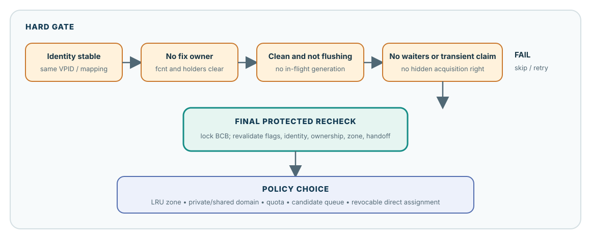

# Replace One Frame: Eligibility Before Policy

**Level:** Core
**Prerequisites:** [Fix, Hold, and Release](./02-fix-hold-release.md) and [Flush One Generation](./04-flush-one-generation.md)
**Capability gained:** Prove whether one resident frame is safe to reuse before evaluating replaceable selection and progress policy.
**Source baseline:** `f799e05d77d5300c6ea5753b4a6cc7caee6d8912`
**Evidence used:** Verified mechanism, Implementation policy, and Runtime observation from the [pinned-source inventory](../source-inventory.md) and exact source ranges cited below.

## The maintainer question

Replacement has two layers. **Eligibility** asks whether reuse is safe now. **Policy** asks which safe candidate should be chosen and how the system should make progress under pressure. An optimization may change policy; it must not weaken eligibility.

## Hard eligibility

A candidate must pass all of these conditions, then pass them again at the protected handoff:

| Predicate | Why reuse must stop when it fails |
|---|---|
| **Identity is stable** | The frame must still represent the VPID/list candidate that selection examined; rebinding stale identity would corrupt the page table. |
| **No ownership remains** | `fcnt` must be zero and no thread may still fix the frame. A waiter or granted/transient claim can make apparently idle state non-reusable. |
| **Generation is propagatable** | `DIRTY` means bytes still need propagation; `FLUSHING` means a copied generation has not completed. Direct-victim flags also exclude ordinary selection. |
| **No conflicting waiter/transient state** | Latch waiters and in-progress protocol states can carry rights not summarized by a casual counter read. |
| **Final protected revalidation succeeds** | Selection observations can go stale. Under BCB protection, recheck flags, ownership, identity/zone, and any handoff-specific conditions immediately before unlink/reuse. |

The pinned ordinary LRU path scans the victim zone, rejects avoid-victim flags and fixed frames, conditionally locks the BCB, calls `pgbuf_is_bcb_victimizable(..., true)`, and only then removes the frame from its LRU list. Source: `src/storage/page_buffer.c:9293-9538`.

### “Protected handoff” in concrete steps

**Handoff** is the ownership transition from “the LRU scan has nominated this pointer” to “the allocator exclusively owns a detached BCB, still locked, and may victimize/rebind it.” The scan result alone carries no such authority.

Suppose the reusable slot at address `BCB[42]` represents VPID A:

1. Under the LRU mutex, the scan reads cheap prefilters: LRU3 membership, avoid-victim flags, `fcnt`, latch mode, and waiter state. It remembers the pointer to `BCB[42]`.
2. Those facts are not all protected by the LRU mutex. A fixer/unfixer or flush/direct-victim protocol can change BCB ownership and flags; another path can own the BCB mutex. “All clear before lock” means only that the prefilter samples passed at this instant.
3. The scan uses `PGBUF_BCB_TRYLOCK()` rather than waiting while it holds the LRU mutex. Failure means another BCB transition is in progress, so the scan skips the candidate.
4. With both the list membership protected by the LRU mutex and the BCB state protected by the BCB mutex, `pgbuf_is_bcb_victimizable(..., true)` reads the current state again. Only an all-clear result permits `pgbuf_remove_from_lru_list()` to unlink it and change its encoded zone to `PGBUF_VOID_ZONE`.
5. The function releases the LRU mutex but returns the BCB still locked. The allocator can now complete `pgbuf_victimize_bcb()` without another thread treating the detached slot as the old ordinary resident candidate.

Without steps 3–5, an A-based decision could be applied after ownership, flags, or list position changed—or, in a broader reuse race, after the stable address had been detached and rebound to VPID B. “Stale” means the read was once true but no longer describes the state on which the destructive action will operate. Protection does not make the earlier read eternal; it establishes a current all-clear state and prevents conflicting transitions through the detach boundary.

Source: unprotected prefilters, try-lock, protected recheck, unlink, and locked return at `src/storage/page_buffer.c:9399-9478`; zone/index mutation at `src/storage/page_buffer.c:15900-16030`.

### What “no waiters or transient claim” means

These are guide terms for several concrete source states, not one field named `transient_claim`:

| Source-visible state | Why it blocks ordinary reuse |
|---|---|
| `atomic_latch.fcnt > 0` | One or more granted fixes still own the frame. |
| `next_wait_thrd != NULL` | A latch/flush waiter remains enrolled in the BCB protocol. Even before a new fix is granted, detaching the BCB would strand or misdirect its wake/grant transition. |
| Latch mode is not `PGBUF_NO_LATCH` when the BCB mutex is not owned by the checker | The sampled zero count may be inside a transition. With the BCB mutex owned, the source recognizes the narrow unfix case in which latch mode is temporary and will be cleared before unlock. |
| BCB try-lock fails | Another thread currently owns the BCB transition guard. The scanner does not wait while holding the LRU mutex; it skips this candidate. |
| `PGBUF_BCB_VICTIM_DIRECT_FLAG` or `PGBUF_BCB_INVALIDATE_DIRECT_VICTIM_FLAG` | A direct-victim producer/consumer handoff already owns or has invalidated the candidate; ordinary LRU selection must not claim it again. |

`pgbuf_is_bcb_fixed_by_any()` implements the first three checks, with different latch-mode treatment depending on whether the caller owns the BCB mutex. The invalid-victim flag mask adds DIRTY, FLUSHING, and the two direct-victim flags. Source: `src/storage/page_buffer.c:225-263,9265-9325,16217-16231`.

### Why clean and not FLUSHING are separate requirements

A DIRTY BCB contains a resident generation whose bytes have not completed the configured page-image propagation boundary. Detaching and overwriting that frame would lose those bytes.

A FLUSHING BCB may no longer be DIRTY for the copied generation, but completion still refers to the old BCB identity and snapshot: WAL forcing, DWB/direct submission, flag clearing, waiter wakeup, and possibly post-flush victim handoff have not all completed. Rebinding the BCB during that interval could let old-generation completion mutate or wake state now associated with another resident identity. Concurrent re-dirty makes the distinction sharper: generation G can be FLUSHING while the current resident generation G+1 is DIRTY. Both predicates must therefore be false before ordinary reuse.

The source enforces this with `PGBUF_BCB_INVALID_VICTIM_CANDIDATE_MASK`; `pgbuf_bcb_avoid_victim()` rejects DIRTY, FLUSHING, direct-victim-assigned, and direct-victim-invalidated flags. Source: `src/storage/page_buffer.c:221-263,9293-9311,16217-16231`; generation completion at `src/storage/page_buffer.c:10723-10962`.

### Counterexample: `fcnt == 0` is insufficient

Imagine a scanner observes `fcnt == 0`, but the frame is `DIRTY`; reuse would discard unpropagated bytes. Or it observes zero before a waiter/fixer commits ownership, then acts after the state changes. Or the frame is `FLUSHING`, so the copied image still refers to its identity. The number zero is one predicate sampled at one time—not a reuse proof.

**Interface contract:** no caller may retain a successful fix when a frame is rebound. **Implementation policy:** the protected final check is the seam that turns fallible candidate observations into a safe reuse decision.

## When victim selection is actually attempted

Victim selection is demand-driven by a miss that must materialize a page. `pgbuf_allocate_bcb()` first tries the invalid/free list. Only when that list returns no BCB does it call `pgbuf_get_victim()` and search the LRUs. “The pool is full” is a reasonable shorthand for “no identity-free pool slot is immediately available,” but it does not mean every slot is an ordinary LRU member: slots can be fixed, provisional, flushing, directly assigned, or in another transient state.

If every BCB is fixed, the invalid list is empty and every LRU candidate fails ownership eligibility. The page buffer never steals one. With the page-flush daemon available, the requesting server thread enters the direct-victim wait protocol; an unfix can eventually make a clean BCB eligible and feed it. If ownership never ends, the request can leave only through timeout, interrupt, or shutdown. Without the daemon, the code flushes/searches synchronously and expects a victim; if none is produced, the allocation ultimately fails (the fallback error name is `ER_PB_ALL_BUFFERS_DIRTY`, even though “all fixed” is the actual reason in this scenario). This outcome exposes leaked or excessive ownership rather than weakening safety.

Source: demand and invalid-list-first rule at `src/storage/page_buffer.c:8181-8235`; wait/retry/bounded exits at `src/storage/page_buffer.c:8236-8403`; fixed/waiter rejection at `src/storage/page_buffer.c:9265-9325`.

## Selection and progress are policy

Once hard gates pass, the analyzed revision uses policy machinery: LRU placement and zones, private LRU and shared LRU domains, quota decisions, candidate queue/hint state, and direct assignment to threads waiting for a frame. These mechanisms affect fairness, locality, CPU cost, and progress; they do not redefine what “safe to reuse” means.

Keep formulas and daemon coordination in [Replacement Policy and Background Progress](../advanced/replacement-progress.md). In core review, ask: “Could this policy choice change while every hard predicate and final recheck remains intact?”

### Advanced policy boundary

Direct-victim assignment is revocable: if the candidate is fixed again before consumption, the allocator must request another candidate. That is enough for the Core policy classification; [Replacement Policy and Background Progress](../advanced/replacement-progress.md) owns the flag transitions, source trace, and progress argument.

## Similar verbs, different operations

| Operation | Meaning |
|---|---|
| **Unfix** | Consume one caller’s fix debt; the resident mapping normally remains. |
| **Flush** | Propagate one copied dirty generation; residency normally remains. |
| **Victimization** | Select and detach a safe resident frame so its storage can be rebound. |
| **Invalidation** | Remove or reject a resident mapping for an explicit coherence/lifecycle reason; it is not merely LRU selection. |
| **Logical deallocation** | File/disk ownership says a page is no longer allocated; page-buffer invalidation is only one required consequence. |

Avoid-deallocation bookkeeping for vacuum is not, by itself, the ordinary victim blocker. Source: `src/storage/page_buffer.c:16262-16296` as reconciled by the [inventory](../source-inventory.md).

## Evidence boundary: the existing runs did not evict

Existing runtime observations did not force eviction or identify a physical victim, so they are not victim evidence. The [advanced replacement page](../advanced/replacement-progress.md#runtime-evidence-no-eviction-was-forced) owns the bounded interpretation; the [source inventory](../source-inventory.md) owns the receipts.

## Understanding check: predicate or policy

### Predict

For a candidate that is in the victim zone, has `fcnt == 0`, is clean, has a latch waiter, and belongs to an under-quota private list, predict whether it is safe and whether policy should choose it.

### Locate

Trace `pgbuf_get_victim_from_lru_list()` from its unprotected scan checks through `PGBUF_BCB_TRYLOCK`, `pgbuf_is_bcb_victimizable(..., true)`, and removal. Then trace one direct assignment through invalidation when fixed again.

### Explain

Produce a predicate-versus-policy table with columns: observation, hard predicate or policy, protection required, stale-observation risk, and result.

### Model answer

The latch waiter fails a hard ownership/wait-state gate even though `fcnt` was observed as zero. Under-quota private-list membership is policy: it may give an otherwise eligible frame another chance, but cannot make an unsafe frame reusable. The final answer requires BCB-protected revalidation because the scan’s flags, ownership, identity, and zone observations can change. A direct victim fixed again is revoked; the allocator requests another candidate rather than forcing reuse.

## Learning navigation

**Previous:** [Flush One Generation](./04-flush-one-generation.md)
**Next:** [Maintainer Capstone](./06-maintainer-capstone.md)

## Related routes

- [Practice victim eligibility](../questions/core.md#pgbuf-qb-029-what-makes-a-frame-safe-to-victimize)
- [Diagnose Page-buffer Symptoms](../playbooks/debug-by-symptom.md)
- [Maintainer Invariant Index](../reference/invariant-index.md)
- [Replacement Policy and Background Progress](../advanced/replacement-progress.md)
