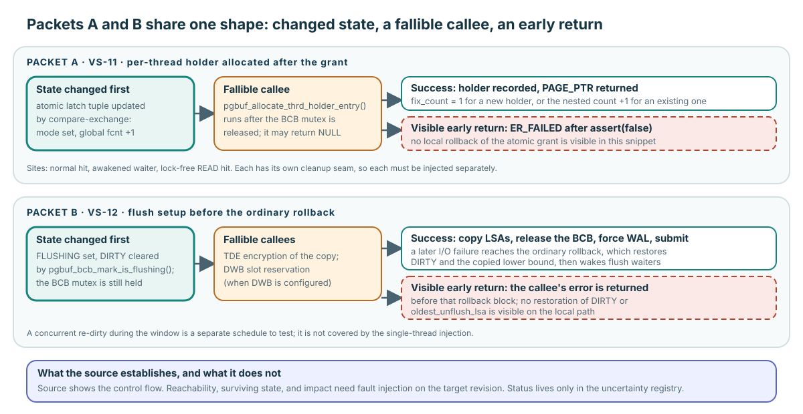

# Maintainer Capstone: Defend a Safe Change

**Level:** Core
**Prerequisites:** [Contract and Objects](./01-contract-and-objects.md), [Fix, Hold, and Release](./02-fix-hold-release.md), [Caller Completes Correctness](./03-caller-completes-correctness.md), [Flush One Generation](./04-flush-one-generation.md), and [Replace One Frame](./05-replace-one-frame.md)
**Capability gained:** Defend an evidence-bounded change-impact plan without promoting a source concern into an unverified production defect.
**Source baseline:** `f799e05d77d5300c6ea5753b4a6cc7caee6d8912`
**Evidence used:** Verified mechanism and Inference from the [pinned-source inventory](../source-inventory.md), [uncertainty registry](../unresolved-or-version-sensitive-findings.md), and exact source ranges below.

Complete either packet for core completion. Complete both packets for advanced preparation. These are review exercises, not instructions to implement an assumed fix.

## Reusable change-impact template

Copy this structure into a change plan:

**Behavior:** What externally or internally observable behavior may change?

**Owners:** Which thread, module, and caller own each resource or decision?

**State:** Which fields, flags, counters, pointers, and queues change?

**Guards:** Which latch, mutex, atomic order, transaction lock, or caller precondition protects each transition?

**Invariants:** What must remain true before and after every transition?

**Unwind:** For every failure/restart exit, what state is restored, transferred, or consumed?

**Caller impact:** Which callers observe return values, retained ownership, retry, timing, or changed contracts?

**Evidence seam:** What is established by source tracing, and what controlled test or observation can reach the risk boundary?

**Remaining uncertainty:** What is still an inference, version-sensitive, unreachable, or unobserved?

## Understanding check: Predict–Locate–Explain

### Predict

Choose packet A or B. Before following its ranges, use the change-impact template to predict the state owned when the exceptional return occurs, the postconditions required for a safe return, and the caller-visible consequence if any debt survives. Treat this as a hypothesis, not a defect conclusion.

### Locate

Trace the selected packet's cited source ranges in the pinned revision. Mark the acquisition or generation setup, the fallible operation, every local and callee-side cleanup, the return, the next retry owner, and the registry ID that owns current status.

### Explain

Defend which of the five proof levels the available source reaches: source-visible control flow, reachability, surviving state, production impact, and current-branch status. Then name the highest test seam that could close the next level. Compare your artifact with the packet-specific model answer immediately below it.

## The shape both packets share

Each packet begins with state that has already changed, continues into a callee that can fail, and shows a return that leaves before the ordinary cleanup block. The visual marks what the source establishes and stops there: it is a map of where to look, not a defect claim. Reachability, surviving state, and impact are the proof obligations each packet asks you to name, and their current status lives only in the [uncertainty registry](../unresolved-or-version-sensitive-findings.md).

## Packet A: `VS-11` holder allocation after grant

The [uncertainty registry](../unresolved-or-version-sensitive-findings.md) alone owns `VS-11` status. The source-visible concern is that several acquisition paths update the atomic latch/fix tuple, then allocate a per-thread holder. If holder-set allocation fails, the visible local path asserts in a debug build and returns failure without an obvious rollback of the earlier grant.

**Available source evidence:** holder allocation can return `NULL` at `src/storage/page_buffer.c:6000-6055`. Normal atomic-latch paths allocate after a grant at `src/storage/page_buffer.c:6457-6522`; the awakened-waiter path does so at `src/storage/page_buffer.c:6595-6617`; the lock-free READ hit increments `fcnt` before allocation at `src/storage/page_buffer.c:7738-7773`.

**Proof still required:** force holder extension allocation failure separately on normal hit, lock-free hit, and awakened waiter. Inspect the atomic latch tuple, global `fcnt`, per-thread holder list, waiter state, return value, and ability to acquire/release afterward. A controlled schedule is required for waiter and lock-free variants.

### Model answer A

Source supports a concrete ordering argument: grant precedes a fallible holder allocation at the cited sites, and no local rollback is visible in those snippets. It does not prove supported configurations can reach the allocation failure or that state actually survives through other cleanup. Do not copy or change registry status; propose the fault seam and exact postconditions before proposing code.

## Packet B: `VS-12` exceptional flush cleanup

The [uncertainty registry](../unresolved-or-version-sensitive-findings.md) alone owns `VS-12` status. The flush path marks the BCB `FLUSHING` and clears the old `DIRTY`, then TDE encryption or DWB-slot reservation can return before the ordinary rollback that restores dirty/lower-bound state.

**Available source evidence:** generation setup and early returns appear at `src/storage/page_buffer.c:10795-10828`; ordinary rollback appears at `src/storage/page_buffer.c:10908-10923`; flag restoration helpers are at `src/storage/page_buffer.c:16077-16126`.

**Proof still required:** reachable TDE and DWB-slot fault injection on the target configuration, followed by inspection of `DIRTY`, `FLUSHING`, `oldest_unflush_lsa`, waiters, victim eligibility, retry, and restart. A concurrent re-dirty schedule is a separate case.

### Model answer B

Source supports a control-flow gap between generation setup and ordinary rollback. It does not establish reachability, surviving state after surrounding cleanup, or production impact. Do not copy or change registry status; test both exceptional callees and observe the ownership/flush ledgers before deciding whether any fix is required.

## Review rubric: separate source reasoning from runtime observation

| Criterion | Source-grounded argument | Runtime observation |
|---|---|---|
| Reachability | Shows a syntactic/control-flow path and its preconditions. | Forces those preconditions on the target revision. |
| Surviving state | Predicts state from visible transitions and missing rollback. | Reads/asserts the state after the injected failure or schedule. |
| Impact | Names plausible violated invariants and affected callers. | Demonstrates the caller-visible or progress consequence. |
| Scope | Pins symbols and ranges to one revision. | Records build/configuration, workload, injection, and receipt. |

A strong source-grounded argument earns investigation, not a “verified defect” label. A runtime observation counts only when its controlled schedule or injection crosses the same risk boundary the claim concerns.

## Applied-path handoff and readiness gate

After the paper packet, run at least one controlled caller regression or narrow runtime probe on the target revision. Record setup, expected transition, actual observation, unsupported conclusions, and a reproducible receipt through [Verify at the Risk Boundary](../playbooks/verify-a-change.md).

If this becomes a real change-impact plan, another maintainer must review the ownership ledger, negative paths, evidence boundary, and remaining uncertainty before the artifact counts as readiness evidence.

## Learning navigation

**Previous:** [Replace One Frame](./05-replace-one-frame.md)
**Next:** Core learning is complete; [work on a change](../playbooks/change-safely.md) or [continue to Advanced acquisition](../advanced/acquisition-concurrency.md).

## Related routes

- [Practice the change-impact packet](../questions/core.md#pgbuf-qb-030-what-belongs-in-a-page-buffer-change-impact-plan)
- [Verify at the Risk Boundary](../playbooks/verify-a-change.md)
- [Source inventory](../source-inventory.md)
- [Maintainer Invariant Index](../reference/invariant-index.md)
- [Evidence and uncertainty registry](../unresolved-or-version-sensitive-findings.md)
- [Failure Unwind and Open Proof Obligations](../advanced/failure-and-proof-obligations.md)
