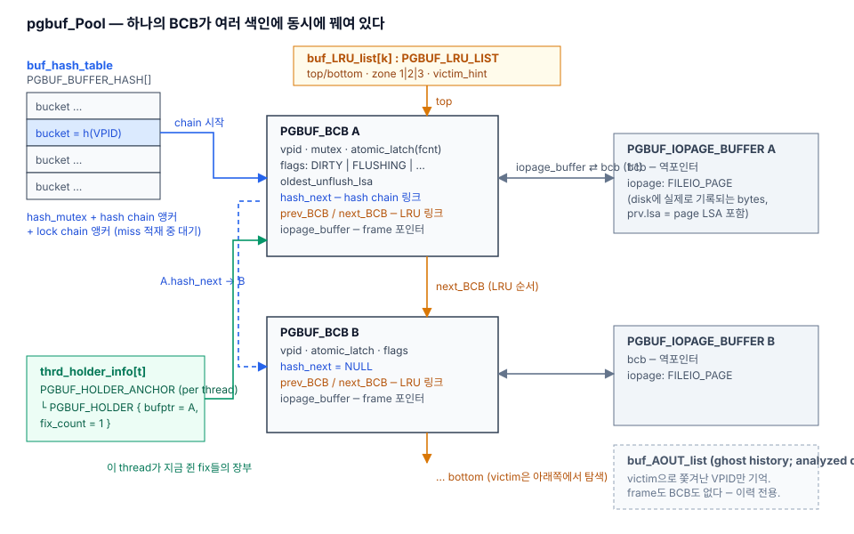
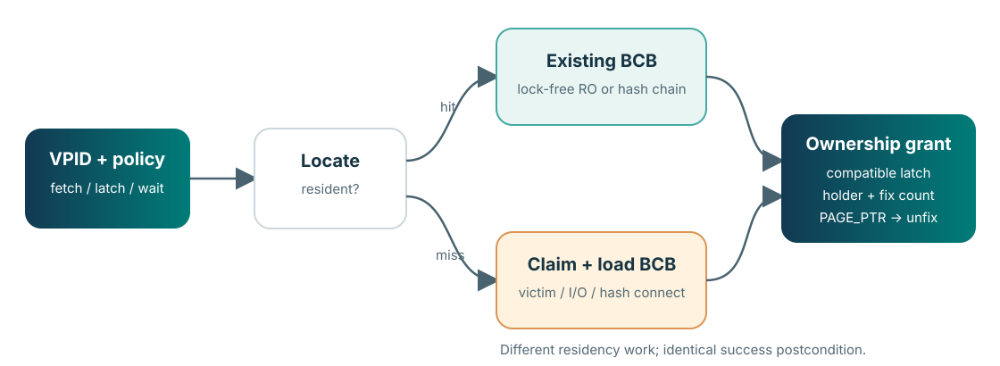
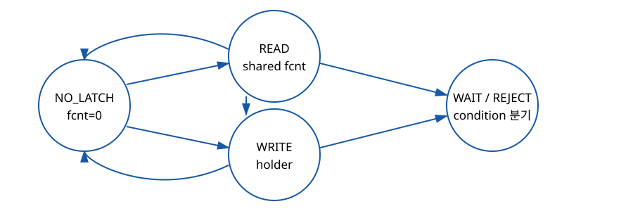
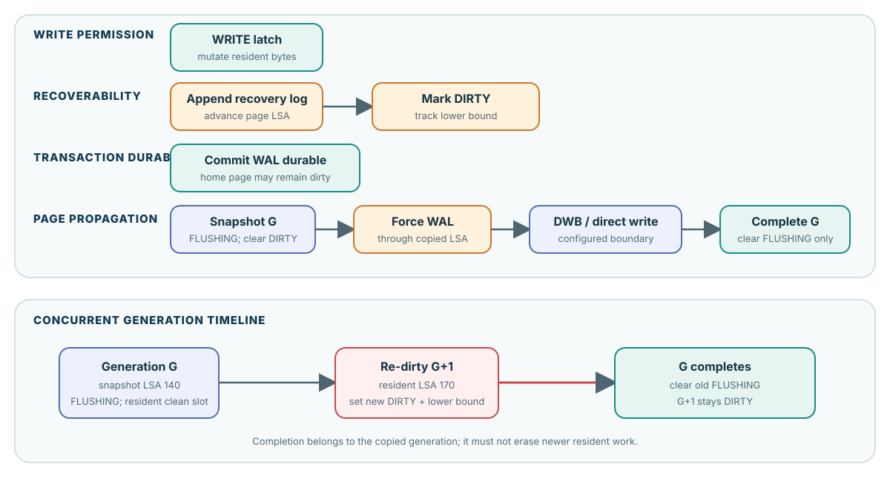

# CUBRID Page Buffer Maintainer Welcome Guide

> 새로 합류한 senior engineer가 `src/storage/page_buffer.c/.h`를 읽고, review하고, 안전하게 수정하기 위한 internal guide
>
> 기준 source: CUBRID `f799e05d77d5300c6ea5753b4a6cc7caee6d8912`
>
> 근거와 revision map: [`source-inventory.md`](./source-inventory.md)
>
> 미결·version-sensitive 항목: [`unresolved-or-version-sensitive-findings.md`](./unresolved-or-version-sensitive-findings.md)

이 문서는 실제 page-buffer 유지보수 일을 시작할 때 필요한 순서로 설명한다.

1. 이 Module이 감추는 복잡성과 caller에게 남기는 책임을 파악한다.
2. 증상이나 변경 의도에서 읽어야 할 source region과 caller를 찾는다.
3. 변경이 건드리는 ownership, concurrency, durability invariant를 식별한다.
4. 성공 경로와 failure unwind를 함께 고친다.
5. 위험에 맞는 test와 runtime probe로 검증한다.

처음에는 [1. Start here](#1-start-here)부터 [8. Maintainer invariants](#8-maintainer-invariants)까지 순서대로 읽는다. 실제 issue를 맡은 뒤에는 [9. How to change the Module safely](#9-how-to-change-the-module-safely), [10. Debugging playbooks](#10-debugging-playbooks), [11. Verification strategy](#11-verification-strategy)를 작업용 checklist로 사용한다.

## Contents

- [1. Start here](#1-start-here)
- [2. Module, Interface, and seams](#2-module-interface-and-seams)
- [3. Source-tree orientation](#3-source-tree-orientation)
- [4. Core object and state model](#4-core-object-and-state-model)
- [5. Acquisition Interface](#5-acquisition-interface)
- [6. Ownership and concurrency](#6-ownership-and-concurrency)
- [7. Mutation, durability, and replacement](#7-mutation-durability-and-replacement)
- [8. Maintainer invariants](#8-maintainer-invariants)
- [9. How to change the Module safely](#9-how-to-change-the-module-safely)
- [10. Debugging playbooks](#10-debugging-playbooks)
- [11. Verification strategy](#11-verification-strategy)
- [12. Known hazards and evidence boundaries](#12-known-hazards-and-evidence-boundaries)
- [13. First-week maintainer path](#13-first-week-maintainer-path)
- [14. Reference](#14-reference)

---

## 1. Start here

### The working definition

`pgbuf_fix()`는 disk-read helper가 아니다. 성공하면 다음을 한꺼번에 성립시키는 acquisition protocol이다.

- 요청한 logical page identity인 `VPID`가 resident BCB/frame과 연결되어 있다.
- Global fix accounting이 frame의 victim reuse를 막는다.
- 요청한 READ 또는 WRITE page latch가 grant되어 있다.
- Current thread의 holder ledger에 ownership debt가 기록되어 있다.
- 반환된 `PAGE_PTR`는 matching release까지 borrowed view로 유효하다.

Hit이면 disk I/O가 없다. Miss이면 이 postcondition을 만들기 전에 BCB 확보, page load 또는 materialization, validation, publication이 추가된다. Hit와 miss의 준비 과정은 다르지만 caller가 받는 Interface contract는 같다.

Pinned source:

- public modes and watcher contract: `src/storage/page_buffer.h:172-249`
- main fix implementation: `src/storage/page_buffer.c:2256-2685`
- hash/load/claim path: `src/storage/page_buffer.c:7600-8985`

### What this Module owns

Page-buffer Module은 caller가 매번 구현하기 어려운 복잡성을 한 Interface 뒤에 모은다.

| Responsibility | Module이 제공하는 것 |
|---|---|
| Identity and residency | `VPID` lookup, resident mapping, miss serialization, BCB/frame publication |
| Ownership | Global `fcnt`, per-thread holder, nested fix accounting |
| Physical concurrency | READ/WRITE page latch, wait queue, conditional failure, promotion |
| Replacement | LRU domains/zones, victim eligibility, pressure progress |
| Propagation | Dirty generation, stable flush snapshot, WAL gate, DWB/direct-write seam |
| Specialized lifecycle | boot/thread state, recovery, vacuum, scan-copy, daemon and diagnostics hooks |

이것이 deep Module인 이유는 caller가 작은 acquisition/release Interface를 배우는 대가로 hash, load serialization, latch queue, replacement, WAL-aware flush라는 큰 Implementation을 재사용하기 때문이다. Caller에게는 leverage가 생기고, maintainer에게는 state transition과 bug fix가 `page_buffer.c`에 모이는 locality가 생긴다.

### What this Module does not own

Page buffer가 모든 correctness를 완성하지는 않는다.

| Responsibility outside the Module | Representative owner |
|---|---|
| Logical row/class conflict and visibility | transaction lock and MVCC layers |
| On-page record or index-layout invariant | heap/B-tree implementation |
| Allocation/deallocation decision | file/disk and recovery protocols |
| Undo/redo record semantics | logging caller |
| Higher-level retry or operation restart | heap/B-tree/vacuum caller |
| Commit policy and checkpoint ownership | log manager |

따라서 “`pgbuf_fix()`가 성공했다”는 사실만으로 page type이 맞거나, record가 여전히 존재하거나, update가 logged/durable하다고 결론 내리면 안 된다.

### Evidence rule

이 guide의 line anchor는 `f799e05`에 고정되어 있다. 현재 branch가 다르면 symbol과 control flow를 먼저 diff한다.

- **Pinned source**: 해당 revision의 control flow와 state mutation을 말할 수 있다.
- **Runtime observation**: 기록된 build/workload에서 관찰한 event만 말할 수 있다.
- **Inference**: Implementation 설명에는 유용하지만 stable Interface guarantee가 아니다.
- **Historical finding**: target branch에서 재검증하기 전에는 current defect가 아니다.

---

## 2. Module, Interface, and seams

### Interface is more than the function declaration

이 문서에서 Interface는 type signature만 뜻하지 않는다. Caller가 올바르게 사용하기 위해 알아야 하는 전체 계약이다.

- fetch mode가 표현하는 allocation knowledge
- latch mode와 wait condition
- 성공과 expected absence의 구분
- acquired ownership의 lifetime
- wait/retry 뒤 stale해지는 observation
- logging, dirty, release ordering
- error와 partial cleanup mode
- performance-sensitive fast path와 approximate diagnostics

`page_buffer.h`는 많은 symbol을 export하지만 하나의 평평한 general-purpose API 목록이 아니다. 서로 다른 owner protocol이 같은 header를 공유한다.

| Interface family | Normal owner | Maintainer warning |
|---|---|---|
| Normal fix/unfix | heap, B-tree, file metadata | 가장 넓은 caller contract |
| Ordered watcher | multi-page heap/overflow algorithms | release/reorder/refix와 revalidation 필요 |
| Simple fix | temporary read-only teardown | normal holder/latch protocol과 섞지 않는다 |
| Recovery fetch/callback | crash recovery and allocation undo/redo | validation과 idempotence semantics가 다르다 |
| Flush/checkpoint | log manager and daemons | completion boundary와 error propagation이 variant마다 다르다 |
| Invalidate/deallocate | file/recovery owner | cache action과 logical allocation action을 구분한다 |
| Scan-copy | heap scan cache | `PAGE_PTR` 모양이지만 fixed pool page가 아니다 |
| SHOW/stats/validation | diagnostics and scheduling | approximate snapshot을 correctness oracle로 쓰지 않는다 |

Complete inventory는 [`api-inventory.md`](../../pgbuf-analysis/f799e05_claude/analysis/research/api-inventory.md)에 있다. 변경 전에 symbol 하나만 찾지 말고 그 symbol이 속한 family와 owner protocol을 먼저 찾는다.

### External seams

Page buffer의 external seam은 caller와 dependency 양쪽에 있다.

```text
heap / B-tree / file / vacuum / recovery / boot
                       |
                       v
              page_buffer Interface
                       |
        +--------------+----------------+
        |              |                |
        v              v                v
      log/WAL      DWB + file_io       TDE
```

Interface 변경은 caller seam의 모든 owner를 검토해야 한다. Flush Implementation 변경은 아래 dependency seam의 completion/error semantics까지 검토해야 한다. 두 방향 중 하나만 읽으면 cleanup이나 durability contract가 빠진다.

### Internal seams

`page_buffer.c` 내부에도 책임별 seam이 있다.

- hash lookup and VPID-keyed load serialization
- BCB state transition under mutex/atomics
- latch grant, wait queue, and holder accounting
- LRU/victim selection
- dirty-generation snapshot and flush completion
- ordered watcher orchestration

이 internal seam은 general caller Interface가 아니다. Test나 instrumentation을 추가할 때는 어느 seam의 invariant를 관찰하는지 명확히 한다.

---

## 3. Source-tree orientation

### Read the object map before the algorithms



한 BCB는 여러 index와 ledger에 동시에 연결될 수 있다.

- Hash chain은 `VPID → resident BCB` lookup을 제공한다.
- LRU links는 replacement policy의 위치를 제공한다.
- `iopage_buffer`는 BCB와 resident frame을 1:1로 연결한다.
- Per-thread holder는 이 thread가 소유한 BCB와 nested count를 추적한다.
- AOUT structure는 source에 존재하지만 분석한 default에서는 disabled 상태다. Core model을 “CUBRID는 2Q다”로 시작하지 않는다.

### `page_buffer.h`: caller-visible language

먼저 이 순서로 읽는다.

| Region | What to learn |
|---|---|
| `page_buffer.h:40-171` | constants, public types, state-format helpers |
| `172-203` | fetch mode, latch mode, latch condition |
| `219-249` | ordered watcher group/rank and stale-state flag |
| `250-440` | acquisition, release, dirty, metadata, flush, recovery families |
| `441-521` | stats, validation, SHOW/scan-copy and specialized exports |

Header comment를 Interface truth로 보되 executable branch와 충돌하면 pinned code가 authority다. Copy-area helper와 stats parameter naming에는 known drift가 있다.

### `page_buffer.c`: implementation map

| Region | Maintainer question |
|---|---|
| `382-849` | 어떤 object와 flag가 존재하고 누가 보호하는가? |
| `910-981` | scan-copy buffer가 real pool ownership과 어떻게 다른가? |
| `1649-2114` | pool/thread/daemon state는 어떤 순서로 생기고 사라지는가? |
| `2256-2685` | public fix가 fast/normal/miss branch를 어떻게 합치는가? |
| `2700-2838` | temporary simple protocol은 왜 별도인가? |
| `2849-3274` | promotion과 unfix가 debt를 어떻게 갱신하는가? |
| `3383-4678` | invalidate와 public/bulk/checkpoint flush가 어떻게 다른가? |
| `4701-4912` | area-copy helper의 좁은 actual contract는 무엇인가? |
| `4921-5096` | dirty, page LSA, `oldest_unflush_lsa`는 어떻게 갱신되는가? |
| `6008-7590` | holder, latch grant, wait, wakeup은 어떻게 결합되는가? |
| `7600-8985` | hash hit, miss lock, load, validation, publication은 어디서 일어나는가? |
| `8994-10720` | victim candidate와 LRU policy는 어떻게 분리되는가? |
| `10733-11048` | stable generation copy, WAL, TDE/DWB/write, rollback은 어떻게 이어지는가? |
| `12193-13938` | ordered watcher가 release/reorder/refix를 어떻게 수행하는가? |
| `13949-14635` | private/shared LRU quota는 어디서 조정되는가? |
| `14896-15405` | recovery/deallocation hook은 normal path와 무엇이 다른가? |
| `15429-16610` | victim queues와 post-flush progress는 누가 관리하는가? |
| `16618-17530` | daemon과 approximate observability는 어디서 구현되는가? |

### Representative callers

Implementation을 읽은 뒤에는 반드시 caller 하나를 끝까지 읽는다.

| Scenario | Source anchor | What it teaches |
|---|---|---|
| Heap insert | `heap_file.c:23120-23325` | WRITE ownership, log, dirty, cleanup |
| Heap/vacuum page removal | `heap_file.c:3263-3571`, `vacuum.c:1581-1908` | ordered ownership and deallocation race |
| B-tree search/update/split | `btree.c:23754-23939,27896-28845` | conditional latch, promotion, restart |
| New-page allocation | `file_manager.c:5420-5592` | `NEW_PAGE` caller obligations |
| Temporary teardown | `file_manager.c:4073-4366` | simple fix and no-load destruction |
| Checkpoint | `log_page_buffer.c:6901-7406` | selective flush, WAL, physical sync |
| Redo | `log_recovery.c:497-536,6407-6431` | `RECOVERY_PAGE`, page-LSA idempotence |
| Boot/shutdown | `boot_sr.c:1974-2801,3055-3113` | initialize, daemon gate, finalize ordering |

[`caller-use-cases.md`](../../pgbuf-analysis/f799e05_claude/analysis/research/caller-use-cases.md)는 이 path들의 same-revision evidence packet이다.

---

## 4. Core object and state model

### Six objects that must stay separate

| Object | Meaning | Lifetime |
|---|---|---|
| `VPID` | `(volid,pageid)` logical identity | logical allocation이 유효한 동안 |
| BCB | Buffer Control Block containing resident control state | pool initialize부터 finalize까지 재사용 |
| frame | page-sized resident bytes | current BCB identity generation |
| `PAGE_PTR` | frame bytes의 borrowed view | successful fix부터 matching release까지 |
| global `fcnt` | 모든 thread의 granted fix count | replacement exclusion을 나타내는 동안 |
| holder | current thread의 nested ownership record | thread가 해당 BCB를 hold하는 동안 |

Pointer address는 identity가 아니다. `pgbuf_unfix()` 뒤 같은 주소가 읽혀도 contract는 끝났다. Frame은 나중에 다른 VPID로 재사용될 수 있다. Page 내부 record slot이나 borrowed VPID pointer도 같은 lifetime rule을 따른다.

### Independent state dimensions


| Dimension | Question | Examples |
|---|---|---|
| Identity/residency | 어느 VPID가 어느 BCB/frame에 연결되어 있는가? | invalid, loading, resident, reused |
| Ownership | 누가 victim reuse를 막고 있는가? | `fcnt==0`, fixed N times, nested holder |
| Concurrency | 누가 resident bytes를 읽거나 바꾸는가? | NO_LATCH, READ, WRITE, waiter |
| Durability | 어떤 generation이 memory, log, data volume에 있는가? | clean, DIRTY, FLUSHING, re-dirty |

아래 네 문장은 review에서 계속 사용한다.

```text
fixed    != resident
dirty    != durable
unfix    != flush
eviction != deallocation
```

### State changes are coupled, not collapsed

Normal fix는 residency, ownership, latch state를 함께 바꾼다. 그러나 각 state는 별도 protection과 cleanup을 갖는다. Flush는 durability flags를 바꾸면서 BCB protection을 잠시 놓고 I/O를 수행한다. Victimization은 identity를 바꾸기 전에 ownership과 durability predicate를 재검증한다.

한 scalar “page state”로 이 Module을 이해하면 wait와 failure branch에서 틀린다. 어떤 state를 바꾸는지, 그 state를 누가 보호하는지, protection을 놓은 뒤 무엇을 revalidate하는지를 기록한다.

---

## 5. Acquisition Interface

### Caller chooses from knowledge, not convenience

| Caller knowledge and intent | Interface choice | Expected absence |
|---|---|---|
| Existing allocated page, load on miss | `OLD_PAGE` | error |
| Newly allocated VPID, no old image needed | `NEW_PAGE` | error |
| Use only if already resident | `OLD_PAGE_IF_IN_BUFFER` | `NULL` is normal |
| Deallocation race is part of algorithm | `pgbuf_fix_if_not_deallocated` or deallocated mode | protocol-specific |
| Recovery reconstructs allocation state | `RECOVERY_PAGE` | recovery-specific |
| Temporary read-only teardown | `pgbuf_simple_fix` | `need_fix=false` miss is normal |

`NEW_PAGE`는 allocation function이 아니다. File/disk owner가 VPID를 먼저 allocation한다. Page buffer는 old image를 읽지 않고 frame을 materialize한다. Caller가 page type, initial layout, TDE attributes, logging/LSA, dirty state를 완성한다.

### Latch mode and condition are separate decisions

| Decision | Meaning |
|---|---|
| READ | compatible reader와 shared physical-content protection |
| WRITE | resident bytes/layout mutation의 exclusive protection |
| UNCONDITIONAL | 필요하면 transaction wait policy 안에서 queue/wait |
| CONDITIONAL | incompatible하면 기다리지 않고 algorithm에 control 반환 |

Conditional failure는 corruption이 아니라 caller algorithm의 branch다. Caller가 이미 다른 page를 hold할 때 wait cycle을 피하기 위해 release/restart하거나 ordered protocol로 넘어갈 수 있다.

### Hit and miss converge



#### Resident hit

READ fast-path 조건이 맞으면 lock-free hash scan과 atomic accounting을 시도한다. 그렇지 않으면 normal hash hit가 BCB mutex 아래 VPID를 recheck하고 latch protocol로 들어간다. Candidate pointer를 발견한 것만으로 identity가 확정되지 않는다.

#### Cold miss owner

Miss owner는 다음을 수행한다.

1. Missing VPID의 load/publication owner가 된다.
2. Invalid BCB, safe victim, 또는 direct-victim progress로 frame을 확보한다.
3. `OLD_PAGE`는 DWB/home I/O로 읽고, `NEW_PAGE`는 old read 없이 materialize한다.
4. Decrypt/validate한다.
5. Requested latch와 holder/fix accounting을 만든다.
6. 성공한 identity를 hash에 publish한다.
7. 같은 VPID를 기다리는 thread를 깨운다.

#### Cold miss waiter

Waiter는 loader의 BCB pointer를 상속하지 않는다. Wakeup 뒤 hash를 다시 찾는다. Wait 동안 identity, victim choice, load outcome이 바뀔 수 있기 때문이다.

### Success and non-acquisition

Successful normal acquisition은 release debt 하나를 만든다. Expected `NULL`, conditional rejection, pre-grant validation failure에는 새 debt가 없다. Error path를 review할 때 return value만 보지 말고 어느 지점에서 latch/fix/holder가 commit되었는지 확인한다.

---

## 6. Ownership and concurrency

### Five synchronization responsibilities

| Mechanism | Protected state | Typical lifetime |
|---|---|---|
| Hash mutex | hash/load chain structure | lookup/publication critical section |
| VPID-keyed buffer lock | one cold-load/publication owner | load start through publish/cleanup |
| BCB mutex | identity recheck, wait queue, flags, LRU/flush transitions | short internal transition |
| Page latch | resident bytes and layout | fix through unfix |
| Transaction lock | logical row/class conflict and visibility | transaction protocol |

Transaction lock과 page latch는 대체 관계가 아니다. Transaction lock이 logical update 권한을 제한해도 B-tree split이나 heap layout mutation의 in-memory consistency는 page latch가 보호한다.

### Latch and holder transition



Important rules:

- Compatible READ는 shared grant될 수 있다.
- Existing waiter가 있으면 new reader barging을 제한한다.
- Same holder의 nested reentry는 별도로 accounting한다.
- Sole READ holder는 in-place promotion이 가능할 수 있다.
- Blocking promotion은 old READ ownership을 내려놓고 wait/reacquire할 수 있다.
- Timeout은 termination policy이지 deadlock-free proof가 아니다.

### Two ledgers, one debt

Global `fcnt`와 per-thread holder는 중복 정보가 아니다.

- `fcnt`는 모든 thread를 합쳐 frame victim reuse를 막는다.
- holder는 이 thread의 nested ownership, latch relation, watcher/debug metadata를 기록한다.

같은 thread가 같은 page를 두 번 fix하면 같은 `PAGE_PTR`가 돌아와도 debt는 두 개다.

```text
fix(P)   -> pointer X, debt 1
fix(P)   -> pointer X, debt 2
unfix(X) -> debt 1
unfix(X) -> debt 0
```

Pointer equality로 debt를 추론하지 않는다.

### Release variants

| Operation | Dirty state | Debt | Pointer variable |
|---|---:|---:|---:|
| `pgbuf_unfix` | unchanged | consumes one | unchanged |
| `pgbuf_unfix_and_init` | unchanged | consumes one | set to `NULL` |
| `pgbuf_set_dirty(..., DONT_FREE)` | sets dirty | retained | retained |
| `pgbuf_set_dirty(..., FREE)` | sets dirty | consumes one | wrapper-specific |
| `pgbuf_set_dirty_and_free` | sets dirty | consumes one | set to `NULL` |

`pgbuf_unfix_all()`은 request-end leak diagnosis와 last-resort cleanup에 가깝다. Normal branch의 explicit debt accounting을 대신하는 습관으로 사용하지 않는다.

### Promotion invalidates assumptions

Blocking READ-to-WRITE promotion은 caller의 pointer-to-pointer contract를 가진다. Old READ ownership을 놓고 wait한 뒤 refreshed pointer 또는 `NULL`을 반환할 수 있다. Promotion 전에 읽은 slot, key position, record pointer는 재검증한다.

### Multiple pages require an order

Ordered watcher는 heap/overflow 같은 multi-page ownership에서 page-latch wait cycle을 피한다.

1. Group/rank를 정한다.
2. Unsafe order에서는 conditional acquisition을 먼저 시도한다.
3. 실패하면 held watcher를 release/sort/refix한다.
4. 각 watcher의 `page_was_unfixed`를 확인한다.
5. Released page에서 얻은 모든 page-local pointer와 observation을 다시 계산한다.

Ordered-fix failure는 all-or-none가 아닐 수 있다. Cleanup은 watcher collection 전체의 current state를 확인해야 한다.

---

## 7. Mutation, durability, and replacement

### Write permission is not durability



Logged mutation은 하나의 call이 아니라 responsibility chain이다.

```text
WRITE ownership
  -> mutate stable page bytes
  -> append undo/redo
  -> set page LSA
  -> mark DIRTY
  -> unfix
  -> later copy a stable generation
  -> force WAL through the copied page LSA
  -> submit through DWB or direct home-page I/O
  -> complete the configured persistence boundary
```

각 step은 다른 step을 자동으로 대신하지 않는다.

- WRITE latch는 log record를 만들지 않는다.
- `pgbuf_set_dirty()`는 logging이나 page LSA를 완성하지 않는다.
- `pgbuf_set_lsa()`만으로 caller의 mutation contract가 완성되지 않는다.
- Unfix는 commit이나 page flush가 아니다.
- WAL은 torn home-page image를 막는 DWB의 대체재가 아니다.

### Two LSA roles

| Value | Location | Role |
|---|---|---|
| page LSA (`prv.lsa`) | page image | image가 포함하는 newest logged change; redo skip gate |
| `oldest_unflush_lsa` | BCB only | durable page image에 아직 없는 oldest logged change; checkpoint lower-bound material |

Disk image LSA가 90인 clean page에 LSA 100과 105 update가 오면 memory page LSA는 105지만 `oldest_unflush_lsa`는 100이다. “Oldest”는 최초 clean-to-dirty 경계를 보존한다.

### Flush works on a generation


Flusher는 BCB/frame을 영원히 lock한 채 I/O하지 않는다.

1. Protected state에서 stable page image와 LSA를 copy한다.
2. Old DIRTY를 clear하고 FLUSHING을 set한다.
3. BCB protection을 놓는다.
4. Copied page LSA까지 WAL을 force한다.
5. TDE/DWB 또는 direct-write path를 수행한다.
6. Completion에서 copied generation만 retire한다.

I/O 중 writer가 LSA 110 generation을 만들면 old LSA 105 flush가 성공해도 resident BCB는 DIRTY로 남는다. Flush success는 “이 BCB는 이제 clean”이 아니라 “copied generation이 configured boundary를 통과했다”는 뜻이다.

### Failure must restore the lower bound

Ordinary flush error path는 old DIRTY와 saved `oldest_unflush_lsa`를 복원한다. 이 복원이 빠지면 later writer가 너무 새로운 LSA를 “oldest”로 기록할 수 있고, checkpoint redo lower bound가 앞으로 이동해 crash recovery가 old record를 scan하지 못할 수 있다.

Flush code에서 early return을 추가하거나 callee error contract를 바꿀 때 확인할 state:

- DIRTY and FLUSHING
- copied page LSA
- saved and resident `oldest_unflush_lsa`
- BCB lock ownership
- flush waiter wakeup
- DWB slot or I/O buffer ownership
- direct-victim/post-flush handoff

### Replacement: eligibility before policy

Victim selection에는 두 층이 있다.

**Eligibility is correctness.**

- candidate identity가 여전히 맞다;
- `fcnt == 0`;
- dirty/flushing generation이 없다;
- incompatible waiter/transient state가 없다;
- protection 아래 final recheck가 통과한다.

**Selection is policy.**

- LRU1/LRU2/LRU3 zone
- private/shared list and quota
- candidate queue/history
- victim flusher and direct assignment

Policy는 바뀔 수 있지만 eligibility predicate를 약화시키면 caller-visible ownership contract가 깨진다. Direct-victim assignment도 revocable promise다. Recipient가 받을 때 candidate가 다시 fixed되었다면 포기하고 재탐색한다.

### Cache actions are not allocation actions

| Operation | Logical allocation | Resident mapping |
|---|---|---|
| unfix | stays | usually stays |
| flush | stays | stays |
| invalidate | stays | removed if protocol allows |
| victimization | stays | removed and frame reused |
| deallocate | removed through file/recovery semantics | may remain temporarily |

“Page를 없앤다”라는 표현 대신 어느 action인지 정확히 말한다.

---

## 8. Maintainer invariants

변경 전 아래 invariant 중 무엇을 건드리는지 표시한다. Review description에도 같은 이름을 사용한다.

### I1. Identity is revalidated after protection is dropped

Hash candidate lookup, wait, I/O, ordered refix, promotion, victim selection은 VPID나 content가 바뀔 수 있는 지점이다. 이전 pointer/observation을 그대로 사용하지 않는다.

### I2. Every successful acquisition creates exactly one release debt

Normal, nested, awakened waiter, promotion, ordered watcher, recovery, simple path마다 release mechanism은 다를 수 있지만 debt는 누락되거나 이중 소비되면 안 된다.

### I3. Positive `fcnt` excludes victim reuse

Lock-free hit safety와 borrowed `PAGE_PTR` lifetime이 이 invariant에 의존한다. `fcnt`를 바꾸는 fast/error path는 victim final recheck와 함께 읽는다.

### I4. Page latch and transaction lock protect different state

Logical conflict policy 변경으로 physical page-latch ordering을 우회하지 않는다. Page-latch timeout을 transaction deadlock proof로 설명하지 않는다.

### I5. Page-local pointers die with ownership

Unfix, ordered release/refix, blocking promotion 이후 slot/record/key pointer를 재계산한다. Same address는 same generation proof가 아니다.

### I6. Dirty-generation bookkeeping survives success and failure

Flush success는 concurrent new DIRTY를 보존한다. Failure는 old DIRTY와 oldest-unflushed lower bound를 복원한다.

### I7. WAL precedes the copied data generation

Non-temporary logged page image를 submit하기 전에 copied page LSA까지 WAL gate가 통과한다. DWB는 이 ordering을 대체하지 않는다.

### I8. Victim eligibility is correctness; placement is policy

LRU/quota tuning을 바꿀 때 ownership/dirty/final identity predicate를 섞어 바꾸지 않는다.

### I9. Recovery redo is idempotent

Recovery fetch mode, page-LSA comparison, apply/set-LSA/dirty/release ordering을 함께 보존한다.

### I10. Specialized Interface stays inside its owner protocol

Simple fix, scan-copy `PAGE_PTR`, recovery mode, copy-area helper, daemon hook를 normal caller convenience로 확장하지 않는다.

---

## 9. How to change the Module safely

### Step 1. State the behavior at the Interface

Implementation line을 고치기 전에 caller-visible behavior를 한 문장으로 쓴다.

Examples:

- “Conditional WRITE acquisition returns without adding debt when another holder conflicts.”
- “A flush error restores the pre-flush dirty generation and wakes existing flush waiters.”
- “Victim selection may change policy but never reuses a positive-`fcnt` BCB.”

이 문장이 test seam과 review scope를 결정한다.

### Step 2. Map all owners and neighbors

다음 표를 issue note에 채운다.

| Question | Answer |
|---|---|
| Public/specialized Interface family | |
| Representative callers | |
| State read or written | |
| Protection held | |
| Protection temporarily dropped | |
| Dependency seam crossed | |
| Success debt/postcondition | |
| Retry/timeout/interrupt behavior | |
| Failure unwind | |
| Observability affected | |

### Step 3. Trace acquisition before adding an early return

Early return 위쪽에서 얻을 수 있는 모든 resource를 나열한다.

- BCB mutex
- VPID buffer lock/load record
- `fcnt` or latch grant
- holder or watcher entry
- hash publication
- DIRTY/FLUSHING transition
- saved LSA
- DWB slot/I/O buffer
- waiter queue entry
- LRU/direct-victim ownership

Common cleanup label이 있다고 모든 branch가 도달한다고 가정하지 않는다. Return/goto별로 실제 control flow를 확인한다.

### Step 4. Read the caller that makes the invariant real

Page-buffer function만 읽으면 caller obligation이 빠진다.

- fetch mode 변경: file allocation/recovery caller
- latch/promotion 변경: B-tree and heap caller
- ordered watcher 변경: heap/vacuum caller
- dirty/LSA 변경: representative logged mutation and checkpoint
- invalidate/deallocate 변경: file and recovery caller
- stats 변경: increment site and consumer/dashboard

### Step 5. Separate contract change from policy change

Contract change는 caller와 test를 함께 바꿔야 한다. Policy change는 동일 Interface invariant 아래 candidate order나 quota만 바꾼다. Replacement tuning을 하면서 ownership predicate를 바꾸는 diff는 두 change를 분리한다.

### Step 6. Keep source formatting stable

CUBRID legacy `.c`/`.h` file은 기존 indentation을 정확히 보존한다. 의미 없는 indentation-only diff가 생기면 tooling 문제로 취급한다.

대부분 C++로 compile되지만 GNU indent가 처리하는 legacy file에 C++ syntax를 넣을 때는 정확히 다음 guard를 사용한다.

```c
/* *INDENT-OFF* */
C++ syntax code
/* *INDENT-ON* */
```

### Step 7. Review the negative paths together

Success test만 통과한 뒤 끝내지 않는다.

- expected absence
- conditional rejection
- timeout
- interrupt
- competing loader retry
- allocation/OOM failure
- read/decrypt/validation failure
- WAL/DWB/write failure
- partial ordered refix
- shutdown/recovery context

### Step 8. Leave an evidence trail

Issue/PR에는 다음을 남긴다.

- exact source commit;
- touched invariant names;
- representative caller path;
- regression command and result;
- runtime probe configuration and limitations;
- untested failure or scheduling boundary.

---

## 10. Debugging playbooks

### Symptom: fix or holder appears leaked

Inspect:

1. successful acquisition count versus release count;
2. nested fixes returning the same pointer;
3. promotion/ordered watcher transfer semantics;
4. error branch after latch/`fcnt` grant but before holder completion;
5. request-end `pgbuf_unfix_all()` diagnostics.

Do not infer one debt per unique pointer.

Useful source:

- holder and grant: `page_buffer.c:6008-7590`
- promotion/unfix: `2849-3274`
- lock-free hit: `7725-7786`

### Symptom: thread waits or times out on a page

First classify the wait.

| Wait kind | Evidence |
|---|---|
| transaction lock | lock manager state, logical resource |
| page latch | BCB latch mode and waiter queue |
| cold-load serialization | VPID buffer-lock owner/waiter |
| victim pressure | allocation/direct-victim queues |
| flush waiter | FLUSHING state and completion owner |

Then record held pages. A timeout ends a wait but does not prove the acquisition order is safe.

### Symptom: duplicate or corrupt residency

Check:

- VPID hash chain and load-lock owner;
- publication point relative to load/latch/holder success;
- identity recheck after mutex drop/wakeup;
- victim invalidation and hash removal;
- error cleanup of provisional BCB;
- raw I/O that may have bypassed buffer coherence.

### Symptom: no victim or all buffers dirty

Separate eligibility from search policy.

1. Are candidates fixed?
2. Are they dirty or flushing?
3. Are they outside victim zone?
4. Did victim flusher make clean candidates?
5. Is direct assignment waiting and being revoked?
6. Did the workload actually create pressure, or is the pool too large to reproduce?

A hot trace with no eviction cannot prove victim behavior.

### Symptom: dirty page never becomes clean

Inspect:

- repeated writer re-dirty;
- FLUSHING completion and post-flush handoff;
- WAL gate result;
- TDE/DWB/direct-write error;
- restoration of DIRTY and `oldest_unflush_lsa`;
- flush waiter wakeup;
- metric definition versus actual BCB flags.

Successful old-generation write plus current DIRTY can be correct.

### Symptom: WAL, DWB, or flush failure

Record three boundaries separately.

1. Log durable through which LSA?
2. Which copied page generation reached DWB/direct-write completion?
3. Which home-page/fsync boundary is actually proven?

Event names such as “flushed to disk” may refer to DWB slot acceptance, not final home-page persistence.

### Symptom: stale pointer after ordered access

Check every watcher for `page_was_unfixed`. Recompute record slot, key, offset-derived pointer, and page-type-dependent observation. Pointer address equality is irrelevant.

### Symptom: SHOW or counter disagrees with reality

Find the increment/read site before interpreting the name.

- `Num_data_page_ioreads` is a page-buffer read-attempt signature, not physical device misses.
- Dirty counters count calls/events, not unique pages.
- Some flushed counters cover only selected paths.
- SHOW and `pgbuf_peek_stats()` use approximate snapshots.

Use counters to find a path, then confirm the invariant with source or a narrow trace.

---

## 11. Verification strategy

Match the test to the risk. A passing build is necessary but not evidence for concurrency or recovery behavior.

### Level 1. Compile and focused unit checks

Use the project CMake configuration and relevant `ctest` target or project-provided test executable. This catches type, assertion, direct helper, and deterministic state-transition errors.

Appropriate for:

- local helper refactor;
- flag/macro/interface compilation;
- deterministic queue/list bookkeeping with an existing seam.

### Level 2. Representative caller regression

Exercise the behavior through heap, B-tree, file, recovery, or checkpoint caller rather than a shallow helper-only test.

Appropriate for:

- fetch-mode semantics;
- release debt;
- mutation/log/dirty ordering;
- invalidation/deallocation behavior.

### Level 3. Concurrency and isolation

Create controlled multi-session or multi-thread schedules.

Required for claims about:

- conditional rejection;
- latch waiter order;
- promotion contention;
- ordered multi-page deadlock avoidance;
- deallocation race;
- timeout/interrupt cleanup.

Aggregate single-session counters do not prove these behaviors.

### Level 4. Fault injection

Inject failure at the seam where state has already been acquired.

Targets:

- DWB read during cold miss;
- holder allocation after latch/fix grant;
- TDE encryption;
- DWB slot reservation;
- page write;
- allocation and queue operations.

Assert internal postconditions, not only caller error:

- `fcnt` and holder ledger;
- hash/load record;
- DIRTY/FLUSHING and oldest LSA;
- BCB/list ownership;
- waiter wakeup;
- retryability.

### Level 5. Controlled small-pool pressure

Use a database and buffer configuration owned by the test. Force more distinct pages than the pool can hold.

Observe:

- candidate aging and zone transitions;
- dirty victim flush;
- victimization and frame reuse;
- direct assignment/revocation;
- invalidation.

Existing same-revision live monitoring used a pool large enough that it observed no eviction. It cannot serve as this test.

### Level 6. Crash and recovery

For WAL/DWB/checkpoint changes, define the crash point and durable artifacts.

- before log force;
- after WAL but before page submission;
- after DWB acceptance but before home write;
- after home write;
- during checkpoint metadata update.

Verify restart result and page-LSA idempotence. A clean shutdown or backup success does not prove crash boundaries.

### Runtime instrumentation rules

- Pin build type, source commit, database, configuration, and workload.
- Add narrow event probes at the state seam being tested.
- Record observer traffic; monitoring clients also access catalog pages.
- Distinguish debug validation overhead from release behavior.
- Remove temporary probes after the conclusion or keep them on an explicitly labeled lab branch.
- State what the trace cannot observe.

### Existing evidence you may reuse

The accepted `f799e05` report supports narrow historical signatures:

- cold/warm page-buffer read attempts `38 -> 0`;
- insert detailed promotion `689`, dirty calls `102125`;
- covered/non-covered projection `100/0` versus `0/100`, update dirty calls `300`;
- dirty generation `1/1`, dirty calls `58430`, accepted backup boundary.

The logging-only monitor adds statement-level fix/unfix, promotion, dirty, and WAL-before-flush observations. These numbers are workload evidence, not performance guarantees.

See:

- [`source-inventory.md`](./source-inventory.md)
- [`runtime-path-monitoring.md`](../../pgbuf-analysis/f799e05_claude/analysis/monitoring/runtime-path-monitoring.md)
- [`report-audit.md`](../page-buffer-subsystem-centered-on-the-complete-lifecycle-and-cal/f799e05_codex/evidence/report-audit.md)

---

## 12. Known hazards and evidence boundaries

Detailed status and verification requirements live in
[`unresolved-or-version-sensitive-findings.md`](./unresolved-or-version-sensitive-findings.md).
Use the summary below only for routing.

### Source-confirmed Interface drift

- `pgbuf_fix_without_validation_release` is declared/macro-mapped in release headers at the pinned revision but no definition/caller was found.
- `pgbuf_copy_to_area()` prose and executable `do_fetch` branch disagree.
- `pgbuf_copy_from_area()` has a dormant/ignored option in normal compilation.
- `pgbuf_peek_stats()` declaration names drift from definition meanings.
- Some diagnostic predicates are approximate and lock-free by design.

### Source-visible cleanup candidates

- DWB read error before normal cold-miss cleanup.
- Holder allocation failure after latch/fix grant.
- TDE encryption or DWB slot error before common FLUSHING/DIRTY rollback.
- Deferred flush error swallowed by void `pgbuf_unfix()` path.

These are proof obligations, not established production incidents. Promote them only after reachable fault injection and callee-side-effect audit.

### Version-sensitive policy

- LRU zones, private/shared quota, candidate queues, and daemon cadence are policy.
- AOUT structure exists, but analyzed default tuning disables it.
- Direct-victim fairness is not formally established.
- Exact timeout and waiter fairness are not stable Interface guarantees.
- Structure sizes and memory estimates depend on ABI, build mode, page size, and revision.

### Current-branch update rule

Before using this guide against a different commit:

1. Diff `page_buffer.h`.
2. Diff the source-map regions in `page_buffer.c`.
3. Re-run symbol searches for known hazards.
4. Revalidate representative callers.
5. Regenerate line anchors.
6. Keep old runtime numbers labeled historical unless the harness is rerun.

---

## 13. First-week maintainer path

The goal is not to memorize the file. The goal is to independently locate an invariant, follow it through a caller, and select evidence for a change.

### Day 1: Build the object map

- Read `page_buffer.h:172-249`.
- Read BCB/pool/holder definitions in `page_buffer.c:382-849`.
- Use [`assets/pool-map.svg`](./assets/pool-map.svg) to draw VPID, BCB, frame, `PAGE_PTR`, holder, and `fcnt` from memory.
- Explain why one BCB can be indexed by hash and LRU while a holder points to it.

Completion: you can state each object's owner and lifetime without calling all of them “the page.”

### Day 2: Trace one normal fix

- Follow one resident hit and one cold miss through `pgbuf_fix_release`.
- Mark each protection acquisition and identity recheck.
- Find where successful debt becomes visible.
- Follow matching unfix.

Completion: you can explain why hit and miss converge on the same caller postcondition.

### Day 3: Trace one caller

Choose heap insert or B-tree update.

- Identify fetch/latch choice.
- Find page-type and record invariant checks.
- Find log, page LSA, dirty, and release.
- Trace every error exit.

Completion: you can name what the page-buffer Module provides and what the caller completes.

### Day 4: Trace one difficult boundary

Choose one:

- ordered heap/overflow ownership;
- promotion/restart;
- flush with concurrent re-dirty;
- checkpoint;
- recovery redo.

Completion: you can state what may change while protection is dropped and what must be revalidated.

### Day 5: Make one narrow change

Pick a low-risk, reviewable task with an existing verification seam.

Before coding:

- write the Interface behavior;
- name touched invariant;
- identify caller and failure branch;
- choose a focused regression.

After coding:

- run compile/unit/caller checks appropriate to risk;
- inspect the diff for indentation-only changes;
- document untested concurrency/failure boundaries.

Completion: another maintainer can reproduce the reasoning and verification from the change description.

### First review checklist

- [ ] Exact source revision is recorded.
- [ ] Interface family and owner are identified.
- [ ] State and protection changes are listed.
- [ ] Wait/retry/revalidation behavior is covered.
- [ ] Every new acquisition has matching cleanup.
- [ ] Every early return has an unwind argument.
- [ ] Logged mutation preserves LSA/dirty ordering.
- [ ] Flush change preserves old and concurrent-new generations.
- [ ] Victim policy does not weaken eligibility.
- [ ] Recovery behavior remains idempotent.
- [ ] Test seam matches the real caller behavior.
- [ ] Runtime evidence limitations are stated.
- [ ] Legacy indentation is unchanged except for semantic edits.

---

## 14. Reference

### Compact glossary

| Term | Meaning |
|---|---|
| BCB | Buffer Control Block containing resident identity control state |
| DWB | Double-Write Buffer protecting page-image integrity |
| fix | acquisition protocol for residency, replacement protection, latch, and holder debt |
| frame | resident page bytes paired with a BCB |
| holder | per-thread nested ownership record |
| Interface | signature plus caller-visible invariants, ordering, errors, and performance behavior |
| latch | short-lived physical page-content protection |
| Module | page-buffer Interface and its hidden Implementation |
| page LSA | newest logged change represented by a page image |
| `oldest_unflush_lsa` | oldest logged change absent from durable page image |
| `PAGE_PTR` | borrowed frame view valid only under ownership |
| seam | location where callers or dependencies meet the Module Interface |
| transaction lock | logical transaction conflict/visibility protection |
| VPID | `(volid,pageid)` logical page identity |
| WAL | log-before-data ordering |

### Deep references

- Corpus reconciliation: [`source-inventory.md`](./source-inventory.md)
- Same-revision interface inventory: [`api-inventory.md`](../../pgbuf-analysis/f799e05_claude/analysis/research/api-inventory.md)
- Internal mechanism packet: [`internal-mechanisms.md`](../../pgbuf-analysis/f799e05_claude/analysis/research/internal-mechanisms.md)
- Representative callers: [`caller-use-cases.md`](../../pgbuf-analysis/f799e05_claude/analysis/research/caller-use-cases.md)
- Complete Q&A bank: [`qa-answers.md`](../../pgbuf-analysis/f799e05_claude/analysis/research/qa-answers.md)
- Audited lifecycle guide: [`page-buffer-guide.md`](../page-buffer-subsystem-centered-on-the-complete-lifecycle-and-cal/f799e05_codex/notion/page-buffer-guide.md)
- Current uncertainty register: [`unresolved-or-version-sensitive-findings.md`](./unresolved-or-version-sensitive-findings.md)

### Symptom-to-source index

| Symptom or task | Start here |
|---|---|
| Wrong/duplicate VPID residency | hash/load `7600-8985`, victim removal `8994-10720` |
| Fix leak or stale holder | latch/holder `6008-7590`, unfix `2849-3274` |
| Latch timeout or promotion failure | `6008-7590`, B-tree caller |
| Multi-page deadlock/stale pointer | ordered watcher `12193-13938`, heap/vacuum caller |
| Dirty page or WAL issue | dirty/LSA `4921-5096`, flush `10733-11048` |
| No victim under pressure | LRU/victim `8994-10720,15429-16610` |
| Invalidate/deallocate confusion | `3383-3559,14896-15405`, file caller |
| Recovery redo issue | `14896-15405`, `log_recovery.c:497-536,6407-6431` |
| Misleading metric | stats/SHOW `14748-14847,17323-17530`, increment sites |
| Startup/shutdown issue | lifecycle `1649-2114`, `boot_sr.c` |

### Before you close an issue

Be able to answer:

1. What caller-visible behavior changed?
2. Which state dimension and invariant changed?
3. Which protection owns the transition?
4. What may change while that protection is dropped?
5. How are success, retry, timeout, interrupt, and error paths balanced?
6. Which test proves the actual caller behavior?
7. Which risk remains untested?

If any answer is missing, the change is not ready for maintainer review.
