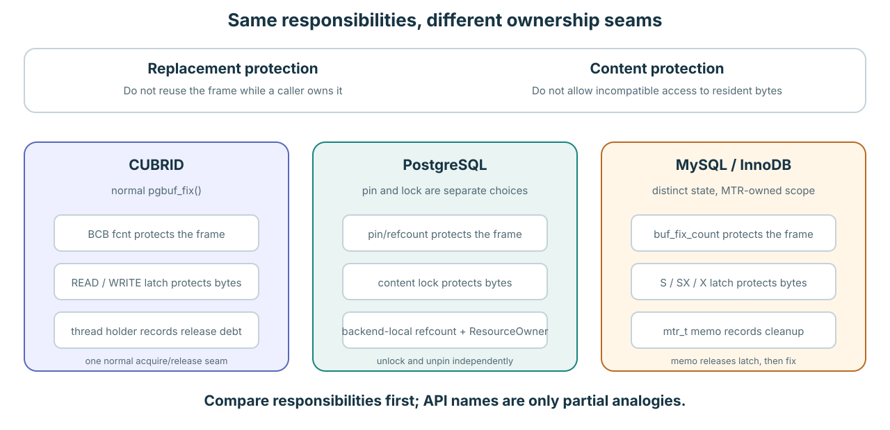
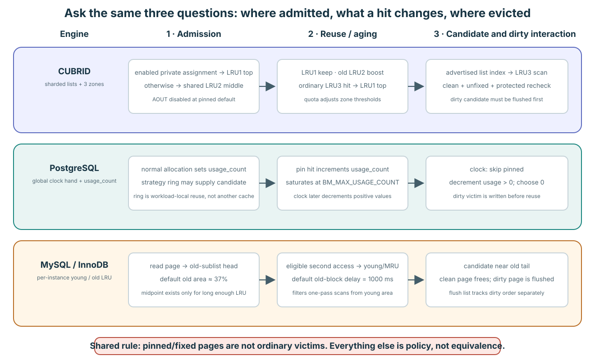

# Replacement policy across CUBRID, PostgreSQL, and InnoDB

**Level:** Evidence reference
**Capability gained:** Compare three replacement policies by their actual data
structures and transitions without treating unlike mechanisms as equivalents.
**Source baselines:** CUBRID
`f799e05d77d5300c6ea5753b4a6cc7caee6d8912`; PostgreSQL
`fd2b89854d93d70fe8c9a69d5b8fafd5b9302cfc`; MySQL/InnoDB
`06a5c1c99c377fc41b2eba1ea244e8b220bdc3c8`
**Evidence used:** Verified mechanism and implementation policy from pinned
first-party source. No cross-engine benchmark was run.

This note answers the replacement-policy part of `my-questions-8.md`. The
shortest accurate summary is:

> CUBRID chooses a cold page from one of many three-zone LRU domains;
> PostgreSQL lets a global clock hand decay a small resident usage counter;
> InnoDB scans the old tail of a midpoint LRU inside one buffer-pool instance.

All three first protect pinned/fixed pages from reuse. That shared safety rule
does **not** make their admission or eviction algorithms equivalent.



## One-page comparison



| Question | CUBRID | PostgreSQL | MySQL / InnoDB |
|---|---|---|---|
| What is ordered? | Each BCB is in one mutex-protected private or shared doubly linked LRU, split in place into LRU1/LRU2/LRU3. | The shared buffer descriptors are not recency-linked. One atomic clock hand indexes the descriptor array; each descriptor has a saturating `usage_count`. | Each buffer-pool instance has a mutex-protected doubly linked LRU with a `new` prefix and `old` suffix separated by `LRU_old`; compressed pages can also appear in `unzip_LRU`. |
| Normal miss admission | With AOUT disabled at this baseline, first unfix inserts into private LRU1 top when the context has a private LRU; otherwise into shared LRU2 middle. | A claimed descriptor is assigned the new tag with `usage_count = 1`. | A disk-read page is linked just after `LRU_old`, at the head of the old region. A newly created page is linked at the young head instead. |
| What does a resident hit do? | LRU1: no move. LRU2: boost to LRU1 only after a list-tick age test. LRU3: ordinary reuse boosts to LRU1. | The first pin by a backend increments `usage_count`, at most 5. Nested pins by that same backend only increment its private refcount. | Record first access time. A page is moved to the young head only if it is judged too old; an old page normally needs another access at least `innodb_old_blocks_time` after its first access. |
| Candidate choice | Domain order is own-private, advertised other-private, advertised shared, then own-private fallback. In one selected list, inspect only LRU3 from a hint/bottom, at most 1,000 BCBs, then recheck safety under the BCB mutex. | Advance the clock hand through the descriptor array. Skip pinned buffers; decrement nonzero `usage_count`; claim an unpinned descriptor whose counter is zero. | Take a free block if possible; otherwise scan backward from the LRU tail for a clean, relocatable page. A first foreground common-LRU attempt scans at most 100 pages; later pressure can scan the whole list. |
| Dirty candidate | Ordinary victim selection needs a clean BCB. The page-flush daemon cleans cold LRU3 pages and can hand a direct victim to a waiter. | Clock selection may return a dirty unpinned buffer. The allocating backend conditionally locks and flushes it, then revalidates; the background writer tries to clean likely near-future victims. | A dirty page is not immediately replaceable. Page cleaners scan the LRU tail and flush dirty pages; if foreground allocation still cannot find a free block, it may flush one tail page itself and retry the free list. |
| Main anti-scan mechanism | Private/shared domains and zone placement; an AOUT history implementation exists but is forcibly disabled at this baseline. | Backend-local access-strategy rings recycle a small shared-buffer working set for bulk read/write and vacuum instead of letting the global clock absorb the whole scan. | Midpoint admission places disk reads in the old region, and the first-access delay prevents a one-pass scan from immediately promoting every page. |
| Concurrency shape | Many LRU mutexes; lock-free queues advertise candidate-bearing LRU indexes; a victimizer locks one selected list and uses BCB try-locks. | One pool-wide atomic clock hand plus per-descriptor CAS state; the page-tag hash has 128 mapping-lock partitions. Strategy rings are backend-private arrays of shared buffer IDs, not separate pools. | Pages hash to one of one or more buffer-pool instances. Every instance owns its LRU/free/flush lists and their mutexes; the default instance count is derived and capped at 64 when not configured. |

Primary anchors: [CUBRID LRU structure and zone
encoding](https://github.com/CUBRID/cubrid/blob/f799e05d77d5300c6ea5753b4a6cc7caee6d8912/src/storage/page_buffer.c#L174-L216),
[PostgreSQL clock
sweep](https://github.com/postgres/postgres/blob/fd2b89854d93d70fe8c9a69d5b8fafd5b9302cfc/src/backend/storage/buffer/freelist.c#L104-L317),
and [InnoDB LRU/free-list
path](https://github.com/mysql/mysql-server/blob/06a5c1c99c377fc41b2eba1ea244e8b220bdc3c8/storage/innobase/buf/buf0lru.cc#L295-L640).

## CUBRID: choose a domain, then a zone-3 page

### Topology and admission

The pool owns `S + P` LRU descriptors: all shared lists followed by all private
lists. A BCB has one `prev_BCB`/`next_BCB` pair and an encoded list index and
zone, so private and shared are alternative memberships, not two independent
rankings. One list is physically:

```text
top -> [ LRU1: hot ] -- bottom_1
       [ LRU2: second chance ] -- bottom_2
       [ LRU3: victim zone ] -> bottom
```

At startup every BCB is on the invalid/free chain and every LRU is empty. With
the pinned default AOUT-disabled policy, the first zero-crossing unfix places a
new page at the private LRU1 top or shared LRU2 middle. The zone adjustment
helpers move old boundary entries LRU1 -> LRU2 -> LRU3 as thresholds overflow.
[List initialization and
counts](https://github.com/CUBRID/cubrid/blob/f799e05d77d5300c6ea5753b4a6cc7caee6d8912/src/storage/page_buffer.c#L5740-L5919),
[first-unfix
placement](https://github.com/CUBRID/cubrid/blob/f799e05d77d5300c6ea5753b4a6cc7caee6d8912/src/storage/page_buffer.c#L6885-L6994),
and [list insertion and zone
adjustment](https://github.com/CUBRID/cubrid/blob/f799e05d77d5300c6ea5753b4a6cc7caee6d8912/src/storage/page_buffer.c#L9694-L10265).

### Hit and eviction behavior

An ordinary final unfix is the replacement-policy event. LRU1 deliberately
does not move, avoiding an LRU mutex operation for an already-hot page. An LRU2
page returns to LRU1 only when its list-tick age is at least half the current
LRU2 population; a rapid second access therefore does not automatically buy a
hot position. An ordinary LRU3 reuse returns to LRU1. A separate saturating
64-fix field influences private-to-shared migration, but the victim scan does
not rank pages by this field.
[Unfix zone
decisions](https://github.com/CUBRID/cubrid/blob/f799e05d77d5300c6ea5753b4a6cc7caee6d8912/src/storage/page_buffer.c#L6713-L6844),
[age-gated
boost](https://github.com/CUBRID/cubrid/blob/f799e05d77d5300c6ea5753b4a6cc7caee6d8912/src/storage/page_buffer.c#L10123-L10197),
and [hot-count
policy](https://github.com/CUBRID/cubrid/blob/f799e05d77d5300c6ea5753b4a6cc7caee6d8912/src/storage/page_buffer.c#L16313-L16367).

Lists with candidates advertise their integer indexes through bounded
lock-free queues. A normal cross-private allocation does not enumerate
transactions or all private lists. After consuming one index, the victimizer
locks that LRU, walks at most 1,000 LRU3 nodes, uses nonblocking BCB mutex
acquisition, and performs the hard identity/fix/waiter/clean-state recheck
before detaching a victim.
[Search
order](https://github.com/CUBRID/cubrid/blob/f799e05d77d5300c6ea5753b4a6cc7caee6d8912/src/storage/page_buffer.c#L9066-L9253),
[bounded selected-list
scan](https://github.com/CUBRID/cubrid/blob/f799e05d77d5300c6ea5753b4a6cc7caee6d8912/src/storage/page_buffer.c#L9255-L9538),
and [list-index advertisement and
consumption](https://github.com/CUBRID/cubrid/blob/f799e05d77d5300c6ea5753b4a6cc7caee6d8912/src/storage/page_buffer.c#L16369-L16506).

The ordinary detach path requires a clean BCB. Dirty cold pages stay resident
until flush progress makes them clean. The page-flush daemon selects dirty
LRU3 candidates, rechecks identity, fix/flush state, coldness, and WAL
readiness, then flushes them; under allocation pressure a resulting clean BCB
can be assigned directly to a waiting allocator. Thus cleaning and replacement
cooperate, but dirty order is not another recency ordering.
[Dirty-candidate selection and
flush](https://github.com/CUBRID/cubrid/blob/f799e05d77d5300c6ea5753b4a6cc7caee6d8912/src/storage/page_buffer.c#L3861-L4165)
and [allocation wait/direct-victim
handoff](https://github.com/CUBRID/cubrid/blob/f799e05d77d5300c6ea5753b4a6cc7caee6d8912/src/storage/page_buffer.c#L8180-L8367).

### Exact pinned quantities

- With automatic `num_LRU_chains`, shared-list count is
  `max(4, min(MAX_NTRANS, floor(B / 1000)))`, where `B` is the BCB count.
- In server mode the default `num_private_chains = -1` derives
  `P = MAX_NTRANS + 50`; private descriptors may be shared by sessions after
  all are assigned.
- Shared zone targets default to 40% LRU1 and 5% LRU2. Private thresholds are
  each 5% of that list's adaptive quota. These are targets, not partitions of
  reserved frames.
- A selected-list victim scan examines at most 1,000 BCBs.
- AOUT capacity would be `min(B * data_aout_ratio, 32768)`, but tuning forces
  the ratio to zero at this revision pending CBRD-20741.

[Shared count
derivation](https://github.com/CUBRID/cubrid/blob/f799e05d77d5300c6ea5753b4a6cc7caee6d8912/src/storage/page_buffer.c#L5740-L5766),
[private count and quota
initialization](https://github.com/CUBRID/cubrid/blob/f799e05d77d5300c6ea5753b4a6cc7caee6d8912/src/storage/page_buffer.c#L13941-L14045),
[`VACUUM_MAX_WORKER_COUNT =
50`](https://github.com/CUBRID/cubrid/blob/f799e05d77d5300c6ea5753b4a6cc7caee6d8912/src/query/vacuum.h#L122-L133),
[quota and threshold
adjustment](https://github.com/CUBRID/cubrid/blob/f799e05d77d5300c6ea5753b4a6cc7caee6d8912/src/storage/page_buffer.c#L14252-L14503),
[AOUT
initialization](https://github.com/CUBRID/cubrid/blob/f799e05d77d5300c6ea5753b4a6cc7caee6d8912/src/storage/page_buffer.c#L5802-L5882),
and [the parameter tuning that forces AOUT
off](https://github.com/CUBRID/cubrid/blob/f799e05d77d5300c6ea5753b4a6cc7caee6d8912/src/base/system_parameter.c#L9975-L9987).

## PostgreSQL: decay a resident counter under a clock hand

### Topology and admission

PostgreSQL's normal replacement policy has no recency linked list. The shared
control object keeps an atomic `nextVictimBuffer`; modulo `NBuffers`, it points
into the descriptor array. On a miss, the allocator first obtains an unpinned
victim, publishes the new tag through the partitioned buffer table, and sets
its `usage_count` to one before I/O completes.
[Clock control and
selection](https://github.com/postgres/postgres/blob/fd2b89854d93d70fe8c9a69d5b8fafd5b9302cfc/src/backend/storage/buffer/freelist.c#L29-L56),
[miss publication and initial
count](https://github.com/postgres/postgres/blob/fd2b89854d93d70fe8c9a69d5b8fafd5b9302cfc/src/backend/storage/buffer/bufmgr.c#L2200-L2350).

### Hit and eviction behavior

On the first pin of a buffer by a backend, the default strategy increments both
the shared refcount and `usage_count`; the latter saturates at 5. A nested pin
by the same backend increments only its private refcount, so it does not earn a
second replacement credit. The clock hand skips a pinned descriptor. For an
unpinned descriptor it atomically decrements a positive `usage_count`, or
claims it when the count is zero. A page at the maximum can consequently need
as many as six full hand passes before selection; this is an upper-bound
trade-off, not an LRU rank.
[Pin and nested-pin
behavior](https://github.com/postgres/postgres/blob/fd2b89854d93d70fe8c9a69d5b8fafd5b9302cfc/src/backend/storage/buffer/bufmgr.c#L3269-L3386),
[`BM_MAX_USAGE_COUNT =
5`](https://github.com/postgres/postgres/blob/fd2b89854d93d70fe8c9a69d5b8fafd5b9302cfc/src/include/storage/buf_internals.h#L136-L147),
and [clock decay and
claim](https://github.com/postgres/postgres/blob/fd2b89854d93d70fe8c9a69d5b8fafd5b9302cfc/src/backend/storage/buffer/freelist.c#L239-L317).

Dirty state does not stop the clock from choosing a buffer. The allocating
backend obtains a conditional content lock, flushes a dirty victim, and then
invalidates it only after rechecking that it did not become pinned or dirty
again. Separately, the background writer scans ahead of the clock position and
tries to write dirty, unpinned, zero-usage buffers so later allocations need
less foreground I/O.
[Dirty-victim foreground
path](https://github.com/postgres/postgres/blob/fd2b89854d93d70fe8c9a69d5b8fafd5b9302cfc/src/backend/storage/buffer/bufmgr.c#L2547-L2640)
and [background-writer
contract](https://github.com/postgres/postgres/blob/fd2b89854d93d70fe8c9a69d5b8fafd5b9302cfc/src/backend/storage/buffer/README#L250-L270).

### Rings are a workload-local bypass, not another pool

Bulk operations may hold a backend-private ring of shared buffer numbers and
try each ring slot before falling back to the global clock. Under a nondefault
strategy, pinning keeps `usage_count` at least one but does not raise it above
one; a buffer touched by somebody else (`usage_count > 1`) is not recycled from
the ring. The pinned factory sizes are 256 KiB plus an asynchronous-I/O
allowance for bulk read, 16 MiB for bulk write, and 2 MiB for vacuum, all capped
at one eighth of `shared_buffers`. These rings limit cache pollution; they do
not create exclusive frame partitions or a CUBRID-style per-session LRU.
[Ring layout and
sizes](https://github.com/postgres/postgres/blob/fd2b89854d93d70fe8c9a69d5b8fafd5b9302cfc/src/backend/storage/buffer/freelist.c#L69-L94),
[factory sizing and
cap](https://github.com/postgres/postgres/blob/fd2b89854d93d70fe8c9a69d5b8fafd5b9302cfc/src/backend/storage/buffer/freelist.c#L420-L540),
and [ring
reuse](https://github.com/postgres/postgres/blob/fd2b89854d93d70fe8c9a69d5b8fafd5b9302cfc/src/backend/storage/buffer/freelist.c#L615-L705).

The replacement hand is pool-wide, but the high-frequency descriptor state is
updated by CAS, and the buffer mapping hash uses 128 partition locks. That is a
different concurrency trade-off from both CUBRID's many LRU mutexes and
InnoDB's independently sized pool instances.
[Atomic hand](https://github.com/postgres/postgres/blob/fd2b89854d93d70fe8c9a69d5b8fafd5b9302cfc/src/backend/storage/buffer/freelist.c#L104-L166)
and [128 mapping
partitions](https://github.com/postgres/postgres/blob/fd2b89854d93d70fe8c9a69d5b8fafd5b9302cfc/src/include/storage/lwlock.h#L76-L87).

## InnoDB: admit at the midpoint, evict from the old tail

### Topology and admission

Each `buf_pool_t` instance owns an LRU list, a free list, a flush list, an
`LRU_old` boundary, and list-specific mutexes. Page IDs hash to one instance;
the page is not dynamically ranked against pages in the other instances. When
the instance count is not configured, the pinned source forces one instance
below 1 GiB, otherwise derives a count from buffer size/chunk size and CPU count
and clamps it to 1..64.
[Instance-owned lists and
locks](https://github.com/mysql/mysql-server/blob/06a5c1c99c377fc41b2eba1ea244e8b220bdc3c8/storage/innobase/include/buf0buf.h#L2294-L2479),
[page-to-instance
mapping](https://github.com/mysql/mysql-server/blob/06a5c1c99c377fc41b2eba1ea244e8b220bdc3c8/storage/innobase/include/buf0buf.ic#L820-L832),
and [default instance
derivation](https://github.com/mysql/mysql-server/blob/06a5c1c99c377fc41b2eba1ea244e8b220bdc3c8/storage/innobase/handler/ha_innodb.cc#L4617-L4689).

Once an LRU reaches 512 entries, the `LRU_old` pointer divides one physical
list into young and old regions. The old target defaults to integer 37% (the
source initializer `100 * 3 / 8`) and is configurable from 5% to 95%, with a
20-entry adjustment tolerance. A disk-read page is inserted immediately after
`LRU_old`, so it begins near the young edge of the old region instead of at the
MRU head. A page created directly in memory is admitted at the young head.
[Old-region constants and
boundary maintenance](https://github.com/mysql/mysql-server/blob/06a5c1c99c377fc41b2eba1ea244e8b220bdc3c8/storage/innobase/buf/buf0lru.cc#L61-L79),
[midpoint
insertion](https://github.com/mysql/mysql-server/blob/06a5c1c99c377fc41b2eba1ea244e8b220bdc3c8/storage/innobase/buf/buf0lru.cc#L642-L733),
[disk-read
admission](https://github.com/mysql/mysql-server/blob/06a5c1c99c377fc41b2eba1ea244e8b220bdc3c8/storage/innobase/buf/buf0buf.cc#L4876-L4975),
and [sysvar defaults and
bounds](https://github.com/mysql/mysql-server/blob/06a5c1c99c377fc41b2eba1ea244e8b220bdc3c8/storage/innobase/handler/ha_innodb.cc#L23090-L23100).

### Hit and eviction behavior

The first logical access records `access_time`. When eviction has begun, an
accessed old page is promoted to the young head only if the first access is at
least `innodb_old_blocks_time` old; the default is 1,000 ms and zero disables
the time gate. This is a scan-resistance test, not a frequency counter. For
non-old pages, the `freed_page_clock` heuristic avoids moving a page that is
still close enough to the young end.
[First-access
timestamp](https://github.com/mysql/mysql-server/blob/06a5c1c99c377fc41b2eba1ea244e8b220bdc3c8/storage/innobase/include/buf0buf.ic#L562-L581),
[too-old
test](https://github.com/mysql/mysql-server/blob/06a5c1c99c377fc41b2eba1ea244e8b220bdc3c8/storage/innobase/include/buf0buf.ic#L155-L203),
and [promotion to the
head](https://github.com/mysql/mysql-server/blob/06a5c1c99c377fc41b2eba1ea244e8b220bdc3c8/storage/innobase/buf/buf0buf.cc#L3176-L3216).

Foreground allocation always returns a block from the instance free list. If
it is empty, the first common-LRU scan checks at most 100 tailward entries for a
clean relocatable page and puts any success onto the free list. A following
iteration may scan the whole LRU. If clean eviction still fails, the thread
wakes cleaning progress, can flush one dirty tail page, and retries; after more
than one failed iteration it sleeps 10 ms between retries. The page cleaner's
separate `innodb_lru_scan_depth` default is 1,024 per instance and is a cleaning
target, not the 100-entry foreground common-LRU bound.
[100-entry clean
scan](https://github.com/mysql/mysql-server/blob/06a5c1c99c377fc41b2eba1ea244e8b220bdc3c8/storage/innobase/buf/buf0lru.cc#L77-L80),
[free-block pressure
loop](https://github.com/mysql/mysql-server/blob/06a5c1c99c377fc41b2eba1ea244e8b220bdc3c8/storage/innobase/buf/buf0lru.cc#L493-L640),
[hard replaceability
test](https://github.com/mysql/mysql-server/blob/06a5c1c99c377fc41b2eba1ea244e8b220bdc3c8/storage/innobase/buf/buf0flu.cc#L476-L497),
and [`innodb_lru_scan_depth`
definition](https://github.com/mysql/mysql-server/blob/06a5c1c99c377fc41b2eba1ea244e8b220bdc3c8/storage/innobase/handler/ha_innodb.cc#L22669-L22679).

Dirty pages also enter an instance-local flush list keyed by their oldest
modification LSN. Page cleaning has both an LRU-tail objective (keep free pages
available) and a flush-list/redo-age objective. Adaptive flushing changes the
amount of writeback; it does not replace midpoint LRU as the resident-page
ordering algorithm.
[Dirty-page flush-list
insertion](https://github.com/mysql/mysql-server/blob/06a5c1c99c377fc41b2eba1ea244e8b220bdc3c8/storage/innobase/buf/buf0flu.cc#L385-L474),
[LRU cleaning
walk](https://github.com/mysql/mysql-server/blob/06a5c1c99c377fc41b2eba1ea244e8b220bdc3c8/storage/innobase/buf/buf0flu.cc#L1522-L1585),
and [adaptive redo/dirty
target](https://github.com/mysql/mysql-server/blob/06a5c1c99c377fc41b2eba1ea244e8b220bdc3c8/storage/innobase/buf/buf0flu.cc#L2220-L2333).

For compressed pages, InnoDB has a second adaptive decision: if `unzip_LRU` is
large enough, a rolling 50-second I/O-versus-decompression history chooses
whether to discard only an uncompressed frame or evict the whole page from the
regular LRU. This specialized history is not a general ghost cache of evicted
page identities.
[Compressed-page eviction
choice](https://github.com/mysql/mysql-server/blob/06a5c1c99c377fc41b2eba1ea244e8b220bdc3c8/storage/innobase/buf/buf0lru.cc#L85-L119),
[decision
formula](https://github.com/mysql/mysql-server/blob/06a5c1c99c377fc41b2eba1ea244e8b220bdc3c8/storage/innobase/buf/buf0lru.cc#L174-L213),
and [history
rotation](https://github.com/mysql/mysql-server/blob/06a5c1c99c377fc41b2eba1ea244e8b220bdc3c8/storage/innobase/buf/buf0lru.cc#L1617-L1661).

## Do not translate these names literally

| Tempting claim | Why it is false or incomplete |
|---|---|
| “CUBRID LRU3 is InnoDB's old region.” | Both identify colder residents, but CUBRID has many quota domains and only LRU3 is searched; InnoDB has one midpoint list per instance and scans backward from its tail. Their admission and hit transitions differ. |
| “PostgreSQL clock sweep is approximate LRU, so `usage_count` is a recency rank.” | It is a bounded reuse credit decayed by visits of a shared hand. Two buffers with the same count have no LRU order, and a nested pin in one backend does not increment it. |
| “PostgreSQL's scan ring is a private buffer pool like a CUBRID private LRU.” | The ring is a backend-local array of IDs for frames still owned by the one shared pool. CUBRID private LRUs are pool-global linked residency domains with adaptive quota and candidate advertisement. |
| “InnoDB old/new is 2Q with a ghost queue.” | The old and new regions contain resident pages in one LRU. The access-time gate is resident metadata; it does not remember an evicted identity. |
| “All three avoid dirty victims.” | CUBRID and InnoDB require a clean page for immediate detach, then rely on cleaning progress. PostgreSQL's clock can select a dirty unpinned descriptor and make the allocating backend flush and revalidate it. |
| “A better hit ratio in one engine proves a better algorithm.” | Pool size, page size, row/storage layout, scan strategy, dirtying rate, checkpoint/writeback policy, and concurrency shape differ. Source comparison gives hypotheses, not a performance ranking. |

## History and adaptation: the narrow comparison

- **CUBRID:** resident zone and list-tick history plus adaptive private/shared
  quotas. A nonresident AOUT identity history exists in source but is disabled
  at the pinned baseline.
- **PostgreSQL:** resident `usage_count` history, capped at 5; bulk-operation
  rings are chosen by callers. Inspection of the pinned normal replacement
  structures found no nonresident ghost-identity queue analogous to AOUT.
- **InnoDB:** resident old/new position and first-access time; adaptive dirty
  flushing; and a specialized rolling history for compressed-frame versus
  whole-page eviction. Inspection of the pinned general LRU path found no
  nonresident ghost-identity queue analogous to AOUT.

The two “found no” statements are bounded source-inspection results, not public
Interface promises. A later revision may add another policy without changing
the buffer-access API.

## Structural cost under pressure

Let `N` be PostgreSQL's `NBuffers`, `Ni` the resident-list size of one InnoDB
instance, and `Z3` the size of one selected CUBRID LRU3. These are source-shape
bounds, excluding mutex/CAS contention, I/O, sleep, and concurrent reheating.

| Engine | Normal priority update | One foreground victim attempt |
|---|---|---|
| CUBRID | A known-node list change is constant-time, plus any boundary entries demoted by zone adjustment; LRU1 ordinary reuse avoids a list move. | Lock-free index dequeue plus `O(min(Z3, 1000))` BCB visits in one selected LRU. It does not multiply by all private-list count for an ordinary attempt. |
| PostgreSQL | First backend pin uses a descriptor CAS and increments a bounded counter; same-backend nesting is private-only. | In a quiescent pool, at most `BM_MAX_USAGE_COUNT + 1 = 6` full `N`-descriptor passes can age a maximally credited page to selection. Concurrent pins/hits mean no useful strict wall-clock bound. |
| InnoDB | Younging is known-node unlink plus head insertion under one instance's LRU mutex; boundary adjustment may move entries around the midpoint. | The first common-LRU clean scan is bounded by 100 entries; the next iteration may be `O(Ni)`, followed by dirty flush/retry and possible 10-ms sleeps. |

These costs are not directly comparable throughput numbers. PostgreSQL touches
small descriptor state on many candidates; CUBRID and InnoDB perform linked-list
work under list mutexes; and only InnoDB's instance partition determines which
resident subset a requested page can use.

## Evidence boundary

This note establishes data structures and control flow at the three named
commits. Exact ratios, scan limits, instance/list counts, and background-worker
roles are implementation policy and version-sensitive. It does not establish:

- which engine has the higher hit ratio or lower latency for any workload;
- strict fairness or a wall-clock eviction bound under contention;
- an equal amount of usable page data per configured byte;
- equivalent page identities, page sizes, row layouts, or durability settings;
- that absence of a ghost structure at these source seams is a permanent
  product contract.

A useful benchmark must hold the workload and durability contract explicit,
record each engine's effective pool bytes and page size, distinguish logical
hits from physical reads, and measure foreground victim/flush stalls separately
from background cleaning. The primary-source comparison tells us what to
instrument; it does not supply the result.
