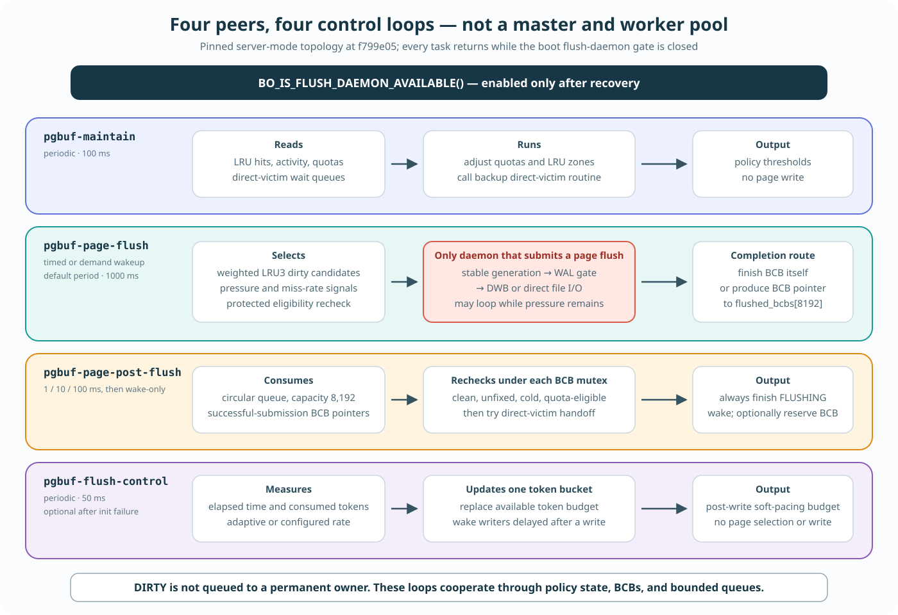

# Dirty-Page Flush Actors

**Level:** Evidence reference

**Question:** Does the page buffer have a flush daemon, perhaps a master plus four slaves, or does some other actor flush each dirty page?

**Source baseline:** CUBRID `f799e05d77d5300c6ea5753b4a6cc7caee6d8912`

**Evidence used:** Verified mechanism and implementation policy from the pinned CUBRID source. No runtime thread listing or I/O trace is claimed.

## Short answer

In a normally initialized server, CUBRID attempts to create **four page-buffer daemon objects, each backed by one OS thread inside the server process**. They are threads, not separate processes, and they are peers with different jobs—not one flush master plus four flush slaves:

| Daemon name | Role | Selects or writes dirty page images? |
|---|---|---|
| `pgbuf-maintain` | Adjust private-LRU quotas, then call a backup routine intended to search for clean direct victims | No |
| `pgbuf-page-flush` | Select cold dirty victim candidates and execute their page-buffer flush path | **Yes** |
| `pgbuf-page-post-flush` | Finish BCB bookkeeping and try to hand a BCB whose page-buffer flush generation was already submitted to a thread waiting for a victim | No |
| `pgbuf-flush-control` | Refill/measure file-I/O flush-control tokens | No |

The four pointers and the four one-thread initializers are explicit in the pinned source. The flush-control initializer is the one qualified case: it returns without creating its daemon if `fileio_flush_control_initialize()` fails. `cubthread::manager::create_daemon()` reserves one thread entry, and a `cubthread::daemon` constructor starts one `std::thread`; no page-buffer worker pool is attached to the page-flush daemon. [Page-buffer daemon pointers](https://github.com/CUBRID/cubrid/blob/f799e05d77d5300c6ea5753b4a6cc7caee6d8912/src/storage/page_buffer.c#L1391-L1398), [four page-buffer initializers and flush-control failure exit](https://github.com/CUBRID/cubrid/blob/f799e05d77d5300c6ea5753b4a6cc7caee6d8912/src/storage/page_buffer.c#L17146-L17255), [`create_daemon()` reserves one entry](https://github.com/CUBRID/cubrid/blob/f799e05d77d5300c6ea5753b4a6cc7caee6d8912/src/thread/thread_manager.cpp#L125-L141), [daemon starts one `std::thread`](https://github.com/CUBRID/cubrid/blob/f799e05d77d5300c6ea5753b4a6cc7caee6d8912/src/thread/thread_daemon.cpp#L53-L73).

## Four independent control loops



Every daemon is one task executed by its own generic daemon loop. The loop runs
the task, pauses according to its `cubthread::looper`, and repeats until stopped.
There is no scheduler that dispatches one dirty-page job to whichever of four
workers is idle. Their names identify four different control loops:

| Daemon | Trigger or cadence | Shared input | Work and output | Structural cost before I/O |
|---|---|---|---|---|
| `pgbuf-maintain` | Fixed 100 ms looper; there is no explicit wake site. | Per-thread unfix-counter shards, per-LRU hit/activity counters, quota descriptors, LRU zone boundaries, and direct-victim wait state. | Calls `pgbuf_adjust_quotas()`, then calls `pgbuf_direct_victims_maintenance()` as an intended low-activity backup. Quota adjustment consumes hit samples, updates private/shared targets, demotes over-threshold zones, and republishes victim-bearing lists. It does not flush a page. | Quota work scans managed thread counters and all `S + P` LRU descriptors, then any BCBs demoted by zone adjustment: O(T + S + P + D). The intended direct-victim backup has a source anomaly described below. |
| `pgbuf-page-flush` | Dynamic looper: timed by `page_bg_flush_interval_msecs` when positive (1,000 ms default at the pinned baseline), otherwise wake-only. Allocation pressure and dirty victim-bottom paths call `wakeup()`. A demand wake guarantees at least one victim-flush iteration. A timer wake can do zero iterations unless a direct-victim waiter exists or the hit ratio is low; once running, the same predicate can keep it looping. | Per-thread fix samples, per-LRU flush priorities, LRU3 chains, BCB flags, log state, and direct-victim wait state. | Computes a weighted scan budget, collects dirty cold candidates across LRUs, optionally sorts them by VPID, rechecks identity/dirty/FLUSHING/hot/fixed/WAL predicates, and calls the generation-flush mechanism, optionally with neighbors. It may complete the BCB itself or enqueue its pointer for post-flush work. | O(T + S + P + K + C log C + C·N) before storage latency: K inspected LRU nodes, C candidates, and up to N neighbor checks/pages per candidate. The base budget is capped at 200 MiB worth of pages, but each positive-priority LRU receives a minimum check of one, so K can exceed that base by up to the positive-LRU count. The actual flush is I/O-latency bound. |
| `pgbuf-page-post-flush` | Increasing idle periods of 1, 10, and 100 ms, then wake-only; the page-flush producer explicitly wakes it after enqueue. Finding work resets the looper to its fast interval. | The lock-free `flushed_bcbs` circular queue (capacity 8,192), individual BCB mutex/state, BCB flush-waiter lists, and direct-victim waiter queues. | Drains queued BCB pointers. Under each BCB mutex it rechecks flags, fix count, LRU3 membership, and private quota; it may reserve an eligible clean BCB for a waiting allocator. It always finishes the old FLUSHING state and wakes flush waiters. It does not submit another page write. | O(Q + stale direct waiters + sum of BCB flush waiters), plus lock/CAS contention. Capacity 8,192 bounds instantaneous backlog, not total work in one drain while a producer refills the queue. |
| `pgbuf-flush-control` | Fixed 50 ms looper with no explicit wake site, after successful token-bucket initialization. The first task run only establishes its time origin. | One file-I/O token bucket, elapsed time, pages/log-pages observed, tokens consumed, and adaptive/configured rate. | Computes a new token budget, replaces the bucket's available tokens, records statistics, and broadcasts the bucket condition variable. File writers consume these tokens in the post-write `fileio_compensate_flush()` path, so waiting paces subsequent progress rather than granting permission for the OS write that just completed. A non-log caller stops waiting after ten broadcasts/retries, and a caller holding the log critical section does not wait for missing tokens. The daemon neither chooses a BCB nor writes one. | O(1) protected accounting plus condition-variable broadcast cost proportional to the number of waiters the OS wakes. |

`T` denotes managed thread-counter shards, `S` and `P` the configured shared
and private LRU counts, `D` the number of BCBs demoted during zone adjustment,
`K` the inspected LRU nodes, `C` the dirty candidates, and `N` the neighbor
span. These are structural bounds; mutex wait,
cache coherence, scheduling, WAL, DWB, and storage latency are not represented
by the Big-O labels.

Primary anchors: [daemon tasks and
loopers](https://github.com/CUBRID/cubrid/blob/f799e05d77d5300c6ea5753b4a6cc7caee6d8912/src/storage/page_buffer.c#L16972-L17255),
[thread-counter sampling and quota
adjustment](https://github.com/CUBRID/cubrid/blob/f799e05d77d5300c6ea5753b4a6cc7caee6d8912/src/storage/page_buffer.c#L2205-L2243),
[quota calculation and zone
work](https://github.com/CUBRID/cubrid/blob/f799e05d77d5300c6ea5753b4a6cc7caee6d8912/src/storage/page_buffer.c#L14251-L14511),
[victim-flush selection and
submission](https://github.com/CUBRID/cubrid/blob/f799e05d77d5300c6ea5753b4a6cc7caee6d8912/src/storage/page_buffer.c#L3826-L4165),
[post-flush production and
consumption](https://github.com/CUBRID/cubrid/blob/f799e05d77d5300c6ea5753b4a6cc7caee6d8912/src/storage/page_buffer.c#L10925-L10952),
[post-flush recheck and
handoff](https://github.com/CUBRID/cubrid/blob/f799e05d77d5300c6ea5753b4a6cc7caee6d8912/src/storage/page_buffer.c#L15489-L15556),
and [file-I/O token-bucket
control](https://github.com/CUBRID/cubrid/blob/f799e05d77d5300c6ea5753b4a6cc7caee6d8912/src/storage/file_io.c#L671-L929).
Post-write call order is visible in [`fileio_write()` and the multi-page write
path](https://github.com/CUBRID/cubrid/blob/f799e05d77d5300c6ea5753b4a6cc7caee6d8912/src/storage/file_io.c#L4123-L4370).

### Pinned maintenance-loop anomaly

The direct-victim half of `pgbuf-maintain` must be separated into **intended
role** and **verified executable control flow**. The function comment says
`pgbuf_direct_victims_maintenance()` is a low-activity backup and initializes
an outer continuation budget to five. That value is not a strict assignment
maximum: one helper call can scan up to 1,000 LRU3 entries and assign multiple
eligible BCBs before returning. But both outer `for` loops initialize `index` to the saved
start index and immediately require `index != start_index`; that condition is
false on the first test, so neither loop body is entered as written. Quota
adjustment still runs every maintenance iteration. The absence of direct
assignment from this one routine does not remove other producers: victim scan,
page/post-flush, and LRU unfix paths can still hand BCBs to waiting allocators.

This is static source evidence, not proof of a production stall or its impact.
The uncertainty registry owns the status as `VS-20`; validation requires a
pressure probe that distinguishes assignments by producer and confirms whether
generated code, a supported build variant, or another path changes this
control flow. [Pinned loop
conditions](https://github.com/CUBRID/cubrid/blob/f799e05d77d5300c6ea5753b4a6cc7caee6d8912/src/storage/page_buffer.c#L9608-L9648).

Dirtying a page does **not** assign it to a particular flusher. `pgbuf_set_dirty_buffer_ptr()` only sets the BCB dirty flag, records which holder dirtied it for statistics, and increments statistics. The dirty BCB remains resident until one of several policies selects it. [Dirty transition](https://github.com/CUBRID/cubrid/blob/f799e05d77d5300c6ea5753b4a6cc7caee6d8912/src/storage/page_buffer.c#L11656-L11675), [dirty-flag update](https://github.com/CUBRID/cubrid/blob/f799e05d77d5300c6ea5753b4a6cc7caee6d8912/src/storage/page_buffer.c#L16020-L16061).

The actual thread that runs the common flush mechanism may therefore be the page-flush daemon, the checkpoint daemon, a foreground storage/request thread, the current WRITE-latch owner servicing an asynchronous request, a recovery or administration thread, or—in standalone mode—the only caller thread. “Who chose the page?” and “which thread eventually copied/wrote it?” are separate questions.

## Policy selects a page; mechanism writes one generation

The cleanest model is to separate two layers:

```text
selection policy
  victim pressure | checkpoint boundary | explicit object flush
  bulk/admin/recovery | invalidation | standalone allocation pressure
                         |
                         v
safe-flush gate for one BCB
  clean? already flushing? foreign WRITE owner?
                         |
                         v
generation flush mechanism
  mark FLUSHING and clear old DIRTY
  -> copy/encrypt resident generation
  -> capture PageLSA and oldest_unflush_lsa
  -> unlock BCB
  -> force WAL as required
  -> add to DWB, or write the data volume directly
  -> clear FLUSHING; restore DIRTY + oldest LSA on failure
```

The safe-flush gate permits an immediate copy when there is no current flush and the page is unlatched, READ-latched, or WRITE-latched by the same thread. A foreign WRITE owner is unsafe: an asynchronous caller sets `PGBUF_BCB_ASYNC_FLUSH_REQ`, while a synchronous caller also waits for completion. The WRITE owner sees that request during unfix and runs the flush path itself. [Safe-flush decision and request](https://github.com/CUBRID/cubrid/blob/f799e05d77d5300c6ea5753b4a6cc7caee6d8912/src/storage/page_buffer.c#L8810-L8895), [unfix services the request](https://github.com/CUBRID/cubrid/blob/f799e05d77d5300c6ea5753b4a6cc7caee6d8912/src/storage/page_buffer.c#L6853-L6880).

The common `pgbuf_bcb_flush_with_wal()` mechanism marks a new flush generation by setting FLUSHING and clearing the old DIRTY bit. This is deliberate: after the protected snapshot is copied, another legal writer can dirty the still-resident page, and that newer generation must remain visible as DIRTY while the older copy is in flight. The mechanism copies or encrypts the page under the BCB mutex, saves and clears `oldest_unflush_lsa`, releases the mutex, enforces WAL, and then uses DWB or direct file I/O. A failed write restores the old DIRTY state and `oldest_unflush_lsa`; success clears FLUSHING without clearing a newer DIRTY bit. [Generation copy, WAL, and sink](https://github.com/CUBRID/cubrid/blob/f799e05d77d5300c6ea5753b4a6cc7caee6d8912/src/storage/page_buffer.c#L10724-L10961), [flag transitions](https://github.com/CUBRID/cubrid/blob/f799e05d77d5300c6ea5753b4a6cc7caee6d8912/src/storage/page_buffer.c#L16077-L16137).

This common mechanism explains why the name of the calling thread is not the durability rule. Every path must converge on safe snapshotting, WAL ordering, generation flags, and error restoration; the different actors mainly answer **when and which pages** to submit.

## The actors that select or execute dirty-page flushes

### 1. Background victim preparation: `pgbuf-page-flush`

The page-flush daemon is the ordinary background cleaner. Its looper is periodic when `page_bg_flush_interval_msecs > 0`; with zero it waits indefinitely until explicitly woken. Once running, it keeps calling `pgbuf_flush_victim_candidates()` while a thread is waiting for a direct victim or the buffer hit ratio is low. [Looper policy and daemon task](https://github.com/CUBRID/cubrid/blob/f799e05d77d5300c6ea5753b4a6cc7caee6d8912/src/storage/page_buffer.c#L16971-L17067), [keep-running predicate](https://github.com/CUBRID/cubrid/blob/f799e05d77d5300c6ea5753b4a6cc7caee6d8912/src/storage/page_buffer.c#L15407-L15418).

Its policy is replacement-oriented, not “flush every dirty page.” It collects candidates from the LRU victim zone, then rechecks that the BCB still names the same page, is dirty, is not already flushing, remains cold, and is unfixed. It skips pages whose WAL is not ready, wakes the log-flush daemon, and flushes eligible candidates—optionally with neighboring pages for sequential I/O. [Candidate policy](https://github.com/CUBRID/cubrid/blob/f799e05d77d5300c6ea5753b4a6cc7caee6d8912/src/storage/page_buffer.c#L3861-L4008), [recheck, WAL gate, and flush](https://github.com/CUBRID/cubrid/blob/f799e05d77d5300c6ea5753b4a6cc7caee6d8912/src/storage/page_buffer.c#L4010-L4165).

Allocation pressure wakes this daemon when no victim can be found and when a newly exposed LRU bottom is dirty. The daemon can then hand an already-flushed clean BCB directly to an allocator waiting for a victim. [Allocation wait and wakeup](https://github.com/CUBRID/cubrid/blob/f799e05d77d5300c6ea5753b4a6cc7caee6d8912/src/storage/page_buffer.c#L8180-L8367), [dirty-bottom wakeup](https://github.com/CUBRID/cubrid/blob/f799e05d77d5300c6ea5753b4a6cc7caee6d8912/src/storage/page_buffer.c#L9439-L9475).

### 2. Checkpoint: the log checkpoint daemon or its direct caller

Checkpoint has a different policy goal: advance the recovery redo boundary. In server mode, the separate `log-checkpoint` daemon calls `logpb_checkpoint()`, which forces pending log pages and invokes `pgbuf_flush_checkpoint()` in the same checkpoint thread. It is not delegated to `pgbuf-page-flush`. [Checkpoint daemon execution](https://github.com/CUBRID/cubrid/blob/f799e05d77d5300c6ea5753b4a6cc7caee6d8912/src/transaction/log_manager.c#L10194-L10207), [checkpoint daemon initialization](https://github.com/CUBRID/cubrid/blob/f799e05d77d5300c6ea5753b4a6cc7caee6d8912/src/transaction/log_manager.c#L10430-L10447), [checkpoint-to-page-buffer call](https://github.com/CUBRID/cubrid/blob/f799e05d77d5300c6ea5753b4a6cc7caee6d8912/src/transaction/log_page_buffer.c#L6974-L7021).

`pgbuf_flush_checkpoint()` scans the BCB table, selects dirty non-temporary pages whose `oldest_unflush_lsa` is not newer than `flush_upto_lsa`, sorts batches by VPID for sequentiality, and synchronously safe-flushes them. If a selected page is held by a foreign WRITE owner, the safe-flush protocol requests that owner to flush and waits; therefore the checkpoint thread selected the page but the holder may execute the copy/write. [Checkpoint selection](https://github.com/CUBRID/cubrid/blob/f799e05d77d5300c6ea5753b4a6cc7caee6d8912/src/storage/page_buffer.c#L4173-L4315), [sequential synchronous flush](https://github.com/CUBRID/cubrid/blob/f799e05d77d5300c6ea5753b4a6cc7caee6d8912/src/storage/page_buffer.c#L4317-L4607).

The log-archive-removal daemon is **not** an additional data-page flusher in server mode. Server-mode archive removal reads `log_Gl.flushed_lsa_lower_bound`, which checkpoint advances after its page flush. In standalone mode, the archive-removal call explicitly invokes `pgbuf_flush_checkpoint()` because there is no background checkpoint/page-flush thread. [Archive-removal split](https://github.com/CUBRID/cubrid/blob/f799e05d77d5300c6ea5753b4a6cc7caee6d8912/src/transaction/log_page_buffer.c#L6225-L6298), [checkpoint updates the lower bound](https://github.com/CUBRID/cubrid/blob/f799e05d77d5300c6ea5753b4a6cc7caee6d8912/src/transaction/log_page_buffer.c#L7023-L7041).

### 3. Foreground explicit flushes

A caller that already holds a page may request an immediate WAL-respecting flush through `pgbuf_flush_with_wal()`. This is used by object-oriented storage operations such as `heap_flush()` and `overflow_flush()`. It is the caller thread—not a daemon—that enters the safe-flush mechanism. [Page-buffer explicit API](https://github.com/CUBRID/cubrid/blob/f799e05d77d5300c6ea5753b4a6cc7caee6d8912/src/storage/page_buffer.c#L3551-L3618), [`heap_flush()` callers](https://github.com/CUBRID/cubrid/blob/f799e05d77d5300c6ea5753b4a6cc7caee6d8912/src/storage/heap_file.c#L5571-L5662), [`overflow_flush()` caller](https://github.com/CUBRID/cubrid/blob/f799e05d77d5300c6ea5753b4a6cc7caee6d8912/src/storage/overflow_file.c#L662-L693).

Long-lived WRITE-latched pages provide another foreground path. A checkpoint or other actor can set the asynchronous flush-request flag, and the owner periodically calls `pgbuf_flush_if_requested()` or services the request at unfix. The vacuum master does this for its permanently fixed first and last data pages. [Long-lived-page interface](https://github.com/CUBRID/cubrid/blob/f799e05d77d5300c6ea5753b4a6cc7caee6d8912/src/storage/page_buffer.c#L3620-L3660), [vacuum caller](https://github.com/CUBRID/cubrid/blob/f799e05d77d5300c6ea5753b4a6cc7caee6d8912/src/query/vacuum.c#L2994-L3045).

### 4. Bulk, invalidation, administration, shutdown, and recovery

Several lifecycle operations deliberately scan a volume or the whole pool from their own thread:

- `pgbuf_flush_all*()` scans every BCB and safe-flushes the matching dirty set. `pgbuf_invalidate*()` also flushes dirty pages before detaching their BCBs. [Bulk helpers](https://github.com/CUBRID/cubrid/blob/f799e05d77d5300c6ea5753b4a6cc7caee6d8912/src/storage/page_buffer.c#L3366-L3752).
- Backup and volume-copy flows flush all unfixed pages, then explicitly synchronize DWB/volume state before reading or copying the volume. [Backup flow](https://github.com/CUBRID/cubrid/blob/f799e05d77d5300c6ea5753b4a6cc7caee6d8912/src/transaction/log_page_buffer.c#L7448-L7537), [copy-volume flow](https://github.com/CUBRID/cubrid/blob/f799e05d77d5300c6ea5753b4a6cc7caee6d8912/src/transaction/log_page_buffer.c#L9312-L9379).
- Normal shutdown and database lifecycle code issue bulk flushes from the shutdown/boot thread; recovery also uses bulk flushes and the `RVPB_FLUSH_PAGE` recovery callback when a particular recovered change must be persisted immediately. [Shutdown bulk flush](https://github.com/CUBRID/cubrid/blob/f799e05d77d5300c6ea5753b4a6cc7caee6d8912/src/transaction/log_manager.c#L1820-L1854), [recovery callback](https://github.com/CUBRID/cubrid/blob/f799e05d77d5300c6ea5753b4a6cc7caee6d8912/src/storage/page_buffer.c#L14888-L14923), [callback registration](https://github.com/CUBRID/cubrid/blob/f799e05d77d5300c6ea5753b4a6cc7caee6d8912/src/transaction/recovery.c#L780-L790).
- A normal logged transaction commit does not generally force its dirty data pages. One explicit exception is `log_No_logging`, where commit flushes log pages and all unfixed dirty pages. [No-logging commit exception](https://github.com/CUBRID/cubrid/blob/f799e05d77d5300c6ea5753b4a6cc7caee6d8912/src/transaction/log_manager.c#L5451-L5469).

These are not more members of a flush-worker group. They are synchronous call sites that reuse the same page-buffer mechanism for a stronger lifecycle requirement.

## DWB is a separate downstream pipeline

The page-buffer flusher and the double-write buffer must not be conflated. The page-buffer actor first decides to retire one dirty **BCB generation**. For a permanent page when DWB exists, `pgbuf_bcb_flush_with_wal()` adds the copied image to a DWB slot; otherwise it calls `fileio_write()` on the data volume directly. Adding to DWB can return before the image is written to its home data page; the DWB hash also lets reads find a newer queued image. [Page-buffer DWB/direct branch](https://github.com/CUBRID/cubrid/blob/f799e05d77d5300c6ea5753b4a6cc7caee6d8912/src/storage/page_buffer.c#L10801-L10900), [queued DWB image can be read](https://github.com/CUBRID/cubrid/blob/f799e05d77d5300c6ea5753b4a6cc7caee6d8912/src/storage/double_write_buffer.cpp#L3979-L4014).

In server mode DWB owns two additional one-thread daemons:

| DWB daemon | Role |
|---|---|
| `dwb-flush-block` | Flush full DWB blocks in fill order, including the protected write and home-page writes |
| `dwb-file-sync` | Help synchronize the affected data volumes |

These are not page-buffer slaves. They operate after a page image has crossed the page-buffer/DWB seam. They are created independently and are usable only when `double_write_buffer_enable_flush_thread` is true. [DWB daemon tasks and initialization](https://github.com/CUBRID/cubrid/blob/f799e05d77d5300c6ea5753b4a6cc7caee6d8912/src/storage/double_write_buffer.cpp#L4017-L4123), [availability condition](https://github.com/CUBRID/cubrid/blob/f799e05d77d5300c6ea5753b4a6cc7caee6d8912/src/storage/double_write_buffer.cpp#L4126-L4152).

Disabling DWB or its helper thread does not leave dirty pages without a writer:

- If DWB itself does not exist, the page-buffer flush path writes the copied page directly to its volume.
- If DWB exists but its flush daemon is unavailable or disabled, the thread that fills a DWB block calls `dwb_flush_block()` synchronously.
- If the DWB daemon is available, filling a block wakes it and the submitting thread returns; explicit synchronization paths can still force pending DWB content.

Those fallbacks are in `dwb_add_page()`: only the available-daemon branch wakes and returns; otherwise the caller flushes the full block. [DWB add and synchronous fallback](https://github.com/CUBRID/cubrid/blob/f799e05d77d5300c6ea5753b4a6cc7caee6d8912/src/storage/double_write_buffer.cpp#L2714-L2828). The general file-I/O wrapper likewise states that it writes directly when DWB is disabled and queues to DWB when enabled. [File-I/O DWB seam](https://github.com/CUBRID/cubrid/blob/f799e05d77d5300c6ea5753b4a6cc7caee6d8912/src/storage/file_io.c#L3998-L4060).

## Server and standalone lifecycle

During server restart, CUBRID first loads and recovers DWB pages, then constructs the four page-buffer and two DWB daemons. Their work is gated until log recovery finishes and `BO_ENABLE_FLUSH_DAEMONS()` is called. Error shutdown disables the gate and destroys both daemon groups; normal shutdown destroys page-buffer daemons before final log/page teardown and destroys DWB after pages have been flushed. [Restart ordering and enable gate](https://github.com/CUBRID/cubrid/blob/f799e05d77d5300c6ea5753b4a6cc7caee6d8912/src/transaction/boot_sr.c#L2405-L2441), [gate definition](https://github.com/CUBRID/cubrid/blob/f799e05d77d5300c6ea5753b4a6cc7caee6d8912/src/transaction/boot_sr.h#L84-L106), [error shutdown](https://github.com/CUBRID/cubrid/blob/f799e05d77d5300c6ea5753b4a6cc7caee6d8912/src/transaction/boot_sr.c#L2763-L2783), [normal shutdown ordering](https://github.com/CUBRID/cubrid/blob/f799e05d77d5300c6ea5753b4a6cc7caee6d8912/src/transaction/boot_sr.c#L3092-L3114).

Standalone mode compiles out daemon creation. `pgbuf_is_page_flush_daemon_available()` returns false, and `pgbuf_wakeup_page_flush_daemon()` executes `pgbuf_flush_victim_candidates()` synchronously in the requesting thread. BCB allocation explicitly documents that the standalone path flushes pages and retries victim search. Its comment says the same design is intended whenever the page-flush thread is unavailable, including recovery; that sentence needs a boundary at this revision. Server boot creates the daemon object before `log_initialize()` and gates its task until recovery finishes, while `pgbuf_is_page_flush_daemon_available()` tests only whether the pointer is non-null. Therefore the cited control flow does not prove that every allocation-pressure event during server recovery takes the synchronous fallback. Recovery-owned explicit flush calls remain synchronous in their caller threads. [Standalone flush fallback](https://github.com/CUBRID/cubrid/blob/f799e05d77d5300c6ea5753b4a6cc7caee6d8912/src/storage/page_buffer.c#L11677-L11702), [allocation policy and comment](https://github.com/CUBRID/cubrid/blob/f799e05d77d5300c6ea5753b4a6cc7caee6d8912/src/storage/page_buffer.c#L8204-L8224), [availability implementation](https://github.com/CUBRID/cubrid/blob/f799e05d77d5300c6ea5753b4a6cc7caee6d8912/src/storage/page_buffer.c#L17290-L17302), [boot ordering](https://github.com/CUBRID/cubrid/blob/f799e05d77d5300c6ea5753b4a6cc7caee6d8912/src/transaction/boot_sr.c#L2405-L2441).

## Maintainer conclusions

1. “Four page-buffer daemons” describes the normal pinned server initialization (with the flush-control initialization caveat), but “one master plus four flush slaves” is false. There are four single-thread daemons with orthogonal roles, and only `pgbuf-page-flush` selects and submits dirty victim candidates through the page-buffer flush mechanism. The maintenance daemon's direct-victim backup is intended by comment but its pinned loop bodies are not entered as written; route status through `VS-20`.
2. A dirty page has no permanently assigned flusher. The thread that selects it and the thread that executes its safe flush can differ when a WRITE owner must service an asynchronous request.
3. Victim cleaning and checkpoint flushing share the generation-flush mechanism but implement different policies: replacement progress versus recovery-boundary progress.
4. Archive removal is not a server-mode page-flush worker. It relies on checkpoint progress; only the standalone archive-removal path invokes checkpoint flushing directly.
5. DWB daemons are downstream persistence helpers, not page-buffer workers. With DWB absent, the page-buffer caller writes the data volume directly; with DWB helpers disabled, a filling caller flushes full DWB blocks synchronously.
6. Normal transaction commit is governed by WAL and does not usually force data pages. Background cleaning, checkpoint, explicit storage calls, and lifecycle/recovery paths eventually retire dirty generations for their own reasons.
