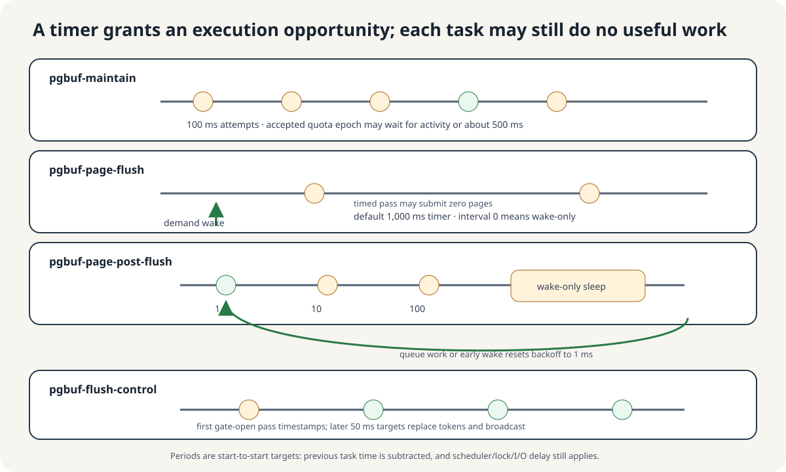
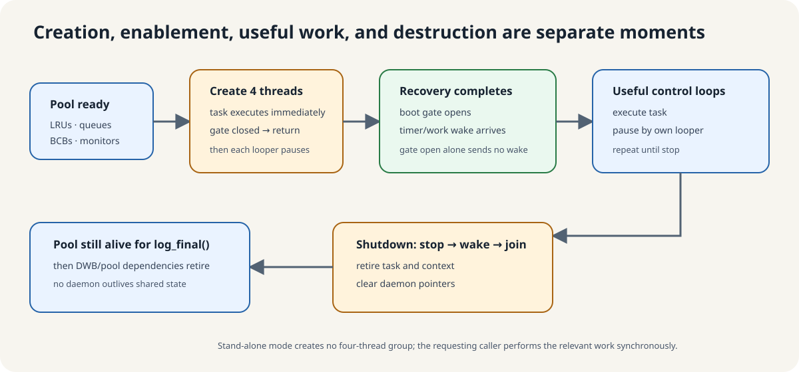
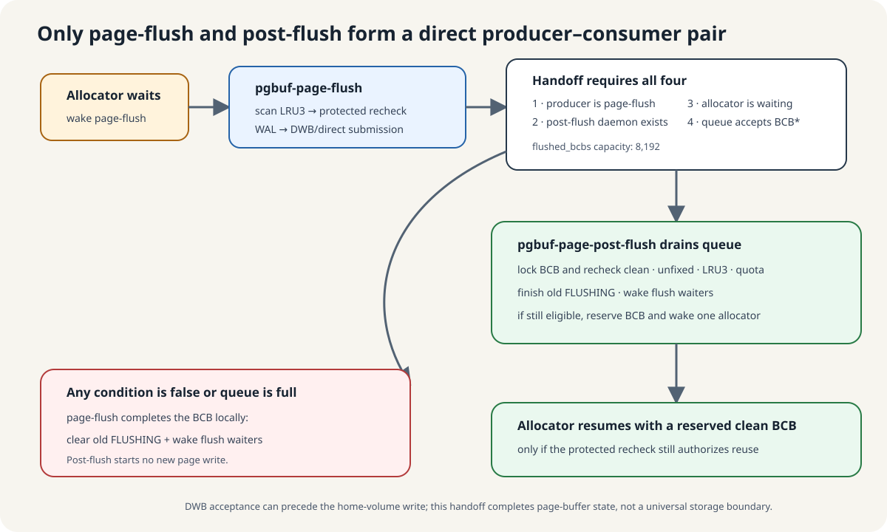
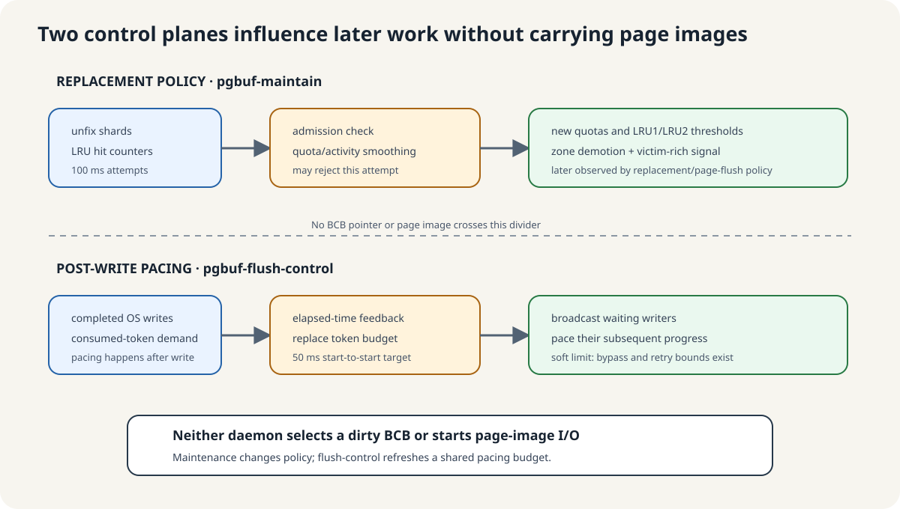

# Page-Buffer Daemon Lifecycle Audit

**Level:** Evidence reference

**Question:** What does each daemon in Lesson 6A own, when does it actually run,
how does it sleep and wake, and which similarly named actors are outside the
page-buffer daemon group?

**Source baseline:** CUBRID
`f799e05d77d5300c6ea5753b4a6cc7caee6d8912`

**Evidence used:** Verified mechanism and Implementation policy from static
inspection of the pinned CUBRID source and the existing page-buffer guide. No
runtime scheduling, latency, or thread-state observation is claimed.

## Answer in one screen

The pinned server creates up to four page-buffer daemon objects. Each object
owns one `std::thread`, one thread-manager execution context, one task, one
`cubthread::looper`, and one condition-variable-based waiter. They are four
independent control loops, not a pool that takes interchangeable dirty-page
jobs.

| Thread name | Plain-language job | Nominal pause pattern | Explicit work wake | Starts page-image I/O? |
|---|---|---:|---|---|
| `pgbuf-maintain` | Recalculate replacement quotas and zone boundaries; call an intended low-activity direct-victim backup | Fixed 100 ms | None | No |
| `pgbuf-page-flush` | Find cold dirty LRU3 pages and submit old resident generations so clean victims will exist | Configured timer, 1,000 ms by default; zero means wake-only | Allocation/victim pressure | **Yes** |
| `pgbuf-page-post-flush` | Finish BCB state after selected page-flush submissions and, when still safe, hand a clean BCB to an allocator | 1 ms, 10 ms, 100 ms, then wake-only | Successful `flushed_bcbs` enqueue | No new I/O |
| `pgbuf-flush-control` | Refill a shared file-I/O pacing budget and wake writers waiting after an OS write | Fixed 50 ms | None | No |

“Nominal pause” is deliberately not called an exact execution frequency. The
generic looper aims for a start-to-start period by subtracting the previous task
execution time. Scheduler delay, mutex waits, WAL, and storage I/O add latency;
if the task already consumed the period, the next pause is zero. The daemon
executes its task once immediately after construction, then pauses, rather than
sleeping before its first task call. [Generic daemon
loop](https://github.com/CUBRID/CUBRID/blob/f799e05d77d5300c6ea5753b4a6cc7caee6d8912/src/thread/thread_daemon.cpp#L208-L245),
[period-minus-execution-time
calculation](https://github.com/CUBRID/CUBRID/blob/f799e05d77d5300c6ea5753b4a6cc7caee6d8912/src/thread/thread_looper.cpp#L118-L163).



The simplest ownership rule is:

```text
replacement policy       dirty-page generation       BCB completion       file-I/O pacing
pgbuf-maintain        ->  pgbuf-page-flush       ->  pgbuf-page-post-flush

all file writers      <-------------------------------- pgbuf-flush-control tokens
```

This is cooperation through shared state, not a strict four-stage pipeline.
Maintenance never hands each dirty page to page-flush. Page-flush does not use
post-flush for every submission. Flush-control paces many file writers and does
not select a BCB.

## The common daemon state machine

All four use the same generic lifecycle:



```text
not created
    |
    | create_daemon(looper, task, name)
    v
OS thread + cubthread::entry created
    |
    | task executes immediately
    v
execute task -> pause by looper -> execute task -> ...
    ^                 |
    |                 | timeout or wakeup while SLEEPING
    +-----------------+
    |
    | destroy_daemon
    v
set looper stop -> wake sleeper -> join OS thread
    -> retire execution context -> retire task -> pointer cleared
```

`manager::create_daemon()` reserves one managed thread entry for each daemon;
the `daemon` constructor starts exactly one `std::thread`. Destruction sets the
looper stop flag, wakes a sleeping waiter, joins the thread, and retires the
execution context and task. [Manager create/destroy
paths](https://github.com/CUBRID/CUBRID/blob/f799e05d77d5300c6ea5753b4a6cc7caee6d8912/src/thread/thread_manager.cpp#L125-L153),
[daemon construction and
stop/join](https://github.com/CUBRID/CUBRID/blob/f799e05d77d5300c6ea5753b4a6cc7caee6d8912/src/thread/thread_daemon.cpp#L53-L105),
[task/context retirement](https://github.com/CUBRID/CUBRID/blob/f799e05d77d5300c6ea5753b4a6cc7caee6d8912/src/thread/thread_daemon.cpp#L222-L245).

### Timeout and wakeup have different meanings

The waiter has `RUNNING`, `SLEEPING`, and `AWAKENING` states. `wakeup()` only
changes a waiter that is currently `SLEEPING`; if the daemon task is already
`RUNNING`, the call returns without latching a future event. A timed pause
returns `true` when awakened before timeout and `false` on timeout. An infinite
pause returns only after a wake. [Waiter states and
API](https://github.com/CUBRID/CUBRID/blob/f799e05d77d5300c6ea5753b4a6cc7caee6d8912/src/thread/thread_waiter.hpp#L56-L99),
[wakeup early return and condition
signal](https://github.com/CUBRID/CUBRID/blob/f799e05d77d5300c6ea5753b4a6cc7caee6d8912/src/thread/thread_waiter.cpp#L76-L101),
[timed and infinite
waits](https://github.com/CUBRID/CUBRID/blob/f799e05d77d5300c6ea5753b4a6cc7caee6d8912/src/thread/thread_waiter.cpp#L147-L159),
[`wait_for()` result](https://github.com/CUBRID/CUBRID/blob/f799e05d77d5300c6ea5753b4a6cc7caee6d8912/src/thread/thread_waiter.cpp#L200-L224).

That means “wake the daemon” is an early-execution hint, not a durable queue
item. Correct progress also depends on the shared condition that the task checks
when it executes. Page-flush rechecks allocator pressure/hit ratio; post-flush
drains the queue rather than trusting the wake count.

### Boot gate and resource lifetime

The page-buffer pool and its LRU/monitor/direct-victim/`flushed_bcbs` structures
exist before these daemons. Server restart first recovers DWB pages, then calls
`pgbuf_daemons_init()`, then starts log initialization and recovery. The four OS
threads therefore exist during recovery, but every task begins with
`BO_IS_FLUSH_DAEMON_AVAILABLE()` and returns while the boot gate is closed. Boot
sets the gate after `log_initialize()` completes. Setting the Boolean gate does
not itself call each daemon's `wakeup()`; fixed timers observe it on later
iterations, while wake-only roles wait for their ordinary work trigger.
[Pool before file-manager
initialization](https://github.com/CUBRID/CUBRID/blob/f799e05d77d5300c6ea5753b4a6cc7caee6d8912/src/transaction/log_tran_table.c#L468-L505),
[DWB recovery, daemon creation, log recovery, and gate
enable](https://github.com/CUBRID/CUBRID/blob/f799e05d77d5300c6ea5753b4a6cc7caee6d8912/src/transaction/boot_sr.c#L2405-L2441),
[gate macros](https://github.com/CUBRID/CUBRID/blob/f799e05d77d5300c6ea5753b4a6cc7caee6d8912/src/transaction/boot_sr.h#L84-L106),
[four task gate
checks](https://github.com/CUBRID/CUBRID/blob/f799e05d77d5300c6ea5753b4a6cc7caee6d8912/src/storage/page_buffer.c#L16994-L17136).

Normal shutdown destroys and joins the page-buffer daemons before `log_final()`
and before DWB/pool destruction. Restart-error cleanup closes the gate first,
then destroys the page-buffer and DWB daemon groups. The pool is finalized only
later, so no page-buffer daemon may outlive the shared structures it uses.
[Normal shutdown
order](https://github.com/CUBRID/CUBRID/blob/f799e05d77d5300c6ea5753b4a6cc7caee6d8912/src/transaction/boot_sr.c#L3086-L3114),
[restart-error
order](https://github.com/CUBRID/CUBRID/blob/f799e05d77d5300c6ea5753b4a6cc7caee6d8912/src/transaction/boot_sr.c#L2763-L2783),
[pool finalization
order](https://github.com/CUBRID/CUBRID/blob/f799e05d77d5300c6ea5753b4a6cc7caee6d8912/src/transaction/log_tran_table.c#L580-L594).

Stand-alone builds create none of the four. Their page-buffer work runs in the
only caller thread; in particular, the page-flush wake helper calls victim
flushing synchronously when no server daemon is available. [Server-only daemon
creation/destruction](https://github.com/CUBRID/CUBRID/blob/f799e05d77d5300c6ea5753b4a6cc7caee6d8912/src/storage/page_buffer.c#L17146-L17255),
[stand-alone synchronous
fallback](https://github.com/CUBRID/CUBRID/blob/f799e05d77d5300c6ea5753b4a6cc7caee6d8912/src/storage/page_buffer.c#L11677-L11702).

## 1. `pgbuf-maintain`: update replacement policy

### Why it exists

Private and shared LRU sizes should follow observed use rather than stay frozen
at initialization values. The maintenance task calls `pgbuf_adjust_quotas()` to
turn recent unfix and LRU-hit samples into:

- a smoothed private-versus-shared page ratio;
- an activity-weighted quota for each private LRU;
- LRU1/LRU2 zone thresholds for every list;
- demotion of pages that now exceed those thresholds;
- publication of candidate-bearing LRUs; and
- the approximate `victim_rich` signal.

It then calls `pgbuf_direct_victims_maintenance()`, whose comment describes a
backup that should search LRUs and feed forgotten direct-victim waiters under
low activity. The executable caveat for that second call is covered below.
[Maintenance task](https://github.com/CUBRID/CUBRID/blob/f799e05d77d5300c6ea5753b4a6cc7caee6d8912/src/storage/page_buffer.c#L16994-L17009),
[quota sampling and
calculation](https://github.com/CUBRID/CUBRID/blob/f799e05d77d5300c6ea5753b4a6cc7caee6d8912/src/storage/page_buffer.c#L14251-L14511),
[backup routine and
comment](https://github.com/CUBRID/CUBRID/blob/f799e05d77d5300c6ea5753b4a6cc7caee6d8912/src/storage/page_buffer.c#L9608-L9648).

### Attempt cadence versus accepted quota cadence

The daemon looper has a fixed 100 ms period and has no ordinary explicit wake
site. It therefore *attempts* the task on a 100 ms start-to-start target after
its initial immediate execution. Shutdown is the only generic wake needed to
stop/join it. [Maintenance
initializer](https://github.com/CUBRID/CUBRID/blob/f799e05d77d5300c6ea5753b4a6cc7caee6d8912/src/storage/page_buffer.c#L17146-L17162).

An attempt does not imply a new quota epoch. `pgbuf_adjust_quotas()` returns when
private quota is disabled, another adjustment is marked active, less than 1 ms
has elapsed, or both the counted final-unfix activity is below `B/4` and less
than 500 ms has elapsed. An accepted pass resets the per-thread unfix shards,
increments `adjust_age`, and processes the LRU samples. Foreground private-LRU
assignment and release also call this same function, so the daemon is not its
exclusive caller. [Admission checks and accepted
epoch](https://github.com/CUBRID/CUBRID/blob/f799e05d77d5300c6ea5753b4a6cc7caee6d8912/src/storage/page_buffer.c#L14288-L14340),
[foreground assignment/release
calls](https://github.com/CUBRID/CUBRID/blob/f799e05d77d5300c6ea5753b4a6cc7caee6d8912/src/storage/page_buffer.c#L14599-L14623).

For the guide's 512 MiB pool with 16 KiB pages, `B = 32,768`. The activity
threshold is therefore `B/4 = 8,192` counted final unfixes. Fewer than 81 unfixes
on an accepted pass (`B/400`, after integer truncation) selects the low-activity
policy. Under low activity, the visible executable timer permits an accepted
pass at roughly the first 100 ms tick at or after 500 ms, subject to scheduling;
high activity can admit a pass on successive 100 ms attempts. This is why “the
quota changes every 100 ms” is false even though “maintenance tries every
100 ms” is a useful first approximation. [Activity
constants](https://github.com/CUBRID/CUBRID/blob/f799e05d77d5300c6ea5753b4a6cc7caee6d8912/src/storage/page_buffer.c#L271-L277),
[executable timing
guards](https://github.com/CUBRID/CUBRID/blob/f799e05d77d5300c6ea5753b4a6cc7caee6d8912/src/storage/page_buffer.c#L14304-L14330).

### Shared structures, locks, and cost

The function scans the managed thread entries to sum/reset per-thread unfix
counters. On an accepted pass it atomically exchanges every LRU hit counter,
updates the persistent quota/activity arrays, and reads each LRU descriptor.
It takes an individual LRU mutex only when zone demotion is necessary; it does
not lock every BCB globally. [Thread-shard
scan](https://github.com/CUBRID/CUBRID/blob/f799e05d77d5300c6ea5753b4a6cc7caee6d8912/src/storage/page_buffer.c#L2204-L2244),
[per-LRU samples and conditional LRU
locks](https://github.com/CUBRID/CUBRID/blob/f799e05d77d5300c6ea5753b4a6cc7caee6d8912/src/storage/page_buffer.c#L14332-L14504).

Let `T` be the managed thread-entry count, `L` the total LRU count, and `D` the
number of pages moved while shrinking zones:

- a quota-disabled return is O(1);
- a normal early timing/activity check is O(T), because summing the unfix shards
  is a thread-array scan;
- an accepted adjustment is O(T + L + D), plus sequential LRU-mutex waits;
- the pinned direct-victim backup performs no LRU body work because of `VS-20`.

The task never copies a page generation, forces WAL, or invokes file I/O.

### Lifecycle summary

```text
create thread (gate closed)
  -> every 100 ms: gate?
       closed: return
       open: try quota adjustment
             -> maybe reject this epoch
             -> maybe recompute quotas and demote zones
             -> call intended backup (pinned body blocked by VS-20)
  -> destroy: stop + wake + join
```

## 2. `pgbuf-page-flush`: create clean replacement supply

### Why it exists

Ordinary victimization can reuse only an eligible clean BCB. The page-flush
daemon is the background actor that looks at replacement pressure, selects cold
dirty pages from LRU3, and retires one resident generation through the common
WAL-respecting page flush mechanism. Its policy goal is clean replacement
supply; it is not “write every dirty page once per timer tick.”
[Candidate collection and generation
submission](https://github.com/CUBRID/CUBRID/blob/f799e05d77d5300c6ea5753b4a6cc7caee6d8912/src/storage/page_buffer.c#L3861-L4169).

### Sleep, timeout, and demand wake

At each pause, `pgbuf_get_page_flush_interval()` reads the configured
`page_bg_flush_interval` value through its internal millisecond parameter. A
positive value creates a timed wait; zero creates an infinite, wake-only wait.
The pinned default is 1,000 ms. [Dynamic pause
selection](https://github.com/CUBRID/CUBRID/blob/f799e05d77d5300c6ea5753b4a6cc7caee6d8912/src/storage/page_buffer.c#L16971-L16992),
[pinned parameter default and zero
minimum](https://github.com/CUBRID/CUBRID/blob/f799e05d77d5300c6ea5753b4a6cc7caee6d8912/src/base/system_parameter.c#L1806-L1829).

Three pressure paths call the wake helper:

1. an allocator has failed INVALID and normal victim search, enqueued itself in
   a direct-victim waiter queue, and is about to sleep;
2. victimization removed a clean bottom BCB and exposed a dirty LRU bottom; and
3. a selected LRU victim scan failed and requests more clean victims.

If no page-flush daemon exists, the same helper calls
`pgbuf_flush_victim_candidates()` synchronously in the requesting thread.
[Allocator enqueue and
wake](https://github.com/CUBRID/CUBRID/blob/f799e05d77d5300c6ea5753b4a6cc7caee6d8912/src/storage/page_buffer.c#L8247-L8310),
[dirty-bottom and failed-scan
wakes](https://github.com/CUBRID/CUBRID/blob/f799e05d77d5300c6ea5753b4a6cc7caee6d8912/src/storage/page_buffer.c#L9439-L9534),
[wake/fallback
helper](https://github.com/CUBRID/CUBRID/blob/f799e05d77d5300c6ea5753b4a6cc7caee6d8912/src/storage/page_buffer.c#L11677-L11702).

When the daemon observes that its last pause ended by wake rather than timeout,
it forces at least one call to `pgbuf_flush_victim_candidates()`. On a timer
timeout it enters the loop only while at least one direct-victim waiter exists
or the measured hit ratio is below 99.9% after more than ten victim requests.
After each flush call it checks the same predicate again and can continue
without another sleep. A no-candidate result with a valid scan target sets
`stop_iteration`, deliberately breaking the daemon loop so allocator threads
get a chance to run. [Task force/continue
loop](https://github.com/CUBRID/CUBRID/blob/f799e05d77d5300c6ea5753b4a6cc7caee6d8912/src/storage/page_buffer.c#L17012-L17067),
[keep-running
predicate](https://github.com/CUBRID/CUBRID/blob/f799e05d77d5300c6ea5753b4a6cc7caee6d8912/src/storage/page_buffer.c#L15407-L15418),
[hit-ratio
test](https://github.com/CUBRID/CUBRID/blob/f799e05d77d5300c6ea5753b4a6cc7caee6d8912/src/storage/page_buffer.c#L16628-L16645),
[no-candidate stop
hint](https://github.com/CUBRID/CUBRID/blob/f799e05d77d5300c6ea5753b4a6cc7caee6d8912/src/storage/page_buffer.c#L3978-L3990).

The exact wording matters: a demand wake that is *observed by the sleeping
waiter* forces one call. A call to `wakeup()` while the daemon is already
`RUNNING` is not stored for the next pause by the generic waiter. The shared
pressure predicate is the steady-state safety net; the timer is another retry
opportunity when configured positive.

There is one scheduler-level corner case: when the previous task execution has
already consumed the configured period, the looper passes a zero duration to
`wait_for()`. That function returns `true` without sleeping, so
`was_woken_up()` is also true even though no external caller signalled the
daemon. Page-flush consequently forces another candidate-flush call. This is a
pinned implementation detail of the shared looper, not a separate pressure
trigger. [Zero-wait
return](https://github.com/CUBRID/CUBRID/blob/f799e05d77d5300c6ea5753b4a6cc7caee6d8912/src/thread/thread_waiter.cpp#L200-L207),
[page-flush use of
`was_woken_up()`](https://github.com/CUBRID/CUBRID/blob/f799e05d77d5300c6ea5753b4a6cc7caee6d8912/src/storage/page_buffer.c#L17029-L17049).

### One active iteration

```text
read replacement signals
  -> compute per-LRU flush priority and scan budget
  -> lock each selected LRU, walk cold LRU3 nodes, remember dirty BCB + VPID
  -> unlock LRUs
  -> optionally sort candidates by VPID
  -> for each remembered candidate:
       lock BCB
       recheck same VPID, DIRTY, !FLUSHING, still LRU3, unfixed
       if page WAL is not durable: skip + wake log-flush
       else copy/submit generation (neighbor batching may participate)
  -> complete BCB here, or conditionally hand BCB* to post-flush
```

The VPID recheck matters because the candidate array stores pointers after
releasing LRU locks; a BCB may have changed before the later BCB-mutex pass.
The task wakes the separate log-flush daemon before candidate processing and
again for individual WAL-blocked candidates. If every candidate is blocked only
on WAL while an allocator waits, it synchronously forces the necessary log
boundary once and retries the candidate pass. [Candidate save under LRU
locks](https://github.com/CUBRID/CUBRID/blob/f799e05d77d5300c6ea5753b4a6cc7caee6d8912/src/storage/page_buffer.c#L3780-L3857),
[identity/state/WAL recheck and
flush](https://github.com/CUBRID/CUBRID/blob/f799e05d77d5300c6ea5753b4a6cc7caee6d8912/src/storage/page_buffer.c#L3993-L4105),
[synchronous WAL retry under allocator
pressure](https://github.com/CUBRID/CUBRID/blob/f799e05d77d5300c6ea5753b4a6cc7caee6d8912/src/storage/page_buffer.c#L4129-L4151).

### Default-size numerical example

The hidden `pb_buffer_flush_ratio` default is 0.01. An iteration starts with
`int(B * 0.01)` inspected-page budget, multiplies it by a miss-rate-dependent
factor from 1 through 10 outside checkpoint, and caps the base result at 200 MiB
worth of pages. Every LRU with positive priority nevertheless receives at least
one check, so the total walk can exceed that base by the number of positive
lists. Sequential candidate sorting is enabled by default; the default neighbor
span is eight pages. [Ratio
default](https://github.com/CUBRID/CUBRID/blob/f799e05d77d5300c6ea5753b4a6cc7caee6d8912/src/base/system_parameter.c#L1158-L1168),
[budget/boost/cap](https://github.com/CUBRID/CUBRID/blob/f799e05d77d5300c6ea5753b4a6cc7caee6d8912/src/storage/page_buffer.c#L3930-L3982),
[per-list minimum](https://github.com/CUBRID/CUBRID/blob/f799e05d77d5300c6ea5753b4a6cc7caee6d8912/src/storage/page_buffer.c#L3803-L3824),
[neighbor and sorting
defaults](https://github.com/CUBRID/CUBRID/blob/f799e05d77d5300c6ea5753b4a6cc7caee6d8912/src/base/system_parameter.c#L3942-L3964).

For `B = 32,768`, the unboosted budget is 327 BCB checks. A full 10x boost is
3,270, below the 12,800-page 200 MiB cap at 16 KiB per page. These are selection
budgets, not promises that 327 or 3,270 pages will be written: clean, hot, fixed,
identity-changed, already-flushing, and WAL-blocked candidates reduce the actual
write count.

### Shared structures, locks, handoff, and cost

Page-flush is the single intended owner of the pool-wide candidate scratch
array. It scans all LRU descriptors and takes one LRU mutex at a time, later
takes one BCB mutex at a time, interacts with log/WAL state, and submits through
DWB or direct file I/O. It also reads the lock-free direct-victim queues. The
source debug assertion records one stable page-flush thread identity.
[Pool candidate array and one-daemon
comment](https://github.com/CUBRID/CUBRID/blob/f799e05d77d5300c6ea5753b4a6cc7caee6d8912/src/storage/page_buffer.c#L760-L835),
[single-thread debug
check](https://github.com/CUBRID/CUBRID/blob/f799e05d77d5300c6ea5753b4a6cc7caee6d8912/src/storage/page_buffer.c#L3886-L3924).

With `T` thread shards, `L` LRUs, `K` inspected LRU nodes, `C` saved candidates,
and neighbor span `N`, one call is structurally O(T + L + K + C log C + C*N).
Mutex contention, WAL waits, DWB, file I/O, and scheduling usually dominate
wall time. The daemon can execute multiple calls in one wake cycle while
pressure remains.

### Lifecycle summary

```text
create thread (gate closed)
  -> pause by configured timer, or indefinitely when interval=0
  -> timeout:
       run only if direct-victim pressure or low hit ratio
     observed demand wake:
       force at least one candidate-flush call
  -> keep calling while pressure remains, unless iteration asks to stop
  -> each successful generation: finish locally or enqueue for post-flush
  -> destroy: stop + wake + join
```

## 3. `pgbuf-page-post-flush`: finish and revalidate BCBs

### Why it exists

After the page-flush daemon successfully crosses its configured submission
boundary, BCB completion still has CPU-side work: clear the old `FLUSHING`
generation, wake threads waiting for that flush, and perhaps reserve the now
clean BCB for an allocator already waiting for a victim. Post-flush can take
that bookkeeping off the I/O-producing page-flush thread under pressure.

This is a conditional handoff, not the second half of every flush. The producer
enqueues the `PGBUF_BCB *` only when all four conditions hold:

1. this submission came from the page-flush thread;
2. the post-flush daemon exists;
3. some direct-victim allocator is waiting; and
4. the bounded `flushed_bcbs` queue accepts the pointer.

Otherwise the page-flush thread reacquires the BCB mutex, clears the old
`FLUSHING` state, and wakes flush waiters itself. [Conditional handoff and local
fallback](https://github.com/CUBRID/CUBRID/blob/f799e05d77d5300c6ea5753b4a6cc7caee6d8912/src/storage/page_buffer.c#L10925-L10952).

With DWB enabled, “successful submission” may mean that DWB accepted the stable
page image; it does not prove the home-volume write completed in the
page-flush thread. With DWB absent, the same point follows successful direct
`fileio_write()`. Post-flush starts no new page write in either case. [DWB versus
direct branch](https://github.com/CUBRID/CUBRID/blob/f799e05d77d5300c6ea5753b4a6cc7caee6d8912/src/storage/page_buffer.c#L10870-L10900).

### Adaptive idle backoff

The looper holds `[1 ms, 10 ms, 100 ms]`. Consecutive timeout-driven idle
passes consume those periods and then switch to infinite wait. A wake before
timeout resets the increasing-period index; consuming at least one queued BCB
also explicitly resets it. Therefore the easy mental model is:

```text
work found -> next target pause 1 ms
still idle -> 10 ms
still idle -> 100 ms
still idle -> sleep until page-flush enqueues and wakes
```

As with other loopers, the previous task execution time is subtracted. If a
drain takes at least the next target period, the subsequent pass can be
immediate. [Post-flush looper
construction](https://github.com/CUBRID/CUBRID/blob/f799e05d77d5300c6ea5753b4a6cc7caee6d8912/src/storage/page_buffer.c#L17182-L17204),
[increasing-wait reset and terminal infinite
wait](https://github.com/CUBRID/CUBRID/blob/f799e05d77d5300c6ea5753b4a6cc7caee6d8912/src/thread/thread_looper.cpp#L208-L224),
[work-found reset](https://github.com/CUBRID/CUBRID/blob/f799e05d77d5300c6ea5753b4a6cc7caee6d8912/src/storage/page_buffer.c#L17070-L17085).

The task is constructed while the boot gate is closed. Its immediate pass and
early 1/10/100 ms passes may all return at the gate and let it reach wake-only
state during recovery. That is safe because gated page-flush cannot produce a
post-flush handoff; the first later handoff supplies its normal wake.

### What one drain does

`flushed_bcbs` is a lock-free circular queue constructed with capacity 8,192.
The task consumes until the queue reports empty. For each pointer it locks the
BCB and rechecks current facts:

- no victim-invalidating flag other than the old `FLUSHING` flag;
- zero current fixes;
- still in LRU3;
- if private, the list is still over quota.

Only then may it consume a live thread from the high/low direct-victim queues,
lock that thread entry, mark/reserve the BCB, and wake the allocator. Regardless
of reservation success, it finishes the old `FLUSHING` generation and wakes all
BCB flush waiters before unlocking. The recheck is necessary because another
thread can fix, dirty, or heat the resident page between I/O submission and
post-processing. [Queue allocation and
capacity](https://github.com/CUBRID/CUBRID/blob/f799e05d77d5300c6ea5753b4a6cc7caee6d8912/src/storage/page_buffer.c#L1824-L1861),
[drain and protected
recheck](https://github.com/CUBRID/CUBRID/blob/f799e05d77d5300c6ea5753b4a6cc7caee6d8912/src/storage/page_buffer.c#L15487-L15556),
[direct-victim queue selection and thread
wake](https://github.com/CUBRID/CUBRID/blob/f799e05d77d5300c6ea5753b4a6cc7caee6d8912/src/storage/page_buffer.c#L15420-L15485),
[priority queue
selection](https://github.com/CUBRID/CUBRID/blob/f799e05d77d5300c6ea5753b4a6cc7caee6d8912/src/storage/page_buffer.c#L15559-L15589).

### Cost and lifecycle summary

For `Q` consumed BCB pointers, `S` stale direct-victim waiter records skipped,
and `F` total BCB flush-waiter nodes woken, a drain is O(Q + S + F), plus queue
CAS, BCB-mutex, thread-entry-mutex, and scheduler costs. The 8,192 capacity
bounds queued pointers at one instant, not total items consumed while producers
continue refilling.

```text
create thread (gate closed)
  -> idle backoff 1 -> 10 -> 100 ms -> wake-only
  -> page-flush conditionally produces BCB* and wakes
  -> drain queue, revalidate every BCB, finish FLUSHING/waiters
  -> optionally reserve one clean BCB per live allocator
  -> reset to fast 1 ms pause when any item was consumed
  -> destroy: stop + wake + join
```

## 4. `pgbuf-flush-control`: pace file I/O after writes

### Why it exists

The name is misleading if read as “the daemon that flushes page-buffer BCBs.”
Its state and algorithm live in `file_io.c`. It maintains a token bucket used by
file-write paths to soften the rate of subsequent progress after pages have
already crossed the OS write call. It never selects a dirty BCB, sets
`FLUSHING`, copies a page, forces WAL, or chooses DWB.

`pgbuf_flush_control_daemon_init()` first initializes a mutex, condition
variable, zero-token bucket, and statistics. If initialization fails, it returns
without creating this fourth daemon; the bucket pointer remains unavailable and
token acquisition becomes a no-op. Page-buffer flushing itself still works.
[Token-bucket
initialization](https://github.com/CUBRID/CUBRID/blob/f799e05d77d5300c6ea5753b4a6cc7caee6d8912/src/storage/file_io.c#L671-L712),
[optional daemon
creation](https://github.com/CUBRID/CUBRID/blob/f799e05d77d5300c6ea5753b4a6cc7caee6d8912/src/storage/page_buffer.c#L17206-L17228),
[null-bucket token
path](https://github.com/CUBRID/CUBRID/blob/f799e05d77d5300c6ea5753b4a6cc7caee6d8912/src/storage/file_io.c#L750-L768).

### Cadence and first active execution

The looper has a fixed 50 ms start-to-start target and no ordinary explicit
wake site. Gate-closed executions return before changing task state. The first
gate-open execution records only the time origin and returns; a later execution
measures elapsed microseconds and calls `fileio_flush_control_add_tokens()`.
Thus “tokens refill every 50 ms” is approximate, and the first refill occurs one
active interval after the first timestamp pass, subject to when the boot gate
becomes visible and to scheduling. [Task first-run
branch](https://github.com/CUBRID/CUBRID/blob/f799e05d77d5300c6ea5753b4a6cc7caee6d8912/src/storage/page_buffer.c#L17088-L17143),
[50 ms
initializer](https://github.com/CUBRID/CUBRID/blob/f799e05d77d5300c6ea5753b4a6cc7caee6d8912/src/storage/page_buffer.c#L17212-L17227).

At shutdown, this task's custom `retire()` finalizes the token bucket, clears
the global bucket pointer, and destroys its mutex/condition variable after the
thread has left the loop. [Task
retire](https://github.com/CUBRID/CUBRID/blob/f799e05d77d5300c6ea5753b4a6cc7caee6d8912/src/storage/page_buffer.c#L17138-L17143),
[bucket
finalization](https://github.com/CUBRID/CUBRID/blob/f799e05d77d5300c6ea5753b4a6cc7caee6d8912/src/storage/file_io.c#L714-L741).

### Token update and writer behavior

Under the token mutex, each active update:

1. reads and clears the previously consumed-token count;
2. records file-page, log-page, and token statistics;
3. computes the new interval budget;
4. **replaces**, rather than adds to, `tb->tokens`;
5. resets interval statistics; and
6. broadcasts `waiter_cond` to waiting writers.

Adaptive control is enabled by default. If tokens remained unused, the next
budget drops by 10% of the remainder unless dirty pressure is increasing. If
the bucket was exhausted, it grows by at least 50% of the previous interval
budget or by the dirty-pressure suggestion. The computed result is floored at
40 MiB/s converted to the elapsed interval. With adaptive control disabled,
the budget is the configured maximum rate times elapsed time; the pinned
internal default is 10,000 pages/s. [Token replacement and
broadcast](https://github.com/CUBRID/CUBRID/blob/f799e05d77d5300c6ea5753b4a6cc7caee6d8912/src/storage/file_io.c#L831-L894),
[adaptive
algorithm](https://github.com/CUBRID/CUBRID/blob/f799e05d77d5300c6ea5753b4a6cc7caee6d8912/src/storage/file_io.c#L896-L929),
[rate
constants](https://github.com/CUBRID/CUBRID/blob/f799e05d77d5300c6ea5753b4a6cc7caee6d8912/src/storage/file_io.c#L281-L297),
[parameter
defaults](https://github.com/CUBRID/CUBRID/blob/f799e05d77d5300c6ea5753b4a6cc7caee6d8912/src/base/system_parameter.c#L1830-L1865).

At 16 KiB per page, the 40 MiB/s floor is 2,560 pages/s, approximately 128
tokens for a 50 ms interval. The non-adaptive 10,000-page/s default would be
approximately 500 tokens per 50 ms. These are calculated examples; elapsed
time, integer truncation, and adaptive feedback determine the actual budget.

`fileio_write()` and `fileio_write_pages()` call `fileio_compensate_flush()`
*after* successful OS writes. That helper then obtains tokens and may trigger a
separate whole-file synchronization threshold. A non-log caller waits on the
bucket condition and retries at most ten broadcasts; after that it proceeds.
A caller holding the log critical section accounts demand but does not wait for
missing tokens. The mechanism is consequently soft pacing, not correctness
authorization or a strict rate ceiling. [Single/multi-page post-write
call](https://github.com/CUBRID/CUBRID/blob/f799e05d77d5300c6ea5753b4a6cc7caee6d8912/src/storage/file_io.c#L4122-L4204),
[multi-page post-write
call](https://github.com/CUBRID/CUBRID/blob/f799e05d77d5300c6ea5753b4a6cc7caee6d8912/src/storage/file_io.c#L4285-L4373),
[token wait and bypass
rules](https://github.com/CUBRID/CUBRID/blob/f799e05d77d5300c6ea5753b4a6cc7caee6d8912/src/storage/file_io.c#L743-L829),
[compensation and sync
threshold](https://github.com/CUBRID/CUBRID/blob/f799e05d77d5300c6ea5753b4a6cc7caee6d8912/src/storage/file_io.c#L626-L668).

### Locks, cost, and lifecycle summary

The daemon uses one token-bucket mutex and broadcasts one condition variable.
Its arithmetic and counters are O(1); broadcast and the later scheduling storm
scale with the number of waiting writers. Those writers contend on the same
bucket mutex when they wake.

```text
initialize zero-token bucket
  -> create thread (gate closed)
  -> first gate-open pass: remember current time only
  -> about every 50 ms:
       measure elapsed time
       replace token budget under mutex
       broadcast waiting post-write callers
  -> destroy/join
  -> task retire clears and destroys token bucket
```

## The only direct producer-consumer pair

Among the four roles, only page-flush and post-flush form a direct queue
handoff:



```text
pgbuf-page-flush
  successful generation submission
  + allocator waiting
  + post-flush daemon exists
  + flushed_bcbs has room
              |
              | produce(PGBUF_BCB*) + wakeup()
              v
       lock-free queue [8,192]
              |
              | consume until empty
              v
pgbuf-page-post-flush
  BCB mutex -> revalidate -> finish old FLUSHING
            -> wake flush waiters
            -> maybe reserve BCB for allocator

Any condition false or queue full
  -> page-flush completes the same BCB work itself
```

Maintenance influences which lists page-flush prioritizes through quota and
zone state; page-flush computes the per-LRU flush-priority array at the start of
its own iteration. Maintenance does not enqueue page-flush work. Flush-control
can delay the page-flush thread after direct file I/O, but it does not receive a
BCB pointer.



## Actors that Lesson 6A must keep outside the four

### Log checkpoint daemon

`log-checkpoint` is a separate log-manager daemon. Its configurable timer uses
`log_checkpoint_interval`, 360 seconds by default, with zero meaning wake-only.
Commit/system-operation paths also wake it when append LSA reaches the
next-checkpoint log-page threshold. Its task calls `logpb_checkpoint()` in the
checkpoint thread; that function flushes append log pages, invokes
`pgbuf_flush_checkpoint()` for data pages selected by the recovery boundary,
and synchronizes files. It does not ask `pgbuf-page-flush` to choose those
pages. [Checkpoint timer and
wake](https://github.com/CUBRID/CUBRID/blob/f799e05d77d5300c6ea5753b4a6cc7caee6d8912/src/transaction/log_manager.c#L10101-L10149),
[default
interval](https://github.com/CUBRID/CUBRID/blob/f799e05d77d5300c6ea5753b4a6cc7caee6d8912/src/base/system_parameter.c#L1380-L1401),
[size-trigger
predicate](https://github.com/CUBRID/CUBRID/blob/f799e05d77d5300c6ea5753b4a6cc7caee6d8912/src/transaction/log_manager.c#L114-L126),
[checkpoint daemon task and
initializer](https://github.com/CUBRID/CUBRID/blob/f799e05d77d5300c6ea5753b4a6cc7caee6d8912/src/transaction/log_manager.c#L10194-L10207),
[checkpoint's direct page-buffer
call](https://github.com/CUBRID/CUBRID/blob/f799e05d77d5300c6ea5753b4a6cc7caee6d8912/src/transaction/log_page_buffer.c#L6974-L7021).

Checkpoint and background victim flushing share the safe generation-flush
mechanism, but their selection policies differ:

| Actor | Why it selects data pages | Selection basis |
|---|---|---|
| `pgbuf-page-flush` | Prepare clean replacement supply | cold dirty LRU3 candidates and pressure |
| `log-checkpoint` | Advance the recovery redo boundary | `oldest_unflush_lsa` relative to checkpoint boundary |

### Foreground and current WRITE-owner paths

Storage, recovery, administration, backup, shutdown, and invalidation callers
can synchronously call one-page, volume, or whole-pool flush interfaces in
their own thread. A selector that meets a page held by another WRITE owner can
set `PGBUF_BCB_ASYNC_FLUSH_REQ`; the WRITE owner performs the protected copy
when it checks the request or unfixes. Therefore “which policy selected this
page?” and “which thread executed the safe copy?” can have different answers.
[Explicit page-flush
API](https://github.com/CUBRID/CUBRID/blob/f799e05d77d5300c6ea5753b4a6cc7caee6d8912/src/storage/page_buffer.c#L3551-L3660),
[bulk
interfaces](https://github.com/CUBRID/CUBRID/blob/f799e05d77d5300c6ea5753b4a6cc7caee6d8912/src/storage/page_buffer.c#L3366-L3752),
[foreign-WRITE request
path](https://github.com/CUBRID/CUBRID/blob/f799e05d77d5300c6ea5753b4a6cc7caee6d8912/src/storage/page_buffer.c#L8810-L8895),
[owner services request at
unfix](https://github.com/CUBRID/CUBRID/blob/f799e05d77d5300c6ea5753b4a6cc7caee6d8912/src/storage/page_buffer.c#L6853-L6880).

### Log-flush and DWB daemons

The page-flush daemon can wake `log-flush` so WAL reaches a page's PageLSA.
`log-flush` manages append-log durability, not data-page BCB replacement.
Likewise, DWB's optional flush-block and file-sync daemons are downstream
storage-integrity helpers after a stable data-page image crosses the DWB seam.
They are not extra page-buffer workers. [Page-flush wakes log
flush](https://github.com/CUBRID/CUBRID/blob/f799e05d77d5300c6ea5753b4a6cc7caee6d8912/src/storage/page_buffer.c#L3993-L4003),
[log-flush task](https://github.com/CUBRID/CUBRID/blob/f799e05d77d5300c6ea5753b4a6cc7caee6d8912/src/transaction/log_manager.c#L10405-L10427),
[DWB daemon
group](https://github.com/CUBRID/CUBRID/blob/f799e05d77d5300c6ea5753b4a6cc7caee6d8912/src/storage/double_write_buffer.cpp#L4017-L4152).

## Pinned and version-sensitive boundaries

### `VS-20`: unreachable maintenance backup loops

Both `for` loops in `pgbuf_direct_victims_maintenance()` initialize `index` to
the saved start value, then require `index != start_index` on the first
condition test. The condition is immediately false, so neither private nor
shared loop body executes as written at the pinned revision. Quota adjustment
still works, and victim scan, unfix, page-flush, and post-flush remain other
direct-victim producers. This source-visible control flow does not establish
runtime starvation. The uncertainty registry owns it as `VS-20`. [Pinned loop
conditions](https://github.com/CUBRID/CUBRID/blob/f799e05d77d5300c6ea5753b4a6cc7caee6d8912/src/storage/page_buffer.c#L9608-L9648).

### `VS-21`: the five-minute quota comment has no matching guard

The quota-adjustment comment describes a path after five minutes at one-percent
activity, but the executable admission code contains only the 1 ms and 500 ms
time comparisons. No five-minute comparison is visible there. Lesson 6A should
teach the executable 500 ms behavior and link `VS-21`, rather than convert the
comment into runtime fact. [Comment and executable
conditions](https://github.com/CUBRID/CUBRID/blob/f799e05d77d5300c6ea5753b4a6cc7caee6d8912/src/storage/page_buffer.c#L14304-L14327).

### Availability pointer and boot gate answer different questions

`pgbuf_is_page_flush_daemon_available()` checks only whether the daemon pointer
is non-null. The daemon task separately checks the boot gate. During server
recovery, the pointer can therefore exist while its task is gated. The BCB
allocator comment says the synchronous no-daemon approach also applies during
recovery, but the visible pointer check does not prove that all server-recovery
allocation pressure takes that fallback. Teach this as an evidence boundary,
not as a recovered runtime trace. [Availability
implementation](https://github.com/CUBRID/CUBRID/blob/f799e05d77d5300c6ea5753b4a6cc7caee6d8912/src/storage/page_buffer.c#L17290-L17302),
[allocator comment and pointer
branch](https://github.com/CUBRID/CUBRID/blob/f799e05d77d5300c6ea5753b4a6cc7caee6d8912/src/storage/page_buffer.c#L8204-L8249).

### Wake requests are transient hints

The generic waiter discards `wakeup()` while its status is `RUNNING`. This is
verified mechanism. The following risk statement is an **inference**, not an
observed defect: a wake-only page-flush configuration or post-flush's terminal
infinite backoff deserves an interleaving probe around “task observes no work ->
producer publishes work and calls wake while task is still RUNNING -> task
enters infinite wait.” Periodic page-flush configuration, repeated producers,
the page-flush pressure loop, post-flush draining, and post-flush's fast reset
all reduce the practical window, but static source alone does not prove a
bounded wake latency for every interleaving. [Wake only while
sleeping](https://github.com/CUBRID/CUBRID/blob/f799e05d77d5300c6ea5753b4a6cc7caee6d8912/src/thread/thread_waiter.cpp#L76-L101),
[post-flush terminal infinite
wait](https://github.com/CUBRID/CUBRID/blob/f799e05d77d5300c6ea5753b4a6cc7caee6d8912/src/thread/thread_looper.cpp#L208-L224),
[page-flush zero interval means infinite
wait](https://github.com/CUBRID/CUBRID/blob/f799e05d77d5300c6ea5753b4a6cc7caee6d8912/src/storage/page_buffer.c#L16971-L16992).

A suitable validation probe should timestamp queue publication, waiter status,
wakeup return, next task entry, and shared-condition observation with:

- `page_bg_flush_interval=0` and one allocator entering an otherwise quiescent
  direct-victim wait;
- post-flush already at terminal backoff and a single final queue production;
- forced scheduling gaps immediately before each daemon calls `pause()`.

### Timing values are implementation policy

The 100 ms, 50 ms, 1/10/100 ms, 1,000 ms default, queue capacity 8,192, scan
ratio, boost, and token formulas are pinned implementation policy. They are not
part of the `pgbuf_fix()`/`pgbuf_unfix()` interface contract and must be
reverified before carrying this lesson to another revision.

## Observability already exposed by the daemon framework

`pgbuf_daemons_get_stats()` exports framework statistics for page-flush,
post-flush, flush-control, and maintenance in that order when each pointer is
present. The generic framework records task loop count/execution time, pause
time, looper sleep/reset counts, wakeup calls, actual sleeps, timeouts,
zero-sleep passes, and wakeup delay. These counters can distinguish “task rarely
scheduled,” “frequent timer pass but no useful work,” and “frequent explicit
wake” only when combined with page-buffer work counters; loop count alone does
not prove pages were flushed. [Page-buffer daemon stat
routing](https://github.com/CUBRID/CUBRID/blob/f799e05d77d5300c6ea5753b4a6cc7caee6d8912/src/storage/page_buffer.c#L17258-L17287),
[daemon stat
definitions](https://github.com/CUBRID/CUBRID/blob/f799e05d77d5300c6ea5753b4a6cc7caee6d8912/src/thread/thread_daemon.cpp#L36-L47),
[looper stat
definitions](https://github.com/CUBRID/CUBRID/blob/f799e05d77d5300c6ea5753b4a6cc7caee6d8912/src/thread/thread_looper.cpp#L32-L43),
[waiter stat
definitions](https://github.com/CUBRID/CUBRID/blob/f799e05d77d5300c6ea5753b4a6cc7caee6d8912/src/thread/thread_waiter.cpp#L34-L56).

Recommended symptom routing:

| Symptom | Start with | Then separate |
|---|---|---|
| Allocators wait although many cold pages are dirty | page-flush wake/loop/candidate/WAL counters | no eligible candidate vs log/DWB/I/O latency vs direct handoff |
| `flushed_bcbs` backlog grows | post-flush wake/drain and BCB recheck outcomes | queue publication vs scheduler vs BCB/thread mutex contention |
| Private/shared sizing looks stale | maintenance loop and accepted `adjust_age` epochs | task attempts vs unfix threshold vs LRU activity samples |
| Writers spend time in compensation | flush-control broadcasts/tokens and `PSTAT_PB_COMPENSATE_FLUSH` | OS-write latency before compensation vs token wait after it |
| Checkpoint is slow | log-checkpoint and `pgbuf_flush_checkpoint()` | do not infer that `pgbuf-page-flush` owns checkpoint selection |

## Recommended easy rewrite and page split

The current Lesson 6A puts topology, all four implementations, asymptotic cost,
anomaly status, and other actors on one page. The facts are mostly correct, but
the reader must understand four unrelated loops before seeing one complete
lifecycle. Since multiple pages are permitted, use one overview and two focused
role-pair lessons:

### Lesson 0006A — Meet the four background loops

Keep this page short and answer the questions a new reader asks first:

1. What is a daemon here? One OS thread repeatedly runs one task and pauses.
2. When does it exist? Created before recovery completes, gated until after
   recovery, stopped/joined before pool teardown.
3. Does “every N ms” mean work happens? No; it means the task gets a chance,
   then its own condition may do nothing.
4. What are the four jobs? One row each in a responsibility/cadence table.
5. Which one writes? Only page-flush submits a data-page generation.
6. Which actors are outside? Checkpoint, log-flush, foreground/WRITE owner, DWB.

Visuals:

- **`page-buffer-daemon-lifecycle.svg`** — one horizontal state machine:
  pool ready -> four threads created/gated -> gate opens -> execute/pause loops
  -> stop/wake/join -> pool remains for `log_final` -> pool finalize.
- **`page-buffer-daemon-cadence.svg`** — four aligned timing rows. Show 50 ms
  control ticks; 100 ms maintenance attempts with low-activity quota acceptance
  around 500 ms; page-flush 1,000 ms timer plus demand arrow and inner pressure
  loop; post-flush 1/10/100/infinite backoff and reset arrow.

End with four links: “replacement policy,” “clean victim supply,” “BCB
completion,” and “post-write pacing.” Do not lead with Big-O.

### Lesson 0006B — Follow page-flush and post-flush

These two belong together because they are the only direct producer-consumer
pair. Start with one allocator that finds no clean victim, then follow:

```text
allocator wait -> page-flush wake -> dirty LRU3 scan -> protected recheck
-> WAL -> DWB/direct submission
-> local BCB completion OR flushed_bcbs -> post-flush recheck -> allocator wake
```

Add a branching **`page-flush-post-flush-handoff.svg`** that labels all four
handoff conditions and the local-completion fallback. Then explain timer versus
demand wake, numerical default scan budget, queue capacity, locks, and cost.
Keep `VS-20` off this page because it belongs to maintenance.

### Lesson 0006C — Follow maintenance and file-I/O pacing

These roles both do no page-image I/O, but should be shown as parallel control
planes rather than as one pipeline:

- left lane: unfix/hit samples -> admission check -> quota/activity smoothing ->
  zone demotion/victim-rich state -> later page-flush priority input;
- right lane: completed file writes -> token demand -> 50 ms budget replacement
  -> condition broadcast -> subsequent progress.

Use **`maintenance-and-pacing-control.svg`** with separate lanes and an explicit
“no BCB is passed between these lanes” divider. Include the 512 MiB numerical
threshold, the 16 KiB token example, `VS-20`, and `VS-21` after the basic flow.

### Keep the canonical explanation in Markdown

The canonical Learning page should retain one concise responsibility/lifecycle
table and route details to the new HTML pages and this evidence note. Avoid
copying all formulas into multiple Markdown owners. The existing
[`dirty-page-flush-actors.md`](./dirty-page-flush-actors.md) remains canonical
for “which actors can select/execute a dirty-page flush”; this note owns daemon
thread lifecycle and cadence. The existing
[`private-lru-domain-hit-age-and-unfix-placement.md`](./private-lru-domain-hit-age-and-unfix-placement.md)
remains canonical for private-LRU activity semantics.

## Evidence map for implementers

| Concern | Pinned source |
|---|---|
| Generic execute-then-pause lifecycle | `src/thread/thread_daemon.cpp:208-245` |
| Period subtracts prior task time | `src/thread/thread_looper.cpp:118-163` |
| Fixed/increasing/infinite pause rules | `src/thread/thread_looper.cpp:185-224` |
| Wake accepted only while sleeping | `src/thread/thread_waiter.cpp:76-101,147-224` |
| Four task bodies and gate checks | `src/storage/page_buffer.c:16994-17143` |
| Four initializers and periods | `src/storage/page_buffer.c:17146-17228` |
| Group create/destroy/stat routing | `src/storage/page_buffer.c:17230-17287` |
| Boot gate lifecycle | `src/transaction/boot_sr.c:2405-2441,2763-2783,3086-3114`; `src/transaction/boot_sr.h:84-106` |
| Maintenance quota work | `src/storage/page_buffer.c:14251-14511` |
| Maintenance anomalies | `src/storage/page_buffer.c:14304-14327,9608-9648` |
| Page-flush triggers | `src/storage/page_buffer.c:8247-8310,9439-9534,11677-11702` |
| Page-flush candidate mechanism | `src/storage/page_buffer.c:3780-4169` |
| Page/post handoff | `src/storage/page_buffer.c:10925-10952` |
| Post-flush drain/recheck | `src/storage/page_buffer.c:15420-15589` |
| Token initialization/update/finalize | `src/storage/file_io.c:671-929` |
| Token use after file writes | `src/storage/file_io.c:626-668,4122-4204,4285-4373` |
| Checkpoint separation | `src/transaction/log_manager.c:114-126,10101-10207,10430-10447`; `src/transaction/log_page_buffer.c:6974-7021` |

## Maintainer conclusions

1. The four names identify four one-thread control loops, not four dirty-page
   writers. Only `pgbuf-page-flush` selects and submits background victim page
   generations.
2. Creation, enablement, and useful work are three different moments. The
   daemon objects exist while recovery is running, their tasks are gated, and a
   later timer or work wake lets them observe the open gate.
3. Fixed periods are start-to-start targets. Internal admission checks make
   useful-work cadence different: maintenance can reject a 100 ms attempt,
   page-flush can do nothing on a 1,000 ms timeout, and flush-control's first
   active pass only timestamps.
4. Post-flush owns no I/O. It is a conditional BCB-completion/direct-victim
   handoff used only by page-flush when allocator pressure and queue capacity
   justify it.
5. Flush-control is shared post-write pacing. Its token budget is soft because
   log-CS owners bypass waiting and ordinary callers stop retrying after ten
   broadcasts.
6. Checkpoint, log-flush, foreground/WRITE-owner flushes, and DWB daemons are
   separate actors even when they converge on or support the same durability
   boundary.
7. `VS-20`, `VS-21`, the boot-gate/pointer distinction, and the non-latched
   wake semantics must remain visible evidence boundaries in a rewrite.
