# CUBRID Page Buffer — `pgbuf_fix()`에서 `pgbuf_unfix()`까지

> [!tip] 한 문장
> `pgbuf_fix()`는 “page를 읽는 함수”가 아니라 **logical identity를 resident bytes에 연결하고, replacement를 막고, 요청 latch를 thread holder에 기록한 뒤 borrowed pointer를 반환하는 ownership protocol**이다.

| Scope | Exact pinned revision | Dirty-state disposition | Readiness |
|---|---|---|---|
| CUBRID: heap, B-tree, recovery, latch, replacement, dirty/WAL/DWB/flush, unfix | `f799e05d77d5300c6ea5753b4a6cc7caee6d8912` | clean detached worktree; cited core files COMMIT | **READY WITHIN DECLARED SCOPE** |
| PostgreSQL nearest mechanisms | `fd2b89854d93d70fe8c9a69d5b8fafd5b9302cfc` | cited files clean; `.omc/` excluded | comparison evidence pinned |
| MySQL/InnoDB nearest mechanisms | `06a5c1c99c377fc41b2eba1ea244e8b220bdc3c8` | clean | comparison evidence pinned |

- Offline book: [index.html](../index.html)
- Raw claim ledger: [claims.jsonl](../evidence/claims.jsonl)
- Experiments: [experiments/](../experiments/)
- Quizzes: [quiz/](../quiz/)

## 0. 발표 전에 외울 다섯 질문

<svg xmlns="http://www.w3.org/2000/svg" viewBox="0 0 850 115" role="img" aria-label="Identity Ownership Concurrency Durability Release 다섯 질문">
<g fill="#e8f1fc" stroke="#1558a6"><rect x="5" y="15" width="150" height="75" rx="12"/><rect x="175" y="15" width="150" height="75" rx="12"/><rect x="345" y="15" width="150" height="75" rx="12"/><rect x="515" y="15" width="150" height="75" rx="12"/><rect x="685" y="15" width="150" height="75" rx="12"/></g>
<g font-family="sans-serif" text-anchor="middle"><text x="80" y="48">Identity</text><text x="80" y="72">어느 VPID?</text><text x="250" y="48">Ownership</text><text x="250" y="72">누가 fix?</text><text x="420" y="48">Concurrency</text><text x="420" y="72">누가 기다림?</text><text x="590" y="48">Durability</text><text x="590" y="72">무엇이 durable?</text><text x="760" y="48">Release</text><text x="760" y="72">언제 unfix?</text></g>
</svg>

1. **Identity** — VPID, BCB, frame, PAGE_PTR 중 지금 말하는 것은 무엇인가?
2. **Ownership** — global `fcnt`와 thread holder `fix_count` 중 누가 무엇을 보호하는가?
3. **Concurrency** — buffer lock, BCB mutex, page latch, transaction lock 중 어떤 state를 보호하는가?
4. **Durability** — memory mutation, durable log, durable data image가 각각 언제인가?
5. **Release** — unfix 뒤에도 victim을 막는 조건은 무엇인가?

---

## 1. Object graph: pointer가 곧 page identity는 아니다

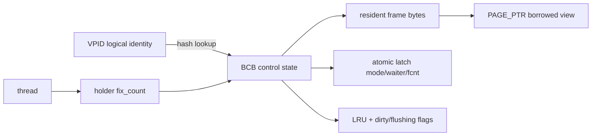

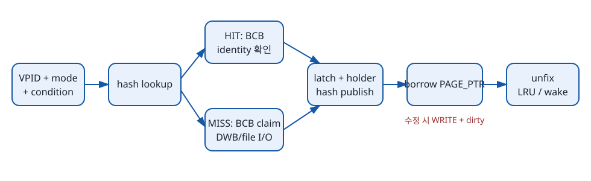

| Object | Owner | Lifetime | 핵심 guard |
|---|---|---|---|
| VPID | storage | logical page 생명 | allocation/deallocation metadata |
| BCB | pool | initialize→finalize | hash/latch/fcnt/LRU |
| frame | BCB/pool | resident identity generation | no fix + victim eligibility |
| PAGE_PTR | caller가 borrow | successful fix→matching unfix | holder/fcnt |
| holder | thread | nested fixes | holder fix_count |

> [!warning] Use-after-unfix
> 같은 주소가 우연히 계속 readable해도 ownership은 끝났다. ordered fix가 내부에서 release/refix하면 `page_was_unfixed`가 old slot/pointer를 stale로 선언한다.

> [!speaker] 발표자 노트
> - 먼저 물을 질문: “PAGE_PTR가 C pointer면 왜 바로 보관하면 안 되나요?”
> - 손으로 따라갈 edge: VPID → BCB → frame → PAGE_PTR → unfix
> - failure branch: refix/reuse generation
> - 근거: CUBRID-C001, CUBRID-C003

---

## 2. `pgbuf_fix()` complete call flow

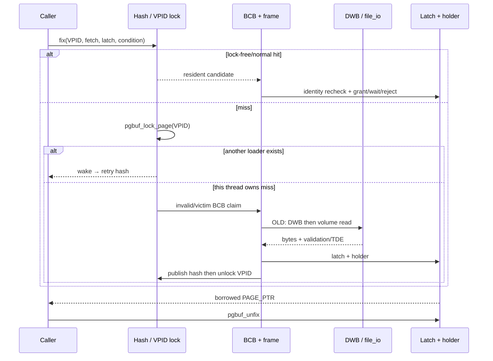

### 2.1 Entry and hit

- validate fetch/latch/condition;
- zero-wait transaction은 unconditional을 conditional로 demote할 수 있다;
- OLD-family + unconditional READ는 `pgbuf_lockfree_fix_ro()` fast path를 먼저 시도한다;
- normal hash hit는 BCB lock 뒤 VPID를 recheck하고 common latch/holder path로 간다.

> [!evidence] Revision correction
> 오래된 local spec의 “lock-free CAS 뒤 VPID 재검사”는 현재 source에 없다. 이 보고서는 그 단계를 그리지 않는다. positive READ `fcnt`가 victimization을 막는다는 safety premise는 구현된 post-CAS recheck가 아니라 별도 proof obligation이다.

### 2.2 Miss owner와 waiter

```mermaid
stateDiagram-v2
  [*] --> Absent
  Absent --> Loading: VPID buffer lock owner
  Absent --> Waiting: another loader owns VPID
  Waiting --> Absent: wake; retry lookup
  Loading --> ResidentFixed: read/init + validate + latch + hash publish
  Loading --> Invalid: I/O/decrypt/validation error + cleanup
  ResidentFixed --> ResidentUnfixed: last unfix
  ResidentUnfixed --> Invalid: clean LRU3 victim recheck
```

- duplicate loader serialization object는 BCB latch가 아니라 **VPID-keyed buffer lock**이다;
- waiter는 loader의 BCB를 직접 받지 않고 wake 후 hash lookup을 다시 한다;
- OLD page는 DWB를 먼저 보고 없으면 `fileio_read()`한다;
- NEW page는 disk read 없이 header/LSA를 initialize한다;
- newly loaded BCB는 latch/holder 성공 뒤 hash에 publish된다.

### 2.3 Cold/warm runtime card

| Question | Observation | Interpretation | Alternative | Not proven |
|---|---|---|---|---|
| same scan cold→warm? | first ioreads 38, second 0; checksum identical | miss/load와 resident-hit halves exercised | catalog work, OS cache, prefetch | exact VPID, DWB-vs-volume, latency |

> [!tip] Surprising moment — `ioreads` ≠ physical disk I/O
> `Num_data_page_ioreads`는 `page_buffer.c:8497`에서 **DWB/main-volume source를 고르기 전에** 증가한다. 이후 `dwb_read_page()`가 error면 반환하고, image를 찾으면 DWB copy를 쓰며, error가 아닌 miss이면 `fileio_read()`로 내려간다. 따라서 `+1`은 old-page miss read attempt이지 storage device 완료 횟수가 아니다.

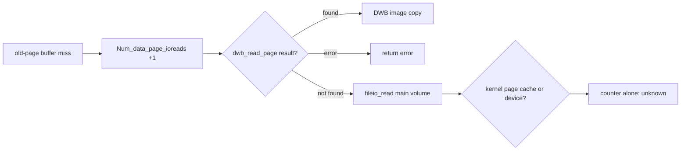

| Counter에서 보이는 것 | Counter만으로 보이지 않는 것 |
|---|---|
| miss read attempt의 aggregate 수 | exact VPID 목록 |
| 두 번째 scan의 추가 old-page read attempt가 0 | 모든 frame이 전체 시간 동안 resident였는지 |
| page-buffer miss/load branch 진입 | DWB와 main volume 중 실제 source |
| `fileio_read()`로 내려갈 가능성 | kernel page cache와 physical device 중 실제 공급자 |

발표용 한 줄: **“이 counter는 buffer-pool miss의 read 시도를 세지, disk arm이 움직인 횟수를 세지 않는다.”**

> [!speaker] 발표자 노트
> - prediction: “OS cache가 warm이면 CUBRID miss가 아닌가?”
> - 답의 핵: CUBRID buffer residency와 device/OS latency는 다른 layer다.
> - failure edge: no victim, read/decrypt failure, conditional latch reject
> - 근거: CUBRID-C001/C005, experiment-1

---

## 3. Latch, holder, wait, unfix

| Existing | Request | Result |
|---|---|---|
| NO_LATCH | READ/WRITE | grant, fcnt=1, holder |
| READ, no waiter | new READ | shared grant |
| READ + waiter | new reader | no barging; existing holder reentry만 허용 |
| sole READ holder | promote WRITE | in-place promotion |
| multiple READ holders | promote WRITE | conditional fail; unconditional drops own reads and queues front |
| incompatible | READ/WRITE | conditional reject or timed wait |

### 3.1 두 회계가 필요한 이유

- **BCB global fcnt**: frame이 replacement될 수 있는가?
- **thread holder fix_count**: 이 thread가 nested fixes를 몇 번 release해야 하는가?
- **latch mode/waiter bit**: content access compatibility와 queue policy는 무엇인가?

> [!warning] Rare allocation failure — CUBRID-C012
> Lock-free READ뿐 아니라 normal idle/compatible/blocked grant도 latch/fcnt commit 뒤 새 thread-holder allocation이 실패하면 assert하고 NULL/ER_FAILED를 반환하지만 committed state를 backout하지 않는다. Hardened reimplementation은 holder reserve-first 또는 explicit latch/fcnt rollback을 사용한다.

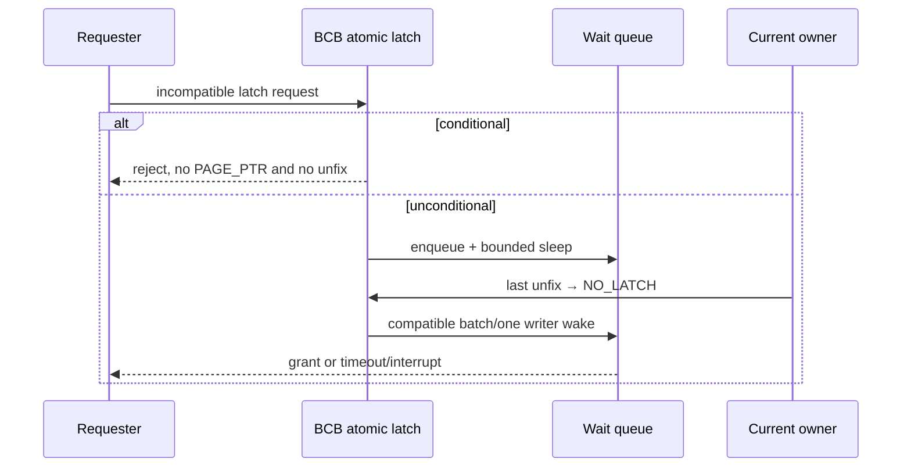

### 3.2 `pgbuf_unfix()` checklist

1. PAGE_PTR에서 BCB를 찾고 current thread holder를 검증한다.
2. holder nested count를 낮추거나 제거한다.
3. fast path 또는 full path로 global fcnt를 낮춘다.
4. 마지막 fix면 NO_LATCH로 전환한다.
5. LRU insert/boost/direct-victim handoff를 판단한다.
6. waiter를 깨우고 deferred async flush request를 처리한다.

> [!warning] 네 개의 다른 말
> **unfix**는 borrowed ownership 종료, **flush**는 page image write, **commit**은 transaction durability/visibility boundary, **eviction**은 identity/frame reassignment다.

Runtime에서 empty read는 promotions 0, 10000-row insert는 detailed `Num_data_page_promote_ext` success 689, dirty calls 102125, HOLDER_DIRTY WRITE/MIXED unfix를 보였다. 같은 출력의 derived `Data_page_total_promote_success=69589.00`은 oracle로 사용하지 않았다. actual competing latch waiter는 실행하지 않았다.

---

## 4. Callers make correctness

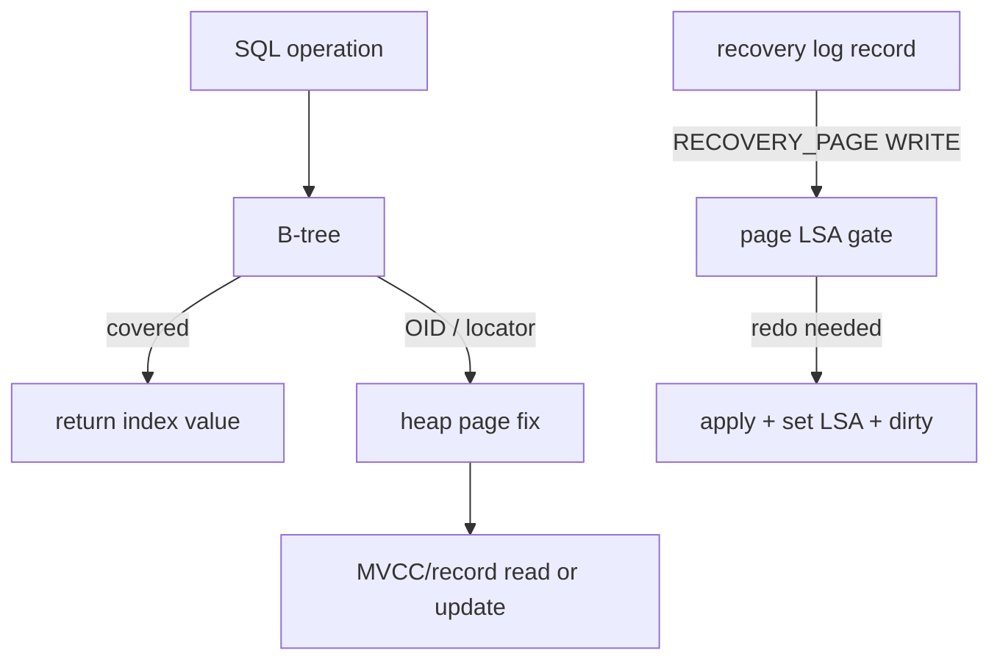

| Caller | Ordering | Mutation | Cleanup |
|---|---|---|---|
| heap | watcher group/rank/VPID ordered fix | WRITE + dirty | inspect `page_was_unfixed`, ordered unfix |
| B-tree | parent→child latch coupling | structure-specific | parent release; conditional sibling/restart branches |
| recovery undo | OLD_PAGE WRITE | undo/CLR | plain unfix |
| recovery redo | RECOVERY_PAGE WRITE | LSA check/apply/dirty | already-applied skip or cleanup |

Experiment 3:

- covered PK range: `Num_btree_covered=100`, noncovered 0;
- payload query: noncovered 100 + heap fix family;
- update: 300 dirty calls + heap HOLDER_DIRTY WRITE.

> [!speaker] 발표자 노트
> - 질문: “transaction lock이 있으면 page latch가 왜 필요한가?”
> - strong answer: transaction lock은 logical conflict/visibility, page latch는 in-memory bytes/structure consistency.
> - 근거: CUBRID-C003/C007

---

## 5. Dirty → WAL → data → replacement

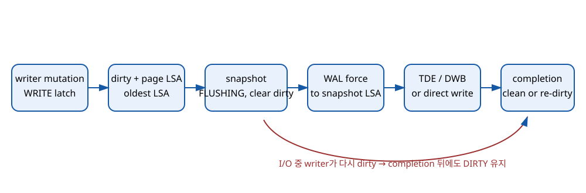

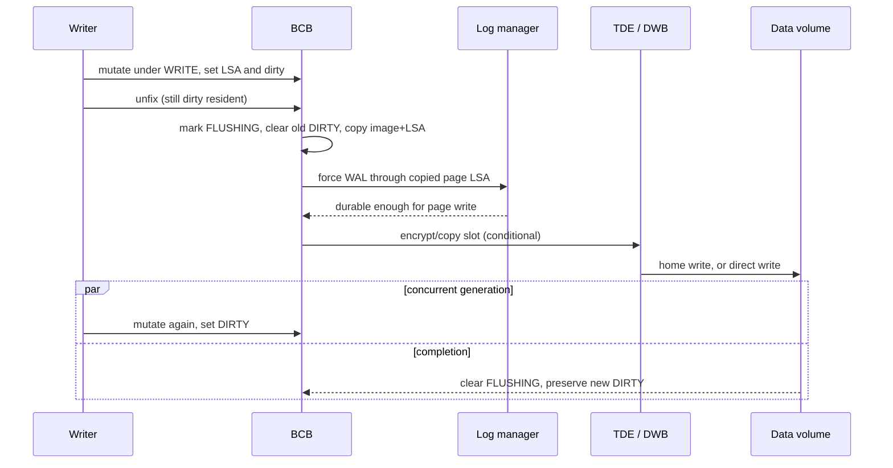

### 5.1 Three moments

| Moment | State | Crash intuition |
|---|---|---|
| memory mutation | resident bytes newest, dirty | not durable |
| WAL gate | redo through copied page LSA durable | old data image recoverable by redo |
| page write completion | copied image submitted/completed | resident may already be re-dirty |

### 5.2 Victim decision

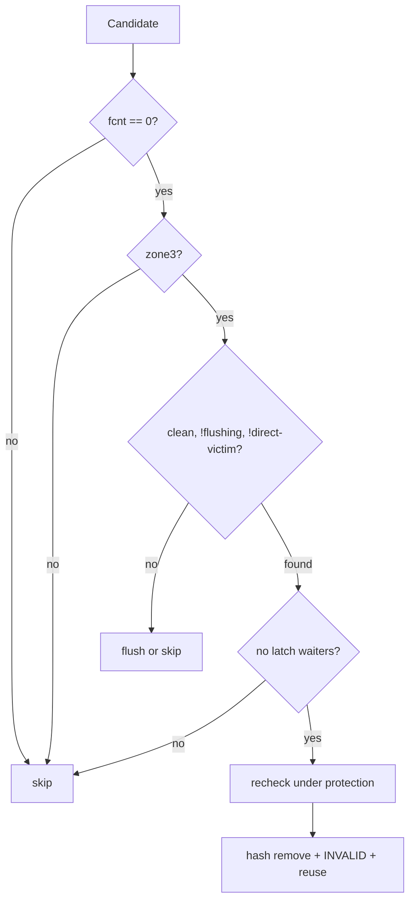

- eligibility는 hard safety predicate;
- LRU1/LRU2/LRU3와 private/shared quota는 selection policy;
- invalid list→victim search→direct-victim/flush pressure가 progress path다;
- clean eviction은 직전 flush를 요구하지 않는다.

> [!warning] Runtime boundary
> Experiment 4는 10000-row update, generation checksum, 58430 dirty-setting calls와 owned backup success를 확인했다. `rebind-exp4`의 per-session log append/WAL/data-page iowrite counters는 0이므로 per-page WAL ordering과 actual eviction은 source-only다. `rebind-backup-scratch-cleanup`이 owned temporary backup directory의 제거와 부재를 검증했다.

---

## 6. PostgreSQL / InnoDB: same axes, different seams

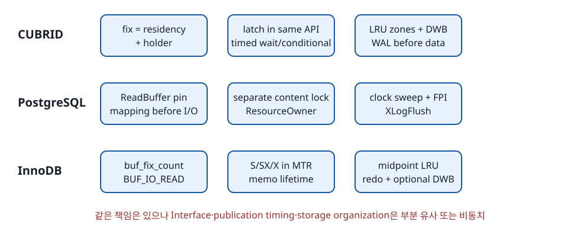

| Axis | CUBRID | PostgreSQL | InnoDB | Verdict |
|---|---|---|---|---|
| miss identity/publication (`CMP-C001`) | latch 후 resident hash | invalid mapping before I/O | BUF_IO_READ before I/O | partial analogy |
| ownership lifetime (`CMP-C002`) | fcnt + holder | shared/private pin + ResourceOwner | buf_fix_count + MTR memo | partial analogy |
| content latch/release (`CMP-C005`) | fix latch + unfix | separate content lock + pin release | MTR reverse release | partial analogy |
| index→row (`CMP-C003`) | B-tree→heap page | nbtree TID→heap | clustered leaf=row | no equivalent |
| WAL/redo gate (`CMP-C004`) | page LSA까지 WAL force | page LSN까지 WAL flush | newest LSN까지 redo persist | partial analogy |
| torn-page defense (`CMP-C006`) | DWB | WAL full-page image | doublewrite | partial analogy |
| replacement (`CMP-C007`) | LRU zones/private/shared | clock sweep | midpoint old/new LRU | partial analogy |
| dirty generation (`CMP-C008`) | DIRTY + oldest-unflush-LSA | BM_DIRTY + page LSN | oldest/newest LSN + flush list | partial analogy |
| checkpoint/flush (`CMP-C009`) | LSA-bounded checkpoint | BufferSync | flush-list LSN limit | partial analogy |
| startup recovery (`CMP-C010`) | boot restart + recovery fetch | StartupXLOG | recv recovery | partial analogy |
| error/resource pressure (`CUBRID-C010,C012`; `PG-C001,C004`; `MYSQL-C001,C004`) | C error/timeout/direct-victim와 rare committed-accounting exception | all-pinned ERROR, I/O state, ResourceOwner cleanup | LRU scan→cleaner/single flush→wait, read/corruption error | partial analogy |
| configuration/observability (`CUBRID-C005..008`; `PG-C004`; `MYSQL-C004`) | data buffer/latch/LRU/flush knobs; histogram/statdump | shared_buffers, I/O/bgwriter/checkpoint GUC; pg_stat_io/waits | pool/I/O/dirty/LRU knobs; status/INNODB_METRICS | partial analogy |
| performance trade-offs (`CUBRID-C004,C005`; `PG-C004`; `MYSQL-C004`; `CMP-C007`) | hash/CAS, LRU zones, proactive cleaning | private pins, clock sweep/rings, paced writes | per-instance midpoint LRU, cleaner budget | partial analogy |

> [!speaker] 발표자 노트
> 함수명을 1:1로 연결하지 말고 responsibility, Interface, invariant 세 문장을 말한다.

---

## 7. Source references to keep open during Q&A

- CUBRID public fetch/latch/watcher contract: `src/storage/page_buffer.h:172–249`
- CUBRID fix/load: `src/storage/page_buffer.c:2260–2685, 8392–8634`
- CUBRID latch/unfix/timed wait: `page_buffer.c:3062–3201, 6277–6883, 7281–7590, 7724–7773`
- CUBRID dirty/flush/victim exception: `page_buffer.c:9314–9538, 10723–10962, 16262–16296`
- WAL gate: `src/transaction/log_page_buffer.c:4150–4189`
- heap ordered ownership: `src/storage/page_buffer.c:12249–13063`; `src/storage/heap_file.c:25543–25625`
- B-tree traversal/restart: `src/storage/btree.c:16867–17013, 23734–24089`
- recovery physical undo/redo: `src/transaction/log_recovery.c:150–408, 6399–6431`
- runtime counter sites: `page_buffer.c:8497` (ioread), `:3049` (promotion), `:11674` (dirty-setting call), `:4167` (`Num_data_page_flushed`, victim candidates only); `perf_monitor.c:213` (name mapping); `scan_manager.c:6693,6757` (noncovered/covered rows)
- PostgreSQL: `bufmgr.c:2177–2351, 2548–2681, 3170–3250, 3575–3845, 4509–4642, 7289–7445`; `freelist.c:169–321`; `xloginsert.c:612–880`; `guc_parameters.dat:311–855,1408–1414,2714–2723`; `pgstatfuncs.c:1370–1455`
- InnoDB: `buf0buf.cc:3696–3745, 4295–4505`; `mtr0mtr.cc:243–296`; `buf0flu.cc:943–1038, 1834–1905`; `buf0dblwr.cc:2525–2660`; `buf0lru.cc:493–680`; `ha_innodb.cc:22231–22391,22522–22687,23090–23100`; `srv0srv.cc:1562–1631`; `srv0mon.cc:225–570,1627–1646`

---

## 8. Presenter runbook (50–60분)

| Time | Screen | Prediction question |
|---|---|---|
| 0–4 | 한 줄 `pgbuf_fix()` | 성공 전에 무엇을 증명해야 하나? |
| 4–10 | object graph | PAGE_PTR의 owner는 누구인가? |
| 10–20 | hit/miss sequence | same VPID 두 miss를 무엇이 막나? |
| 20–30 | latch/holder/unfix | hit도 왜 block하나? |
| 30–37 | callers | caller가 그냥 retry 못 하는 이유는? |
| 37–47 | dirty/WAL/replacement | unfix 직후 무엇이 durable한가? |
| 47–52 | three DBs | partial과 no-equivalent를 나눠라 |
| 52–56 | experiments | observation이 증명하지 못한 것은? |
| 56–60 | blueprint | source 없이 어떤 invariant/test로 만들까? |

> [!speaker] 공통 presenter note
> - 한 문장 요점부터 말한다.
> - diagram에서 state mutation edge를 손으로 따라간다.
> - happy path 뒤 retry와 failure edge를 하나씩 말한다.
> - Claim/Experiment의 evidence limit를 끝에 붙인다.

---

## 9. Difficult teammate questions

1. Same cold VPID의 duplicate read와 duplicate published frame을 각각 무엇이 막는가?
2. Buffer hit 뒤에도 latch timeout이 가능한 이유는?
3. Global fcnt와 holder fix_count 중 하나만 있으면 어떤 bug가 생기는가?
4. waiter가 있을 때 new reader barging을 막되 holder reentry를 허용하는 trade-off는?
5. Conditional rejection과 timed wait expiration은 caller contract상 같은가?
6. Ordered refix 뒤 old record slot을 쓰면 어떤 stale-state bug가 가능한가?
7. Descending sibling traversal이 unconditional wait 대신 abort/restart를 택하는 이유는?
8. RECOVERY_PAGE가 allocation metadata를 우회해야 하는 이유는?
9. Dirty, page LSA, oldest-unflush-LSA는 각각 어떤 질문에 답하는가?
10. Flush가 old dirty를 clear하고 FLUSHING을 set하는 이유는?
11. WAL force 뒤 data write failure에서 어떤 state를 restore해야 하는가?
12. DWB가 WAL rule을 대체하지 못하는 이유는?
13. Flush success 직후 resident BCB가 dirty인 interleaving을 설명하라.
14. fcnt=0이고 clean이어도 victim이 아닌 반례 세 가지는?
15. `Num_data_page_flushed=0`이 checkpoint failure가 아닌 이유는?
16. Clean restart가 WAL-before-data를 증명하지 못하는 이유는?
17. PostgreSQL pin/content lock을 CUBRID fix/latch와 equivalent라 부르면 무엇을 잃는가?
18. InnoDB secondary→clustered traversal이 B-tree→heap handoff의 직접 대응물이 아닌 이유는?
19. I/O-before-publication과 publication-before-I/O의 waiter/failure cost를 비교하라.
20. 현재 가장 위험한 unknown 하나와 최소 focused test를 제안하라.

### Model / recommended answer key

| # | Model / recommended answer |
|---:|---|
| 1 | VPID-keyed buffer lock이 cold loader를 하나로 만들고 owner만 load·publish한다. Waiter는 hash lookup부터 재시도하므로 duplicate published frame도 막힌다. |
| 2 | Hit은 residency만 보장한다. Incompatible latch가 남으면 unconditional request는 waiter queue와 bounded timed sleep에 들어가 timeout/interrupt될 수 있다. |
| 3 | Global fcnt는 모든 fixes를 합산해 replacement를 막고, holder는 thread별 nested ownership/reentry/dirty history를 기록한다. 하나만 있으면 global victim safety 또는 caller ownership 검증을 잃는다. |
| 4 | waiter bit로 새 non-holder reader barging을 막되 existing holder reentry를 허용해 writer progress와 self-deadlock 회피를 절충한다. |
| 5 | Conditional은 queue 없이 즉시 실패한다. Timed wait는 waiter 등록 뒤 timeout/interrupt cleanup과 error를 거친다. |
| 6 | Ordered refix는 unfix/refix할 수 있으므로 old PAGE_PTR/slot/record pointer가 stale하다. Identity와 record lookup을 다시 검증한다. |
| 7 | Descending conditional fix는 역방향 latch wait를 피하고 conflict에서 held pages를 푼 뒤 scan을 재시작한다. |
| 8 | Recovery는 allocation metadata 자체를 재생 중이므로 normal OLD-page 존재 전제를 우회할 fetch mode가 필요하다. |
| 9 | DIRTY=current memory debt, page LSA=image가 포함한 log 상한, oldest-unflush-LSA=flush debt가 시작된 시점이다. |
| 10 | Old DIRTY clear+FLUSHING은 snapshot G와 I/O 중 새 re-dirty G+1을 분리해 G+1을 잃지 않게 한다. |
| 11 | 일반 failure는 FLUSHING을 끝내고 pre-flush DIRTY와 oldest LSA를 복원해야 retry 가능하다. 조기 TDE/DWB 오류는 focused test 대상이다. |
| 12 | DWB는 torn data write를 막지만 durable redo/undo log 부재를 고치지 못하므로 WAL을 대체하지 않는다. |
| 13 | G snapshot 뒤 writer가 G+1을 re-dirty하면 G write success 후에도 current BCB DIRTY는 남는다. |
| 14 | LRU1/2처럼 zone3 밖, waiter/비-NO_LATCH state, FLUSHING/direct-victim flag는 clean+fcnt=0이어도 victim을 막는다. Avoid-deallocation은 vacuum deallocation용이며 victimization을 막지 않는다. |
| 15 | `Num_data_page_flushed`는 victim-candidate site counter이지 모든 checkpoint flush의 합이 아니다. 0은 checkpoint failure가 아니다. |
| 16 | Clean restart는 최종 복구 가능성만 보며 개별 WAL→data I/O 순서를 관찰하지 않는다. |
| 17 | CUBRID는 holder/latch/fcnt를 결합하고 PostgreSQL은 private/shared pin과 content lock을 분리하므로 partial analogy다. |
| 18 | InnoDB base row는 clustered index+MTR에 있고 CUBRID는 B-tree OID→별도 heap이므로 직접 equivalent가 아니다. |
| 19 | CUBRID는 load+latch 뒤 publish하고, PostgreSQL/InnoDB는 I/O-in-progress mapping을 먼저 publish한다. Waiter convergence와 failure cleanup 비용이 다르다. |
| 20 | 위험한 unknown은 TDE/DWB 조기 오류의 DIRTY/FLUSHING/oldest-LSA state다. Callee failure injection 뒤 retry/victim/restart invariants를 검사한다. |

---

## 10. Source-closed reimplementation checklist

- [ ] PageId와 frame identity generation을 분리했다.
- [ ] Concurrent miss 하나만 publish하는 invariant가 있다.
- [ ] Hardened mode의 hit/miss는 pin/latch failure unwind를 갖는다. Strict-compatibility mode는 C010/C012 exceptions를 문서화한다.
- [ ] Borrowed handle은 release 후 dereference를 detect한다.
- [ ] Conditional, blocking, timeout/interrupt semantics가 명시적이다.
- [ ] Multi-page order와 restart seam이 caller contract에 있다.
- [ ] Dirty generation과 flush snapshot generation이 분리된다.
- [ ] WAL-before-data fault test가 있다.
- [ ] I/O failure가 dirty/oldest LSA/waiter state를 복구한다.
- [ ] Eligibility predicate와 replacement policy가 분리된다.
- [ ] No-victim progress/failure가 bounded하다.
- [ ] Counters는 increment site와 함께 정의된다.

### Source-confirmed behavior와 evidence boundaries

- 현재 source에는 lock-free READ fast path의 post-CAS VPID recheck가 없다. 재구현 blueprint는 이 최적화를 필수 semantic contract로 취급하지 않고 locked fallback 또는 post-CAS backout을 쓴다.
- DWB read direct return, TDE/DWB-slot early return, async-unfix error clearing은 source-confirmed current behavior다. 재구현은 `strict-compatibility` 또는 `hardened-rollback` mode를 선택해 명시한다.
- Normal idle/compatible/blocked grant와 lock-free READ의 holder allocation failure는 committed latch/fcnt를 backout하지 않는 source-confirmed behavior다. Hardened mode는 holder를 먼저 reserve하거나 latch/fcnt를 명시적으로 되돌린다.
- SQL experiments는 actual latch contention과 physical eviction을 식별하지 않았다. 이는 runtime 관찰 한계이며 source-derived lifecycle rule을 미정으로 만들지 않는다.
- 대표 heap/B-tree/recovery family를 깊게 추적했다. 모든 transitive caller의 전수 catalog, strict timing/fairness와 performance parity는 declared scope 밖이다.

> [!tip] 최종 teach-back
> VPID→hit/miss→latch/holder→PAGE_PTR→caller mutation→dirty/LSA→unfix→WAL/DWB/data→clean victim을 8분에 설명하되, retry 하나, failure 하나, experiment limitation 하나, PG/InnoDB non-equivalence 하나를 반드시 포함한다.
