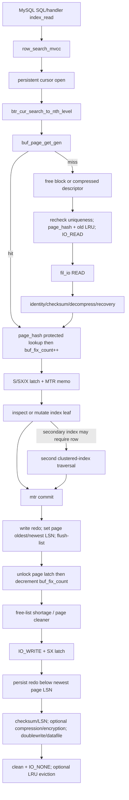
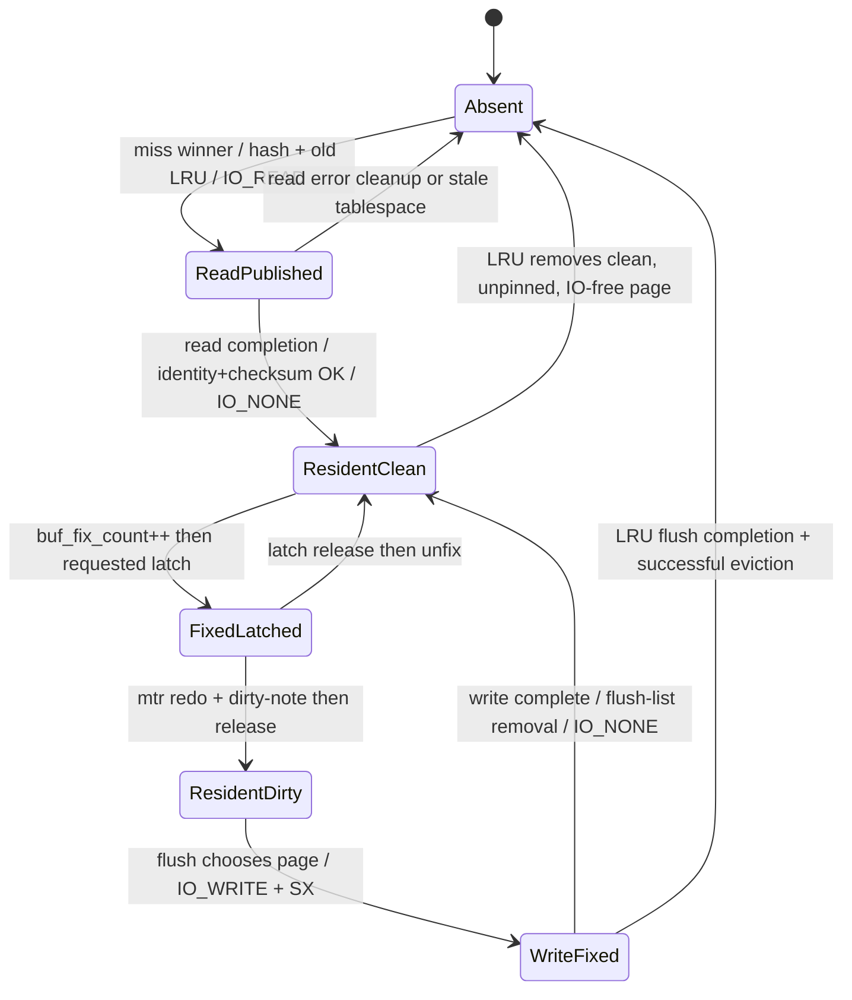

# MySQL/InnoDB page-buffer comparison evidence packet

## Packet identity

| Field | Value |
|---|---|
| Role | Role 3 — MySQL/InnoDB Comparator |
| Topic | CUBRID `pgbuf_fix()` lifecycle의 nearest InnoDB mechanisms: fix–lookup–load, latch–holder–unfix, caller contracts, dirty–WAL–flush–replace |
| Frozen scope | `research/scope.md` |
| Scope SHA-256 | `796828eab6754ed60bd88d65be34913c7d510e61b61d9a06e73f5340faae2d08` |
| MySQL source root | `/home/vimkim/gh/mysql/mysql-server` |
| Revision | `06a5c1c99c377fc41b2eba1ea244e8b220bdc3c8` (`trunk`) |
| Commit timestamp | `2026-07-28T10:14:16+02:00` |
| Remote | `https://github.com/mysql/mysql-server` |
| Evidence timestamp | `2026-08-28T16:33:18+09:00` |
| Worktree state | clean; status, worktree diff, index diff SHA-256가 모두 `e3b0c44298fc1c149afbf4c8996fb92427ae41e4649b934ca495991b7852b855` |
| Runtime evidence | 없음. Frozen scope에 따라 MySQL server/engine은 실행하지 않았다. |

이 packet의 구현 사실은 위 pinned commit의 `storage/innobase` source에만 적용한다. SQL server 전체를 하나의 storage implementation처럼 부르지 않고, 실제 page-cache 책임자인 **InnoDB buffer pool**을 비교 대상으로 삼는다.

## Bottom line

InnoDB에서 `pgbuf_fix()`에 가장 가까운 단일 진입점은 `buf_page_get_gen()`이다. 그러나 두 Interface는 동치가 아니다. InnoDB 호출자는 `(space_id, page_no)`인 `page_id_t`, page size, `Page_fetch` policy, S/SX/X/no-latch mode와 활성 `mtr_t`를 넘긴다. 성공하면 naked frame pointer가 아니라 `buf_block_t *`를 받고, buffer-fix와 page latch가 MTR memo의 lifetime에 결합된다. Miss에서는 free frame 또는 compressed-page descriptor를 확보하고 page hash uniqueness를 다시 확인한 뒤 `BUF_IO_READ` 상태로 publish하고, synchronous file read, identity/checksum 검증 및 recovery hook을 거쳐 read I/O fix를 해제한다. [MYSQL-C001]

SQL layer와 buffer pool 사이에는 직접 seam이 없다. `ha_innobase::index_read()`가 InnoDB row layer의 `row_search_mvcc()`를 호출하고, persistent cursor와 B-tree descent가 `buf_page_get_gen()`을 호출한다. 더욱 중요한 semantic gap은 InnoDB clustered-index leaf 자체가 row store라는 점이다. Secondary-index access가 clustered index를 다시 찾을 수는 있지만 CUBRID scenario의 “B-tree에서 heap record page로 handoff”와 같은 별도 heap-file page access는 없다. [MYSQL-C003]

Dirty lifecycle도 MTR과 결합된다. MTR commit이 redo를 작성하고 dirty-page LSN/flush-list metadata를 기록한 뒤 latch/fix를 해제한다. Flush는 page를 `BUF_IO_WRITE`로 고정하고 SX latch를 얻어 writer를 배제한 다음 page의 newest LSN보다 앞선 redo를 먼저 persist하고, checksum/page LSN 준비 후 doublewrite/encryption/datafile path로 보낸다. Completion은 flush-list membership과 write I/O fix를 제거하며, LRU flush이면 eviction까지 이어질 수 있다. [MYSQL-C004]

## Shared scenario reconstructed for InnoDB

Frozen scope의 scenario를 InnoDB에 맞게 번역하면 다음과 같다.



Diagram caveat: `LEAF -> CLUST` is conditional. A clustered-index lookup already reads the row; a covering secondary-index lookup may not need the clustered lookup. There is no InnoDB heap-page node corresponding to CUBRID heap storage. [MYSQL-C003]

### Read worker: lookup, miss, load, latch, release

```text
ha_innobase::index_read
  -> row_search_mvcc
     -> btr_pcur_t::open_no_init
        -> btr_cur_search_to_nth_level
           -> buf_page_get_gen(page_id, page_size, rw_latch, fetch_mode, mtr)
              -> Buf_fetch<T>::single_page
                 -> Buf_fetch_normal::get
                    -> Buf_fetch<T>::lookup
                       [hit] buf_block_fix while page_hash S latch is held
                       [miss] Buf_fetch<T>::read_page
                          -> buf_read_page
                             -> buf_read_page_low
                                -> buf_page_init_for_read
                                   -> buf_LRU_get_free_block
                                   -> page_hash X recheck
                                   -> hash/LRU publication + BUF_IO_READ
                                -> fil_io(READ)
                                   -> buf_page_io_complete
                                      -> identity/checksum/decompress/recovery
                                      -> BUF_IO_NONE + release IO x-latch
                 -> buf_wait_for_read
                 -> Buf_fetch<T>::mtr_add_page
                    -> requested page latch + MTR memo record
     -> mtr_commit
        -> release memo entries in reverse order
           -> page-latch unlock
           -> buf_block_unfix
```

The `buf_page_init_for_read()` duplicate recheck matters: allocation occurs before the page-hash X latch, so another worker can win the same miss race. The loser discards its unused descriptor/frame and retries through lookup rather than publishing a second owner for the same `page_id_t`. [MYSQL-C001]

### Write worker: mutate, dirty, WAL, flush, eviction

```text
X/SX-fixed index page mutation under mtr
  -> mtr_t::Command::execute
     -> prepare_write/write redo
     -> Process_dirty_blocks over MTR memo
     -> Pages_persistence::mtr_has_dirtied_pages
        -> buf_flush_note_modification
           -> newest_lsn = mtr end_lsn
           -> first dirtier sets oldest_lsn and inserts flush_list
     -> release_all: latch unlock, then buffer unfix

page cleaner / LRU pressure
  -> buf_flush_page
     -> require flush eligibility
     -> set BUF_IO_WRITE + flush_type
     -> acquire page SX latch (nowait or eventual blocking for flush-list case)
     -> buf_flush_write_block_low
        -> redo persist_smaller_than(page.newest_lsn)
        -> write page LSN/checksum/compression image
        -> dblwr::write
           -> optional encryption; same encrypted bytes for doublewrite and datafile
           -> or direct datafile path where DWB is disabled/not applicable
  -> fil_io completion
     -> buf_page_io_complete
        -> buf_flush_write_complete
           -> remove flush_list; set IO_NONE
        -> release SX latch
        -> LRU flush may buf_LRU_free_page
```

`Process_dirty_blocks`는 X/SX-fixed page를 modified로 간주하므로 source comment가 명시하듯 false positive가 가능하다. 따라서 “dirty list에 들어갔다”를 반드시 user payload byte가 변경되었다는 뜻으로 설명하면 안 된다. [MYSQL-C004]

## Data, ownership, lifetime, and states

| Axis | InnoDB mechanism | Ownership/lifetime consequence | Evidence |
|---|---|---|---|
| Page identity | `page_id_t(space_id, page_no)` | Buffer-pool instance and hash bucket selection의 stable logical key다. Tablespace reference는 `buf_page_t` lifetime에 붙는다. | `include/buf0types.h:190-234`; `include/buf0buf.h:1268-1330,1371-1405` [MYSQL-C001] |
| Control + frame | `buf_page_t` is first member of `buf_block_t`; block also owns page `rw_lock_t` and aligned frame | Caller receives `buf_block_t *`; frame access does not transfer ownership. Frame/descriptor may only be relocated after no I/O fix and zero buffer-fix count. | `include/buf0buf.h:1755-1783`; `include/buf0buf.ic:501-512` [MYSQL-C001][MYSQL-C002] |
| Pin | atomic `buf_fix_count` | Hash lookup pins before dropping page-hash protection. Unfix decrements; reaching zero only makes the block potentially replaceable—it does not itself evict it. | `buf/buf0buf.cc:3709-3745`; `include/buf0buf.ic:755-817`; `buf/buf0flu.cc:476-497` [MYSQL-C001][MYSQL-C002] |
| Page latch | `buf_block_t::lock`, modes S/SX/X/no latch | Requested latch and pin are recorded as one MTR memo item. MTR controls release lifetime; the page latch is not a transaction row lock. | `buf/buf0buf.cc:4148-4180`; `mtr/mtr0mtr.cc:243-296` [MYSQL-C002] |
| Read I/O state | `io_fix = BUF_IO_READ` plus pass-type X latch | Miss owner publishes a placeholder before I/O. Readers find the same block and wait for read completion rather than duplicating it. Completion validates and clears IO state. | `buf/buf0buf.cc:4876-5079,5731-5963` [MYSQL-C001] |
| Dirty state | `oldest_modification > 0`; `newest_modification` is latest modifying MTR end LSN | First dirty transition inserts flush list; oldest LSN is replacement/checkpoint age, newest LSN is the WAL-before-page target. Clean removal resets flush metadata. | `include/buf0buf.h:1350-1369`; `include/buf0flu.ic:54-115`; `buf/buf0flu.cc:385-474,573-632` [MYSQL-C004] |
| Write I/O state | `io_fix = BUF_IO_WRITE` plus page SX latch | Prevents relocation and concurrent writers while preserving read concurrency compatible with SX. Completion clears dirty/IO state and may evict. | `buf/buf0flu.cc:1040-1167`; `buf/buf0buf.cc:5888-5998` [MYSQL-C004] |
| Replacement policy | per-instance free list + midpoint LRU old/new + optional `unzip_LRU` | Newly read pages enter old region. Delayed promotion protects the hot region from scan pollution; compressed frame pressure has another policy dimension. | `buf/buf0lru.cc:854-928`; sysvars at `handler/ha_innodb.cc:23090-23100` [MYSQL-C004] |

Suggested state vocabulary for the final comparison (not a claim of enum-to-enum identity):



Compressed-only `BUF_BLOCK_ZIP_PAGE`/`BUF_BLOCK_ZIP_DIRTY`, stale/discard, watch sentinel, memory-only pages and resize withdrawal add real states omitted from this teaching projection. [MYSQL-C001][MYSQL-C004]

## Claim candidates

The parent report should copy these as source-only claims and set final `report_locations`. Every cited file matched the pinned commit when this packet was produced.

### MYSQL-C001 — fix, lookup, miss publication, load, validation

- `database`: `mysql`
- `revision`: `06a5c1c99c377fc41b2eba1ea244e8b220bdc3c8`
- `kind`: `source`
- `confidence`: `SOURCE-CONFIRMED`
- `claim_ko`: InnoDB의 normal page fetch는 `page_id_t`로 page hash를 S-lock 아래 조회하고, hit이면 hash 보호를 놓기 전에 atomic `buf_fix_count`를 증가시킨다. Miss winner는 free block 또는 compressed descriptor를 확보한 뒤 page-hash X-lock 아래 동일 page가 아직 없는지 재검사하고, page hash와 LRU old region에 page를 publish하며 `BUF_IO_READ`를 설정한다. `fil_io()` read completion은 page identity와 checksum을 검사하고 필요하면 recovery를 적용한 후 `BUF_IO_READ`와 I/O용 X latch를 해제한다. `Buf_fetch<T>::single_page()`는 read completion을 기다리고 요청 latch를 획득하여 MTR memo에 등록한 `buf_block_t *`를 반환한다.
- `axes`: boundary/interface; identity/ownership/lifetime; state transitions; concurrency; recovery; resource pressure; performance
- `runtime_run_ids`: `[]`
- `report_locations`: `[]`
- `limitations_ko`: normal uncompressed path를 중심으로 한 source reconstruction이다. Compressed-only page, watch sentinel, change buffer의 IF_IN_POOL fallback, stale/discard, tablespace drop와 forced-recovery의 세부 오류 정책은 조사했지만 claim 본문에서는 대표 분기만 요약했다. MySQL runtime은 실행하지 않았다.

| Path | Symbol | Lines | File SHA-256 | State |
|---|---|---:|---|---|
| `storage/innobase/buf/buf0buf.cc` | `Buf_fetch_normal::get` | 3709-3745 | `a3e11712993f0542f1e173d08c047637aaeb63293cdf9b0c139dbb593a38e793` | COMMIT |
| `storage/innobase/buf/buf0buf.cc` | `Buf_fetch<T>::lookup` | 3822-3871 | `a3e11712993f0542f1e173d08c047637aaeb63293cdf9b0c139dbb593a38e793` | COMMIT |
| `storage/innobase/buf/buf0buf.cc` | `Buf_fetch<T>::single_page` | 4294-4443 | `a3e11712993f0542f1e173d08c047637aaeb63293cdf9b0c139dbb593a38e793` | COMMIT |
| `storage/innobase/buf/buf0buf.cc` | `buf_page_get_gen` | 4445-4510 | `a3e11712993f0542f1e173d08c047637aaeb63293cdf9b0c139dbb593a38e793` | COMMIT |
| `storage/innobase/buf/buf0buf.cc` | `buf_page_init_for_read` | 4876-5079 | `a3e11712993f0542f1e173d08c047637aaeb63293cdf9b0c139dbb593a38e793` | COMMIT |
| `storage/innobase/buf/buf0rea.cc` | `buf_read_page_low` | 66-140 | `57b8b4cf748ad8cdf014b10556f8c78f7aa90b3e938819897fe0e599c74a1522` | COMMIT |
| `storage/innobase/buf/buf0buf.cc` | `buf_page_io_complete` | 5731-5998 | `a3e11712993f0542f1e173d08c047637aaeb63293cdf9b0c139dbb593a38e793` | COMMIT |

### MYSQL-C002 — latch, MTR memo, conditional failure, unfix

- `database`: `mysql`
- `revision`: `06a5c1c99c377fc41b2eba1ea244e8b220bdc3c8`
- `kind`: `source`
- `confidence`: `SOURCE-CONFIRMED`
- `claim_ko`: 성공한 InnoDB fetch는 buffer-fix와 요청한 S/SX/X/no-latch mode를 활성 MTR의 memo entry로 결합한다. Normal fetch의 page latch API는 blocking이고 timeout/interruption status를 반환하지 않는다. 별도의 optimistic/known-nowait/try-get family는 latch를 즉시 얻지 못하거나 modify clock이 바뀌면 먼저 증가시킨 buffer-fix를 되돌리고 `false`/`nullptr`을 반환한다. MTR memo release는 역순으로 실행되며, block을 마지막으로 dereference하는 page-latch unlock을 먼저 수행한 뒤 `buf_fix_count`를 감소시킨다. Fix count가 0이 되어도 I/O-free/clean 여부와 replacement locks를 다시 만족해야 실제 eviction이 가능하다.
- `axes`: interface; ownership/lifetime; concurrency; state transitions; errors; resource pressure
- `runtime_run_ids`: `[]`
- `report_locations`: `[]`
- `limitations_ko`: “normal fetch에 timeout/interruption return이 없다”는 아래 negative-search 범위와 blocking wrapper signature에 한정한 source-negative 결론이다. Internal `rw_lock_t` waiter implementation의 전체 scheduling/fairness를 재구성한 claim이 아니며, CUBRID holder/waiter object와 직접 동치로 분류하면 안 된다.

| Path | Symbol | Lines | File SHA-256 | State |
|---|---|---:|---|---|
| `storage/innobase/buf/buf0buf.cc` | `Buf_fetch<T>::mtr_add_page` | 4148-4180 | `a3e11712993f0542f1e173d08c047637aaeb63293cdf9b0c139dbb593a38e793` | COMMIT |
| `storage/innobase/buf/buf0buf.cc` | `buf_page_optimistic_get` | 4512-4610 | `a3e11712993f0542f1e173d08c047637aaeb63293cdf9b0c139dbb593a38e793` | COMMIT |
| `storage/innobase/buf/buf0buf.cc` | `buf_page_get_known_nowait` | 4612-4703 | `a3e11712993f0542f1e173d08c047637aaeb63293cdf9b0c139dbb593a38e793` | COMMIT |
| `storage/innobase/buf/buf0buf.cc` | `buf_page_try_get` | 4705-4777 | `a3e11712993f0542f1e173d08c047637aaeb63293cdf9b0c139dbb593a38e793` | COMMIT |
| `storage/innobase/include/buf0buf.ic` | `buf_block_unfix` | 755-817 | `22dc77a73fb0a7863d98a15aba0a79966f0433e5e10e392cb4b2b19774861c1d` | COMMIT |
| `storage/innobase/include/buf0buf.ic` | `buf_page_release_latch` | 1054-1076 | `22dc77a73fb0a7863d98a15aba0a79966f0433e5e10e392cb4b2b19774861c1d` | COMMIT |
| `storage/innobase/mtr/mtr0mtr.cc` | `memo_slot_release` | 243-296 | `99f2b45824f87fede0c1979c2db78595cc57f2e1bd772a4dbd1f8b006d8065fc` | COMMIT |
| `storage/innobase/mtr/mtr0mtr.cc` | `mtr_t::Command::release_all` | 768-777 | `99f2b45824f87fede0c1979c2db78595cc57f2e1bd772a4dbd1f8b006d8065fc` | COMMIT |
| `storage/innobase/include/sync0rw.h` | `rw_lock_s_lock` | 637-700 | `5ee7d7ba1e59af9f5f5bf8609c6c7044423717bf35800744abacc0d8fc5aa219` | COMMIT |

### MYSQL-C003 — SQL/engine seam and B-tree caller contract

- `database`: `mysql`
- `revision`: `06a5c1c99c377fc41b2eba1ea244e8b220bdc3c8`
- `kind`: `source`
- `confidence`: `SOURCE-CONFIRMED`
- `claim_ko`: MySQL handler의 `ha_innobase::index_read()`는 InnoDB `row_search_mvcc()`로 들어가고, row layer가 persistent cursor를 열면 `btr_cur_search_to_nth_level()`이 root에서 leaf까지 `buf_page_get_gen()`으로 page를 fetch한다. Descent는 MTR savepoint로 upper-page latch/fix를 leaf 도착 시 해제하고 필요한 leaf protection을 MTR commit까지 유지한다. InnoDB internal clustered index는 user-defined key와 system columns뿐 아니라 index에 아직 포함되지 않은 모든 user table columns를 추가하므로 clustered leaf가 row store다. Secondary-index consistent read는 visibility/row materialization 때문에 clustered-index record를 다시 찾을 수 있지만, CUBRID B-tree-to-heap-page handoff와 같은 별도 heap-file fetch는 없다.
- `axes`: module boundary; caller obligations; identity/lifetime; concurrency; durability/recovery; semantic model; performance
- `runtime_run_ids`: `[]`
- `report_locations`: `[]`
- `limitations_ko`: 대표 `index_read`/MVCC B-tree lookup 경로를 고정했다. Full-text, spatial/R-tree, intrinsic/no-MVCC, adaptive-hash-only success, change-buffered modification과 every caller family는 이 claim의 중심이 아니다. “별도 heap-file fetch가 없다”는 InnoDB clustered-row organization에 관한 결론이며 MySQL의 MEMORY/CSV/MyISAM 등 다른 storage engine을 포함하지 않는다.

| Path | Symbol | Lines | File SHA-256 | State |
|---|---|---:|---|---|
| `storage/innobase/handler/ha_innodb.cc` | `ha_innobase::index_read` | 10455-10595 | `42e7ad557071037a82440c01e34740615663963711dd5691c9226d69a6ec4ea8` | COMMIT |
| `storage/innobase/row/row0sel.cc` | `row_search_mvcc` | 4437-5397 | `418edef00f0a8cba8875deac251f0581ceb98f16af99fac296eab2136b78aa1b` | COMMIT |
| `storage/innobase/include/btr0pcur.h` | `btr_pcur_t::open_no_init` | 598-627 | `6ba6c64c66da10c719cd10d0e1a541f568b4c8035f934b0f52fe59d4fb2005ed` | COMMIT |
| `storage/innobase/btr/btr0cur.cc` | `btr_cur_search_to_nth_level` | 618-1173 | `107f89e02adef0e504c02298f9d4d7cdfc6f4306094fdc5725f1193624e8b2de` | COMMIT |
| `storage/innobase/row/row0sel.cc` | `Row_sel_get_clust_rec_for_mysql` | 3143-3180 | `418edef00f0a8cba8875deac251f0581ceb98f16af99fac296eab2136b78aa1b` | COMMIT |
| `storage/innobase/dict/dict0dict.cc` | `dict_index_build_internal_clust` | 3024-3205 | `df5821177012072c52fa659600c5035baa9f51107aa8f1cf073ffc2dfa6c769e` | COMMIT |

### MYSQL-C004 — dirty note, WAL-before-page, flush, replacement

- `database`: `mysql`
- `revision`: `06a5c1c99c377fc41b2eba1ea244e8b220bdc3c8`
- `kind`: `source`
- `confidence`: `SOURCE-CONFIRMED`
- `claim_ko`: InnoDB MTR commit은 redo write를 준비/수행하고, X/SX-fixed 또는 no-latch dirty-marked memo pages에 MTR start/end LSN을 반영하여 첫 dirty transition을 flush list에 넣은 다음 latches/fixes를 해제한다. Flush는 eligible page를 `BUF_IO_WRITE`로 바꾸고 uncompressed page의 SX latch를 확보한 뒤, recovery 중이 아닌 normal path에서 page `newest_lsn`보다 작은 redo를 fully persist하고 page LSN/checksum image를 준비하여 `dblwr::write()`로 보낸다. Doublewrite는 설정/space 종류에 따라 우회될 수 있으며, 적용 시 compression 후 encryption한 같은 bytes를 doublewrite와 datafile에 사용한다. Write completion은 page를 flush list에서 제거하고 `BUF_IO_NONE`으로 만들며 LRU flush는 clean, unpinned, I/O-free page를 evict할 수 있다. Free-frame pressure path는 free list와 LRU를 scan하고 dirty tail page 하나를 flush하며, 계속 실패하면 page cleaner를 깨우고 sleep/retry 및 diagnostic warning을 수행한다.
- `axes`: durability/recovery; state transitions; concurrency; policy; resource pressure; configuration/observability; performance
- `runtime_run_ids`: `[]`
- `report_locations`: `[]`
- `limitations_ko`: WAL-before-page와 doublewrite ordering은 source-confirmed이지만 crash injection으로 실행 검증하지 않았다. Temporary tablespaces, read-only mode, disabled doublewrite, no-redo MTR, recovery and stale-page branches는 normal durable-data path와 다르다. Concurrent re-dirty가 flush latch acquisition 앞뒤에 만드는 모든 interleaving을 완전 증명하는 claim은 아니다.

| Path | Symbol | Lines | File SHA-256 | State |
|---|---|---:|---|---|
| `storage/innobase/mtr/mtr0mtr.cc` | `mtr_t::Command::execute` | 779-800 | `99f2b45824f87fede0c1979c2db78595cc57f2e1bd772a4dbd1f8b006d8065fc` | COMMIT |
| `storage/innobase/fil/fil0innodb_pages_persistence.cc` | `Pages_persistence::mtr_has_dirtied_pages` | 91-116 | `fb4211e7f8db5f05c1c5c44ef3f7e8f5408a50128ca2829afbe6d6517e698934` | COMMIT |
| `storage/innobase/include/buf0flu.ic` | `buf_flush_note_modification` | 54-115 | `599cd5c159aa86fd236b16cb9a72a7bf9db6f1591d84b3309799303c51450291` | COMMIT |
| `storage/innobase/buf/buf0flu.cc` | `buf_flush_insert_into_flush_list` | 385-474 | `5836c3b49ce1a4798f0af76a01edc91a1c1659ae7b3a268aa300f5de103cc212` | COMMIT |
| `storage/innobase/buf/buf0flu.cc` | `buf_flush_write_block_low` | 939-1038 | `5836c3b49ce1a4798f0af76a01edc91a1c1659ae7b3a268aa300f5de103cc212` | COMMIT |
| `storage/innobase/buf/buf0flu.cc` | `buf_flush_page` | 1040-1167 | `5836c3b49ce1a4798f0af76a01edc91a1c1659ae7b3a268aa300f5de103cc212` | COMMIT |
| `storage/innobase/sync/sync0rw.cc` | `lock_word` compatibility matrix | 54-100 | `2e061541ccba8a682461f8601746172a407c0a2cba44b678782483960d053c34` | COMMIT |
| `storage/innobase/buf/buf0flu.cc` | `buf_flush_write_complete` | 685-706 | `5836c3b49ce1a4798f0af76a01edc91a1c1659ae7b3a268aa300f5de103cc212` | COMMIT |
| `storage/innobase/buf/buf0buf.cc` | `buf_page_io_complete` | 5731-5998 | `a3e11712993f0542f1e173d08c047637aaeb63293cdf9b0c139dbb593a38e793` | COMMIT |
| `storage/innobase/buf/buf0lru.cc` | `buf_LRU_get_free_block` | 493-640 | `face7b88c1cc2e8def9fb3c950ad9a538f53734ef84a7c0b73e0fa444bbe7739` | COMMIT |
| `storage/innobase/buf/buf0lru.cc` | `buf_LRU_free_page` | 956-1070 | `face7b88c1cc2e8def9fb3c950ad9a538f53734ef84a7c0b73e0fa444bbe7739` | COMMIT |
| `storage/innobase/buf/buf0dblwr.cc` | `dblwr::write` | 2590-2660 | `3f06ad9d4b1d506c54a2090e0943f10360d5689502cacecc71e1bf8d6c03ff9a` | COMMIT |

## Same-axis comparison guidance

These are suggested classifications for the parent comparison claim. They are not standalone `CMP-*` claims because this packet does not own the CUBRID/PostgreSQL evidence.

| Common axis | InnoDB concrete mechanism | Suggested class against CUBRID `pgbuf_*` | Why the mapping is limited |
|---|---|---|---|
| Responsibility/module boundary | `storage/innobase/buf` behind row/B-tree and handler seams | partial analogy | Both hide cache residency, latch and I/O, but InnoDB makes MTR a required lifetime/durability collaborator. |
| Fetch Interface | `buf_page_get_gen(page_id, size, latch, guess, Page_fetch, mtr)` | partial analogy | Nearest operation, but return type, fetch policy, SX/no-latch modes and MTR memo semantics differ. |
| Identity | `page_id_t(space_id,page_no)` + `buf_page_t`/`buf_block_t` | partial analogy | Logical page key is similar; frame/control ownership and tablespace reference lifetime are InnoDB-specific. |
| Pin/unpin | `buf_fix_count`; MTR memo release | partial analogy | Same replacement-safety responsibility, but no direct CUBRID-style holder record was established; unfix is generally MTR-driven. |
| Page latch | block `rw_lock_t` S/SX/X and nowait variants | partial analogy | Similar memory-page mutual exclusion, but SX mode, fetch families and absence of a timeout-returning normal fetch materially differ. |
| Transaction lock | row/gap/next-key lock in row/lock layer | partial analogy | It protects logical transactional visibility/conflict, not buffer-frame integrity; do not merge it with the page latch in diagrams. |
| B-tree to heap | clustered leaf contains the row; optional secondary-to-clustered lookup | no direct equivalent | There is no separate InnoDB heap-file record page handoff. The nearest second access is another B-tree traversal. |
| Dirty contract | MTR redo + page oldest/newest LSN + flush list | partial analogy | WAL-before-data responsibility matches, but dirty discovery, LSN ranges and release ordering are MTR-centered. |
| Replacement | per-instance midpoint LRU old/new, free list, unzip LRU | partial analogy | Both reject pinned/I/O-fixed victims; InnoDB scan-pollution controls and compressed-frame list are different algorithms. |
| Doublewrite/TDE | `dblwr::write`, compression-before-encryption, same encrypted DWB/datafile bytes | partial analogy | Same torn-write/encryption seam category, but bypass cases, file layout and exact ordering are implementation-specific. |
| Recovery | read completion calls `recv_recover_page` during recovery; startup persistence scans/checkpoints | partial analogy | Same need to reconcile cached pages with redo, but recovery ownership and algorithms are not Interface-equivalent. |

## Errors, resource pressure, policy, and performance

### Fetch/error branches

- `Page_fetch::IF_IN_POOL`, `PEEK_IF_IN_POOL`, and `IF_IN_POOL_OR_WATCH` can return not found without normal disk load; normal mode retries read setup and ultimately treats repeated failure as fatal. `single_page()` also backs out the fix immediately if optimistic mode observes `BUF_IO_READ`. [MYSQL-C001]
- Read completion checks stored space/page identity and page checksum; corruption can return `DB_INDEX_CORRUPT` or abort depending on recovery configuration. Tablespace deletion/stale page has separate cleanup. [MYSQL-C001]
- `buf_page_optimistic_get()` and `buf_page_get_known_nowait()` are conditional latch APIs. They are not evidence that the ordinary fetch supports caller-specified wait timeouts. [MYSQL-C002]

### Resource pressure

- `buf_LRU_get_free_block()` first consumes the free list, then scans the LRU tail for a clean replaceable block. On repeated failure it requests page-cleaner work, performs a single dirty-page LRU flush, waits 10 ms after later iterations, counts `buf_pool_wait_free`, and emits diagnostics after more than 20 iterations. [MYSQL-C004]
- A fully removed victim must have `io_fix == BUF_IO_NONE`, `buf_fix_count == 0`, and normally be clean. The code rechecks these predicates after acquiring the page-hash X latch, closing the race between candidate inspection and hash removal. [MYSQL-C004]
- Newly read pages are inserted into the old LRU region, not the hot head. `innodb_old_blocks_pct` sizes that region and `innodb_old_blocks_time` delays promotion; this reduces one-pass scan pollution at the cost of another policy/tuning surface. [MYSQL-C004]

### Configuration landmarks

| Concern | Source variables | Lines | Meaning/caution |
|---|---|---:|---|
| Capacity/resizing | `innodb_buffer_pool_size`, `innodb_buffer_pool_chunk_size` | `handler/ha_innodb.cc:22522-22540` | Total cache memory and online resize granularity; neither is a count of immediately evictable pages. |
| Flush throughput | `innodb_io_capacity`, `innodb_io_capacity_max` | `handler/ha_innodb.cc:22231-22241` | Background I/O-rate budget, not a WAL correctness switch. |
| Dirty pressure | `innodb_max_dirty_pages_pct`, `_lwm`, `innodb_adaptive_flushing` | `handler/ha_innodb.cc:22365-22391` | Policy thresholds influence when/how hard flushing runs; WAL ordering remains mandatory. |
| Cleaner parallelism | `innodb_page_cleaners` | `handler/ha_innodb.cc:22365-22370` | Startup-normalized relative to buffer-pool instances; thread count does not equal active I/O concurrency at all times. |
| LRU scan/neighbor policy | `innodb_lru_scan_depth`, `innodb_flush_neighbors` | `handler/ha_innodb.cc:22676-22687` | Amount of clean-tail work and adjacent-page flushing policy. |
| Scan resistance | `innodb_old_blocks_pct`, `innodb_old_blocks_time` | `handler/ha_innodb.cc:23090-23100` | Midpoint/aging behavior; not a conventional exact LRU stack. |
| Shutdown durability | `innodb_fast_shutdown` | `handler/ha_innodb.cc:22320-22324` | Mode 2 is explicitly crash-like; shutdown narrative must qualify the selected mode. |

### Observability landmarks

- Server-exported status copies buffer pool read requests/physical reads/writes, waits for a free page, total/free/dirty pages and pending I/O in `storage/innobase/srv/srv0srv.cc:1565-1631`. These are aggregate outcomes, not a direct trace of a single `buf_page_get_gen()` lifecycle. [MYSQL-C001][MYSQL-C004]
- `INNODB_METRICS` definitions cover free-block search/loops/waits, LRU single-flush failures, adaptive/background/sync flush batches and neighbor flushing in `storage/innobase/srv/srv0mon.cc:225-570,1628-1646`. Counter names must not be presented as proof of a particular latch interleaving. [MYSQL-C004]
- Persistence monitoring exposes dirty-page addition LSN, approximate/LWM oldest dirty LSN, and adaptive/sync age limits through `Pages_persistence_monitoring` at `storage/innobase/fil/fil0innodb_pages_persistence.cc:338-372`. [MYSQL-C004]

## Startup, recovery, and shutdown seams

- Startup normalizes buffer-pool instance/chunk sizing, initializes per-instance chunks, lists, page hash and mutexes, then initializes page-cleaner/checkpoint persistence machinery. Key landmarks are `buf_pool_init()` (`buf/buf0buf.cc:1504-1595`), server startup invocation (`srv/srv0start.cc:1575-1627`), and `Pages_persistence::init()` (`fil/fil0innodb_pages_persistence.cc:55-69`). [MYSQL-C001][MYSQL-C004]
- During page read completion under crash recovery, `recv_recover_page()` is invoked before read I/O state is cleared (`buf/buf0buf.cc:5876-5885`). That is the direct seam showing recovery can modify the newly read resident page before ordinary callers proceed. [MYSQL-C001][MYSQL-C004]
- Shutdown waits for page cleaners and pending I/O, performs flush/checkpoint work according to fast-shutdown mode, and only later frees all buffer-pool instances. Landmarks: `srv/srv0start.cc:2557-2594,2819-2849`, `buf/buf0buf.cc:6941-6950`. This packet does not claim identical behavior across fast-shutdown modes. [MYSQL-C004]

## Examined source inventory

“Path slices” means the named function and reachable branches relevant to the frozen scenario were read; it does not claim an independent reconstruction of the entire neighboring subsystem.

| File | Examined symbols/path slices | SHA-256 |
|---|---|---|
| `storage/innobase/include/buf0types.h` | `buf_io_fix`, `page_id_t` | `5d20eeb282fe9197c06a9f3d339c177e6ad24f5f1b9e0df8c323b0b3f7973084` |
| `storage/innobase/include/buf0buf.h` | `Page_fetch`, `buf_page_get_gen` contract, `buf_page_t`, `buf_block_t`, `buf_pool_t` | `f2674e41197977e9ff7e54a3a0c71dc0e9f87eca80c2dc796528540287aee6ff` |
| `storage/innobase/include/buf0buf.ic` | fix/unfix, latch release, relocate predicate | `22dc77a73fb0a7863d98a15aba0a79966f0433e5e10e392cb4b2b19774861c1d` |
| `storage/innobase/buf/buf0buf.cc` | `Buf_fetch*`, `buf_page_get_gen`, conditional gets, page init/read completion/error cleanup, pool init/free | `a3e11712993f0542f1e173d08c047637aaeb63293cdf9b0c139dbb593a38e793` |
| `storage/innobase/buf/buf0rea.cc` | `buf_read_page_low`, `buf_read_page`, read-ahead seam | `57b8b4cf748ad8cdf014b10556f8c78f7aa90b3e938819897fe0e599c74a1522` |
| `storage/innobase/fil/fil0fil.cc` | `fil_io`, I/O callback/completion and transformation seam | `b13da72923cca48f24506cd74d8ff9eb2898e28bca3dd56cb031ead009ba3b7f` |
| `storage/innobase/mtr/mtr0mtr.cc` | memo dirty filtering, release, redo/dirty/release command order | `99f2b45824f87fede0c1979c2db78595cc57f2e1bd772a4dbd1f8b006d8065fc` |
| `storage/innobase/include/sync0rw.h` | blocking vs nowait rw-lock wrappers | `5ee7d7ba1e59af9f5f5bf8609c6c7044423717bf35800744abacc0d8fc5aa219` |
| `storage/innobase/sync/sync0rw.cc` | S/SX/X compatibility matrix and internal lock-word states | `2e061541ccba8a682461f8601746172a407c0a2cba44b678782483960d053c34` |
| `storage/innobase/handler/ha_innodb.cc` | handler seam, buffer/flush/LRU sysvars | `42e7ad557071037a82440c01e34740615663963711dd5691c9226d69a6ec4ea8` |
| `storage/innobase/row/row0sel.cc` | `row_search_mvcc`, clustered lookup from secondary record | `418edef00f0a8cba8875deac251f0581ceb98f16af99fac296eab2136b78aa1b` |
| `storage/innobase/include/btr0pcur.h` | persistent cursor open contract | `6ba6c64c66da10c719cd10d0e1a541f568b4c8035f934b0f52fe59d4fb2005ed` |
| `storage/innobase/btr/btr0cur.cc` | B-tree descent, fetch-mode/latch choice, upper-page release | `107f89e02adef0e504c02298f9d4d7cdfc6f4306094fdc5725f1193624e8b2de` |
| `storage/innobase/dict/dict0dict.cc` | internal clustered-index field construction | `df5821177012072c52fa659600c5035baa9f51107aa8f1cf073ffc2dfa6c769e` |
| `storage/innobase/fil/fil0innodb_pages_persistence.cc` | dirty-page callback, recovery/startup/checkpoint/monitor seams | `fb4211e7f8db5f05c1c5c44ef3f7e8f5408a50128ca2829afbe6d6517e698934` |
| `storage/innobase/include/buf0flu.ic` | dirty LSN note | `599cd5c159aa86fd236b16cb9a72a7bf9db6f1591d84b3309799303c51450291` |
| `storage/innobase/buf/buf0flu.cc` | flush list, eligibility, WAL force, SX/write, page cleaner and single-page pressure flush | `5836c3b49ce1a4798f0af76a01edc91a1c1659ae7b3a268aa300f5de103cc212` |
| `storage/innobase/buf/buf0lru.cc` | free-frame search, midpoint insertion, eligibility recheck and hash removal | `face7b88c1cc2e8def9fb3c950ad9a538f53734ef84a7c0b73e0fa444bbe7739` |
| `storage/innobase/buf/buf0dblwr.cc` | datafile/doublewrite, compression/encryption, completion | `3f06ad9d4b1d506c54a2090e0943f10360d5689502cacecc71e1bf8d6c03ff9a` |
| `storage/innobase/srv/srv0start.cc` | buffer startup, page-cleaner/I/O shutdown and final free ordering | `4f0152b9ca16e7c151063a23a513bdf51ea7fe619d08192128fa35b39bcbd626` |
| `storage/innobase/srv/srv0srv.cc` | exported buffer-pool statistics | `86f9b96f909182e9709b4e366f5cbc0d838c0e008be7ffcb32923a36e9e60e5c` |
| `storage/innobase/srv/srv0mon.cc` | LRU/free/flush metric definitions and reads | `5490df1065f3233683280fbdbef943f7998db7524da3954136be635b21c9fc0e` |

## Equivalence limitations and presentation traps

1. **Do not label `buf_page_get_gen()` as “MySQL’s `pgbuf_fix()`.”** It is the nearest InnoDB operation, but its MTR memo, SX/no-latch modes, compressed-page states and `buf_block_t *` result make it a partial analogy. [MYSQL-C001][MYSQL-C002]
2. **Do not draw an InnoDB heap page after every B-tree leaf.** Clustered leaf is the row; secondary-to-clustered traversal is conditional and is another index search. [MYSQL-C003]
3. **Do not equate `buf_fix_count == 0` with immediate eviction.** I/O state, dirty state, hash/LRU locks and recheck still govern removal. [MYSQL-C002][MYSQL-C004]
4. **Do not equate page latch wait with transaction lock wait.** The page `rw_lock_t` protects frame structure; row/gap locks protect transactional conflicts. The row layer may release/restart an MTR around transaction-lock waits, but this packet does not collapse those mechanisms. [MYSQL-C002][MYSQL-C003]
5. **Do not claim every X/SX MTR changed bytes.** Dirty-page discovery deliberately admits false positives. [MYSQL-C004]
6. **Do not say doublewrite is unconditional.** Temporary tablespaces, read-only mode, disabled DWB or logging mode take direct paths; encryption is also space/key dependent. [MYSQL-C004]
7. **Do not infer exact performance from counters.** Aggregate hit/read/wait/flush metrics expose pressure but not a single page’s causal path without tracing or instrumentation. [MYSQL-C001][MYSQL-C004]

## Negative searches, unknowns, and contradictions

### Negative-search record

| Question | Areas and paths checked | Terms/symbols checked | Result and strength |
|---|---|---|---|
| Does normal InnoDB page fetch return timeout/interruption? | `storage/innobase/buf/buf0buf.cc`, `include/buf0buf.h`, `include/buf0buf.ic`, `mtr/mtr0mtr.cc`, `include/sync0rw.h`; `buf_page_get_gen -> single_page -> mtr_add_page -> rw_lock_*_lock_gen` | `timeout`, `interrupted`, `interrupt`, `cancel`, `nowait`, `try_get`, `optimistic_get` | No timeout/interruption result is propagated by normal fetch in this path; blocking wrappers return `void`. Separate nowait/try APIs fail immediately and undo the fix. Source-negative, scoped—not a statement about every internal semaphore wait or server kill mechanism. [MYSQL-C002] |
| Is there an InnoDB heap-file record-page fetch after B-tree search? | handler `index_read`; row `row_search_mvcc`, `Row_sel_get_clust_rec_for_mysql`; pcur and B-tree descent; dictionary internal clustered-index builder; searches under `storage/innobase` for heap-file/heap-page analogues | `clustered`, `secondary`, `clust_rec`, `row_ref`, `heap page`, `heap file`, `dict_index_build_internal_clust` | No separate heap storage handoff in InnoDB path. Clustered index adds remaining user columns; secondary record may generate a row reference and open clustered pcur. Strong for InnoDB, not other MySQL engines. [MYSQL-C003] |
| Is DWB mandatory for every dirty data-page write? | `buf_flush_write_block_low -> dblwr::write -> Double_write::{submit,sync_page_flush,write_to_datafile}` and encryption preparation | `dblwr_disabled`, `is_enabled`, `system_temporary`, `read_only`, `encrypt`, `compress` | Contradicted: explicit bypasses exist. Report must say optional/conditional DWB. [MYSQL-C004] |
| Does zero fix count alone make a page a victim? | `buf_page_can_relocate`, `buf_flush_ready_for_replace`, `buf_LRU_free_page`, `buf_LRU_block_remove_hashed` | `buf_fix_count`, `io_fix`, `is_dirty`, `ready_for_replace`, `relocate` | Contradicted: I/O-free is also required, full removal normally requires clean, and predicates are rechecked under hash/list protection. [MYSQL-C002][MYSQL-C004] |

### Material unknowns / deliberately unclaimed

- **UNKNOWN-MYSQL-01 — kill/interrupt propagation while blocked inside a normal page latch.** The fetch path and wrapper signatures establish no ordinary timeout return, but this packet did not prove every low-level `rw_lock_t` wait interaction with THD kill, debug sync, fatal semaphore threshold or shutdown. Falsifier: a reachable normal-fetch latch path that checks THD interruption and returns a recoverable status to `buf_page_get_gen()`.
- **UNKNOWN-MYSQL-02 — fairness/starvation guarantees of `rw_lock_t` S/SX/X waiters.** Internal lock implementation and OS event scheduling were outside the frozen central mechanism. Do not claim FIFO fairness or starvation freedom from this packet.
- **UNKNOWN-MYSQL-03 — all concurrent re-dirty/flush completion interleavings.** SX latch and LSN/flush-list protocols establish the central ordering, but no model check or runtime crash test was performed. In particular, no bit-for-bit guarantee across every compression/encryption/DWB failure point is claimed.
- **UNKNOWN-MYSQL-04 — quantitative performance parity.** No MySQL runtime was allowed. Cache-hit latency, latch contention, read-ahead value, page-cleaner throughput and replacement quality remain unmeasured.
- **UNKNOWN-MYSQL-05 — other MySQL storage engines.** This packet intentionally analyzes InnoDB only. A statement phrased as “MySQL has no heap storage” would overreach; the defensible statement is “this pinned InnoDB path has no separate heap-page handoff.”

### Contradictions resolved during tracing

| Initial shorthand | Source result | Resolution |
|---|---|---|
| “Unfix releases the pin, then latch.” | `memo_slot_release()` explicitly unlocks latch first because that is the last block dereference, then unfixes. | Preserve latch-before-unfix ordering in every diagram. [MYSQL-C002] |
| “MTR knows exactly which page bytes changed.” | `Process_dirty_blocks` says X/SX-fixed pages may be false positives. | Describe conservative dirty discovery, not exact byte-change detection. [MYSQL-C004] |
| “Flush must wait for all readers.” | Page flush takes SX, which excludes writers but is compatible with readers according to InnoDB’s latch mode semantics. | Say “writer exclusion during page image preparation/write,” not “exclusive of every reader.” [MYSQL-C004] |
| “Physical read publishes only after I/O succeeds.” | Miss path publishes hash/LRU entry as `BUF_IO_READ` before starting file I/O. | Waiting readers converge on one in-flight owner; error cleanup removes/repairs that published state. [MYSQL-C001] |
| “Secondary lookup is CUBRID B-tree→heap equivalent.” | Secondary lookup may traverse the clustered B-tree, whose leaf stores the row. | Classify as no direct heap-handoff equivalent; at most a partial analogy for an extra page-access chain. [MYSQL-C003] |

## Handoff notes for the parent report

- Use `MYSQL-C001` for all InnoDB fetch hit/miss/load diagram edges.
- Use `MYSQL-C002` for MTR memo ownership, normal blocking versus conditional nowait, and unlock-before-unfix ordering.
- Use `MYSQL-C003` at the SQL/handler/row/B-tree seams and anywhere the shared “heap record” scenario is translated to clustered storage.
- Use `MYSQL-C004` for dirty LSN, flush list, WAL force, DWB/encryption, cleaner pressure and victim eligibility.
- A final `CMP-*` claim must cite direct CUBRID and PostgreSQL claims as well as these MySQL claims before assigning `equivalent`, `partial analogy`, or `no equivalent`.
- Keep runtime confidence source-only. This packet contains no MySQL experiment, timing, crash or concurrency observation.
