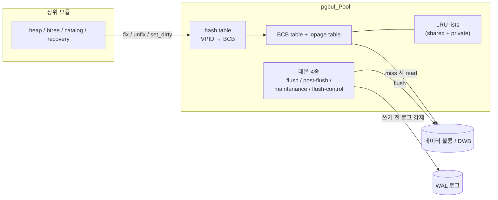
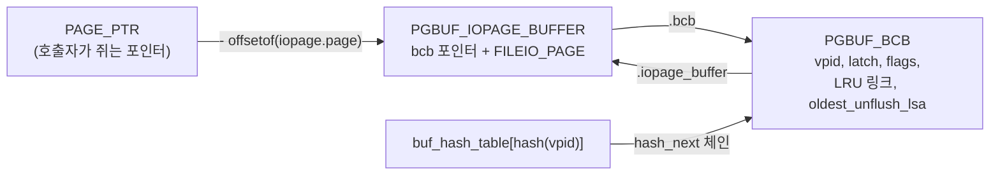
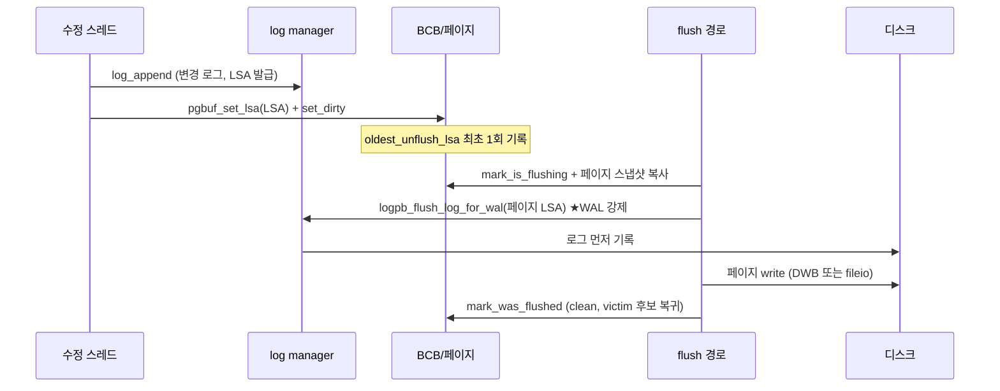
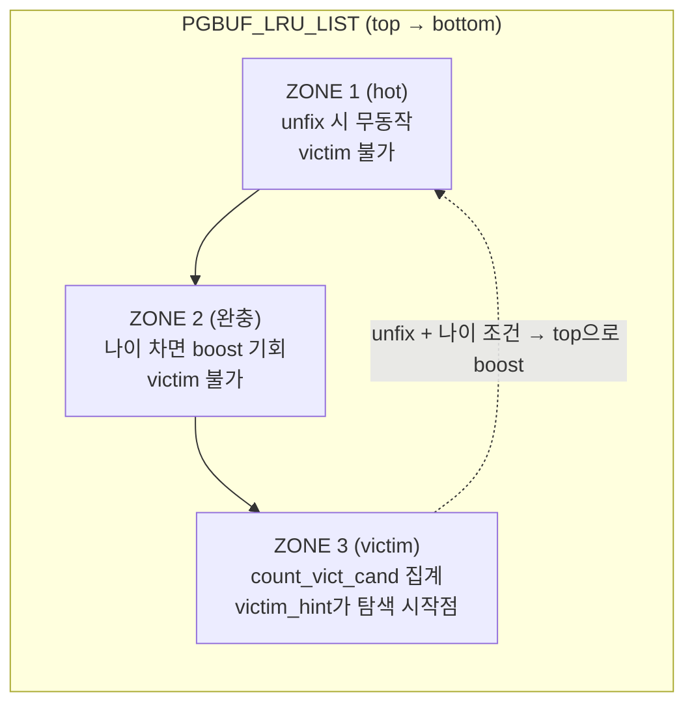
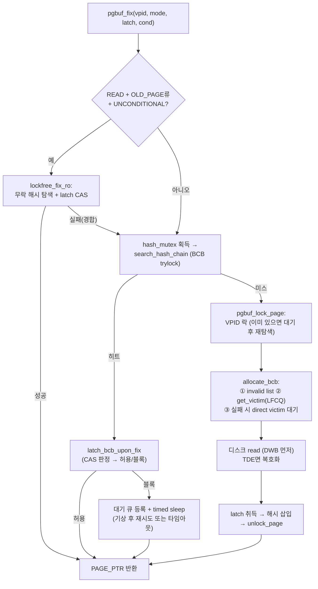
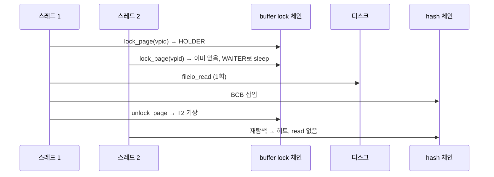
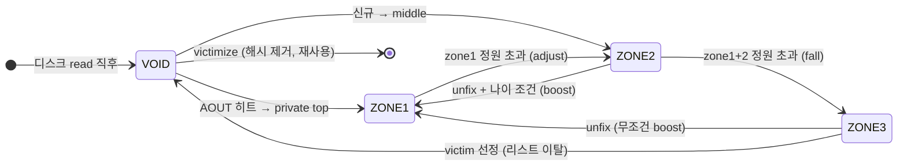
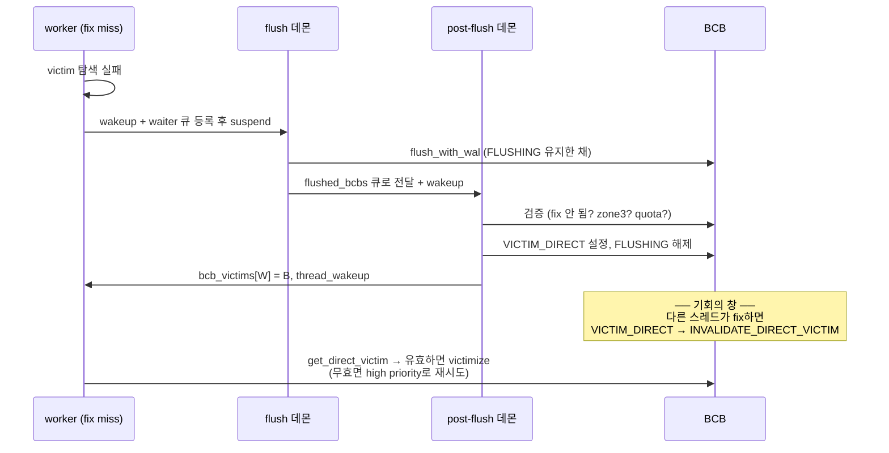
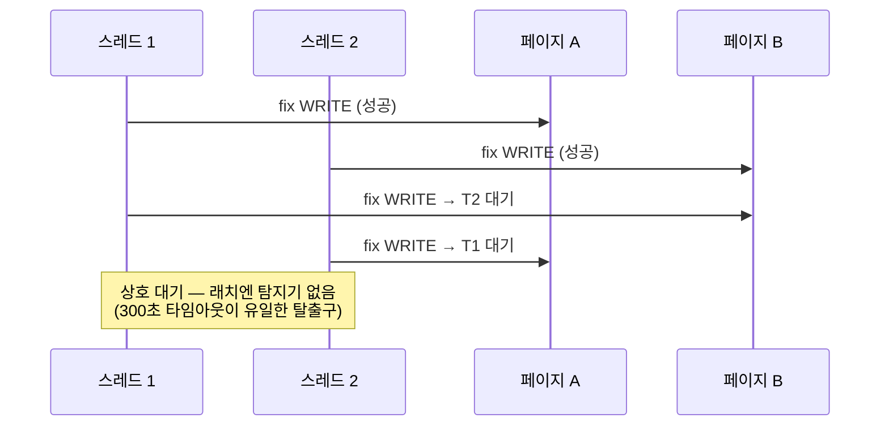

# CUBRID Page Buffer — 질문·모범답안 워크북

팀 학습/면접/온보딩용 문답집. 근거는 전부 `src/storage/page_buffer.c` (develop `e6ed61e87`)이며, 상세 설명은 [분석서 총론](./00-overview.md)과 챕터 01~06을 참조한다.

- **Level 1 (주니어)** — 개념과 계약. 이것만 알아도 pgbuf API를 올바르게 쓸 수 있다.
- **Level 2 (중급)** — 내부 메커니즘. 버그 리포트를 읽고 어디를 봐야 할지 안다.
- **Level 3 (시니어)** — 설계 트레이드오프와 엣지 케이스. 리뷰와 장애 분석이 가능하다.

---

## Level 1 — 개념과 계약

### Q1. page buffer는 무엇이고, 상위 모듈과의 계약은 무엇인가?

**모범답안.** 디스크 페이지(16KB)의 메모리 캐시다. heap/btree/카탈로그/리커버리 등 상위 모듈은 디스크 I/O를 직접 하지 않고 다섯 가지 계약만 쓴다: ① `pgbuf_fix(vpid, fetch_mode, latch_mode, condition)` — 페이지를 메모리에 고정하고 포인터를 받는다(없으면 읽어온다), ② 래치 — fix는 항상 READ 또는 WRITE 래치와 함께다, ③ `pgbuf_unfix` — 반납, ④ `pgbuf_set_dirty`/`pgbuf_set_lsa` — 수정 통지, ⑤ flush 계열 — 디스크 반영 강제. fix된 페이지는 절대 교체(victim)되지 않는다는 것이 핵심 보장이다.

근거: 총론 §1.1, 챕터 02.

### Q2. `PAGE_PTR`에서 BCB를 어떻게 찾는가? 해시 테이블은 무엇을 매핑하는가?

**모범답안.** 페이지 데이터와 제어블록(BCB)은 별도 배열에 살지만 쌍으로 연결된다. `PAGE_PTR`는 `PGBUF_IOPAGE_BUFFER` 내부의 `iopage.page` 주소이므로, 상수 오프셋을 빼면 `PGBUF_IOPAGE_BUFFER`가 나오고 그 첫 필드가 BCB 포인터다(`CAST_PGPTR_TO_BFPTR`, `page_buffer.c:148-153`). 즉 역참조가 O(1)이고 테이블 조회가 필요 없다. 해시 테이블(`buf_hash_table`, 2^20 버킷 고정)은 VPID(볼륨 ID + 페이지 ID) → BCB 체인을 매핑하며, "이 페이지가 지금 버퍼에 있는가"를 답한다.

근거: 챕터 01 §1.3, §3.

### Q3. 래치(latch)와 락(lock)은 어떻게 다른가? 래치 호환성 규칙은?

**모범답안.** 락은 트랜잭션 수명의 논리적 동시성 제어(lock manager 담당, 데드락 탐지 있음)이고, 래치는 페이지 메모리 접근의 물리적 보호(pgbuf 담당, **데드락 탐지 없음** — 타임아웃 300초뿐)다. 호환성: READ끼리 공존, WRITE는 단독. 단 두 가지 비직관 규칙이 있다 — ① WRITE 대기자가 큐에 있으면 신규 READ도 블록된다(writer 기아 방지), ② 이미 holder인 스레드의 재진입은 항상 허용된다(자기 데드락 방지).

| 보유 상태 \ 요청 | READ | WRITE |
|---|---|---|
| 래치 없음 (fcnt=0) | 허용 | 허용 |
| READ, 대기자 없음 | 허용 | 내가 유일 holder면 in-place 승격, 아니면 블록 |
| READ, 대기자 있음 | 내가 holder면 허용, 아니면 **블록** | 블록 |
| WRITE (내가 holder) | 허용 (재진입) | 허용 (재진입) |
| WRITE (남이 holder) | 블록 | 블록 |

근거: 챕터 02 §4.1.

### Q4. dirty 페이지란 무엇이고, 왜 victim이 될 수 없는가?

**모범답안.** 메모리 내용이 디스크보다 새로운 페이지다. victim(교체 대상)이 되려면 그 프레임을 다른 페이지가 재사용해야 하는데, dirty 상태로 버리면 수정이 유실된다. 그래서 dirty는 먼저 flush되어 clean이 된 뒤에만 victim 후보가 된다. 코드로는 `PGBUF_BCB_DIRTY_FLAG`가 `PGBUF_BCB_INVALID_VICTIM_CANDIDATE_MASK`(`page_buffer.c:258-262`)에 포함되어 victim 판정에서 자동 배제된다.

### Q5. WAL rule은 무엇이고 pgbuf 어디에서 강제되는가?

**모범답안.** "페이지를 디스크에 쓰기 전에, 그 페이지의 최신 변경까지의 로그가 먼저 디스크에 있어야 한다." 이것이 지켜져야 crash 후 redo/undo가 가능하다. pgbuf의 모든 flush 경로는 단일 함수 `pgbuf_bcb_flush_with_wal`(`page_buffer.c:10673`)로 수렴하고, 이 함수가 실제 write 직전에 `logpb_flush_log_for_wal(페이지 LSA)`(`:10788`)를 호출해 강제한다. 페이지별 추적 상태는 BCB의 `oldest_unflush_lsa`(디스크에 아직 없는 가장 오래된 변경의 LSA) 하나다.

근거: 챕터 04 §1.4, §2.

### Q6. 3-zone LRU에서 각 zone의 역할은?

**모범답안.** 하나의 LRU 리스트가 세 구간으로 나뉜다. **zone1(hot)** — unfix해도 아무 것도 하지 않는다(최빈 연산의 비용 최소화), victim 불가. **zone2(완충)** — zone1에서 밀려난 페이지가 "아직 뜨거운지" 증명할 기회. 나이가 찬 뒤 다시 쓰이면 top으로 boost, victim 불가. **zone3(victim 존)** — 교체 후보 구간. victim 탐색은 bottom에서 위로 zone3만 훑는다. 기본 비율은 zone1 40% / zone2 5% / 나머지 zone3 (`lru_hot_ratio`, `lru_buffer_ratio`).

근거: 챕터 03 §2, `page_buffer.c:188-196` 주석.

### Q7. fix의 `fetch_mode`는 왜 여러 종류인가? 대표 세 개를 설명하라.

**모범답안.** "이 페이지가 어떤 상태일 것으로 기대하는가"의 선언이다. **OLD_PAGE** — 이미 할당된 정상 페이지. 버퍼에 없으면 디스크에서 읽고, 읽었는데 dealloc 상태(`PAGE_UNKNOWN`)면 에러다. **NEW_PAGE** — 방금 할당된 페이지. 디스크에서 읽지 않고 버퍼에서 바로 만든다. **OLD_PAGE_IF_IN_BUFFER** — 버퍼에 있을 때만 반환하고 없으면 읽지 않고 NULL(예: 이미 쫓겨난 페이지는 건드릴 필요가 없는 vacuum류 작업). 그 외 dealloc 전후 상황용 변형들(`OLD_PAGE_DEALLOCATED`, `OLD_PAGE_MAYBE_DEALLOCATED`, `OLD_PAGE_PREVENT_DEALLOC`)과 `RECOVERY_PAGE`가 있다.

근거: `page_buffer.h:172-187`, 챕터 02 §9.

### Q8. temp 볼륨 페이지는 무엇이 다른가?

**모범답안.** temp 페이지(정렬/해시 중간 결과 등)는 crash 후 복구할 필요가 없으므로 WAL 대상이 아니다. 구현은 특수 LSA 값 `PGBUF_TEMP_LSA = (-2,-2)`로, 이 LSA를 가진 페이지는 ① `oldest_unflush_lsa`가 영원히 NULL → flush 시 로그 강제 생략, ② DWB 우회, ③ 체크포인트 대상 제외, ④ unfix 시 LRU 승격 기여 안 함(`PGBUF_SHOULD_IGNORE_UNFIX`). 별도의 latchless 경로 `pgbuf_simple_fix/unfix`도 temp 읽기 전용으로 존재한다.

근거: 챕터 04 §1.5, 챕터 06 §5.

---

## Level 2 — 내부 메커니즘

### Q9. `pgbuf_fix`의 전체 흐름을 설명하라 (히트/미스 모두).

**모범답안.** 3계층이다. ① **lock-free fast path** — READ + OLD_PAGE류 + UNCONDITIONAL이면 해시 체인을 락 없이 탐색하고 atomic latch CAS로 fcnt만 올린다(`pgbuf_lockfree_fix_ro`, `:2311-2330`). 실패하면 정상 경로로 폴백. ② **정상 경로(히트)** — hash mutex → 체인 탐색 → BCB trylock → 래치 취득(`pgbuf_latch_bcb_upon_fix`) → holder 등록. ③ **미스 경로** — VPID 락 등록(`pgbuf_lock_page`, 중복 read 방지) → BCB 확보(`pgbuf_allocate_bcb`: invalid list → victim → 대기) → 디스크 read → 래치 → 해시 삽입 → VPID 락 해제(대기자 기상).

근거: 챕터 02 §1-2.

### Q10. 두 스레드가 같은 페이지를 동시에 미스하면 disk read는 몇 번 일어나는가? 그 메커니즘은?

**모범답안.** 정확히 1번이다. 미스한 스레드는 read 전에 `buf_lock_table`(해시 버킷별 buffer lock 체인)에 VPID를 등록한다(`pgbuf_lock_page`). 뒤따라온 스레드는 같은 VPID 엔트리를 발견하면 HOLDER가 아니라 WAITER가 되어 잠들고, 먼저 온 스레드가 read를 끝내 해시 체인에 삽입한 뒤 `pgbuf_unlock_page`로 깨워준다. **깨어난 쪽은 소유권을 받는 게 아니라 해시를 재탐색**해서 이번엔 히트 경로를 탄다.

근거: 챕터 05 §5.

### Q11. atomic latch에는 무엇이 들어 있고, 왜 이렇게 만들었는가?

**모범답안.** 64비트 하나에 `{latch_mode(16b), waiter_exists(16b), fcnt(32b)}`를 팩킹한 `std::atomic<uint64_t>`다(`page_buffer.c:501-510`). 래치 취득/해제 판정이 "모드+대기자유무+카운트"의 **복합 조건**이기 때문에, 셋을 한 CAS로 읽고 전이해야 뮤텍스 없이도 원자성이 성립한다. 효과: 경합 없는 fix/unfix(가장 빈번한 연산)가 BCB 뮤텍스를 아예 잡지 않는다. 주의점: CAS 실패 시 전체 재판정하므로 판정 로직은 부수효과 없이 idempotent해야 한다.

근거: 챕터 01 §2.3, 챕터 02 §4.2 (9케이스 결정표).

### Q12. unfix하면 페이지는 LRU의 어디로 가는가?

**모범답안.** fcnt가 0이 될 때 zone에 따라 갈린다. **VOID zone**(디스크에서 갓 읽혀 아직 리스트 미소속)이면 배치 결정을 한다 — AOUT 히트(최근 쫓겨났던 페이지)면 private top(zone1), 아니면 middle(zone2); private가 없는 스레드는 shared middle. **zone1**이면 아무 것도 안 한다. **zone2**면 나이가 충분할 때(`PGBUF_IS_BCB_OLD_ENOUGH`) top으로 boost. **zone3**이면 무조건 boost. dealloc 예정 페이지(`MOVE_TO_LRU_BOTTOM` 플래그)는 반대로 bottom으로 보낸다. vacuum 워커와 temp 페이지의 unfix는 승격에 기여하지 않는다.

근거: 챕터 03 §3, §6.

### Q13. victim은 어떤 순서로 찾는가?

**모범답안.** `pgbuf_allocate_bcb` 기준 3단계다. ① **invalid list** — 기동 직후나 invalidate된 빈 BCB가 있으면 최우선. ② **`pgbuf_get_victim`** — "victim 있는 리스트 인덱스"만 담는 lock-free 큐(LFCQ) 3개를 순서대로 소비한다: big private(quota 크게 초과) → 내 private(quota 초과 시) → shared. 리스트를 정했으면 그 리스트의 bottom부터 zone3만 훑어 `fcnt==0 && !dirty && !flushing && !direct_victim` 페이지를 뽑는다. ③ **실패 시 대기** — direct victim 대기 큐(high/low priority)에 등록하고 flush 데몬을 깨운 뒤 잠든다. 깨어나면 우편함(`bcb_victims[내 인덱스]`)에 배정된 BCB를 수령한다.

근거: 챕터 03 §9, §11-12.

### Q14. direct victim 메커니즘의 전체 시퀀스를 그려라. `INVALIDATE_DIRECT_VICTIM` 플래그는 왜 필요한가?

**모범답안.** flush를 끝낸 쪽이 잠든 요청자에게 BCB를 직접 건네는 구조다. 배정 후 요청자가 깨어나 수령하기 전의 짧은 창(window)에 **다른 스레드가 그 페이지를 fix할 수 있다** — 그 페이지가 다시 필요해진 것이므로 victim으로 쓰면 안 된다. 그래서 fix 경로는 `VICTIM_DIRECT`를 발견하면 `INVALIDATE_DIRECT_VICTIM`으로 바꿔치기하고, 수령자는 무효 표시를 보고 재시도한다.

근거: 챕터 03 §12, 챕터 04 §5.2.

### Q15. `pgbuf_bcb_flush_with_wal`의 단계와, 실패 시 복원을 설명하라.

**모범답안.** (BCB 뮤텍스 보유로 진입) ① `mark_is_flushing` — 한 CAS로 FLUSHING↑ + DIRTY↓. 이후의 수정은 DIRTY를 다시 세우므로 유실이 없다. ② 페이지를 스택 버퍼로 memcpy(스냅샷; TDE면 이때 암호화). ③ `oldest_unflush_lsa`를 지역에 보관하고 NULL로 민 뒤 **뮤텍스 해제** — 긴 I/O를 락 밖에서. ④ WAL: `logpb_flush_log_for_wal(페이지 LSA)`. ⑤ write: DWB 경로(`dwb_add_page`) 또는 `fileio_write`. ⑥ 실패 시 완전 복원 — DIRTY 재설정 + `oldest_unflush_lsa` 복원 + FLUSH 대기자 기상. ⑦ 성공 시 두 갈래 — victim 대기자가 있으면 FLUSHING을 유지한 채 post-flush 큐로 이관, 없으면 즉시 `mark_was_flushed`(FLUSHING↓ → victim 후보 복귀).

근거: 챕터 04 §2 (의사코드 전문).

### Q16. 체크포인트는 어떤 페이지를 flush하며, recovery와 어떤 관계인가?

**모범답안.** 목표는 "redo 시작점 전진"이다. `flush_upto_lsa`(새 체크포인트 LSA)를 받아, `dirty && oldest_unflush_lsa ≤ 상한 && !temp`인 페이지만 BCB 테이블 전수 스캔으로 수집한다 — 체크포인트 시작 **이후에** dirty가 된 페이지는 다음 체크포인트 몫이다. 수집분을 (volid, pageid)로 정렬해 rate control(1초를 interval로 쪼개고 누적 보정) 하에 flush한다. 전부 성공하면 redo 시작점이 새 체크포인트 LSA까지 전진하고 그 이전 로그는 회수 가능해진다. victim flush와 디스크 순차성이 서로 깨지지 않도록 `is_flushing_victims` 동안 최대 1.5초 양보한다.

근거: 챕터 04 §4.

### Q17. 데몬 4종의 역할을 한 줄씩 말하라.

**모범답안.**

| 데몬 | 주기 | 역할 |
|---|---|---|
| page-flush | 파라미터 또는 무한 대기 (wakeup 구동) | zone3 bottom의 dirty를 수집·정렬·flush해 victim 재고를 만든다 |
| page-post-flush | 1→10→100ms 적응형 | flush 완료 BCB를 검증해 잠든 요청자에게 direct victim으로 배정한다 |
| page-maintenance | 100ms 고정 | 세션 활동량 기반 quota 재계산(`pgbuf_adjust_quotas`) + direct victim 보수 작업 |
| flush-control | 50ms 고정 | dirty 비율 기반으로 flush I/O 토큰을 발급해 쓰기 속도를 조절한다 |

근거: 챕터 04 §5.1.

---

## Level 3 — 설계 트레이드오프와 엣지

### Q18. 왜 세션마다 private LRU를 주는가? quota는 어떻게 정해지는가?

**모범답안.** 대량 스캔 오염 방지가 목적이다. 단일(또는 shared만의) LRU에서는 한 세션의 풀스캔이 다른 모든 세션의 hot 페이지를 밀어낸다. private LRU에서는 스캔이 읽은 페이지가 그 세션의 리스트 안에서만 순환하고, quota를 넘치면 **그 세션 것부터** victim이 된다. private의 zone1+2 상한이 quota의 10%로 잡혀 있어(threshold = quota x 0.05 x 2) 스캔 페이지 대부분이 곧장 zone3(victim 존)에 머문다. quota는 100ms마다 maintenance 데몬이 세션별 활동량의 지수이동평균(EMA)으로 비례 배분한다 — 활동 많은 세션이 큰 몫. 재사용이 증명된 페이지(AOUT 히트, hot 판정)만 shared로 승격해 전체가 공유하는 자산이 된다.

근거: 챕터 03 §7-8, §16.

### Q19. hash mutex와 BCB mutex의 락 순서 규칙은 무엇이며, 왜 한쪽만 trylock인가?

**모범답안.** 규칙: **블로킹 획득은 `bcb → hash` 방향만 허용.** `delete_from_hash_chain`은 BCB를 든 채 hash를 블로킹으로 잡는다. 반대 방향(`search_hash_chain`: hash를 든 채 BCB가 필요)은 **trylock만** — EBUSY면 hash를 먼저 놓고 BCB를 블로킹으로 잡은 뒤 처음부터 재검증한다. 양방향 모두 블로킹이면 두 함수가 즉시 교착한다. 즉 데드락 회피 근거가 "순서 통일"이 아니라 "한 방향의 양보(trylock + 후퇴 + 재검증)"라는 점이 이 코드의 특징이다. 파생 규칙: BCB를 든 채 잠들 수 있는 `pgbuf_lock_page`를 부르지 않는다.

근거: 챕터 02 §3, 챕터 01 §7.

### Q20. flush 중인 페이지(FLUSHING)가 victim 무효화 마스크에 들어 있는 이유는? `count_vict_cand`는 언제 변하는가?

**모범답안.** flush는 래치를 잡지 않으므로, FLUSHING을 후보에서 빼지 않으면 "디스크에 반쯤 쓰인 페이지의 프레임을 다른 페이지가 재사용"하는 사고가 가능해진다. 부수 효과로 회계가 깔끔해진다: flush 시작의 {FLUSHING↑, DIRTY↓} 전이는 무효화 플래그 하나가 다른 하나로 바뀐 것이라 `count_vict_cand`가 **변하지 않고**, flush가 성공해 FLUSHING이 내려가는 순간에만 +1 된다. 실패하면 DIRTY로 되돌아가므로 역시 불변. 이 불변식이 victim_hint/후보 카운터의 정합성을 지탱한다.

근거: 챕터 04 §1.1-1.2.

### Q21. ordered fix가 없으면 생기는 데드락을 타임라인으로 보이고, `page_was_unfixed` 계약을 설명하라.

**모범답안.** 래치엔 데드락 탐지가 없으므로 두 스레드가 두 페이지를 반대 순서로 잡으면 300초 타임아웃까지 서로 대기한다:

ordered fix는 전역 순서 `(group_id=heap 헤더 VPID, rank, vpid)`를 강제한다. 이미 잡은 페이지보다 순서가 앞서는 페이지를 잡아야 하면: 먼저 **조건부(무대기)** 로 시도하고 — 대기가 없으면 순서 위반이어도 데드락이 없다 — 실패하면 잡은 페이지들을 놓고 순서대로 다시 잡는다. 이때 놓였다 다시 잡힌 페이지의 watcher에 `page_was_unfixed = true`가 남는데, 이는 **"래치가 풀린 사이 페이지 내용이 바뀌었을 수 있으니, 캐시해 둔 페이지 내 포인터/슬롯 정보를 전부 재검증하라"** 는 호출자 계약이다. 이 플래그를 무시하는 것이 heap 계층의 고전적 버그 패턴이다.

근거: 챕터 05 §1-2.

### Q22. dealloc된 페이지를 pgbuf는 왜 invalidate하지 않는가?

**모범답안.** `pgbuf_dealloc_page`는 페이지를 버퍼에서 제거하지 않고 `ptype = PAGE_UNKNOWN` + dirty + `MOVE_TO_LRU_BOTTOM`(자연 victim 유도)로만 만든다. 이유: ① dealloc은 트랜잭션 연산이라 **undo될 수 있다** — 페이지가 버퍼에 남아 있으면 undo(재할당 복원)가 메모리 연산으로 끝난다. ② "dealloc되었다"는 상태 자체가 디스크에 기록되어야 하므로(dirty) 어차피 flush가 필요하다. undo는 논리적 연산이어서 compensate 로그(`log_append_compensate_with_undo_nxlsa`)로 멱등성을 확보한다. invalidate(해시 제거 + invalid list행)는 볼륨 삭제 같은 "되돌릴 수 없는" 경로에서만 쓴다.

근거: 챕터 05 §4.

### Q23. AOUT 리스트는 무엇을 개선하며, 기본 설정에서 동작하는가?

**모범답안.** 2Q 알고리즘의 Aout이다. victim으로 쫓겨난 페이지의 **VPID만**(BCB 아님) FIFO+해시에 기억해 두었다가, 그 페이지가 다시 읽히면 "최근에 쫓겨났는데 또 필요해진 페이지"로 인정해 zone2 대신 zone1으로 직행시킨다 — 반복 참조 패턴을 한 번의 재방문으로 감지한다. 단, 크기 파라미터 `data_aout_ratio`의 **기본값이 0.0이라 기본 비활성**이다. 켜면 `num_buffers x ratio`(상한 32768) 노드를 고정 할당한다.

근거: 챕터 03 §13, 챕터 01 §9.

### Q24. 이 분석에서 발견된 결함 후보 중 대표 3건을 영향과 함께 설명하라.

**모범답안.** (전체 20건은 [총론 §7](./00-overview.md) 표 참조)

1. **avoid_dealloc 카운터 비대칭** (`:2311-2330` + `:2513-2517`, 도달 경로 `:12280-12296`) — `pgbuf_fix`의 lock-free fast path가 register를 건너뛴 채 unregister를 실행한다. 외부의 직접 호출은 없지만 `pgbuf_ordered_fix`의 1차 시도가 원래 모드(PREVENT_DEALLOC)를 그대로 전달하고 보유 페이지가 없으면 UNCONDITIONAL이라, heap 스캔에서 일상적으로 fast path에 도달한다. 카운터가 0이면 방어되지만, **다른 스레드가 등록한 보호 카운트를 훔쳐 감소**시킬 수 있다 → vacuum이 보호 중인 페이지의 조기 dealloc 가능성. (ordered fix 자체의 unregister `:12702`/`:12850`은 1차 시도가 실패하며 남긴 +1과 짝인 정상 동작.)
2. **`pgbuf_direct_victims_maintenance`의 죽은 루프** (`:9577, :9586`) — `for (index = prv_index; ... && index != prv_index && ...)` 초기 조건 모순으로 루프 본문이 전혀 실행되지 않는다. 100ms 데몬이 부르지만 no-op — victim 공급이 끊겼을 때 대기 스레드를 구제하는 백업 플랜이 무력화된 상태다.
3. **flush 조기 실패 시 FLUSHING 누수** (`:10755, :10767`) — TDE 암호화/DWB 슬롯 획득 실패 경로가 `mark_was_not_flushed` 없이 반환해 BCB가 영구 FLUSHING으로 남는다. 그 페이지는 victim 불가가 되고, 동기 flush 요청자는 깨워줄 주체 없는 무한 대기(`PGBUF_LATCH_FLUSH`엔 타임아웃이 없음)에 빠질 수 있다.

근거: 총론 §7, 챕터 02 §12 / 03 §17 / 04 §9.

---

## 부록 — 셀프 체크 순서 제안

1. Level 1을 보지 않고 답할 수 있는가 → API 사용자 자격
2. Q9, Q12~Q15를 화이트보드에 그릴 수 있는가 → 디버깅 자격
3. Q19~Q21의 "왜"에 반례를 들어 반박·방어할 수 있는가 → 리뷰어 자격
4. [재구현 계획](./08-page-buffer-new-plan.md)의 M0부터 실제로 짜 본다 → 설계자 자격
