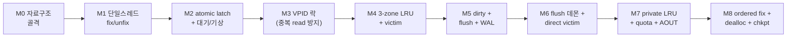

# page_buffer_new.cpp 재구현 계획서

목적: 기존 `src/storage/page_buffer.c`를 **수정하지 않고** 병행 파일로 page buffer를 처음부터 다시 구현하며 학습한다. 완주 기준은 "분석서(01~06)만 보고, 원본 코드를 열지 않고, 각 마일스톤을 통과하는 것"이다.

## 1. 목표와 비목표

| 구분 | 내용 |
|---|---|
| 목표 | fix/unfix·래치·LRU·victim·flush·WAL의 **핵심 메커니즘을 스스로 재현** — 각 단계마다 원본과 대조 가능한 형태 |
| 목표 | 원본의 불변식 16종([총론 §5](./00-overview.md))을 테스트로 성문화 — 재구현이 불변식을 어기면 테스트가 잡는다 |
| 목표 | 원본에서 발견한 결함 후보(FLUSHING 누수 등)를 새 구현에서는 **설계로 차단**해 보고, 그 차이를 기록 |
| 비목표 | 엔진 통합 (cub_server가 새 구현을 쓰게 만드는 것) — 학습용 병행 코드로만 유지 |
| 비목표 | TDE/DWB/copy buffer/SHOW 통계 등 부가 기능 (선택 확장) |
| 비목표 | 원본과의 성능 동등성 — 단, 설계상 병목(전역 락 등)을 만들지 않는 것은 목표에 포함 |

## 2. 배치와 빌드 전략

```text
unit_tests/
└── pgbuf_new/                  ← 새 모듈 (엔진 소스 트리 오염 없음)
    ├── page_buffer_new.hpp     ← 공개 인터페이스
    ├── page_buffer_new.cpp     ← 구현 (단계적으로 성장)
    ├── test_m0_layout.cpp      ← 마일스톤별 Catch2 테스트
    ├── test_m1_fix_basic.cpp
    ├── ...
    └── CMakeLists.txt
```

- **위치**: `unit_tests/` 하위 독립 모듈. 이유 — ① 엔진 헤더 의존을 최소화한 채 자체 컴파일 가능, ② Catch2 테스트 하네스가 이미 갖춰져 있음, ③ `src/`에 두면 CI 스타일 검사·라이선스 헤더·cppcheck 대상이 되어 학습 반복이 느려진다.
- **의존 최소화**: 초기 단계(M0~M5)는 표준 라이브러리(`<atomic>`, `<mutex>`, `<thread>`, `<condition_variable>`)만 사용한다. VPID/LSA도 자체 정의(원본과 같은 레이아웃)로 시작해, 필요해지는 시점에 엔진 타입으로 치환할지 결정한다. 디스크는 실제 볼륨 대신 **파일 기반 mock 스토리지**(pread/pwrite + 인위적 지연/실패 주입 훅)로 추상화한다.
- **스타일**: 학습 코드이므로 C++17 관용구(scoped_lock, enum class)를 자유롭게 쓰되, 원본과 대조가 쉽도록 **함수·필드 이름은 원본 명명을 유지**한다 (`claim_bcb_for_fix`, `oldest_unflush_lsa`, ...). 예외는 쓰지 않는다(원본과 동일한 에러코드 반환 모델) — 대조 학습에 유리하다.

## 3. 인터페이스 스케치

```cpp
namespace pgbuf_new
{
  struct vpid { int32_t pageid; int16_t volid; };
  struct log_lsa { int64_t pageid; int16_t offset; };

  enum class latch_mode : uint16_t { none, read, write };
  enum class latch_cond { unconditional, conditional };
  enum class fetch_mode { old_page, new_page, old_if_in_buffer };

  class buffer_pool
  {
  public:
    int  initialize (int num_buffers, storage_iface *disk, wal_iface *log);
    void finalize ();

    page_ptr fix (const vpid &id, fetch_mode fm, latch_mode lm, latch_cond lc);
    void     unfix (page_ptr p);
    void     set_dirty (page_ptr p);
    void     set_lsa (page_ptr p, const log_lsa &lsa);
    int      flush_page (page_ptr p);          // M5
    int      flush_victim_candidates (float ratio); // M6
    int      flush_checkpoint (const log_lsa &upto); // M8
    // 관측용 (테스트가 불변식을 검사할 통로)
    pool_stats peek_stats () const;
  };

  // 테스트가 주입하는 경계 — 원본의 fileio / log manager 계약을 명시화한 것
  struct storage_iface { virtual int read (const vpid&, void*) = 0;
                         virtual int write (const vpid&, const void*) = 0; };
  struct wal_iface     { virtual void flush_log_upto (const log_lsa&) = 0;
                         virtual bool need_wal (const log_lsa&) = 0; };
}
```

`storage_iface`/`wal_iface`가 핵심 장치다: 원본이 fileio/log manager에 암묵적으로 기대하는 계약(챕터 06 §9)을 **명시적 인터페이스로 승격**시켜, 테스트에서 지연·실패·순서 검증(예: "write 전에 flush_log_upto가 불렸는가" = WAL rule 자동 검증)을 주입할 수 있다.

## 4. 마일스톤

각 마일스톤은 (구현 항목 / 완료 기준 테스트 / 정본 챕터)로 정의한다. 앞 단계만으로 항상 빌드·테스트가 통과해야 한다.



### M0 — 자료구조 골격 (정본: 01)

- BCB / iopage 쌍 배열, `CAST` 상수 오프셋 역참조, 해시 테이블(체인), invalid list, flags 워드 비트 인코딩(플래그 7종 + zone + lru index).
- **완료 기준**: `static_assert`로 레이아웃 검증(01 §4 실측치와 대조 — BCB 크기, iopage 오프셋). flags 인코딩 왕복 테스트(`make_zone/get_zone/get_lru_index`). zone 비교가 동등 비교임을 강제하는 테스트(LRU_3 = 3<<16 함정, 총론 불변식 #6).

### M1 — 단일 스레드 fix/unfix (정본: 02 §2)

- 해시 조회 → 히트 시 fcnt++; 미스 시 invalid list에서 BCB 할당 → mock read → 해시 삽입. 래치는 아직 무시(단일 스레드).
- **완료 기준**: 같은 VPID 재fix가 같은 포인터. fcnt 회계 정확. 미스 시 read 정확히 1회. invalid list 고갈 시 명시적 에러(victim은 M4).

### M2 — atomic latch + 블록/기상 (정본: 02 §4)

- 64비트 팩킹 latch(`{mode, waiter_exists, fcnt}`), CAS 판정 9케이스, BCB별 대기 큐, cond-var 기반 suspend/resume, 타임아웃, 재진입 fix, in-place promote.
- **완료 기준**: 02 §4.2 결정표의 9케이스를 각각 단위 테스트로. 멀티스레드 스트레스(reader N + writer M, ThreadSanitizer 클린). writer 기아 방지 검증(WRITE 대기 중 신규 READ 블록). holder 재진입 예외 검증. `waiter_exists` 정합화(불변식 #12) — FLUSH 대기자 시나리오는 M5 이후 추가.

### M3 — VPID 락 (정본: 05 §5)

- buffer lock 체인: 미스 시 등록, 동일 VPID 대기, read 완료 후 기상, **기상자는 재탐색**(소유권 이양 금지, 불변식 #10).
- **완료 기준**: N스레드 동시 미스에서 mock read 호출 수 == 1. 기상 후 히트 경로 진입 확인.

### M4 — 단일 shared LRU + 3-zone + victim (정본: 03 §4-5, §9-10)

- zone 카운터/threshold, add to top/middle/bottom, adjust(zone1→2→3 캐스케이드), boost(나이 조건), victim_hint, bottom-up victim 탐색, victimize(해시 제거 → invalid 재사용), LRU mutex.
- **완료 기준**: zone 카운트 불변식(합 = 리스트 크기) 랜덤 연산 fuzz. victim 탐색이 zone3 이탈 시 정지. fix된/dirty 페이지가 victim으로 뽑히지 않음(마스크 검증, 불변식 #2). victim_hint 아래는 전부 후보 아님을 주기 검증.

### M5 — dirty + flush_with_wal (정본: 04 §1-2)

- set_dirty/set_lsa(`oldest_unflush_lsa` 최초 1회), `mark_is_flushing`의 {FLUSHING↑, DIRTY↓} 원자 전이, 스냅샷 복사 → 뮤텍스 해제 → WAL → write → 성공/실패 처리. **원본 결함의 설계 차단**: 모든 조기 반환 경로가 복원을 거치도록 RAII 가드(flush scope guard)로 강제 — 원본 결함 후보 #3의 재발 방지.
- **완료 기준**: WAL rule 자동 검증(wal_iface mock이 "write 전 flush_log_upto 선행"을 assert). write 실패 주입 시 DIRTY/`oldest_unflush_lsa` 완전 복원(불변식 #4). `count_vict_cand` 불변(불변식 #3) — flush 시작/실패에 불변, 성공에만 +1. `oldest_unflush_lsa != NULL ⇒ dirty`(불변식 #1) 전역 스캔 검사.

### M6 — flush 데몬 + direct victim (정본: 03 §12, 04 §3·5)

- 백그라운드 flush 스레드(zone3 dirty 수집 → 정렬 → flush), victim 고갈 시 대기 큐(high/low) + 우편함 + 직접 배정, `VICTIM_DIRECT`/`INVALIDATE_DIRECT_VICTIM` 창 처리, post-flush 단계(단순화: flush 스레드가 겸임하는 것으로 시작해도 됨).
- **완료 기준**: 버퍼 크기 << 워킹셋인 스트레스에서 기아·행 없음(전 스레드가 유한 시간 내 진행). 배정-재fix 경합 주입 테스트에서 INVALIDATE 경로 동작. 원본의 죽은 코드(결함 #8, #9)에 해당하는 백업 경로를 **동작하는 형태로** 구현해 차이를 기록.

### M7 — private LRU + quota + AOUT (정본: 03 §6-8, §13)

- 스레드(세션)별 private 리스트 배정/회수, EMA 활동량 기반 quota 재계산(maintenance 틱), private→shared 승격 규칙, AOUT(FIFO+해시, VPID만) 재승격.
- **완료 기준**: "세션 A 풀스캔 + 세션 B 핫셋 반복" 시나리오에서 B의 히트율이 스캔 전과 유사하게 유지(오염 방지 실증 — 수치를 기록해 shared 단일 구성과 비교). quota 초과 리스트부터 victim이 나가는지 검증. AOUT on/off에 따른 재승격 zone 차이 검증.

### M8 — ordered fix + dealloc/invalidate + 체크포인트 (정본: 05, 04 §4)

- watcher/전역순서 `(group_id, rank, vpid)`/조건부 시도 → unfix-reorder-refix/`page_was_unfixed` 계약, dealloc(=PAGE_UNKNOWN+dirty+bottom, invalidate 아님), invalidate(해시 제거), 체크포인트 flush(`flush_upto_lsa` 필터 + 정렬 + redo 전진).
- **완료 기준**: Q21의 데드락 타임라인을 ordered 미사용으로 재현(타임아웃) → ordered 사용으로 해소. `fix_count == watch_count` 불변식(불변식 #14). dealloc-undo 멱등성. 체크포인트 후 "`oldest_unflush_lsa < 체크포인트 LSA`인 dirty 없음" 전역 검증.

### 선택 확장 (M9+)

lock-free read fast path(02 §6 — M2의 latch가 안정된 뒤에만), neighbor flush, AOUT 해시 샤딩, 통계/SHOW, TDE/DWB 스텁.

## 5. 테스트 전략

| 층 | 도구 | 내용 |
|---|---|---|
| 단위 | Catch2 (기존 unit_tests 관례) | 마일스톤별 결정표·상태전이를 케이스 단위로 |
| 불변식 | 자체 `verify_pool()` | 전역 스캔 검사기 — 총론 §5의 16종을 코드화, 모든 스트레스 테스트의 주기적 assert로 삽입 |
| 동시성 | 스트레스 + TSan/ASan | reader/writer/flush 혼합 부하, 실패 주입(mock read/write 에러, 지연) |
| 대조 | trace 비교 (선택) | 동일 연산 시퀀스를 원본(SA_MODE)과 새 구현에 넣고 상태 스냅샷 비교 — 원본 계측이 필요하므로 여유 있을 때만 |

로컬 빌드는 ccache 기반 `just build` / `just build-test`를 사용한다 (개인 워크플로우).

## 6. 리스크와 대응

| 리스크 | 대응 |
|---|---|
| M2 latch CAS의 미묘한 케이스 누락 | 02 §4.2 결정표를 테스트 이름 그대로 옮겨 커버리지를 표로 관리 |
| M6에서 행/기아 디버깅 난이도 | 모든 대기에 타임아웃 + 상태 덤프 훅을 처음부터 내장 (원본의 `pgbuf_dump`가 죽어 있는 교훈 — 결함 #16) |
| 범위 팽창 (엔진 타입 끌어오기) | M0~M5는 표준 라이브러리만: 규칙으로 고정 |
| 원본과의 구조 괴리로 대조 학습 효과 저하 | 명명 유지 + 각 함수 주석에 원본 라인 참조를 남긴다 |

## 7. 진행 기록 규칙

마일스톤 완료 시마다 `pgbuf_docs/notes/`에 한 페이지 회고를 남긴다: 원본과 달리 한 결정 / 원본을 다시 읽고 알게 된 것 / 다음 단계에서 검증할 질문. 이것이 최종적으로 [Q&A 워크북](./07-qa-workbook.md)의 심화 문항으로 환류된다.
