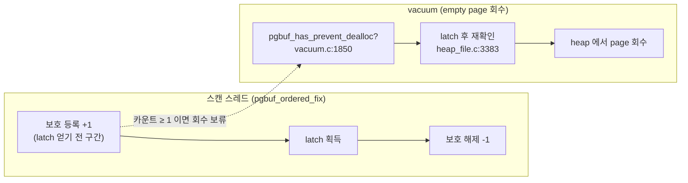
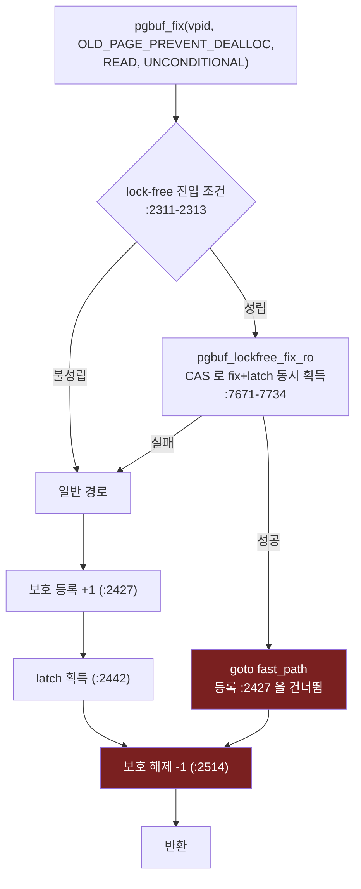
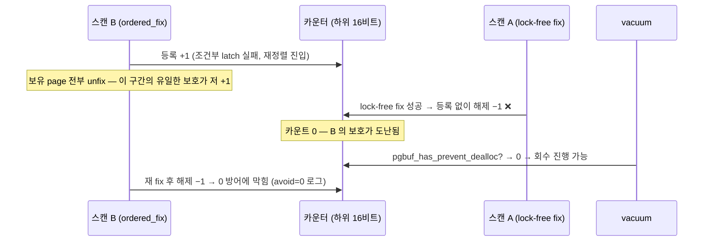
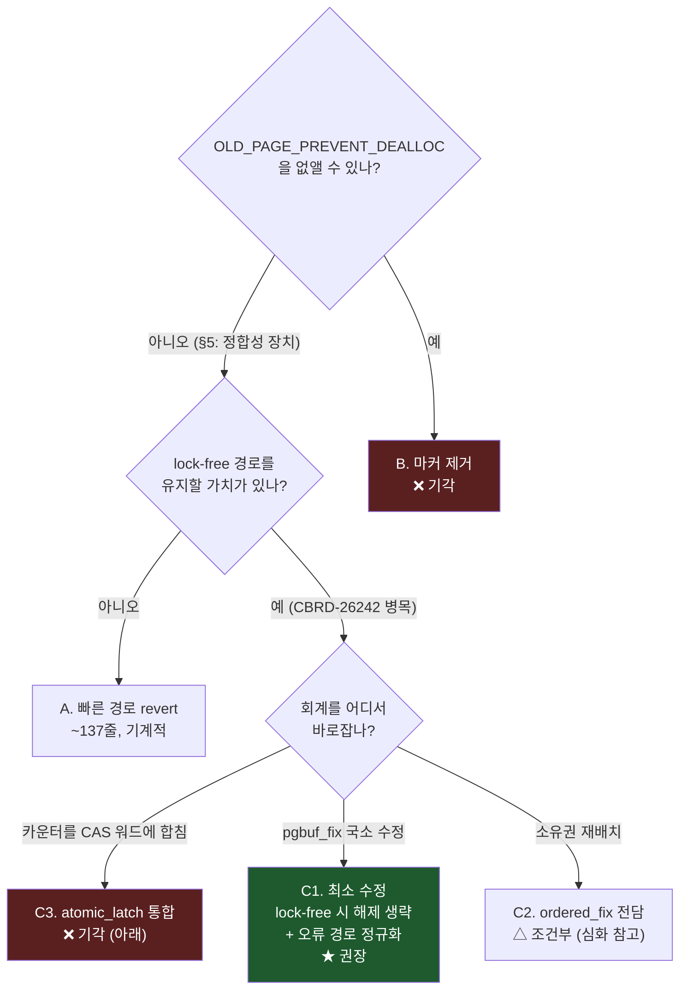

# CBRD-27263 — lock-free fix 와 dealloc 보호 카운터: 동적 실증과 해법 비교

- 기준 커밋: develop `e6ed61e87` (라인 번호는 모두 이 커밋의 `src/storage/page_buffer.c` 기준)
- 재현 브랜치: `repro/CBRD-27263` (커밋 `372b5cd8c`, 계측 + 시나리오 스크립트 `repro-cbrd-27263/` 포함)
- 관련 문서: `02-fix-unfix-latch.md` (fix/latch 경로), `05-ordered-fix-dealloc.md` (ordered fix), JIRA 이슈 초안 `CBRD-27263-pgbuf-lockfree-avoid-dealloc-asymmetry_e6ed61e_claude.md`
- 대상 독자: pgbuf 를 처음 보는 엔지니어도 따라올 수 있도록 용어를 그때그때 풀어 쓴다.

## 한 줄 결론

**결함은 실재한다 — 라이브 서버에서 재현했다.** 평범한 순차 heap scan + update 부하만으로,
lock-free 빠른 경로가 등록한 적 없는 dealloc 보호를 40 회 해제했고, 그중 **7 회는 다른
주체가 걸어 둔 살아 있는 보호를 실제로 훔쳤으며**, 실행이 끝난 뒤에도 순증감이 0 으로
돌아오지 않은 page 가 남았다. 해법 후보 비교와 권고는 [§6](#6-해법-후보-비교)에 있다.

---

## 1. 배경: 이 카운터는 왜 존재하나

pgbuf (page buffer manager) 는 디스크 page 를 메모리 frame 에 캐시하고, 사용자는
`pgbuf_fix` 로 page 를 고정(fix)한 뒤 latch (page 단위 짧은 읽기/쓰기 잠금) 를 얻어
내용을 읽는다. 한편 vacuum (MVCC 찌꺼기를 청소하는 백그라운드 작업) 은 레코드가 다
빠진 empty heap page 를 **heap 파일에서 떼어내 회수(deallocate)** 한다.

여기서 경합이 하나 생긴다. `pgbuf_ordered_fix` (여러 heap page 를 데드락 없이 잡으려고
전역 순서로 latch 를 재배열하는 fix 변형) 는 순서를 맞추려고 **이미 잡은 page 를 전부
놓았다가 다시 잡는** 구간이 있다. 그 구간 동안 대상 page 가 비어 있으면 vacuum 이
회수해 버릴 수 있고, 다시 잡으러 간 스레드는 이미 사라진 page 를 만나게 된다.

이를 막는 장치가 fetch mode `OLD_PAGE_PREVENT_DEALLOC` 이다. 이 mode 로 fix 하면 BCB
(Buffer Control Block — frame 에 올라온 page 의 제어 블록) 의
`count_fix_and_avoid_dealloc` **하위 16 비트**가 +1 되고 (`:2427-2430`,
`pgbuf_bcb_register_avoid_deallocation`, `:16209-16214`), latch 를 얻고 나면 −1 된다
(`:2513-2517`). vacuum 은 회수 직전에 이 카운트를 두 번 확인한다:



핵심 계약은 단순하다: **fix 한 건이 카운터에 남기는 순증감은 항상 0** 이어야 하고,
보호가 걸려 있는 동안(≥1) vacuum 은 그 page 를 회수하지 않는다.

### 카운터의 물리적 위치

```
BCB.count_fix_and_avoid_dealloc  (volatile int, page_buffer.c:535-540)
┌─────────────────────────┬─────────────────────────┐
│ 상위 16비트: fix 횟수    │ 하위 16비트: dealloc 보호 │  ← 이 이슈는 하위만 다룬다
│ (hot page 판정용)        │ (vacuum 회수 차단 수)    │
└─────────────────────────┴─────────────────────────┘
```

주의: 이 필드는 latch 상태를 담는 `atomic_latch` (64 비트 CAS 워드, `:501-510`:
`latch_mode` + `waiter_exists` + 32 비트 `fcnt`) 와 **별개의 필드**다. 이 분리가
아래 결함의 무대가 된다.

## 2. 결함: lock-free 빠른 경로의 반쪽 회계

CBRD 의 lock-free fix 최적화 (`pgbuf_lockfree_fix_ro`, `:7671-7734`) 는 이미 READ
latch 상태이고 대기자가 없는 page 를 **hash 체인 잠금도 BCB mutex 도 없이** CAS 한
번으로 fix 한다. CAS 가 `atomic_latch` 워드의 `fcnt` 를 +1 하는 순간 fix 와 READ
latch 획득이 **원자적으로 동시에** 끝난다 — 즉 이 경로에는 "latch 얻기 전 구간"
자체가 없다.

문제는 `pgbuf_fix` 의 회계가 이 경로를 절반만 우회한다는 것이다:



성공한 lock-free fix 는 등록(+1) 없이 해제(−1) 지점에 합류한다. **등록한 적 없는
보호를 해제하는 것**이다. 카운터가 0 이면 0 방어(`:16226-16250`)가 감소를 막아 주지만,
그 순간 **다른 주체가 걸어 둔 보호가 살아 있으면(≥1) 그 보호를 훔친다.** 0 방어는
"내 마커가 이미 사라진" 경우만 감수하겠다고 주석(`:16232-16244`)에 적어 두었고, 남의
보호를 깎는 경우는 그 감수 선언 밖이다.

### 진입 상황별 회계 (5 가지 중 3 가지가 깨져 있다)

`OLD_PAGE_PREVENT_DEALLOC` 사용처 10 곳은 전부 `pgbuf_ordered_fix` 를 거치고, 그
1차 시도(`:12292-12296`)가 원본 fetch mode 를 그대로 `pgbuf_fix` 에 넘기면서 lock-free
진입 조건과 겹친다.

| # | 진입 상황 | 등록 `:2427` | 해제 | 순증감 | 판정 |
|---|---|---|---|---|---|
| 1 | 1차 시도가 **lock-free 경로로 성공** | 건너뜀 | `:2516` | **−1** | 결함 — 남의 보호를 훔침 |
| 2 | 1차 시도가 일반 경로로 성공 | +1 | `:2516` | 0 | 정상 |
| 3 | 조건부 latch 충돌 → 재정렬 후 재 fix 성공 | +1 | `:12702`/`:12850` | 0 | 정상 (두 함수에 걸친 암묵적 handshake) |
| 4 | `:2427` 도달 전 실패 후 재정렬 진행 | 없음 | `:12702`/`:12850` | **−1** | 결함 — 드문 오류 경로 |
| 5 | 재정렬 도중 오류로 exit | +1 | 없음 | **+1** | 결함 — 보호 영구 잔존, vacuum 회수 불가 |

행 3 이 이 설계의 유일한 안전판이다: 조건부 latch 실패 시 `pgbuf_fix` 가 +1 을 남긴 채
반환하고(`:2440-2463`), `pgbuf_ordered_fix` 가 **page 를 전부 놓고 재정렬하는 그 위험한
구간 동안** 그 +1 이 보호 역할을 한 뒤 재 fix 후 해제된다. 이 handshake 는 코드 어디에도
계약으로 적혀 있지 않다 — 그래서 나머지 세 조합이 조용히 깨졌다.

## 3. 동적 실증 (재현 브랜치 + 시나리오)

정적 분석이 아니라 **살아 있는 서버에서 실제로 일어나는지**를 계측으로 확인했다.

### 3.1 계측 방법

`repro/CBRD-27263` 브랜치는 등록/해제 함수와 `pgbuf_fix` 의 해제 지점에
`_er_log_debug` 를 심는다 (앵커 기반 삽입 스크립트 `repro-cbrd-27263/instrument.py`,
진단 전용·병합 금지):

- `register vpid=V avoid=N` — 등록 직전 값 N
- `unregister vpid=V avoid=N` — 해제 직전 값 N (N=0 이면 0 방어에 막힌 호출)
- `unreg-fix lockfree=L vpid=V avoid=N` — `pgbuf_fix` 해제 지점, L=1 이면 lock-free 경로가 fix 를 제공

### 3.2 시나리오

debug 빌드, `data_buffer_size=64M`, `er_log_debug=yes`. 100,000 행 테이블에 대해
**순차 heap scan 10 세션 + 구간 UPDATE 4 세션 × 각 40 회** (`run-scenario.sh`).
스캔이 `heap_next_internal` → `pgbuf_ordered_fix(OLD_PAGE_PREVENT_DEALLOC, READ)` 를
상시 태우고, UPDATE 의 WRITE latch 가 조건부 latch 충돌(행 3 의 등록 잔존 구간)을
만들어 낸다. 훔칠 대상(살아 있는 +1)과 도둑(lock-free 해제)이 같은 page 에서 겹치게
하는 구성이다.



### 3.3 결과 — 세 층위의 증거가 모두 나왔다

| 증거 | 값 | 의미 |
|---|---|---|
| `unreg-fix lockfree=1` | **40 회** | 회계 표 행 1 (등록 없는 해제) 이 평범한 부하에서 상시 실행됨 |
| 그중 `avoid ≥ 1` | **7 회** (vpid `0\|769`, `0\|4673`) | **살아 있는 남의 보호를 실제로 깎음** — 0 방어 감수 선언 밖의 사건 |
| 실행 종료 후 순증감 ≠ 0 | **vpid `0\|769` net −1** | 로그 회계상 등록보다 유효 해제가 1 회 많음 — 도난당한 피해자의 해제는 0 방어에 막혀 (avoid=0, 39 회) 회계가 영구히 어긋남 |

재현 명령 (재현 브랜치에서):

```bash
python3 repro-cbrd-27263/instrument.py   # 이미 커밋에 적용돼 있음
./build.sh -m debug
sh repro-cbrd-27263/run-scenario.sh      # createdb → 부하 → 집계까지 자동
sh repro-cbrd-27263/impact-demo.sh       # vacuum 회수 충돌 (확률적)
```

### 3.4 영향 경로

보호가 도난된 순간 vacuum 이 그 page 를 회수하면, 재 fix 하러 돌아온 스레드는
`ER_PB_BAD_PAGEID` 를 받고 `pgbuf_ordered_fix` 의
`"page was deallocated an we told it not to!"` 분기(`:12816-12819`)로 떨어진다 —
debug 빌드는 `assert (false)` 로 서버가 중단되고, release 빌드는 에러로 질의가
실패한다. 반대 방향(행 5, +1 잔존)은 그 page 가 **vacuum 회수 대상에서 영구히
제외**되는 조용한 누수다.

`impact-demo.sh` (스캔 6 세션 + 만행 단위 배치 DELETE, 3 라운드) 로 이 최종 충돌을
직접 유도해 봤으나 이번 실행에서는 assert 까지 도달하지 않았다. 이는 예상 범위다 —
assert 는 "도난 순간 × vacuum 의 empty page 회수 × 체인 재 fix" 세 사건이 같은 page
에서 겹쳐야 하는 3중 경합이고, 역사적으로도 이런 부류(CBRD-20697)는 운영 환경에서
수개월에 걸쳐 드물게 터졌다. **도난 자체(7 회)가 실증된 이상, 최종 사고는 확률의
문제일 뿐 구조의 문제가 아니다.**

## 4. 연구: lock-free fix 는 어디서 왔고, 되돌리면 무엇을 잃나

> 상세 근거: [research/lockfree-fix-origin.md](./research/lockfree-fix-origin.md)

- **출처**: 커밋 `58cef8e01` — `[CBRD-26425] Replace bcb mutex lock into atomic_latch (#6704)`,
  2026-01-14 병합. 부모 티켓 CBRD-26242 (같은 page 동시 READ 시 `PGBUF_BCB_LOCK` mutex 병목,
  VTune 실측: 단일 2.5 초 질의가 80 동시 실행에서 80 초대, 같은 테이블 vs 다른 테이블
  55.8 초 ↔ 21.2 초). 수용 기준은 **64 core 에서 4 배** — 단, 이 수치는 atomic latch
  전환 전체에 대한 목표치이고, lock-free 빠른 경로 단독의 기여분은 어디에도 측정돼
  있지 않다.
- **등록 누락은 의도가 아니라 실수다.** 도입 커밋의 diff 는
  `register/unregister_avoid_deallocation` 을 한 줄도 건드리지 않았다. 도입 전에는
  등록과 해제 사이에 label 도 `goto` 도 없어 짝이 제어 흐름 구조로 보장됐는데,
  `goto fast_path` 가 그 한가운데로 뛰어드는 **최초의 점프**를 만들었다. 같은 점프가
  hot page 판정용 `pgbuf_bcb_register_fix` (`:2395`) 와 debug 추적(`had_holder`)도
  함께 건너뛴다 — 논의 흔적 없이 세 가지 회계가 사라진 것은 패턴이지 결정이 아니다.
- **고객 노출 없음**: `58cef8e01` 은 develop 전용이다. 어떤 유지보수 릴리스에도,
  `release/11.4_hotfix` 에도 없다. "guava" 릴리스 전에 고치면 노출 0 으로 끝난다.
- **되돌리기 비용**: 빠른 경로만의 revert 는 `page_buffer.c` 안 5 지점 ~137 줄로
  기계적으로 단순하다 (`atomic_latch` 는 빠른 경로 전유물이 아니라 BCB 의 latch 워드
  자체라서 42 개 함수가 쓴다 — 전체 revert 는 별개 프로젝트고 논외). 다만 빠른 경로는
  아직 Open 상태인 성능 티켓의 명시적 산출물이라, revert 는 그 병목을 다시 여는
  결정이다. 참고로 같은 커밋은 이미 회귀 1 건(CBRD-27084 무한 spin hang)을 냈다.

## 5. 연구: OLD_PAGE_PREVENT_DEALLOC 은 정합성 장치인가, 성능 장치인가

> 상세 근거: [research/prevent-dealloc-necessity.md](./research/prevent-dealloc-necessity.md)

**판정: 정합성 장치다 — 지금 호출자 구조에서는 제거 불가.** 성능과는 무관하다
(throughput 이득도 I/O 절약도 없고, fix 당 원자 연산 하나를 오히려 지불한다). 근거의
뼈대는 **탐색 모델의 이분법**이다:

| 탐색 모델 | 예 | page 소실을 견디나 |
|---|---|---|
| **체인 워커** — page 안의 next/prev 링크(`heap_vpid_next`)를 따라간다 | `heap_next_internal` 등 `OLD_PAGE_PREVENT_DEALLOC` 사용처 10 곳 전부 | **못 견딤** — 잃어버린 page 가 다음 목적지 포인터의 유일한 사본이었다. 10 곳 중 9 곳이 하드 에러, 1 곳(`heap_dump`)은 조용한 절단. `checkdb`(`heap_check_all_pages_by_heapchain`)는 멀쩡한 DB 를 `DISK_ERROR` 로 보고하게 된다 |
| **디렉터리 워커** — ftab/bitmap 등 외부 목록으로 순회한다 | 병렬 heap scan (`px_scan_input_handler_heap.cpp:126`), 샘플링 scan, bestspace | 견딤 — `OLD_PAGE_MAYBE_DEALLOCATED` 로 fix 하고 사라진 page 는 건너뛴다 |

즉 이 마커가 지키는 것은 데이터가 아니라 **"자기 소유가 아닌 단일 연결 리스트 안에서의
읽던 위치"** 다. 마커를 없애면 백그라운드 vacuum 의 타이밍만으로 사용자 SELECT 가
실패하는 사건이 모든 순차 scan 의 모든 체인 홉에 노출된다. 호출자들을 디렉터리
워커로 바꾸는 것(CBRD-27041/26761 이 이미 시작한 방향)이 근본 해법이지만, 그것은
CBRD-27263 의 하위 작업이 아니라 별도 프로젝트다.

추가로 중요한 구조 발견: 보호 마커는 실제로 **두 종류**다. 요청 page 용 **Marker A**
(fetch mode 에 의존, `:2427` 등록 → handshake) 와 보유 page 용 **Marker B**
(`:12639`, fetch mode 와 무관하게 무조건 등록/해제, `:12883`/`:12994`). **깨진 것은
Marker A 의 회계뿐이고 Marker B 는 건전하다.** 따라서 어떤 해법이든 Marker A 만
바로잡으면 된다.

역사도 판정을 뒷받침한다: Marker A (2015, CUBRIDSUS-16989) 만으로는 부족해서 20 개월
뒤 Marker B (2017, CBRD-20697 — 실제 운영 결함) 가 추가됐고, 같은 해 `d78d7f92b` 는
`assert (false)` 와 0 방어("we prefer the existing risks")를 **한 커밋에** 넣었다 —
불변식을 단언하는 코드와 그 불변식이 깨질 수 있음을 문서화한 코드가 같은 손에서
나온, 이 설계의 자기모순 지점이다.

<!-- RESEARCH-PREVENT-DEALLOC -->

## 5. 연구: OLD_PAGE_PREVENT_DEALLOC 은 정합성 장치인가, 성능 장치인가

## 6. 해법 후보 비교

전제 두 가지가 §4·§5 에서 확정됐다: (i) 보호 장치는 못 없앤다, (ii) 고칠 대상은
Marker A 의 회계뿐이다. 이 위에서 후보를 본다.



### 후보별 평가

| 후보 | 내용 | 고치는 행 | 성능 | 위험/부채 | 판정 |
|---|---|---|---|---|---|
| **A. lock-free 빠른 경로 revert** | `:2311-2330`, `:2498`, `:3140-3144`, `:7671-7776`, 선언부 삭제 (~137 줄, 전부 `page_buffer.c` 내부) | 1 (행 4·5 는 별도) | hot 공유 READ page 의 무 mutex fix 를 잃음. 단 slow path 도 CAS 기반이라 CBRD-26425 이득의 상당 부분은 유지 | 가장 낮음. 대신 Open 상태인 CBRD-26242 병목을 다시 열고, 4×@64core 산출물을 폐기하는 **정치적 결정** | 성능 요구를 조직이 포기할 때만 |
| **B. OLD_PAGE_PREVENT_DEALLOC 제거** | — | — | — | §5 판정 (a): 체인 워커 10 곳이 즉시 노출 | **기각** |
| **C1. 최소 수정** | lock-free 성공 플래그로 `:2513-2517` 해제를 건너뜀 + 행 4 (등록 못한 상태를 ordered_fix 에 전달) + 행 5 (exit 에서 `has_dealloc_prevent_flag` 정리) | 1·4·5 모두 | 손실 없음 | 두 함수에 걸친 암묵 handshake 가 그대로 남음 — 계약 주석 필수. 다음 수정자가 또 밟을 수 있는 구조적 부채 유지 | **권장** (심화 분석 참고) |
| **C2. Marker A 를 `pgbuf_ordered_fix` 전담으로** | `pgbuf_fix` 는 이 fetch mode 에서 카운터를 아예 안 건드림 (`:2427-2430`, `:2513-2517` 제거). ordered_fix 가 1차 시도 **전에** 등록하고 성공·실패·exit 모든 출구에서 해제 | 1·4·5 모두 + handshake 자체를 소멸 | 손실 없음 (등록 시 BCB hash 조회 1 회 추가 — exit 정리 `:12977` 가 이미 쓰는 패턴) | 등록/해제 5 상황이 **한 함수 안에서** 눈으로 검증 가능. lock-free 경로는 이 mode 를 계속 받아도 무해해짐 | 조건부 — 등록 시점 딜레마와 hot 경로 비용은 아래 심화 참조 |
| **C3. 카운터를 atomic_latch CAS 워드에 통합** | `fcnt` 를 16 비트로 줄여 하위 16 비트에 보호 카운트 편입 | — | — | 42 개 함수 / 87 참조가 이 워드를 CAS 함 — 전면 재작업. 그리고 **문제를 잘못 짚은 해법**: 카운터는 이미 `ATOMIC_INC_32` 로 원자적이다. 결함은 경합이 아니라 **건너뛴 장부 기록**(제어 흐름)이므로, 워드를 합쳐도 등록을 건너뛰는 `goto` 는 그대로 남는다 | **기각** |

### C3 기각 이유 (자주 나오는 오해라 별도 정리)

"volatile 카운터를 lock-free 캐시라인 안으로 옮기면 되지 않나"는 자연스러운 직감이지만,
이 결함에는 **원자성 문제가 없다.** `count_fix_and_avoid_dealloc` 의 증감은 처음부터
`ATOMIC_INC_32`/CAS 로 원자적이었고, 실증에서 잡힌 40 회의 비대칭도 경합으로 값이
깨진 것이 아니라 **+1 코드를 실행하지 않고 −1 코드만 실행**한 결과다. 회계 장부를
어느 캐시라인에 두든, 장부에 기록하지 않는 경로는 여전히 기록하지 않는다. 얻는 것은
원자 연산 1 회 절약뿐이고, 대가는 `fcnt` 범위 반토막(32→16 비트)과 latch 기계 전체
재검증이다.

### C2 심화: "언제 등록하나"가 성능과 정합성을 동시에 가른다

C2 의 추가 hash 조회가 `pgbuf_ordered_fix` 를 느리게 하지 않느냐는 질문에는 등록
시점별로 답이 다르다. C2 는 사실 두 변형이고, 각각 다른 문제를 가진다.

**먼저 이 마커의 숨은 세 번째 역할부터.** Marker A 는 재정렬 구간만 지키는 게 아니다.
일반 경로에서 스캐너가 `:2427` 등록 후 latch 대기에 들어가 있는 동안 — 예컨대 vacuum
이 그 page 의 WRITE latch 를 이미 쥔 경우 — vacuum 의 재확인(`heap_file.c:3383`)이
이 +1 을 보고 *"somebody was doing a heap scan, and already reached our page"* 로그를
남기며 **정상적으로 물러난다.** 마커가 없으면 그 대기자는 `heap_file.c:3395` 의
`pgbuf_has_any_waiters` → `assert (false)` ("Unexpected page waiters") 에서야 잡힌다 —
debug 빌드 중단, release 는 에러 경로. 즉 **latch 대기 중의 마커는 vacuum 의 우아한
후퇴 신호**이며, 이 계약을 지키려면 등록은 "latch 를 기다리기 전"에 이미 돼 있어야 한다.

| C2 변형 | 등록 시점 | 성능 | 정합성 |
|---|---|---|---|
| **C2-early** (초안의 서술) | 1차 시도 **전에** ordered_fix 가 직접 | PREVENT_DEALLOC 순회의 **모든 hop** 에 hash 조회 1 회 + 원자 연산 추가. lock-free 히트 경로 기준, 접촉하는 경합 캐시라인이 1 개(`atomic_latch`)에서 2 개(+`count_fix_and_avoid_dealloc`)로 — CBRD-26242 가 싸운 바로 그 패턴을 일부 되살림 | latch 대기 계약은 지킴. 대신 **BCB 미존재 문제**: page 가 버퍼에 없으면 등록할 BCB 자체가 없어, "조회 실패 시 fix 내부 등록으로 폴백" 같은 조건부 회계가 되살아난다 — C2 가 없애려던 복잡성이 다른 모양으로 귀환 |
| **C2-late** | 조건부 latch 실패 후, 재정렬 진입 시에만 | 추가 비용 ≈ 0 (재정렬 경로는 이미 무거움; hot 성공 경로는 카운터를 아예 안 건드려 오늘보다 빨라짐) | **불건전.** 일반 경로의 latch 대기 구간에서 마커가 사라져 위의 vacuum 후퇴 계약(`:3383`)이 깨지고 `:3395` assert 로 넘어감. vacuum 쪽 수정 없이는 채택 불가 |
| **C1** (비교 기준) | 현행 유지 (`:2427`), lock-free 경로만 카운터 불간섭 | **오늘보다 빨라짐** — 현행 행 1 은 버그로 인해 카운터 CAS 루프(`:16227` 계열)를 매번 실행하는데, C1 은 그것을 제거한다. 추가 비용 0 | 기존 불변식 전부 보존. 단 handshake 부채 유지 + `pgbuf_fix` 의 오류 출구 정규화 필요 (등록 후 무조건 latch 오류로 실패하는 출구 `:2444-2464` 도 +1 을 남기므로, "조건부 거절일 때만 +1 을 남긴다" 로 계약을 좁혀야 한다) |

요컨대: **질문의 직감이 맞다.** 초안이 서술한 C2(= C2-early)는 hot 경로에 실비용을
얹고 BCB 미존재라는 설계 혹까지 딸려 오며, 비용이 없는 C2-late 는 latch 대기 계약
때문에 단독으로는 틀린 답이다.

### 권장 (수정): C1 을 본 수정으로, C2 는 조건부

이 분석으로 §6 첫 표의 권장을 수정한다 — **C1 이 기본 권장**이다:

1. **C1**: lock-free 경로는 카운터 완전 불간섭(성능은 오늘보다 오히려 개선), 행 4·5
   오류 경로 보정, `pgbuf_fix` 오류 출구 정규화, 그리고 handshake 계약을 두 함수
   양쪽에 주석으로 명문화. 검증은 재현 브랜치의 계측 + `aggregate.sh` (net ≠ 0 vpid
   0 건, 도난 0 건).
2. **C2 는** 소유권 정리의 가치가 hot 경로 비용 + BCB 미존재 처리 복잡성을 상회한다고
   팀이 판단할 때만, 반드시 C2-early 형태로 + CBRD-26242 워크로드 재측정과 함께.
3. 이하 후속 정리 항목은 동일하다.

### 후속 정리 (공통)

1. **판정 기준은 이슈의 TO-BE 그대로** — 5 가지 진입 상황 전부에서 순증감 0. 재현
   브랜치의 계측 + `aggregate.sh` 가 그대로 검증 도구가 된다 (`net ≠ 0` vpid 0 건,
   `unreg-fix lockfree=1` 의 실질 감소 0 건).
2. **같은 `goto` 가 삼킨 나머지 두 회계** — `pgbuf_bcb_register_fix` (hot page 판정
   과소 집계) 와 `had_holder` debug 추적 리셋 — 는 규모가 작으니 같은 PR 에서 함께
   정리하거나 EPIC CBRD-27193 아래 별도 티켓으로.
3. **일정 제약**: `58cef8e01` 이 포함될 "guava" 릴리스 전에 병합해야 고객 노출 0 으로
   끝난다. A(revert) 는 그 일정이 촉박해 수정 리뷰를 받을 시간이 없을 때의 안전판으로
   남겨 둔다.
4. **장기 방향** (이 이슈 범위 밖, EPIC 에 기록): 체인 워커를 디렉터리 워커로 바꾸는
   구조 전환이 끝나면 Marker A/B 는 자연 소멸 후보가 된다.

## 부록 A. 코드 앵커

| 위치 (`e6ed61e87` 기준) | 내용 |
|---|---|
| `page_buffer.c:2311-2313` | lock-free 진입 조건 (READ + OLD_PAGE 계열 + 무조건 latch) |
| `page_buffer.c:2427-2430` | 일반 경로의 보호 등록 (+1), latch 시도(`:2442`) 직전 |
| `page_buffer.c:2513-2517` | latch 획득 후 해제 (−1) — lock-free 경로도 여기에 합류 |
| `page_buffer.c:2440-2463` | 조건부 latch 실패 반환 — +1 을 남겨 두는 handshake 절반 |
| `page_buffer.c:7671-7734` | `pgbuf_lockfree_fix_ro` 전체 (등록 호출 없음) |
| `page_buffer.c:12292-12296` | ordered fix 1차 시도 — 원본 fetch mode 전달 |
| `page_buffer.c:12699-12704`, `:12847-12852` | 재 fix 후 요청 page 해제 (handshake 나머지 절반) |
| `page_buffer.c:12816-12819` | "we told it not to" — debug `assert (false)` |
| `page_buffer.c:12946`, `:12972-12998` | exit 정리 — 요청 page 의 +1 은 되돌리지 않음 (행 5) |
| `page_buffer.c:16205-16253` | 등록/해제 구현, `:16226-16250` 0 방어와 위험 감수 주석 |
| `page_buffer.c:501-510`, `:535-540` | `atomic_latch` 워드와 `count_fix_and_avoid_dealloc` 필드 |
| `vacuum.c:1850`, `heap_file.c:3383` | vacuum 의 보호 카운트 확인 두 지점 |
