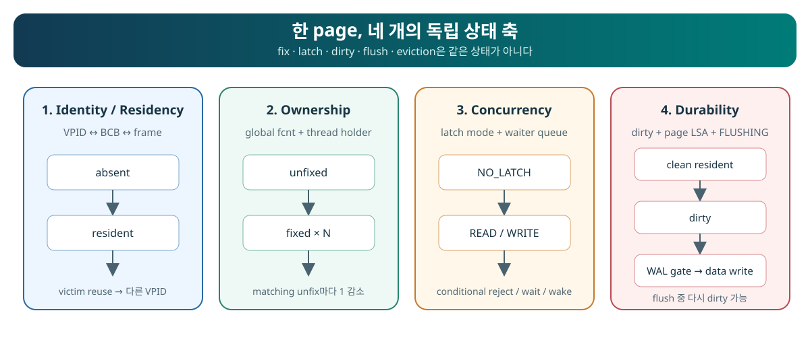
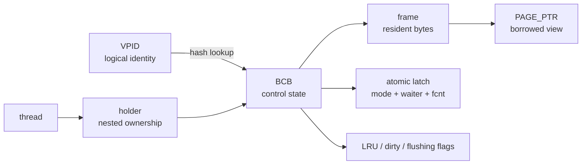
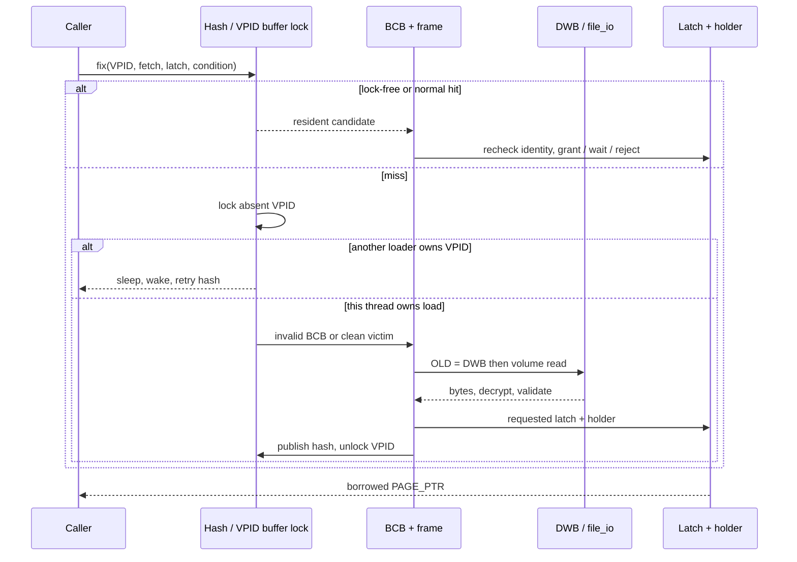
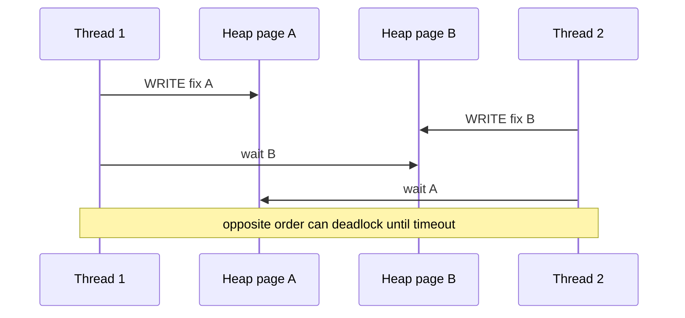
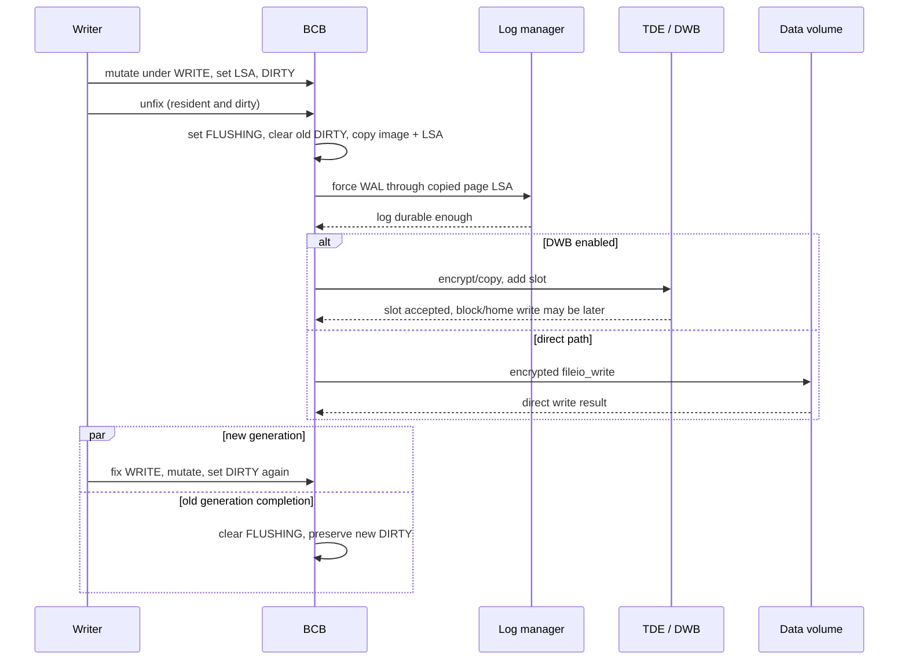
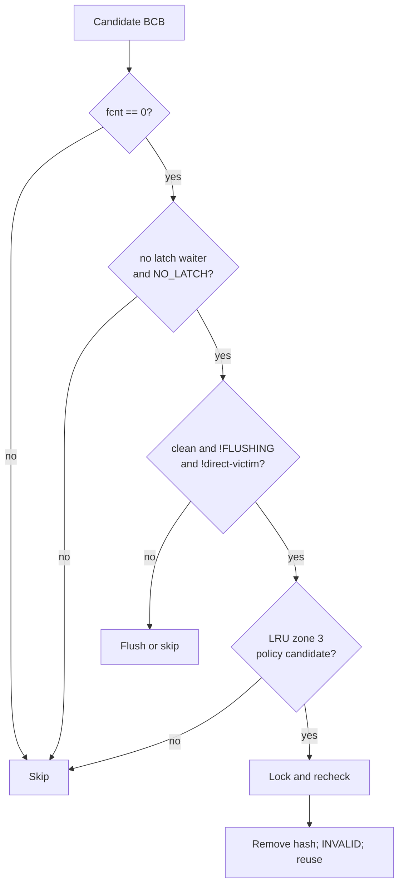
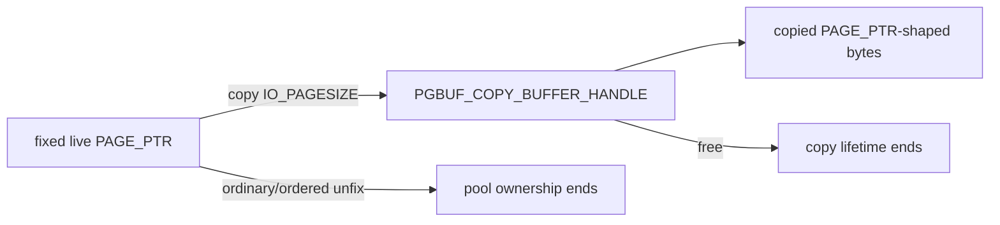
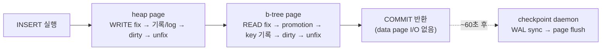

# CUBRID Page Buffer: page를 빌리고, 지키고, 기록하고, 다시 쓰는 법

> 대상: storage를 다루지만 DBMS buffer pool 선수 지식은 없는 엔지니어  
> 발표 시간: 본문 52분 + Q&A/teach-back 8분  
> 기준 source: CUBRID `f799e05d77d5300c6ea5753b4a6cc7caee6d8912`

> [!tip] 한 문장 결론
> `pgbuf_fix()`는 “page를 읽는 함수”가 아니다. **logical page identity를 resident frame에 결속하고, replacement를 막고, 요청한 latch와 thread ownership을 기록한 뒤, `pgbuf_unfix()`까지 유효한 borrowed `PAGE_PTR`를 돌려주는 protocol**이다.

이 자료는 [`page_buffer.h`](https://github.com/vimkim/cubrid/blob/f799e05d77d5300c6ea5753b4a6cc7caee6d8912/src/storage/page_buffer.h)에 노출된 106개 concrete function declaration을 95개의 logical callable Interface로 정리한다. debug/release wrapper를 하나로 합친 수치이며, 95개 중 94개는 [`page_buffer.c`](https://github.com/vimkim/cubrid/blob/f799e05d77d5300c6ea5753b4a6cc7caee6d8912/src/storage/page_buffer.c)에 구현되어 있다. 본문은 자주 쓰는 선택과 내부 원리를 설명하고, 부록은 나머지 specialized/maintenance/debug Interface를 찾는 지도다.

## 발표자가 먼저 지킬 evidence 경계

| 구분 | 이 자료에서 말할 수 있는 것 | 말하면 안 되는 것 |
|---|---|---|
| Pinned source | 이 revision의 control flow, state mutation, caller contract | 모든 release, 모든 timing/interleaving에 대한 영구 보장 |
| Historical runtime | 같은 revision의 sealed debug build에서 관찰한 cold/warm scan, holder/dirty activity, caller profile, backup boundary | 현재 새로 실행한 결과, physical device miss, 개별 WAL/DWB ordering |
| Live path monitoring | Pinned revision + logging-only probe의 instrumented lab build에서 새로 실행한 whole-pool trace: statement별 fix/hit/miss/promotion/dirty/WAL-flush sequence와 count (2회 재현) | probe가 없는 event(ordered watcher, victim assignment, DWB 내부), direct write와 DWB acceptance 구분, release-build fix count, timing/latency 결론 |
| Representative caller trace | heap, B-tree, file, recovery, vacuum, boot/daemon의 완전한 대표 함수 경로 | 모든 transitive call site를 전수 감사했다는 주장 |
| Interface inventory | 106 declaration, 95 logical Interface, 94 implementation | header에 있다고 모두 일반 caller가 써도 된다는 주장 |

기존 같은 revision 분석서는 report-phase independent audit를 통과했지만, 그 scope는 `fix`/`unfix` 중심이었다. 이 확장 발표본은 그 claim과 experiment를 제한적으로 재사용하며, 기존 readiness seal을 물려받았다고 주장하지 않는다. 자세한 근거는 [English evidence packet](./analysis/research/evidence-reuse.md)에 있다. Live path monitoring의 방법·수치·한계는 [English monitoring report](./analysis/monitoring/runtime-path-monitoring.md)에 있고, 발표용 요약은 부록 16.1이다.

## 0. 60분 읽기 지도

| 시간 | 화면 | 청중에게 먼저 물을 질문 |
|---:|---|---|
| 0–4분 | 한 문장 thesis | `PAGE_PTR`를 반환하기 전에 무엇이 참이어야 하는가? |
| 4–9분 | 네 개 상태 축, object graph와 규모감 | `PAGE_PTR` 주소가 page identity인가? `data_buffer_size=512M`이면 pool 메모리는 512MB인가? |
| 9–16분 | acquisition chooser와 fetch mode | “없음”이 정상인 호출은 무엇인가? |
| 16–24분 | hit/miss/wait/retry | 같은 cold VPID를 두 thread가 읽으면 누가 I/O를 하는가? |
| 24–30분 | latch/holder/unfix | pointer 하나에 release debt가 여러 개일 수 있는가? |
| 30–36분 | ordered watcher | page A를 잡은 채 B를 기다리면 무엇을 재검증해야 하는가? |
| 36–43분 | dirty/WAL/DWB/flush | successful flush 직후에도 resident page가 dirty일 수 있는가? |
| 43–48분 | replacement/daemon | clean + `fcnt==0`이면 즉시 victim인가? |
| 48–52분 | caller path로 contract 완성 | heap/B-tree/recovery caller가 각 protocol의 빈틈을 어떻게 채우는가? |
| 52–60분 | teach-back/Q&A | retry 하나, failure 하나를 넣어 page 생애를 설명하라. |

---

## 1. 한 page에는 상태 축이 네 개다



텍스트 대안: 하나의 page는 (1) 어느 `VPID`가 어느 BCB/frame에 resident한지, (2) 어느 thread가 몇 번 fix했는지, (3) READ/WRITE latch와 waiter가 어떤지, (4) resident image와 durable image 사이에 dirty/LSA/flush가 어떤지의 네 축을 가진다. 한 축의 변화가 다른 축의 변화를 자동으로 뜻하지 않는다.

| 축 | 핵심 질문 | 대표 state | 주된 protection |
|---|---|---|---|
| Identity / residency | 지금 frame은 어느 `(volid,pageid)`인가? | invalid, loading, resident, reused | hash mutex, VPID-keyed buffer lock, BCB mutex |
| Ownership | 누가 frame 재사용을 막고 있는가? | `fcnt==0`, fixed × N, thread holder nesting | atomic `fcnt`, per-thread holder |
| Concurrency | 누가 bytes를 읽거나 바꿀 수 있는가? | NO_LATCH, READ, WRITE, waiter | atomic latch tuple, BCB waiter queue |
| Durability | 어떤 generation이 memory/log/data volume에 있는가? | clean, DIRTY, FLUSHING, re-dirty | WRITE latch, page LSA, WAL gate, DWB/file I/O |

가장 중요한 네 개의 부등식은 다음과 같다.

```text
fixed       != resident
dirty       != durable
unfix       != flush
eviction    != deallocation
```

> [!speaker] 발표자 노트 — 4분
> - Prediction: “COMMIT 직후 page는 buffer에 fixed되어 있나요?”를 먼저 묻는다.
> - Reveal: 네 축을 하나씩 가리킨다.
> - Evidence: `page_buffer.c:382-849`, `page_buffer.c:9266-9312`, `page_buffer.c:10733-10961`.

## 2. 여섯 개의 명사를 먼저 분리하자



텍스트 대안:

1. Caller는 logical address인 `VPID`를 넘긴다.
2. Hash는 그 identity를 관리하는 `BCB`를 찾는다.
3. BCB는 resident bytes인 frame과 짝을 이룬다.
4. `PAGE_PTR`는 frame의 bytes를 보는 borrowed pointer다.
5. Global `fcnt`는 모든 thread의 fix 합으로 replacement를 막는다.
6. Per-thread holder는 한 thread의 nested fix와 watcher를 추적한다.

| 명사 | Owner | Lifetime | 틀리기 쉬운 표현 |
|---|---|---|---|
| `VPID` | storage allocation | logical page가 유효한 동안 | “memory address” |
| BCB (Buffer Control Block) | page-buffer pool | `pgbuf_initialize` → `pgbuf_finalize` | “page bytes” |
| frame | BCB/pool | 현재 resident identity generation | “영구 page” |
| `PAGE_PTR` | caller가 borrow | successful fix → matching unfix | “owning pointer” |
| `fcnt` | BCB global state | 모든 granted fix의 합 | thread의 nesting count |
| holder | current thread | 이 thread가 같은 BCB를 hold하는 동안 | global pin count |

`PAGE_PTR` 주소가 unfix 뒤에도 우연히 readable할 수 있다. 그래도 contract는 끝났다. 그 frame은 나중에 다른 `VPID`로 reuse될 수 있으므로, pointer나 page 내부 record/slot 주소를 보관하면 use-after-unfix가 된다.

### 2.1 그 명사들은 몇 개씩, 얼마나 큰가

여섯 명사에 규모를 붙이면 object graph가 메모리 실물이 된다. 전부 server 프로세스당 하나뿐인 static 전역 `pgbuf_Pool`에 매달려 있고, 요점은 **개수의 단위가 세 종류(frame당 / thread당 / transaction당)로 갈린다**는 것이다.

| 구조 | 몇 개? | 크기 (기본 `data_buffer_size` 512MB, 16KB page) | 근거 |
|---|---|---|---|
| frame (`iopage_table`) | frame당 1 — `num_buffers` = 512MB ÷ 16KB = 32,768 | ≈512MB, 메모리의 본체 | `page_buffer.c:1713`, `page_buffer.c:5583-5584` |
| BCB (`BCB_table`) | frame당 1, frame과 1:1 | 개당 ~140B(x86-64 추정) → ≈5MB | `page_buffer.c:5569-5581` |
| hash bucket (`buf_hash_table`) | 고정 `1<<20` = 1,048,576 — pool 크기와 무관 | 개당 ~56B(x86-64 추정) → ≈56MB 고정 | `page_buffer.c:295-296` |
| buffer lock slot (`buf_lock_table`) | thread당 1 — 한 thread는 동시에 한 page만 적재 | 수 KB | `page_buffer.c:5713` |
| LRU list | shared는 자동(`MAX_NTRANS` 기준, list당 ≥1000 pages, 최소 4 → 32,768 pages면 ≈32개), private는 transaction당 1 + vacuum worker당 1 | 개당 ~100B대 | `page_buffer.c:5749-5763`, `page_buffer.c:13965`, `log_common_impl.h:49-52` |
| holder | thread당 anchor 1(정확히 64B) + holder 7개 사전 할당 | 수 KB | `page_buffer.c:490`, `page_buffer.c:90` |

세 가지 관찰이 이후 섹션의 복선이다.

1. "thread당"인 것은 buffer lock slot과 holder뿐이다 — 둘 다 "이 thread가 지금 하는 일"(적재 1건, fix 목록)의 추적이다. §4의 miss 직렬화와 §5의 두 장부가 여기서 나온다.
2. "transaction당"인 것은 private LRU 하나뿐이다 — §8 replacement quota의 단위가 thread가 아닌 이유.
3. hash table은 pool을 줄여도 안 줄어드는 고정 비용이다. bucket을 기본 frame 수의 32배로 과할당해 chain 평균 길이를 1 미만으로 만든 설계다 — §4에서 hash 탐색을 싸다고 말할 수 있는 근거.

> [!speaker] 발표자 노트 — 1분
> - Prediction: "`data_buffer_size=512M`을 주면 buffer pool 메모리는 512MB인가요?" — 아니다. hash ≈56MB, BCB ≈5MB 등 metadata가 얹힌다.
> - 시간이 밀리면 표는 눈으로만 가리키고 "512는 512가 아니다, 단위는 frame·thread·transaction 세 종류다" 한 문장으로 끝낸다.
> - AOUT(2Q history)은 기본 `pb_aout_ratio=0.0`이라 꺼져 있다 — §8에서 "CUBRID는 2Q다"라고 단정하지 않는 안전선의 근거 (`system_parameter.c`의 default, `page_buffer.c:5818` 상한 32,768).
> - Evidence: `page_buffer.c:1713`, `page_buffer.c:295-296`, `page_buffer.c:5713`, `page_buffer.c:13965`.

## 3. Caller가 먼저 고르는 acquisition contract

### 3.1 어느 Interface family를 쓸 것인가

| Caller intent | 선택 | 정상적인 “없음” | 성공 시 debt | 핵심 위험 |
|---|---|---|---|---|
| 기존 allocated page, miss면 load | `pgbuf_fix(... OLD_PAGE ...)` | 아니오 | normal unfix 1회 | page type/ownership 불일치 |
| 방금 allocation한 VPID | `pgbuf_fix(... NEW_PAGE ...)` | 아니오 | normal unfix 1회 | `NEW_PAGE`가 disk allocation까지 한다고 오해 |
| resident일 때만 사용 | `OLD_PAGE_IF_IN_BUFFER` | 예, miss는 정상 `NULL` | page를 얻었을 때만 unfix | `NULL`을 I/O error로 오해 |
| deallocation 경쟁이 예상됨 | `pgbuf_fix_if_not_deallocated` | `NO_ERROR + NULL` | page가 non-NULL일 때만 unfix | return code와 output pointer 중 하나만 검사 |
| bounded retry 필요 | `pgbuf_fix_with_retry` | 아니오 | success마다 unfix | 아무 error나 retry한다고 오해 |
| recovery가 allocation state를 재구성 | `RECOVERY_PAGE`, deallocated modes | protocol별 | recovery scope가 unfix | normal code가 validation 우회에 사용 |
| temporary read-only 특수 경로 | `pgbuf_simple_fix` | `need_fix=false` miss | `pgbuf_simple_unfix` | normal fix/unfix와 섞기 |

### 3.2 일곱 `PAGE_FETCH_MODE`

| Mode | Caller가 아는 allocation state | Miss I/O | `PAGE_UNKNOWN` 해석 | 대표 owner | 잘못 쓰면 |
|---|---|---:|---|---|---|
| `OLD_PAGE` | allocated, 기존 내용 존재 | 예 | error | heap, B-tree, file metadata | deallocated/reused page를 정상으로 오판 |
| `NEW_PAGE` | file/disk layer가 이미 새 VPID를 allocation | 아니오 | 허용, caller가 initialize | file allocation callback | old bytes/LSA/type를 초기화하지 않음 |
| `OLD_PAGE_IF_IN_BUFFER` | 있으면 쓰고 없으면 그만 | 아니오 | 해당 없음 | best-effort probe | miss를 hard error로 처리 |
| `OLD_PAGE_PREVENT_DEALLOC` | latch 획득 전 deallocation race 가능 | 예 | normal old-page 규칙 | ordered/vacuum-related path | replacement pin으로 오해 |
| `OLD_PAGE_DEALLOCATED` | deallocation undo가 `PAGE_UNKNOWN`을 기대 | 예 | 기대값 | recovery undo | ordinary caller가 allocation 검사를 우회 |
| `OLD_PAGE_MAYBE_DEALLOCATED` | page가 사라졌을 수 있음 | 예 | unfix 후 `NULL` | vacuum/recovery maintenance | expected absence와 real error 혼동 |
| `RECOVERY_PAGE` | new/normal/deallocated 모두 가능 | 필요 시 | 모두 허용 | crash recovery | normal correctness check 제거 |

`NEW_PAGE`는 “새 page를 allocation하라”는 명령이 아니다. File/disk manager가 VPID를 먼저 allocation하고, page buffer는 old disk image를 읽지 않고 frame을 materialize한다. 이후 caller가 page type, layout, TDE, logging/LSA, dirty를 완성해야 한다 (`file_manager.c:5420-5592`).

### 3.3 Latch와 condition

| 선택 | 뜻 | 성공 후 | 실패 후 |
|---|---|---|---|
| `PGBUF_LATCH_READ` | compatible reader와 공유 가능한 physical bytes protection | READ ownership + release debt | 새 ownership 없음 |
| `PGBUF_LATCH_WRITE` | page bytes/layout mutation 독점 | WRITE ownership + release debt | 새 ownership 없음 |
| `PGBUF_UNCONDITIONAL_LATCH` | 필요하면 transaction timeout 범위에서 기다림 | grant 또는 timeout/interrupt | timeout도 가능; deadlock-free 보장 아님 |
| `PGBUF_CONDITIONAL_LATCH` | incompatible하면 기다리지 않음 | immediate grant | expected non-acquisition, caller가 retry/restart 선택 |
| `PGBUF_LATCH_FLUSH` | internal flush waiter reason | caller fix에는 사용 불가 | fix mode로 넘기면 invalid |

Zero-wait transaction의 unconditional request는 내부에서 conditional로 바뀔 수 있다. 따라서 “UNCONDITIONAL이면 반드시 기다린다”도 틀린 설명이다 (`page_buffer.c:2298-2311`).

### 3.4 Canonical read pattern

```c
PAGE_PTR page = pgbuf_fix (thread_p, &vpid, OLD_PAGE,
                           PGBUF_LATCH_READ,
                           PGBUF_UNCONDITIONAL_LATCH);
if (page == NULL)
  {
    return er_errid ();          /* no new release debt */
  }

/* Read only while this ownership is alive. */

pgbuf_unfix_and_init (thread_p, page); /* debt paid; page == NULL */
```

> [!speaker] 발표자 노트 — 7분
> - Prediction: “`OLD_PAGE_IF_IN_BUFFER`가 NULL이면 `er_errid()`를 반환해야 하나?”
> - Contract: success일 때만 release debt가 생긴다.
> - Skip if behind: recovery mode의 세부 차이는 부록으로 보낸다.

## 4. `pgbuf_fix()` 내부: hit와 miss는 같은 postcondition으로 합쳐진다




텍스트 대안:

1. READ 조건이 맞으면 unlocked hash scan과 atomic `fcnt` 증가를 쓰는 fast hit를 먼저 시도한다.
2. Normal hit는 BCB mutex를 얻은 뒤 VPID를 다시 확인한다. Lookup 중 victim reuse가 가능하기 때문이다.
3. Miss이면 hash anchor에 VPID-keyed load record를 설치한다.
4. 같은 VPID의 다른 miss는 loader의 BCB pointer를 직접 받지 않는다. 깨어난 뒤 hash를 다시 찾는다.
5. Loader는 invalid BCB, clean victim, direct-victim wait 순으로 frame을 구한다.
6. OLD page는 DWB copy를 먼저 찾고 없으면 volume에서 읽고 decrypt/validate한다. NEW page는 old bytes를 읽지 않는다.
7. Latch와 holder가 성공한 뒤에만 hash에 publish한다.
8. Hit와 miss 모두 “identity + residency + latch + ownership”이라는 같은 success postcondition으로 끝난다.

### 4.1 세 lock을 섞어 부르지 말 것

| Synchronization | 보호하는 것 | Lifetime |
|---|---|---|
| Hash mutex | hash/load chain 구조 | lookup/publication의 짧은 critical section |
| VPID-keyed buffer lock | cold miss에서 loader 하나만 publish | load 시작 → publish/cleanup |
| BCB mutex | VPID recheck, waiter queue, multi-field flags/LRU/flush transition | 짧은 internal state transition |
| Page latch | caller가 보는 resident bytes/layout | successful fix → unfix |
| Transaction lock | logical row/class conflict와 visibility | transaction protocol |

Transaction lock이 있어도 page latch는 필요하다. Transaction lock은 “누가 logical object를 바꿀 수 있는가”를, page latch는 “지금 resident bytes 구조가 깨지지 않는가”를 다룬다.

### 4.2 Fast path도 단순하지 않다

Lock-free READ hit는 현재 latch가 READ이고, waiter가 없고, `fcnt>0`이며, VPID가 맞을 때 CAS로 `fcnt`를 증가시킨다 (`page_buffer.c:7725-7786`). 이 revision에는 성공한 CAS 뒤 VPID를 다시 확인하는 단계가 없다. 따라서 안전성은 “positive `fcnt`인 BCB는 victim reuse되지 않는다”는 별도 invariant에 의존한다. 이는 구현된 control flow이지 ABA-free를 형식적으로 증명했다는 말은 아니다.

### 4.3 Historical runtime card: cold → warm

같은 revision의 captured run `exp1-observation-r2`에서 10,000-row scan의 checksum은 두 번 같았고, `Num_data_page_ioreads`는 첫 scan 46, 즉시 반복 scan 0이었다.

- 관찰: 첫 phase는 read activity가 있었고 두 번째는 resident reuse signature를 보였다.
- 해석: miss/load와 hit 절반을 이 workload가 실행했다.
- 증명하지 못한 것: physical device miss, exact VPID/frame, DWB 대 home-volume source, duplicate-loader concurrency.

> [!note] Live monitoring 확인 (부록 16.1)
> Instrumented build의 whole-pool trace에서도 같은 signature가 재현됐다. 재시작 후 첫 full scan은 `READ_FROM_DISK` 9회(t_mon heap chain `1|2944–2950` + b-tree root + catalog b-tree), 즉시 반복 scan은 0회였다. 반복 scan은 fix 자체도 327→248로 줄었는데, catalog page fix가 6→0으로 사라진 것과 일치한다 — plan/statistics caching이 compile-time 접근을 건너뛴 관찰이다(인과 증명 아님).

> [!speaker] 발표자 노트 — 8분
> - Prediction: “OS page cache가 warm이면 CUBRID buffer miss가 아닌가?”
> - Answer: CUBRID residency와 아래 device/OS cache latency는 다른 layer다.
> - Failure edge: no victim, read/decrypt/validation failure, conditional reject.

## 5. Latch, holder, promotion, unfix: 두 장부와 하나의 빚

### 5.1 Latch grant matrix

| Existing state | Request | 결과 |
|---|---|---|
| `NO_LATCH` | READ/WRITE | mode 설정, `fcnt=1`, holder 생성 |
| READ, waiter 없음 | READ | shared grant, `fcnt++` |
| READ, waiter 있음, 같은 holder reentry | READ | nested reentry 허용 |
| READ, waiter 있음, 새 reader | READ | no barging: conditional fail 또는 queue |
| WRITE, 같은 holder | READ/WRITE | nested grant |
| sole READ holder | WRITE | in-place promotion 가능 |
| 다른 reader 존재 | WRITE | conditional fail 또는 own READ fixes를 내려놓고 front queue |
| incompatible | READ/WRITE | reject 또는 timed wait |

`waiter_exists`는 queue 자체가 아니라 “new reader가 barging하면 안 된다”는 atomic summary다. Promotion은 일반 writer보다 앞에 queue될 수 있고, leading readers는 batch wake될 수 있다. 이것은 strict FIFO 보장이 아니라 starvation을 줄이려는 policy다 (`page_buffer.c:6298-7590`).

### 5.2 왜 두 count가 필요한가

```text
BCB global fcnt
  = 이 frame을 victim reuse해도 되는가?

thread holder.fix_count
  = 이 thread가 같은 BCB에 대해 몇 번 release debt를 졌는가?
```

Pointer 하나를 두 번 fix하면 pointer 값은 같아도 debt는 두 개다. Global `fcnt`만 있으면 어느 thread가 debt를 갚아야 하는지 모른다. Holder만 있으면 다른 thread까지 포함해 frame을 reuse해도 되는지 빠르게 판단하기 어렵다.

### 5.3 Release ledger

| Operation | Dirty? | Flush? | Ownership 1개 release? | Caller lvalue NULL? |
|---|---:|---:|---:|---:|
| `pgbuf_unfix` | 아니오 | 아니오 | 예 | 아니오 |
| `pgbuf_unfix_and_init` | 아니오 | 아니오 | 예 | 예 |
| `pgbuf_unfix_and_init_after_check` | 아니오 | 아니오 | non-NULL일 때 | 예 |
| `pgbuf_set_dirty(..., DONT_FREE)` | 예 | 아니오 | 아니오 | 아니오 |
| `pgbuf_set_dirty(..., FREE)` | 예 | 아니오 | 예 | 아니오 |
| `pgbuf_set_dirty_and_free` | 예 | 아니오 | 예 | 예 |
| `pgbuf_flush_with_wal` | 아니오 | dirty면 synchronous attempt | 아니오 | 아니오 |
| `pgbuf_flush(..., FREE)` | 아니오 | 예 | 예 | 아니오 |
| `pgbuf_dealloc_page` | type/flags/dirty 변경 | 나중 | sole fix를 내부에서 소비 | caller가 직접 NULL 처리 |

`FREE`는 heap memory free가 아니다. “이 operation이 fix ownership 하나까지 release한다”는 boolean이다. `pgbuf_set_dirty_and_free`는 두 개의 unbraced statement로 expand되므로, braces 없는 `if`에서 macro statement hygiene도 지켜야 한다 (`page_buffer.h:388`).

### 5.4 Promotion의 pointer-to-pointer contract

`pgbuf_promote_read_latch(thread_p, &page, condition)`은 READ ownership을 WRITE로 바꾼다.

- `PGBUF_PROMOTE_ONLY_READER`: 내가 sole reader가 아니면 expected failure.
- `PGBUF_PROMOTE_SHARED_READER`: 다른 reader가 있으면 내 READ fixes를 잠시 내려놓고 front에 기다릴 수 있다.
- Blocking promotion 실패는 old ownership을 이미 release하고 `page = NULL`로 만들 수 있다.
- 성공하더라도 기다리는 동안 다른 writer가 page를 바꿨을 수 있으므로 old record pointer/decision을 다시 검증한다.

> [!note] Live monitoring 확인 (부록 16.1)
> Promotion은 실제 b-tree write path의 표준 단계다. 단일 row INSERT의 trace에서 b-tree page는 `OLD_PAGE READ`로 fix된 뒤 `PROMOTE_READ_TO_WRITE success` → `SET_DIRTY`로 이어졌고, promotion 횟수는 insert된 row 수와 정확히 일치했다(1 row → 1회, 200 rows → 200회). Heap page는 promotion 없이 처음부터 WRITE로 fix됐고, non-indexed column UPDATE는 promotion 0회였다. Promotion은 fix/unfix 장부에 새 항목을 만들지 않으므로, probe 없이는 “READ fix된 page가 dirty해졌다”로만 보인다.

> [!warning] Source-confirmed rare failure
> 여러 latch grant path는 atomic `fcnt`를 증가시킨 뒤 새 holder allocation에 실패하면 assert/NULL을 반환하지만 visible rollback이 없다. 정상적인 caller-owned pointer는 없지만 internal accounting이 완전히 복구된다고 일반화하면 안 된다 (`page_buffer.c:6465-6470`, `6516-6522`, `6607-6613`, `7763-7773`).

## 6. 두 page를 잡는 순간: ordered watcher

Plain fix 두 개를 반대 순서로 기다리면 page-latch cycle을 만들 수 있다.



텍스트 대안: Thread 1은 A를 잡고 B를 기다리고, Thread 2는 B를 잡고 A를 기다린다. Ordered watcher protocol은 group/rank/VPID total order를 만들고, 필요한 경우 기존 page를 release한 뒤 정렬 순서로 refix하여 이 wait cycle을 피한다.

Ordered order는 다음 tuple이다.

```text
(heap group = header VPID, rank, target VPID)

rank: HEAP_HDR < HEAP_NORMAL < HEAP_OVERFLOW
```

### 6.1 Safe pattern

```c
PGBUF_WATCHER watcher;
PGBUF_INIT_WATCHER (&watcher, PGBUF_ORDERED_HEAP_NORMAL, &hfid);

int error = pgbuf_ordered_fix (thread_p, &vpid, OLD_PAGE,
                               PGBUF_LATCH_WRITE, &watcher);
if (error != NO_ERROR)
  {
    /* Inspect every watcher: partial refix may leave some pgptr NULL. */
    return error;
  }

if (watcher.page_was_unfixed)
  {
    /* Re-read slots, records, and every pointer derived from old page bytes. */
  }

/* Log/mutate under watcher.pgptr. */
pgbuf_ordered_set_dirty_and_free (thread_p, &watcher);
```

### 6.2 Watcher family의 역할

| Interface | 언제 쓰는가 | Ownership effect |
|---|---|---|
| `PGBUF_INIT_WATCHER` | 첫 ordered acquisition 전 group/rank 설정 | ownership 없음 |
| `pgbuf_ordered_fix` | heap/overflow multiple-page access | watcher에 fix ownership 부여 |
| `pgbuf_attach_watcher` | 이미 plain-fixed page를 ordered protocol에 편입 | 새 fix 없이 bookkeeping attach |
| `pgbuf_replace_watcher` | scan cache 등으로 bookkeeping transfer | fix count 변화 없음 |
| `pgbuf_ordered_callback` | ordered pages를 잡은 상태에서 기다려야 하는 callback | release → callback → sorted refix |
| `pgbuf_get_condition_for_ordered_fix` | full ordered fix가 불가능한 vacuum 특수 경로 | 새 page가 앞서면 CONDITIONAL 제안 |
| `pgbuf_ordered_unfix` | watcher ownership 종료 | watcher detach + normal unfix |

Partial refix failure에서는 requested page가 release되고, 기존 watcher 중 일부는 복구됐지만 일부는 `NULL`일 수 있다. Error path가 “모두 fixed” 또는 “모두 unfixed”라고 가정하면 leak/use-after-unfix가 생긴다 (`page_buffer.c:12249-13398`).

### 6.3 실제 heap vacuum use case

`heap_remove_page_on_vacuum()`은 candidate, heap header, previous, next page를 watcher로 잡는다. Ordered fix 뒤 `page_was_unfixed`이면 caller pointer를 refresh하고, page가 여전히 empty인지 다시 확인한다. Link update를 log/dirty한 다음, 제거할 page를 먼저 unfix하고 나서 `file_dealloc()`을 호출한다. Deallocation helper가 sole fix를 요구하기 때문이다 (`heap_file.c:3263-3571`).

> [!speaker] 발표자 노트 — 6분
> - Prediction: “refix 뒤 PAGE_PTR 주소가 같으면 slot pointer도 안전한가?”
> - Answer: 아니다. `page_was_unfixed`가 true면 content/state decision을 다시 만든다.

## 7. 수정은 durable이 아니다

### 7.1 Logged mutation pattern

```c
PAGE_PTR page = pgbuf_fix (thread_p, &vpid, OLD_PAGE,
                           PGBUF_LATCH_WRITE,
                           PGBUF_UNCONDITIONAL_LATCH);
if (page == NULL)
  {
    return er_errid ();
  }

/* Owning subsystem builds/appends its recovery record while bytes are stable. */
/* The log manager advances the page LSA according to that protocol. */
modify_page_bytes (page);
pgbuf_set_dirty_and_free (thread_p, page);
```

실제 heap/B-tree physical logging은 log payload를 만들기 위해 memory mutation이 먼저일 수 있다. 중요한 invariant는 WRITE latch 아래에서 before/after data가 안정되어 있고, recovery record/page LSA protocol이 성립한 뒤 dirty page를 release한다는 것이다. “항상 log function call이 byte mutation보다 먼저”라고 외우면 오히려 틀린다.

### 7.2 세 durability moment

| Moment | Resident page | Log | Data/write path | Crash 관점 |
|---|---|---|---|---|
| Memory mutation | newest, DIRTY | 아직/이미 record 준비 중 | old image | memory change만으로는 복구 불가 |
| WAL gate 통과 | copied page LSA까지 durable | redo 가능 | old image일 수 있음 | redo로 복구 가능 |
| Page-buffer flush completion | resident는 다시 dirty일 수도 있음 | 충분히 durable | direct write 완료 또는 DWB pipeline에 accept | DWB block/home write와 fsync는 뒤 경계일 수 있음 |

### 7.3 Flush sequence와 re-dirty



텍스트 대안:

1. Flusher는 BCB mutex 아래에서 old DIRTY를 지우고 FLUSHING을 set한 뒤 stable image/LSA를 복사한다.
2. BCB mutex를 놓고 copied LSA까지 WAL을 force한다.
3. Resident plaintext와 별도로 output image를 TDE encrypt한다. Direct path는 `fileio_write()` 완료를 기다리지만,
   DWB path의 `dwb_add_page()`는 block이 차지 않았으면 slot enqueue 뒤 return할 수 있다.
4. I/O 중 writer는 같은 resident BCB를 다시 dirty하게 만들 수 있다.
5. Page-buffer layer는 direct write 성공 또는 DWB slot acceptance 뒤 FLUSHING을 끝낸다. New DIRTY는 보존한다.
6. DWB block write, 대응 home write, filesystem synchronization은 daemon/checkpoint/backup의 뒤 경계에서 일어날 수 있다.

DWB (Double-Write Buffer)는 torn page를 줄이는 pipeline이다. WAL rule을 대신하지 않는다. WAL은 “data image가
가리키는 redo가 먼저 durable해야 한다”를, DWB는 “home write가 중간에 찢어졌을 때 먼저 기록된 온전한 copy를
찾을 수 있어야 한다”를 다룬다. 따라서 page-buffer flush success를 physical home persistence로 읽으면 안 된다.

> [!note] Live monitoring 확인 (부록 16.1)
> Dirty pool 상태의 shutdown flush에서 `WAL_SYNC_BEFORE_WRITE` → `FLUSHED_TO_DISK`가 39/39로 page마다 strict하게 pairing됐다 — data write 전에 log가 durable해지지 않은 page는 하나도 없었다. 반대 방향의 예외도 관찰됐다: checkpoint daemon은 UPDATE가 dirty하게 만든 heap page는 WAL sync 후 flush했지만, checkpoint 정보를 기록하는 volume header(`0|0`, `1|0`)는 WAL sync 없이 dirty→flush했다. 이것이 `oldest_unflush_lsa`가 NULL인 unlogged flush branch의 실제 사용처다. Checkpoint 후의 두 번째 shutdown은 flush할 것이 없었다(shutdown-1의 39 page와 대조).

### 7.4 어떤 flush Interface를 고르는가

| Need | Interface / owner | Ownership | Caller가 추가로 알아야 할 것 |
|---|---|---|---|
| Held page를 WAL-aware synchronous flush하고 error 확인 | `pgbuf_flush_with_wal` | fix 유지 | return `NULL` 검사; commit/eviction 아님 |
| Legacy one-page convenience | `pgbuf_flush` | `FREE`면 release | void라 I/O failure를 caller가 받을 수 없음 |
| Permanently latched page의 deferred request 처리 | `pgbuf_flush_if_requested` | fix 유지 | safe point에서 주기적으로 호출 |
| 특정/all volume pages | `pgbuf_flush_all*` | caller page ownership 없음 | all vs unfixed-only vs LSA-null recovery variant |
| Checkpoint cutoff까지 | `pgbuf_flush_checkpoint` | log/checkpoint owner | 모든 dirty page가 아니라 LSA-bounded selection |
| Clean victim 생산 | `pgbuf_flush_victim_candidates` | flush daemon | flush이지 eviction 자체가 아님 |
| Dirty ratio 기반 pacing signal | `pgbuf_flush_control_from_dirty_ratio` | maintenance | durability boundary가 아닌 heuristic |

`pgbuf_flush()` source 자체도 failure를 return할 수 없는 legacy wrapper라 사용을 권하지 않는다 (`page_buffer.c:3566-3577`). Failure-aware caller는 `pgbuf_flush_with_wal()`의 return을 확인한다.

> [!warning] Source-confirmed cleanup exceptions
> 일반 file/DWB submission I/O failure는 old DIRTY와 `oldest_unflush_lsa`를 복구하고 FLUSHING을 clear한다. 그러나 TDE encryption error와 DWB slot reservation error는 common rollback 전에 direct return한다 (`page_buffer.c:10809-10828`). DWB read error도 miss provisional-state cleanup 전에 return한다 (`page_buffer.c:8510-8515`). 이는 fault reachability가 runtime으로 확인된 production bug가 아니라, 이 revision의 source-visible cleanup exception/defect candidate다.

## 8. Replacement: eligibility와 policy를 분리하자



텍스트 대안: victim reuse를 하려면 먼저 fix와 latch waiter가 없어야 하고, dirty/flushing/direct-victim 상태가 아니어야 한다. 그 뒤 policy가 LRU zone 3 후보를 선택하고, BCB/hash protection 아래에서 모든 조건과 VPID를 다시 확인한 뒤에만 identity를 제거하고 frame을 reuse한다.

### 8.1 Safety predicate vs selection policy

| 종류 | 질문 | 현재 구현 |
|---|---|---|
| Eligibility | 지금 reuse하면 correctness가 깨지는가? | `fcnt`, latch/waiter, DIRTY, FLUSHING, direct-victim flags |
| Selection | 안전한 후보 중 누구를 먼저 쫓을까? | private/shared LRU, LRU1/2/3, victim hint, quota |
| History | 방금 쫓긴 page가 다시 왔는가? | bounded AOUT VPID ghost list |
| Progress | clean victim이 없으면 어떻게 기다림을 끝낼까? | flush daemon, direct-victim queues, standalone synchronous flush |

LRU1은 hot, LRU2는 buffer zone, LRU3는 victim zone이다. AOUT은 bytes/frame이 아니라 evicted VPID history다. Reload 후 첫 unfix에서 AOUT hit를 사용해 일회성 scan pollution과 reuse를 구분한다 (`page_buffer.c:9703-10720`).

### 8.2 Private/shared LRU

Private LRU는 한 session/transaction이 주로 쓰는 page를 격리하고, shared LRU는 cross-transaction 또는 promoted hot page를 담는다. Maintenance daemon은 activity를 보고 quota를 조정한다. 이 placement는 adaptive policy이며 caller-visible contract가 아니다. Caller는 “내 page가 private LRU1에 갈 것”을 correctness에 사용하면 안 된다.

### 8.3 Direct victim은 revocable promise다

Pressure가 높으면 allocator는 direct-victim queue에서 기다린다. Provider는 clean candidate를 특정 waiter에게 표시하고 깨운다. 그 사이 다른 thread가 page를 fix하면 `VICTIM_DIRECT`가 invalidation flag로 바뀌고, recipient는 candidate를 버리고 retry한다. 따라서 assignment는 final BCB recheck 전까지 소유권이 아니다 (`page_buffer.c:15429-15651`).

> [!speaker] 발표자 노트 — 5분
> - Prediction: “`fcnt==0`, clean, zone3이면 무조건 바로 evict되는가?”
> - Answer: waiter/flags/recheck와 selection timing이 남아 있다.
> - Skip if behind: private quota 계산식은 생략한다.

## 9. Caller가 correctness를 완성한다

Page buffer는 caller의 allocation knowledge, page layout, recovery record, retry decision까지 알 수 없다. 그래서 `page_buffer.h`의 Interface는 deep하지만 “fix 하나만 알면 끝”은 아니다.

| Use case | Caller flow | 왜 이 Interface인가 | All-exit cleanup |
|---|---|---|---|
| Heap insert | bestspace → ordered watcher → physical insert → log → dirty | header/heap/overflow를 함께 잡을 수 있음 | watcher를 scan cache로 transfer하거나 ordered unfix |
| Vacuum page removal | attach current watcher → header/prev/next ordered fix → revalidate → log links → release → file dealloc | release/refix 뒤 empty/deallocation 조건이 달라질 수 있음 | 모든 watcher inspect; 제거 page를 dealloc 전에 release |
| B-tree insert/split | optimistic nonleaf READ → child → 필요 시 promote → split/log/dirty | full path WRITE latch 비용을 피하고 conflict 시 root restart | child/parent/new pages를 system-op abort 전에 release |
| File allocation | allocate VPID → `NEW_PAGE` WRITE → callback init → TDE/log/dirty | old disk image를 읽으면 안 됨 | page output으로 transfer하거나 local unfix |
| Temporary destroy | `simple_fix(..., false)` → resident일 때만 temp dealloc | discard할 page를 pool에 새로 load하지 않음 | simple protocol로만 release |
| Permanent deallocation | postpone until commit → sole WRITE fix → `pgbuf_dealloc_page` | reuse-before-commit 방지, recovery 가능 | helper가 fix를 소비; caller pointer 사용 금지 |
| Checkpoint | start record/log flush → LSA-bounded page flush → file sync → end record/header | fuzzy checkpoint의 redo floor 계산 | failure 시 next checkpoint를 즉시 재요청 |
| Crash redo | `RECOVERY_PAGE` WRITE → page LSA gate → callback → set LSA → scope unfix | allocation metadata와 병렬 redo 순서에 덜 의존 | scope-exit가 모든 return에서 unfix |
| Volume reset | log/format → buffered metadata build → flush/invalidate → raw reset | raw I/O와 cached image coherence 유지 | doomed volume도 invalidate/cleanup |

### 9.1 Heap mutation의 실제 순서

`heap_insert_logical()`은 page를 물리적으로 수정하고, 그 stable before/after 상태로 recovery record를 append한 뒤, `pgbuf_set_dirty(..., DONT_FREE)`를 호출한다. 마지막에 watcher를 scan cache로 넘기거나 ordered unfix한다 (`heap_file.c:23120-23325`). 여기서 핵심은 “log function이 언제나 첫 줄”이 아니라 다음 세 가지다.

1. WRITE latch가 mutation과 log-data construction 동안 bytes를 안정시킨다.
2. Dirty page를 release하기 전에 recovery protocol과 page LSA가 성립한다.
3. Success/error 모두 watcher ownership을 정확히 transfer하거나 release한다.

### 9.2 B-tree가 restart를 선택하는 이유

B-tree insert는 nonleaf를 READ로 시작하고 leaf/변경 필요 page만 WRITE로 잡는다. Parent promotion이 실패하면 child와 parent를 release하고 traversal mode를 WRITE로 바꿔 root부터 restart한다 (`btree.c:28237-28845`). 기다리면서 latch-order cycle을 키우는 대신, higher-level algorithm이 이미 제공하는 restart seam을 사용한다.

### 9.3 Recovery에서 `RECOVERY_PAGE`가 필요한 이유

Redo는 sector reservation record와 page record가 parallel하게 진행될 수 있다. Normal allocation validation만 따르면 “아직 reservation metadata에 보이지 않는다”는 이유로 redo해야 할 page를 거부할 수 있다. Recovery는 `RECOVERY_PAGE`로 frame을 얻고, page LSA가 record LSA 이상이면 skip, 아니면 apply/set LSA/dirty한다 (`log_recovery.c:497-536`, `6407-6431`).

> [!speaker] 발표자 노트 — 4분
> - 질문: “page latch만 지키면 왜 caller code가 여전히 어려운가?”
> - 답: ordering, logical locks, page layout, logging, retry, transaction boundary는 caller의 Interface obligation이다.

---

# 발표 중에는 펼치지 않는 참고 부록

본문 52분은 section 9에서 끝난다. Section 10–18은 8분 Q&A에서 질문이 나올 때만 열어 보는 owner/failure/
observability/evidence/comparison reference이며, A–F는 더 깊은 contract card와 질문 은행이다.

## 10. Public이지만 general-purpose가 아닌 Interface

“Header에 export되어 있다”와 “아무 storage caller나 사용해도 된다”는 다른 말이다.

| Family | 대표 Interface | 정상 owner | 일반 caller가 부르면 안 되는 이유 |
|---|---|---|---|
| Lifecycle | `pgbuf_initialize`, `pgbuf_finalize` | transaction/boot lifecycle | global pool의 유일한 create/destroy order |
| Thread/session | `pgbuf_thread_variables_init`, private-LRU assign/release | worker/session/vacuum lifecycle | holder anchor와 quota ownership이 필요 |
| Daemon | `pgbuf_daemons_init/destroy`, direct-victim maintenance, assign-flushed-pages | boot/thread manager | scheduler/task state와 flush gate에 의존 |
| Recovery | `pgbuf_rv_*`, `pgbuf_log_*`, deallocation callbacks | recovery dispatch/file manager | caller-supplied `LOG_RCV`, system-op/LSA semantics |
| Vacuum hint | `pgbuf_notify_vacuum_follows` | log/B-tree/vacuum | replacement hint일 뿐 fix/latch가 아님 |
| Validation/debug | page-type checks, fixed-page dump, debug watcher helpers | assertions/diagnostics | snapshot/check이지 ownership grant가 아님 |
| Observability | `pgbuf_peek_stats`, daemon stats, `pgbuf_start_scan` | monitor/SHOW framework | 일부 값을 lock 없이 읽는 approximate snapshot |
| Scan copy | opaque copy-buffer family | cached heap scan | dummy BCB/frame copy이며 real pool fix가 아님 |
| Hash/format adapters | VPID hash/compare, state-format macros | generic hash/log formatting | page ownership effect가 없음 |

### 10.1 Pool과 daemon lifecycle

`pgbuf_initialize()`는 BCB/frame, hash, VPID load locks, LRU, invalid list, AOUT, holders, quotas, monitors, victim/checkpoint queues 순으로 global volatile state를 만든다. 실패하면 `pgbuf_finalize()`로 partial teardown하고 `ER_FAILED`를 반환한다 (`page_buffer.c:1649-2114`).

`pgbuf_finalize()`는 dirty page를 flush하는 operation이 아니다. 정상 shutdown은 page-buffer daemon을 먼저 멈추고, 상위 log/shutdown protocol이 durability를 끝낸 뒤 pool memory를 해제한다. “Finalize가 알아서 dirty page를 저장한다”는 설명은 틀리다.

Server mode에는 네 daemon 역할이 있다.

| Daemon | 역할 |
|---|---|
| `pgbuf-maintain` | private/shared quota 조정, direct-victim backup assignment |
| `pgbuf-page-flush` | pressure/hit-ratio/wakeup에 따라 dirty victim candidate flush |
| `pgbuf-page-post-flush` | completed BCB의 FLUSHING 정리, waiter wake, direct assignment |
| `pgbuf-flush-control` | file-I/O flush-control token 보충 |

Daemon object는 recovery 중 생성될 수 있지만 task는 `BO_IS_FLUSH_DAEMON_AVAILABLE` gate가 열리기 전에는 pool work를 하지 않는다 (`boot_sr.c:2363-2444`, `page_buffer.c:16975-17255`).

### 10.2 Temporary simple fix는 별도 protocol이다

`pgbuf_simple_fix()`는 temporary volume의 read-only access 전용이다.

- Hit이면 page latch와 holder 없이 `fcnt`만 증가시킨다.
- `need_fix=false` miss는 load하지 않고 `NULL`을 반환한다.
- `pgbuf_simple_unfix()`는 `fcnt`만 감소시킨다.
- General `pgbuf_fix`/`pgbuf_unfix`와 섞거나 concurrent writer가 있는 page에 쓰면 안 된다.
- `pgbuf_dealloc_temp_page(..., true)`는 type/flags/dirty를 reset하고 simple fix까지 소비한다.

Temporary file destroy가 pool에 없는 discard 대상까지 읽어오지 않기 위해 이 특수 경로를 사용한다 (`file_manager.c:4073-4366`, `page_buffer.c:2700-2838`).

### 10.3 Opaque scan-copy는 `PAGE_PTR` 모양의 snapshot이다



텍스트 대안: heap scan은 fixed live page를 caller-owned opaque buffer로 copy할 수 있다. Live page의 fix를 release한 뒤에도 copy는 handle이 살아 있는 동안 읽을 수 있다. 하지만 copied pointer는 hash/holder/latch/LRU가 없는 dummy BCB의 bytes이므로 `pgbuf_unfix`, dirty, flush에 넘기면 안 된다.

| Interface | Contract |
|---|---|
| `pgbuf_copy_buffer_alloc` | OOM이면 `NULL`; real pool fix 없음 |
| `pgbuf_copy_page_for_scan` | source가 아직 fixed일 때 `IO_PAGESIZE`와 VPID를 copy |
| `pgbuf_copy_buffer_get_page_ptr` | handle lifetime의 snapshot pointer 반환 |
| `pgbuf_copy_buffer_free` | handle과 copied pointer lifetime 종료; `free(NULL)` 안전 |

Heap scan cache는 OOM이면 error 없이 ordinary COPY mode로 degrade한다 (`heap_file.c:6439-6465`, `page_buffer.c:910-981`).

## 11. Invalidate, deallocate, victim reuse는 세 가지다

| Operation | Logical allocation | Resident mapping | Dirty handling | Fix debt |
|---|---|---|---|---|
| `pgbuf_unfix` | 유지 | 보통 유지 | 변경 없음 | 1개 소비 |
| `pgbuf_flush*` | 유지 | 유지 | stable generation write | variant별 유지/소비 |
| `pgbuf_invalidate` | 유지 | 제거 시도 | dirty면 먼저 synchronous flush | caller fix 소비 |
| `pgbuf_invalidate_all` | 유지 | 대상 volume의 unfixed mapping 제거 | dirty flush | live fixed page는 남을 수 있음 |
| `pgbuf_dealloc_page` | transaction/recovery상 deallocated | 당장 남을 수 있음 | `PAGE_UNKNOWN`, dirty, LRU bottom | sole fix 내부 소비 |
| Victimization | 유지 | identity 제거, frame reuse | clean이어야 함 | `fcnt==0` 필요 |

Persistent page invalidation은 commit decision 뒤의 postponed operation이어야 한다. 반면 deallocation은 old page type/flags를 log하고 `PAGE_UNKNOWN`으로 바꾼 뒤 dirty하게 남겨 나중에 flush/victim되게 한다. 예전처럼 즉시 invalidate하면 I/O를 기다려야 하므로 현재 구현은 logical deallocation과 cache eviction을 분리한다 (`page_buffer.c:3383-3559`, `15182-15337`).

## 12. Metadata, LSA, page type, TDE Interface

| 질문 | Interface | Preconditions / lifetime | 주의 |
|---|---|---|---|
| 이 pointer는 어느 page인가? | `pgbuf_get_vpid`, page/volume getters | page fixed | copy한 scalar/VPID만 fix 뒤 사용 가능 |
| BCB identity pointer가 필요한가? | `pgbuf_get_vpid_ptr` | page fixed | borrowed pointer를 수정/보관하지 않음 |
| 현재 latch는? | `pgbuf_get_latch_mode` | page fixed | diagnostic snapshot, synchronization 대체 아님 |
| Page가 바뀌었나? | `pgbuf_get_lsa`, `PGBUF_IS_PAGE_CHANGED` | page fixed, reference LSA 있음 | semantic object version 전체를 뜻하지 않음 |
| Logged boundary를 기록? | `pgbuf_set_lsa` | log/recovery owner, fixed page | dirty/logging과 별도; rejection path 확인 |
| Temporary page인가? | temp-LSA reset/set/check | fixed temporary context | temporary LSA page에 ordinary WAL logging 금지 |
| Layout type은? | page-type get/set/check | setter는 WRITE context | type set만으로 log/dirty가 자동 완성되지 않음 |
| Persisted bytes encryption은? | TDE get/set/recovery | fixed WRITE for set | `skip_logging`은 recovery/allocation protocol만 |

`pgbuf_set_dirty()`는 WAL record를 만들지 않고 page LSA도 바꾸지 않는다. `pgbuf_set_lsa()`는 처음 unflushed logged change의 `oldest_unflush_lsa`를 잡고 release build에서는 방어적으로 dirty도 set하지만, caller는 이를 “dirty 하나면 logging 완료”로 축약하면 안 된다 (`page_buffer.c:4921-5096`).

## 13. Copy-area helpers: 이름보다 좁은 실제 contract

| Interface | 현재 normal build behavior | 사용 조건 | Revision hazard |
|---|---|---|---|
| `pgbuf_copy_to_area` | resident이면 BCB mutex 아래 memcpy; miss + `do_fetch=true`면 READ fix/copy/unfix | `PAGE_AREA`, bounds valid, caller-owned output | comment는 false일 때 buffer한다고 쓰지만 code는 true일 때 fetch. false miss의 direct I/O는 보통 compile-out되어 untouched `area`를 반환할 수 있음 |
| `pgbuf_copy_from_area` | 항상 `NEW_PAGE` WRITE fix, type/TDE set, copy, `log_skip_logging`, dirty-free | WAL 관련 page change에 사용 금지 | normal build에서 `do_fetch` parameter가 사실상 무시됨 |

이 두 helper는 general page read/write abstraction으로 가르치면 안 된다. 특히 “return이 non-NULL이면 bytes가 채워졌다”는 가정은 `copy_to_area(..., false)` miss에서 위험하다 (`page_buffer.c:4701-4912`).

## 14. Failure를 만났을 때 다섯 질문

1. Failure 전에 어떤 ownership/count/flag를 얻었는가?
2. Wait/I/O 동안 VPID 또는 page bytes가 바뀔 수 있었는가?
3. 어떤 BCB flag, holder, hash/load record, waiter, LSA를 복구해야 하는가?
4. Caller는 `NULL`, error code, 여전히 owned page, 또는 stale pointer 중 무엇을 받는가?
5. Caller action은 unfix, no-op, retry, higher-level restart 중 무엇인가?

### 14.1 Failure unwind matrix

| Failure point | 이미 얻은 state | Caller-visible result | Caller action | Source caveat |
|---|---|---|---|---|
| `OLD_PAGE_IF_IN_BUFFER` miss | 없음 | `NULL`, expected | no unfix, alternate path | I/O 없음 |
| Conditional latch conflict | 새 ownership 없음 | `NULL`/failure state | no unfix, retry/restart | existing held pages는 caller 책임 |
| Timed/interrupt wait | waiter가 queue에서 제거됨 | `NULL`, timeout/interrupt | transaction policy에 맞게 abort/retry | timeout은 deadlock-freedom proof 아님 |
| `fix_with_retry` exhaustion | attempt별 provisional state 정리 | `ER_PAGE_LATCH_ABORTED` | higher-level error | 일부 error만 retry budget 대상 |
| Competing cold loader | sleep 후 ownership 없음 | internal retry | hash re-search | loader BCB pointer 직접 상속 안 함 |
| No victim | request queue 또는 sync flush path | wait/timeout 또는 `ER_PB_ALL_BUFFERS_DIRTY` | pressure policy | direct assignment은 revocable |
| Normal read/decrypt/validation failure | provisional BCB/load lock | `NULL` | no unfix | common cleanup은 invalid list/wakeup |
| DWB-read error | provisional state 있음 | `NULL` | no caller unfix | common cleanup bypass defect candidate |
| Holder OOM after grant | atomic `fcnt`가 증가했을 수 있음 | `NULL` | caller pointer 없음 | visible `fcnt` rollback 없음 |
| Promotion blocking failure | old READ ownership을 내려놓았을 수 있음 | error, `*page` may be NULL | pointer와 return 둘 다 검사 | old observation revalidate |
| Ordered partial refix failure | watcher별 상태 다름 | error | 모든 watcher inspect/release | all-or-none가 아님 |
| Ordinary flush I/O failure | old generation snapshot | `NULL` from aware wrapper | retry/propagate | dirty/oldest LSA 복구 |
| TDE/DWB-slot flush error | FLUSHING set, old DIRTY clear 이후 | error | stop/escalate | common rollback bypass candidate |
| Deferred unfix flush failure | async request | `pgbuf_unfix`는 void | direct propagation 불가 | error를 clear하는 current behavior |
| Scan-copy allocation OOM | pool ownership 없음 | `NULL` | cached optimization 포기 | heap scan은 ordinary mode로 degrade |

### 14.2 Revision-specific Interface hazards

| Hazard | Source-confirmed fact | 발표에서의 표현 |
|---|---|---|
| `pgbuf_fix_without_validation_release` | release header에 declaration/macro가 있지만 repo 전체에 definition/call site 없음 | “사용 가능한 fast path”가 아니라 호출 시 link failure가 나는 incomplete/dead Interface |
| Copy-helper `do_fetch` drift | comment와 executable branches가 반대/compile-out | code behavior를 authority로 삼고 일반 사용 금지 |
| `pgbuf_peek_stats` name drift | header output parameter 이름과 definition meaning 일부 불일치 | position/name만 보고 metric label을 만들지 않음 |
| Lock-free post-CAS identity | post-CAS VPID recheck 없음 | ABA-free guarantee로 과장하지 않음 |
| Early flush cleanup | TDE/DWB-slot error가 common rollback 전 return | source-visible defect candidate, runtime production bug로 단정하지 않음 |

## 15. Observability: counter 이름은 의미가 아니다

| Interface / metric | 실제 성격 | 해석 제한 |
|---|---|---|
| `pgbuf_peek_stats` | BCB를 주로 lock 없이 읽는 approximate gauge snapshot | transaction-consistent inventory 아님 |
| `pgbuf_daemons_get_stats` | 네 daemon의 runtime stats blocks | buffer/page state 자체가 아님 |
| `pgbuf_start_scan` | SHOW PAGE BUFFER STATUS용 19-column interval/snapshot row | 일부 BCB/status read는 approximate |
| SHOW `dirty_pages` | unlocked BCB-table scan의 현재 dirty gauge | 이전 SHOW와의 event delta가 아님 |
| `PSTAT_PB_NUM_DIRTIES` / `Num_data_page_dirties` | dirty-setting increment site의 누적 event counter | unique dirty page 수가 아님 |
| `pgbuf_has_any_waiters` | BCB lock을 잡고 READ/WRITE waiter 확인, flush waiter 제외 | 다음 instruction의 보장 아님 |
| `pgbuf_has_any_non_vacuum_waiters` | lock 없이 waiter list를 걷는 advisory check | deallocation correctness authorization으로 사용 금지 |
| `pgbuf_is_io_stressful` | low-priority direct-victim waiter 존재 heuristic | disk utilization 측정 아님 |
| `Num_data_page_dirties` | dirty-setting call activity | unique dirty page 수가 아님 |
| `Num_data_page_ioreads` | audited increment site의 page-buffer read attempts | physical device cache miss 수가 아님 |
| `Num_data_page_flushed` | victim-candidate flush path에서만 증가 | checkpoint 전체 flush counter가 아님 |

`pgbuf_start_scan()`과 `pgbuf_peek_stats()`는 hot path contention을 피하려고 의도적으로 approximate하다. Monitoring 값을 correctness branch의 lock-free oracle로 쓰지 말고, trend/diagnostic로만 사용한다 (`page_buffer.c:14748-14847`, `17323-17530`).

## 16. Experiment cards: historical과 live path monitoring

이 표의 수치는 새로 실행한 결과가 아니라, 같은 revision의 이전 report에 sealed된 historical observation이다. 새로 실행한 live 수치는 16.1에 있다.

| Card | Observation | 안전한 해석 | 증명하지 못한 것 |
|---|---|---|---|
| Cold/warm scan | checksum 동일, ioreads `46 → 0` | captured run의 miss signature → resident reuse | physical disk latency, exact VPID, duplicate-loader race |
| Read vs insert | empty read promotion `0/0`; insert promotion success `69589`, dirty calls `102114` | single-session read/mutation activity 차이 | competing waiter, row당 exact count, fairness |
| Covered/noncovered/update | covered `100/0`, payload `0/100`; update dirty `300` | index-covered, index→heap, mutation caller signature | exact C stack, all cleanup path, recovery execution |
| Dirty/backup boundary | 10,000 rows generation=1, dirty calls `51774`, second backup attempt success | mutation/commit과 synchronous backup operational boundary | per-page WAL-before-data, DWB, eviction, crash recovery |

첫 backup attempt는 target directory가 없어 실패했고, 성공 receipt는 `exp4-backup-2`다. 실패 history를 숨기지 않아야 reproducibility가 좋아진다.

### 16.1 Live path monitoring: 간단한 SQL이 실제로 타는 경로

위 historical card와 달리, 이 subsection의 수치는 **이 발표 준비에서 새로 실행한** whole-pool trace다.
Instrumented lab build(pinned revision + logging-only probe)의 서버를 `CUBRID_PGBUF_TRACE_VPID=all`로 띄우고,
statement마다 marker를 찍어 event stream을 잘랐다. 방법·전체 수치·한계는
[English monitoring report](./analysis/monitoring/runtime-path-monitoring.md), 재현은
[`analysis/monitoring/run-monitor.sh`](./analysis/monitoring/run-monitor.sh)다. 두 번 실행해 거의 모든 counter가
동일하게 재현됐다.

| Statement | fix 성공 | buffer hit | disk read | promotion | set-dirty | WAL sync → flush |
|---|---:|---:|---:|---:|---:|---|
| 접속만 (`select 1`) | 190 | 190 | 0 | 0 | 0 | — |
| `INSERT` 1 row | 268 | 268 | 0 | **1** | 5 (2 page) | — |
| `INSERT` 200 rows | 5161 | 5145 | 12 | **200** | 822 | — |
| 첫 full scan (재시작 직후) | 327 | 318 | **9** | 0 | 0 | — |
| 같은 scan 반복 | 248 | 248 | **0** | 0 | 0 | — |
| PK로 1 row `SELECT` | 283 | 283 | 0 | 0 | 0 | — |
| PK로 1 row `UPDATE` | 310 | 310 | 0 | 0 | 3 (1 page) | — |
| dirty pool로 shutdown | — | — | — | — | — | **39 → 39** strict pairing |
| checkpoint (~60s 후) | — | — | — | — | — | heap page는 WAL 후 flush; volume header는 WAL 없이 flush |
| checkpoint 후 shutdown | — | — | — | — | — | flush 0건 |

한 문장 요약: **fix의 대부분은 사용자 data가 아니라 catalog/session/validation traffic이고, mutation은 소수의
page만 dirty하게 만들며, durability 작업은 statement 시점이 아니라 flush 시점의 WAL gate에서 일어난다.**

단일 row INSERT의 mutation core (전체 268 fix 중 dirty를 만든 부분):

```text
#013339 thr=437 FIX_DONE 1|2945 OLD_PAGE WRITE ptype=heap fcnt=1        ← heap page는 처음부터 WRITE
#013363 thr=437 FIX_DONE 1|2945 OLD_PAGE_MAYBE_DEALLOCATED WRITE-cond   ← space 확인 후 conditional 재fix
#013364 thr=437 SET_DIRTY 1|2945  (x2)
#013391 thr=437 PROMOTE_READ_TO_WRITE 1|2881 success                    ← b-tree는 READ fix 후 promotion
#013392 thr=437 SET_DIRTY 1|2881  (x3)
```



텍스트 대안: INSERT는 heap page를 WRITE로 fix해 기록하고 dirty로 남긴 뒤 unfix하며, b-tree page는 READ로 fix한
뒤 promotion으로 WRITE를 얻어 key를 기록한다. COMMIT은 data page를 하나도 쓰지 않고 반환하고, 실제 page 쓰기는
나중에 checkpoint/flush daemon이 WAL gate를 통과한 뒤 수행한다.

관찰 시 주의 세 가지:

1. **Debug-build validation overhead** — fetch-time page validation이 volume header/bitmap을 반복 fix해서 전체
   fix 수를 지배한다(첫 full scan 327 fix 중 252가 volume header/bitmap). Release build의 고유 비용으로 읽지 말 것.
2. **Observer effect** — checkpoint를 기다리는 “idle” 구간의 fix 2264건은 `statdump` watcher가 2초마다 접속하며
   만든 traffic이었다. 관측 도구도 catalog를 읽는다.
3. **영원히 fix된 page** — boot가 WRITE fix한 vacuum-data page(`ptype=PAGE_VACUUM_DATA`) 하나는 unfix되지 않았다.
   이것을 제외하면 모든 구간에서 `UNFIX == FIX_DONE`으로 release debt 장부가 정확히 닫혔다.

## 17. PostgreSQL/InnoDB와 비교할 때의 안전선

| Axis | CUBRID | PostgreSQL | InnoDB | 판정 |
|---|---|---|---|---|
| Ownership | `fcnt` + holder + fix latch | pin과 content lock이 분리 | `buf_fix_count` + MTR memo | partial analogy |
| Miss publication | load/latch 뒤 resident hash publish | I/O-in-progress mapping을 먼저 publish | `BUF_IO_READ` state를 먼저 publish | partial analogy |
| Index→row | B-tree locator → heap page | nbtree TID → heap | clustered leaf가 row store | InnoDB에는 direct equivalent 없음 |
| WAL/redo gate | copied page LSA까지 WAL force | page LSN까지 WAL flush | newest modification LSN까지 redo persist | partial analogy |
| Torn-page defense | DWB | WAL full-page image | doublewrite | partial analogy |
| Replacement | LRU zones + private/shared + AOUT | clock sweep | midpoint old/new LRU | partial analogy |

함수명을 1:1로 번역하지 않는다. Responsibility, caller obligation, invariant가 모두 비슷할 때만 equivalent라고 부를 수 있다. 이 표의 대부분이 partial analogy인 이유다.

## 18. 최종 mental model

```text
1. Caller는 allocation knowledge로 fetch mode를 고른다.
2. pgbuf는 VPID를 resident BCB/frame에 결속한다.
3. Compatible latch와 global/per-thread ownership이 생긴 뒤 PAGE_PTR를 반환한다.
4. Caller는 page layout, transaction lock, logging/LSA, dirty, retry를 완성한다.
5. Unfix는 borrowed lifetime만 끝낸다.
6. Flush는 stable generation을 복사하고 WAL gate 뒤 direct write 또는 DWB enqueue를 수행한다.
   DWB block/home write와 fsync는 뒤 persistence boundary일 수 있다.
7. Concurrent writer는 flush 중 새 dirty generation을 만들 수 있다.
8. Replacement는 safety predicate를 통과한 clean/unfixed candidate를 policy로 고른다.
9. Invalidation, logical deallocation, victim reuse는 서로 다른 operation이다.
10. Specialized boot/recovery/vacuum/scan/daemon Interface는 owner protocol 밖에서 쓰지 않는다.
```

> [!tip] 30초 답변
> CUBRID page buffer는 VPID를 hash로 resident BCB/frame에 연결하고, fix count와 per-thread holder로 replacement를 막으며, READ/WRITE latch로 resident bytes를 보호한다. Miss는 VPID-keyed load lock으로 한 loader만 publish하고, 성공한 caller는 반드시 matching unfix를 한다. 수정은 WRITE latch 아래에서 logging/page LSA/dirty protocol을 지키며, unfix 뒤에도 page는 dirty resident일 수 있다. Flusher는 stable generation의 LSA까지 WAL을 먼저 durable하게 한 후 direct write 또는 DWB enqueue를 수행하며, DWB persistence는 뒤 경계일 수 있다. Clean/unfixed zone-3 page만 final recheck 뒤 victim으로 reuse한다.

---

# Interface contract card와 evidence index

## A. Complete logical Interface family index

Concrete debug/release spelling과 macro는 같은 caller contract로 합쳤다. Exact declaration-by-declaration ledger는 [English interface inventory](./analysis/research/api-inventory.md)에 있다.

| Family | Logical Interface / exported items | 분류 |
|---|---|---|
| Identity utilities | `pgbuf_hash_vpid`, `pgbuf_compare_vpid`, VPID/OID/state-format macros, sentinel objects | adapter / formatting |
| Lifecycle/thread/LRU | `pgbuf_initialize`, `pgbuf_finalize`, `pgbuf_thread_variables_init`, `pgbuf_assign_private_lru`, `pgbuf_release_private_lru`, `pgbuf_adjust_quotas` | maintenance/session |
| Normal acquisition | `pgbuf_fix`, `pgbuf_fix_with_retry`, `pgbuf_fix_if_not_deallocated`, declaration-only `pgbuf_fix_without_validation` | general + incomplete declaration |
| Temporary acquisition | `pgbuf_simple_fix`, `pgbuf_simple_unfix`, `pgbuf_dealloc_temp_page` | specialized temporary |
| Promotion/release | `pgbuf_promote_read_latch`, `pgbuf_unfix`, checked/init unfix macros, `pgbuf_unfix_all`, fix/hold count getters, permanent-hold check | general/diagnostic |
| Ordered ownership | watcher types/macros, `pgbuf_ordered_fix/unfix/callback`, attach/replace, ordered dirty-free, condition helper, debug watcher/fixed checks | specialized heap/overflow |
| Dirty/metadata | `pgbuf_set_dirty`, dirty-free macro, LSA get/set/temp helpers, page-type get/set/check, VPID/page/volume/latch getters, TDE get/set/recovery | general + log/recovery |
| Copy/scan snapshot | `pgbuf_copy_to_area`, `pgbuf_copy_from_area`, four opaque copy-buffer functions | specialized sort/heap scan |
| Flush | `pgbuf_flush`, `pgbuf_flush_with_wal`, deferred flush, all/unfixed/LSA-null, victim, checkpoint, dirty-ratio control | general + log/daemon maintenance |
| Invalidate/deallocate | `pgbuf_invalidate`, `pgbuf_invalidate_all`, `pgbuf_dealloc_page`, prevent-dealloc query, fix-if-not-deallocated | file/boot/vacuum specialized |
| Recovery | new-page log/redo/undo, deallocation redo/undo/compensate, flush-page callback/dump, TDE recovery | recovery dispatch |
| Replacement/daemon | direct-victim maintenance, keep-flusher-running, assign-flushed-pages, daemon init/destroy/stats, vacuum hint, I/O stress | server maintenance |
| Validation/observability | valid-page, page-type validation, waiters, fixed-page dump, `pgbuf_peek_stats`, page type for stats, interrupt hooks, `pgbuf_start_scan` | diagnostic/SHOW/control |
| Types/constants | seven fetch meanings, latch/condition/promotion/debug enums, ordered rank/group/watcher, aligned buffers, opaque copy handle, `FREE`/`DONT_FREE` | vocabulary |

Inventory result:

- 106 distinct concrete function names in the header.
- 105 definitions in `page_buffer.c`.
- 1 unmatched declaration: `pgbuf_fix_without_validation_release`.
- 95 logical callable Interface after collapsing 12 conditional debug/release pairs and adding the public dirty-free statement macro.
- 94/95 logical Interface backed by implementation.
- 12 named public types and 38 unique exported macros, excluding the include guard.

## B. Contract cards by family

### B.1 Normal fix

| Field | Contract |
|---|---|
| Preconditions | valid VPID; allocation knowledge matches fetch mode; READ/WRITE request; thread context initialized |
| May wait/I/O | hit may wait for latch; miss may wait for loader/victim and read/decrypt page |
| Success | correct resident identity, compatible latch, global `fcnt` and thread holder incremented |
| Failure | normally no caller-owned pointer/debt; expected miss modes distinguished from errors |
| Cleanup | one matching normal unfix for every successful normal fix |
| Performance | lock-free READ hit is conditional optimization, not semantic requirement |

### B.2 Ordered watcher

| Field | Contract |
|---|---|
| Preconditions | HEAP/OVERFLOW page; initialized clean watcher; correct heap group/rank |
| May wait/retry | first conditional attempt; may release/sort/refix held watcher pages |
| Success | watcher owns fixed page; `page_was_unfixed` may require full content revalidation |
| Failure | inspect every watcher; partial restore is legal current behavior |
| Cleanup | ordered unfix or ordered dirty-and-free, not plain bookkeeping bypass |

### B.3 Dirty/flush

| Field | Contract |
|---|---|
| Mutation precondition | WRITE-held page, except documented internal/read-only accessors |
| Dirty | says resident image is newer; neither logging nor durability by itself |
| Page LSA | recovery ordering/idempotence position; first unflushed change also tracks oldest LSA |
| Flush | stable image snapshot → WAL gate → TDE → direct write 또는 DWB enqueue → page-buffer generation completion |
| Re-dirty | new DIRTY during old FLUSHING must survive old-image completion |
| Error | failure-aware caller uses return-bearing Interface; early cleanup exceptions are documented |

### B.4 Scan copy

| Field | Contract |
|---|---|
| Owner | one heap scan/caller owns opaque handle |
| Source | copy only while live source is fixed |
| Returned pointer | snapshot-shaped `PAGE_PTR`, not a real pool hold |
| Forbidden | unfix, dirty, flush, shared concurrent mutation, use after handle free |
| OOM | allocation returns NULL; heap cached scan may degrade to ordinary path |

## C. 발표·개발 질문 55개와 독립 답변

질문 설계 agent는 답을 쓰지 않았고, 별도의 answer research agent가 이 발표본을 읽지 않은 채 pinned primary
source에서 `PGBUF-Q001`–`Q055`를 모두 풀었다. 아래는 그 답을 발표용 한국어로 압축한 것이다.

- **계약**: caller가 의존해도 되는 의미
- **구현 관찰**: 이 revision에서 확인한 동작이며 영구 API 약속은 아님
- **추론/검증 의무**: 안전성을 주장하려면 추가 proof 또는 실험이 필요함
- **의심 결함**: 비정상 control flow를 찾았지만 production bug로 재현하지는 않음

### C.1 Mental model과 Interface 선택

#### `PGBUF-Q001` — `fix` 성공은 정확히 무엇을 약속하나?

**답 — 계약.** 요청 VPID의 resident frame, replacement를 막는 fix 한 개, 요청한 READ/WRITE latch,
현재 thread의 holder 장부가 모두 성립한다. Pointer의 사용 기한은 대응하는 release까지다.

**개발 포인트.** Hit와 miss 모두 같은 BCB ownership grant로 끝난다. 주소가 같거나 이미 resident라는 이유로
unfix debt가 사라지지 않는다. 근거: `page_buffer.h:172-209`, `page_buffer.c:2256-2679,6298-6634`.

#### `PGBUF-Q002` — “Page”는 VPID, BCB, frame, `PAGE_PTR` 중 무엇인가?

**답 — 구현 관찰.** VPID는 논리 identity, hash의 값은 resident BCB, BCB는 latch·flag·LRU·LSA와 I/O frame을
소유하고, `PAGE_PTR`는 frame 내부를 가리킨다. `fcnt`는 전역 reuse 금지 수, holder는 thread별 release debt다.

**개발 포인트.** 같은 frame 주소가 나중에 다른 VPID를 담을 수 있다. Dump에서는 이 다섯 객체를 함께 맞춰야
한다. 근거: `page_buffer.c:382-517,744-893`.

#### `PGBUF-Q003` — Acquisition family는 어떻게 고르나?

**답 — 계약.** 할당된 page는 `OLD_PAGE`, 할당을 이미 소유한 새 VPID는 `NEW_PAGE`, I/O 없는 probe는
`OLD_PAGE_IF_IN_BUFFER`, deallocation race는 `OLD_PAGE_PREVENT_DEALLOC` 또는
`pgbuf_fix_if_not_deallocated`, redo는 `RECOVERY_PAGE`다. `pgbuf_simple_fix`는 read-only temporary protocol 전용이다.

**개발 포인트.** Fetch mode는 성능 힌트가 아니라 caller가 알고 있는 allocation 사실과 absence의 의미다.
근거: `page_buffer.h:172-187`, `page_buffer.c:2256-2838,15355-15405`.

#### `PGBUF-Q004` — `NULL`은 언제 정상 결과인가?

**답 — 계약.** Resident-only miss, conditional latch reject, 예상된 deallocation은 오류 없이 page가 없을 수 있고
새 ownership도 생기지 않는다. 그러나 I/O·validation·interrupt·timeout·allocation 오류도 `NULL`이다.

**개발 포인트.** `NULL`만 보지 말고 선택한 protocol의 status/error를 함께 판정한다.
근거: `page_buffer.c:2298-2353,2572-2615,6537-6594,15355-15405`.

#### `PGBUF-Q005` — `NEW_PAGE`가 해 주지 않는 것은?

**답 — 계약.** Disk page 할당, logical type 선택, subsystem byte 초기화, TDE policy, recovery log, 올바른 LSA,
dirty marking을 하지 않는다. 이미 할당된 VPID를 claim할 때 stale disk read만 피한다.

**개발 포인트.** Allocator가 allocate → `NEW_PAGE` fix → initialize/type/TDE → log → dirty/release를 완성한다.
근거: `page_buffer.c:8599-8632`, `file_manager.c:5420-5592`, `btree.c:5154-5193`.

#### `PGBUF-Q006` — Resident probe와 disk validity가 왜 다를 수 있나?

**답 — 계약.** Disk allocation, hash residency, on-page type은 서로 다른 사실이다. 할당됐지만 cache miss일 수 있고,
deallocated image가 `PAGE_UNKNOWN`으로 resident할 수 있으며, 같은 VPID가 다른 type으로 재사용될 수도 있다.

**개발 포인트.** 필요한 사실을 묻는 API를 골라 race 뒤 expected type을 다시 확인한다.
근거: `page_buffer.c:2256-2615,11066-11237,15355-15405`.

#### `PGBUF-Q007` — 언제 page buffer를 우회해 raw volume I/O를 해도 되나?

**답 — 계약.** 충돌하는 cached authority가 없거나, dirty cache를 flush하고 해당 volume buffer를 invalidate한 뒤의
reset·overwrite·remove 경계에서만 가능하다.

**개발 포인트.** `disk_format`과 checkpoint가 log force, page flush, invalidate/fsync를 어떤 순서로 소유하는지
동등한 quiescence를 세워야 한다. 근거: `disk_manager.c:511-814`, `page_buffer.c:3487-3559`,
`log_page_buffer.c:6901-7406`.

### C.2 Ownership, lifetime, release debt

#### `PGBUF-Q008` — Pointer 하나가 여러 release debt를 나타낼 수 있나?

**답 — 계약.** 그렇다. 같은 thread의 nested fix는 같은 주소를 돌려주면서 `fcnt`와 holder의 `fix_count`를
증가시킨다. 성공 횟수만큼 unfix해야 한다.

**개발 포인트.** `pgbuf_unfix_all`은 request 종료 시 leak 진단/최후 cleanup이지 정상 분기 정리 수단이 아니다.
근거: `page_buffer.c:416-460,3075-3373,6135-6183`.

#### `PGBUF-Q009` — Unfix 뒤에도 살아 있는 반환 pointer는 무엇인가?

**답 — 계약.** 값으로 복사한 결과만 살아 있다. `pgbuf_get_vpid()`는 copy지만 `pgbuf_get_vpid_ptr()`,
`pgbuf_get_lsa()`, page payload·record·slot 주소는 borrowed pointer다.

**개발 포인트.** Final unfix 전에 필요한 값을 복사하고 refix 전후 page-local 주소를 보관하지 않는다.
근거: `page_buffer.c:4959-4984,5208-5372`.

#### `PGBUF-Q010` — Watcher replacement는 ownership을 추가하나, 이전하나?

**답 — 계약.** `pgbuf_replace_watcher()`는 old watcher의 holder attachment를 clean한 new watcher로 옮긴다.
새 fix가 아니므로 `fcnt`와 `fix_count`는 변하지 않는다.

**개발 포인트.** 이후 cleanup owner는 new watcher 하나다. 둘 다 release하면 double-unfix, 둘 다 안 하면 leak이다.
근거: `page_buffer.c:13759-13799`, `heap_file.c:23120-23325`.

#### `PGBUF-Q011` — `FREE`와 release macro는 실제로 무엇을 소비하나?

**답 — 계약.** `FREE`는 memory free가 아니라 buffer hold 한 개를 소비한다. `DONT_FREE`는 유지한다.
`pgbuf_set_dirty_and_free`와 `pgbuf_unfix_and_init*`는 release 뒤 caller lvalue도 NULL로 만든다.

**개발 포인트.** `pgbuf_set_dirty_and_free`는 brace 없는 두 statement macro이며 일부 page macro는 인자를 반복
평가하므로 side effect expression을 넘기지 않는다. 근거: `page_buffer.h:40-92,382-390`,
`page_buffer.c:3566-3621,4921-4957`.

#### `PGBUF-Q012` — 왜 `fcnt`와 thread holder가 둘 다 필요한가?

**답 — 구현 관찰.** `fcnt`는 빠른 전역 replacement exclusion이고, holder는 owner 식별, nested debt, watcher,
latch check, 진단을 담당한다. `simple_fix`처럼 holder 없는 fix도 있어 한쪽만으로는 충분하지 않다.

**개발 포인트.** Simple family는 반드시 simple release/deallocation protocol과 짝짓는다.
근거: `page_buffer.c:382-467,2700-2804,6008-6183`.

### C.3 Latch, wait, promotion, lock order

#### `PGBUF-Q013` — Buffer hit인데도 왜 block하거나 timeout할 수 있나?

**답 — 계약.** Residency는 identity만 해결한다. Foreign WRITE, WRITE와 충돌하는 readers, 선행 promoter/writer
queue는 latch grant를 막는다. FLUSHING flag 자체는 latch compatibility 조건이 아니다. 다만 짧은 BCB mutex 점유나
synchronous FLUSH waiter가 만든 `waiter_exists`가 간접 대기를 만들 수 있다. Zero-wait는 conditional attempt로 바뀔 수 있다.

**개발 포인트.** Hit 여부와 latch latency를 분리해 관찰한다. 근거: `page_buffer.c:2298-2332,6298-6634,7051-7448`.

#### `PGBUF-Q014` — Conditional acquisition의 알고리즘 약속은?

**답 — 계약.** Incompatible page latch 뒤에서 기다리지 않고 ownership 없이 reject한다. Caller는 기존 page를
release/reorder하거나 상위 알고리즘을 restart한다.

**개발 포인트.** B-tree split의 conditional fix를 unconditional로 바꾸면 단순 latency가 아니라 새 wait edge와
deadlock 가능성을 만든다. 근거: `page_buffer.c:6537-6594,13815-13872`, `btree.c:28237-28845`.

#### `PGBUF-Q015` — `waiter_exists`가 제공하는 fairness와 제공하지 않는 것은?

**답 — 구현 관찰.** Blocked READ/WRITE가 있으면 새 reader barging을 막고, compatible reader batch 또는 writer
하나를 깨우며 sole promoter를 앞세운다. 그러나 strict FIFO, starvation-free, deadlock-free를 증명하지 않는다.

**개발 포인트.** Timeout·interrupt·FLUSH·batching이 queue 순서를 바꾼다. 근거: `page_buffer.c:6298-6634,7051-7589`.

#### `PGBUF-Q016` — Promotion은 caller의 기존 pointer와 관찰값에 무엇을 하나?

**답 — 계약.** `SHARED_READER` promotion은 자신의 READ fixes/holder를 빼고 기다린 뒤 WRITE ownership을 재구성할
수 있다. 사이에 다른 writer가 내용을 바꿀 수 있고 일부 실패는 `*pgptr_p = NULL`로 만든다.

**개발 포인트.** Status와 pointer를 모두 확인하고 key·slot·page-local 주소를 다시 계산한다.
근거: `page_buffer.h:205-209`, `page_buffer.c:2842-3064`, `btree.c:28074-28696`.

#### `PGBUF-Q017` — 왜 leading promoter는 하나뿐인가?

**답 — 구현 관찰.** Shared-reader promoter는 자신의 READ ownership을 내려놓고 queue head에 선다. 둘 이상을
허용하면 여러 former reader가 exclusive grant와 차감된 fix 복원을 경쟁하는 promotion cycle이 생길 수 있어
code가 거부한다.

**개발 포인트.** Progress는 queue policy만이 아니라 B-tree restart protocol과 함께 성립한다.
근거: `page_buffer.c:2849-3059,7051-7099`, `btree.c:28237-28845`.

#### `PGBUF-Q018` — `pgbuf_fix_with_retry()`는 무엇을 retry하고 무엇을 세나?

**답 — 구현 관찰.** 전체 unconditional fix를 다시 수행하고 unilateral abort와 두 latch-timeout 오류만 retry
budget을 소비한다. Default-case 오류는 멈추지만 `NO_ERROR`와 `ER_INTERRUPTED`는 budget을 소비하지도, loop를
멈추지도 않으므로 이 두 상태가 반복되면 `retry` 인자와 무관하게 unbounded retry가 가능하다. 포기할 때 최종 오류는
`ER_PAGE_LATCH_ABORTED`로 바뀔 수 있다.

**개발 포인트.** 숫자는 총 시도 횟수나 transaction retry 수가 아니다. 이 revision에서 direct caller는 찾지 못했다.
근거: `page_buffer.c:2125-2164,7148-7448`.

#### `PGBUF-Q019` — 어떤 lock이 어떤 state를 보호하며 어디서 recheck하나?

**답 — 구현 관찰.** Hash anchor는 chain, VPID buffer lock은 cold one-loader, BCB mutex는 identity/queue/multi-field,
page latch는 bytes, LRU mutex는 policy list, transaction lock은 logical resource를 보호한다.

**개발 포인트.** Hash lookup 뒤 BCB에서 VPID를, victim selection 뒤 unlink/reuse 조건을 다시 확인한다. Transaction
lock과 page latch를 같은 것으로 취급하지 않는다. 근거: `page_buffer.c:7600-8177,9324-9534,16656-16836`,
`lock_manager.c:2290-2330`.

### C.4 Ordered watcher protocol

#### `PGBUF-Q020` — Ordered watcher가 강제하는 total order는?

**답 — 계약.** `(heap-group volid/pageid, semantic rank, VPID volid/pageid)`이며 rank는 heap header, ordinary heap,
overflow 순이다. `PAGE_HEAP`과 `PAGE_OVERFLOW`만 참여한다.

**개발 포인트.** Watcher 없는 ordinary hold는 이 proof 밖이므로 섞으면 여전히 latch cycle이 가능하다.
근거: `page_buffer.h:166-167,219-249`, `page_buffer.c:12193-12247,12460-12639`.

#### `PGBUF-Q021` — `page_was_unfixed` 뒤 정확히 무엇이 stale인가?

**답 — 계약.** 이전 ownership interval에서 얻은 record/slot 주소, mutable layout offset, header/type assumption,
neighbor 선택, predicate 결과 전부다. Frame 주소가 같아도 내용은 바뀔 수 있다.

**개발 포인트.** Flag 확인 뒤 새 `watcher.pgptr`에서 파생값을 모두 다시 계산한다.
근거: `page_buffer.c:12250-13080`, `heap_file.c:3263-3571`.

#### `PGBUF-Q022` — Ordered-fix 실패는 all-or-none인가?

**답 — 계약.** 아니다. 요청 page는 release됐지만 일부 old watcher는 복원되고 뒤의 watcher는 NULL일 수 있다.

**개발 포인트.** 모든 watcher를 개별 검사해 non-NULL ownership만 unfix하고, 옛 page-local pointer는 전부 버린다.
근거: `page_buffer.c:12250-12267,12640-13080`, `heap_file.c:3537-3570`.

#### `PGBUF-Q023` — `pgbuf_ordered_callback()`이 지켜야 하는 invariant는?

**답 — 계약.** Release 대상 holder마다 `fix_count == watcher count`여야 하며 watcher set이 일관돼야 한다.
Callback은 ordered page를 놓은 상태에서 실행되고 새로 fix한 page를 남기면 안 된다.

**개발 포인트.** Callback 오류 뒤에도 refix를 시도하며 ownership 복원 실패가 더 강한 postcondition이라 우선한다.
근거: `page_buffer.c:13066-13400`, `bestspace.cpp:56-82,1564-1612`.

#### `PGBUF-Q024` — Ordered refix 동안 avoid-deallocation은 무엇을 보호하나?

**답 — 구현 관찰.** 잠시 unlatch된 logical page의 deallocation을 막을 뿐 replacement pin이나 frame-address
stability는 아니다. BCB가 victimized되어 새 BCB로 refix될 수도 있다.

**개발 포인트.** Safety는 deallocator가 counter protocol을 지킨다는 전제에 의존한다.
근거: `page_buffer.c:12460-13080,14733-14743,16249-16337`.

### C.5 Dirty, LSA, WAL, DWB, flush

#### `PGBUF-Q025` — Logged mutation에서 의도적으로 분리된 작업은?

**답 — 계약.** Byte mutation, undo/redo 생성·append, page LSA 갱신, dirty marking, unfix, commit, data-page flush는
별도 책임이다. `pgbuf_set_dirty()`는 dirty bookkeeping과 선택적 release만 한다.

**개발 포인트.** Dirty로 누락된 log를 보완할 수 없고 unfix나 commit만으로 home write를 추론할 수 없다.
근거: `page_buffer.c:4921-5096`, `heap_file.c:23120-23325`, `btree.c:29700-29872`.

#### `PGBUF-Q026` — Page LSA 외에 `oldest_unflush_lsa`가 왜 필요한가?

**답 — 구현 관찰.** Page LSA는 image의 최신 logged state이고, `oldest_unflush_lsa`는 그 BCB에 남은 최초의
미flush logged generation이다. Checkpoint는 후자로 대상을 고르고 남은 최소값을 redo floor로 돌려준다.

**개발 포인트.** Flush가 saved generation을 잠시 분리하고, 실패 시 복원하며, concurrent new generation은 별도로
보존한다. 근거: `page_buffer.c:4185-4678,4996-5081,10733-10961`.

#### `PGBUF-Q027` — Flush 성공 뒤 resident page가 왜 다시 DIRTY일 수 있나?

**답 — 구현 관찰.** Flusher가 old DIRTY를 FLUSHING generation으로 분리해 copy/submit하는 동안 허용된 writer가
resident image를 새 generation으로 dirty할 수 있다.

**개발 포인트.** DWB가 켜졌다면 page-buffer layer의 completion은 slot acceptance일 수 있고 block/home write는
나중일 수 있다. “Old responsibility retirement”와 “현재 resident page dirty”는 양립하며 새 DIRTY/oldest LSA를
지워서는 안 된다. 근거: `page_buffer.c:10733-10961,16020-16137`, `double_write_buffer.cpp:2715-2820`.

#### `PGBUF-Q028` — WAL과 DWB는 왜 대체재가 아니라 보완재인가?

**답 — 계약/구현 관찰.** WAL force는 copied page LSA까지 redo record를 data-write path보다 먼저 durable하게 한다.
DWB pipeline은 대응 home write 전에 whole-page intermediate를 만드는 torn-page 방어다.

**개발 포인트.** `dwb_add_page()`는 block이 차지 않으면 enqueue 뒤 return할 수 있다. DWB block/home write와 sync는
뒤 경계이므로 어느 것도 page-buffer flush success만으로 final persistence를 뜻하지 않는다.
근거: `page_buffer.c:10733-10961`, `log_page_buffer.c:4150-4189`, `double_write_buffer.cpp:2520-2820`.

#### `PGBUF-Q029` — Safe flush는 언제 write, defer, wait, return하나?

**답 — 구현 관찰.** Clean이면 즉시 return한다. Unlatched, READ-latched, 또는 caller-owned WRITE는 snapshot할 수
있다. Foreign writer면 async request/defer하고, 이미 FLUSHING이면 sync caller는 FLUSH waiter로 기다리며 async는
progress request만 남긴다.

**개발 포인트.** Long writer는 `pgbuf_flush_if_requested()`를 호출한다. READ-held flush 허용은 이 revision의
동작이지 넓은 portability contract로 보지 않는다. 근거: `page_buffer.c:3589-3659,7101-7145,7474-7511,8810-8901`.

#### `PGBUF-Q030` — Checkpoint flush가 “모든 dirty page flush”가 아닌 이유는?

**답 — 계약.** Checkpoint boundary 안의 permanent dirty generation을 `oldest_unflush_lsa`로 고르고 I/O locality에
맞춰 정렬하며, 남은 최소 책임을 보고한다. Boundary 이후 generation은 dirty로 남을 수 있다.

**개발 포인트.** `logpb_checkpoint`가 log force, data flush, fsync, checkpoint record/header, volume metadata와 DWB
sync를 함께 소유한다. 근거: `page_buffer.c:3663-3758,4185-4678`, `log_page_buffer.c:6901-7406`.

#### `PGBUF-Q031` — 모든 flush 실패가 retry 가능한 DIRTY state를 복원하나?

**답 — 의심 결함.** 일반 home/DWB I/O failure는 old DIRTY와 oldest LSA를 복원하고 FLUSHING을 지우며 waiter를
깨운다. 그러나 TDE encrypt와 DWB-slot 준비 오류는 common rollback 전에 return한다.

**개발 포인트.** Void unfix의 deferred flush error도 clear될 수 있다. Fault test는 return만 아니라 internal
flag·waiter 복원을 검사해야 한다. 아직 fault injection이나 production 재현은 없다.
근거: `page_buffer.c:6657-6883,10733-10961,14888-14922`.

### C.6 Replacement, pressure, background progress

#### `PGBUF-Q032` — Clean이고 `fcnt == 0`인데도 왜 바로 victim이 아닌가?

**답 — 구현 관찰.** Idle latch와 waiter 부재, non-FLUSHING, direct-victim/invalidation state, eligible LRU zone,
마지막 VPID/state recheck까지 통과해야 한다.

**개발 포인트.** Candidate selection은 hint이고 `pgbuf_victimize_bcb()`의 hash/LRU 제거와 INVALID 전환이 commit
point다. 근거: `page_buffer.c:8643-8686,9266-9534`.

#### `PGBUF-Q033` — LRU1/LRU2/LRU3와 AOUT은 각각 무엇을 해결하나?

**답 — 구현 관찰.** LRU1은 hottest residents, LRU2는 aging/reuse, LRU3는 ordinary victim zone이다. AOUT은
resident bytes가 없는 bounded VPID history로 reload 시 reuse와 one-pass scan을 구분해 placement에 반영한다.

**개발 포인트.** AOUT은 pin도 allocation proof도 아니며 zone은 correctness postcondition이 아니다.
근거: `page_buffer.c:182-217,622-648,6896-7037,10476-10644`.

#### `PGBUF-Q034` — Private/shared LRU가 correctness state가 되지 않는 이유는?

**답 — 계약/구현 관찰.** Private LRU는 session working set을 격리하고 cross-owner/hot page는 shared로 이동할 수
있다. Quota와 assignment는 approximate activity로 조정되지만 모든 list가 같은 fix/latch/dirty/victim invariant를
지킨다.

**개발 포인트.** Caller는 page가 private에 남거나 quota/list index가 정확하다는 데 의존하면 안 된다.
근거: `page_buffer.c:13949-14635`, `session.c:380-760`.

#### `PGBUF-Q035` — Ordinary victim search 실패 뒤 pool은 어떻게 진행하나?

**답 — 구현 관찰.** Invalid/ordinary victim을 시도한 뒤 high/low-priority direct-victim queue에서 기다리고 flush/
maintenance를 깨운다. Clean candidate가 생기면 직접 배정한다.

**개발 포인트.** 배정은 revocable하다. Concurrent fix가 flag를 바꿀 수 있어 awakened waiter는 slot을 atomic하게
취하고 다시 lock/recheck하며 무효 후보는 버린다. Daemon이 없으면 synchronous flush로 fallback한다.
근거: `page_buffer.c:8189-8367,9617-9691,15429-15651`.

#### `PGBUF-Q036` — 어떤 daemon이 어떤 progress step을 소유하나?

**답 — 구현 관찰.** Maintenance는 quota/direct-victim 보조, page-flush는 victim write, post-flush는 completion/
wakeup/assignment, flush-control은 file-I/O token 보충을 맡는다. Recovery가 flush daemon을 enable하기 전에는 gate된다.

**개발 포인트.** Daemon이 없으면 `pgbuf_wakeup_page_flush_daemon()`이 sync flush한다. `pgbuf_finalize()` 자체는
flush하지 않는다. 근거: `page_buffer.c:1649-2122,11684-11702,16975-17255`, `boot_sr.c:2363-2444`.

### C.7 Invalidation, deallocation, recovery

#### `PGBUF-Q037` — Unfix, flush, invalidate, deallocate, victimization은 어떻게 다른가?

**답 — 계약.** Unfix는 caller ownership, flush는 dirty generation write, invalidate는 cached mapping 제거,
deallocate는 recoverable logical allocation/type 변경, victimization은 disk page를 deallocate하지 않은 frame reuse다.

**개발 포인트.** `pgbuf_dealloc_page()`는 sole WRITE fix를 내부에서 소비하는 특수 operation이다. 이 어느 동사도
commit을 뜻하지 않는다. 근거: `page_buffer.c:3075-3621,8643-8752,15182-15237`.

#### `PGBUF-Q038` — `pgbuf_invalidate_all()`이 resident page를 남길 수 있는 이유는?

**답 — 구현 관찰.** Live user를 강제로 revoke하지 않는다. Fixed page를 skip하고 dirty eligible page를 flush한 뒤,
VPID/fix/avoidance state를 다시 확인해 안전한 것만 invalidate한다.

**개발 포인트.** 이름은 “현재 안전한 후보 전부”라는 뜻이며 higher layer가 quiescence를 제공해야 한다.
근거: `page_buffer.c:3383-3559`, `boot_sr.c:500-560`, `disk_manager.c:721-811`.

#### `PGBUF-Q039` — Permanent deallocation을 왜 미루고 즉시 invalidate하지 않나?

**답 — 계약.** Commit 전 reuse를 허용하면 abort/recovery가 old page를 안전하게 복원할 수 없다. `file_dealloc`은
postpone record를 남기고 이후 system operation에서 allocation table과 page image를 바꾼다.

**개발 포인트.** `pgbuf_dealloc_page()`는 log, `PAGE_UNKNOWN`, dirty, LRU-bottom, release를 수행하지만 값으로 받은
caller pointer를 NULL로 만들 수 없으므로 호출 뒤 사용 금지다. 근거: `file_manager.c:6131-6312,6599-6793`,
`page_buffer.c:15182-15237`.

#### `PGBUF-Q040` — “Deallocated”와 “reused”를 caller가 어떻게 구분하나?

**답 — 계약.** Unreserved sector나 expected `PAGE_UNKNOWN` absence를 hard error와 먼저 구분한 뒤, 획득한 page의
subsystem type을 검증한다. 다른 non-unknown type이면 old heap/index page가 아니라 reused VPID다.

**개발 포인트.** `pgbuf_fix_if_not_deallocated()`와 expected-type recheck를 함께 사용한다.
근거: `page_buffer.c:2501-2525,15355-15405`, `vacuum.c:1581-1908`, `btree.c:24980-25060`.

#### `PGBUF-Q041` — Redo가 `RECOVERY_PAGE`를 쓰는 이유와 idempotence 판정은?

**답 — 계약.** Parallel redo 시 allocation metadata도 아직 replay 중일 수 있어 normal validation을 신뢰할 수 없다.
따라서 new/ordinary/deallocated state를 허용하고, fix 뒤 page LSA가 record를 이미 포함하면 skip한다.

**개발 포인트.** 적용 시 generic wrapper가 record LSA를 set하고 scope-exit가 모든 경로의 unfix를 보장한다.
근거: `log_recovery.c:497-536,6407-6431`, `log_recovery_redo.hpp:587-668`.

### C.8 Specialized Interface와 observability

#### `PGBUF-Q042` — `pgbuf_simple_fix()`가 싼 ordinary fix가 아닌 이유는?

**답 — 계약.** Competing writer가 없는 read-only temporary file 전용이다. `fcnt`만 올리고 page latch와 thread
holder를 만들지 않으며, `need_fix=false`는 miss/direct-victim에서 load하지 않고 NULL을 준다.

**개발 포인트.** `pgbuf_simple_unfix()` 또는 `pgbuf_dealloc_temp_page(..., true)`와만 짝짓는다.
근거: `page_buffer.h:270-273`, `page_buffer.c:2700-2838`, `file_manager.c:4073-4366`.

#### `PGBUF-Q043` — Scan-copy `PAGE_PTR`는 fixed page인가?

**답 — 계약.** 아니다. Dummy BCB와 짝인 handle-owned snapshot frame이며 다음 copy 또는 handle free까지만 산다.
Hash residency, real latch, holder, LRU, fix debt가 없다.

**개발 포인트.** Read-only page-format access만 허용하고 unfix/dirty/flush/mutation을 하지 않는다. Heap scan은
deallocation 방지용 live watcher를 별도로 유지한다. 근거: `page_buffer.h:512-519`, `page_buffer.c:910-981`,
`heap_file.c:6439-6465,7556-7645`.

#### `PGBUF-Q044` — Area-copy helper의 `do_fetch`를 믿어도 되나?

**답 — 의심 결함/Interface drift.** Normal build에서 `copy_to_area`는 `do_fetch=true`일 때 miss를 fetch하고,
false일 때 direct-I/O 대안이 compile-out되어 output area가 채워지지 않은 채 돌아올 수 있다. `copy_from_area`는
일반 WAL protocol과 무관하게 `NEW_PAGE`, skipped TDE log, dirty를 수행한다.

**개발 포인트.** Output을 초기화·검증하고 정확한 build branch를 audit한다. Write helper는 temporary/unlogged caller
전용이지 WAL-managed data page용이 아니다. 근거: `page_buffer.c:4701-4912`, `external_sort.c:5920-6005`.

#### `PGBUF-Q045` — Metadata helper 중 recovery state를 바꾸는 것은?

**답 — 계약.** Getter 대부분은 inspect지만 `get_lsa`/`get_vpid_ptr`는 borrowed다. `set_lsa`, temporary-LSA reset/set,
page-type setter, TDE setter는 recovery-relevant metadata를 변경해 WRITE/logging context가 필요하다.

**개발 포인트.** Page type setter alone은 log하지 않고 TDE의 `skip_logging`은 일반 허가가 아니다. Release build의
`set_lsa` defensive dirty가 caller 누락을 가릴 수도 있다. 근거: `page_buffer.c:4959-5537,17305-17319`.

#### `PGBUF-Q046` — Page-buffer metric은 정확히 무엇을 세나?

**답 — 구현 관찰/런타임 관찰.** SHOW hit/request/create/read/write는 accumulated event counter의 delta지만,
SHOW free/clean/dirty/type/victim-candidate는 unlocked BCB-table snapshot에서 만든 approximate gauge다.
`pgbuf_peek_stats`도 별도 unlocked gauge이고 daemon stat은 loop/wait/run 값이다. Perf-monitor의
`Num_data_page_dirties`는 다시 event counter이므로 SHOW dirty gauge와 섞으면 안 된다.

**개발 포인트.** 모든 `PSTAT_PB_*` increment site를 따라 의미를 정한다. 동일 revision 실험에서 cold/warm
`ioreads 46 -> 0`, insert dirty `102114`, update dirty `300`을 관찰했지만 workload-specific이다.
근거: `page_buffer.h:443-456`, `page_buffer.c:14748-14847,17259-17530`, `perf_monitor.c`의 increment sites.

### C.9 Current-revision hazard와 proof obligation

#### `PGBUF-Q047` — Cold miss의 DWB read error 뒤 내부에 무엇이 남을 수 있나?

**답 — 의심 결함.** Loader가 VPID load record와 provisional BCB를 잡은 뒤 `dwb_read_page()` error가 direct return해,
invalid-list 반환, load-record 제거, mutex release, waiter wakeup의 common cleanup을 우회한다.

**개발 포인트.** Later requester가 막힐 가능성을 fault injection으로 검증하고 callee side effect audit 뒤 common
cleanup으로 합치는 방안을 검토한다. 아직 reachability/production bug는 증명하지 않았다.
근거: `page_buffer.c:7991-8177,8404-8634`, 특히 `8510-8515`.

#### `PGBUF-Q048` — Latch/fix grant 뒤 holder allocation이 실패하면?

**답 — 의심 결함.** 여러 path가 atomic latch/`fcnt`를 먼저 증가시킨 뒤 holder를 만들며, OOM 때 visible rollback
없이 assert/return하는 것으로 보인다. Caller는 NULL인데 internal `fcnt`가 남을 수 있다.

**개발 포인트.** “불가능한 OOM” 가정인지 explicit rollback을 넣을지 결정하고 queue wake order까지 함께 검증한다.
아직 holder-pool fault injection은 없다. 근거: `page_buffer.c:2849-3059,6465-6470,6516-6522,6607-6613,7725-7787`.

#### `PGBUF-Q049` — Lock-free READ-hit reuse race를 닫는 proof는?

**답 — 추론/검증 의무.** 의도된 proof는 영구 BCB/frame storage와 positive READ `fcnt`에서 `fcnt+1`로 성공한
CAS가 victim reuse와 겹칠 수 없다는 것이다. 그러나 VPID는 CAS 전에만 확인하고 뒤에는 재검사하지 않는다.

**개발 포인트.** Old VPID 관찰 → last owner release/victim reuse → ABA-equivalent latch word CAS 성공이 불가능함을
증명하거나 identity churn harness로 반증해야 한다. Missing post-CAS check는 사실이지만 bug 여부 confidence는
medium이다. 근거: `page_buffer.c:7725-7787,8643-8686,9266-9312`.

#### `PGBUF-Q050` — `pgbuf_fix_without_validation()`은 사용 가능한 Interface인가?

**답 — Interface drift.** `NDEBUG`에서만 macro와 `pgbuf_fix_without_validation_release` declaration이 보이지만,
repository-wide search에는 definition과 caller가 없다. Debug build는 같은 macro도 노출하지 않는다.

**개발 포인트.** Release caller는 compile 후 link failure, debug caller는 compile failure가 예상되므로 구현 또는
declaration 정리 전에는 unavailable/dead로 문서화한다. 근거: `page_buffer.h:286-356`, 특히 `320-326`, 두 symbol의
negative repository search.

#### `PGBUF-Q051` — Deallocation-undo diagnostic은 초기화된 identity를 읽나?

**답 — 의심 결함.** `pgbuf_rv_dealloc_undo_compensate()`의 local `VPID vpid`가 debug TDE diagnostic에서 visible
initialization 없이 사용된다. 이웃 undo 함수는 VPID를 복원해 초기화한다.

**개발 포인트.** Undefined/misleading diagnostic VPID 가능성은 높지만 restored page/type/TDE state를 바꾼다는
근거는 없어 recovery corruption으로 확대하지 않는다. 근거: `page_buffer.c:15264-15348`.

### C.10 PostgreSQL·InnoDB와 비교할 때 생기는 질문

#### `PGBUF-Q052` — PostgreSQL과 InnoDB의 가장 가까운 ownership analogue는?

**답 — 부분 유사성.** CUBRID `pgbuf_fix`는 identity, replacement fix, content latch, holder debt를 묶는다.
PostgreSQL은 pin/resource-owner와 content lock을 분리하고, InnoDB는 buffer fix와 S/X/SX latch를 보통 MTR memo에
기록해 해제한다.

**개발 포인트.** 셋 모두 owned frame의 replacement와 content access를 통제하지만 nested owner, logging coupling,
pin/latch lifetime이 달라 함수 이름의 1:1 대응은 없다. 근거: CUBRID `page_buffer.c:2256-2679,6008-6883`;
PostgreSQL `bufmgr.c:3269-3386,5620-5682,6061-6107`; InnoDB `buf0buf.cc:3696-3745,4295-4443`,
`mtr0mtr.cc:243-296`.

#### `PGBUF-Q053` — 진행 중인 miss를 다른 thread에 언제 publish하나?

**답 — 부분 유사성.** CUBRID는 별도 VPID load record를 먼저 두고 bytes·identity·latch·holder가 준비된 뒤 hash
BCB를 publish하며 waiter는 retry한다. PostgreSQL과 InnoDB는 invalid/I/O-in-progress descriptor 또는 block을 먼저
publish해 다른 thread가 그 객체에서 기다린다.

**개발 포인트.** One-loader라는 목표만 같고 waiter-visible object와 error cleanup 책임은 다르다.
근거: CUBRID `page_buffer.c:7991-8177,8404-8634`; PostgreSQL `bufmgr.c:2177-2351,7289-7445`;
InnoDB `buf0buf.cc:4876-5079,5731-5998`.

#### `PGBUF-Q054` — Replacement policy를 어떻게 비교해야 false equivalence를 피하나?

**답 — 부분 유사성.** 셋 다 owned/in-flight frame을 제외하고 reuse value가 낮은 victim을 고른다. CUBRID는
private/shared 3-zone LRU+AOUT, PostgreSQL은 clock sweep/usage count+strategy ring, InnoDB는 midpoint young/old
LRU와 별도 flush/ownership state를 쓴다.

**개발 포인트.** “안전한 저가치 victim 선택”이라는 responsibility만 비교하고 admission, history, queue, tuning을
전이하지 않는다. 근거: CUBRID `page_buffer.c:8994-10720,13949-14635`; PostgreSQL `freelist.c:169-321`,
`bufmgr.c:2548-2681`; InnoDB `buf0buf.cc:4148-4180,4512-4610`.

#### `PGBUF-Q055` — 세 엔진의 WAL ordering, dirty generation, checkpoint, torn-page 방어는?

**답 — 부분 유사성.** 셋 모두 data write보다 redo/WAL을 먼저 durable하게 한다. CUBRID는 page LSA,
`oldest_unflush_lsa`, FLUSHING generation, checkpoint selection, DWB를 쓴다. PostgreSQL은 page LSN과 checkpoint
fsync, WAL full-page image를 쓰고, InnoDB는 oldest/newest modification LSN, flush list, redo force, doublewrite를 쓴다.

**개발 포인트.** CUBRID DWB와 InnoDB doublewrite는 physical intermediate-copy에 가깝고 PostgreSQL FPI는 WAL
reconstruction이다. Completion boundary가 달라 어느 것도 drop-in equivalent가 아니다.
근거: CUBRID `page_buffer.c:4185-4678,10733-10961`, `log_page_buffer.c:6901-7406`; PostgreSQL
`bufmgr.c:4509-4642`와 `BufferSync`; InnoDB `buf0flu.cc:943-1167`, `buf0dblwr.cc:2525-2660`,
`mtr0mtr.cc:779-800`, `buf0flu.ic:54-115`.

### C.11 Runtime evidence를 어디까지 추가할 것인가

독립 답변 agent가 최소 확인 후보로 남긴 것은 세 개뿐이다.

| ID | 가능한 확인 | 이 발표본의 결정 |
|---|---|---|
| Q008 | Nested-fix unit probe로 `fcnt`와 holder debt를 관찰 | 단순 SQL로 격리할 수 없어 source contract로 유지 |
| Q046 | SQL 전후 SHOW counter delta | 동일 revision sealed run이 이미 제한적으로 뒷받침하므로 재실행 생략 |
| Q050 | `NDEBUG` 최소 compile/link probe | Negative source search로 충분하며 server runtime 증거로 오해할 수 있어 생략 |

Fairness, race, rollback, recovery safety 질문은 짧은 성공 SQL로 증명할 수 없다. Q031·Q047–Q049 같은 항목은
purpose-built scheduling/fault injection harness가 생길 때까지 source proof obligation으로 남긴다.

## D. Source map for live questions

| Topic | Pinned source |
|---|---|
| Public modes/macros/declarations | `src/storage/page_buffer.h:40-519` |
| Pool/BCB/holder structures | `src/storage/page_buffer.c:382-849` |
| Lifecycle | `page_buffer.c:1546-2122` |
| Main fix | `page_buffer.c:2125-2685` |
| Simple temporary path | `page_buffer.c:2700-2838` |
| Promotion/unfix | `page_buffer.c:2849-3373` |
| Invalidate/flush/checkpoint | `page_buffer.c:3380-4678` |
| Dirty/LSA/TDE/metadata | `page_buffer.c:4921-5537` |
| Holder/latch/wait/wakeup | `page_buffer.c:6008-7590` |
| Hash/load/allocation | `page_buffer.c:7600-8985` |
| Victim/LRU/AOUT | `page_buffer.c:8994-10720`, `15429-16610` |
| WAL/DWB flush primitive | `page_buffer.c:10733-11048`, `16020-16137` |
| Ordered fix/watchers | `page_buffer.c:12193-13944` |
| Quotas/private LRU | `page_buffer.c:13949-14635` |
| Recovery/deallocation | `page_buffer.c:14896-15405` |
| Daemons/observability | `page_buffer.c:16618-17530` |
| Scan-copy buffer | `page_buffer.c:910-981`; `heap_file.c:6439-7984` |
| Heap representative caller | `heap_file.c:3263-3571`, `23120-23325` |
| B-tree representative caller | `btree.c:23754-23939`, `28237-28845` |
| Recovery representative caller | `log_recovery.c:497-536`, `6407-6431` |
| Checkpoint owner | `log_page_buffer.c:6901-7406` |
| Boot/shutdown order | `boot_sr.c:1974-2801`, `3055-3113` |

## E. English analysis set

- [Scope and evidence policy](./analysis/research/scope.md)
- [Complete public Interface inventory](./analysis/research/api-inventory.md)
- [Representative caller use cases](./analysis/research/caller-use-cases.md)
- [Internal mechanisms and invariants](./analysis/research/internal-mechanisms.md)
- [Existing evidence reuse and limits](./analysis/research/evidence-reuse.md)
- [Presentation pedagogy plan](./analysis/research/pedagogy-plan.md)
- [Independent question bank](./analysis/research/qa-questions.md)
- [Independent source-grounded answer bank](./analysis/research/qa-answers.md)

## F. Final teach-back prompt

> `VPID P`가 처음에는 resident하지 않다고 가정하자. Caller가 acquisition contract를 고르는 순간부터 hit/miss, latch/holder, optional mutation, dirty/LSA, unfix, WAL/DWB flush, clean victim reuse까지 설명하라. 반드시 duplicate-miss retry 하나, conditional 또는 promotion failure 하나, ordered refix의 stale-state rule 하나, runtime evidence가 증명하지 못한 것 하나를 포함하라.
