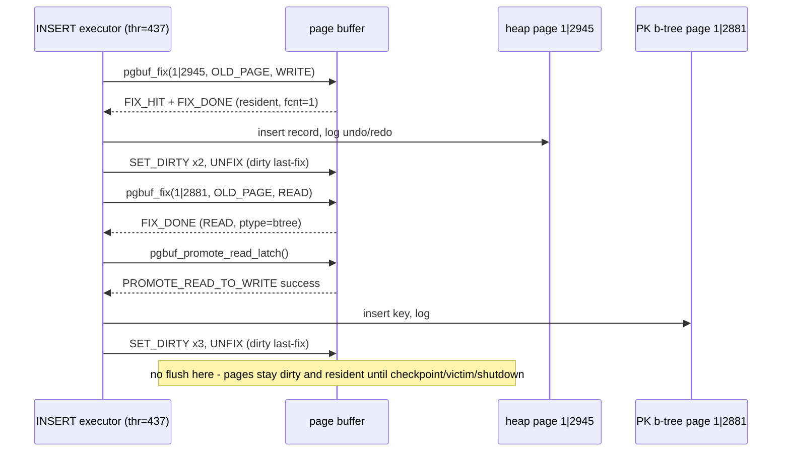

# Live page-buffer path monitoring: what simple SQLs actually do

This report answers one question with runtime evidence: **when a simple SQL statement runs, which
`page_buffer.c` paths fire, in what order, and how often?** Logging-only probes were inserted into the
page buffer, the server was started with whole-pool tracing enabled, a scripted workload of simple SQLs
was executed, and the resulting event stream was cut into per-statement sections and analyzed.

- Instrumented source: pinned revision `f799e05d77d5300c6ea5753b4a6cc7caee6d8912` **plus logging-only lab
  probes** in [`src/storage/page_buffer.c`](https://github.com/vimkim/cubrid/blob/75d64f959fae6074d4f21cfafc3d5a5bc4a8639a/src/storage/page_buffer.c)
  (branch `page-buffer-survey-with-tracers`, probe commit `75d64f959`; lab only, not for upstream).
- Driver: [`run-monitor.sh`](./run-monitor.sh). Raw event stream: [`trace-all.log`](./trace-all.log)
  (regenerated on each run).
- Build: debug (`debug_gcc` preset), `data_buffer_size=64M`, `checkpoint_interval=1min`, single csql
  session per statement, autocommit.
- Two independent runs were captured; every per-section counter except LRU-zone maintenance noise and the
  new promotion probe (absent in run 1) reproduced exactly. Numbers below are from the second run.

## 1. Probes

The committed quiz-12 tracer (`pgbuf_quiz_trace`, single-VPID mode) was generalized: setting
`CUBRID_PGBUF_TRACE_VPID=all` in the server environment traces **every** page, and each line carries a
monotonic timestamp and the thread entry index. New whole-pool-only probes were added at these points:

| Event | Probe location (function) | Meaning |
|---|---|---|
| `FIX_DONE` | success exit of `pgbuf_fix` (`pgbuf_fix_release`) | a fix succeeded; detail = fetch mode, latch mode, `-cond` for conditional, page type, resulting `fcnt` |
| `FIX_HIT` | lock-free and hash-hit paths of `pgbuf_fix` (existing) | the page was already resident |
| `READ_FROM_DISK` | `pgbuf_claim_bcb_for_fix` read branch (existing) | a miss that performed disk/DWB read |
| `NEW_PAGE_INIT` | `pgbuf_claim_bcb_for_fix` `NEW_PAGE` branch | a miss satisfied without any disk read |
| `UNFIX` | `pgbuf_unfix` entry | one release-debt repayment; detail = dirty/clean, `last-fix` when `fcnt` will reach 0 |
| `PROMOTE_READ_TO_WRITE` | `pgbuf_promote_read_latch` convergence point | READ→WRITE latch promotion, success or fail |
| `SET_DIRTY` | `pgbuf_bcb_set_dirty` (existing) | the page was marked dirty (event count, not unique pages) |
| `WAL_SYNC_BEFORE_WRITE` | `pgbuf_bcb_flush_with_wal`, immediately before `logpb_flush_log_for_wal` | WAL forced durable up to the copied page LSA before the data write |
| `FLUSHED_TO_DISK` | `pgbuf_bcb_flush_with_wal` completion (existing) | flush completed (direct write done or DWB slot accepted) |
| `ENTER_LRU` / `FALL_TO_ZONE3` / `BOOST_TO_TOP` / `EVICTED` | LRU maintenance (existing) | replacement-list movement |

Trace line format (whole-pool mode):

```text
#000149 962888.729343 thr=000 FIX_DONE 0|641 OLD_PAGE WRITE ptype=13 fcnt=1
   seq   monotonic-sec  thread  event   vol|page  detail
```

The driver appends `== MARK <step> ==` lines between statements, so every event is attributable to one
step. Sequence numbers restart with each server process; the monotonic clock does not.

## 2. Workload

| Step | Statement / action |
|---|---|
| `boot-1` | `cubrid server start` (recovery, daemons) |
| `create-table` | `CREATE TABLE t_mon (id INT PRIMARY KEY, val VARCHAR(64))` |
| `insert-one` | `INSERT INTO t_mon VALUES (1, md5(1))` |
| `insert-200` | one `INSERT ... SELECT` adding 200 rows |
| `shutdown-1` | `cubrid server stop` while dirty pages exist |
| `boot-2` | second start (clean restart) |
| `connect-only` | csql connects, `SELECT 1`, disconnects (session baseline) |
| `select-full-cold` | first full scan after restart |
| `select-full-hot` | the same full scan again |
| `select-pk` | `SELECT val FROM t_mon WHERE id = 42` (PK b-tree) |
| `update-one` | `UPDATE t_mon SET val = md5(id + 999) WHERE id = 42` |
| `checkpoint-wait` | idle until the checkpoint daemon runs (`checkpoint_interval=1min`) |
| `shutdown-2` | final stop, after the checkpoint |

## 3. Per-step event counts

| Step | FIX_DONE | FIX_HIT | READ_FROM_DISK | NEW_PAGE_INIT | PROMOTE | SET_DIRTY | WAL_SYNC | FLUSHED | UNFIX |
|---|---:|---:|---:|---:|---:|---:|---:|---:|---:|
| boot-1 | 1741 | 1683 | 58 | 0 | 0 | 0 | 0 | 0 | 1740 |
| create-table | 2201 | 2164 | 32 | 5 | 8 | 128 | 0 | 0 | 2201 |
| insert-one | 268 | 268 | 0 | 0 | 1 | 5 | 0 | 0 | 268 |
| insert-200 | 5161 | 5145 | 12 | 4 | 200 | 822 | 0 | 0 | 5161 |
| shutdown-1 | 60 | 60 | 0 | 0 | 0 | 22 | **39** | **39** | 61 |
| boot-2 | 1748 | 1690 | 58 | 0 | 0 | 0 | 0 | 0 | 1747 |
| connect-only | 190 | 190 | 0 | 0 | 0 | 0 | 0 | 0 | 190 |
| select-full-cold | 327 | 318 | **9** | 0 | 0 | 0 | 0 | 0 | 327 |
| select-full-hot | 248 | 248 | **0** | 0 | 0 | 0 | 0 | 0 | 248 |
| select-pk | 283 | 283 | 0 | 0 | 0 | 0 | 0 | 0 | 283 |
| update-one | 310 | 310 | 0 | 0 | 0 | 3 | 0 | 0 | 310 |
| checkpoint-wait | 2264 | 2264 | 0 | 0 | 0 | 2 | **1** | **3** | 2264 |
| shutdown-2 | 0 | 0 | 0 | 0 | 0 | 0 | 0 | 0 | 1 |

LRU maintenance events (`ENTER_LRU`, `FALL_TO_ZONE3`, `BOOST_TO_TOP`) are omitted from the table; no
`EVICTED` occurred anywhere — a 64M pool never came under replacement pressure from this workload.

## 4. Findings

### F1. The fix ledger closes exactly

In **every** section, `FIX_DONE = FIX_HIT + READ_FROM_DISK + NEW_PAGE_INIT`, and `UNFIX = FIX_DONE`
except for exactly one boot fix. Every successful acquisition converged to the same postcondition and
every release debt was repaid. The single exception is the vacuum-data page `0|641`
(`ptype=13`, `PAGE_VACUUM_DATA`), WRITE-fixed by the boot thread and held permanently:

```text
#000149 962888.729343 thr=000 FIX_DONE 0|641 OLD_PAGE WRITE ptype=13 fcnt=1   (never unfixed)
```

This is the runtime face of the "permanently held page" concept in the interface inventory.

### F2. A single-row INSERT costs ~268 fixes but dirties only 2 pages

`insert-one` performed 268 fixes, all buffer hits, but only 5 `SET_DIRTY` events on **2 distinct pages**:
the heap data page and the primary-key b-tree page. Everything else — catalog lookups, authorization,
statistics, volume validation — was read-only traffic. The mutation core:

```text
#013339 thr=437 FIX_DONE 1|2945 OLD_PAGE WRITE ptype=2 fcnt=1                 (heap page, direct WRITE fix)
#013363 thr=437 FIX_DONE 1|2945 OLD_PAGE_MAYBE_DEALLOCATED WRITE-cond ptype=2 (heap re-fix, conditional)
#013364 thr=437 SET_DIRTY 1|2945
#013365 thr=437 SET_DIRTY 1|2945
#013391 thr=437 PROMOTE_READ_TO_WRITE 1|2881 success                          (b-tree page)
#013392 thr=437 SET_DIRTY 1|2881   (x3)
```

### F3. The b-tree write path really is fix-READ-then-promote

The heap is WRITE-fixed directly, but the b-tree page is fixed with `OLD_PAGE READ` and then promoted:
`FIX_DONE ... READ ptype=10` → `PROMOTE_READ_TO_WRITE ... success` → `SET_DIRTY`. The counts are exact:
**1 promotion for 1 inserted row, 200 promotions for 200 inserted rows**, 0 promotions for the
non-indexed-column UPDATE. Without the promotion probe this looked like "a READ-fixed page got dirtied";
the promotion is invisible to fix/unfix accounting because it transfers the existing ownership in place.

### F4. Cold vs hot scan: misses disappear, and so does compile traffic

The first full scan after restart read **9 pages** from disk (the t_mon heap chain `1|2944–2950` plus its
b-tree root `1|2881` and one catalog b-tree `0|4033`); the immediate repeat read **0**. The repeat also
did 79 fewer fixes (327 → 248), and the per-type breakdown shows why: catalog-page fixes fell from 6 to 0
and b-tree fixes from 9 to 6 — consistent with plan/statistics caching skipping recompilation work
(observation plus source-consistent attribution, not a proven causal chain).

| FIX_DONE by page type | cold | hot |
|---|---:|---:|
| volume header (`ptype=3`) | 168 | 128 |
| volume bitmap (`ptype=4`) | 84 | 64 |
| heap (`ptype=2`) | 58 | 49 |
| b-tree (`ptype=10`) | 9 | 6 |
| catalog (`ptype=9`) | 6 | 0 |
| file table (`ptype=1`) | 2 | 1 |

Volume header/bitmap fixes dominate every statement in this **debug build**: fetch-time page validation
(`pgbuf_is_valid_page` → sector-reservation check) fixes the volume header and sector-table pages over and
over. Treat that 2:1 header:bitmap band as debug-build validation overhead, not as the intrinsic shape of
a release-build scan.

### F5. WAL-before-data is visible, page by page

At `shutdown-1` (dirty pool), the flush loop emitted a strict per-page pairing — 39 `WAL_SYNC_BEFORE_WRITE`,
39 `FLUSHED_TO_DISK`, always in that order, on the boot thread (`thr=000`):

```text
#029893 thr=000 WAL_SYNC_BEFORE_WRITE 1|1   page-lsa=9556|1344
#029894 thr=000 FLUSHED_TO_DISK      1|1
#029895 thr=000 WAL_SYNC_BEFORE_WRITE 0|193 page-lsa=9560|4696
#029896 thr=000 FLUSHED_TO_DISK      0|193
```

No data page was ever written before its log. The probe sits exactly at the `logpb_flush_log_for_wal`
call inside `pgbuf_bcb_flush_with_wal`, so the pairing is the WAL gate itself, not an inference.

### F6. Checkpoint flushes lazily and precisely — and volume headers are the unlogged exception

Nothing was flushed at UPDATE time. ~60s later the checkpoint daemon (`thr=445`) flushed exactly the
pages the UPDATE dirtied, then dirtied and flushed the volume headers `0|0` and `1|0` **without** a WAL
sync:

```text
#015881 thr=445 WAL_SYNC_BEFORE_WRITE 1|2945 page-lsa=9565|7840   (the updated heap page)
#015882 thr=445 FLUSHED_TO_DISK      1|2945
#015885 thr=445 SET_DIRTY 0|0                                     (volume header, checkpoint info)
#015886 thr=445 FLUSHED_TO_DISK      0|0                          (no WAL_SYNC: unlogged update path)
#015890 thr=445 SET_DIRTY 1|0
#015891 thr=445 FLUSHED_TO_DISK      1|0
```

That is the `LSA_ISNULL (&oldest_unflush_lsa)` branch of `pgbuf_bcb_flush_with_wal` (the
"flushing page to disk without logging" case) taken deliberately by checkpoint volume-header maintenance.
After the checkpoint, `shutdown-2` had **nothing to flush** — contrast with shutdown-1's 39 pages.

### F7. Even "doing nothing" has a page-buffer path

- `connect-only` (connect + `SELECT 1` + disconnect) costs **190 fixes** — session/authorization/catalog
  reads. Subtract this baseline before attributing fix counts to a statement's own work.
- `select-pk` fixed catalog b-trees (`0|897`, `0|4033`) during compilation before touching the t_mon
  b-tree `1|2881` (3 READ fixes: descent and key lookup) and the heap page — all hits, zero disk reads.
- During `checkpoint-wait`, 2264 fixes came from the `cubrid statdump` watcher polling every 2s: each
  poll is a client connection with its own catalog/volume traffic (~75 fixes). The observer is visible
  in the observation.
- Boot is deterministic here: boot-1 and boot-2 differ by ~7 fixes out of ~1745, with an identical
  58-page read set.

## 5. How a simple INSERT flows through the pool (observed sequence)



Text alternative: the executor WRITE-fixes the resident heap page, inserts and logs the record, marks it
dirty, and unfixes; then READ-fixes the b-tree page, promotes the latch to WRITE, inserts the key, marks
it dirty, and unfixes. No I/O happens at statement time; durability work is deferred to the WAL gate at
flush time.

## 6. Limits

- Debug build, single machine, single session: fix counts include debug validation overhead (F4) and no
  timing/latency conclusion is valid.
- The probes log only the listed events. Ordered watchers, victim assignment/direct victims, invalidation,
  and DWB internals are not probed; `FLUSHED_TO_DISK` does not distinguish the direct-write path from DWB
  slot acceptance.
- Page ids (`1|2945` etc.) and exact counts are run-specific; the *shape* (pairings, ratios, zeros) is the
  reproducible claim, and it reproduced across two runs.
- The instrumented binary differs from the pinned revision by these logging probes; all control-flow
  claims still cite the unmodified pinned source.

## 7. Reproduce

```bash
# instrumented build (branch page-buffer-survey-with-tracers) installed, CUBRID env loaded;
# point CUBRID_SRC at that cubrid worktree
CUBRID_SRC=/path/to/cubrid-worktree bash run-monitor.sh   # ~6-10 min, prints the per-step summary
```

The single-page tracer for one VPID (quiz 12 format) remains available via
`CUBRID_PGBUF_TRACE_VPID="<volid>|<pageid>"`; see
[`quizzes/12-trace-a-page-journey`](https://github.com/vimkim/cubrid/blob/75d64f959fae6074d4f21cfafc3d5a5bc4a8639a/quizzes/12-trace-a-page-journey/README.md).
The Korean presentation integrates these results in its evidence sections:
[`CUBRID_PAGE_BUFFER_PRESENTATION_KO.md`](../../CUBRID_PAGE_BUFFER_PRESENTATION_KO.md).
